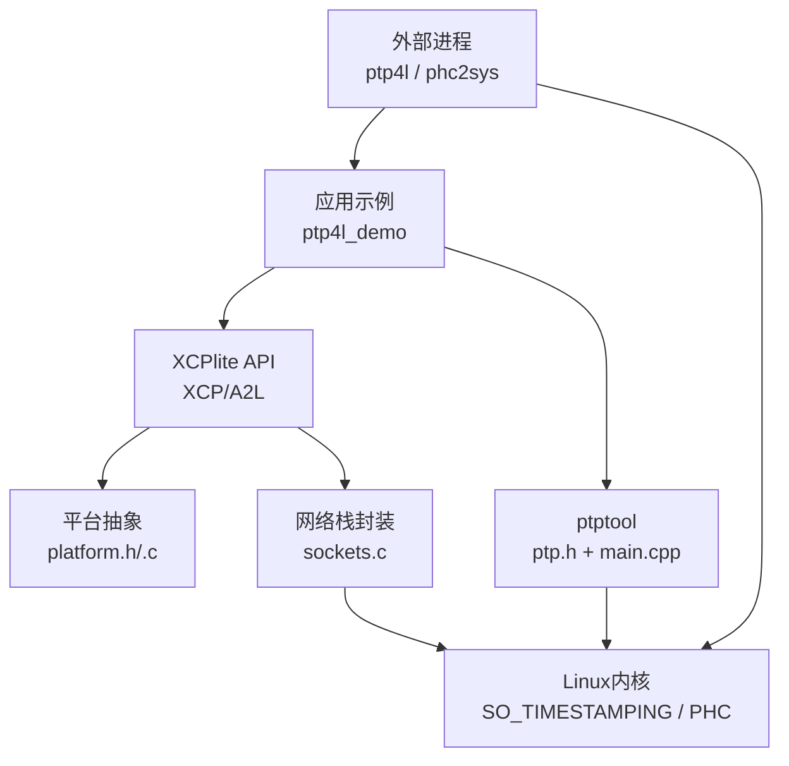
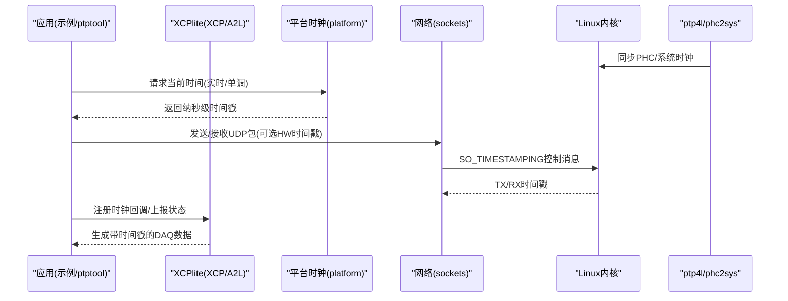
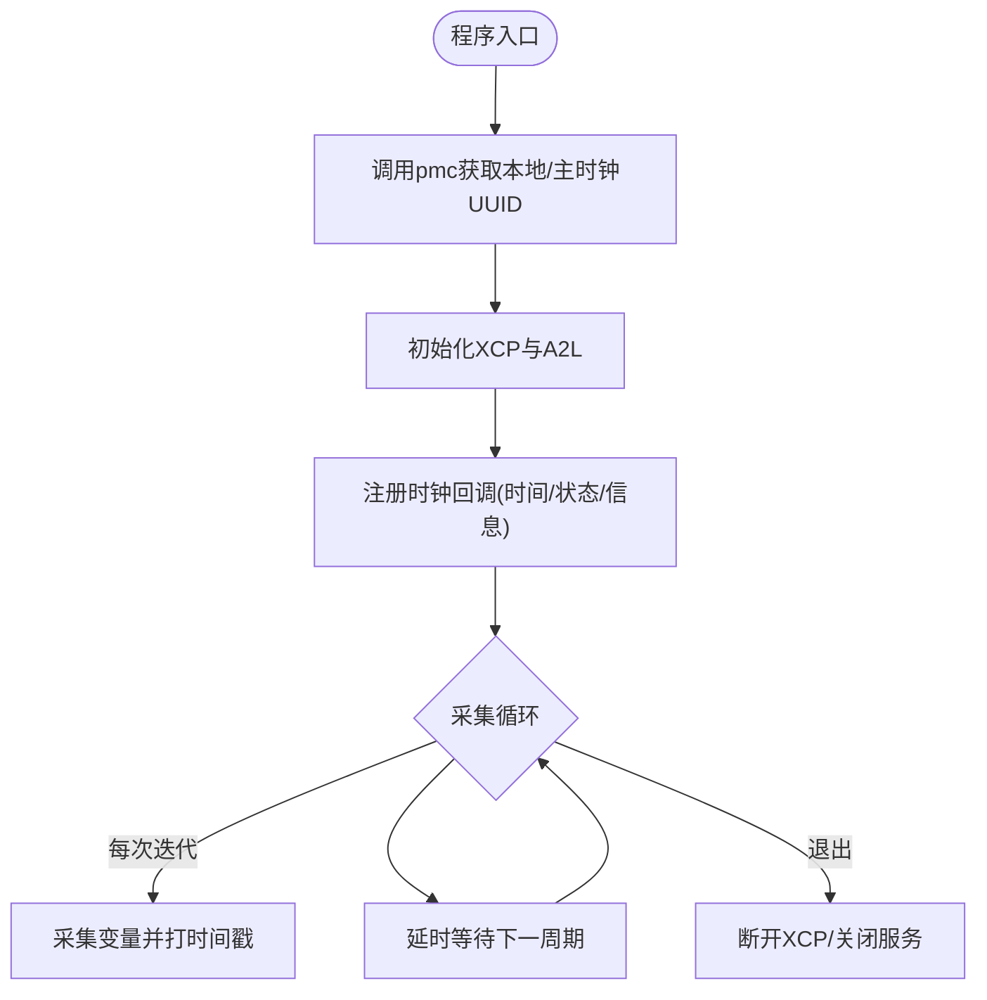
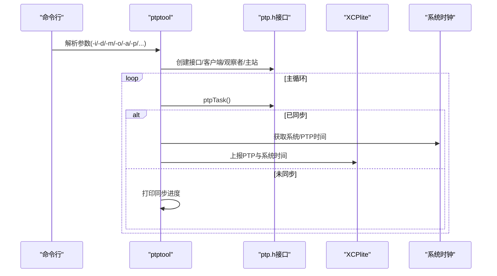
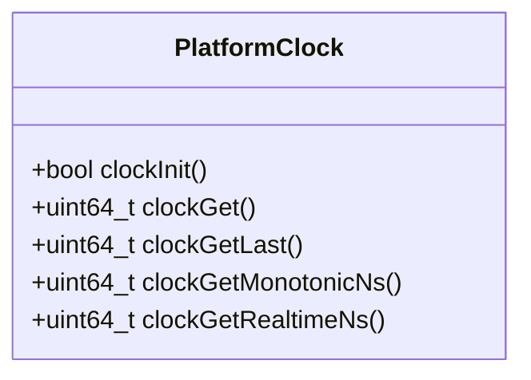
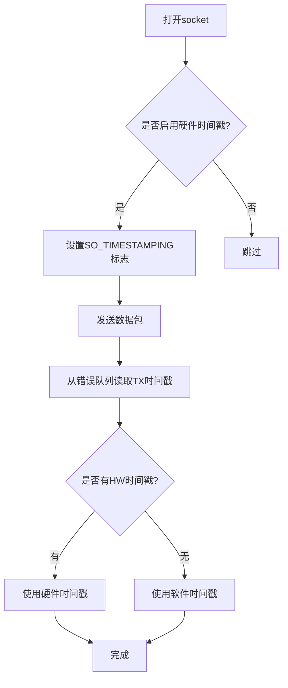
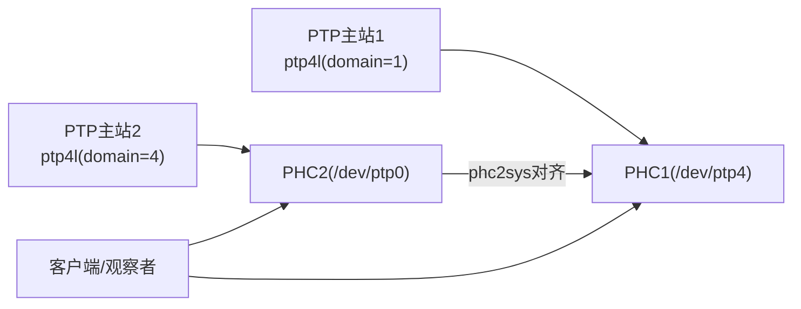
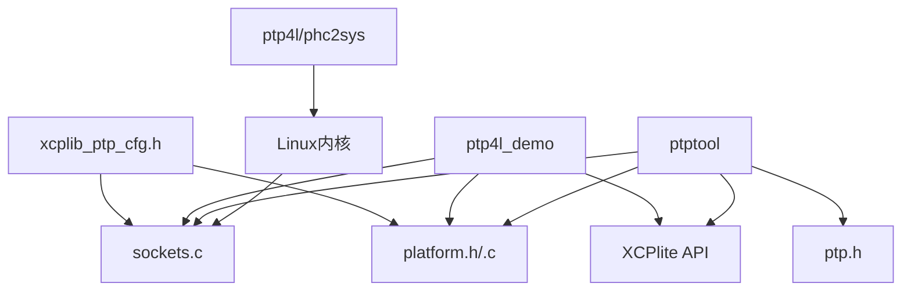

# PTP时间同步

<cite>
**本文引用的文件**
- [src/xcplib_ptp_cfg.h](file://src/xcplib_ptp_cfg.h)
- [examples/ptp4l_demo/src/main.cpp](file://examples/ptp4l_demo/src/main.cpp)
- [tools/ptptool/src/main.cpp](file://tools/ptptool/src/main.cpp)
- [tools/ptptool/src/ptp/ptp.h](file://tools/ptptool/src/ptp/ptp.h)
- [tools/ptptool/start_ptp_masters.sh](file://tools/ptptool/start_ptp_masters.sh)
- [src/platform.h](file://src/platform.h)
- [src/platform.c](file://src/platform.c)
- [src/sockets.c](file://src/sockets.c)
</cite>

## 目录
1. [简介](#简介)
2. [项目结构](#项目结构)
3. [核心组件](#核心组件)
4. [架构总览](#架构总览)
5. [详细组件分析](#详细组件分析)
6. [依赖关系分析](#依赖关系分析)
7. [性能考虑](#性能考虑)
8. [故障排查指南](#故障排查指南)
9. [结论](#结论)
10. [附录](#附录)

## 简介
本技术文档围绕精确时间协议（PTP，IEEE 1588）在XCP测量中的应用展开，重点说明：
- 高精度时间戳获取与时间源配置
- ptp4l工具部署、主从角色分配、网络拓扑与同步参数调优
- 时间戳处理机制、时钟漂移补偿与同步质量评估
- 不同硬件平台的PTP支持、驱动配置与性能优化策略
- 完整测试验证流程、问题诊断方法与最佳实践
- 精度基准测试思路与调优案例

本项目通过XCPlite库提供统一的时钟抽象与XCP DAQ能力，结合Linux内核的socket硬件时间戳与linuxptp（ptp4l/phc2sys）实现端到端的高精度时间同步。示例应用展示了如何将PTP同步后的系统实时时钟接入XCP，从而为DAQ数据打上可溯源的高精度时间戳。

## 项目结构
与PTP时间同步相关的代码主要分布在以下位置：
- 配置层：启用硬件时间戳与PTP相关编译选项
- 平台抽象层：统一时钟接口（单调/实时）、线程/互斥等
- 网络层：UDP/TCP socket封装与Linux硬件时间戳收发
- 工具层：内置PTP客户端/主站/观察者以及XCP集成
- 示例层：演示将PTP同步时钟接入XCP进行数据采集

图示来源
- [examples/ptp4l_demo/src/main.cpp:150-190](file://examples/ptp4l_demo/src/main.cpp#L150-L190)
- [tools/ptptool/src/main.cpp:430-498](file://tools/ptptool/src/main.cpp#L430-L498)
- [src/platform.c:573-654](file://src/platform.c#L573-L654)
- [src/sockets.c:373-427](file://src/sockets.c#L373-L427)
- [tools/ptptool/start_ptp_masters.sh:10-38](file://tools/ptptool/start_ptp_masters.sh#L10-L38)

章节来源
- [src/xcplib_ptp_cfg.h:1-31](file://src/xcplib_ptp_cfg.h#L1-L31)
- [examples/ptp4l_demo/src/main.cpp:1-209](file://examples/ptp4l_demo/src/main.cpp#L1-L209)
- [tools/ptptool/src/main.cpp:1-617](file://tools/ptptool/src/main.cpp#L1-L617)
- [tools/ptptool/src/ptp/ptp.h:1-103](file://tools/ptptool/src/ptp/ptp.h#L1-L103)
- [src/platform.h:74-86](file://src/platform.h#L74-L86)
- [src/platform.c:435-654](file://src/platform.c#L435-L654)
- [src/sockets.c:304-443](file://src/sockets.c#L304-L443)
- [src/sockets.c:1600-1708](file://src/sockets.c#L1600-L1708)
- [tools/ptptool/start_ptp_masters.sh:1-56](file://tools/ptptool/start_ptp_masters.sh#L1-L56)

## 核心组件
- 配置开关与平台要求
  - 启用Linux socket硬件时间戳以支持PTP工具链
  - 要求具备支持硬件时间戳的网卡与内核（如Intel i210/i350、树莓派5等）
- 平台时钟抽象
  - 提供单调时钟与实时时钟接口，支持ns/us分辨率
  - 支持可选的“任意纪元”或“PTP纪元”模式
- 网络与时间戳
  - 基于UDP/TCP的socket封装
  - Linux下通过SO_TIMESTAMPING获取硬件/软件时间戳
  - 发送路径从错误队列读取TX时间戳
- PTP工具与XCP集成
  - 内置PTP客户端/主站/观察者，可与XCP协同工作
  - 示例应用注册回调，向XCP暴露PTP同步时钟与状态信息

章节来源
- [src/xcplib_ptp_cfg.h:1-31](file://src/xcplib_ptp_cfg.h#L1-L31)
- [src/platform.h:74-86](file://src/platform.h#L74-L86)
- [src/platform.c:505-654](file://src/platform.c#L505-L654)
- [src/sockets.c:373-427](file://src/sockets.c#L373-L427)
- [src/sockets.c:1600-1708](file://src/sockets.c#L1600-L1708)
- [tools/ptptool/src/ptp/ptp.h:12-40](file://tools/ptptool/src/ptp/ptp.h#L12-L40)
- [tools/ptptool/src/main.cpp:76-174](file://tools/ptptool/src/main.cpp#L76-L174)

## 架构总览
下图展示PTP时间同步在XCP测量中的整体架构：外部ptp4l/phc2sys进程负责与网络PTP主站同步并校准系统时钟；应用通过平台时钟接口获取高精度时间；XCP DAQ使用这些时间戳对采集数据进行标注；ptptool可作为辅助工具用于观察/测试。

图示来源
- [tools/ptptool/start_ptp_masters.sh:10-38](file://tools/ptptool/start_ptp_masters.sh#L10-L38)
- [src/platform.c:573-654](file://src/platform.c#L573-L654)
- [src/sockets.c:373-427](file://src/sockets.c#L373-L427)
- [src/sockets.c:1600-1708](file://src/sockets.c#L1600-L1708)
- [examples/ptp4l_demo/src/main.cpp:144-190](file://examples/ptp4l_demo/src/main.cpp#L144-L190)
- [tools/ptptool/src/main.cpp:430-498](file://tools/ptptool/src/main.cpp#L430-L498)

## 详细组件分析

### 组件A：ptp4l_demo（将PTP同步时钟接入XCP）
- 功能要点
  - 通过pmc命令解析本地与主时钟UUID，便于XCP侧标识时间源
  - 注册XCP时钟回调：获取当前时间、时钟状态、时钟信息（纪元/层级）
  - 初始化XCP以太网服务器与A2L生成，周期性采集并附带时间戳
- 关键流程
  - 启动时获取PTP时钟身份
  - 注册回调后启动XCP服务
  - 循环中采集变量并输出

图示来源
- [examples/ptp4l_demo/src/main.cpp:41-94](file://examples/ptp4l_demo/src/main.cpp#L41-L94)
- [examples/ptp4l_demo/src/main.cpp:99-149](file://examples/ptp4l_demo/src/main.cpp#L99-L149)
- [examples/ptp4l_demo/src/main.cpp:157-209](file://examples/ptp4l_demo/src/main.cpp#L157-L209)

章节来源
- [examples/ptp4l_demo/src/main.cpp:1-209](file://examples/ptp4l_demo/src/main.cpp#L1-L209)

### 组件B：ptptool（PTP客户端/主站/观察者与XCP集成）
- 功能要点
  - 支持PTP客户端模式（与外部主站同步）、主站模式（模拟PTP主）、观察者模式（监听多主）
  - 可选择性启用XCP，将PTP同步时钟注入XCP，用于稳定性测试与观测
  - 命令行参数丰富：接口、域号、日志级别、主站间隔/偏移/抖动等
- 关键流程
  - 创建PTP接口
  - 根据模式创建客户端/观察者/主站
  - 在主循环中轮询PTP任务，输出PTP与系统时间对比，并通过XCP上报

图示来源
- [tools/ptptool/src/main.cpp:216-418](file://tools/ptptool/src/main.cpp#L216-L418)
- [tools/ptptool/src/main.cpp:430-546](file://tools/ptptool/src/main.cpp#L430-L546)
- [tools/ptptool/src/main.cpp:548-617](file://tools/ptptool/src/main.cpp#L548-L617)
- [tools/ptptool/src/ptp/ptp.h:53-103](file://tools/ptptool/src/ptp/ptp.h#L53-L103)

章节来源
- [tools/ptptool/src/main.cpp:1-617](file://tools/ptptool/src/main.cpp#L1-L617)
- [tools/ptptool/src/ptp/ptp.h:1-103](file://tools/ptptool/src/ptp/ptp.h#L1-L103)

### 组件C：平台时钟与时间源（platform.h/.c）
- 功能要点
  - 提供单调时钟与实时时钟接口，支持ns/us分辨率
  - 支持两种纪元模式：任意纪元（ARB）与PTP纪元（REALTIME），由编译选项决定
  - 在POSIX平台上分别访问CLOCK_MONOTONIC_RAW/CLOCK_REALTIME等
- 关键点
  - 初始化时记录初始值，后续通过clockGetLast减少系统调用开销
  - 在Windows平台通过性能计数器映射到目标分辨率

图示来源
- [src/platform.h:470-506](file://src/platform.h#L470-L506)
- [src/platform.c:573-654](file://src/platform.c#L573-L654)
- [src/platform.c:657-800](file://src/platform.c#L657-L800)

章节来源
- [src/platform.h:74-86](file://src/platform.h#L74-L86)
- [src/platform.c:435-654](file://src/platform.c#L435-L654)
- [src/platform.c:657-800](file://src/platform.c#L657-L800)

### 组件D：网络与硬件时间戳（sockets.c）
- 功能要点
  - 在Linux上通过SO_TIMESTAMPING启用硬件/软件时间戳
  - 发送路径从错误队列读取TX时间戳（硬件优先，软件回退）
  - 支持绑定设备、禁止分片等优化
- 关键点
  - 仅在开启OPTION_SOCKET_HW_TIMESTAMPS时启用硬件时间戳
  - 非Linux平台不返回硬件时间戳

图示来源
- [src/sockets.c:373-427](file://src/sockets.c#L373-L427)
- [src/sockets.c:1600-1708](file://src/sockets.c#L1600-L1708)

章节来源
- [src/sockets.c:304-443](file://src/sockets.c#L304-L443)
- [src/sockets.c:1600-1708](file://src/sockets.c#L1600-L1708)

### 组件E：ptp4l部署与主从拓扑（start_ptp_masters.sh）
- 功能要点
  - 启动多个PTP主站（不同网卡/域），并通过phc2sys对齐PHC
  - 提供清理脚本，确保进程退出时资源释放
- 关键点
  - 不同网卡对应不同/dev/ptpX设备与domainNumber
  - 可通过日志级别与verbose调整调试信息量

图示来源
- [tools/ptptool/start_ptp_masters.sh:10-38](file://tools/ptptool/start_ptp_masters.sh#L10-L38)

章节来源
- [tools/ptptool/start_ptp_masters.sh:1-56](file://tools/ptptool/start_ptp_masters.sh#L1-L56)

## 依赖关系分析
- 编译期依赖
  - 需要定义OPTION_SOCKET_HW_TIMESTAMPS以启用Linux硬件时间戳
  - 平台头文件包含xcplib_cfg.h以获取编译选项
- 运行期依赖
  - Linux内核需支持SO_TIMESTAMPING与网卡驱动的时间戳能力
  - 外部进程ptp4l/phc2sys需正确配置并运行
- 模块耦合
  - 应用示例依赖平台时钟与XCP API
  - ptptool同时依赖PTP实现与XCP（可选）
  - sockets.c与platform.c为底层支撑，被上层复用

图示来源
- [src/xcplib_ptp_cfg.h:1-31](file://src/xcplib_ptp_cfg.h#L1-L31)
- [src/platform.h:74-86](file://src/platform.h#L74-L86)
- [src/sockets.c:373-427](file://src/sockets.c#L373-L427)
- [examples/ptp4l_demo/src/main.cpp:150-190](file://examples/ptp4l_demo/src/main.cpp#L150-L190)
- [tools/ptptool/src/main.cpp:430-498](file://tools/ptptool/src/main.cpp#L430-L498)
- [tools/ptptool/src/ptp/ptp.h:12-40](file://tools/ptptool/src/ptp/ptp.h#L12-L40)

章节来源
- [src/xcplib_ptp_cfg.h:1-31](file://src/xcplib_ptp_cfg.h#L1-L31)
- [src/platform.h:74-86](file://src/platform.h#L74-L86)
- [src/sockets.c:373-427](file://src/sockets.c#L373-L427)
- [examples/ptp4l_demo/src/main.cpp:150-190](file://examples/ptp4l_demo/src/main.cpp#L150-L190)
- [tools/ptptool/src/main.cpp:430-498](file://tools/ptptool/src/main.cpp#L430-L498)
- [tools/ptptool/src/ptp/ptp.h:12-40](file://tools/ptptool/src/ptp/ptp.h#L12-L40)

## 性能考虑
- 时间戳路径选择
  - 优先使用硬件时间戳，其次软件时间戳；避免频繁系统调用，利用clockGetLast缓存最近值
- 网络传输优化
  - 禁用UDP分片，避免丢包重传引入抖动
  - 合理设置MTU与路径MTU发现，减少重组开销
- PTP参数调优
  - 主站announce/sync间隔影响带宽与收敛速度
  - 偏移/漂移/抖动参数用于仿真与压力测试
- 平台差异
  - POSIX平台CLOCK_MONOTONIC_RAW更稳定；REALTIME受NTP/PTP校正影响
  - Windows通过性能计数器映射到目标分辨率

[本节为通用指导，不直接分析具体文件]

## 故障排查指南
- 无法获取硬件时间戳
  - 检查是否定义了OPTION_SOCKET_HW_TIMESTAMPS且网卡驱动支持
  - 确认socket已启用SO_TIMESTAMPING
- PTP未同步
  - 检查ptp4l/phc2sys进程是否运行、域号与接口是否正确
  - 使用ptptool观察者模式查看多主状态
- 时间戳异常
  - 核对epoch配置（ARB vs REALTIME）
  - 对比系统时间与PTP时间，观察偏差趋势
- 日志与调试
  - 提高ptptool与XCP日志级别，定位问题阶段
  - 使用start_ptp_masters.sh快速搭建主站环境

章节来源
- [src/sockets.c:373-427](file://src/sockets.c#L373-L427)
- [src/sockets.c:1600-1708](file://src/sockets.c#L1600-L1708)
- [tools/ptptool/src/main.cpp:216-418](file://tools/ptptool/src/main.cpp#L216-L418)
- [tools/ptptool/start_ptp_masters.sh:10-38](file://tools/ptptool/start_ptp_masters.sh#L10-L38)

## 结论
通过将PTP同步后的系统实时时钟接入XCPlite，可在XCP测量中获得高精度、可溯源的时间戳。借助ptp4l/phc2sys与Linux内核的硬件时间戳能力，配合合理的网络与参数调优，可实现稳定的亚微秒级同步精度。ptptool提供了灵活的客户端/主站/观察者能力，便于验证与诊断。建议在工程化部署中明确主从拓扑、域划分与日志策略，并结合基准测试持续优化。

[本节为总结性内容，不直接分析具体文件]

## 附录
- 构建与编译
  - 在Linux上启用OPTION_SOCKET_HW_TIMESTAMPS以支持硬件时间戳
  - 示例与工具均基于CMake构建，遵循仓库默认配置
- 运行步骤（参考）
  - 启动外部ptp4l/phc2sys进程，建立PTP主从关系
  - 运行ptp4l_demo或ptptool，注册XCP时钟回调并采集数据
  - 使用CANape或其他XCP客户端查看带时间戳的DAQ数据
- 基准测试建议
  - 对比系统单调时钟与PTP实时时钟，统计偏差分布
  - 在不同sync/announce间隔下评估收敛速度与抖动
  - 在启用/禁用硬件时间戳条件下对比延迟与稳定性

[本节为补充信息，不直接分析具体文件]