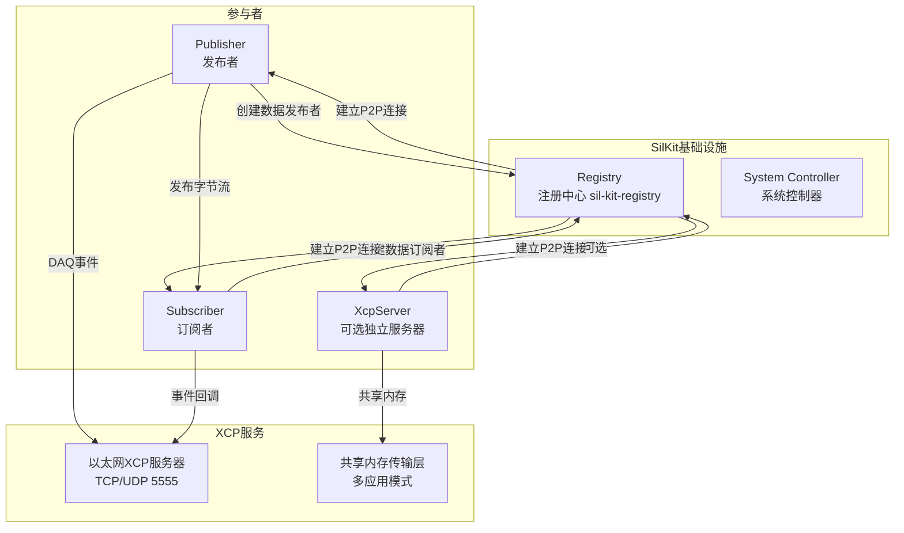
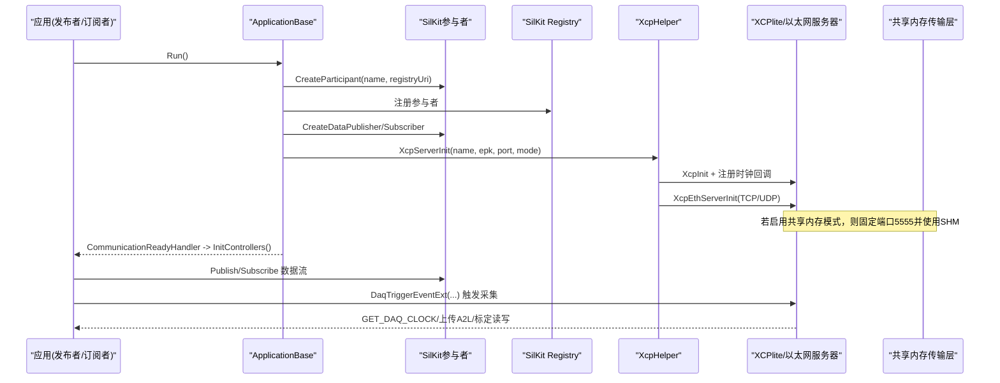
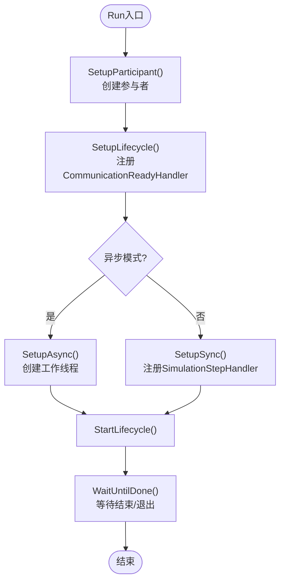
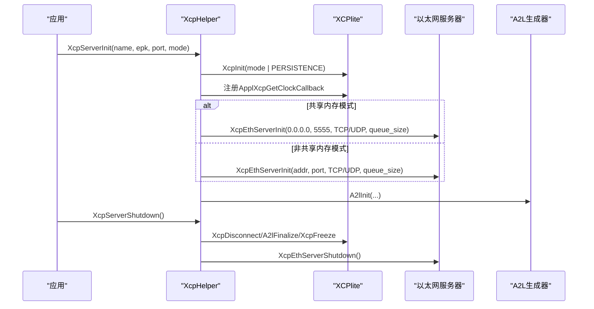
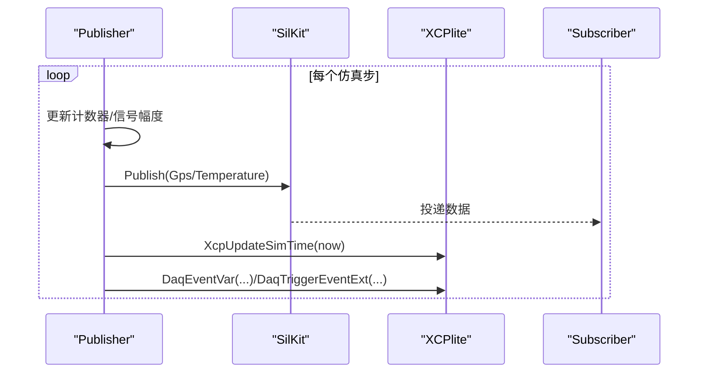
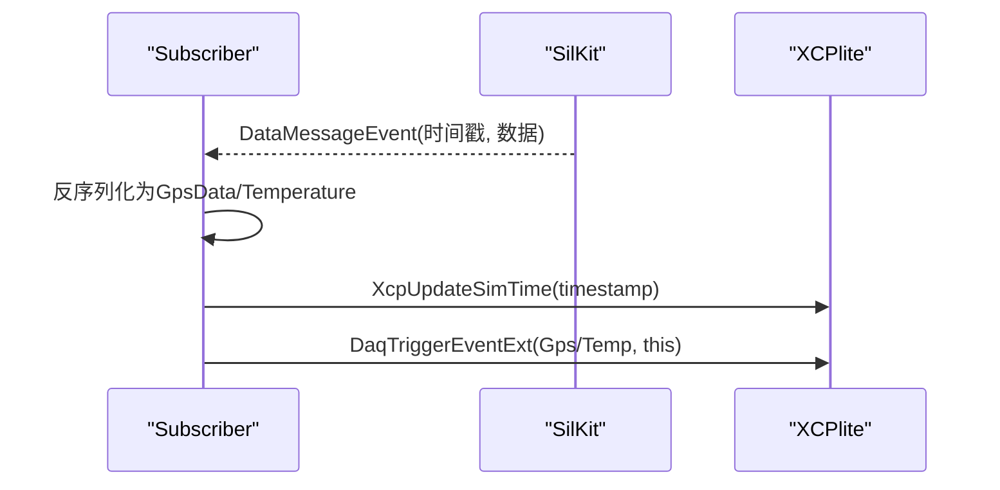
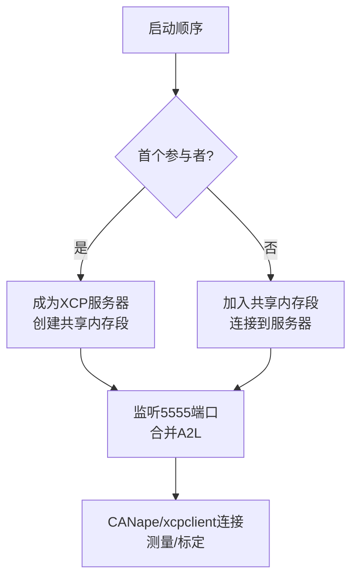
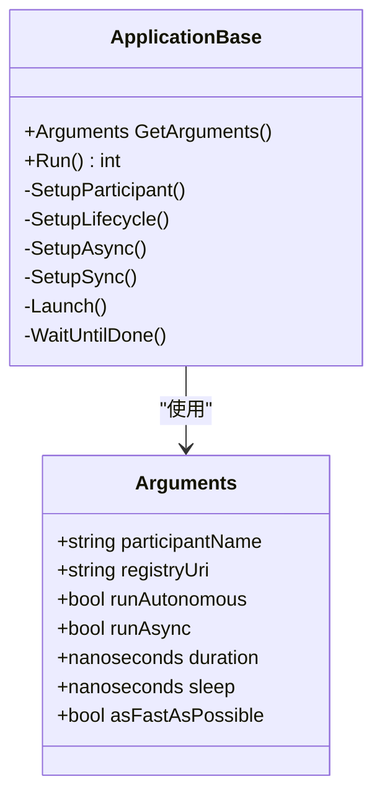
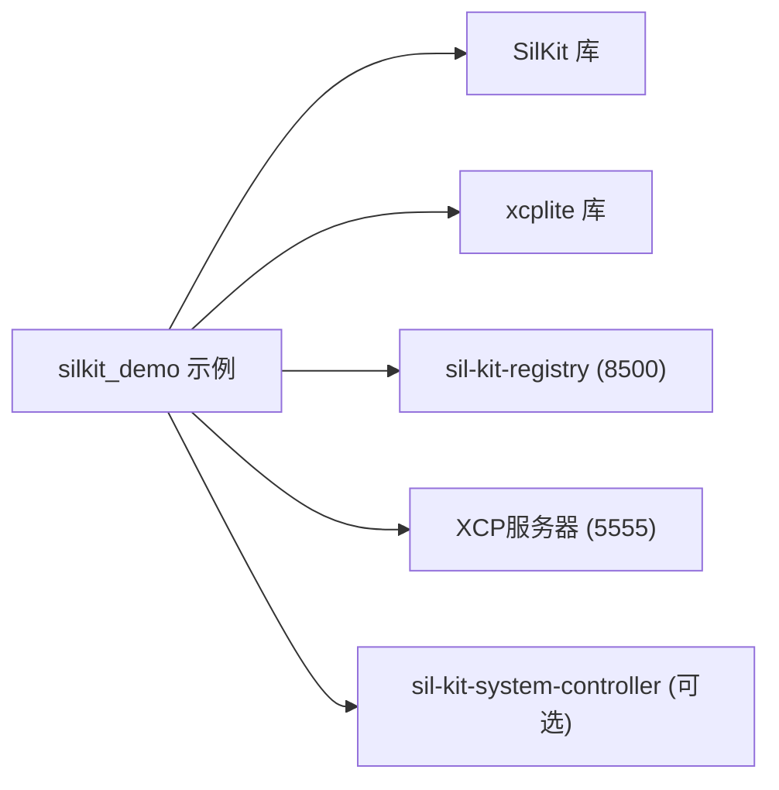

# SilKit分布式系统

<cite>
**本文引用的文件**
- [examples/silkit_demo/README.md](file://examples/silkit_demo/README.md)
- [examples/silkit_demo/CMakeLists.txt](file://examples/silkit_demo/CMakeLists.txt)
- [examples/silkit_demo/silkit_participant_cfg.json](file://examples/silkit_demo/silkit_participant_cfg.json)
- [examples/silkit_demo/include/ApplicationBase.hpp](file://examples/silkit_demo/include/ApplicationBase.hpp)
- [examples/silkit_demo/include/XcpHelper.hpp](file://examples/silkit_demo/include/XcpHelper.hpp)
- [examples/silkit_demo/src/PublisherDemo.cpp](file://examples/silkit_demo/src/PublisherDemo.cpp)
- [examples/silkit_demo/src/SubscriberDemo.cpp](file://examples/silkit_demo/src/SubscriberDemo.cpp)
- [examples/silkit_demo/src/XcpServer.cpp](file://examples/silkit_demo/src/XcpServer.cpp)
- [src/xcplite.h](file://src/xcplite.h)
- [src/xcpethserver.h](file://src/xcpethserver.h)
- [src/xcplib_cfg.h](file://src/xcplib_cfg.h)
- [docs/SHM.md](file://docs/SHM.md)
- [docs/TECHNICAL.md](file://docs/TECHNICAL.md)
- [docs/XCP_INTRODUCTION.md](file://docs/XCP_INTRODUCTION.md)
</cite>

## 目录
1. [简介](#简介)
2. [项目结构](#项目结构)
3. [核心组件](#核心组件)
4. [架构总览](#架构总览)
5. [详细组件分析](#详细组件分析)
6. [依赖关系分析](#依赖关系分析)
7. [性能与资源特性](#性能与资源特性)
8. [故障排查指南](#故障排查指南)
9. [结论](#结论)
10. [附录：开发与测试指南](#附录：开发与测试指南)

## 简介
本文件面向在SilKit仿真环境中集成XCPlite的工程师，系统性说明发布者-订阅者（Pub/Sub）数据流、XCP测量与标定在分布式多参与者中的部署模式、配置与运行机制。重点覆盖：
- XCP服务器在单节点/多应用共享内存模式下的部署策略
- 基于SilKit参与者的注册与服务发现、时间同步与异步运行模式
- 发布者侧时间触发采集、订阅者侧事件触发采集的数据分发与状态同步
- A2L生成、EPK版本管理与跨进程A2L合并
- 网络拓扑、端口与通信协议（TCP/UDP）、共享内存传输层
- 构建、运行、验证与调试流程，以及扩展开发建议

## 项目结构
silkit_demo示例展示了如何将XCPlite与SilKit结合，提供三个可执行体：
- SilKitDemoPublisher：发布GPS与温度等数据，并暴露测量点供XCP采集
- SilKitDemoSubscriber：订阅上述数据，并在收到消息时触发XCP采集
- SilKitXcpServer：可选的独立XCP服务器参与者；默认采用“首个参与者成为服务器”的自动模式

图表来源
- [examples/silkit_demo/README.md:266-283](file://examples/silkit_demo/README.md#L266-L283)
- [examples/silkit_demo/src/PublisherDemo.cpp:49-74](file://examples/silkit_demo/src/PublisherDemo.cpp#L49-L74)
- [examples/silkit_demo/src/SubscriberDemo.cpp:30-83](file://examples/silkit_demo/src/SubscriberDemo.cpp#L30-L83)
- [examples/silkit_demo/src/XcpServer.cpp:30-39](file://examples/silkit_demo/src/XcpServer.cpp#L30-L39)

章节来源
- [examples/silkit_demo/README.md:1-50](file://examples/silkit_demo/README.md#L1-L50)
- [examples/silkit_demo/CMakeLists.txt:1-102](file://examples/silkit_demo/CMakeLists.txt#L1-L102)

## 核心组件
- ApplicationBase：封装SilKit参与者生命周期、命令行参数解析、日志与时间同步/异步工作线程管理
- XcpHelper：封装XCPlite初始化、时钟回调注入、A2L生成与服务器启停
- Publisher/Subscriber：实现具体业务逻辑，通过SilKit DataPublisher/DataSubscriber进行数据收发，并通过XCP DAQ事件暴露测量值
- XcpServer：可选的独立XCP服务器参与者，用于集中式XCP接入
- XCPlite库：提供XCP协议栈、以太网服务器、共享内存传输层、A2L生成与持久化

章节来源
- [examples/silkit_demo/include/ApplicationBase.hpp:47-130](file://examples/silkit_demo/include/ApplicationBase.hpp#L47-L130)
- [examples/silkit_demo/include/XcpHelper.hpp:63-116](file://examples/silkit_demo/include/XcpHelper.hpp#L63-L116)
- [examples/silkit_demo/src/PublisherDemo.cpp:27-74](file://examples/silkit_demo/src/PublisherDemo.cpp#L27-L74)
- [examples/silkit_demo/src/SubscriberDemo.cpp:9-83](file://examples/silkit_demo/src/SubscriberDemo.cpp#L9-L83)
- [examples/silkit_demo/src/XcpServer.cpp:11-39](file://examples/silkit_demo/src/XcpServer.cpp#L11-L39)
- [src/xcplite.h:46-108](file://src/xcplite.h#L46-L108)
- [src/xcpethserver.h:19-34](file://src/xcpethserver.h#L19-L34)

## 架构总览
下图展示SilKit参与者与XCPlite在分布式环境中的交互：参与者通过SilKit Registry完成服务发现与P2P连接；数据通过Topic通道直接点对点传输；XCP服务器负责对外暴露测量与标定接口，支持TCP/UDP或共享内存模式。

图表来源
- [examples/silkit_demo/include/ApplicationBase.hpp:392-468](file://examples/silkit_demo/include/ApplicationBase.hpp#L392-L468)
- [examples/silkit_demo/include/XcpHelper.hpp:85-107](file://examples/silkit_demo/include/XcpHelper.hpp#L85-L107)
- [examples/silkit_demo/src/PublisherDemo.cpp:147-162](file://examples/silkit_demo/src/PublisherDemo.cpp#L147-L162)
- [examples/silkit_demo/src/SubscriberDemo.cpp:119-135](file://examples/silkit_demo/src/SubscriberDemo.cpp#L119-L135)
- [examples/silkit_demo/src/XcpServer.cpp:30-39](file://examples/silkit_demo/src/XcpServer.cpp#L30-L39)

## 详细组件分析

### ApplicationBase：参与者生命周期与工作模式
- 负责创建参与者、生命周期服务、时间同步服务或异步工作线程
- 支持两种运行模式：
  - 时间同步模式：通过ITimeSyncService以固定步长调用DoWorkSync(now)，now为虚拟仿真时间
  - 异步模式：在独立工作线程循环调用DoWorkAsync()
- 命令行参数控制：名称、注册中心URI、日志级别、配置文件路径、是否异步、是否自主启动、步长时间、是否尽可能快、每周期休眠时长
- 配置文件加载：支持JSON/YAML配置文件，或通过命令行动态构造配置字符串

图表来源
- [examples/silkit_demo/include/ApplicationBase.hpp:554-584](file://examples/silkit_demo/include/ApplicationBase.hpp#L554-L584)
- [examples/silkit_demo/include/ApplicationBase.hpp:392-468](file://examples/silkit_demo/include/ApplicationBase.hpp#L392-L468)

章节来源
- [examples/silkit_demo/include/ApplicationBase.hpp:29-130](file://examples/silkit_demo/include/ApplicationBase.hpp#L29-L130)
- [examples/silkit_demo/include/ApplicationBase.hpp:133-357](file://examples/silkit_demo/include/ApplicationBase.hpp#L133-L357)
- [examples/silkit_demo/include/ApplicationBase.hpp:359-512](file://examples/silkit_demo/include/ApplicationBase.hpp#L359-L512)

### XcpHelper：XCP服务器初始化与时钟集成
- 设置日志级别、初始化XCP（支持本地/共享内存/自动选择服务器/专用服务器模式）
- 注册时钟回调，将SilKit虚拟仿真时间注入到XCP DAQ时间戳中；异步模式下回退到steady_clock
- 初始化以太网XCP服务器（TCP/UDP），并初始化A2L生成器
- 提供优雅关闭：断开客户端、最终化A2L、冻结校准段、停止服务器

图表来源
- [examples/silkit_demo/include/XcpHelper.hpp:26-61](file://examples/silkit_demo/include/XcpHelper.hpp#L26-L61)
- [examples/silkit_demo/include/XcpHelper.hpp:63-116](file://examples/silkit_demo/include/XcpHelper.hpp#L63-L116)

章节来源
- [examples/silkit_demo/include/XcpHelper.hpp:26-116](file://examples/silkit_demo/include/XcpHelper.hpp#L26-L116)

### 发布者（Publisher）：时间触发采集与数据发布
- 在CreateControllers中创建数据发布者，定义A2L类型与标定段
- DoWorkSync中按仿真步长发布GPS与温度数据，并触发DAQ事件，使用虚拟仿真时间作为时间戳
- 支持通过CalSeg对可调参数进行线程安全访问与持久化

图表来源
- [examples/silkit_demo/src/PublisherDemo.cpp:49-74](file://examples/silkit_demo/src/PublisherDemo.cpp#L49-L74)
- [examples/silkit_demo/src/PublisherDemo.cpp:80-137](file://examples/silkit_demo/src/PublisherDemo.cpp#L80-L137)

章节来源
- [examples/silkit_demo/src/PublisherDemo.cpp:27-162](file://examples/silkit_demo/src/PublisherDemo.cpp#L27-L162)

### 订阅者（Subscriber）：事件触发采集与数据接收
- 在CreateControllers中创建数据订阅者，注册回调函数处理到达消息
- 回调中反序列化数据，更新XCP虚拟时间并触发DAQ事件，从而暴露接收到的测量值
- 同样支持相对地址模式与typedef实例关联

图表来源
- [examples/silkit_demo/src/SubscriberDemo.cpp:30-83](file://examples/silkit_demo/src/SubscriberDemo.cpp#L30-L83)
- [examples/silkit_demo/src/SubscriberDemo.cpp:89-108](file://examples/silkit_demo/src/SubscriberDemo.cpp#L89-L108)

章节来源
- [examples/silkit_demo/src/SubscriberDemo.cpp:9-135](file://examples/silkit_demo/src/SubscriberDemo.cpp#L9-L135)

### XCP服务器部署模式与共享内存机制
- 三种部署模式：
  - 每个参与者独立XCP服务器（不同端口）
  - 单一XCP服务器在多应用共享内存模式下统一接入（固定端口5555）
  - 独立XcpServer参与者作为服务器
- 共享内存模式要求编译时开启OPTION_SHM_MODE，所有进程共享无锁队列与校准RCU状态，提升首采性能与简化工具接入
- EPK用于A2L与二进制参数兼容性校验；多应用下A2L由服务器合并，符号前缀避免冲突

图表来源
- [docs/SHM.md:6-26](file://docs/SHM.md#L6-L26)
- [docs/SHM.md:28-52](file://docs/SHM.md#L28-L52)
- [examples/silkit_demo/README.md:21-49](file://examples/silkit_demo/README.md#L21-L49)

章节来源
- [docs/SHM.md:1-72](file://docs/SHM.md#L1-L72)
- [examples/silkit_demo/README.md:21-49](file://examples/silkit_demo/README.md#L21-L49)

### SilKit配置与参与者注册
- 配置文件silkit_participant_cfg.json包含Logging与Experimental.TimeSynchronization.AnimationFactor
- ApplicationBase支持从文件或命令行动态构造配置，并设置日志级别、动画因子等
- 参与者通过SilKit::CreateParticipant注册到Registry，随后创建DataPublisher/DataSubscriber等服务

图表来源
- [examples/silkit_demo/include/ApplicationBase.hpp:29-130](file://examples/silkit_demo/include/ApplicationBase.hpp#L29-L130)
- [examples/silkit_demo/include/ApplicationBase.hpp:392-468](file://examples/silkit_demo/include/ApplicationBase.hpp#L392-L468)

章节来源
- [examples/silkit_demo/silkit_participant_cfg.json:1-15](file://examples/silkit_demo/silkit_participant_cfg.json#L1-L15)
- [examples/silkit_demo/include/ApplicationBase.hpp:133-357](file://examples/silkit_demo/include/ApplicationBase.hpp#L133-L357)

## 依赖关系分析
- 示例工程依赖SilKit与xcplite库，CMakeLists中强制检查已安装xcplite是否为shm配置
- ApplicationBase依赖SilKit API（IParticipant、ILifecycleService、ITimeSyncService、ISystemMonitor）
- XcpHelper依赖XCPlite公共API（XcpInit、XcpEthServerInit、A2lInit等）
- 运行时依赖：Registry（默认端口8500）、XCP服务器（默认端口5555）、可选System Controller

图表来源
- [examples/silkit_demo/CMakeLists.txt:21-42](file://examples/silkit_demo/CMakeLists.txt#L21-L42)
- [examples/silkit_demo/README.md:129-174](file://examples/silkit_demo/README.md#L129-L174)

章节来源
- [examples/silkit_demo/CMakeLists.txt:1-102](file://examples/silkit_demo/CMakeLists.txt#L1-L102)
- [examples/silkit_demo/README.md:129-174](file://examples/silkit_demo/README.md#L129-L174)

## 性能与资源特性
- 传输队列大小应足够容纳至少10ms的预期流量，避免溢出
- 共享内存模式降低首采延迟，减少工具接入开销；读操作无锁，写操作共享缓存行可能带来竞争
- 日志级别与动画因子影响仿真速度与输出量；可通过配置文件或命令行调整
- 资源消耗估算：静态内存约10KB，堆内存约32KB（队列），每线程栈约1KB（收发线程）

章节来源
- [examples/silkit_demo/include/XcpHelper.hpp:63-70](file://examples/silkit_demo/include/XcpHelper.hpp#L63-L70)
- [docs/SHM.md:14-26](file://docs/SHM.md#L14-L26)
- [docs/TECHNICAL.md:5-25](file://docs/TECHNICAL.md#L5-L25)

## 故障排查指南
- 构建错误：确保xcplite以shm配置安装；否则示例无法链接
- 端口冲突：共享内存模式下服务器固定端口5555；非共享内存模式需保证各参与者端口唯一
- 配置加载失败：检查配置文件路径与格式；命令行选项互斥（如--log与--config不能同时使用）
- 时间同步问题：确认System Controller运行；或使用--autonomous与--async模式
- 测量未捕获：确认DAQ事件已创建且触发；检查虚拟时间更新与事件回调

章节来源
- [examples/silkit_demo/CMakeLists.txt:32-42](file://examples/silkit_demo/CMakeLists.txt#L32-L42)
- [examples/silkit_demo/include/ApplicationBase.hpp:267-308](file://examples/silkit_demo/include/ApplicationBase.hpp#L267-L308)
- [examples/silkit_demo/README.md:129-174](file://examples/silkit_demo/README.md#L129-L174)

## 结论
通过将XCPlite与SilKit集成，可在分布式仿真环境中高效实现测量与标定能力。发布者-订阅者模式配合XCP DAQ事件，实现了时间触发与事件触发的灵活数据采集；共享内存模式提升了多应用协同的首采性能与工具接入便利性。通过合理的配置与部署策略，可在多节点拓扑中稳定运行，并提供完善的调试与扩展能力。

## 附录：开发与测试指南
- 构建步骤
  - 安装SilKit与xcplite（shm配置）
  - 进入examples/silkit_demo，使用CMake配置并构建
- 运行步骤
  - 启动sil-kit-registry
  - 启动XcpServer（可选）
  - 启动Publisher与Subscriber
  - 启动sil-kit-system-controller（协调模式）
  - 使用xcpclient或CANape验证测量与标定
- 验证方法
  - 使用xcpclient上传A2L并列出测量/标定变量
  - 使用shmtool查看共享内存状态与事件/校准段信息
- 调试技巧
  - 调整日志级别与动画因子
  - 使用--fast或--sleep控制执行节奏
  - 检查端口占用与配置互斥项

章节来源
- [examples/silkit_demo/README.md:62-174](file://examples/silkit_demo/README.md#L62-L174)
- [examples/silkit_demo/README.md:223-247](file://examples/silkit_demo/README.md#L223-L247)
- [docs/XCP_INTRODUCTION.md:1-41](file://docs/XCP_INTRODUCTION.md#L1-L41)