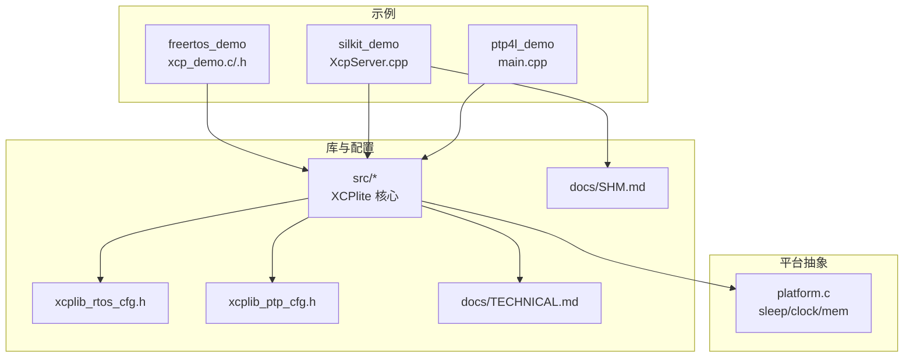
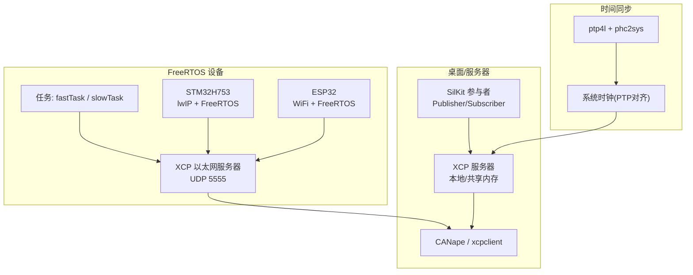
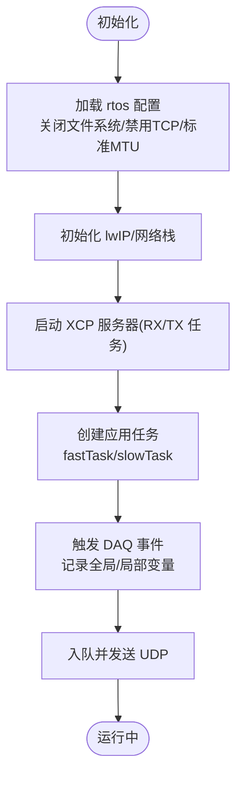
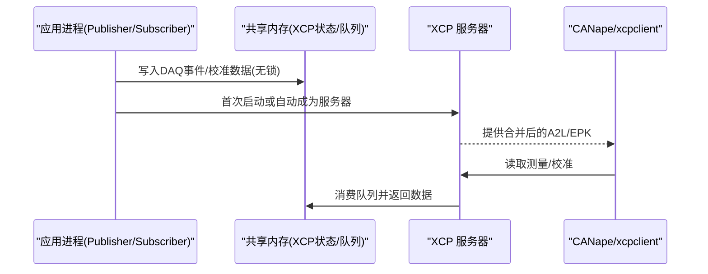
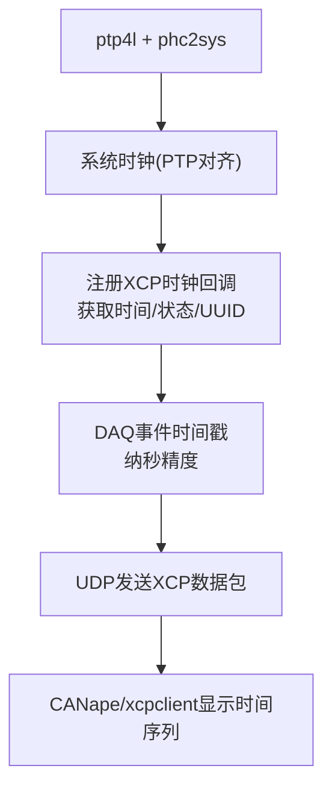
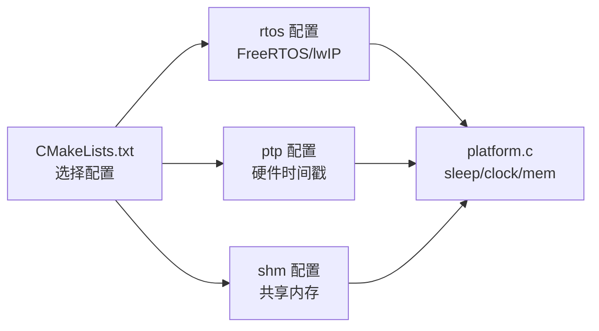

# 平台特定示例

<cite>
**本文引用的文件**
- [examples/freertos_demo/README.md](file://examples/freertos_demo/README.md)
- [examples/freertos_demo/xcp_demo.h](file://examples/freertos_demo/xcp_demo.h)
- [examples/freertos_demo/freertos_stm32_demo/README.md](file://examples/freertos_demo/freertos_stm32_demo/README.md)
- [examples/freertos_demo/freertos_esp32_demo/README.md](file://examples/freertos_demo/freertos_esp32_demo/README.md)
- [examples/silkit_demo/README.md](file://examples/silkit_demo/README.md)
- [examples/silkit_demo/src/XcpServer.cpp](file://examples/silkit_demo/src/XcpServer.cpp)
- [examples/ptp4l_demo/README.md](file://examples/ptp4l_demo/README.md)
- [examples/ptp4l_demo/src/main.cpp](file://examples/ptp4l_demo/src/main.cpp)
- [src/xcplib_rtos_cfg.h](file://src/xcplib_rtos_cfg.h)
- [src/xcplib_ptp_cfg.h](file://src/xcplib_ptp_cfg.h)
- [src/platform.c](file://src/platform.c)
- [docs/TECHNICAL.md](file://docs/TECHNICAL.md)
- [docs/SHM.md](file://docs/SHM.md)
- [CMakeLists.txt](file://CMakeLists.txt)
</cite>

## 目录
1. [简介](#简介)
2. [项目结构](#项目结构)
3. [核心组件](#核心组件)
4. [架构总览](#架构总览)
5. [详细组件分析](#详细组件分析)
6. [依赖关系分析](#依赖关系分析)
7. [性能与内存优化](#性能与内存优化)
8. [故障排查指南](#故障排查指南)
9. [结论](#结论)
10. [附录：构建与部署](#附录构建与部署)

## 简介
本文件面向在嵌入式与桌面平台上集成 XCPlite 的工程师，聚焦以下目标：
- FreeRTOS 平台（STM32、ESP32）的集成差异、内存限制下的优化策略与实时性保证。
- SilKit 分布式系统中的 XCP 服务器部署与多应用共享内存数据同步机制。
- PTP 时间同步在精确测量中的应用：时钟源配置、同步精度调优与时间戳处理。
- 跨平台构建配置、工具链设置与部署流程，以及最佳实践与常见问题解决方案。

## 项目结构
仓库以“示例驱动”的方式组织，关键路径如下：
- examples/freertos_demo：FreeRTOS 示例（POSIX 模拟器、ESP32、STM32），统一使用 xcp_demo.c/.h 作为业务逻辑入口。
- examples/silkit_demo：基于 SIL Kit 的发布/订阅演示，并集成 XCP 服务器（支持单进程或多应用共享内存模式）。
- examples/ptp4l_demo：Linux 下通过 ptp4l/phc2sys 将系统时钟与 PTP 主时钟对齐，为 XCP DAQ 提供高精度时间戳。
- src/*：XCPlite 库源码与平台抽象（platform.c）、各配置覆盖头（rtos/ptp/shm/raw/no_a2l）。
- docs/*：技术文档（离线 A2L、SHM 模式等）。
- CMakeLists.txt：统一的构建配置入口，选择不同配置（default/no_a2l/ptp/shm/rtos/raw）。

图表来源
- [CMakeLists.txt:17-35](file://CMakeLists.txt#L17-L35)
- [examples/freertos_demo/README.md:1-12](file://examples/freertos_demo/README.md#L1-L12)
- [examples/silkit_demo/README.md:1-19](file://examples/silkit_demo/README.md#L1-L19)
- [examples/ptp4l_demo/README.md:1-10](file://examples/ptp4l_demo/README.md#L1-L10)

章节来源
- [CMakeLists.txt:17-35](file://CMakeLists.txt#L17-L35)
- [examples/freertos_demo/README.md:1-12](file://examples/freertos_demo/README.md#L1-L12)
- [examples/silkit_demo/README.md:1-19](file://examples/silkit_demo/README.md#L1-L19)
- [examples/ptp4l_demo/README.md:1-10](file://examples/ptp4l_demo/README.md#L1-L10)

## 核心组件
- FreeRTOS 集成要点
  - 通过定义 _FREE_RTOS 与 XCPLIB_CFG_OVERRIDE="xcplib_rtos_cfg.h" 启用 FreeRTOS 路径与配置覆盖。
  - 使用 queue32m 固定大小发送队列（无堆分配），结合 lwIP socket 实现以太网传输。
  - 事件与校准段通过 ELF 节（xcp_evts、xcp_cals）与 DWARF 锚点实现离线 A2L 生成。
- SilKit + XCP 多应用共享内存
  - 可选单 XCP 服务器（独立参与者或首个启动的应用）+ 多应用共享内存模式，A2L 自动合并并按参与者命名空间前缀区分符号。
  - 共享内存模式要求 POSIX 平台，使用无锁状态机与共享队列，避免额外锁开销。
- PTP 时间同步
  - 在 Linux 上运行 ptp4l 与 phc2sys，将系统时钟与 PTP 主时钟对齐；注册回调向 XCP 提供纳秒级时间戳与主从信息。
  - 可开启套接字硬件时间戳以获得更优的端到端精度。

章节来源
- [examples/freertos_demo/README.md:42-76](file://examples/freertos_demo/README.md#L42-L76)
- [examples/freertos_demo/README.md:156-189](file://examples/freertos_demo/README.md#L156-L189)
- [examples/silkit_demo/README.md:21-49](file://examples/silkit_demo/README.md#L21-L49)
- [docs/SHM.md:6-21](file://docs/SHM.md#L6-L21)
- [examples/ptp4l_demo/README.md:7-23](file://examples/ptp4l_demo/README.md#L7-L23)
- [examples/ptp4l_demo/src/main.cpp:97-149](file://examples/ptp4l_demo/src/main.cpp#L97-L149)

## 架构总览
下图展示 FreeRTOS、SilKit 与 PTP 三类场景如何与 XCPlite 交互，并通过以太网 UDP 暴露 XCP 服务。

图表来源
- [examples/freertos_demo/README.md:14-37](file://examples/freertos_demo/README.md#L14-L37)
- [examples/silkit_demo/README.md:21-49](file://examples/silkit_demo/README.md#L21-L49)
- [examples/ptp4l_demo/README.md:7-23](file://examples/ptp4l_demo/README.md#L7-L23)
- [examples/ptp4l_demo/src/main.cpp:174-185](file://examples/ptp4l_demo/src/main.cpp#L174-L185)

## 详细组件分析

### FreeRTOS 集成（STM32 与 ESP32 的差异）
- 共同点
  - 均使用 xcplib_rtos_cfg.h 覆盖默认配置，关闭文件系统、禁用 TCP、采用标准 MTU 与 32 位队列。
  - 通过 ELF 节与 DWARF 锚点进行离线 A2L 生成，事件与校准段无需运行时注册。
  - 使用 lwIP 套接字进行 UDP 传输，创建 RX/TX 任务处理 XCP 协议。
- STM32 特性
  - 使用 CubeMX 生成的工程，需调整 MPU、LwIP 选项、栈与 DMA 缓冲区布局，确保以太网 DMA 访问合法区域。
  - 通过串口输出调试信息，必要时提高波特率。
- ESP32 特性
  - 通过 PlatformIO 构建，连接 2.4GHz WiFi，绑定 0.0.0.0:5555 监听 UDP。
  - 使用 extra_script.py 仅编译必要的 XCPlite 源文件，链接脚本调整以确保 xcp_* 节保留于 flash 映射区。

图表来源
- [src/xcplib_rtos_cfg.h:44-88](file://src/xcplib_rtos_cfg.h#L44-L88)
- [examples/freertos_demo/README.md:42-76](file://examples/freertos_demo/README.md#L42-L76)
- [examples/freertos_demo/freertos_stm32_demo/README.md:69-126](file://examples/freertos_demo/freertos_stm32_demo/README.md#L69-L126)
- [examples/freertos_demo/freertos_esp32_demo/README.md:133-149](file://examples/freertos_demo/freertos_esp32_demo/README.md#L133-L149)

章节来源
- [examples/freertos_demo/README.md:42-76](file://examples/freertos_demo/README.md#L42-L76)
- [examples/freertos_demo/xcp_demo.h:14-19](file://examples/freertos_demo/xcp_demo.h#L14-L19)
- [examples/freertos_demo/freertos_stm32_demo/README.md:69-126](file://examples/freertos_demo/freertos_stm32_demo/README.md#L69-L126)
- [examples/freertos_demo/freertos_esp32_demo/README.md:133-149](file://examples/freertos_demo/freertos_esp32_demo/README.md#L133-L149)
- [src/xcplib_rtos_cfg.h:44-88](file://src/xcplib_rtos_cfg.h#L44-L88)

### SilKit 分布式系统中的 XCP 服务器与数据同步
- 部署模式
  - 独立 XCP 服务器参与者：单独进程监听端口，所有参与者通过该服务器暴露信号与参数。
  - 多应用共享内存模式：首个启动的应用成为服务器，其他应用自动加入共享内存，A2L 自动合并并按参与者名前缀区分符号。
- 数据流
  - 发布者按仿真步长触发 DAQ 事件，订阅者在消息到达时触发事件，两者均可被 XCP 捕获。
  - 共享内存模式下，多个进程共享发送队列与校准 RCU 状态，读路径无锁，写路径竞争最小化。

图表来源
- [examples/silkit_demo/README.md:21-49](file://examples/silkit_demo/README.md#L21-L49)
- [examples/silkit_demo/src/XcpServer.cpp:30-39](file://examples/silkit_demo/src/XcpServer.cpp#L30-L39)
- [docs/SHM.md:6-21](file://docs/SHM.md#L6-L21)

章节来源
- [examples/silkit_demo/README.md:21-49](file://examples/silkit_demo/README.md#L21-L49)
- [examples/silkit_demo/src/XcpServer.cpp:30-39](file://examples/silkit_demo/src/XcpServer.cpp#L30-L39)
- [docs/SHM.md:6-21](file://docs/SHM.md#L6-L21)

### PTP 时间同步在精确测量中的应用
- 时钟源配置
  - 在 Linux 上运行 ptp4l（带硬件时间戳）与 phc2sys，将系统时钟与 PTP 主时钟对齐。
  - 注册回调函数向 XCP 提供当前时间（纳秒）、时钟状态与主从 UUID、时区等信息。
- 同步精度调优
  - 启用套接字硬件时间戳（如 ptptool 需要），减少软件时间戳抖动。
  - 合理设置 ptp4l 超时与日志级别，观察端口状态（SLAVE/MASTER/LISTENING）。
- 时间戳处理
  - XCP DAQ 事件使用 PTP 对齐的系统实时时钟，确保多节点时间一致。
  - CANape 等设备可将时间戳解释为 PTP 同步时间，便于跨设备对齐观测。

图表来源
- [examples/ptp4l_demo/README.md:7-23](file://examples/ptp4l_demo/README.md#L7-L23)
- [examples/ptp4l_demo/src/main.cpp:97-149](file://examples/ptp4l_demo/src/main.cpp#L97-L149)
- [examples/ptp4l_demo/src/main.cpp:174-185](file://examples/ptp4l_demo/src/main.cpp#L174-L185)

章节来源
- [examples/ptp4l_demo/README.md:7-23](file://examples/ptp4l_demo/README.md#L7-L23)
- [examples/ptp4l_demo/src/main.cpp:97-149](file://examples/ptp4l_demo/src/main.cpp#L97-L149)
- [examples/ptp4l_demo/src/main.cpp:174-185](file://examples/ptp4l_demo/src/main.cpp#L174-L185)

## 依赖关系分析
- 构建配置
  - 通过 CMake 选择配置：default/no_a2l/ptp/shm/rtos/raw，分别对应不同的功能开关与依赖。
  - 对于 rtos 配置，启用 FreeRTOS 路径与 lwIP 套接字；对于 ptp 配置，启用硬件时间戳相关能力。
- 运行时依赖
  - FreeRTOS：线程、互斥量、时钟抽象（platform.c）。
  - 以太网：lwIP（STM32/ESP32）或主机套接字（Linux/macOS）。
  - PTP：ptp4l/phc2sys（Linux），可选硬件时间戳。
  - SilKit：Registry 与参与者发现，直接 TCP 通信。

图表来源
- [CMakeLists.txt:17-35](file://CMakeLists.txt#L17-L35)
- [src/platform.c:78-155](file://src/platform.c#L78-L155)

章节来源
- [CMakeLists.txt:17-35](file://CMakeLists.txt#L17-L35)
- [src/platform.c:78-155](file://src/platform.c#L78-L155)

## 性能与内存优化
- 内存占用
  - 静态内存：约 10 KB（DAQ 表、校准页）。
  - 堆内存：约 32 KB（传输队列，可按需调整）。
  - 栈内存：每线程约 1 KB（RX/TX 任务）。
- FreeRTOS 优化
  - 使用固定大小发送队列（queue32m），避免堆分配；根据 RAM 调整队列段数。
  - 校准段数量与总大小可调（OPTION_CAL_SEGMENT_COUNT/OPTION_CAL_MEM_SIZE）。
  - DAQ 内存与事件数量可调（OPTION_DAQ_MEM_SIZE/OPTION_DAQ_EVENT_COUNT）。
  - 任务栈大小按需调整（RX 通常高于 TX）。
- 实时性保证
  - 高优先级任务（fastTask）与低优先级任务（slowTask）同核绑定，便于调度观察。
  - 事件触发尽量轻量，避免阻塞；必要时使用临界区或互斥量保护共享资源。
- 工具链与链接器
  - STM32：MPU 配置、DMA 缓冲区缓存属性、栈位置（DTCMRAM vs AXI SRAM）。
  - ESP32：链接脚本调整，确保 xcp_* 节保留于 flash 映射区。

章节来源
- [docs/TECHNICAL.md:5-25](file://docs/TECHNICAL.md#L5-L25)
- [examples/freertos_demo/README.md:193-252](file://examples/freertos_demo/README.md#L193-L252)
- [examples/freertos_demo/freertos_stm32_demo/README.md:69-126](file://examples/freertos_demo/freertos_stm32_demo/README.md#L69-L126)
- [examples/freertos_demo/freertos_esp32_demo/README.md:307-338](file://examples/freertos_demo/freertos_esp32_demo/README.md#L307-L338)

## 故障排查指南
- FreeRTOS 常见问题
  - 堆栈溢出：检查任务栈大小与 lwIP 线程栈；必要时增加栈或使用静态分配。
  - 以太网 DMA 访问异常：确认 MPU 配置与 DMA 缓冲区位于可缓存/可访问区域。
  - A2L 上传失败：FreeRTOS 实现不支持目标端 A2L 生成与上传，请使用离线 A2L 生成。
- SilKit 共享内存问题
  - 多应用 A2L 合并失败：确保每个应用正确注册 EPK，并使用 shmtool 检查状态。
  - 服务器迁移：若服务器进程退出，下一个以自动模式启动的应用将接管。
- PTP 同步问题
  - 无法获取主从 UUID：检查 pmc 命令输出与接口权限；确认 ptp4l/phc2sys 正常运行。
  - 时间戳不连续：检查硬件时间戳是否启用，调整 ptp4l 超时与日志级别。

章节来源
- [examples/freertos_demo/freertos_stm32_demo/README.md:28-66](file://examples/freertos_demo/freertos_stm32_demo/README.md#L28-L66)
- [examples/freertos_demo/freertos_esp32_demo/README.md:216-247](file://examples/freertos_demo/freertos_esp32_demo/README.md#L216-L247)
- [docs/SHM.md:44-57](file://docs/SHM.md#L44-L57)
- [examples/ptp4l_demo/README.md:25-40](file://examples/ptp4l_demo/README.md#L25-L40)

## 结论
- FreeRTOS 平台可通过统一配置覆盖与 ELF/DWARF 离线 A2L 生成，快速集成 XCPlite；STM32 与 ESP32 在工具链与链接器层面存在差异，但核心集成路径一致。
- SilKit 多应用共享内存模式简化了分布式仿真中的 XCP 接入，A2L 自动合并与命名空间前缀避免了符号冲突。
- PTP 时间同步为跨设备精确测量提供了可靠的时间基准，结合硬件时间戳可获得更高精度。
- 建议在生产环境中严格评估内存与栈使用，合理配置队列与事件数量，并进行充分测试验证。

## 附录：构建与部署
- 构建配置
  - 使用 CMake 选择配置：default/no_a2l/ptp/shm/rtos/raw。
  - FreeRTOS：定义 _FREE_RTOS 与 XCPLIB_CFG_OVERRIDE="xcplib_rtos_cfg.h"。
  - PTP：启用硬件时间戳（Linux）。
  - 共享内存：启用 shm 配置，使用 shmtool/xcpdaemon。
- 工具链与部署
  - STM32：CubeMX 生成工程，调整 MPU/LwIP/链接器；通过串口调试。
  - ESP32：PlatformIO 构建，配置 WiFi 与链接脚本；通过 USB 串口监控。
  - Linux：安装 ptp4l/phc2sys，运行示例程序；使用 xcpclient/CANape 进行测试。

章节来源
- [CMakeLists.txt:17-35](file://CMakeLists.txt#L17-L35)
- [examples/freertos_demo/README.md:305-387](file://examples/freertos_demo/README.md#L305-L387)
- [examples/ptp4l_demo/README.md:7-23](file://examples/ptp4l_demo/README.md#L7-L23)
- [examples/silkit_demo/README.md:62-115](file://examples/silkit_demo/README.md#L62-L115)