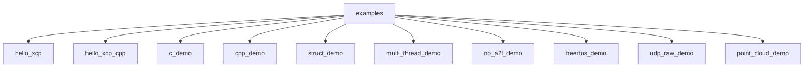
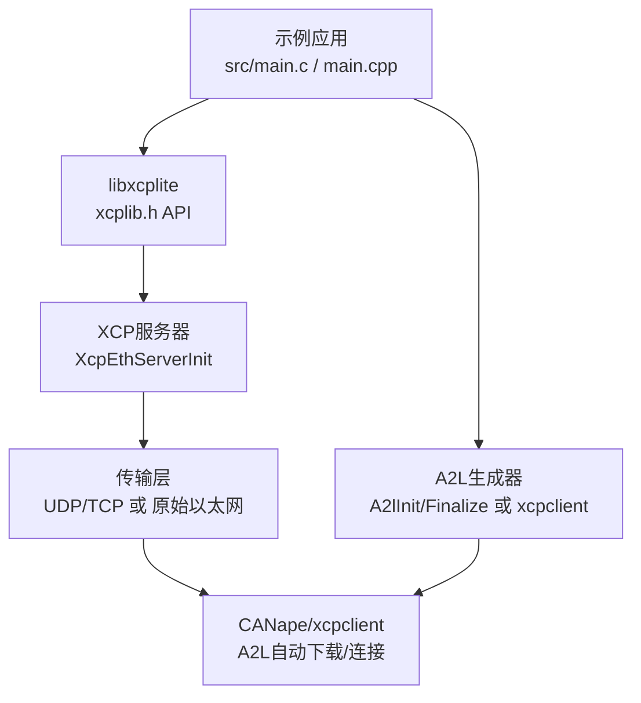
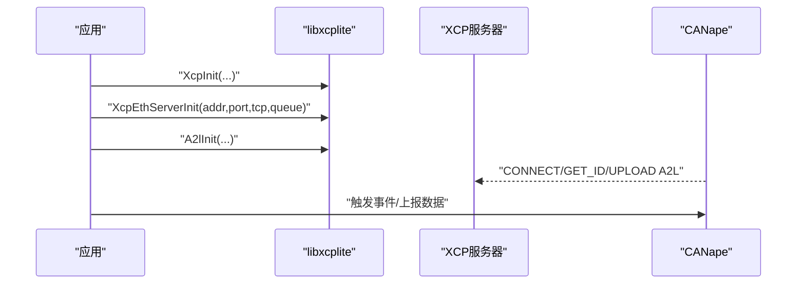
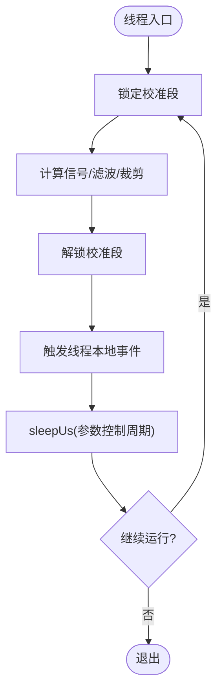
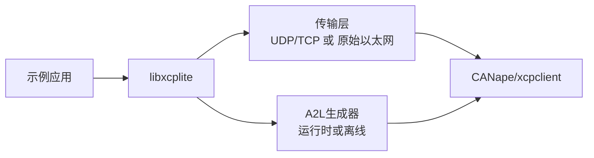

# 示例应用指南

<cite>
**本文引用的文件**
- [examples/README.md](file://examples/README.md)
- [examples/hello_xcp/README.md](file://examples/hello_xcp/README.md)
- [examples/hello_xcp/src/main.c](file://examples/hello_xcp/src/main.c)
- [examples/hello_xcp_cpp/src/main.cpp](file://examples/hello_xcp_cpp/src/main.cpp)
- [examples/c_demo/README.md](file://examples/c_demo/README.md)
- [examples/cpp_demo/README.md](file://examples/cpp_demo/README.md)
- [examples/multi_thread_demo/README.md](file://examples/multi_thread_demo/README.md)
- [examples/multi_thread_demo/src/main.c](file://examples/multi_thread_demo/src/main.c)
- [examples/struct_demo/README.md](file://examples/struct_demo/README.md)
- [examples/struct_demo/src/main.c](file://examples/struct_demo/src/main.c)
- [examples/no_a2l_demo/README.md](file://examples/no_a2l_demo/README.md)
- [examples/freertos_demo/README.md](file://examples/freertos_demo/README.md)
- [examples/udp_raw_demo/README.md](file://examples/udp_raw_demo/README.md)
- [examples/point_cloud_demo/README.md](file://examples/point_cloud_demo/README.md)
- [inc/xcplib.h](file://inc/xcplib.h)
- [README.md](file://README.md)
</cite>

## 目录
1. [简介](#简介)
2. [项目结构](#项目结构)
3. [核心组件](#核心组件)
4. [架构总览](#架构总览)
5. [详细组件分析](#详细组件分析)
6. [依赖关系分析](#依赖关系分析)
7. [性能与调优](#性能与调优)
8. [故障排查](#故障排查)
9. [结论](#结论)
10. [附录：学习路径与实践清单](#附录学习路径与实践清单)

## 简介
本指南面向不同经验水平的开发者，提供从入门到进阶的完整示例应用学习路径。内容覆盖：
- 基础示例：hello_xcp（C）、hello_xcp_cpp（C++）
- 复杂数据类型测量：c_demo、cpp_demo、struct_demo
- 多线程数据采集：multi_thread_demo
- 无A2L运行时生成与离线A2L：no_a2l_demo
- RTOS与嵌入式：freertos_demo
- 无TCP/IP栈的原始以太网传输：udp_raw_demo
- 动态数据结构可视化：point_cloud_demo

每个示例均包含功能特点、实现原理、使用方法、CANape项目配置要点、A2L生成方式与调试技巧，并给出循序渐进的实践建议。

## 项目结构
示例位于 examples 目录下，每个示例通常包含：
- src：示例源代码
- CANape：预配置的CANape工程（含A2L自动上传、设备配置等）
- README.md：构建、运行、CANape配置说明

**章节来源**
- [examples/README.md:1-120](file://examples/README.md#L1-L120)

## 核心组件
- XCP服务器初始化与启动：XcpInit、XcpEthServerInit
- 校准段（Calibration Segment）：XcpCreateCalSeg、XcpLockCalSeg/XcpUnlockCalSeg、页面切换与持久化
- 事件与采集：DaqCreateEvent/DaqTriggerEvent、相对/绝对/栈帧寻址模式
- A2L生成：运行时A2L生成（A2lInit/A2lFinalize）或离线A2L（xcpclient基于ELF/DWARF）
- 传输层：UDP/TCP；无IP栈的原始以太网（udp_raw_demo）

这些能力在多个示例中被组合使用，形成从简单到复杂的实践路径。

**章节来源**
- [inc/xcplib.h:39-139](file://inc/xcplib.h#L39-L139)
- [examples/README.md:210-267](file://examples/README.md#L210-L267)

## 架构总览
下图展示了典型示例（如 hello_xcp）中应用、XCPlite库、传输层与工具链之间的交互关系。

**图示来源**
- [examples/hello_xcp/src/main.c:146-173](file://examples/hello_xcp/src/main.c#L146-L173)
- [examples/hello_xcp_cpp/src/main.cpp:183-210](file://examples/hello_xcp_cpp/src/main.cpp#L183-L210)
- [examples/udp_raw_demo/README.md:15-28](file://examples/udp_raw_demo/README.md#L15-L28)

## 详细组件分析

### 基础示例：hello_xcp（C）
- 功能特点
  - 启动XCP以太网服务器，启用运行时A2L生成
  - 创建全局校准参数段，安全访问参数
  - 定义事件测量全局变量、局部（栈）变量
  - 演示绝对、栈帧相对、校准段相对三种寻址模式
  - 函数内联仪器化，注册局部变量与参数并触发事件
- 实现原理
  - 通过 XcpInit + XcpEthServerInit 启动服务
  - 使用 A2lSetSegmentAddrMode + A2lCreateParameter 描述校准参数
  - 使用 DaqEventVar/A2L_MEAS 自动识别寻址模式并触发事件
- 使用方法
  - 构建后运行可执行文件，打开 CANape/CANape.ini 加载工程
  - 确认设备配置中的IP地址与端口（默认UDP 5555）
- CANape与A2L
  - 支持自动A2L上传；若无法连接，检查“设备配置/协议/传输层”的IP设置
- 最佳实践
  - 优先使用变参宏简化事件注册
  - 校准段锁为无等待、可递归，避免阻塞关键路径

**图示来源**
- [examples/hello_xcp/src/main.c:146-173](file://examples/hello_xcp/src/main.c#L146-L173)
- [examples/hello_xcp/README.md:10-23](file://examples/hello_xcp/README.md#L10-L23)

**章节来源**
- [examples/hello_xcp/README.md:1-72](file://examples/hello_xcp/README.md#L1-L72)
- [examples/hello_xcp/src/main.c:146-282](file://examples/hello_xcp/src/main.c#L146-L282)

### C++基础示例：hello_xcp_cpp
- 功能特点
  - 使用C++ RAII封装校准段，作用域退出自动解锁
  - 类成员变量与实例测量，堆/栈实例均可测量
  - 变参API简化事件注册
- 实现原理
  - 使用 xcp::CalSeg<T> 管理校准段生命周期
  - 通过 A2lCreateTypedef 与 A2L_*_COMPONENT 宏声明类型与字段
- 使用方法
  - 构建并运行，加载对应CANape工程，观察实例与成员变量的测量
- 最佳实践
  - 将校准段锁的作用域尽量缩小，减少XCP写入延迟
  - 对复杂类型使用typedef统一描述，便于A2L复用

**章节来源**
- [examples/hello_xcp_cpp/src/main.cpp:183-298](file://examples/hello_xcp_cpp/src/main.cpp#L183-L298)

### 复杂数据类型与校准对象：c_demo
- 功能特点
  - 展示轴、曲线、映射等复杂校准对象
  - 支持栈变量的异步轮询读取与写回
  - 一致原子更新多参数（间接校准模式）
  - 校准页切换与EPK版本校验
- 实现原理
  - 使用A2L描述复杂校准对象，结合事件与轮询机制
  - 通过间接校准模式保证多参数原子性
- 使用方法
  - 构建运行后，在CANape中开启间接校准模式进行参数修改
- 最佳实践
  - 合理设置主循环延时以评估最小周期时间
  - 关注日志级别以理解异步访问与一致性更新过程

**章节来源**
- [examples/c_demo/README.md:1-99](file://examples/c_demo/README.md#L1-L99)

### C++高级示例：cpp_demo
- 功能特点
  - 校准段RAII封装，类成员变量测量
  - 信号发生器与查找表（共享轴）
  - 两个独立实例分别测量
- 实现原理
  - 使用 CalSeg<T> 与 A2lCreateTypedef 描述类型与实例
  - 通过成员函数内的事件触发测量局部变量与成员变量
- 使用方法
  - 构建运行，加载CANape工程，观察两个实例的信号波形与参数
- 最佳实践
  - 对于共享轴的查找表，确保轴引用正确（CANape 24+）

**章节来源**
- [examples/cpp_demo/README.md:1-57](file://examples/cpp_demo/README.md#L1-L57)

### 嵌套结构与数组测量：struct_demo
- 功能特点
  - 嵌套结构体、多维数组、结构体数组的测量
  - 纯测量示例，不涉及校准段
- 实现原理
  - 使用 A2lTypedefBegin/End 定义可复用类型
  - 通过 A2lCreateTypedefInstance/ArrayInstance 创建实例与数组
- 使用方法
  - 构建运行，加载CANape工程，观察不同类型实例的测量
- 最佳实践
  - 注意编译器填充与对齐，确保sizeof断言通过

**章节来源**
- [examples/struct_demo/README.md:1-50](file://examples/struct_demo/README.md#L1-L50)
- [examples/struct_demo/src/main.c:68-183](file://examples/struct_demo/src/main.c#L68-L183)

### 多线程数据采集：multi_thread_demo
- 功能特点
  - 线程本地事件实例与测量
  - 共享校准段的安全原子访问
  - 实验性上下文与跨度（span）测量
  - 多线程队列竞争性能基准
- 实现原理
  - 每个线程创建独立事件实例，避免冲突
  - 使用 XcpLockCalSeg/XcpUnlockCalSeg 获取一致的参数视图
  - 可选 BeginSpan/EndSpan 记录代码块执行时间
- 使用方法
  - 构建运行，观察各线程通道与统计信息
- 最佳实践
  - 调整线程数与sleep时间评估系统负载
  - 谨慎使用实验性功能，仅在需要时启用

**图示来源**
- [examples/multi_thread_demo/src/main.c:257-338](file://examples/multi_thread_demo/src/main.c#L257-L338)

**章节来源**
- [examples/multi_thread_demo/README.md:1-74](file://examples/multi_thread_demo/README.md#L1-L74)
- [examples/multi_thread_demo/src/main.c:343-419](file://examples/multi_thread_demo/src/main.c#L343-L419)

### 无A2L运行时生成：no_a2l_demo
- 功能特点
  - 目标端不生成A2L，减小代码体积与文件系统依赖
  - 使用xcpclient离线从ELF/DWARF生成A2L
- 实现原理
  - 仅使用测量与校准核心API（事件、校准段）
  - 通过编译期标记与DWARF锚点让xcpclient推断变量与类型
- 使用方法
  - 隔离构建目录构建，使用xcpclient生成A2L并连接测试
- 最佳实践
  - 本地变量需volatile以保证优化后仍可见
  - 使用CalSegDecl/CalSegDeclRef进行校准段声明

**章节来源**
- [examples/no_a2l_demo/README.md:1-166](file://examples/no_a2l_demo/README.md#L1-L166)

### RTOS与嵌入式：freertos_demo
- 功能特点
  - 在FreeRTOS任务中运行测量与校准
  - 高精度时间戳、任务调度压力观测、超期计数
  - 离线A2L模板与变量选择
- 实现原理
  - 使用平台抽象（sockets/platform）适配FreeRTOS/lwIP
  - 通过CalSegDecl/CalSegDeclRef与事件API完成测量与校准
- 使用方法
  - 按平台README构建，生成A2L模板并连接测试
- 最佳实践
  - 根据SRAM与MTU调整队列与内存配置
  - 为高优先级任务提供足够栈空间与低开销事件

**章节来源**
- [examples/freertos_demo/README.md:1-495](file://examples/freertos_demo/README.md#L1-L495)

### 无TCP/IP栈的原始以太网传输：udp_raw_demo
- 功能特点
  - 在xcplib内部实现UDP/IPv4，无需操作系统网络栈
  - 自应答ARP与ICMP，目标可被ping通
  - 显式本地IPv4地址绑定，无DHCP
- 实现原理
  - 通过socket_raw HAL发送/接收以太网帧
  - 配置选项控制ICMP、校验和、零拷贝等
- 使用方法
  - 赋予CAP_NET_RAW或使用root运行，指定接口与IP
  - 使用xcpclient或CANape连接并测量
- 最佳实践
  - 使用隔离网络环境进行测试，避免与内核地址冲突
  - 在新HAL开发时关闭零拷贝以便调试

**章节来源**
- [examples/udp_raw_demo/README.md:1-228](file://examples/udp_raw_demo/README.md#L1-L228)

### 动态数据结构可视化：point_cloud_demo
- 功能特点
  - 在CANape 3D场景窗口可视化动态点云
  - 测量结构体数组，支持运行时可调参数
- 实现原理
  - 使用C++ API与CalSeg管理参数，事件触发测量数组
- 使用方法
  - 构建运行，加载CANape工程，观察3D场景中的点云变化
- 最佳实践
  - 合理控制点数与边界，避免过大负载影响实时性

**章节来源**
- [examples/point_cloud_demo/README.md:1-51](file://examples/point_cloud_demo/README.md#L1-L51)

## 依赖关系分析
- 示例与应用：所有示例依赖 libxcplite 提供的XCP服务器、校准段、事件与A2L生成能力
- 传输层：多数示例使用UDP/TCP；udp_raw_demo使用原始以太网HAL
- 工具链：CANape用于在线测量与校准；xcpclient用于离线A2L生成与命令行测试

**图示来源**
- [examples/README.md:210-267](file://examples/README.md#L210-L267)
- [examples/udp_raw_demo/README.md:15-28](file://examples/udp_raw_demo/README.md#L15-L28)

**章节来源**
- [examples/README.md:210-267](file://examples/README.md#L210-L267)

## 性能与调优
- 队列与锁
  - 使用无等待队列与RCU校准段锁，降低多线程争用
  - 通过日志与统计输出评估锁时间与直方图分布
- 周期时间
  - 通过校准参数控制主循环sleep，评估最小周期时间
  - 在高频率下关注队列容量与丢包风险
- 内存与栈
  - FreeRTOS环境下调整队列段数、DAQLIST大小、事件数量与校准段数量
  - RX/TX任务栈按需分配，避免浪费

[本节为通用指导，不直接分析具体文件]

## 故障排查
- 连接问题
  - 检查设备配置中的IP与端口；确认防火墙与网络可达
  - 原始以太网模式下确保未占用目标IP且具备CAP_NET_RAW
- A2L问题
  - 运行时A2L：确认A2lInit成功并在连接时完成最终化
  - 离线A2L：确保ELF带调试信息，变量标注volatile，使用xcpclient命令生成
- 校准不一致
  - 使用间接校准模式保证多参数原子更新
  - 缩短校准段锁的作用域，减少XCP写入延迟
- 性能瓶颈
  - 调整队列大小与事件数量；降低日志级别
  - 在RTOS上调整任务优先级与栈大小

**章节来源**
- [examples/hello_xcp/README.md:52-58](file://examples/hello_xcp/README.md#L52-L58)
- [examples/no_a2l_demo/README.md:134-166](file://examples/no_a2l_demo/README.md#L134-L166)
- [examples/udp_raw_demo/README.md:60-105](file://examples/udp_raw_demo/README.md#L60-L105)

## 结论
本指南通过一系列由浅入深的示例，帮助开发者掌握XCPlite的核心能力：XCP服务器、校准段、事件测量、A2L生成与多种传输方式。建议按以下顺序实践：
- 入门：hello_xcp → hello_xcp_cpp
- 进阶：c_demo → cpp_demo → struct_demo
- 并发：multi_thread_demo
- 嵌入式：freertos_demo
- 特殊传输：udp_raw_demo
- 可视化：point_cloud_demo
- 离线流程：no_a2l_demo

结合CANape与xcpclient，可在不同平台上快速验证与优化测量与校准方案。

[本节为总结，不直接分析具体文件]

## 附录：学习路径与实践清单
- 新手路径
  - 搭建hello_xcp与hello_xcp_cpp，熟悉事件与校准段
  - 使用CANape加载工程，观察全局与局部变量测量
- 中级路径
  - 尝试c_demo与cpp_demo，理解复杂校准对象与RAII封装
  - 在struct_demo中练习嵌套结构与数组测量
- 高级路径
  - 在multi_thread_demo中评估多线程性能与一致性
  - 在freertos_demo中集成到RTOS任务，调整内存与栈
  - 在udp_raw_demo中实现无IP栈传输，完成端到端测试
  - 在no_a2l_demo中掌握离线A2L工作流
- 实践清单
  - 明确寻址模式（绝对/栈帧/段相对）
  - 合理使用事件与轮询，平衡实时性与负载
  - 校准段锁作用域最小化，避免阻塞
  - 根据平台调整队列与内存配置
  - 使用日志与统计定位瓶颈

[本节为实践指导，不直接分析具体文件]