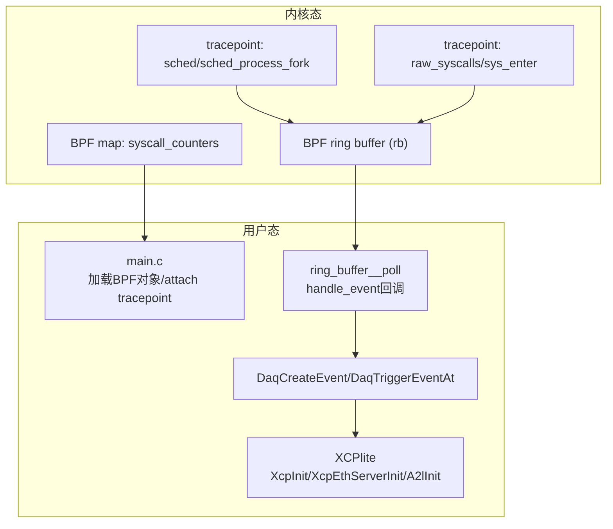
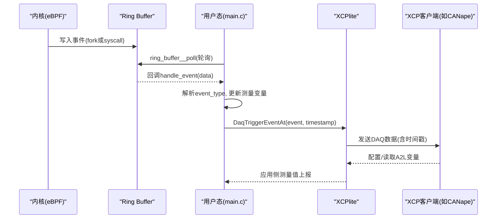
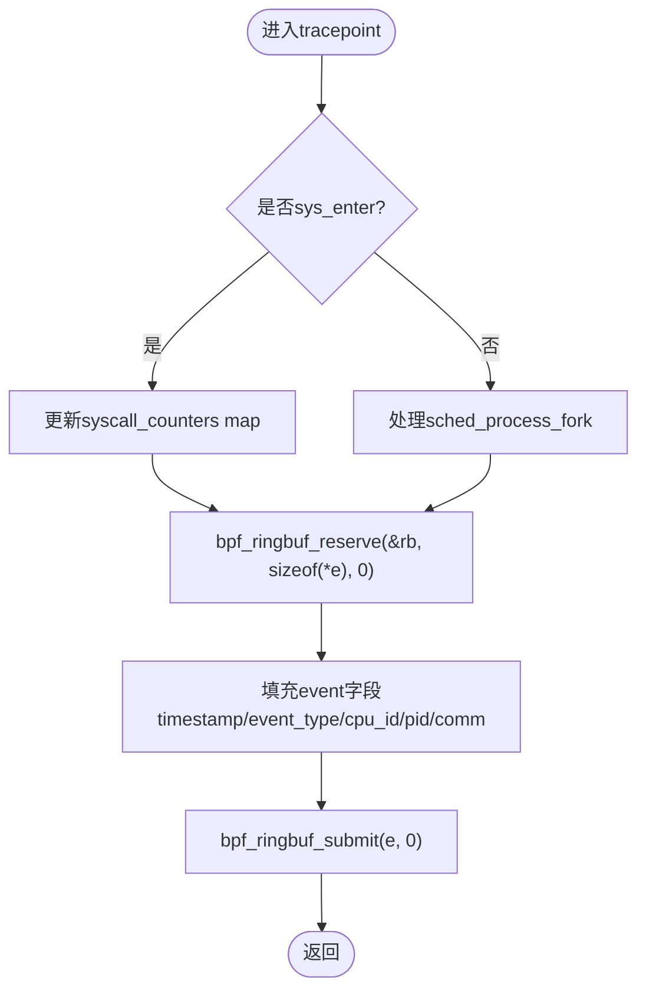
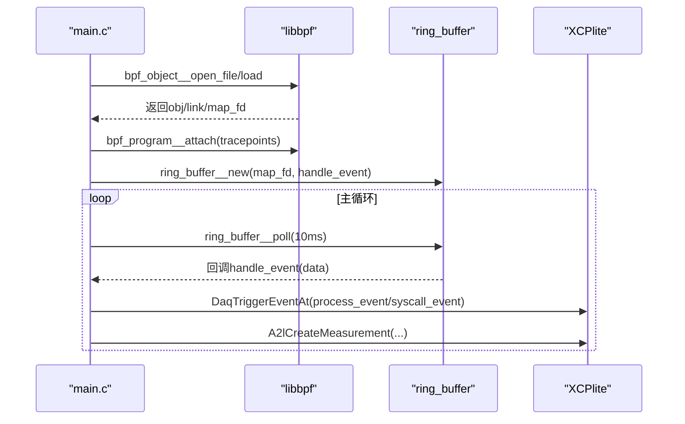
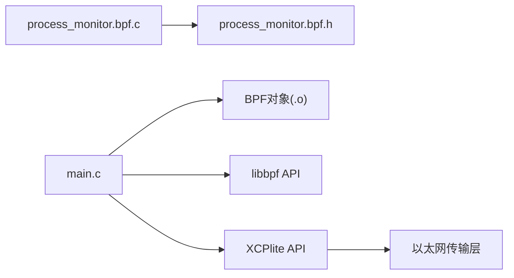

# BPF系统调用跟踪示例

<cite>
**本文引用的文件**
- [examples/bpf_demo/README.md](file://examples/bpf_demo/README.md)
- [examples/bpf_demo/src/main.c](file://examples/bpf_demo/src/main.c)
- [examples/bpf_demo/src/process_monitor.bpf.c](file://examples/bpf_demo/src/process_monitor.bpf.c)
- [examples/bpf_demo/src/process_monitor.bpf.h](file://examples/bpf_demo/src/process_monitor.bpf.h)
- [examples/bpf_demo/src/Makefile](file://examples/bpf_demo/src/Makefile)
- [inc/xcplib.h](file://inc/xcplib.h)
- [src/xcplite.h](file://src/xcplite.h)
- [src/xcplite.c](file://src/xcplite.c)
</cite>

## 目录
1. [简介](#简介)
2. [项目结构](#项目结构)
3. [核心组件](#核心组件)
4. [架构总览](#架构总览)
5. [详细组件分析](#详细组件分析)
6. [依赖关系分析](#依赖关系分析)
7. [性能考量](#性能考量)
8. [故障排查指南](#故障排查指南)
9. [结论](#结论)
10. [附录](#附录)

## 简介
本技术文档围绕XCPlite仓库中的BPF系统调用跟踪示例，深入解释bpf_demo如何利用Linux eBPF在内核态捕获进程创建与系统调用事件，并通过ring buffer将数据高效传递至用户态，结合XCPlite的XCP协议实现实时数据采集、分析与可视化。文档涵盖eBPF程序编写、加载与执行机制；用户态主程序对事件的消费流程；与XCPlite库的事件触发与A2L生成；以及BPF对象生命周期管理、内存映射与XCP集成方式。同时提供开发环境搭建、调试技巧与性能优化建议，并给出实际代码路径以便读者对照源码。

## 项目结构
bpf_demo示例位于examples/bpf_demo目录下，包含：
- 内核态eBPF程序：process_monitor.bpf.c（定义tracepoint钩子、ring buffer与计数器map）
- 共享头文件：process_monitor.bpf.h（定义事件结构体、ARM64系统调用号等）
- 用户态主程序：main.c（加载BPF对象、建立ring buffer回调、初始化XCP服务器、注册测量变量与事件）
- 构建脚本：Makefile（编译BPF目标文件）
- 说明文档：README.md（功能概述、构建与排错）

图表来源
- [examples/bpf_demo/src/process_monitor.bpf.c:45-73](file://examples/bpf_demo/src/process_monitor.bpf.c#L45-L73)
- [examples/bpf_demo/src/process_monitor.bpf.c:104-147](file://examples/bpf_demo/src/process_monitor.bpf.c#L104-L147)
- [examples/bpf_demo/src/main.c:481-563](file://examples/bpf_demo/src/main.c#L481-L563)
- [examples/bpf_demo/src/main.c:604-669](file://examples/bpf_demo/src/main.c#L604-L669)

章节来源
- [examples/bpf_demo/README.md:1-149](file://examples/bpf_demo/README.md#L1-L149)
- [examples/bpf_demo/src/Makefile:1-59](file://examples/bpf_demo/src/Makefile#L1-L59)

## 核心组件
- eBPF程序（内核态）
  - 通过tracepoint钩住sched_process_fork与raw_syscalls/sys_enter，采集进程fork与系统调用信息。
  - 使用ring buffer向用户态发送事件；使用array map统计各系统调用次数。
- 用户态主程序（main.c）
  - 加载BPF对象、查找并attach tracepoint、获取ring buffer与syscall counters map fd。
  - 设置ring buffer回调函数处理事件，更新全局测量变量并触发XCP事件。
  - 初始化XCPlite以太网服务器与A2L动态生成，注册测量变量与事件。
- XCPlite库
  - 提供XCP协议栈、DAQ事件管理、A2L生成与传输层封装。
  - 支持事件触发、绝对/相对/栈帧地址模式、时间戳对齐等。

章节来源
- [examples/bpf_demo/src/process_monitor.bpf.c:1-150](file://examples/bpf_demo/src/process_monitor.bpf.c#L1-L150)
- [examples/bpf_demo/src/process_monitor.bpf.h:1-401](file://examples/bpf_demo/src/process_monitor.bpf.h#L1-L401)
- [examples/bpf_demo/src/main.c:1-676](file://examples/bpf_demo/src/main.c#L1-L676)
- [inc/xcplib.h:1-800](file://inc/xcplib.h#L1-L800)
- [src/xcplite.h:1-653](file://src/xcplite.h#L1-L653)
- [src/xcplite.c:1-200](file://src/xcplite.c#L1-L200)

## 架构总览
下图展示了从内核tracepoint到用户态XCP测量的完整数据流与控制流：

图表来源
- [examples/bpf_demo/src/process_monitor.bpf.c:45-73](file://examples/bpf_demo/src/process_monitor.bpf.c#L45-L73)
- [examples/bpf_demo/src/process_monitor.bpf.c:104-147](file://examples/bpf_demo/src/process_monitor.bpf.c#L104-L147)
- [examples/bpf_demo/src/main.c:402-475](file://examples/bpf_demo/src/main.c#L402-L475)
- [examples/bpf_demo/src/main.c:604-669](file://examples/bpf_demo/src/main.c#L604-L669)
- [inc/xcplib.h:458-603](file://inc/xcplib.h#L458-L603)

## 详细组件分析

### eBPF程序：进程监控与系统调用跟踪
- 事件结构体与常量
  - 定义统一事件结构event，包含时间戳、事件类型、CPU ID及事件特定数据（fork或syscall）。
  - 定义ARM64系统调用号常量MAX_SYSCALL_NR，用于边界检查与计数map索引。
- Tracepoint钩子
  - trace_process_fork：在sched/sched_process_fork处捕获新进程信息（PID、PPID、comm），通过ring buffer提交。
  - trace_syscall_enter：在raw_syscalls/sys_enter处捕获系统调用号、当前进程PID/TGID、comm，更新syscall_counters map，并通过ring buffer提交事件。
- Ring buffer与Map
  - rb：BPF_MAP_TYPE_RINGBUF，最大条目数256KB，用于低开销内核→用户态数据传输。
  - syscall_counters：BPF_MAP_TYPE_ARRAY，按系统调用号统计调用次数。

图表来源
- [examples/bpf_demo/src/process_monitor.bpf.c:45-73](file://examples/bpf_demo/src/process_monitor.bpf.c#L45-L73)
- [examples/bpf_demo/src/process_monitor.bpf.c:104-147](file://examples/bpf_demo/src/process_monitor.bpf.c#L104-L147)
- [examples/bpf_demo/src/process_monitor.bpf.h:26-55](file://examples/bpf_demo/src/process_monitor.bpf.h#L26-L55)
- [examples/bpf_demo/src/process_monitor.bpf.h:57-398](file://examples/bpf_demo/src/process_monitor.bpf.h#L57-L398)

章节来源
- [examples/bpf_demo/src/process_monitor.bpf.c:1-150](file://examples/bpf_demo/src/process_monitor.bpf.c#L1-L150)
- [examples/bpf_demo/src/process_monitor.bpf.h:1-401](file://examples/bpf_demo/src/process_monitor.bpf.h#L1-L401)

### 用户态主程序：BPF加载、事件处理与XCP集成
- BPF对象加载与attach
  - 尝试从多个路径打开BPF对象文件，加载后查找并attach tracepoint程序（trace_process_fork与trace_syscall_enter）。
  - 获取ring buffer map fd与syscall_counters map fd，创建ring_buffer__new绑定回调handle_event。
- 事件处理回调
  - handle_event根据event_type区分fork与syscall事件，更新全局测量变量（如new_process_pid、syscall_nr、syscall_pid等）。
  - 计算每秒系统调用速率，并在每次syscall时触发通用事件；对特定syscall可触发独立事件。
- XCP初始化与测量
  - 调用XcpInit与XcpEthServerInit启动XCP以太网服务器，启用A2L动态生成。
  - 使用DaqCreateEvent创建事件（mainloop_event、process_event、syscall_event），并通过A2lCreateMeasurement注册测量变量。
  - 在主循环中轮询ring_buffer__poll，周期性触发mainloop_event以输出统计信息。

图表来源
- [examples/bpf_demo/src/main.c:481-563](file://examples/bpf_demo/src/main.c#L481-L563)
- [examples/bpf_demo/src/main.c:402-475](file://examples/bpf_demo/src/main.c#L402-L475)
- [examples/bpf_demo/src/main.c:591-669](file://examples/bpf_demo/src/main.c#L591-L669)
- [inc/xcplib.h:458-603](file://inc/xcplib.h#L458-L603)

章节来源
- [examples/bpf_demo/src/main.c:1-676](file://examples/bpf_demo/src/main.c#L1-L676)
- [inc/xcplib.h:1-800](file://inc/xcplib.h#L1-L800)

### XCPlite库：事件与A2L机制
- 事件创建与触发
  - 通过DaqCreateEvent/DaqCreateAndTriggerEvent等宏在链接期或运行期注册事件，支持周期性与随机事件。
  - 使用DaqTriggerEventAt在精确时间戳触发事件，配合xcp_get_frame_addr()支持栈帧相对地址模式。
- A2L生成
  - A2lInit启用动态A2L生成，A2lCreateMeasurement注册测量变量，支持单位、范围等元数据。
- 传输与状态
  - XcpEthServerInit启动以太网传输层，支持TCP/UDP与队列大小配置。
  - 提供XcpIsStarted/XcpIsConnected等状态查询接口。

章节来源
- [inc/xcplib.h:239-800](file://inc/xcplib.h#L239-L800)
- [src/xcplite.h:46-118](file://src/xcplite.h#L46-L118)
- [src/xcplite.c:1-200](file://src/xcplite.c#L1-L200)

## 依赖关系分析
- 内核态依赖
  - Linux内核tracepoint子系统（sched_process_fork、raw_syscalls/sys_enter）。
  - BPF运行时（libbpf内核模块支持）、ring buffer与array map。
- 用户态依赖
  - libbpf（bpf_object__open_file/load、bpf_program__attach、ring_buffer__new/poll）。
  - XCPlite库（XCP协议栈、A2L生成、事件管理）。
- 耦合与内聚
  - process_monitor.bpf.c与process_monitor.bpf.h强耦合（共享事件结构与常量）。
  - main.c与XCPlite松耦合（通过API调用），便于替换传输层或扩展功能。
  - 无循环依赖，职责清晰：内核负责采集，用户态负责聚合与上报。

图表来源
- [examples/bpf_demo/src/process_monitor.bpf.c:1-150](file://examples/bpf_demo/src/process_monitor.bpf.c#L1-L150)
- [examples/bpf_demo/src/process_monitor.bpf.h:1-401](file://examples/bpf_demo/src/process_monitor.bpf.h#L1-L401)
- [examples/bpf_demo/src/main.c:481-563](file://examples/bpf_demo/src/main.c#L481-L563)
- [inc/xcplib.h:39-59](file://inc/xcplib.h#L39-L59)

章节来源
- [examples/bpf_demo/src/Makefile:1-59](file://examples/bpf_demo/src/Makefile#L1-L59)
- [examples/bpf_demo/README.md:18-53](file://examples/bpf_demo/README.md#L18-L53)

## 性能考量
- 内核态优化
  - 使用ring buffer避免频繁拷贝，降低上下文切换开销。
  - 对高频syscall仅更新计数器map，必要时才提交详细事件以减少ring buffer压力。
  - 严格边界检查（syscall_nr < MAX_SYSCALL_NR）避免越界访问。
- 用户态优化
  - 主循环采用短超时轮询（10ms），平衡实时性与CPU占用。
  - 每秒计算一次系统调用速率，减少频繁打印与事件触发。
  - 选择性触发特定syscall事件，避免过多XCP消息导致拥塞。
- 传输层与A2L
  - 合理配置测量队列大小（OPTION_QUEUE_SIZE），防止溢出。
  - 使用A2L动态生成减少手动维护成本，提高可观测性。

[本节为一般性指导，不直接分析具体文件]

## 故障排查指南
- 权限问题
  - BPF程序需要root权限运行，否则加载或attach失败。
- 构建与加载失败
  - 确保安装clang、llvm、libbpf-dev与对应内核头文件。
  - 确认BPF对象文件存在且架构匹配（aarch64/x86_64）。
- 无事件检测
  - 检查tracepoint是否存在（内核版本需支持）。
  - 确认ring buffer已正确创建并轮询。
  - 验证XCP服务器端口与A2L生成是否正常。

章节来源
- [examples/bpf_demo/README.md:55-73](file://examples/bpf_demo/README.md#L55-L73)
- [examples/bpf_demo/src/Makefile:54-59](file://examples/bpf_demo/src/Makefile#L54-L59)
- [examples/bpf_demo/src/main.c:481-563](file://examples/bpf_demo/src/main.c#L481-L563)

## 结论
bpf_demo展示了eBPF与XCPlite的高效集成：内核态通过tracepoint精准捕获进程与系统调用事件，利用ring buffer低开销传输至用户态；用户态聚合数据并借助XCPlite的XCP协议实现实时测量与可视化。该方案具备高可扩展性，适用于性能分析、安全审计与运行时监控等场景。通过合理的过滤策略与事件触发机制，可在保证精度的同时控制开销。

[本节为总结性内容，不直接分析具体文件]

## 附录
- 开发环境搭建
  - Linux平台安装clang、llvm、libbpf-dev与内核头文件。
  - 使用Makefile编译BPF程序，再构建主程序并sudo运行。
- 调试技巧
  - 使用bpftrace验证tracepoint可用性与事件格式。
  - 在主循环中增加日志输出，定位ring buffer回调与XCP事件触发点。
- 系统集成方案
  - 将BPF事件映射为XCP测量变量，便于上层工具（如CANape）订阅与分析。
  - 通过A2L动态生成描述测量项，简化配置与维护。

章节来源
- [examples/bpf_demo/README.md:18-53](file://examples/bpf_demo/README.md#L18-L53)
- [examples/bpf_demo/src/main.c:604-669](file://examples/bpf_demo/src/main.c#L604-L669)
- [inc/xcplib.h:39-59](file://inc/xcplib.h#L39-L59)