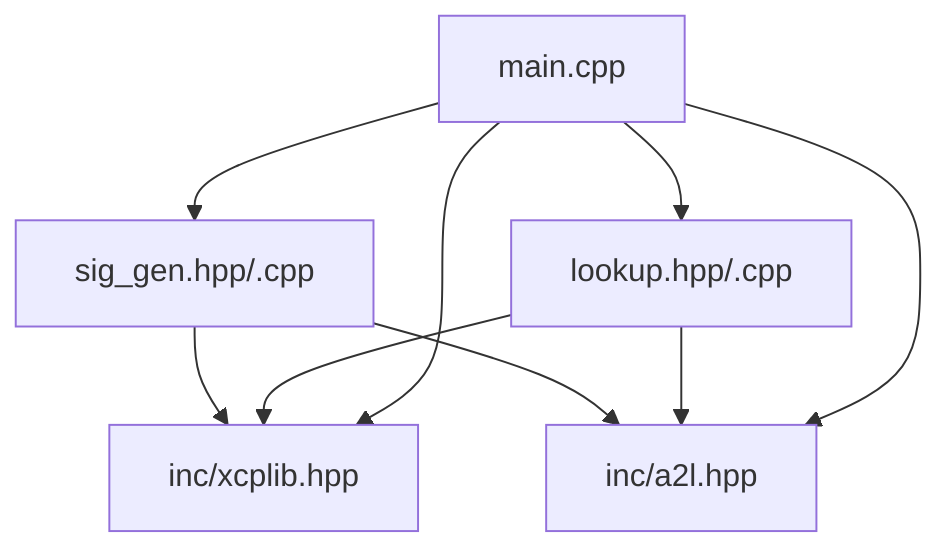
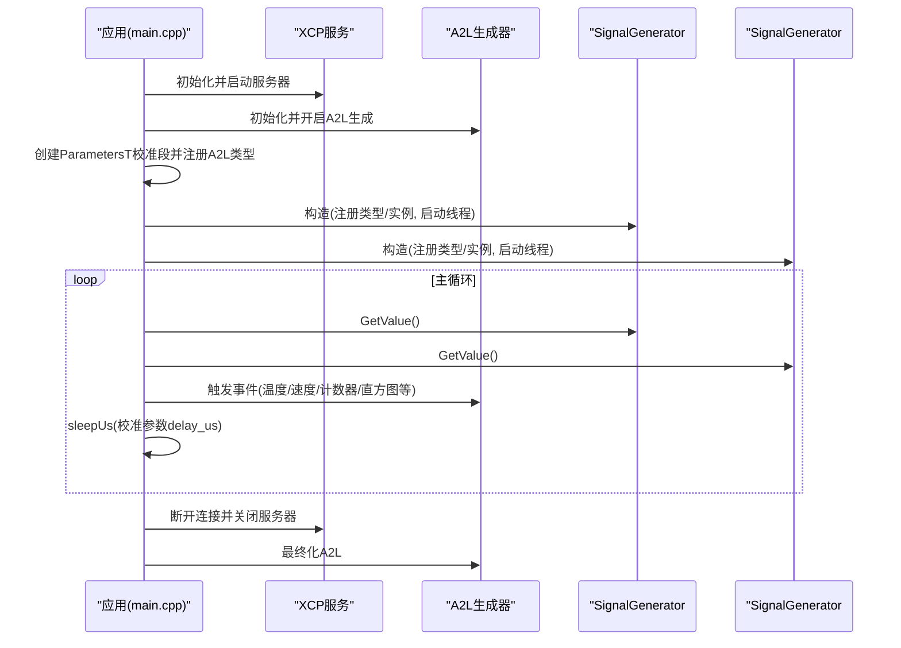
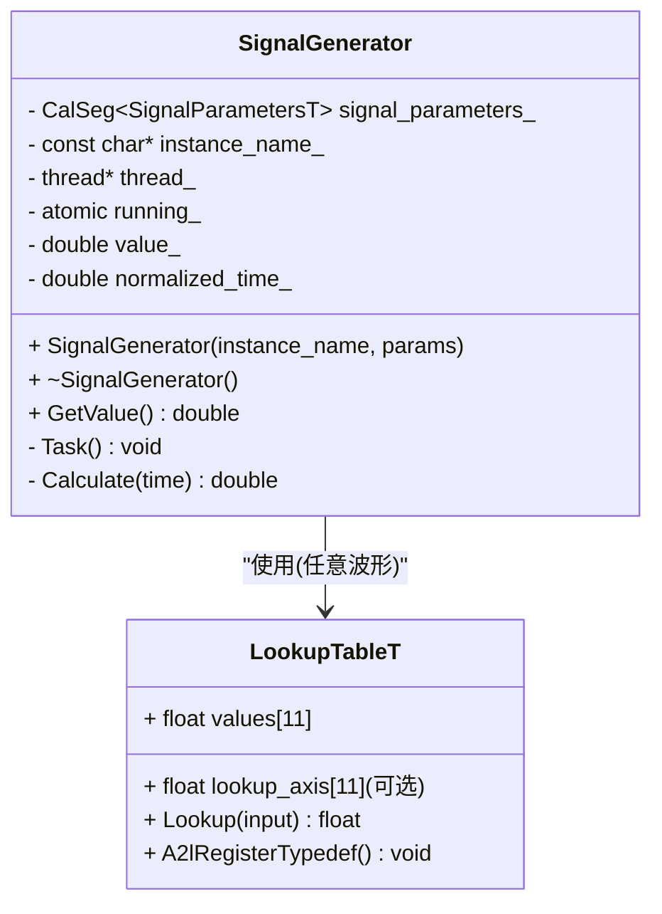
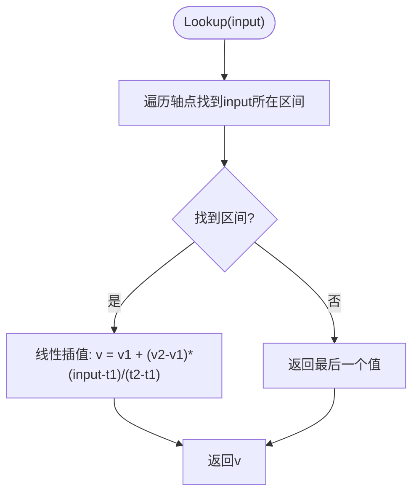
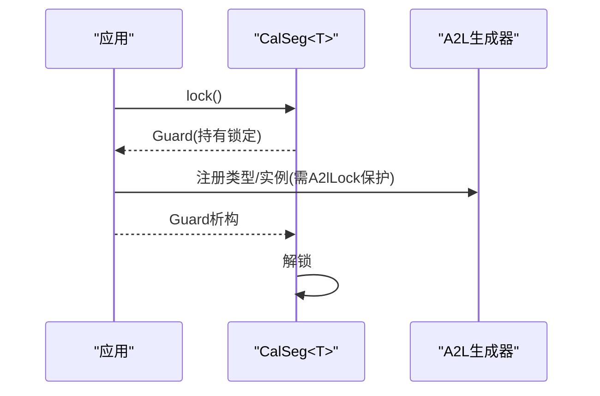
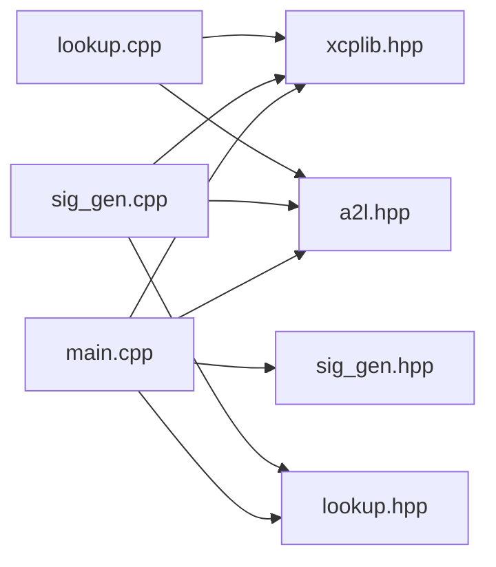

# C++封装特性示例

<cite>
**本文引用的文件**
- [examples/cpp_demo/src/main.cpp](file://examples/cpp_demo/src/main.cpp)
- [examples/cpp_demo/src/sig_gen.hpp](file://examples/cpp_demo/src/sig_gen.hpp)
- [examples/cpp_demo/src/sig_gen.cpp](file://examples/cpp_demo/src/sig_gen.cpp)
- [examples/cpp_demo/src/lookup.hpp](file://examples/cpp_demo/src/lookup.hpp)
- [examples/cpp_demo/src/lookup.cpp](file://examples/cpp_demo/src/lookup.cpp)
- [inc/xcplib.hpp](file://inc/xcplib.hpp)
- [inc/a2l.hpp](file://inc/a2l.hpp)
- [CMakeLists.txt](file://CMakeLists.txt)
- [examples/cpp_demo/README.md](file://examples/cpp_demo/README.md)
</cite>

## 目录
1. [简介](#简介)
2. [项目结构](#项目结构)
3. [核心组件](#核心组件)
4. [架构总览](#架构总览)
5. [详细组件分析](#详细组件分析)
6. [依赖关系分析](#依赖关系分析)
7. [性能考量](#性能考量)
8. [故障排查指南](#故障排查指南)
9. [结论](#结论)
10. [附录：集成与编译配置](#附录集成与编译配置)

## 简介
本文件围绕 XCPlite 的 C++ 封装特性，系统讲解 cpp_demo 示例中展示的现代 C++ 最佳实践，包括：
- RAII 资源管理模式（校准段锁、A2L 注册守卫）
- 智能指针与线程安全（std::thread、std::atomic）
- 异常安全编程（RAII 保证析构路径释放资源）
- 模板元编程技术（类型推导、编译期维度推导、可变参数模板）
- 信号生成器类（多态设计、回调机制、线程安全的信号处理）
- 查找表系统（类型推导、编译时计算、运行时优化）
- C++ API 如何简化 XCP 库使用（自动资源管理、错误处理、性能优化策略）
并提供项目集成指南、编译配置选项和调试技巧。

## 项目结构
cpp_demo 示例位于 examples/cpp_demo，核心源码在 src 目录下：
- main.cpp：应用入口，初始化 XCP/A2L，创建校准段，启动主循环与信号发生器实例
- sig_gen.hpp/.cpp：SignalGenerator 类实现，包含波形生成、线程任务、成员变量测量注册
- lookup.hpp/.cpp：可校准查找表 LookupTableT，支持共享轴与线性插值
- inc/xcplib.hpp：XCPlite C++ API，提供 CalSeg/CalBlk 等 RAII 包装、事件触发宏
- inc/a2l.hpp：A2L 生成的 C++ 辅助接口，提供 once-guard、typedef 构建器等

图表来源
- [examples/cpp_demo/src/main.cpp:1-247](file://examples/cpp_demo/src/main.cpp#L1-L247)
- [examples/cpp_demo/src/sig_gen.hpp:1-65](file://examples/cpp_demo/src/sig_gen.hpp#L1-L65)
- [examples/cpp_demo/src/sig_gen.cpp:1-130](file://examples/cpp_demo/src/sig_gen.cpp#L1-L130)
- [examples/cpp_demo/src/lookup.hpp:1-33](file://examples/cpp_demo/src/lookup.hpp#L1-L33)
- [examples/cpp_demo/src/lookup.cpp:1-61](file://examples/cpp_demo/src/lookup.cpp#L1-L61)
- [inc/xcplib.hpp:1-498](file://inc/xcplib.hpp#L1-L498)
- [inc/a2l.hpp:1-326](file://inc/a2l.hpp#L1-L326)

章节来源
- [examples/cpp_demo/README.md:1-57](file://examples/cpp_demo/README.md#L1-L57)

## 核心组件
- 校准段 RAII 包装 xcp::CalSeg<T>：提供 lock() 返回的 Guard 对象，作用域退出自动解锁；支持 CreateA2lTypedefInstance 注册 A2L 实例描述
- 单值校准包装 xcp::CalBlk<T>：同 CalSeg 但针对单一标量或简单类型
- 非拥有型引用 xcp::CalSegRef<T>：基于链接期段注册的延迟初始化句柄，容忍未初始化索引
- A2L 一次性注册与线程安全：a2l::A2lOnceGuard、A2lLock/A2lUnlock、A2lCreateTypedef 系列宏
- 事件与测量：DaqEventVar/DaqTriggerEventExt_s 等宏，支持相对地址模式与动态基址
- 查找表 LookupTableT：固定尺寸数组 + 可选共享轴，Lookup 函数实现线性插值

章节来源
- [inc/xcplib.hpp:38-283](file://inc/xcplib.hpp#L38-L283)
- [inc/a2l.hpp:50-110](file://inc/a2l.hpp#L50-L110)
- [inc/a2l.hpp:237-320](file://inc/a2l.hpp#L237-L320)
- [examples/cpp_demo/src/lookup.hpp:17-30](file://examples/cpp_demo/src/lookup.hpp#L17-L30)
- [examples/cpp_demo/src/lookup.cpp:43-58](file://examples/cpp_demo/src/lookup.cpp#L43-L58)

## 架构总览
cpp_demo 的整体流程如下：
- 初始化 XCP 与以太网服务器，启用 A2L 生成
- 创建 ParametersT 校准段并注册 A2L 类型定义
- 创建两个 SignalGenerator 实例，各自独立线程运行，注册成员变量与局部变量的测量
- 主循环读取信号值、更新全局变量、触发事件采集
- 程序退出时按 RAII 顺序释放资源（线程 join、关闭服务器、最终化 A2L）

图表来源
- [examples/cpp_demo/src/main.cpp:91-235](file://examples/cpp_demo/src/main.cpp#L91-L235)
- [examples/cpp_demo/src/sig_gen.cpp:28-65](file://examples/cpp_demo/src/sig_gen.cpp#L28-L65)
- [examples/cpp_demo/src/sig_gen.cpp:67-127](file://examples/cpp_demo/src/sig_gen.cpp#L67-L127)

## 详细组件分析

### 信号生成器类 SignalGenerator
- 多态设计：通过枚举 SignalTypeT 选择不同波形（正弦、方波、三角波、锯齿波、任意波形），并在 Task 中 switch 分支计算瞬时值
- 回调机制：无显式回调，采用“事件触发”模式，每周期调用 DaqTriggerEventExt_s 将当前实例的成员变量与局部变量作为测量数据上报
- 线程安全：
  - 使用 std::thread 运行 Task，std::atomic<bool> running_ 控制停止
  - 访问校准参数时使用 CalSeg::lock() 的 RAII Guard，确保临界区最小化且自动解锁
  - A2L 注册阶段使用 A2lLock()/A2lUnlock() 保护多线程并发注册
- 成员变量测量：通过相对地址模式（base=this）与实例名前缀，使每个实例的 value_ 与 time 可被工具识别为独立通道

图表来源
- [examples/cpp_demo/src/sig_gen.hpp:21-63](file://examples/cpp_demo/src/sig_gen.hpp#L21-L63)
- [examples/cpp_demo/src/lookup.hpp:17-30](file://examples/cpp_demo/src/lookup.hpp#L17-L30)

章节来源
- [examples/cpp_demo/src/sig_gen.cpp:28-65](file://examples/cpp_demo/src/sig_gen.cpp#L28-L65)
- [examples/cpp_demo/src/sig_gen.cpp:67-127](file://examples/cpp_demo/src/sig_gen.cpp#L67-L127)

### 查找表系统 LookupTableT
- 类型推导：A2L 类型定义通过 a2l.hpp 中的模板与宏，自动推导字段类型、维度与偏移
- 编译时计算：数组大小 kLookupTableSize 为 constexpr，用于静态分配与编译期断言
- 运行时优化：
  - Lookup 函数对输入归一化时间进行区间定位，线性插值得到输出值
  - 当定义 CANAPE_24 时，支持共享轴（lookup_axis），便于工具端统一显示与标定
- A2L 注册：A2lRegisterTypedef 根据是否启用共享轴，分别调用曲线+轴或仅曲线的注册接口

图表来源
- [examples/cpp_demo/src/lookup.cpp:43-58](file://examples/cpp_demo/src/lookup.cpp#L43-L58)
- [examples/cpp_demo/src/lookup.cpp:23-41](file://examples/cpp_demo/src/lookup.cpp#L23-L41)

章节来源
- [examples/cpp_demo/src/lookup.cpp:1-61](file://examples/cpp_demo/src/lookup.cpp#L1-L61)

### 校准段 RAII 与 A2L 注册
- xcp::CalSeg<T>::lock() 返回 Guard，作用域结束自动解锁，避免忘记解锁导致的死锁或工具卡顿
- A2lOnce()/A2lThreadOnce() 提供一次执行语义，配合 A2lLock/A2lUnlock 保证多线程注册安全
- A2lCreateTypedef 系列宏利用可变参数模板与 lambda 构建器，自动推导字段类型与维度，减少样板代码

图表来源
- [inc/xcplib.hpp:38-110](file://inc/xcplib.hpp#L38-L110)
- [inc/a2l.hpp:100-110](file://inc/a2l.hpp#L100-L110)
- [inc/a2l.hpp:296-320](file://inc/a2l.hpp#L296-L320)

章节来源
- [inc/xcplib.hpp:38-283](file://inc/xcplib.hpp#L38-L283)
- [inc/a2l.hpp:50-110](file://inc/a2l.hpp#L50-L110)
- [inc/a2l.hpp:237-320](file://inc/a2l.hpp#L237-L320)

### 事件与测量（可变参数模板）
- DaqEventVar/DaqEventAtVar 等宏结合 MeasurementInfo/InstanceInfo，将多个测量项打包并通过可变参数模板展开注册与触发
- 支持相对地址模式（以 this 为基址），使得成员变量可在工具中按实例区分
- 使用 static once_flag 与 call_once 确保事件与测量只注册一次，降低运行时开销

章节来源
- [inc/xcplib.hpp:302-493](file://inc/xcplib.hpp#L302-L493)
- [examples/cpp_demo/src/sig_gen.cpp:73-84](file://examples/cpp_demo/src/sig_gen.cpp#L73-L84)
- [examples/cpp_demo/src/sig_gen.cpp:118-119](file://examples/cpp_demo/src/sig_gen.cpp#L118-L119)

## 依赖关系分析
- main.cpp 依赖 xcplib.hpp 与 a2l.hpp，以及自定义模块 sig_gen.hpp、lookup.hpp
- sig_gen.cpp 依赖 xcplib.hpp、a2l.hpp 与 lookup.hpp，使用 CalSeg 与 A2L 注册接口
- lookup.cpp 依赖 a2l.hpp 与 xcplib.hpp，提供 A2L 类型注册与 Lookup 算法
- CMakeLists.txt 提供构建配置与选项，控制是否启用 A2L、示例、测试等

图表来源
- [examples/cpp_demo/src/main.cpp:1-247](file://examples/cpp_demo/src/main.cpp#L1-L247)
- [examples/cpp_demo/src/sig_gen.cpp:1-130](file://examples/cpp_demo/src/sig_gen.cpp#L1-L130)
- [examples/cpp_demo/src/lookup.cpp:1-61](file://examples/cpp_demo/src/lookup.cpp#L1-L61)
- [inc/xcplib.hpp:1-498](file://inc/xcplib.hpp#L1-L498)
- [inc/a2l.hpp:1-326](file://inc/a2l.hpp#L1-L326)

章节来源
- [CMakeLists.txt:1-200](file://CMakeLists.txt#L1-L200)

## 性能考量
- 校准段锁粒度：尽量缩小 lock() 的作用域，避免在临界区内执行耗时操作（如 sleepUs），以减少工具校准操作的阻塞
- 事件注册一次性：使用 once_flag 与 call_once 避免重复注册带来的额外开销
- 查找表插值：线性插值复杂度 O(n)，n=11 较小；如需更高性能可考虑二分查找或分段近似
- 线程调度：信号生成器线程使用 sleepUs 控制周期，注意与主循环的同步与资源竞争
- A2L 生成：在多线程环境下使用 A2lLock/A2lUnlock 保护注册过程，避免竞态条件

## 故障排查指南
- A2L 注册冲突：若多个线程同时注册测量/类型，需使用 A2lLock/A2lUnlock 保护；示例中在信号生成器线程内已加锁
- 工具无法连接：检查 XCP 服务器初始化参数（端口、IP、TCP/UDP），确认防火墙设置
- 校准参数不生效：确认 CalSeg 的默认参数与参考页/工作页切换逻辑正确；确保在 lock() 作用域外修改参数后重新获取
- 信号值异常：检查归一化时间与周期计算是否正确；确认查找表轴与值对应关系一致
- 崩溃或悬挂：确认线程在析构时 joinable() 后再 join，并 delete 线程对象；确保 running_ 标志正确置位

章节来源
- [examples/cpp_demo/src/sig_gen.cpp:57-65](file://examples/cpp_demo/src/sig_gen.cpp#L57-L65)
- [examples/cpp_demo/src/sig_gen.cpp:73-84](file://examples/cpp_demo/src/sig_gen.cpp#L73-L84)
- [examples/cpp_demo/src/main.cpp:91-115](file://examples/cpp_demo/src/main.cpp#L91-L115)

## 结论
cpp_demo 展示了现代 C++ 在嵌入式与仪器场景下的最佳实践：
- 通过 RAII 与模板元编程，显著降低样板代码与出错概率
- 借助 CalSeg/CalBlk 与 A2L 生成接口，实现零拷贝、线程安全的校准与测量
- 信号生成器与查找表的组合，提供了灵活高效的波形生成能力
- 事件驱动与可变参数模板，简化了多通道数据采集与上报流程
这些模式可直接迁移至实际项目中，提升可维护性与性能。

## 附录：集成与编译配置
- 构建配置：通过 CMake 选项 XCPLITE_CONFIGURATION 选择不同配置（default/no_a2l/ptp/shm/rtos/raw）
- 示例构建：启用 XCPLITE_BUILD_EXAMPLES 后可构建 cpp_demo 目标
- 平台标准：非 Windows 平台使用 C++17，Windows 使用 C++20
- 应用覆盖头：可通过 XCPLITE_CFG_OVERRIDE 指定应用级配置覆盖头（仅在 default 配置下有效）
- 调试建议：
  - 使用 Debug 构建类型以便符号信息完整
  - 在 A2L 生成阶段开启日志级别，观察命令交互
  - 使用 GDB/LLDB 附加进程，检查线程状态与锁持有情况

章节来源
- [CMakeLists.txt:15-108](file://CMakeLists.txt#L15-L108)
- [CMakeLists.txt:111-186](file://CMakeLists.txt#L111-L186)
- [examples/cpp_demo/README.md:32-57](file://examples/cpp_demo/README.md#L32-L57)