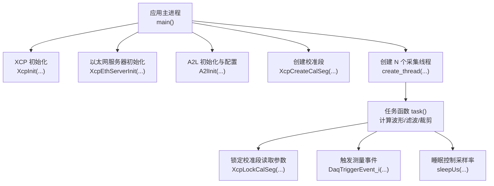
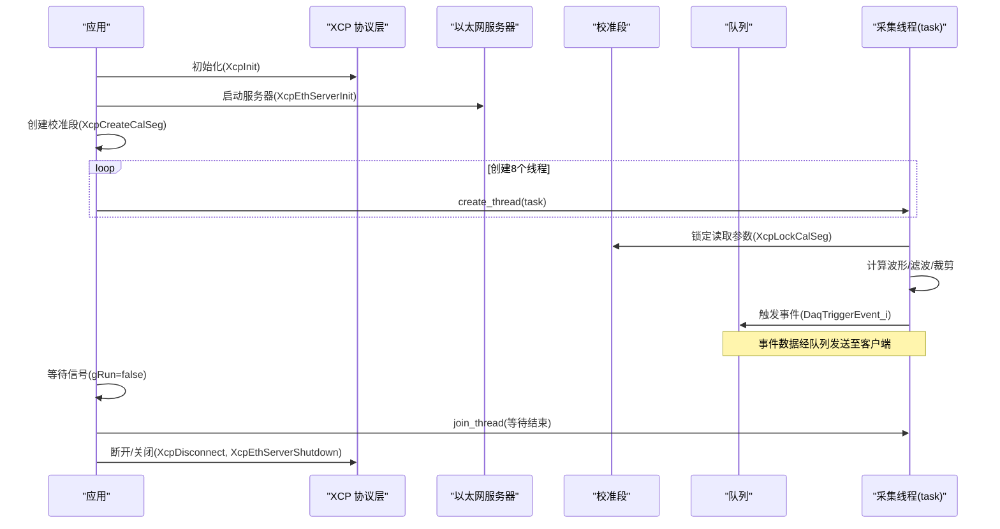
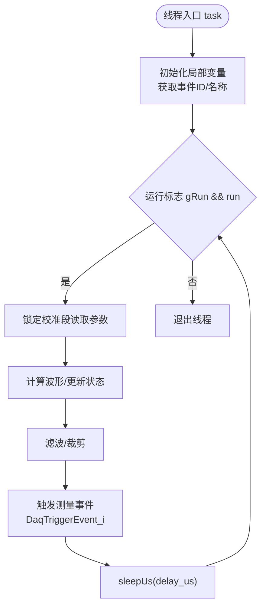
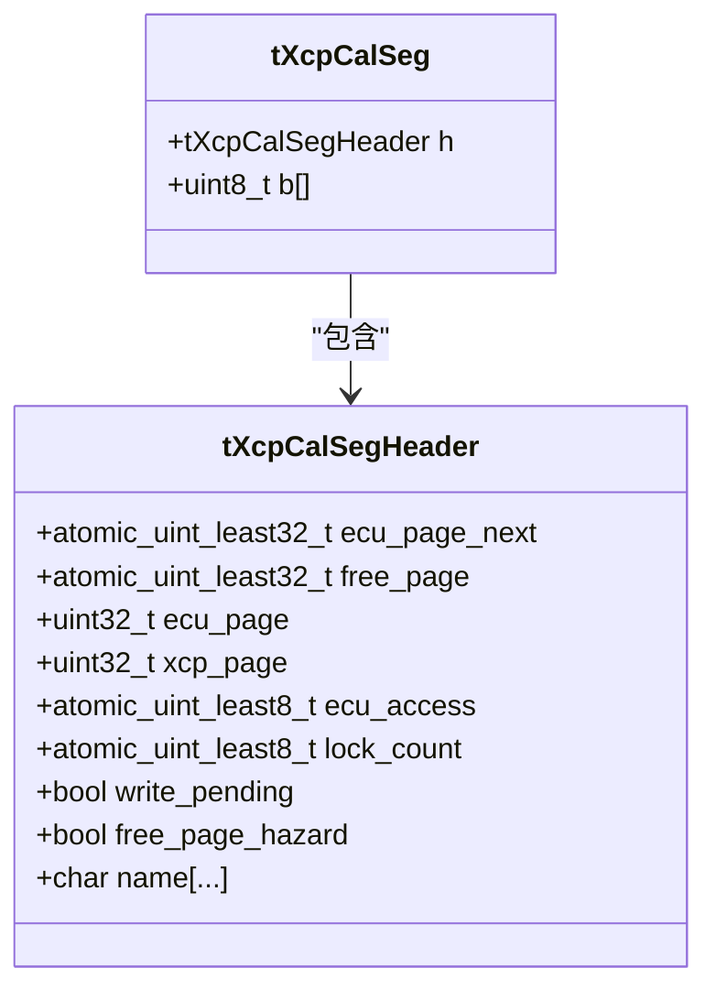
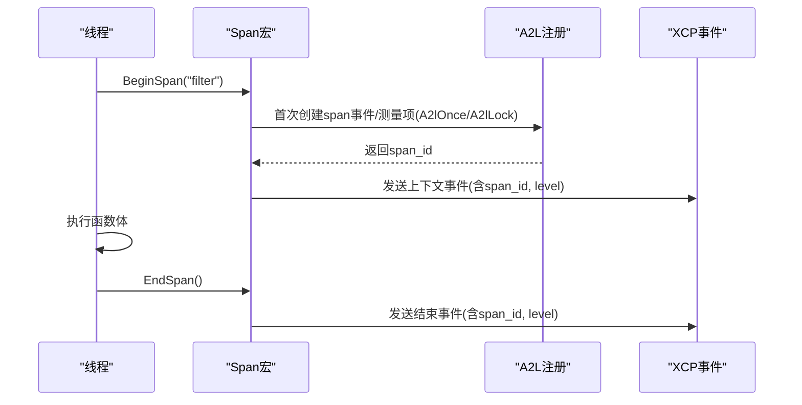
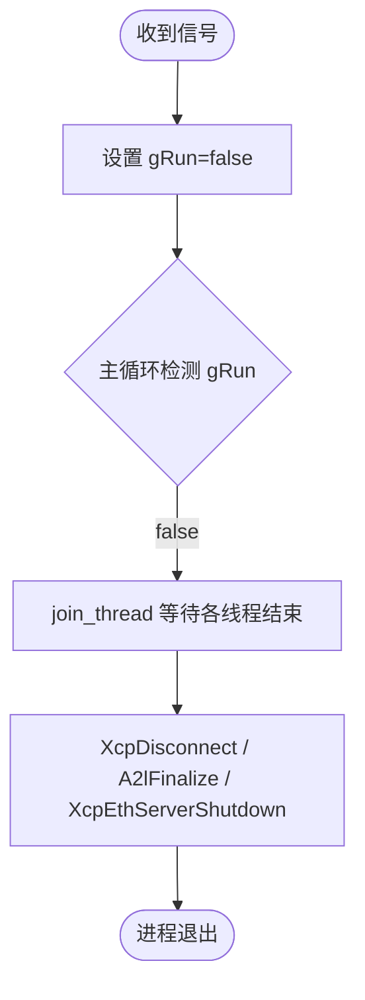
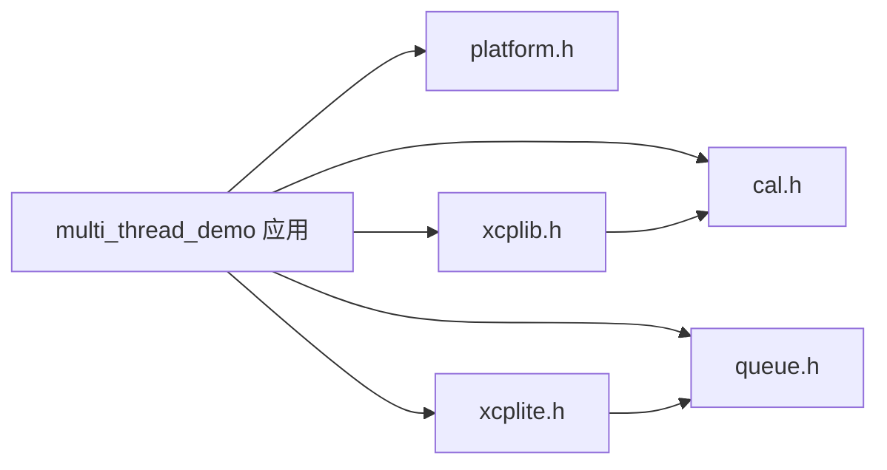

# 多线程数据采集示例

<cite>
**本文引用的文件**
- [examples/multi_thread_demo/src/main.c](file://examples/multi_thread_demo/src/main.c)
- [examples/multi_thread_demo/README.md](file://examples/multi_thread_demo/README.md)
- [src/platform.h](file://src/platform.h)
- [src/xcplite.h](file://src/xcplite.h)
- [inc/xcplib.h](file://inc/xcplib.h)
- [src/cal.h](file://src/cal.h)
- [src/queue.h](file://src/queue.h)
</cite>

## 目录
1. [简介](#简介)
2. [项目结构](#项目结构)
3. [核心组件](#核心组件)
4. [架构总览](#架构总览)
5. [详细组件分析](#详细组件分析)
6. [依赖关系分析](#依赖关系分析)
7. [性能考量](#性能考量)
8. [故障排查指南](#故障排查指南)
9. [结论](#结论)
10. [附录](#附录)

## 简介
本文件围绕 multi_thread_demo 示例，系统性解析基于 XCPlite 的多线程 XCP 数据采集架构。重点涵盖：
- 8 个并发采集线程的创建与管理
- 线程安全的数据访问机制（无锁校准段）
- 测量事件与线程本地上下文追踪（BeginSpan/EndSpan、线程本地存储）
- 信号处理与优雅关闭流程
- 资源清理策略与性能基准要点
- 实际使用模式：创建测量事件、注册校准参数、跨线程共享数据

该示例展示了在高并发场景下，如何以极低开销实现稳定、可观测、可校准的实时数据采集。

## 项目结构
multi_thread_demo 位于 examples/multi_thread_demo，核心为单入口 main.c，配合平台抽象层与 XCPlite 库完成线程管理、XCP 服务器初始化、A2L 生成、校准段管理与测量事件触发。

图表来源
- [examples/multi_thread_demo/src/main.c:343-418](file://examples/multi_thread_demo/src/main.c#L343-L418)
- [src/xcplite.h:55-77](file://src/xcplite.h#L55-L77)
- [inc/xcplib.h:39-49](file://inc/xcplib.h#L39-L49)
- [src/cal.h:186-200](file://src/cal.h#L186-L200)
- [src/platform.h:368-433](file://src/platform.h#L368-L433)

章节来源
- [examples/multi_thread_demo/src/main.c:343-418](file://examples/multi_thread_demo/src/main.c#L343-L418)
- [examples/multi_thread_demo/README.md:1-74](file://examples/multi_thread_demo/README.md#L1-L74)

## 核心组件
- 线程与平台抽象：通过 platform.h 提供 create_thread/join_thread/sleepUs/clockGetMonotonicUs 等跨平台接口，统一 Windows/Linux/macOS/FreeRTOS 的行为差异。
- XCP 协议与服务器：通过 xcplite.h 暴露 XcpInit/XcpEthServerInit/XcpDisconnect 等 API，负责协议栈生命周期与网络服务。
- 校准段（Calibration Segment）：通过 cal.h 提供的 XcpCreateCalSeg/XcpLockCalSeg/XcpUnlockCalSeg 实现“工作页/参考页”原子切换，保证多读一写下的线程安全与一致性。
- 队列（Queue）：通过 queue.h 定义无锁或互斥的高性能队列接口，用于 DAQ 数据从生产者到消费者的低延迟传输。
- 测量事件与 A2L：通过 DaqCreateEventInstance/DaqTriggerEvent_i 与 A2l* 系列宏/函数，将运行时变量与事件绑定并生成 A2L 描述。

章节来源
- [src/platform.h:368-433](file://src/platform.h#L368-L433)
- [src/xcplite.h:55-77](file://src/xcplite.h#L55-L77)
- [src/cal.h:186-200](file://src/cal.h#L186-L200)
- [src/queue.h:101-187](file://src/queue.h#L101-L187)
- [examples/multi_thread_demo/src/main.c:274-292](file://examples/multi_thread_demo/src/main.c#L274-L292)

## 架构总览
下图展示从应用启动到数据采集、事件触发、以及关闭的全链路交互。

图表来源
- [examples/multi_thread_demo/src/main.c:343-418](file://examples/multi_thread_demo/src/main.c#L343-L418)
- [src/xcplite.h:55-77](file://src/xcplite.h#L55-L77)
- [src/cal.h:186-200](file://src/cal.h#L186-L200)
- [src/queue.h:122-187](file://src/queue.h#L122-L187)

## 详细组件分析

### 线程模型与任务循环
- 线程数量：固定为 8 个并发采集线程（THREAD_COUNT=8）。
- 任务职责：每个线程独立维护局部变量（计数器、时间、通道信号、数组），按周期计算正弦/方波/锯齿波，并进行滤波与裁剪，最后触发测量事件。
- 采样率控制：通过 sleepUs(delay_us) 控制近似采样间隔，delay_us 来自校准段参数，支持在线调整。
- 事件注册：在任务入口处调用 DaqCreateEventInstance 与 A2lCreateMeasurementInstance，将局部变量绑定到事件实例，并使用栈地址模式确保每线程独立测量。

图表来源
- [examples/multi_thread_demo/src/main.c:257-338](file://examples/multi_thread_demo/src/main.c#L257-L338)
- [src/platform.h:258-263](file://src/platform.h#L258-L263)

章节来源
- [examples/multi_thread_demo/src/main.c:257-338](file://examples/multi_thread_demo/src/main.c#L257-L338)

### 线程安全的数据访问：无锁校准段
- 设计目标：多个线程同时读取校准参数时，无需互斥锁即可保证一致性与可见性；XCP 修改参数时通过“工作页/参考页”原子切换，避免脏读。
- 使用方式：
  - 创建校准段：XcpCreateCalSeg("params", &params, sizeof(params))
  - 读取参数：const params_t *p = (params_t *)XcpLockCalSeg(calseg); ...; XcpUnlockCalSeg(calseg);
- 内部机制：
  - 头结构包含原子字段（如 ecu_page_next/free_page/ecu_access/lock_count），页偏移以字节偏移形式存储，便于跨进程/共享内存安全。
  - 锁定操作为 wait-free，允许递归锁定，适合高频路径。

图表来源
- [src/cal.h:86-157](file://src/cal.h#L86-L157)

章节来源
- [src/cal.h:86-157](file://src/cal.h#L86-L157)
- [examples/multi_thread_demo/src/main.c:369-385](file://examples/multi_thread_demo/src/main.c#L369-L385)
- [examples/multi_thread_demo/src/main.c:185-195](file://examples/multi_thread_demo/src/main.c#L185-L195)

### 测量事件与线程本地上下文追踪（BeginSpan/EndSpan）
- 背景：启用 EXPERIMENTAL_THREAD_CONTEXT 后，可在关键函数（如 filter/clip）中插入 BeginSpan/EndSpan，记录执行跨度与嵌套层级，辅助性能分析。
- 工作原理：
  - BeginSpan：记录开始时间戳，首次进入时一次性创建 span 事件与 A2L 测量项，设置栈地址模式，并将当前上下文（span_id、level）写入事件数据。
  - EndSpan：记录结束时间戳，发送 span 事件，恢复上一级 span 与 level。
  - 线程本地存储：使用 THREAD_LOCAL 保存每个线程的上下文结构体，避免跨线程污染。
- 集成点：
  - 在 filter/clip 中包裹 BeginSpan/EndSpan
  - 在任务内创建上下文（XcpCreateContext）并注册 typedef 实例，使 CANape 等工具能可视化上下文与度量

图表来源
- [examples/multi_thread_demo/src/main.c:97-124](file://examples/multi_thread_demo/src/main.c#L97-L124)
- [examples/multi_thread_demo/src/main.c:129-163](file://examples/multi_thread_demo/src/main.c#L129-L163)
- [examples/multi_thread_demo/src/main.c:207-247](file://examples/multi_thread_demo/src/main.c#L207-L247)

章节来源
- [examples/multi_thread_demo/src/main.c:78-168](file://examples/multi_thread_demo/src/main.c#L78-L168)
- [examples/multi_thread_demo/src/main.c:173-247](file://examples/multi_thread_demo/src/main.c#L173-L247)

### 信号处理与优雅关闭
- 信号处理：注册 SIGINT/SIGTERM 处理器，将全局运行标志 gRun 置为 false，通知所有线程退出。
- 关闭流程：
  - 主循环等待 gRun 变为 false
  - 逐个 join 线程，确保任务正常退出
  - 可选打印统计信息（TEST_ENABLE_DBG_METRICS）
  - 断开 XCP 客户端、最终化 A2L、关闭服务器
  - 可选打印时钟统计（TEST_CLOCK_GET_STATISTIC）

图表来源
- [examples/multi_thread_demo/src/main.c:251-253](file://examples/multi_thread_demo/src/main.c#L251-L253)
- [examples/multi_thread_demo/src/main.c:394-417](file://examples/multi_thread_demo/src/main.c#L394-L417)

章节来源
- [examples/multi_thread_demo/src/main.c:251-253](file://examples/multi_thread_demo/src/main.c#L251-L253)
- [examples/multi_thread_demo/src/main.c:394-417](file://examples/multi_thread_demo/src/main.c#L394-L417)

### 资源清理策略
- 线程资源：通过 join_thread 等待线程退出，释放系统线程句柄/任务。
- XCP 资源：XcpDisconnect 强制断开客户端并刷新队列与待处理的校准变更；XcpEthServerShutdown 停止网络服务。
- A2L 资源：A2lFinalize 确保 A2L 文件完整输出（若未在连接时最终化）。
- 统计与诊断：可选启用 TEST_* 宏输出队列/时钟统计，便于定位瓶颈。

章节来源
- [examples/multi_thread_demo/src/main.c:394-417](file://examples/multi_thread_demo/src/main.c#L394-L417)

## 依赖关系分析
- 应用层依赖：
  - platform.h：线程、睡眠、时钟、原子与 TLS
  - xcplib.h：XCP 服务器与校准段公共 API
  - xcplite.h：协议层内部类型与事件 API
  - cal.h：校准段结构与内部实现细节
  - queue.h：队列通用接口（生产者/消费者）
- 耦合与内聚：
  - 任务函数仅依赖平台与 XCP 事件/校准段 API，内聚度高
  - 校准段对原子与队列有内部依赖，但对外提供简单锁定接口，降低耦合
  - 队列实现根据平台选择不同版本（无锁/互斥），对上层透明

图表来源
- [examples/multi_thread_demo/src/main.c:11-17](file://examples/multi_thread_demo/src/main.c#L11-L17)
- [src/platform.h:368-433](file://src/platform.h#L368-L433)
- [inc/xcplib.h:39-49](file://inc/xcplib.h#L39-L49)
- [src/xcplite.h:126-195](file://src/xcplite.h#L126-L195)
- [src/cal.h:186-200](file://src/cal.h#L186-L200)
- [src/queue.h:101-187](file://src/queue.h#L101-L187)

章节来源
- [examples/multi_thread_demo/src/main.c:11-17](file://examples/multi_thread_demo/src/main.c#L11-L17)
- [src/queue.h:101-187](file://src/queue.h#L101-L187)

## 性能考量
- 无锁队列与低争用：XCPlite 的无锁队列在多生产者高负载下保持极低锁持有时间与抖动，适合高频 DAQ。
- 校准段无锁读取：XcpLockCalSeg 为 wait-free，适合热路径；页面切换由 XCP 侧原子完成，避免阻塞。
- 事件触发开销：DaqTriggerEvent_i 将测量数据入队，队列容量需足够大以避免丢包（示例默认 1MB）。
- 采样率与 CPU 占用：通过 sleepUs 调节采样间隔，过短会增加 CPU 占用与队列压力；过长则降低数据密度。
- 基准参考：示例 README 提供了 8 线程、50 µs 休眠条件下的生产者锁时间统计与直方图，可作为性能基线。

章节来源
- [examples/multi_thread_demo/README.md:54-74](file://examples/multi_thread_demo/README.md#L54-L74)
- [src/queue.h:122-187](file://src/queue.h#L122-L187)
- [src/cal.h:186-200](file://src/cal.h#L186-L200)

## 故障排查指南
- 无法连接 XCP 服务器：
  - 检查端口与协议（TCP/UDP）配置是否与客户端一致
  - 确认防火墙与网络可达性
- 测量数据缺失或抖动：
  - 增大队列大小或降低采样频率
  - 检查 sleepUs 是否过短导致 CPU 饱和
- 校准参数未生效：
  - 确认已调用 XcpCreateCalSeg 并在任务中正确锁定/解锁
  - 检查 A2L 参数范围与单位是否正确
- 线程未退出或资源泄漏：
  - 确保信号处理后调用 join_thread 等待所有线程
  - 确认 XcpDisconnect 与 XcpEthServerShutdown 被调用
- 上下文/跨度不可见：
  - 确认启用 EXPERIMENTAL_THREAD_CONTEXT
  - 检查 A2L 是否包含 span 事件与上下文 typedef 实例

章节来源
- [examples/multi_thread_demo/src/main.c:343-417](file://examples/multi_thread_demo/src/main.c#L343-L417)
- [examples/multi_thread_demo/README.md:46-74](file://examples/multi_thread_demo/README.md#L46-L74)

## 结论
multi_thread_demo 展示了在高并发环境下，利用 XCPlite 的无锁校准段、高效队列与事件机制，构建稳定、可观测、可校准的多线程数据采集系统的最佳实践。通过 BeginSpan/EndSpan 与线程本地上下文，开发者可以低成本地获得细粒度的性能洞察；借助信号处理与完善的关闭流程，系统具备优雅的停机能力。建议在实际项目中结合队列容量、采样率与硬件能力进行调优，以获得最优吞吐与时延表现。

## 附录
- 快速上手
  - 构建与运行：参考示例 README 中的构建命令
  - 连接 CANape：使用预置配置文件，端口 5555，自动上传 A2L
- 关键代码片段路径（不含源码内容）
  - 创建测量事件与实例：[examples/multi_thread_demo/src/main.c:274-292](file://examples/multi_thread_demo/src/main.c#L274-L292)
  - 注册校准参数：[examples/multi_thread_demo/src/main.c:369-385](file://examples/multi_thread_demo/src/main.c#L369-L385)
  - 跨线程共享参数（无锁访问）：[examples/multi_thread_demo/src/main.c:185-195](file://examples/multi_thread_demo/src/main.c#L185-L195)
  - BeginSpan/EndSpan 宏与上下文：[examples/multi_thread_demo/src/main.c:97-124](file://examples/multi_thread_demo/src/main.c#L97-L124), [examples/multi_thread_demo/src/main.c:129-163](file://examples/multi_thread_demo/src/main.c#L129-L163)
  - 线程创建与等待：[examples/multi_thread_demo/src/main.c:387-403](file://examples/multi_thread_demo/src/main.c#L387-L403)
  - 优雅关闭与资源清理：[examples/multi_thread_demo/src/main.c:394-417](file://examples/multi_thread_demo/src/main.c#L394-L417)