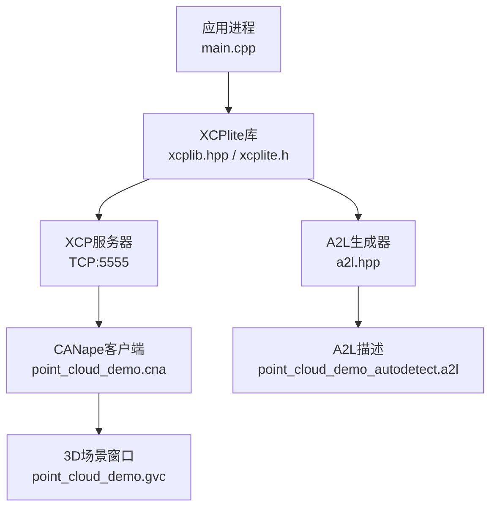
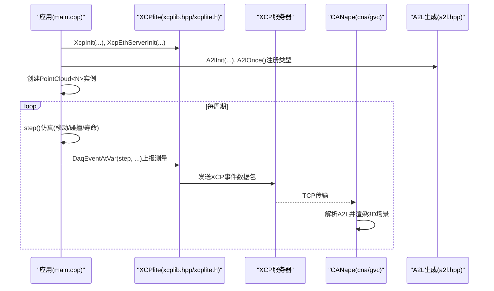
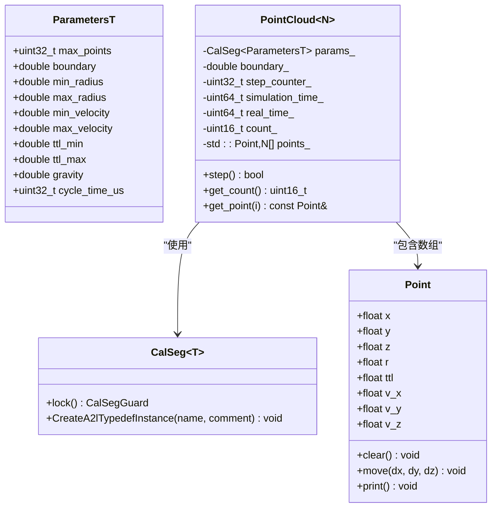
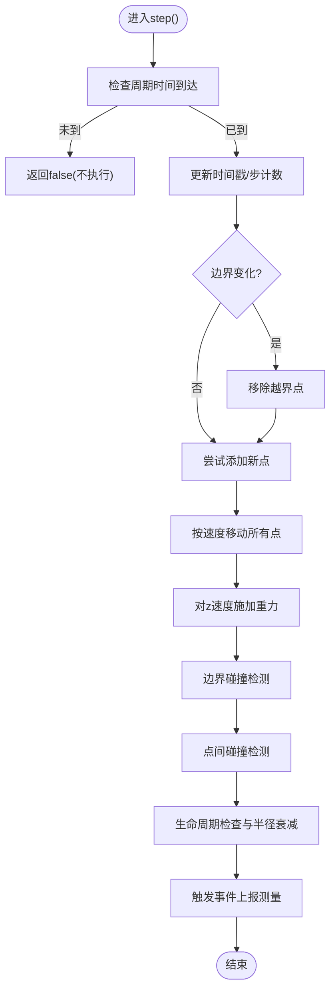
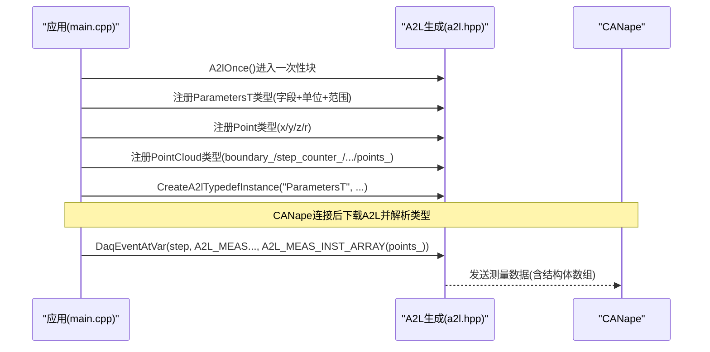
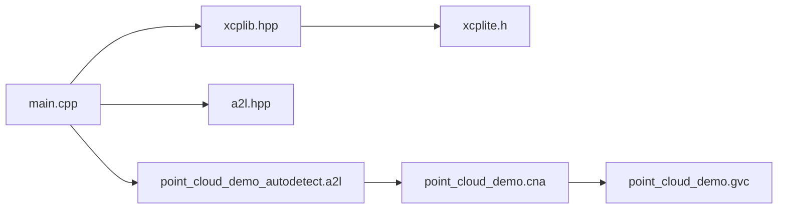

# 点云数据处理示例

<cite>
**本文引用的文件**
- [main.cpp](file://examples/point_cloud_demo/src/main.cpp)
- [README.md](file://examples/point_cloud_demo/README.md)
- [point_cloud_demo.cna](file://examples/point_cloud_demo/CANape/point_cloud_demo.cna)
- [point_cloud_demo.gvc](file://examples/point_cloud_demo/CANape/point_cloud_demo.gvc)
- [point_cloud_demo_autodetect.a2l](file://examples/point_cloud_demo/CANape/point_cloud_demo_autodetect.a2l)
- [xcplib.hpp](file://inc/xcplib.hpp)
- [a2l.hpp](file://inc/a2l.hpp)
- [xcplite.h](file://src/xcplite.h)
</cite>

## 目录
1. [简介](#简介)
2. [项目结构](#项目结构)
3. [核心组件](#核心组件)
4. [架构总览](#架构总览)
5. [详细组件分析](#详细组件分析)
6. [依赖关系分析](#依赖关系分析)
7. [性能与大数据传输优化](#性能与大数据传输优化)
8. [故障排除指南](#故障排除指南)
9. [结论](#结论)
10. [附录](#附录)

## 简介
本示例演示了如何在嵌入式或主机环境中，使用XCPlite的C++ API生成并实时传输动态数据结构（点云）到CANape进行3D可视化。示例通过简单的物理仿真（边界碰撞、点间碰撞、生命周期衰减等）产生点云数据，并以XCP事件方式将包含大量结构体数组的数据高效序列化并发送。文档重点说明：
- 动态数据结构与大容量点云的传输优化策略
- C++封装在复杂数据类型处理中的优势（模板、RAII锁、智能指针式访问）
- 点云生成算法与实时处理流水线
- 高效数据序列化机制（A2L类型注册、事件驱动测量）
- 与CANape集成（自定义可视化配置、数据流监控）
- 大数据量传输的性能调优与内存管理最佳实践
- 实际应用场景的代码路径参考与常见问题排查

## 项目结构
该示例位于 examples/point_cloud_demo，主要包含：
- src/main.cpp：点云仿真主程序、XCP/A2L初始化、事件循环与测量触发
- CANape/：预配置的CANape工程与3D场景配置文件
  - point_cloud_demo.cna：CANape工程配置，含校准对象、测量项、函数与显示布局
  - point_cloud_demo.gvc：3D场景图形绑定与可视化参数
  - point_cloud_demo_autodetect.a2l：运行时生成的A2L描述，定义类型、实例、测量与事件

图表来源
- [main.cpp:422-468](file://examples/point_cloud_demo/src/main.cpp#L422-L468)
- [xcplib.hpp:38-110](file://inc/xcplib.hpp#L38-L110)
- [xcplite.h:46-77](file://src/xcplite.h#L46-L77)
- [a2l.hpp:100-110](file://inc/a2l.hpp#L100-L110)
- [point_cloud_demo_autodetect.a2l:1-112](file://examples/point_cloud_demo/CANape/point_cloud_demo_autodetect.a2l#L1-L112)

章节来源
- [README.md:1-51](file://examples/point_cloud_demo/README.md#L1-L51)

## 核心组件
- Point结构：表示三维空间中的一个点，包含坐标、半径、寿命和速度分量，并提供移动、清空、打印等方法
- PointCloud<N>模板类：封装N个点的固定大小数组，维护仿真状态（边界、步数、时间戳）、参数段（CalSeg），以及仿真步进逻辑
- 参数段ParametersT：可标定参数集合（最大点数、边界尺寸、重力、速度范围、半径范围、寿命范围、周期时间），通过CalSeg实现线程安全的只读访问
- XCP事件与测量：通过DaqCreateEventExt创建周期性事件，并在每个仿真步调用DaqEventAtVar批量上报count_、real_time_、boundary_、step_counter_以及points_数组
- A2L类型注册：在A2lOnce保护下，注册ParametersT、Point、PointCloud的类型定义及实例，使CANape能识别并可视化动态结构

章节来源
- [main.cpp:35-96](file://examples/point_cloud_demo/src/main.cpp#L35-L96)
- [main.cpp:98-408](file://examples/point_cloud_demo/src/main.cpp#L98-L408)
- [xcplib.hpp:38-110](file://inc/xcplib.hpp#L38-L110)
- [a2l.hpp:100-200](file://inc/a2l.hpp#L100-L200)

## 架构总览
整体流程如下：
- 初始化阶段：设置日志级别，初始化XCP单例与以太网服务器，初始化A2L生成器；创建PointCloud实例并注册A2L类型
- 仿真循环：按周期计算一步，更新点位置、重力、碰撞检测、生命周期与半径衰减，随后触发事件上报测量数据
- 可视化阶段：CANape接收A2L与测量数据，解析类型与实例，将points_数组映射为3D场景中的球体集合，支持实时渲染与历史轨迹

图表来源
- [main.cpp:422-468](file://examples/point_cloud_demo/src/main.cpp#L422-L468)
- [main.cpp:341-407](file://examples/point_cloud_demo/src/main.cpp#L341-L407)
- [xcplite.h:183-195](file://src/xcplite.h#L183-L195)
- [a2l.hpp:100-110](file://inc/a2l.hpp#L100-L110)

## 详细组件分析

### 点云数据结构与模板封装
- Point结构：包含x/y/z坐标、r半径、ttl寿命、v_x/v_y/v_z速度；提供clear/move/print方法以支持生命周期管理与调试输出
- PointCloud<N>模板：使用std::array<Point,N>存储点集，避免堆分配开销；内部维护边界、步计数、仿真时间与真实时间；通过CalSeg<ParametersT>获取只读参数并自动加解锁

图表来源
- [main.cpp:35-96](file://examples/point_cloud_demo/src/main.cpp#L35-L96)
- [main.cpp:98-408](file://examples/point_cloud_demo/src/main.cpp#L98-L408)
- [xcplib.hpp:38-110](file://inc/xcplib.hpp#L38-L110)

章节来源
- [main.cpp:35-96](file://examples/point_cloud_demo/src/main.cpp#L35-L96)
- [main.cpp:98-408](file://examples/point_cloud_demo/src/main.cpp#L98-L408)
- [xcplib.hpp:38-110](file://inc/xcplib.hpp#L38-L110)

### 仿真算法与实时处理流水线
- 新增点：在中心位置随机生成速度与半径，受max_points限制
- 移动与重力：按周期时间delta_t更新位置，对z方向施加重力影响
- 边界碰撞：检查各轴是否越界，若越界则反射速度并修正位置
- 点间碰撞：计算欧氏距离，小于半径之和时执行弹性碰撞或合并（吸收对方部分半径与平均速度）
- 生命周期：逐点递减ttl，归零移除；同时按比例缩小半径以可视化寿命衰减
- 事件触发：在每个仿真步结束时，调用DaqEventAtVar上报当前状态与整个points_数组

图表来源
- [main.cpp:341-407](file://examples/point_cloud_demo/src/main.cpp#L341-L407)

章节来源
- [main.cpp:162-307](file://examples/point_cloud_demo/src/main.cpp#L162-L307)
- [main.cpp:341-407](file://examples/point_cloud_demo/src/main.cpp#L341-L407)

### 数据序列化与A2L类型注册
- A2lOnce保护：确保类型注册仅执行一次，避免重复定义
- 参数段类型：使用A2lTypedefBegin/End与A2lTypedefParameterComponent注册ParametersT的各字段，附带单位与范围
- 点类型：使用A2lCreateTypedef注册Point的x/y/z/r字段
- 点云类型：注册PointCloud的边界、计数器、时间戳、数量与points_数组（类型为Point，维度N）
- 实例化：通过CalSeg.CreateA2lTypedefInstance创建ParametersT实例，供CANape标定与显示
- 事件测量：在DaqEventAtVar中通过A2L_MEAS与A2L_MEAS_INST_ARRAY上报标量与结构体数组

图表来源
- [main.cpp:111-148](file://examples/point_cloud_demo/src/main.cpp#L111-L148)
- [main.cpp:397-404](file://examples/point_cloud_demo/src/main.cpp#L397-L404)
- [a2l.hpp:100-200](file://inc/a2l.hpp#L100-L200)

章节来源
- [main.cpp:111-148](file://examples/point_cloud_demo/src/main.cpp#L111-L148)
- [main.cpp:397-404](file://examples/point_cloud_demo/src/main.cpp#L397-L404)
- [point_cloud_demo_autodetect.a2l:23-112](file://examples/point_cloud_demo/CANape/point_cloud_demo_autodetect.a2l#L23-L112)

### 与CANape工具的集成
- 工程配置：point_cloud_demo.cna定义了校准对象（ParametersT字段）、测量项（step_counter_、boundary_、count_、$points_$）、函数（CycleTime）与显示布局
- 3D场景：point_cloud_demo.gvc将测量数据绑定到3D几何体（如立方体边界与点位置），支持历史轨迹与快速信息展示
- 自动A2L：point_cloud_demo_autodetect.a2l由运行时生成，包含模块、类型、实例、测量与事件定义，CANape据此完成可视化

章节来源
- [point_cloud_demo.cna:35-166](file://examples/point_cloud_demo/CANape/point_cloud_demo.cna#L35-L166)
- [point_cloud_demo.cna:388-800](file://examples/point_cloud_demo/CANape/point_cloud_demo.cna#L388-L800)
- [point_cloud_demo.gvc:18-126](file://examples/point_cloud_demo/CANape/point_cloud_demo.gvc#L18-L126)
- [point_cloud_demo_autodetect.a2l:1-112](file://examples/point_cloud_demo/CANape/point_cloud_demo_autodetect.a2l#L1-L112)

## 依赖关系分析
- main.cpp依赖xcplib.hpp提供的CalSeg与DAQ事件API，依赖a2l.hpp进行类型注册
- xcplib.hpp封装XCP底层接口（xcplite.h），提供RAII锁与A2L集成
- CANape通过A2L描述解析数据类型与实例，并通过XCP事件接收测量数据
- 3D场景通过gvc配置将测量值映射到几何属性（坐标、半径、颜色等）

图表来源
- [main.cpp:15-17](file://examples/point_cloud_demo/src/main.cpp#L15-L17)
- [xcplib.hpp:16-25](file://inc/xcplib.hpp#L16-L25)
- [a2l.hpp:38-44](file://inc/a2l.hpp#L38-L44)
- [xcplite.h:46-77](file://src/xcplite.h#L46-L77)

章节来源
- [main.cpp:15-17](file://examples/point_cloud_demo/src/main.cpp#L15-L17)
- [xcplib.hpp:16-25](file://inc/xcplib.hpp#L16-L25)
- [a2l.hpp:38-44](file://inc/a2l.hpp#L38-L44)
- [xcplite.h:46-77](file://src/xcplite.h#L46-L77)

## 性能与大数据传输优化
- 固定容量数组：使用std::array<Point,N>避免动态分配与碎片，降低内存抖动与拷贝成本
- 事件驱动测量：通过周期性事件批量上报数据，减少频繁系统调用与协议开销
- 只读参数访问：CalSeg提供RAII锁，保证多线程安全的同时最小化临界区
- 合理队列大小：XcpEthServerInit中OPTION_QUEUE_SIZE设置为较大值，缓冲高吞吐数据，避免丢包
- 网络传输：启用TCP模式，端口5555，确保稳定可靠传输；必要时调整CANape侧缓冲区与采样率
- 事件粒度：将points_作为单一实例数组上报，减少多次小消息的开销；可通过分组或子采样进一步降低带宽
- 时钟精度：假设高精度时钟（1ns分辨率），用于精确时间戳与周期控制，提高时序一致性

章节来源
- [main.cpp:22-28](file://examples/point_cloud_demo/src/main.cpp#L22-L28)
- [main.cpp:98-108](file://examples/point_cloud_demo/src/main.cpp#L98-L108)
- [main.cpp:432-443](file://examples/point_cloud_demo/src/main.cpp#L432-L443)
- [xcplite.h:183-195](file://src/xcplite.h#L183-L195)

## 故障排除指南
- 无法连接CANape：检查设备配置中的IP地址与端口（默认TCP 5555），确认防火墙与路由可达
- A2L未生效：确认A2lInit已启用WRITE_ONCE/FINALIZE_ON_CONNECT/AUTO_GROUPS；确保A2lOnce块执行且类型注册成功
- 3D场景无显示：验证gvc绑定是否正确，确认points_数组的x/y/z/r字段被正确映射到几何属性
- 数据丢失或卡顿：增大XCP队列大小，降低CANape采样率或关闭不必要的测量项；检查CPU占用与网络带宽
- 参数修改无效：确认CalSeg参数段已创建且名称匹配；检查边界变化逻辑与移除越界点流程

章节来源
- [README.md:44-51](file://examples/point_cloud_demo/README.md#L44-L51)
- [main.cpp:432-443](file://examples/point_cloud_demo/src/main.cpp#L432-L443)
- [point_cloud_demo.cna:35-166](file://examples/point_cloud_demo/CANape/point_cloud_demo.cna#L35-L166)
- [point_cloud_demo.gvc:18-126](file://examples/point_cloud_demo/CANape/point_cloud_demo.gvc#L18-L126)

## 结论
本示例展示了如何使用XCPlite的C++ API高效地生成、处理与传输大容量动态点云数据，并通过A2L与CANape实现实时3D可视化。关键点包括：
- 使用模板与固定数组优化内存与性能
- 通过CalSeg实现线程安全的参数访问
- 利用事件驱动与批量测量降低协议开销
- 借助A2L类型注册与CANape配置实现无缝集成
- 提供可调参数与可视化能力，便于调试与优化

## 附录
- 构建与运行：参考README中的构建命令与运行步骤
- 关键代码路径参考：
  - 仿真步进与事件触发：[main.cpp:341-407](file://examples/point_cloud_demo/src/main.cpp#L341-L407)
  - 参数段与类型注册：[main.cpp:111-148](file://examples/point_cloud_demo/src/main.cpp#L111-L148)
  - XCP初始化与服务器启动：[main.cpp:432-443](file://examples/point_cloud_demo/src/main.cpp#L432-L443)
  - A2L描述与事件定义：[point_cloud_demo_autodetect.a2l:1-112](file://examples/point_cloud_demo/CANape/point_cloud_demo_autodetect.a2l#L1-L112)
  - CANape工程与3D场景：[point_cloud_demo.cna:35-166](file://examples/point_cloud_demo/CANape/point_cloud_demo.cna#L35-L166)、[point_cloud_demo.gvc:18-126](file://examples/point_cloud_demo/CANape/point_cloud_demo.gvc#L18-L126)