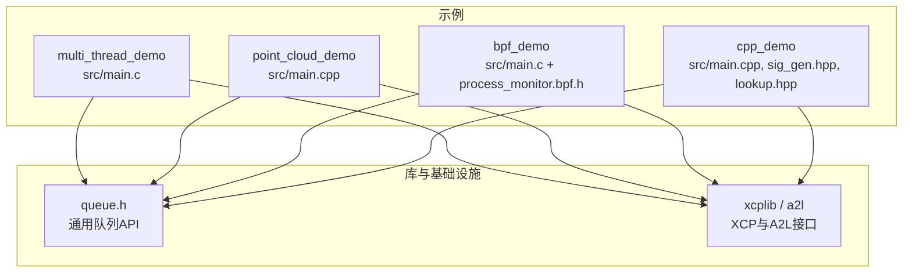
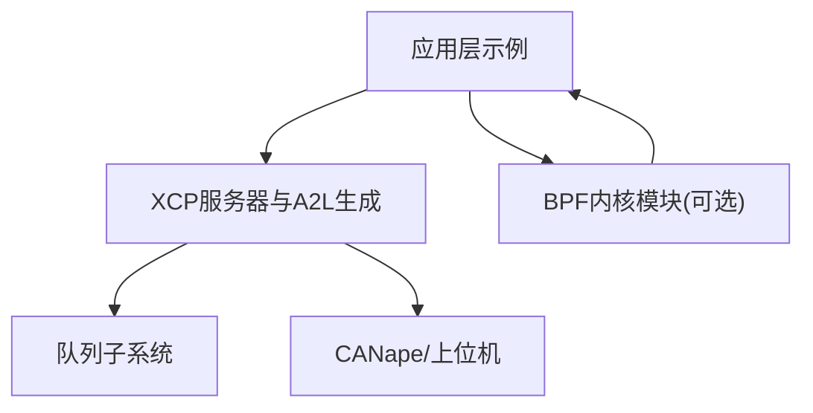
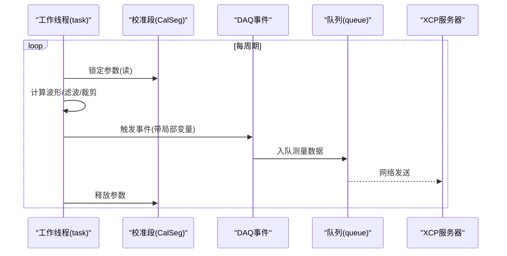
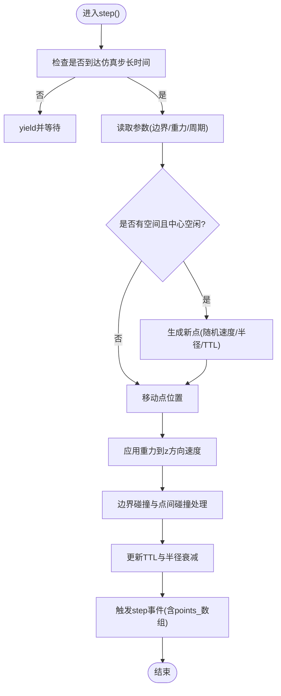
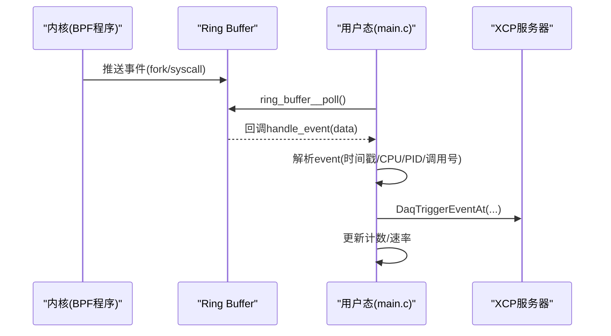
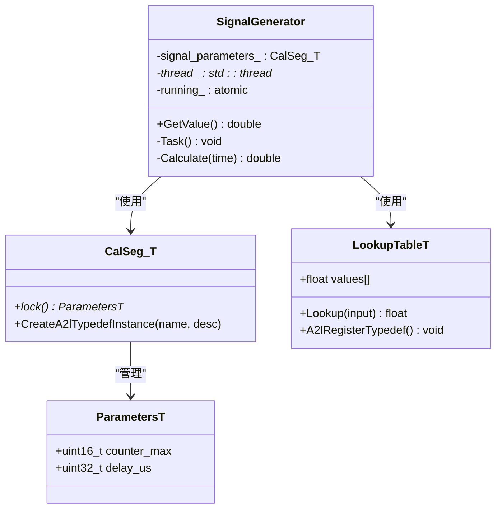
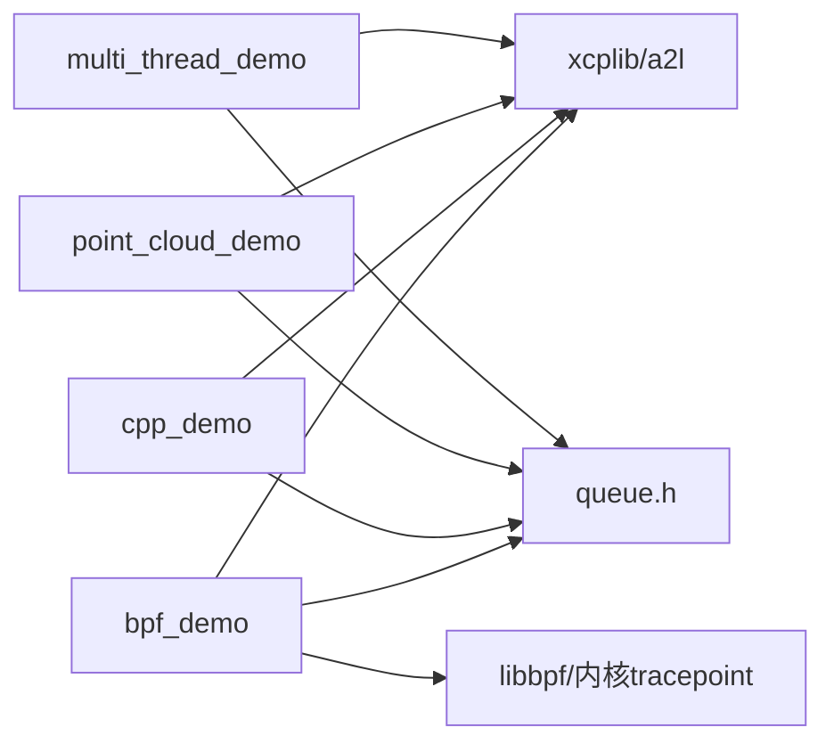

# 高级示例程序

<cite>
**本文引用的文件**
- [examples/multi_thread_demo/src/main.c](file://examples/multi_thread_demo/src/main.c)
- [examples/point_cloud_demo/src/main.cpp](file://examples/point_cloud_demo/src/main.cpp)
- [examples/bpf_demo/src/main.c](file://examples/bpf_demo/src/main.c)
- [examples/bpf_demo/src/process_monitor.bpf.h](file://examples/bpf_demo/src/process_monitor.bpf.h)
- [examples/cpp_demo/src/main.cpp](file://examples/cpp_demo/src/main.cpp)
- [examples/cpp_demo/src/sig_gen.hpp](file://examples/cpp_demo/src/sig_gen.hpp)
- [examples/cpp_demo/src/lookup.hpp](file://examples/cpp_demo/src/lookup.hpp)
- [src/queue.h](file://src/queue.h)
</cite>

## 目录
1. [简介](#简介)
2. [项目结构](#项目结构)
3. [核心组件](#核心组件)
4. [架构总览](#架构总览)
5. [详细组件分析](#详细组件分析)
6. [依赖关系分析](#依赖关系分析)
7. [性能考量](#性能考量)
8. [故障排除指南](#故障排除指南)
9. [结论](#结论)
10. [附录](#附录)

## 简介
本文件对XCPlite仓库中的四个高级示例进行深入技术文档化，覆盖以下主题：
- multi_thread_demo：多线程数据采集的线程安全设计、无锁队列使用与性能优化策略。
- point_cloud_demo：动态数据结构处理与大数据量传输方案（点云数组测量）。
- bpf_demo：基于Linux BPF的系统调用跟踪与实时数据分析。
- cpp_demo：C++封装的高级特性（RAII资源管理、模板类型推导、现代C++最佳实践）。

文档包含架构图、时序图、流程图、关键实现路径引用、性能基准要点与故障排除建议，帮助读者快速理解并复用这些模式。

## 项目结构
四个示例均位于examples目录下，每个示例包含源码、CANape工程配置及README说明。核心库与队列实现在src中提供。

图表来源
- [examples/multi_thread_demo/src/main.c:1-419](file://examples/multi_thread_demo/src/main.c#L1-L419)
- [examples/point_cloud_demo/src/main.cpp:1-469](file://examples/point_cloud_demo/src/main.cpp#L1-L469)
- [examples/bpf_demo/src/main.c:1-676](file://examples/bpf_demo/src/main.c#L1-L676)
- [examples/bpf_demo/src/process_monitor.bpf.h:1-401](file://examples/bpf_demo/src/process_monitor.bpf.h#L1-L401)
- [examples/cpp_demo/src/main.cpp:1-247](file://examples/cpp_demo/src/main.cpp#L1-L247)
- [examples/cpp_demo/src/sig_gen.hpp:1-65](file://examples/cpp_demo/src/sig_gen.hpp#L1-L65)
- [examples/cpp_demo/src/lookup.hpp:1-33](file://examples/cpp_demo/src/lookup.hpp#L1-L33)
- [src/queue.h:1-187](file://src/queue.h#L1-L187)

章节来源
- [examples/multi_thread_demo/src/main.c:1-419](file://examples/multi_thread_demo/src/main.c#L1-L419)
- [examples/point_cloud_demo/src/main.cpp:1-469](file://examples/point_cloud_demo/src/main.cpp#L1-L469)
- [examples/bpf_demo/src/main.c:1-676](file://examples/bpf_demo/src/main.c#L1-L676)
- [examples/bpf_demo/src/process_monitor.bpf.h:1-401](file://examples/bpf_demo/src/process_monitor.bpf.h#L1-L401)
- [examples/cpp_demo/src/main.cpp:1-247](file://examples/cpp_demo/src/main.cpp#L1-L247)
- [examples/cpp_demo/src/sig_gen.hpp:1-65](file://examples/cpp_demo/src/sig_gen.hpp#L1-L65)
- [examples/cpp_demo/src/lookup.hpp:1-33](file://examples/cpp_demo/src/lookup.hpp#L1-L33)
- [src/queue.h:1-187](file://src/queue.h#L1-L187)

## 核心组件
- 多线程采集与校准段：通过共享校准段实现跨线程一致参数访问，配合事件实例与栈地址模式进行每线程独立测量。
- 点云模拟与数组测量：以模板类PointCloud<N>管理固定容量点集，周期性触发DAQ事件，将完整点数组作为测量变量发送。
- BPF系统调用跟踪：用户态加载BPF对象，挂载tracepoint，通过ring buffer接收内核事件，映射为XCP测量事件。
- C++封装与RAII：CalSeg模板包装校准段，自动加解锁；SignalGenerator封装信号生成与线程生命周期；LookupTableT支持可标定曲线。

章节来源
- [examples/multi_thread_demo/src/main.c:56-73](file://examples/multi_thread_demo/src/main.c#L56-L73)
- [examples/point_cloud_demo/src/main.cpp:98-148](file://examples/point_cloud_demo/src/main.cpp#L98-L148)
- [examples/bpf_demo/src/main.c:391-475](file://examples/bpf_demo/src/main.c#L391-L475)
- [examples/cpp_demo/src/main.cpp:117-128](file://examples/cpp_demo/src/main.cpp#L117-L128)
- [examples/cpp_demo/src/sig_gen.hpp:42-63](file://examples/cpp_demo/src/sig_gen.hpp#L42-L63)
- [examples/cpp_demo/src/lookup.hpp:19-30](file://examples/cpp_demo/src/lookup.hpp#L19-L30)

## 架构总览
下图展示各示例与XCP/A2L、队列、BPF等基础设施的交互关系。

图表来源
- [examples/multi_thread_demo/src/main.c:343-367](file://examples/multi_thread_demo/src/main.c#L343-L367)
- [examples/point_cloud_demo/src/main.cpp:422-443](file://examples/point_cloud_demo/src/main.cpp#L422-L443)
- [examples/bpf_demo/src/main.c:591-619](file://examples/bpf_demo/src/main.c#L591-L619)
- [src/queue.h:101-187](file://src/queue.h#L101-L187)

## 详细组件分析

### multi_thread_demo：多线程数据采集
- 线程安全设计
  - 使用共享校准段（CalSeg）在多个线程中安全读取参数，避免竞态条件。
  - 每个线程创建独立的Daq事件实例，采用栈地址模式注册局部变量，确保测量数据隔离。
  - 实验性上下文与Span机制用于测量函数执行时间与作用域。
- 无锁队列使用
  - 通过XCP以太网传输层使用的队列抽象（queue.h），在高并发下减少锁竞争。
  - 队列支持变长/定长条目、累积分段、peek/pop/release语义，适配不同平台与位宽。
- 性能优化策略
  - 调整线程数与sleep间隔平衡吞吐与延迟。
  - 利用A2L自动生成与事件转换，降低手动维护成本。
  - 统计生产者获取锁耗时分布，评估多核争用情况。

图表来源
- [examples/multi_thread_demo/src/main.c:257-338](file://examples/multi_thread_demo/src/main.c#L257-L338)
- [src/queue.h:122-187](file://src/queue.h#L122-L187)

章节来源
- [examples/multi_thread_demo/src/main.c:75-168](file://examples/multi_thread_demo/src/main.c#L75-L168)
- [examples/multi_thread_demo/src/main.c:257-338](file://examples/multi_thread_demo/src/main.c#L257-L338)
- [src/queue.h:101-187](file://src/queue.h#L101-L187)

### point_cloud_demo：动态数据结构与大数据量传输
- 动态数据结构处理
  - PointCloud<N>模板类管理固定容量点数组，支持添加、移除、碰撞检测、边界反弹、生命周期衰减等物理逻辑。
  - 使用CalSeg<ParametersT>封装参数，RAII方式保证线程安全访问。
- 大数据量传输方案
  - 将std::array<Point, N>整体作为测量数组发送，借助A2L typedef描述结构与成员，便于上位机解析与可视化。
  - 周期性事件step触发，附带count、real_time、boundary、step_counter与points_数组。
- 性能与可扩展性
  - 通过cycle_time_us控制仿真步长，避免过度计算。
  - 合理设置max_points与边界大小，平衡内存占用与渲染需求。

图表来源
- [examples/point_cloud_demo/src/main.cpp:341-407](file://examples/point_cloud_demo/src/main.cpp#L341-L407)
- [examples/point_cloud_demo/src/main.cpp:98-148](file://examples/point_cloud_demo/src/main.cpp#L98-L148)

章节来源
- [examples/point_cloud_demo/src/main.cpp:32-60](file://examples/point_cloud_demo/src/main.cpp#L32-L60)
- [examples/point_cloud_demo/src/main.cpp:98-148](file://examples/point_cloud_demo/src/main.cpp#L98-L148)
- [examples/point_cloud_demo/src/main.cpp:341-407](file://examples/point_cloud_demo/src/main.cpp#L341-L407)

### bpf_demo：Linux BPF系统调用跟踪与实时分析
- BPF集成流程
  - 加载BPF对象文件，查找并附加tracepoint（进程fork与syscall进入）。
  - 通过ring buffer接收内核事件，回调处理函数提取PID、CPU、时间戳等信息。
  - 将事件映射为XCP测量事件，周期性上报统计信息（如每秒系统调用速率）。
- 数据结构与常量
  - 共享头文件定义event结构体与ARM64系统调用号，确保内核与用户态一致性。
- 实时数据处理
  - 主循环轮询ring buffer，触发mainloop事件，累计并输出统计。
  - 针对特定系统调用（如sendto/recvfrom）创建独立事件，便于细粒度监控。

图表来源
- [examples/bpf_demo/src/main.c:391-475](file://examples/bpf_demo/src/main.c#L391-L475)
- [examples/bpf_demo/src/main.c:480-563](file://examples/bpf_demo/src/main.c#L480-L563)
- [examples/bpf_demo/src/process_monitor.bpf.h:31-55](file://examples/bpf_demo/src/process_monitor.bpf.h#L31-L55)

章节来源
- [examples/bpf_demo/src/main.c:591-676](file://examples/bpf_demo/src/main.c#L591-L676)
- [examples/bpf_demo/src/process_monitor.bpf.h:57-398](file://examples/bpf_demo/src/process_monitor.bpf.h#L57-L398)

### cpp_demo：C++封装与现代C++最佳实践
- RAII资源管理
  - CalSeg<ParametersT>在作用域内自动加解锁，简化临界区管理，避免忘记释放导致的死锁或数据不一致。
- 模板类型推导与成员测量
  - SignalGenerator类内部成员变量可通过注册接口纳入A2L测量；支持多种信号类型与查找表。
  - LookupTableT提供插值与A2L注册能力，支持共享轴（需特定工具版本）。
- 现代C++实践
  - 使用std::thread管理后台任务，std::atomic控制运行标志。
  - 可变参数宏（可选）简化测量注册，提升可读性与维护性。

图表来源
- [examples/cpp_demo/src/main.cpp:33-39](file://examples/cpp_demo/src/main.cpp#L33-L39)
- [examples/cpp_demo/src/sig_gen.hpp:42-63](file://examples/cpp_demo/src/sig_gen.hpp#L42-L63)
- [examples/cpp_demo/src/lookup.hpp:19-30](file://examples/cpp_demo/src/lookup.hpp#L19-L30)

章节来源
- [examples/cpp_demo/src/main.cpp:117-128](file://examples/cpp_demo/src/main.cpp#L117-L128)
- [examples/cpp_demo/src/sig_gen.hpp:42-63](file://examples/cpp_demo/src/sig_gen.hpp#L42-L63)
- [examples/cpp_demo/src/lookup.hpp:19-30](file://examples/cpp_demo/src/lookup.hpp#L19-L30)

## 依赖关系分析
- 示例与库耦合
  - 所有示例依赖xcplib/a2l进行XCP通信与A2L生成。
  - 多线程与大数据场景依赖queue.h提供的队列抽象，屏蔽平台差异。
  - BPF示例额外依赖libbpf与内核tracepoint能力。
- 潜在循环依赖
  - 示例之间相互独立，无直接循环依赖；库层通过统一接口解耦。
- 外部依赖
  - BPF示例需要clang/llvm/libbpf与内核头文件；其他示例主要依赖标准库与平台线程API。

图表来源
- [examples/multi_thread_demo/src/main.c:343-367](file://examples/multi_thread_demo/src/main.c#L343-L367)
- [examples/point_cloud_demo/src/main.cpp:422-443](file://examples/point_cloud_demo/src/main.cpp#L422-L443)
- [examples/cpp_demo/src/main.cpp:100-128](file://examples/cpp_demo/src/main.cpp#L100-L128)
- [examples/bpf_demo/src/main.c:591-619](file://examples/bpf_demo/src/main.c#L591-L619)
- [src/queue.h:101-187](file://src/queue.h#L101-L187)

章节来源
- [src/queue.h:101-187](file://src/queue.h#L101-L187)
- [examples/bpf_demo/src/main.c:480-563](file://examples/bpf_demo/src/main.c#L480-L563)

## 性能考量
- 多线程场景
  - 无锁队列在高并发下显著降低锁竞争；生产者获取锁耗时分布可用于调优线程数与采样率。
  - 校准段读写采用原子切换页面，避免阻塞；合理设置队列大小以容纳突发流量。
- 点云场景
  - 固定容量数组避免动态分配开销；碰撞检测复杂度O(N^2)，需限制N或引入空间分割。
  - 通过cycle_time_us控制仿真频率，避免CPU过载。
- BPF场景
  - ring buffer高效传递内核事件；注意每秒系统调用速率可能很高，应合理过滤或聚合。
  - 权限与内核版本影响BPF功能可用性，需准备降级路径。

[本节提供一般性指导，不直接分析具体文件]

## 故障排除指南
- 多线程示例
  - 现象：测量数据错乱或丢失。
  - 排查：确认每个线程使用独立事件实例与栈地址模式；检查队列是否溢出（queueLevel）。
  - 参考路径：[examples/multi_thread_demo/src/main.c:274-292](file://examples/multi_thread_demo/src/main.c#L274-L292)、[src/queue.h:178-182](file://src/queue.h#L178-L182)
- 点云示例
  - 现象：CANape无法显示3D场景或卡顿。
  - 排查：确认A2L已正确生成typedef与实例；调整max_points与cycle_time_us；检查TCP端口与防火墙。
  - 参考路径：[examples/point_cloud_demo/src/main.cpp:111-148](file://examples/point_cloud_demo/src/main.cpp#L111-L148)、[examples/point_cloud_demo/src/main.cpp:422-443](file://examples/point_cloud_demo/src/main.cpp#L422-L443)
- BPF示例
  - 现象：权限拒绝或无法加载BPF对象。
  - 排查：以root运行；安装clang/llvm/libbpf与内核头文件；确认内核支持BPF；检查process_monitor.bpf.o是否存在。
  - 参考路径：[examples/bpf_demo/src/main.c:480-563](file://examples/bpf_demo/src/main.c#L480-L563)
- C++示例
  - 现象：成员变量未出现在A2L或测量异常。
  - 排查：确认在构造时完成A2L typedef注册；使用CalSeg RAII访问参数；检查信号生成线程初始化顺序。
  - 参考路径：[examples/cpp_demo/src/main.cpp:117-128](file://examples/cpp_demo/src/main.cpp#L117-L128)、[examples/cpp_demo/src/sig_gen.hpp:42-63](file://examples/cpp_demo/src/sig_gen.hpp#L42-L63)

章节来源
- [examples/multi_thread_demo/src/main.c:274-292](file://examples/multi_thread_demo/src/main.c#L274-L292)
- [src/queue.h:178-182](file://src/queue.h#L178-L182)
- [examples/point_cloud_demo/src/main.cpp:111-148](file://examples/point_cloud_demo/src/main.cpp#L111-L148)
- [examples/point_cloud_demo/src/main.cpp:422-443](file://examples/point_cloud_demo/src/main.cpp#L422-L443)
- [examples/bpf_demo/src/main.c:480-563](file://examples/bpf_demo/src/main.c#L480-L563)
- [examples/cpp_demo/src/main.cpp:117-128](file://examples/cpp_demo/src/main.cpp#L117-L128)
- [examples/cpp_demo/src/sig_gen.hpp:42-63](file://examples/cpp_demo/src/sig_gen.hpp#L42-L63)

## 结论
- multi_thread_demo展示了在高并发环境下，结合无锁队列与校准段的安全访问，实现稳定可靠的多线程数据采集。
- point_cloud_demo通过模板化数据结构与数组测量，有效支撑大数据量的实时可视化。
- bpf_demo将内核级事件捕获与XCP测量无缝集成，提供强大的系统级观测能力。
- cpp_demo体现现代C++在资源管理与类型推导上的优势，简化复杂系统的开发与维护。

[本节总结性内容，不直接分析具体文件]

## 附录
- 构建与运行
  - 各示例均提供build脚本与CMake目标；CANape工程预配置了设备与端口。
  - BPF示例需在Linux环境安装开发工具并以root运行。
- 性能基准参考
  - 多线程示例在多核平台上可获得极低锁等待时间与高吞吐；可根据日志统计调整线程数与采样间隔。
  - 点云示例可通过限制N与调整cycle_time_us达到实时渲染要求。
  - BPF示例在高系统调用负载下需注意事件过滤与聚合，避免拥塞。

[本节提供一般性指导，不直接分析具体文件]