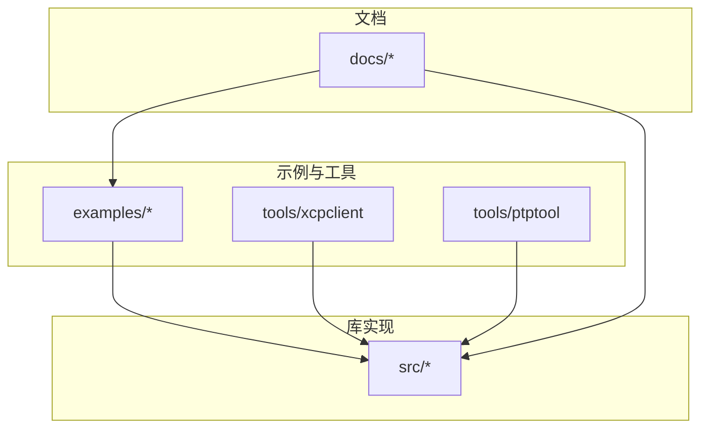
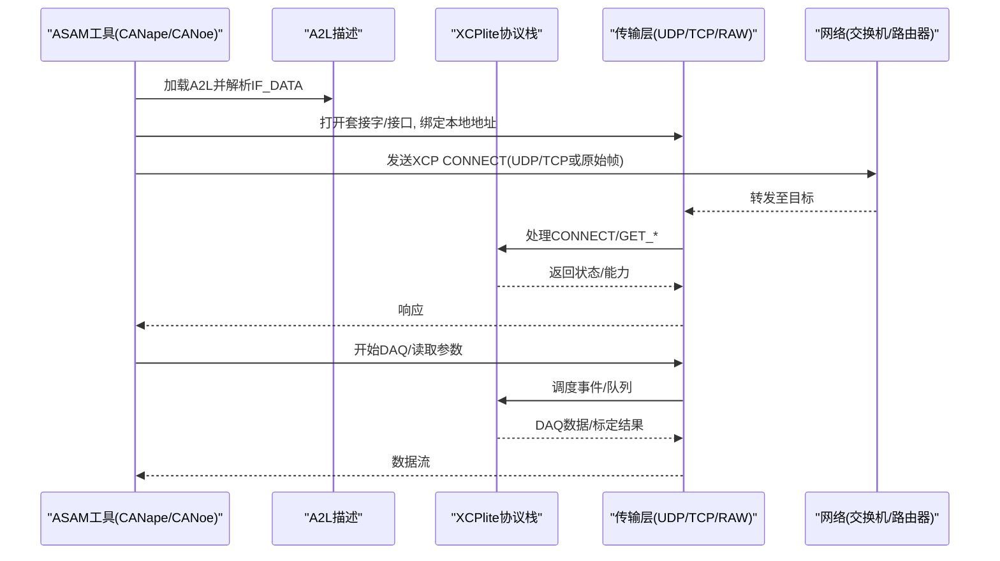
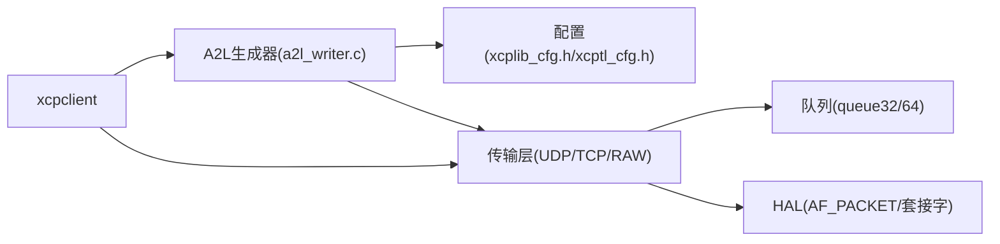

# 工具集成配置

<cite>
**本文引用的文件**
- [README.md](file://README.md)
- [docs/README.md](file://docs/README.md)
- [docs/XCP_DISCOVERY.md](file://docs/XCP_DISCOVERY.md)
- [docs/OFFLINE_A2L.md](file://docs/OFFLINE_A2L.md)
- [docs/SOCKET_RAW.md](file://docs/SOCKET_RAW.md)
- [docs/xcplib_cfg.md](file://docs/xcplib_cfg.md)
- [examples/hello_xcp/CANape/CANape.ini](file://examples/hello_xcp/CANape/CANape.ini)
- [examples/hello_xcp/CANape/xcp_demo_autodetect.a2l](file://examples/hello_xcp/CANape/xcp_demo_autodetect.a2l)
- [tools/xcpclient/README.md](file://tools/xcpclient/README.md)
- [src/a2l_writer.c](file://src/a2l_writer.c)
- [src/xcptl_cfg.h](file://src/xcptl_cfg.h)
</cite>

## 目录
1. [简介](#简介)
2. [项目结构](#项目结构)
3. [核心组件](#核心组件)
4. [架构总览](#架构总览)
5. [详细组件分析](#详细组件分析)
6. [依赖关系分析](#依赖关系分析)
7. [性能考虑](#性能考虑)
8. [故障排查指南](#故障排查指南)
9. [结论](#结论)
10. [附录](#附录)

## 简介
本文件面向测试工程师，提供与ASAM工具（CANape、CANoe等）的完整集成方案。内容覆盖：
- 项目文件设置与A2L生成（在线/离线）
- XCP协议发现与连接建立（网络、端口、传输层差异）
- 不同传输层（以太网UDP/TCP、原始以太网RAW）的工具配置差异
- 调试与测试工具（xcpclient、ptptool等）的使用指南
- 常见问题诊断与解决方案

XCPlite实现XCP over Ethernet（TCP/UDP），支持多核/多线程环境下的测量与标定，兼容CANape 23+及多数ASAM XCP工具。

**章节来源**
- [README.md:38-50](file://README.md#L38-L50)

## 项目结构
仓库包含示例工程、文档、库源码与工具链：
- examples/*：各场景的CANape项目与A2L模板
- docs/*：协议、构建、A2L生成、传输层等技术文档
- src/*：XCP协议栈、A2L生成器、传输层实现
- tools/*：xcpclient（测试与A2L生成）、ptptool（时间同步演示）、shmtool等

**图表来源**
- [docs/README.md:5-19](file://docs/README.md#L5-L19)

**章节来源**
- [docs/README.md:5-19](file://docs/README.md#L5-L19)

## 核心组件
- A2L生成器（运行时/离线）：将目标侧事件、标定段、元数据映射为A2L，供ASAM工具识别
- XCP协议栈：支持GET_ID、DAQ、CAL、ETC命令；支持多种地址扩展模式
- 传输层：UDP/TCP套接字、可选原始以太网（AF_PACKET）后端
- 工具链：xcpclient用于A2L生成、变量列表、DAQ/CAL测试；ptptool用于PTP时间同步演示

关键要点：
- 在线A2L：目标侧生成并上传（需启用相关选项）
- 离线A2L：基于ELF/DWARF由xcpclient生成，无需目标侧代码
- 自动检测：通过A2L中的IF_DATA描述XCP设备信息，CANape可据此创建设备

**章节来源**
- [docs/OFFLINE_A2L.md:1-12](file://docs/OFFLINE_A2L.md#L1-L12)
- [src/a2l_writer.c:94-170](file://src/a2l_writer.c#L94-L170)
- [docs/xcplib_cfg.md:30-40](file://docs/xcplib_cfg.md#L30-L40)

## 架构总览
下图展示从ASAM工具到XCPlite的端到端流程：工具加载A2L，解析协议层与DAQ事件，通过UDP/TCP或RAW发送CONNECT/GET_*命令，建立会话后执行测量与标定。

**图表来源**
- [src/a2l_writer.c:94-170](file://src/a2l_writer.c#L94-L170)
- [src/xcptl_cfg.h:34-59](file://src/xcptl_cfg.h#L34-L59)
- [docs/SOCKET_RAW.md:140-158](file://docs/SOCKET_RAW.md#L140-L158)

## 详细组件分析

### A2L生成与项目文件设置
- 在线A2L：在目标侧启用A2L生成与上传，A2L中写入协议层版本、最大CTO/DTO、事件列表、内存段、IF_DATA（含IP/端口/字节序等）
- 离线A2L：使用xcpclient从ELF/DWARF生成，支持过滤编译单元/变量名、仅包含带元数据的变量、生成模板等
- CANape项目：示例中的CANape.ini与*.a2l展示了设备配置、事件分组、数据类型定义与IF_DATA

实践建议：
- 优先使用离线A2L以减小目标侧开销
- 对无固定事件的变量指定默认事件，保证DAQ一致性
- 使用EPK校验确保A2L与目标固件匹配

**章节来源**
- [docs/OFFLINE_A2L.md:35-70](file://docs/OFFLINE_A2L.md#L35-L70)
- [examples/hello_xcp/CANape/xcp_demo_autodetect.a2l:120-165](file://examples/hello_xcp/CANape/xcp_demo_autodetect.a2l#L120-L165)
- [examples/hello_xcp/CANape/CANape.ini:483-520](file://examples/hello_xcp/CANape/CANape.ini#L483-L520)

### XCP协议发现与连接建立
- 发现机制：通过传输层命令（CC_TRANSPORT_LAYER_CMD）向组播地址发送请求，服务器回显自身IP/端口/资源等信息
- 当前状态：XCPlite已实现扩展查询（GET_SERVER_ID_EXTENDED），但默认未启用；组播端口与组地址需与工具一致
- 连接建立：工具根据A2L中的IF_DATA直接连接目标IP/端口，或使用发现结果进行CONNECT

注意：
- 组播端口在XCPlite中为5557，而ASAM CMP规范使用5556；若依赖标准发现，请确认端口与组地址
- 同一主机测试需要加入loopback接口；跨网段需考虑AP不转发组播的限制

**章节来源**
- [docs/XCP_DISCOVERY.md:11-28](file://docs/XCP_DISCOVERY.md#L11-L28)
- [docs/XCP_DISCOVERY.md:30-49](file://docs/XCP_DISCOVERY.md#L30-L49)
- [docs/XCP_DISCOVERY.md:61-96](file://docs/XCP_DISCOVERY.md#L61-L96)
- [src/xcptl_cfg.h:128-142](file://src/xcptl_cfg.h#L128-L142)

### 传输层差异与工具配置
- UDP/TCP：通过系统套接字API，支持Jumbo Frames；MTU需正确配置以避免分片或丢包
- RAW以太网：在无TCP/IP栈的目标上直接操作以太网帧，内置ARP/ICMP应答，适合嵌入式/RTOS
- 配置要点：
  - MTU与段大小：OPTION_MTU决定链路层MTU，XCPTL_MAX_SEGMENT_SIZE为其减去IPv4/UDP头并对齐
  - 超时与队列：接收线程超时、队列容量影响吞吐与时延
  - 零拷贝：RAW模式下可开启头部预留以减少复制

**章节来源**
- [docs/SOCKET_RAW.md:19-79](file://docs/SOCKET_RAW.md#L19-L79)
- [docs/SOCKET_RAW.md:116-137](file://docs/SOCKET_RAW.md#L116-L137)
- [docs/SOCKET_RAW.md:385-447](file://docs/SOCKET_RAW.md#L385-L447)
- [src/xcptl_cfg.h:51-84](file://src/xcptl_cfg.h#L51-L84)

### 调试与测试工具
- xcpclient：
  - 列出变量/参数、DAQ测量、校准读写、A2L生成/修复、从目标上传A2L/ELF
  - 支持TCP/UDP、离线模式、正则过滤、CSV导出、默认事件指定
- ptptool：
  - PTP主/从/观察者示例，配合XCPlite的时间戳源使用，提升多设备同步精度

常用命令参考：
- 列出所有标定变量：xcpclient --dest-addr <IP> --udp --list-cal .
- 测量变量：xcpclient --dest-addr <IP> --udp --upload-a2l --mea ".*" --time 5
- 离线生成A2L：xcpclient --offline --elf <ELF> --create-a2l --a2l <A2L>

**章节来源**
- [tools/xcpclient/README.md:10-23](file://tools/xcpclient/README.md#L10-L23)
- [tools/xcpclient/README.md:209-296](file://tools/xcpclient/README.md#L209-L296)

## 依赖关系分析
- A2L生成器依赖协议层配置（版本、命令集）、传输层配置（端口、字节序）、平台信息（本地地址）
- 传输层依赖队列实现（32位/64位）、套接字或HAL后端
- 工具链依赖A2L描述与XCP命令能力（GET_EVENT_INFO/GET_SEGMENT_INFO等）

**图表来源**
- [src/a2l_writer.c:94-170](file://src/a2l_writer.c#L94-L170)
- [src/xcptl_cfg.h:34-59](file://src/xcptl_cfg.h#L34-L59)
- [docs/SOCKET_RAW.md:140-158](file://docs/SOCKET_RAW.md#L140-L158)

**章节来源**
- [src/a2l_writer.c:94-170](file://src/a2l_writer.c#L94-L170)
- [src/xcptl_cfg.h:34-59](file://src/xcptl_cfg.h#L34-L59)

## 性能考虑
- 队列与段大小：合理设置OPTION_MTU与XCPTL_MAX_DTO_SIZE，避免过大导致分片或过小降低吞吐
- 零拷贝：RAW模式下启用头部预留减少复制，提高高吞吐场景性能
- 事件与DAQ：控制事件数量与DAQ表大小，避免过多信号导致内存与带宽压力
- 时间戳：使用PTP或高精度时钟源，减少抖动对同步的影响

[本节为通用指导，不直接分析具体文件]

## 故障排查指南
常见问题与定位步骤：
- 无法发现设备：检查组播端口与组地址是否与工具一致；确认是否启用组播；验证路由/AP是否转发组播
- 连接失败：核对A2L中的IP/端口；确认防火墙与NAT策略；尝试直连同一子网
- MTU问题：出现EMSGSIZE或分段错误时，降低OPTION_MTU；在RAW模式下确认接口MTU与配置一致
- A2L不匹配：使用EPK校验；重新生成A2L或更新目标固件
- 变量缺失：检查变量是否volatile或捕获；确认DWARF信息未被剥离；使用xcpclient日志定位

**章节来源**
- [docs/XCP_DISCOVERY.md:97-129](file://docs/XCP_DISCOVERY.md#L97-L129)
- [docs/SOCKET_RAW.md:32-79](file://docs/SOCKET_RAW.md#L32-L79)
- [docs/OFFLINE_A2L.md:244-269](file://docs/OFFLINE_A2L.md#L244-L269)

## 结论
通过A2L描述与XCP协议，XCPlite可与CANape/CANoe等ASAM工具无缝集成。推荐采用离线A2L生成以降低目标侧开销，结合xcpclient进行快速验证与调试。对于无TCP/IP栈的环境，可使用RAW以太网传输层。按本文配置与排障建议，可高效完成工具链集成与测试。

[本节为总结性内容，不直接分析具体文件]

## 附录
- 示例项目路径：examples/*/CANape/*.ini与*.a2l
- 配置参考：docs/xcplib_cfg.md、src/xcptl_cfg.h
- 传输层细节：docs/SOCKET_RAW.md
- 发现机制：docs/XCP_DISCOVERY.md
- 离线A2L：docs/OFFLINE_A2L.md

[本节为索引性内容，不直接分析具体文件]