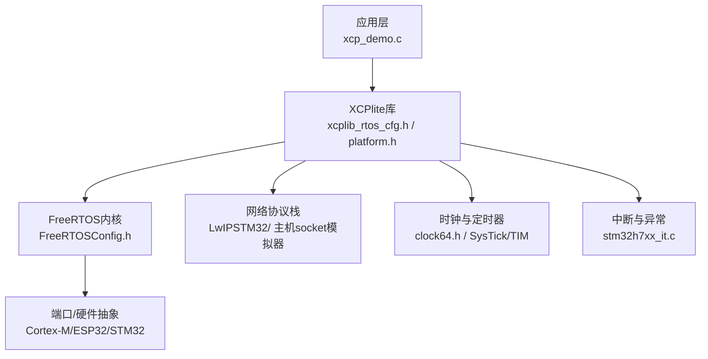
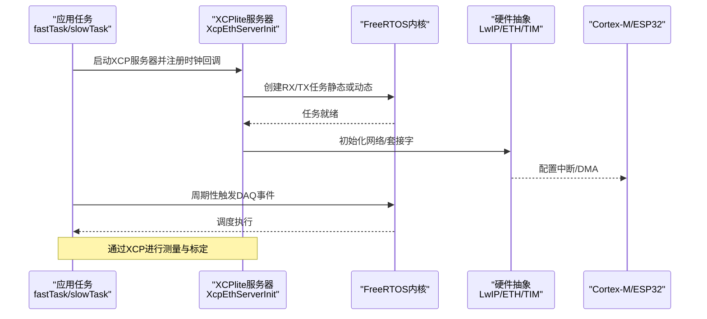
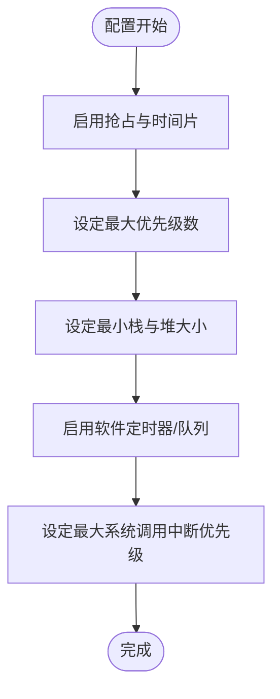
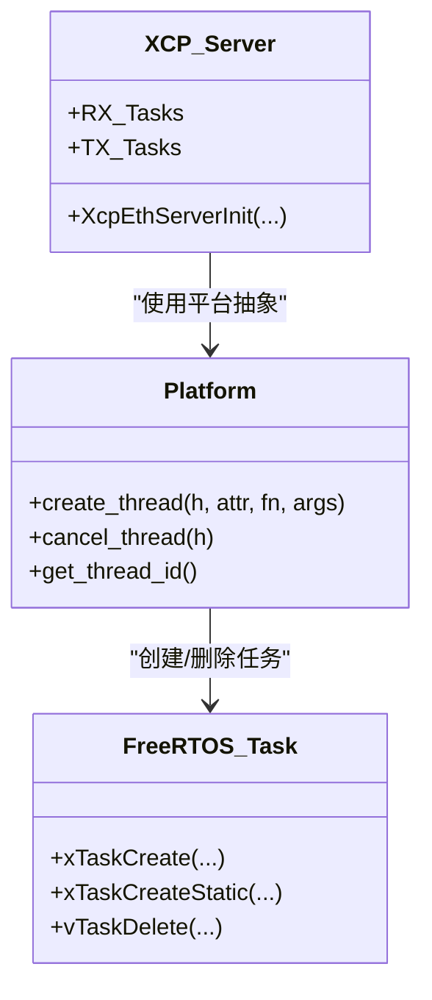
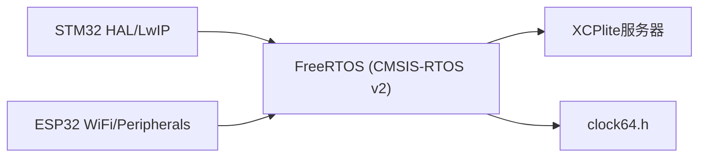
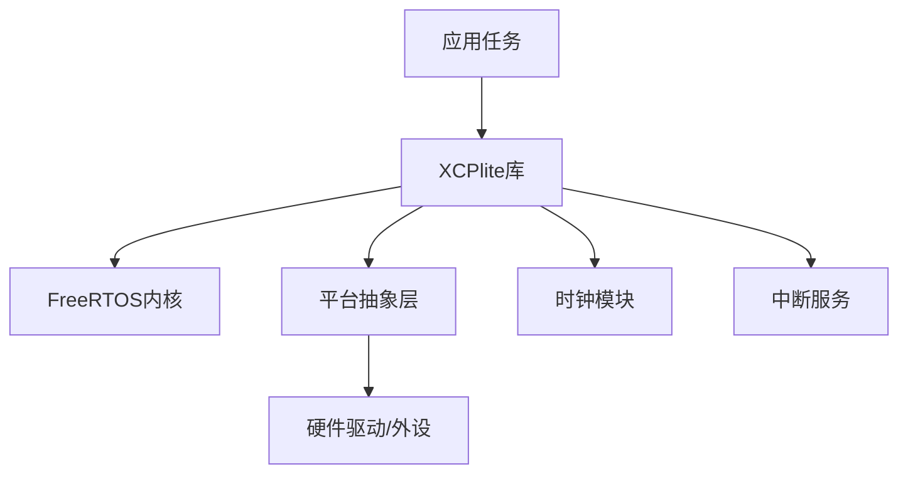

# FreeRTOS嵌入式部署

<cite>
**本文引用的文件**
- [FreeRTOSConfig.h（POSIX模拟器）](file://examples/freertos_demo/freertos_emu_demo/FreeRTOSConfig.h)
- [FreeRTOSConfig.h（STM32）](file://examples/freertos_demo/freertos_stm32_demo/Core/Inc/FreeRTOSConfig.h)
- [xcplib_rtos_cfg.h](file://src/xcplib_rtos_cfg.h)
- [platform.h](file://src/platform.h)
- [freertos.c（STM32任务与LWIP初始化）](file://examples/freertos_demo/freertos_stm32_demo/Core/Src/freertos.c)
- [stm32h7xx_it.c（中断服务程序）](file://examples/freertos_demo/freertos_stm32_demo/Core/Src/stm32h7xx_it.c)
- [xcp_demo.c（演示应用：任务、XCP服务器、DAQ事件）](file://examples/freertos_demo/xcp_demo.c)
- [main.c（POSIX模拟器入口）](file://examples/freertos_demo/freertos_emu_demo/src/main.c)
- [platformio.ini（ESP32构建配置）](file://examples/freertos_demo/freertos_esp32_demo/platformio.ini)
- [main.cpp（ESP32主程序）](file://examples/freertos_demo/freertos_esp32_demo/src/main.cpp)
- [clock64.h（ESP32时钟接口）](file://examples/freertos_demo/freertos_esp32_demo/include/clock64.h)
- [clock64.h（STM32 DWT时钟）](file://examples/freertos_demo/freertos_stm32_demo/Core/Inc/clock64.h)
</cite>

## 目录
1. [简介](#简介)
2. [项目结构](#项目结构)
3. [核心组件](#核心组件)
4. [架构总览](#架构总览)
5. [详细组件分析](#详细组件分析)
6. [依赖关系分析](#依赖关系分析)
7. [性能与功耗考虑](#性能与功耗考虑)
8. [故障排查指南](#故障排查指南)
9. [结论](#结论)
10. [附录：完整部署流程示例](#附录完整部署流程示例)

## 简介
本指南面向在FreeRTOS内核上部署XCPlite（XCP测量与标定库）的工程师，覆盖以下主题：
- FreeRTOS内核配置、任务栈大小与优先级规划
- 不同处理器架构（ARM Cortex-M、ESP32、STM32）的移植要点与硬件抽象层配置
- 内存管理策略（静态分配 vs 动态分配）
- FreeRTOS POSIX模拟器在PC上的开发与调试
- 实时时钟配置、定时器使用与中断处理优化
- 功耗优化技巧与低功耗模式建议
- 调试工具集成（SEGGER JTAG、OpenOCD、GDB）
- ESP32与STM32项目的完整配置与部署流程

## 项目结构
仓库提供了多平台FreeRTOS示例：
- freertos_emu_demo：基于FreeRTOS POSIX模拟器的跨平台演示，便于在Linux/macOS上开发调试
- freertos_esp32_demo：基于PlatformIO的ESP32 Arduino框架示例
- freertos_stm32_demo：基于STM32CubeMX生成的FreeRTOS工程，集成LwIP以太网

图表来源
- [xcp_demo.c:38-65](file://examples/freertos_demo/xcp_demo.c#L38-L65)
- [xcplib_rtos_cfg.h:44-88](file://src/xcplib_rtos_cfg.h#L44-L88)
- [platform.h:381-418](file://src/platform.h#L381-L418)
- [FreeRTOSConfig.h（STM32）:62-153](file://examples/freertos_demo/freertos_stm32_demo/Core/Inc/FreeRTOSConfig.h#L62-L153)
- [stm32h7xx_it.c:172-194](file://examples/freertos_demo/freertos_stm32_demo/Core/Src/stm32h7xx_it.c#L172-L194)

章节来源
- [xcp_demo.c:38-65](file://examples/freertos_demo/xcp_demo.c#L38-L65)
- [xcplib_rtos_cfg.h:44-88](file://src/xcplib_rtos_cfg.h#L44-L88)
- [platform.h:381-418](file://src/platform.h#L381-L418)
- [FreeRTOSConfig.h（STM32）:62-153](file://examples/freertos_demo/freertos_stm32_demo/Core/Inc/FreeRTOSConfig.h#L62-L153)
- [stm32h7xx_it.c:172-194](file://examples/freertos_demo/freertos_stm32_demo/Core/Src/stm32h7xx_it.c#L172-L194)

## 核心组件
- FreeRTOS内核配置
  - 抢占式调度、时间片、空闲任务yield、软件定时器、互斥量、计数信号量等开关
  - 最大优先级数、最小栈大小、堆大小、任务通知、队列注册表等
- XCPlite RTOS配置
  - 针对FreeRTOS的目标裁剪：绝对地址寻址、标准MTU、无TCP、减少内存占用、32位队列、1us时钟分辨率、无文件系统/A2L生成
  - XCP服务器任务栈深度与优先级默认值
- 平台抽象层
  - 线程创建/销毁、互斥锁、高精度时钟、原子操作、系统调用封装
  - 对FreeRTOS的适配：静态/动态任务创建、任务栈单位换算、取消/加入语义
- 时钟与定时器
  - 64位微秒级时钟（DWT或自定义），用于XCP DAQ时间戳
  - SysTick作为系统节拍；TIM中断用于其他定时需求
- 中断与异常
  - Cortex-M优先级分组、SysTick/PendSV映射、ETH/TIM中断服务程序

章节来源
- [FreeRTOSConfig.h（POSIX模拟器）:14-85](file://examples/freertos_demo/freertos_emu_demo/FreeRTOSConfig.h#L14-L85)
- [FreeRTOSConfig.h（STM32）:59-153](file://examples/freertos_demo/freertos_stm32_demo/Core/Inc/FreeRTOSConfig.h#L59-L153)
- [xcplib_rtos_cfg.h:44-142](file://src/xcplib_rtos_cfg.h#L44-L142)
- [platform.h:300-418](file://src/platform.h#L300-L418)
- [clock64.h（STM32）:1-26](file://examples/freertos_demo/freertos_stm32_demo/Core/Inc/clock64.h#L1-L26)
- [stm32h7xx_it.c:172-194](file://examples/freertos_demo/freertos_stm32_demo/Core/Src/stm32h7xx_it.c#L172-L194)

## 架构总览
下图展示了从应用到内核与硬件的调用链，以及XCP服务器在FreeRTOS中的运行方式。

图表来源
- [xcp_demo.c:38-65](file://examples/freertos_demo/xcp_demo.c#L38-L65)
- [platform.h:381-418](file://src/platform.h#L381-L418)
- [freertos.c:231-255](file://examples/freertos_demo/freertos_stm32_demo/Core/Src/freertos.c#L231-L255)

## 详细组件分析

### FreeRTOS内核配置与优先级规划
- 抢占式调度与时间片
  - 启用抢占与时间片，确保高优先级任务及时响应
- 最大优先级与任务数量
  - STM32示例中configMAX_PRIORITIES=56，需合理划分应用任务、XCP服务器任务、系统任务优先级
- 最小栈大小与堆大小
  - 根据实际任务复杂度调整configMINIMAL_STACK_SIZE与configTOTAL_HEAP_SIZE
- 软件定时器与队列
  - 启用软件定时器用于周期任务；队列注册表便于调试
- 中断优先级
  - 设置configLIBRARY_MAX_SYSCALL_INTERRUPT_PRIORITY，确保仅在该优先级及以下调用FreeRTOS API

图表来源
- [FreeRTOSConfig.h（STM32）:62-153](file://examples/freertos_demo/freertos_stm32_demo/Core/Inc/FreeRTOSConfig.h#L62-L153)

章节来源
- [FreeRTOSConfig.h（STM32）:62-153](file://examples/freertos_demo/freertos_stm32_demo/Core/Inc/FreeRTOSConfig.h#L62-L153)

### 任务栈大小设置与任务创建
- 内部XCP服务器任务
  - 通过platform.h的create_thread宏在FreeRTOS下创建RX/TX任务
  - 支持静态分配（StaticTask_t + StackType_t数组）或动态分配（xTaskCreate）
  - 可通过xcplib_rtos_cfg.h的OPTION_FREERTOS_STACK_BYTES与OPTION_FREERTOS_PRIORITY调整
- 应用任务
  - 示例中fastTask与slowTask分别以不同优先级与栈大小创建，使用xTaskCreate或CMSIS-RTOS v2
  - 建议使用pdMS_TO_TICKS()与vTaskDelayUntil实现精确周期

图表来源
- [platform.h:381-418](file://src/platform.h#L381-L418)
- [xcp_demo.c:418-435](file://examples/freertos_demo/xcp_demo.c#L418-L435)

章节来源
- [platform.h:381-418](file://src/platform.h#L381-L418)
- [xcp_demo.c:418-435](file://examples/freertos_demo/xcp_demo.c#L418-L435)

### 不同处理器架构的移植方法与HAL配置
- ARM Cortex-M（STM32）
  - 使用CMSIS-RTOS v2包装器，启用相关特性（线程挂起/枚举、事件标志、定时器、互斥）
  - 配置SysTick与PendSV映射，设置NVIC优先级分组
  - 集成LwIP以太网，配置静态IP与网卡状态检查
- ESP32
  - 通过PlatformIO与Arduino框架构建，启用WiFi连接与可选显示/ADC外设
  - 使用FreeRTOS原生API或CMSIS-RTOS v2（取决于编译选项）
- 时钟与定时器
  - STM32使用DWT周期计数器实现微秒级64位时钟，需在SystemClock_Config后初始化
  - ESP32提供Clock64接口，由应用侧实现具体时钟源

图表来源
- [FreeRTOSConfig.h（STM32）:100-127](file://examples/freertos_demo/freertos_stm32_demo/Core/Inc/FreeRTOSConfig.h#L100-L127)
- [freertos.c:231-255](file://examples/freertos_demo/freertos_stm32_demo/Core/Src/freertos.c#L231-L255)
- [clock64.h（STM32）:1-26](file://examples/freertos_demo/freertos_stm32_demo/Core/Inc/clock64.h#L1-L26)
- [platformio.ini:11-43](file://examples/freertos_demo/freertos_esp32_demo/platformio.ini#L11-L43)
- [main.cpp:377-408](file://examples/freertos_demo/freertos_esp32_demo/src/main.cpp#L377-L408)

章节来源
- [FreeRTOSConfig.h（STM32）:100-127](file://examples/freertos_demo/freertos_stm32_demo/Core/Inc/FreeRTOSConfig.h#L100-L127)
- [freertos.c:231-255](file://examples/freertos_demo/freertos_stm32_demo/Core/Src/freertos.c#L231-L255)
- [clock64.h（STM32）:1-26](file://examples/freertos_demo/freertos_stm32_demo/Core/Inc/clock64.h#L1-L26)
- [platformio.ini:11-43](file://examples/freertos_demo/freertos_esp32_demo/platformio.ini#L11-L43)
- [main.cpp:377-408](file://examples/freertos_demo/freertos_esp32_demo/src/main.cpp#L377-L408)

### 内存管理策略：静态分配与动态分配
- 静态分配
  - 适用于关键任务与控制块，避免运行时分配失败
  - 通过StaticTask_t与StackType_t数组定义，配合xTaskCreateStatic
- 动态分配
  - 使用xTaskCreate与heap_x.c实现，需配置configTOTAL_HEAP_SIZE
  - 在POSIX模拟器中使用heap_3委托给系统malloc/free
- 选择建议
  - 资源受限目标优先静态分配；开发阶段可混合使用以便快速验证

章节来源
- [FreeRTOSConfig.h（POSIX模拟器）:39-44](file://examples/freertos_demo/freertos_emu_demo/FreeRTOSConfig.h#L39-L44)
- [platform.h:400-418](file://src/platform.h#L400-L418)

### FreeRTOS模拟器使用方法（PC开发调试）
- 构建与运行
  - 使用CMake构建freertos_demo目标，在macOS/Linux上运行
  - 通过UDP端口5555连接CANape或其他XCP工具
- 工作原理
  - 每个FreeRTOS任务对应一个pthread，调度通过SIGUSR1/SIGUSR2实现
  - 正常POSIX API（sockets、clocks）在任务内可用
- 退出与清理
  - 捕获SIGINT/SIGTERM，调用XcpDisconnect与XcpEthServerShutdown后退出

章节来源
- [main.c:50-86](file://examples/freertos_demo/freertos_emu_demo/src/main.c#L50-L86)

### 实时时钟配置、定时器与中断处理优化
- 实时时钟
  - 通过ApplXcpRegisterGetClockCallback注册64位时钟读取函数
  - STM32使用DWT周期计数器，ESP32提供Clock64接口
- 定时器
  - SysTick作为系统节拍；TIM中断用于其他定时需求
- 中断处理
  - 将高频中断处理尽量简化，必要时使用队列/信号量与任务协作
  - 设置合适的NVIC优先级，避免阻塞高优先级中断

章节来源
- [xcp_demo.c:51-56](file://examples/freertos_demo/xcp_demo.c#L51-L56)
- [clock64.h（STM32）:16-23](file://examples/freertos_demo/freertos_stm32_demo/Core/Inc/clock64.h#L16-L23)
- [stm32h7xx_it.c:172-194](file://examples/freertos_demo/freertos_stm32_demo/Core/Src/stm32h7xx_it.c#L172-L194)

### 功耗优化技巧与低功耗模式配置
- 任务休眠
  - 使用vTaskDelayUntil精确周期休眠，减少CPU占用
- 外设关闭
  - 在不使用时关闭显示器、ADC、WiFi等外设电源
- 中断合并
  - 将多个低优先级中断处理合并，减少唤醒次数
- 低功耗模式
  - 根据芯片手册进入Sleep/Stop/Standby模式，结合RTC唤醒

[本节为通用指导，不直接分析具体文件]

### 调试工具集成（SEGGER JTAG、OpenOCD、GDB）
- SEGGER JTAG
  - 使用J-Link Commander或IDE集成进行烧录与调试
- OpenOCD
  - 配置目标板与调试器，通过GDB连接进行断点与变量查看
- GDB
  - 使用arm-none-eabi-gdb连接OpenOCD，执行load、break、continue等操作

[本节为通用指导，不直接分析具体文件]

## 依赖关系分析
- 应用层依赖XCPlite库，后者依赖FreeRTOS内核与平台抽象
- 平台抽象层屏蔽不同操作系统与硬件差异
- 时钟与定时器模块提供高精度时间基准
- 中断服务程序与硬件驱动协同工作

图表来源
- [xcp_demo.c:38-65](file://examples/freertos_demo/xcp_demo.c#L38-L65)
- [platform.h:300-418](file://src/platform.h#L300-L418)
- [xcplib_rtos_cfg.h:44-88](file://src/xcplib_rtos_cfg.h#L44-L88)

章节来源
- [xcp_demo.c:38-65](file://examples/freertos_demo/xcp_demo.c#L38-L65)
- [platform.h:300-418](file://src/platform.h#L300-L418)
- [xcplib_rtos_cfg.h:44-88](file://src/xcplib_rtos_cfg.h#L44-L88)

## 性能与功耗考虑
- 性能
  - 合理设置任务优先级与栈大小，避免栈溢出
  - 使用队列/信号量进行任务间通信，减少忙等待
  - 优化中断处理路径，缩短临界区
- 功耗
  - 利用空闲任务与睡眠机制降低功耗
  - 关闭未使用的外设与通信接口
  - 选择合适的时钟源与分频，平衡性能与功耗

[本节为通用指导，不直接分析具体文件]

## 故障排查指南
- 任务创建失败
  - 检查栈大小与堆大小是否足够
  - 确认优先级是否在允许范围内
- 栈溢出
  - 启用configCHECK_FOR_STACK_OVERFLOW并实现钩子函数
  - 使用uxTaskGetStackHighWaterMark监控栈使用
- 网络问题
  - 检查LwIP初始化与网卡状态
  - 确认防火墙与端口配置
- 时钟不准确
  - 确认CLOCK_TICKS_PER_S与实际时钟频率一致
  - 检查SysTick与DWT配置

章节来源
- [FreeRTOSConfig.h（STM32）:79-80](file://examples/freertos_demo/freertos_stm32_demo/Core/Inc/FreeRTOSConfig.h#L79-L80)
- [freertos.c:231-255](file://examples/freertos_demo/freertos_stm32_demo/Core/Src/freertos.c#L231-L255)
- [clock64.h（STM32）:11-12](file://examples/freertos_demo/freertos_stm32_demo/Core/Inc/clock64.h#L11-L12)

## 结论
通过在FreeRTOS上部署XCPlite，可以实现高效的测量与标定功能。关键在于：
- 正确配置FreeRTOS内核参数与优先级
- 选择合适的内存管理策略
- 集成高精度时钟与定时器
- 优化中断处理与功耗
- 利用模拟器与调试工具提高开发效率

[本节为总结性内容，不直接分析具体文件]

## 附录：完整部署流程示例

### ESP32项目配置与部署
- 构建配置
  - 使用PlatformIO，指定board与framework
  - 添加编译定义以启用FreeRTOS与XCPlite RTOS配置
- 主程序流程
  - 初始化串口、显示、IO、ADC
  - 连接WiFi
  - 启动XCP演示任务

章节来源
- [platformio.ini:11-43](file://examples/freertos_demo/freertos_esp32_demo/platformio.ini#L11-L43)
- [main.cpp:377-408](file://examples/freertos_demo/freertos_esp32_demo/src/main.cpp#L377-L408)

### STM32项目配置与部署
- 内核配置
  - 设置抢占、优先级、栈大小、堆大小、软件定时器、互斥量等
  - 配置CMSIS-RTOS v2特性与NVIC优先级
- 任务与网络
  - 初始化LwIP，设置静态IP
  - 启动XCP演示任务
- 中断服务
  - 配置TIM与ETH中断处理

章节来源
- [FreeRTOSConfig.h（STM32）:62-153](file://examples/freertos_demo/freertos_stm32_demo/Core/Inc/FreeRTOSConfig.h#L62-L153)
- [freertos.c:231-255](file://examples/freertos_demo/freertos_stm32_demo/Core/Src/freertos.c#L231-L255)
- [stm32h7xx_it.c:172-194](file://examples/freertos_demo/freertos_stm32_demo/Core/Src/stm32h7xx_it.c#L172-L194)