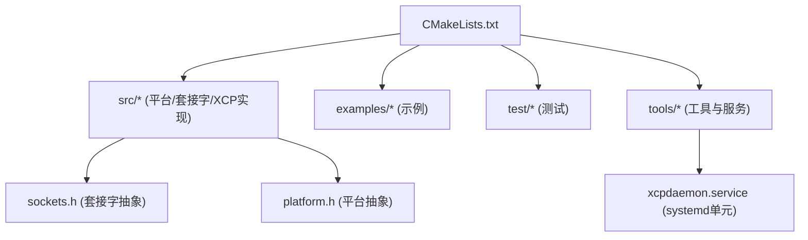
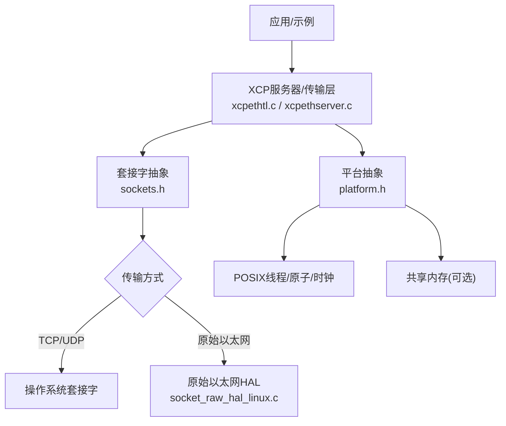
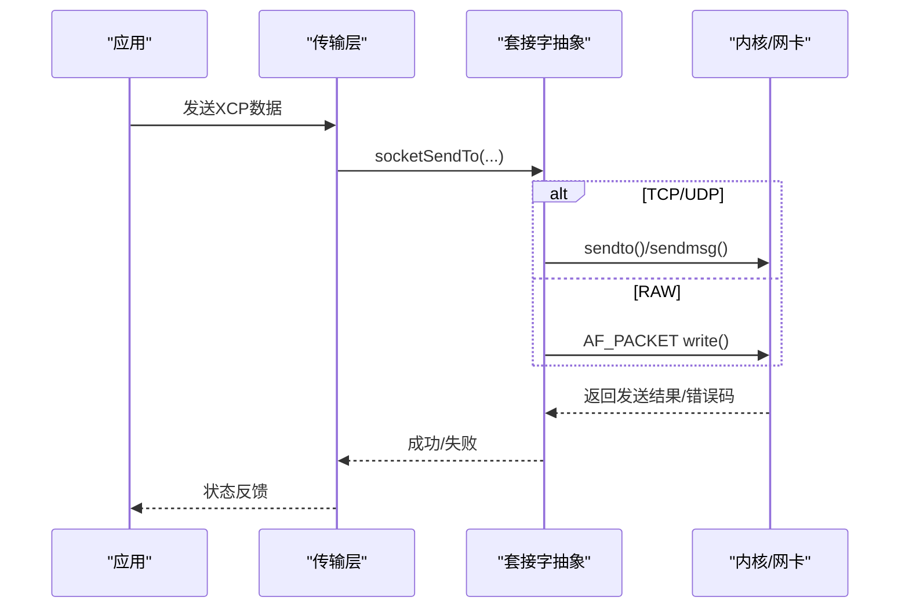
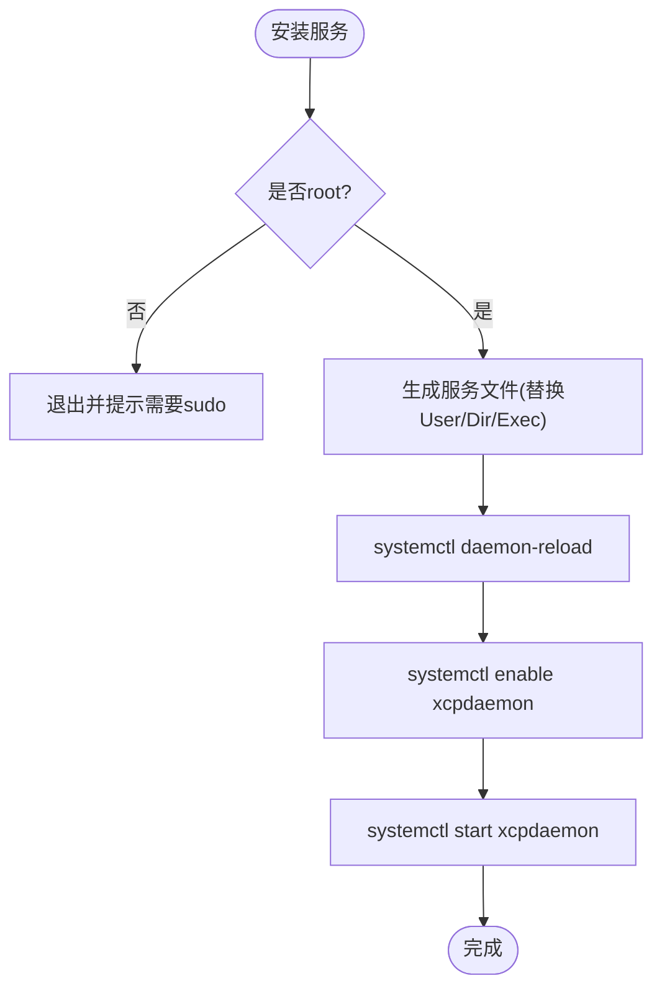
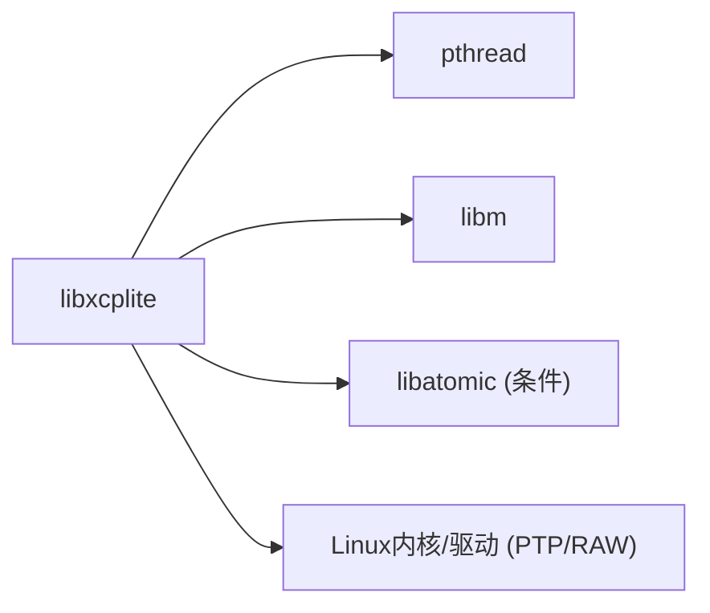

# Linux平台部署

<cite>
**本文引用的文件**
- [CMakeLists.txt](file://CMakeLists.txt)
- [README.md](file://README.md)
- [docs/BUILDING.md](file://docs/BUILDING.md)
- [src/platform.h](file://src/platform.h)
- [src/xcplib_cfg.h](file://src/xcplib_cfg.h)
- [src/xcplib_ptp_cfg.h](file://src/xcplib_ptp_cfg.h)
- [src/xcplib_shm_cfg.h](file://src/xcplib_shm_cfg.h)
- [src/socket_raw_hal_linux.c](file://src/socket_raw_hal_linux.c)
- [src/sockets.h](file://src/sockets.h)
- [docs/SOCKET_RAW.md](file://docs/SOCKET_RAW.md)
- [tools/xcpdaemon/install_service.sh](file://tools/xcpdaemon/install_service.sh)
- [tools/xcpdaemon/xcpdaemon.service](file://tools/xcpdaemon/xcpdaemon.service)
</cite>

## 目录
1. [简介](#简介)
2. [项目结构](#项目结构)
3. [核心组件](#核心组件)
4. [架构总览](#架构总览)
5. [详细组件分析](#详细组件分析)
6. [依赖关系分析](#依赖关系分析)
7. [性能考虑](#性能考虑)
8. [故障排除指南](#故障排除指南)
9. [结论](#结论)
10. [附录](#附录)

## 简介
本指南面向Linux发行版（Ubuntu、CentOS、Debian等），提供XCPlite在Linux平台的完整部署说明，涵盖：
- 构建系统要求与GNU工具链建议
- 依赖库管理与编译选项配置
- _GNU_SOURCE宏的必要性、POSIX线程集成与网络套接字配置
- Docker容器化部署方案（含多阶段构建）
- 系统服务配置、权限设置与资源限制
- 性能调优参数（内存、网络缓冲区、CPU亲和性）
- 常见问题排查与调试方法

XCPlite基于CMake构建，支持多种“配置”以启用不同特性集（如默认、PTP、共享内存、原始以太网等）。其核心库为libxcplite，并提供示例、测试与工具。

**章节来源**
- [README.md:1-130](file://README.md#L1-L130)
- [docs/BUILDING.md:1-120](file://docs/BUILDING.md#L1-L120)

## 项目结构
- 顶层CMake工程定义库、示例、测试与工具的构建规则
- src/包含平台抽象、套接字抽象、XCP协议层与传输层实现
- docs/包含构建、技术细节与原始以太网传输文档
- tools/包含xcpdaemon、ptptool、shmtool等实用工具与服务脚本
- examples/提供多种使用场景的示例应用

**图表来源**
- [CMakeLists.txt:245-298](file://CMakeLists.txt#L245-L298)
- [src/sockets.h:1-70](file://src/sockets.h#L1-L70)
- [src/platform.h:1-70](file://src/platform.h#L1-L70)
- [tools/xcpdaemon/xcpdaemon.service:1-21](file://tools/xcpdaemon/xcpdaemon.service#L1-L21)

**章节来源**
- [CMakeLists.txt:1-160](file://CMakeLists.txt#L1-L160)
- [docs/BUILDING.md:12-75](file://docs/BUILDING.md#L12-L75)

## 核心组件
- 构建系统与配置
  - 通过XCPLITE_CONFIGURATION选择互斥的配置（default/no_a2l/ptp/shm/rtos/raw）
  - 通过XCPLITE_BUILD_*选项控制是否构建示例、测试、工具与Rust工具
  - 自动检测并链接Threads::Threads、math库，必要时链接atomic库
- 平台抽象与POSIX集成
  - platform.h统一原子操作、线程、时钟、内存映射、共享内存等接口
  - 在Linux上强制要求_GNU_SOURCE，否则编译报错
- 套接字抽象
  - sockets.h提供TCP/UDP或原始以太网（RAW）的统一API
  - Linux下可选硬件时间戳（OPTION_SOCKET_HW_TIMESTAMPS）
- 配置覆盖头
  - xcplib_cfg.h为默认配置；可通过xcplib_<name>_cfg.h进行覆盖（如ptp、shm）
  - 应用可自定义覆盖头并通过XCPLITE_CFG_OVERRIDE注入

**章节来源**
- [CMakeLists.txt:15-110](file://CMakeLists.txt#L15-L110)
- [CMakeLists.txt:156-311](file://CMakeLists.txt#L156-L311)
- [src/platform.h:164-176](file://src/platform.h#L164-L176)
- [src/sockets.h:14-70](file://src/sockets.h#L14-L70)
- [src/xcplib_cfg.h:18-100](file://src/xcplib_cfg.h#L18-L100)
- [src/xcplib_ptp_cfg.h:1-31](file://src/xcplib_ptp_cfg.h#L1-L31)
- [src/xcplib_shm_cfg.h:1-38](file://src/xcplib_shm_cfg.h#L1-L38)

## 架构总览
XCPlite在Linux上的关键路径：
- 应用调用XCP服务器/传输层
- 传输层通过sockets.h抽象访问底层套接字或原始以太网HAL
- 平台层提供线程、时钟、内存与共享内存能力
- 配置头决定启用哪些功能（如PTP硬件时间戳、共享内存模式、原始以太网）

**图表来源**
- [src/sockets.h:14-70](file://src/sockets.h#L14-L70)
- [src/socket_raw_hal_linux.c:1-25](file://src/socket_raw_hal_linux.c#L1-L25)
- [src/platform.h:100-200](file://src/platform.h#L100-L200)

## 详细组件分析

### 构建与配置（Linux）
- 推荐工具链
  - GCC或Clang，C标准C11，C++标准C++17（Windows为C++20）
  - 使用CMake 3.14+
- 常见构建命令
  - 仅库：cmake -B build -S . -DCMAKE_BUILD_TYPE=Release && cmake --build build --parallel
  - 示例：cmake -B build -S . -DCMAKE_BUILD_TYPE=Release -DXCPLITE_BUILD_EXAMPLES=ON
  - 测试：cmake -B build -S . -DCMAKE_BUILD_TYPE=Release -DXCPLITE_BUILD_TESTS=ON
  - 工具：根据配置启用（如ptp配置构建ptptool，shm配置构建shmtool/xcpdaemon）
- 安装与本地暂存
  - 默认安装前缀为构建目录下的install；可指定CMAKE_INSTALL_PREFIX
  - 安装后供外部项目find_package(xcplite)使用

**章节来源**
- [docs/BUILDING.md:85-218](file://docs/BUILDING.md#L85-L218)
- [CMakeLists.txt:164-186](file://CMakeLists.txt#L164-L186)
- [CMakeLists.txt:593-656](file://CMakeLists.txt#L593-L656)

### _GNU_SOURCE宏与POSIX线程集成
- 必要性
  - 在Linux上，若未定义_GNU_SOURCE，platform.h会在包含系统头前检查并报错，提示必须定义该宏
  - CMake在Linux平台将_GNU_SOURCE作为PUBLIC编译定义传播给消费者，避免手动设置
- POSIX线程
  - 通过Threads::Threads链接pthread
  - platform.h封装create_thread/join_thread/cancel_thread/get_thread_id等跨平台接口
  - FreeRTOS模拟路径同样需要_GNU_SOURCE（当在Linux主机上运行FreeRTOS模拟器时）

**章节来源**
- [src/platform.h:151-172](file://src/platform.h#L151-L172)
- [CMakeLists.txt:286-298](file://CMakeLists.txt#L286-L298)

### 网络套接字配置（TCP/UDP与原始以太网）
- TCP/UDP
  - 通过OPTION_ENABLE_TCP/OPTION_ENABLE_UDP启用
  - 支持SO_REUSEADDR、超时设置、多播加入（非RAW）、发送/接收函数族
  - Linux下可选硬件时间戳（OPTION_SOCKET_HW_TIMESTAMPS），需root权限与网卡支持
- 原始以太网（RAW）
  - 通过XCPLITE_CONFIGURATION=raw启用，使用AF_PACKET套接字
  - 需要CAP_NET_RAW权限（setcap cap_net_raw+ep <二进制>）
  - 内置ARP/ICMP响应器，便于快速联调（ping可达）
  - 零拷贝发送（可选）：在队列段头部预留空间直接写入以太网/IPv4/UDP头

**图表来源**
- [src/sockets.h:221-318](file://src/sockets.h#L221-L318)
- [src/socket_raw_hal_linux.c:55-157](file://src/socket_raw_hal_linux.c#L55-L157)
- [docs/SOCKET_RAW.md:19-113](file://docs/SOCKET_RAW.md#L19-L113)

**章节来源**
- [src/sockets.h:14-70](file://src/sockets.h#L14-L70)
- [src/sockets.h:207-318](file://src/sockets.h#L207-L318)
- [src/socket_raw_hal_linux.c:1-25](file://src/socket_raw_hal_linux.c#L1-L25)
- [docs/SOCKET_RAW.md:19-113](file://docs/SOCKET_RAW.md#L19-L113)

### PTP硬件时间戳与SHM模式
- PTP模式
  - 通过xcplib_ptp_cfg.h启用OPTION_SOCKET_HW_TIMESTAMPS
  - 需要Linux内核与网卡支持，通常需root权限
  - 配合ptptool进行硬件时间戳校准与验证
- 共享内存模式
  - 通过xcplib_shm_cfg.h启用OPTION_SHM_MODE
  - 允许多进程共享传输队列、校准RCU与XCP状态
  - 需要POSIX兼容平台（Linux/macOS/QNX），不支持Windows

**章节来源**
- [src/xcplib_ptp_cfg.h:1-31](file://src/xcplib_ptp_cfg.h#L1-L31)
- [src/xcplib_shm_cfg.h:1-38](file://src/xcplib_shm_cfg.h#L1-L38)
- [docs/BUILDING.md:12-23](file://docs/BUILDING.md#L12-L23)

### 系统服务与权限（xcpdaemon）
- systemd服务单元
  - 模板位于tools/xcpdaemon/xcpdaemon.service
  - 包含User、WorkingDirectory、ExecStart、日志输出等字段
- 安装脚本
  - install_service.sh生成服务文件、重载systemd、启用并启动服务
  - 需要sudo执行，自动替换用户与工作目录
- 权限与安全
  - 若使用原始以太网传输，需对二进制授予CAP_NET_RAW
  - 服务应以最小权限运行，结合SELinux/AppArmor策略进一步加固

**图表来源**
- [tools/xcpdaemon/install_service.sh:1-47](file://tools/xcpdaemon/install_service.sh#L1-L47)
- [tools/xcpdaemon/xcpdaemon.service:1-21](file://tools/xcpdaemon/xcpdaemon.service#L1-L21)

**章节来源**
- [tools/xcpdaemon/install_service.sh:1-47](file://tools/xcpdaemon/install_service.sh#L1-L47)
- [tools/xcpdaemon/xcpdaemon.service:1-21](file://tools/xcpdaemon/xcpdaemon.service#L1-L21)

### Docker容器化部署（多阶段构建）
- 基础镜像
  - 构建阶段：ubuntu:22.04（或debian:bookworm-slim），安装build-essential、cmake、pkg-config等
  - 运行阶段：debian:bookworm-slim或alpine（视需求），仅复制产物与必要运行时库
- 多阶段构建要点
  - 第一阶段：安装依赖、配置CMake、编译库/工具/示例
  - 第二阶段：复制编译产物到精简镜像，设置入口点与环境变量
- 权限与网络
  - 若使用原始以太网传输，需在容器内授予CAP_NET_RAW（--cap-add NET_RAW）
  - 绑定端口或网络命名空间以满足隔离需求
- 示例Dockerfile（概念性步骤）
  - FROM ubuntu:22.04 AS builder
  - RUN apt-get update && apt-get install -y build-essential cmake pkg-config
  - COPY . /src && cd /src && cmake -B build -DCMAKE_BUILD_TYPE=Release -DXCPLITE_BUILD_TOOLS=ON && cmake --build build --parallel
  - FROM debian:bookworm-slim
  - COPY --from=builder /src/build/install /usr/local
  - CMD ["xcpdaemon"]

[本节为概念性流程，不直接映射具体源码文件]

## 依赖关系分析
- 构建期依赖
  - Threads::Threads（pthread）
  - math库（Unix/Linux/macOS）
  - atomic库（部分ARM平台Clang需要）
- 运行期依赖
  - 动态链接libc、libm、libpthread
  - 若启用PTP硬件时间戳，需内核与驱动支持
  - 若启用原始以太网，需CAP_NET_RAW权限

**图表来源**
- [CMakeLists.txt:156-311](file://CMakeLists.txt#L156-L311)
- [src/socket_raw_hal_linux.c:1-25](file://src/socket_raw_hal_linux.c#L1-L25)

**章节来源**
- [CMakeLists.txt:156-311](file://CMakeLists.txt#L156-L311)

## 性能考虑
- 队列与内存
  - 64位平台默认使用无锁可变长度队列（queue64v.c）；32位或Windows回退到互斥队列
  - 调整XCPTL_MAX_SEGMENT_SIZE与OPTION_MTU平衡吞吐与延迟
  - 原始以太网模式下可启用零拷贝发送以减少内存带宽占用
- 网络缓冲与超时
  - 使用socketSetTimeout控制阻塞接收，避免无限等待
  - 合理设置MTU以避免EMSGSIZE错误
- CPU亲和性与调度
  - 将XCP收发线程绑定到专用CPU核（sched_setaffinity）以降低抖动
  - 提升实时性时可调整线程优先级（nice/priority）
- 时间戳与同步
  - 启用硬件时间戳可降低时间测量误差
  - PTP模式下确保网卡与内核支持，并正确配置ptp4l

[本节提供通用指导，不直接分析具体文件]

## 故障排除指南
- 编译错误
  - 未定义_GNU_SOURCE：在Linux上必须定义，或通过CMake目标自动传播
  - 缺少依赖：安装build-essential、cmake、pkg-config；某些平台需libbpf（bpf_demo）
- 运行时错误
  - 原始以太网权限不足：授予CAP_NET_RAW或使用root
  - MTU过大导致EMSGSIZE：降低OPTION_MTU或链路MTU
  - PTP时间戳不可用：确认内核版本、网卡驱动与root权限
- 服务问题
  - systemd服务无法启动：检查User/WorkingDirectory/ExecStart路径
  - 日志查看：journalctl -u xcpdaemon -f
- 调试技巧
  - 使用RelWithDebInfo构建类型获取优化与调试符号
  - 启用调试打印（OPTION_ENABLE_DBG_PRINTS）与stderr输出（OPTION_ENABLE_DBG_STDERR）
  - 原始以太网联调：先ping可达，再arping，最后xcpclient CONNECT

**章节来源**
- [src/platform.h:164-172](file://src/platform.h#L164-L172)
- [docs/SOCKET_RAW.md:32-79](file://docs/SOCKET_RAW.md#L32-L79)
- [tools/xcpdaemon/install_service.sh:1-47](file://tools/xcpdaemon/install_service.sh#L1-L47)

## 结论
XCPlite在Linux平台提供了灵活、高性能的XCP-on-Ethernet解决方案。通过CMake配置与覆盖头，可在默认、PTP、共享内存与原始以太网等模式间切换。部署时应关注_GNU_SOURCE、线程与网络权限、MTU与时间戳配置，并结合systemd服务与Docker容器化实现稳定运行。性能调优需围绕队列、网络缓冲、CPU亲和性与时间戳展开。遇到问题时，优先检查权限、依赖与日志输出。

[本节总结性内容，不直接分析具体文件]

## 附录
- 快速参考
  - 构建库与示例：见docs/BUILDING.md中的“Quick Build”
  - 安装到系统：cmake --install build（或指定CMAKE_INSTALL_PREFIX）
  - 启用工具：根据配置启用TOOLS（ptp/shm）
- 相关文档
  - 原始以太网传输设计：docs/SOCKET_RAW.md
  - 构建与故障排除：docs/BUILDING.md

[本节为补充信息，不直接分析具体文件]