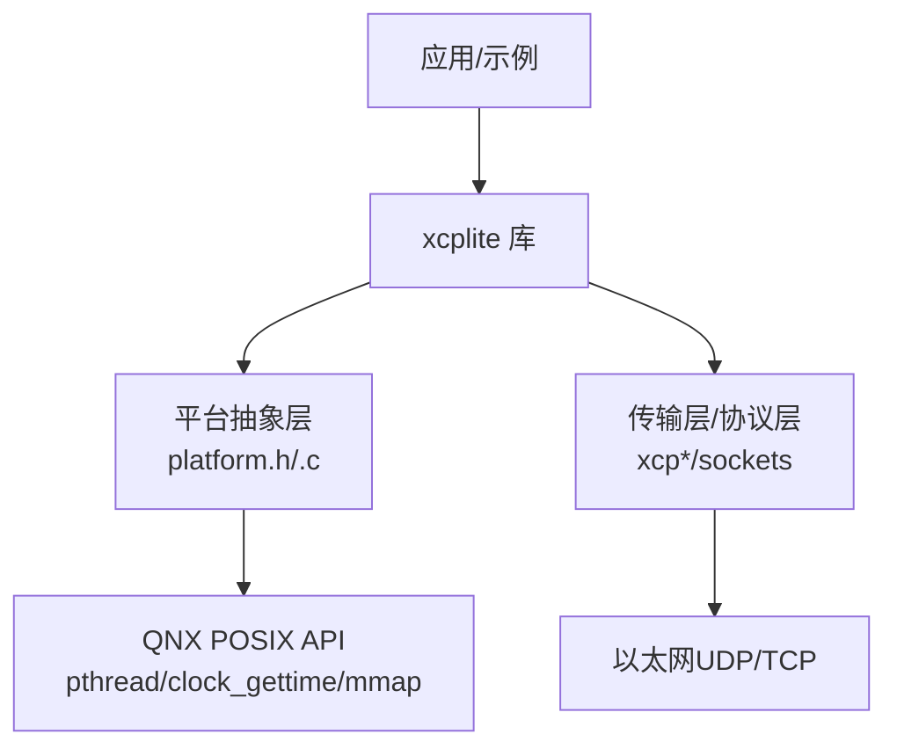
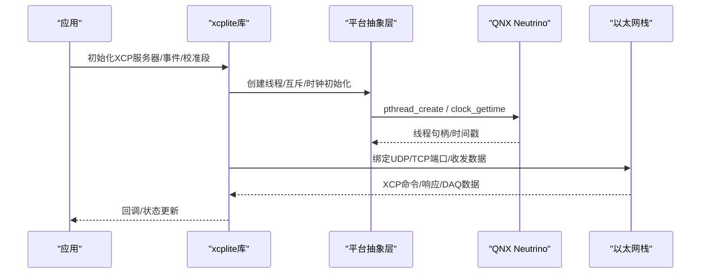
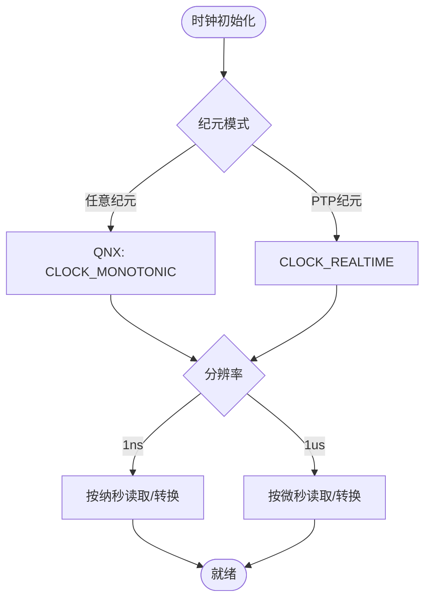
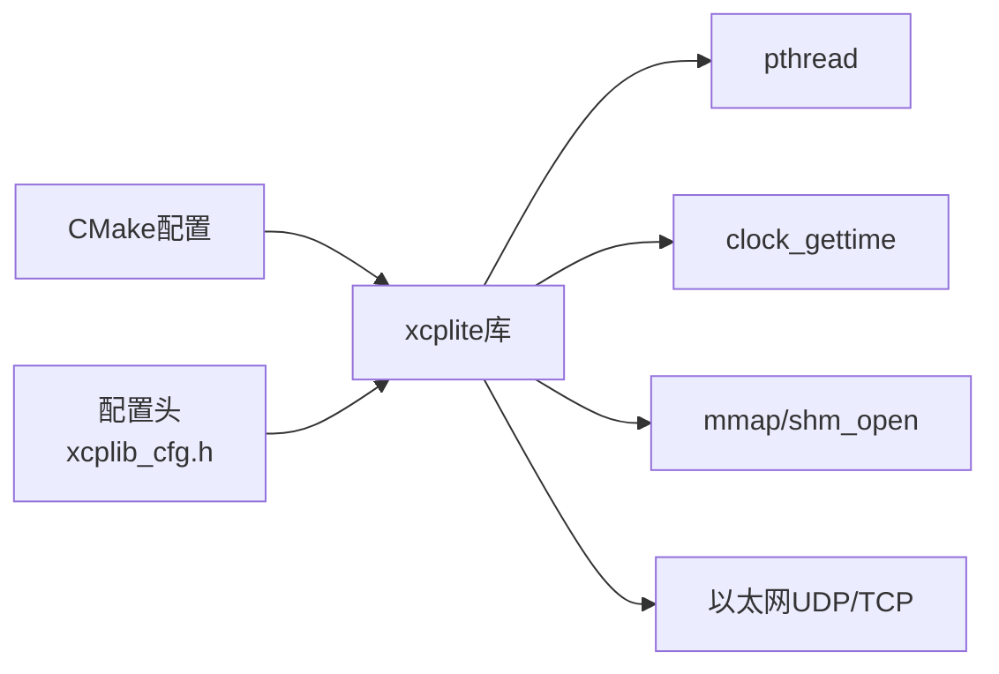

# QNX平台部署

<cite>
**本文引用的文件**
- [README.md](file://README.md)
- [CMakeLists.txt](file://CMakeLists.txt)
- [BUILDING.md](file://docs/BUILDING.md)
- [xcplib_cfg.h](file://src/xcplib_cfg.h)
- [platform.h](file://src/platform.h)
- [platform.c](file://src/platform.c)
- [xcplib_cfg.md](file://docs/xcplib_cfg.md)
</cite>

## 目录
1. [简介](#简介)
2. [项目结构](#项目结构)
3. [核心组件](#核心组件)
4. [架构总览](#架构总览)
5. [详细组件分析](#详细组件分析)
6. [依赖关系分析](#依赖关系分析)
7. [性能考虑](#性能考虑)
8. [故障排查指南](#故障排查指南)
9. [结论](#结论)
10. [附录](#附录)

## 简介
本指南面向在QNX SDP上部署XCPlite（XCP on Ethernet）的工程师，覆盖开发环境配置、Neutrino RTOS特性与实时性优化、内存与进程间通信要点、构建系统与镜像打包、车载系统集成（AUTOSAR适配与诊断协议）、安全框架与权限控制、性能调优（调度、内存分配器、中断处理）、以及模拟器与硬件目标部署流程。内容基于仓库中的构建脚本、平台抽象层与配置头文件，确保可追溯与可复现。

## 项目结构
- 顶层CMake工程提供多配置构建（default/no_a2l/ptp/shm/rtos/raw），通过XCPLITE_CONFIGURATION选择编译特性集，并在不同平台（含QNX）下启用相应功能。
- 平台抽象层（platform.h/.c）统一封装线程、互斥、时钟、睡眠、共享内存等能力；其中对QNX的识别与POSIX时钟路径已内置。
- 配置头（xcplib_cfg.h）集中定义日志、时钟源/分辨率、网络MTU、DAQ/A2L/校准段等开关，支持应用级覆盖头以定制行为。
- 文档BUILDING.md给出QNX构建命令与注意事项（如SDP路径、目标架构、C++标准限制）。

图表来源
- [CMakeLists.txt:15-108](file://CMakeLists.txt#L15-L108)
- [platform.h:23-72](file://src/platform.h#L23-L72)
- [platform.c:505-550](file://src/platform.c#L505-L550)

章节来源
- [CMakeLists.txt:15-108](file://CMakeLists.txt#L15-L108)
- [BUILDING.md:220-237](file://docs/BUILDING.md#L220-L237)
- [platform.h:23-72](file://src/platform.h#L23-L72)

## 核心组件
- 构建系统：CMake配置项XCPLITE_CONFIGURATION决定编译哪些特性；默认配置包含A2L生成、文件系统、以太网UDP/TCP；QNX构建需指定SDP路径与目标架构。
- 平台抽象：QNX被识别为_POSIX类平台，使用pthread、clock_gettime等API；时钟路径在QNX下采用CLOCK_MONOTONIC以保证单调稳定。
- 配置管理：xcplib_cfg.h提供全局开关；可通过XCPLITE_CFG_OVERRIDE引入应用级覆盖头，保证库与应用一致编译视图。
- 传输与协议：支持TCP/UDP，MTU可配（Jumbo帧取决于链路MTU）；DAQ表与队列大小可静态配置。

章节来源
- [CMakeLists.txt:15-108](file://CMakeLists.txt#L15-L108)
- [xcplib_cfg.h:55-80](file://src/xcplib_cfg.h#L55-L80)
- [platform.c:505-550](file://src/platform.c#L505-L550)
- [xcplib_cfg.md:30-64](file://docs/xcplib_cfg.md#L30-L64)

## 架构总览
下图展示QNX环境下XCPlite的关键层次：应用调用库接口，库通过平台抽象层访问QNX内核服务（线程、时钟、内存映射），并通过以太网传输层发送/接收XCP报文。

图表来源
- [platform.h:350-433](file://src/platform.h#L350-L433)
- [platform.c:505-654](file://src/platform.c#L505-L654)
- [CMakeLists.txt:245-303](file://CMakeLists.txt#L245-L303)

## 详细组件分析

### QNX构建与环境配置
- 要求：安装QNX SDP，设置SDP路径；当前支持x86_64与aarch64le；QNX 7.0及以下可能因std::optional缺失而跳过C++目标。
- 构建命令：
  - Windows主机+QNX 7.1.0 x86_64：build_qnx.bat Debug "C:\QNX\qnx710" x86_64
  - Linux主机+QNX 8.0.0 aarch64le：./build.sh Debug qcc all -q=/home/qnx800 -a=aarch64le
- 配置选择：通过XCPLITE_CONFIGURATION选择特性集；默认配置适合大多数QNX场景。

章节来源
- [BUILDING.md:220-237](file://docs/BUILDING.md#L220-L237)
- [CMakeLists.txt:15-108](file://CMakeLists.txt#L15-L108)

### 平台抽象与时钟（QNX）
- 平台识别：QNX通过__QNXNTO__/__QNX__宏识别，进入POSIX分支。
- 时钟策略：默认使用“任意纪元”模式，在QNX下映射到CLOCK_MONOTONIC，保证单调且不受NTP/PTP调整影响；也可选择PTP纪元模式（CLOCK_REALTIME）。
- 分辨率：支持1ns或1us分辨率配置，由CLOCK_TICKS_PER_S决定。

图表来源
- [platform.c:505-550](file://src/platform.c#L505-L550)
- [xcplib_cfg.h:55-64](file://src/xcplib_cfg.h#L55-L64)

章节来源
- [platform.h:23-72](file://src/platform.h#L23-L72)
- [platform.c:505-654](file://src/platform.c#L505-L654)
- [xcplib_cfg.h:55-64](file://src/xcplib_cfg.h#L55-L64)

### 线程、互斥与同步（QNX）
- 线程：使用pthread_create/join/cancel；提供跨平台宏统一函数签名与返回约定。
- 互斥：POSIX分支使用pthread_mutex_t；支持递归互斥初始化。
- 线程本地存储：通过THREAD_LOCAL宏在不同编译器/平台上展开。

章节来源
- [platform.h:350-433](file://src/platform.h#L350-L433)
- [platform.c:416-432](file://src/platform.c#L416-L432)

### 内存管理与共享内存（QNX）
- 常规内存映射：在非Windows平台使用mmap/munmap进行匿名映射。
- 命名共享内存：提供leader/follower选举与flock序列化，避免竞态；支持附加已有SHM、清理与unlink。
- 注意：QNX下共享内存语义遵循POSIX shm_open/mmap；需确保名称空间隔离与生命周期管理。

章节来源
- [platform.c:161-187](file://src/platform.c#L161-L187)
- [platform.c:201-362](file://src/platform.c#L201-L362)
- [platform.h:266-298](file://src/platform.h#L266-L298)

### 构建系统与模块打包
- 配置覆盖：通过XCPLITE_CFG_OVERRIDE引入应用级覆盖头，确保库与应用一致的编译视图。
- 安装规则：支持install导出targets与package config，便于外部项目find_package使用。
- 工具链：QNX构建需指定qcc与-a=目标架构；可选构建examples/tests/tools/rust_tools。

章节来源
- [CMakeLists.txt:68-108](file://CMakeLists.txt#L68-L108)
- [CMakeLists.txt:593-656](file://CMakeLists.txt#L593-L656)
- [BUILDING.md:220-237](file://docs/BUILDING.md#L220-L237)

### 车载系统集成（AUTOSAR适配与诊断协议）
- AUTOSAR集成：将XCPlite作为独立进程或服务运行，通过以太网（UDP/TCP）暴露XCP服务；可与AUTOSAR RTE/BSW解耦，避免侵入式修改。
- 诊断协议：XCP over Ethernet满足ASAM MCD-2 MC需求；结合A2L描述测量与标定对象，兼容CANape/CANoe等工具。
- 多参与者：shm配置可用于多进程协同（如SilKit演示），在QNX中通过POSIX共享内存实现低延迟数据交换。

章节来源
- [README.md:3-28](file://README.md#L3-L28)
- [xcplib_cfg.md:30-64](file://docs/xcplib_cfg.md#L30-L64)
- [CMakeLists.txt:383-395](file://CMakeLists.txt#L383-L395)

### 安全框架、权限控制与访问保护
- 进程隔离：QNX原生进程隔离，建议将XCP服务置于独立进程，最小化攻击面。
- 文件系统与共享内存：仅开放必要目录与SHM名称；使用flock序列化锁文件防止并发破坏。
- 网络访问：限制监听地址与端口；必要时结合QNX安全域/ACL控制套接字访问。
- 日志与调试：生产环境降低日志级别，关闭敏感信息输出。

章节来源
- [platform.c:201-362](file://src/platform.c#L201-L362)
- [xcplib_cfg.h:42-53](file://src/xcplib_cfg.h#L42-L53)

### 性能调优指南（QNX）
- 实时任务调度：
  - 提升XCP相关线程优先级，减少上下文切换抖动；合理设置CPU亲和性。
  - 使用CLOCK_MONOTONIC保证时间基准稳定，避免NTP/PTP跳变影响时序。
- 内存分配器：
  - 优先使用静态内存与队列缓冲；避免运行时堆分配；利用队列固定/可变条目策略平衡吞吐与内存占用。
  - 校准段与DAQ表使用静态池，避免碎片化。
- 中断与I/O：
  - 将耗时操作移出中断上下文；在网络侧使用零拷贝/向量IO（库内队列已优化）。
  - 合理设置MTU与Jumbo帧，确保链路MTU匹配，减少分片与重传。
- 队列与吞吐：
  - 根据负载调整队列缓冲区大小；监控丢包与拥塞，动态调优。
  - 使用RelWithDebInfo或Release构建，关闭不必要调试输出。

章节来源
- [xcplib_cfg.h:120-162](file://src/xcplib_cfg.h#L120-L162)
- [xcplib_cfg.md:76-94](file://docs/xcplib_cfg.md#L76-L94)
- [platform.c:505-654](file://src/platform.c#L505-L654)

### 模拟器与硬件目标部署
- 模拟器：可使用FreeRTOS POSIX模拟器在Linux/macOS验证代码逻辑（非QNX模拟），但QNX目标仍需SDP交叉编译。
- 硬件部署：
  - 构建产物安装至目标设备；启动XCP服务并绑定IP/端口。
  - 准备A2L（可在目标生成或离线生成）；连接测试工具（CANape/CANoe）。
  - 验证DAQ/STIM流与标定下载，检查时戳与同步精度。

章节来源
- [BUILDING.md:220-237](file://docs/BUILDING.md#L220-L237)
- [CMakeLists.txt:593-656](file://CMakeLists.txt#L593-L656)
- [README.md:53-99](file://README.md#L53-L99)

## 依赖关系分析
- 构建期依赖：Threads库、数学库（UNIX）、可选atomic库；Rust工具（xcpclient/bintool）需cargo。
- 运行期依赖：QNX POSIX API（pthread、clock_gettime、mmap、shm_open等）；以太网驱动与网络栈。
- 配置依赖：XCPLITE_CONFIGURATION与XCPLITE_CFG_OVERRIDE共同决定编译视图与功能开关。

图表来源
- [CMakeLists.txt:245-303](file://CMakeLists.txt#L245-L303)
- [xcplib_cfg.h:55-80](file://src/xcplib_cfg.h#L55-L80)

章节来源
- [CMakeLists.txt:245-303](file://CMakeLists.txt#L245-L303)
- [xcplib_cfg.h:55-80](file://src/xcplib_cfg.h#L55-L80)

## 性能考虑
- 队列与吞吐：根据负载选择固定/可变条目队列；调整缓冲区大小与MTU。
- 时钟与同步：优先CLOCK_MONOTONIC；如需高精度同步，结合PTP与硬件时间戳（Linux工具链更成熟，QNX需评估平台能力）。
- 资源占用：关闭不必要的日志与A2L上传；使用Release/RelWithDebInfo构建。
- 多核利用：合理分配线程与CPU亲和性，避免热点竞争。

章节来源
- [xcplib_cfg.h:120-162](file://src/xcplib_cfg.h#L120-L162)
- [xcplib_cfg.md:76-94](file://docs/xcplib_cfg.md#L76-L94)

## 故障排查指南
- 构建失败：确认QNX SDP路径与架构参数正确；检查C++标准限制（QNX 7.0及以下可能不支持部分C++特性）。
- 运行时崩溃：检查共享内存名称冲突与flock锁文件权限；确认mmap成功与尺寸校验。
- 网络问题：核对MTU与Jumbo帧链路支持；检查防火墙与端口占用；验证A2L与工具兼容性。
- 日志定位：提高日志级别，关注时钟初始化、线程创建、SHM打开/映射错误信息。

章节来源
- [platform.c:201-362](file://src/platform.c#L201-L362)
- [platform.c:505-654](file://src/platform.c#L505-L654)
- [BUILDING.md:364-416](file://docs/BUILDING.md#L364-L416)

## 结论
在QNX SDP上部署XCPlite，关键在于正确使用CMake配置与平台抽象层，充分利用QNX的POSIX能力（线程、时钟、共享内存）与进程隔离优势。通过合理的配置覆盖、性能调优与安全加固，可在车载环境中稳定提供XCP测量与标定能力，并与AUTOSAR生态及诊断工具良好集成。

## 附录
- 快速构建参考：见BUILDING.md中QNX小节。
- 配置参考：见xcplib_cfg.h与xcplib_cfg.md。
- 平台抽象：见platform.h/.c中QNX相关分支。