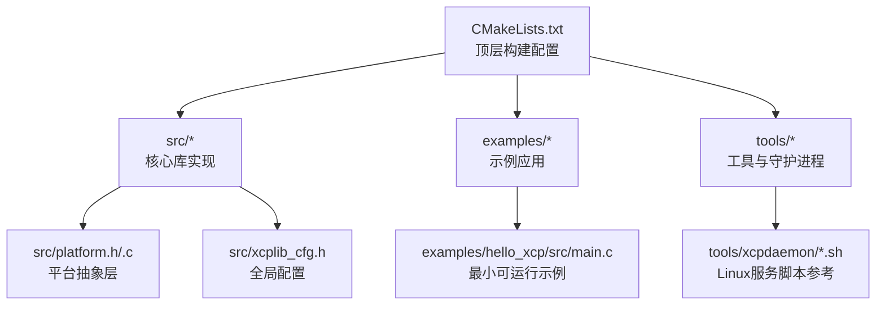
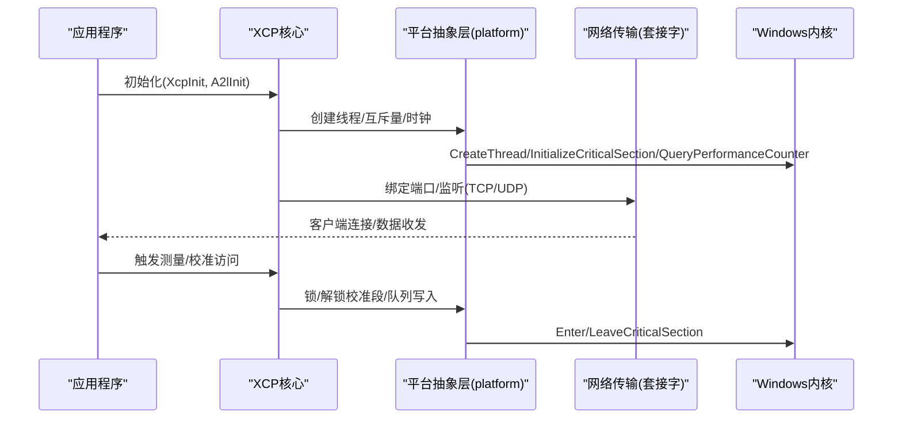
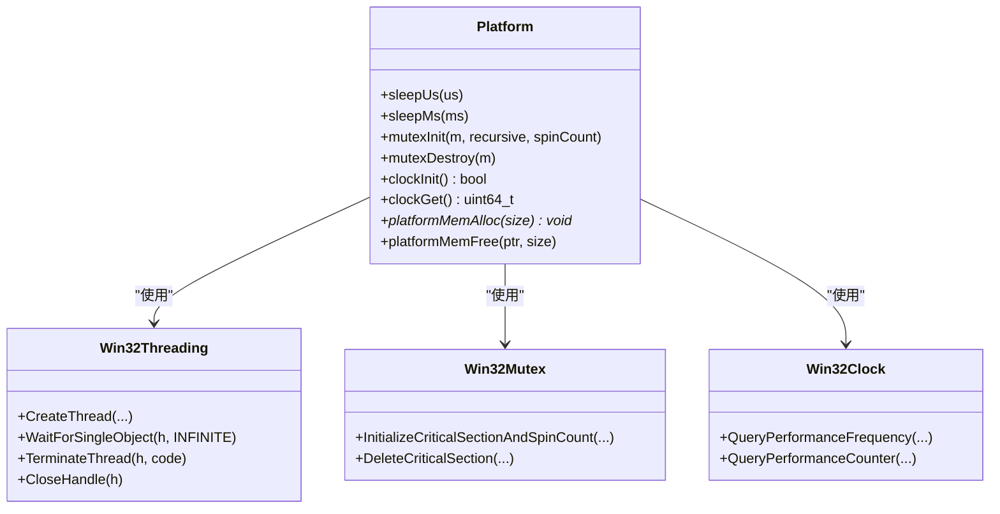
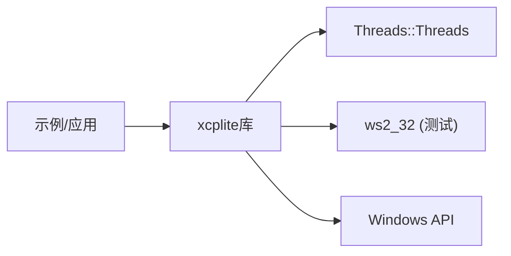

# Windows平台部署

<cite>
**本文引用的文件**
- [README.md](file://README.md)
- [CMakeLists.txt](file://CMakeLists.txt)
- [BUILDING.md](file://docs/BUILDING.md)
- [platform.h](file://src/platform.h)
- [platform.c](file://src/platform.c)
- [xcplib_cfg.h](file://src/xcplib_cfg.h)
- [hello_xcp 示例 main.c](file://examples/hello_xcp/src/main.c)
- [xcpdaemon 安装脚本](file://tools/xcpdaemon/install_service.sh)
- [xcpdaemon 控制脚本](file://tools/xcpdaemon/xcpdaemon_ctl.sh)
</cite>

## 目录
1. [简介](#简介)
2. [项目结构](#项目结构)
3. [核心组件](#核心组件)
4. [架构总览](#架构总览)
5. [详细组件分析](#详细组件分析)
6. [依赖关系分析](#依赖关系分析)
7. [性能注意事项](#性能注意事项)
8. [故障排查指南](#故障排查指南)
9. [结论](#结论)
10. [附录](#附录)

## 简介
本指南面向在Windows平台上部署XCPlite的工程师，覆盖Visual Studio、MinGW与MSYS2等开发环境的配置要点；说明Windows特定API的使用（线程、同步原语、时钟、内存映射）；给出ATL/MFC集成与COM组件支持的实践建议；提供Windows服务部署方案（安装、启动、配置脚本思路）；说明防火墙规则、端口开放与安全策略设置；并包含性能监控工具使用方法和内存泄漏检测技巧，以及与.NET框架集成的最佳实践和互操作方案。

## 项目结构
XCPlite采用CMake构建系统，支持多配置（default、no_a2l、ptp、shm、rtos、raw），并在Windows上通过MSVC或兼容工具链编译。库目标为xcplite，示例位于examples目录，工具位于tools目录。Windows平台下：
- C++标准自动切换为C++20
- 启用安全CRT宏以抑制警告
- 链接Threads库，必要时链接ws2_32（测试目标）
- 默认关闭POSIX共享内存相关路径（非Windows）

图表来源
- [CMakeLists.txt:172-243](file://CMakeLists.txt#L172-L243)
- [platform.h:26-72](file://src/platform.h#L26-L72)
- [xcplib_cfg.h:67-80](file://src/xcplib_cfg.h#L67-L80)

章节来源
- [CMakeLists.txt:172-243](file://CMakeLists.txt#L172-L243)
- [BUILDING.md:239-255](file://docs/BUILDING.md#L239-L255)

## 核心组件
- 平台抽象层（platform.h/.c）：统一线程、互斥量、时钟、睡眠、内存分配等接口，Windows分支使用Win32 API（CreateThread、WaitForSingleObject、CRITICAL_SECTION、QueryPerformanceCounter、VirtualAlloc/VirtualFree）。
- 配置头（xcplib_cfg.h）：定义日志、时钟分辨率、XCP服务器选项、队列策略、A2L生成等开关；Windows下默认启用原子模拟（OPTION_ATOMIC_EMULATION）并将队列回退到互斥量版本。
- 示例应用（hello_xcp）：展示初始化XCP、启动以太网服务器、注册校准段与测量事件的基本流程。

章节来源
- [platform.h:303-433](file://src/platform.h#L303-L433)
- [platform.c:406-432](file://src/platform.c#L406-L432)
- [xcplib_cfg.h:67-80](file://src/xcplib_cfg.h#L67-L80)
- [hello_xcp 示例 main.c:146-177](file://examples/hello_xcp/src/main.c#L146-L177)

## 架构总览
下图展示了XCPlite在Windows上的关键运行时交互：应用调用XCP初始化与服务器启动，平台抽象层封装Win32线程与同步原语，传输层基于TCP/UDP套接字，时钟由高性能计数器驱动。

图表来源
- [platform.h:368-433](file://src/platform.h#L368-L433)
- [platform.c:406-432](file://src/platform.c#L406-L432)
- [CMakeLists.txt:286-298](file://CMakeLists.txt#L286-L298)

## 详细组件分析

### Windows平台抽象层与同步原语
- 线程模型：使用Win32线程句柄，create_thread/join_thread/cancel_thread封装CreateThread、WaitForSingleObject、TerminateThread+CloseHandle。
- 互斥量：使用CRITICAL_SECTION，支持自旋计数初始化；Windows临界区天然递归。
- 时钟：使用QueryPerformanceFrequency/QueryPerformanceCounter将高精度计数器转换为配置的时钟单位；支持任意纪元或UNIX纪元模式。
- 内存映射：在共享内存模式下使用VirtualAlloc/VirtualFree进行匿名内存分配与释放。
- 原子模拟：Windows下默认启用原子模拟，使用Interlocked系列内建函数实现load/store/exchange/fetch_add/sub/CAS等。

图表来源
- [platform.h:303-433](file://src/platform.h#L303-L433)
- [platform.c:406-432](file://src/platform.c#L406-L432)
- [platform.c:657-800](file://src/platform.c#L657-L800)

章节来源
- [platform.h:303-433](file://src/platform.h#L303-L433)
- [platform.c:406-432](file://src/platform.c#L406-L432)
- [platform.c:657-800](file://src/platform.c#L657-L800)

### 构建环境与工具链配置（Visual Studio、MinGW、MSYS2）
- Visual Studio（MSVC）：
  - 使用CMake生成解决方案，C++标准自动设为C++20，Release/RelWithDebInfo优化与调试符号按平台设定。
  - 可通过build.bat生成VS工程（见文档）。
- MinGW/MSYS2：
  - 使用CMake配置交叉或本地工具链，注意C11/C++17或C++20要求。
  - 若需要Rust工具（xcpclient/bintool），需确保cargo可用。
- 通用选项：
  - 通过XCPLITE_CONFIGURATION选择功能集（default/no_a2l/ptp/shm/rtos/raw）。
  - 通过XCPLITE_BUILD_*控制是否构建示例、测试、工具。
  - 安装前缀默认指向构建目录下的install，避免污染系统路径。

章节来源
- [CMakeLists.txt:172-243](file://CMakeLists.txt#L172-L243)
- [CMakeLists.txt:149-154](file://CMakeLists.txt#L149-L154)
- [BUILDING.md:239-255](file://docs/BUILDING.md#L239-L255)

### ATL/MFC集成与COM组件支持
- 集成方式：
  - 将libxcplite作为静态或动态库链接到ATL/MFC应用中，确保包含inc与src头路径（CMake已处理）。
  - 在MFC主线程中初始化XCP并启动服务器，避免阻塞UI线程；可使用Win32线程池或后台任务承载XCP收发。
- COM组件：
  - 若需要将XCP能力暴露为COM对象，可在COM方法中调用XCP API；注意线程亲和性与STA/MTA模型，避免跨线程直接访问未保护资源。
  - 建议在COM对象内部维护独立的XCP上下文，或使用单例并确保线程安全访问。
- 注册表配置：
  - 若通过COM注册类型库或类工厂，遵循Windows COM注册规范；与XCP无关的配置（如端口、协议参数）建议通过配置文件或环境变量传递，而非强耦合注册表。

[本节为概念性指导，不直接分析具体源码文件]

### Windows服务部署方案
- 服务化思路：
  - 将XCP服务器封装为Windows服务，使用SCM管理生命周期；在服务Main中初始化XCP、启动接收/发送线程、处理停止信号。
  - 配置项（端口、地址、日志级别）通过服务配置或注册表读取。
- 脚本参考：
  - 仓库提供Linux systemd脚本（install_service.sh、xcpdaemon_ctl.sh）作为参考，Windows可采用sc.exe或PowerShell New-Service创建服务，并使用schtasks或计划任务执行启停与状态查询。
- 安全与权限：
  - 服务账户建议使用受限账户；如需绑定低端口，考虑提升权限或使用反向代理。

[本节为概念性指导，不直接分析具体源码文件]

### 防火墙规则、端口开放与安全策略
- 端口开放：
  - 根据示例配置（例如5555端口），在Windows防火墙入站规则中允许TCP/UDP对应端口。
  - 仅对必要IP范围开放，结合网络隔离与ACL限制。
- 安全策略：
  - 启用TLS/加密通道（若上层协议支持）或在应用层实现认证与鉴权。
  - 限制最大连接数与速率，防止资源耗尽。
  - 记录审计日志，便于问题追踪。

[本节为概念性指导，不直接分析具体源码文件]

### 性能监控与内存泄漏检测
- 性能监控：
  - 使用Windows性能监视器（PerfMon）观察CPU、内存、网络I/O；结合XCP日志级别调整输出粒度。
  - 利用平台时钟接口（QueryPerformanceCounter）评估关键路径耗时。
- 内存泄漏检测：
  - Visual Studio诊断工具：内存快照、堆栈跟踪、分配热点分析。
  - CRT调试：启用_CRTDBG_LEAK_CHECK_DF，配合断言定位异常释放。
  - 第三方工具：Valgrind（WSL）、AddressSanitizer（Clang/LLVM）用于更细粒度的内存错误检测。

[本节为概念性指导，不直接分析具体源码文件]

### 与.NET框架集成的最佳实践与互操作
- 互操作方式：
  - 通过P/Invoke调用XCPlite导出的C API；或使用C++/CLI包装为.NET可托管类型。
  - 将XCP服务器置于独立进程，通过命名管道、gRPC或HTTP REST与.NET应用通信，降低进程间耦合。
- 线程与同步：
  - .NET线程与Win32线程混用时，避免跨域直接访问未保护资源；在C侧使用互斥量保护共享状态。
- 资源管理：
  - 在.NET端使用using/IDisposable模式管理原生资源句柄；确保正确释放XCP服务器与线程。

[本节为概念性指导，不直接分析具体源码文件]

## 依赖关系分析
- 构建期依赖：
  - Threads库（Windows下为系统线程库）
  - ws2_32（测试目标在Windows下显式链接）
  - 可选：Rust工具链（xcpclient/bintool）
- 运行期依赖：
  - Windows系统API（线程、同步、时钟、套接字）
  - 可选：文件系统（用于A2L生成与持久化）

图表来源
- [CMakeLists.txt:297-311](file://CMakeLists.txt#L297-L311)
- [CMakeLists.txt:466-468](file://CMakeLists.txt#L466-L468)

章节来源
- [CMakeLists.txt:297-311](file://CMakeLists.txt#L297-L311)
- [CMakeLists.txt:466-468](file://CMakeLists.txt#L466-L468)

## 性能注意事项
- Windows下原子操作通过Interlocked内建函数模拟，队列回退到互斥量版本，可能引入额外开销。
- 合理设置队列大小与日志级别，避免高频日志影响吞吐。
- 使用RelWithDebInfo构建平衡性能与调试信息；Release构建禁用断言与调试输出。
- 在高并发场景下，减少校准段锁竞争，尽量批量化数据传输。

章节来源
- [xcplib_cfg.h:67-80](file://src/xcplib_cfg.h#L67-L80)
- [CMakeLists.txt:234-243](file://CMakeLists.txt#L234-L243)

## 故障排查指南
- 构建失败：
  - 确认CMake版本与编译器支持C11/C++17或C++20；Windows下检查MSVC或MinGW环境。
  - 清理旧构建目录后重新配置，避免缓存冲突。
- 运行时问题：
  - 检查端口占用与防火墙规则；确认服务账户权限。
  - 调整日志级别获取更多信息；使用性能计数器验证时钟初始化。
- 参考脚本（Linux）：
  - install_service.sh与xcpdaemon_ctl.sh可作为服务管理与远程控制的参考模板。

章节来源
- [BUILDING.md:364-416](file://docs/BUILDING.md#L364-L416)
- [tools/xcpdaemon/install_service.sh:1-47](file://tools/xcpdaemon/install_service.sh#L1-L47)
- [tools/xcpdaemon/xcpdaemon_ctl.sh:1-79](file://tools/xcpdaemon/xcpdaemon_ctl.sh#L1-L79)

## 结论
XCPlite在Windows平台通过平台抽象层屏蔽了底层差异，提供了稳定的线程、同步与时钟接口。借助CMake的多配置能力，开发者可根据需求选择功能集与工具链。部署时需注意端口开放、权限与安全策略；性能调优应关注队列大小、日志级别与锁竞争。对于ATL/MFC与COM集成，建议采用进程隔离与明确的资源管理策略。与.NET的互操作可通过P/Invoke或C++/CLI实现，推荐以服务化方式解耦。

## 附录
- 快速开始：
  - 使用CMake生成VS解决方案并构建示例；参考文档中的Windows构建步骤。
- 配置覆盖：
  - 通过XCPLITE_CFG_OVERRIDE自定义配置头，适配特定应用场景。
- 示例参考：
  - hello_xcp展示了最小可用的XCP服务器初始化与测量事件注册流程。

章节来源
- [BUILDING.md:239-255](file://docs/BUILDING.md#L239-L255)
- [hello_xcp 示例 main.c:146-177](file://examples/hello_xcp/src/main.c#L146-L177)