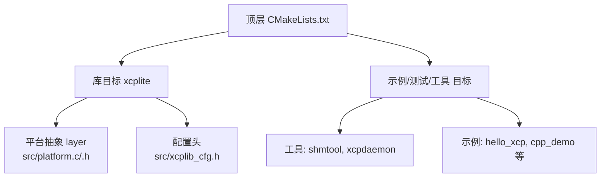
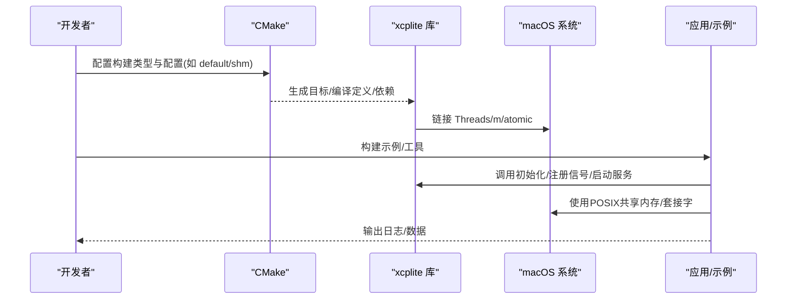
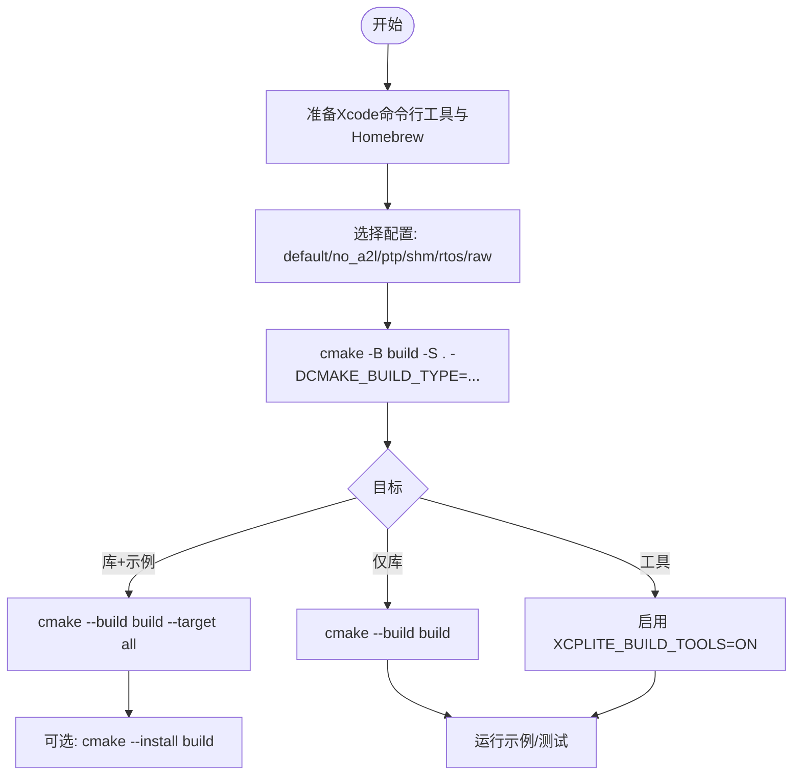
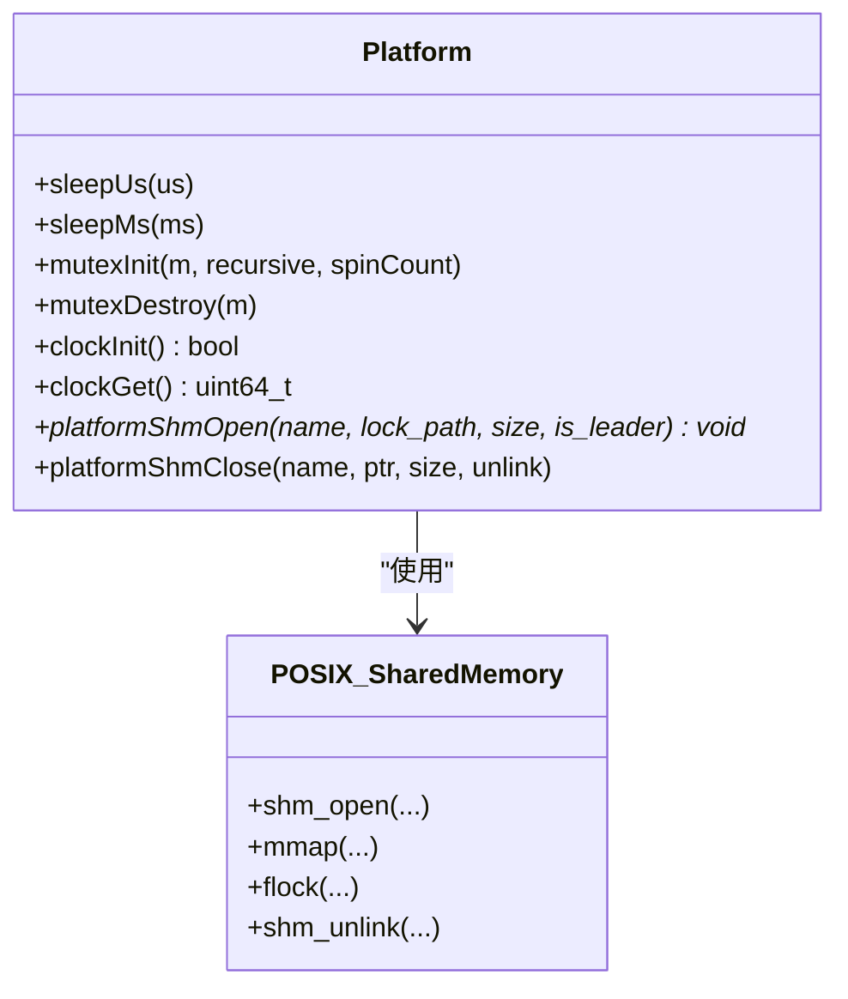
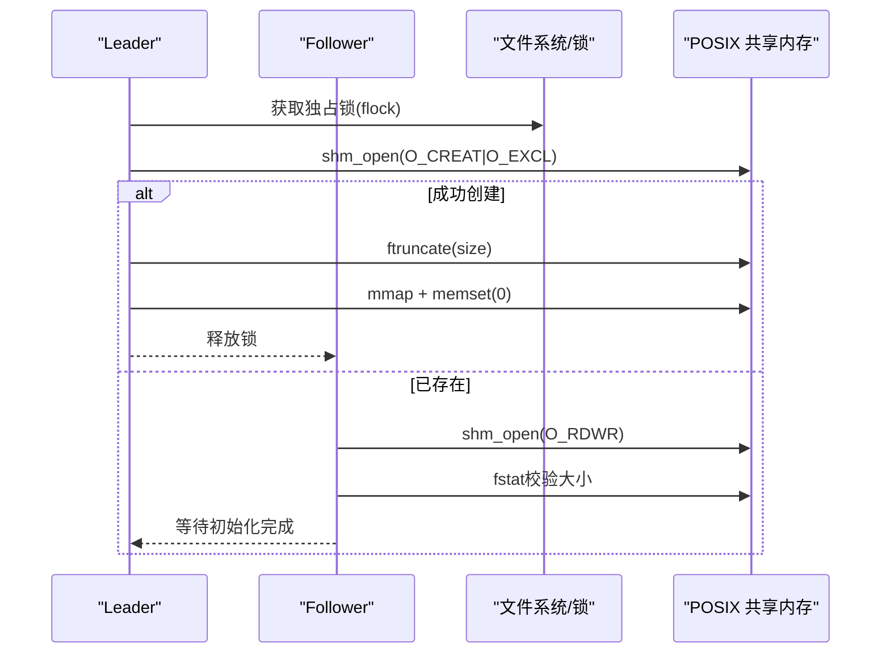
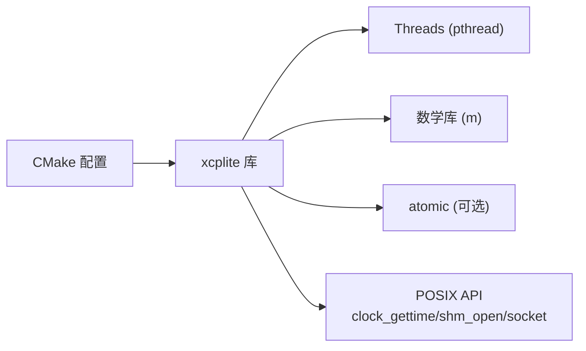

# macOS平台部署

<cite>
**本文引用的文件**
- [CMakeLists.txt](file://CMakeLists.txt)
- [platform.c](file://src/platform.c)
- [platform.h](file://src/platform.h)
- [BUILDING.md](file://docs/BUILDING.md)
- [xcplib_cfg.h](file://src/xcplib_cfg.h)
- [OFFLINE_A2L.md](file://docs/OFFLINE_A2L.md)
- [SHM.md](file://docs/SHM.md)
- [SOCKET_RAW.md](file://docs/SOCKET_RAW.md)
- [TECHNICAL.md](file://docs/TECHNICAL.md)
- [install_service.sh](file://tools/xcpdaemon/install_service.sh)
- [shm_cleanup.sh](file://tools/shm_cleanup.sh)
- [fetchcontent_example/CMakeLists.txt](file://examples/fetchcontent_example/CMakeLists.txt)
</cite>

## 目录
1. [简介](#简介)
2. [项目结构](#项目结构)
3. [核心组件](#核心组件)
4. [架构总览](#架构总览)
5. [详细组件分析](#详细组件分析)
6. [依赖关系分析](#依赖关系分析)
7. [性能考量](#性能考量)
8. [故障排查指南](#故障排查指南)
9. [结论](#结论)
10. [附录](#附录)

## 简介
本指南面向在macOS平台上构建、部署和分发XCPlite（libxcplite）的工程师，覆盖从Xcode命令行工具与Homebrew环境准备、CMake配置与多架构编译，到macOS系统API使用、共享内存与网络栈集成、代码签名与沙箱安全、App Store分发与Notarization流程、版本管理、Launchd服务集成，以及Instruments与Activity Monitor等性能分析工具的实践要点。文档严格基于仓库中的CMake配置、平台抽象层与官方构建说明进行提炼，确保可操作且可追溯。

## 项目结构
XCPlite采用CMake工程组织，提供统一的构建入口与跨平台抽象：
- 顶层CMakeLists.txt负责库目标、示例、测试、工具的安装与导出，并包含平台检测与编译器选项设置。
- src/platform.{c,h}实现线程、时钟、互斥量、原子操作、共享内存等POSIX能力封装，支持macOS路径。
- docs/BUILDING.md提供macOS快速构建、配置切换、安装与常见问题排查。
- 工具与脚本位于tools/，包括共享内存清理、守护进程服务等。

**图示来源**
- [CMakeLists.txt:15-155](file://CMakeLists.txt#L15-L155)
- [CMakeLists.txt:245-311](file://CMakeLists.txt#L245-L311)
- [platform.h:23-72](file://src/platform.h#L23-L72)

**章节来源**
- [CMakeLists.txt:15-155](file://CMakeLists.txt#L15-L155)
- [CMakeLists.txt:245-311](file://CMakeLists.txt#L245-L311)
- [platform.h:23-72](file://src/platform.h#L23-L72)
- [BUILDING.md:87-218](file://docs/BUILDING.md#L87-L218)

## 核心组件
- 构建系统与配置
  - 通过XCPLITE_CONFIGURATION选择功能集（default/no_a2l/ptp/shm/rtos/raw），每个配置对应不同的编译定义与目标集合。
  - 默认安装前缀为构建目录下的install，避免污染系统路径；可通过CMAKE_INSTALL_PREFIX自定义。
  - 自动链接Threads与math库（UNIX/macOS），并在需要时链接atomic库以支持C11原子。
- 平台抽象层
  - 统一线程、时钟、互斥量、睡眠、共享内存接口；在macOS下走POSIX路径（pthread、clock_gettime、mmap/shm_open）。
  - 对共享内存提供leader-follower选举与flock序列化，保证多进程安全。
- 工具链与示例
  - 支持构建示例、测试与工具（如shmtool、xcpdaemon），便于验证与调试。
  - 提供FetchContent示例，展示如何在消费项目中引入xcplite。

**章节来源**
- [CMakeLists.txt:15-155](file://CMakeLists.txt#L15-L155)
- [CMakeLists.txt:245-311](file://CMakeLists.txt#L245-L311)
- [platform.c:161-363](file://src/platform.c#L161-L363)
- [platform.h:274-298](file://src/platform.h#L274-L298)
- [BUILDING.md:87-218](file://docs/BUILDING.md#L87-L218)

## 架构总览
下图展示了macOS上xcplite的构建与运行关键路径：CMake生成目标→链接平台抽象与系统库→示例/工具运行→共享内存或网络通信。

**图示来源**
- [CMakeLists.txt:157-311](file://CMakeLists.txt#L157-L311)
- [platform.c:505-654](file://src/platform.c#L505-L654)

## 详细组件分析

### 构建环境与CMake配置（macOS）
- 要求与标准
  - C11、C++17（Windows为C++20），macOS遵循C++17。
- 快速构建
  - 推荐使用build.sh或直接CMake命令，指定构建类型（Debug/Release/RelWithDebInfo）与配置（default/no_a2l/ptp/shm/rtos/raw）。
  - 安装默认到构建目录install，可改为系统路径（需sudo）。
- 配置切换
  - 不同配置会注入不同编译定义，务必使用独立构建目录。
- 消费方式
  - 支持find_package与FetchContent两种模式；示例中提供了FetchContent用法。

**图示来源**
- [BUILDING.md:87-218](file://docs/BUILDING.md#L87-L218)
- [CMakeLists.txt:15-155](file://CMakeLists.txt#L15-L155)

**章节来源**
- [BUILDING.md:87-218](file://docs/BUILDING.md#L87-L218)
- [CMakeLists.txt:15-155](file://CMakeLists.txt#L15-L155)
- [examples/fetchcontent_example/CMakeLists.txt:21-69](file://examples/fetchcontent_example/CMakeLists.txt#L21-L69)

### 平台抽象与macOS系统API
- 线程与时钟
  - 使用pthread创建与管理线程；时钟基于POSIX clock_gettime，支持单调时钟与实时时钟，精度满足微秒/纳秒需求。
- 共享内存
  - 通过shm_open/mmap创建命名共享内存，配合flock实现leader选举与并发安全；提供attach/close/unlink接口。
- 原子与互斥
  - 非Windows平台使用stdatomic/pthread_mutex；必要时链接atomic库。
- 文件系统与键盘输入
  - 提供文件存在性检查；可选键盘交互（非Windows）。

**图示来源**
- [platform.h:274-298](file://src/platform.h#L274-L298)
- [platform.c:161-363](file://src/platform.c#L161-L363)
- [platform.c:505-654](file://src/platform.c#L505-L654)

**章节来源**
- [platform.c:161-363](file://src/platform.c#L161-L363)
- [platform.c:505-654](file://src/platform.c#L505-L654)
- [platform.h:274-298](file://src/platform.h#L274-L298)

### 共享内存与多进程协作（macOS）
- leader-follower模型
  - 首个进程创建共享内存并零初始化，后续进程附加已有区域；通过锁文件串行化选举窗口。
- 清理与恢复
  - 提供shm_cleanup.sh脚本，可清理残留共享内存对象与锁文件，必要时终止演示进程。
- 注意事项
  - 若发现“旧构建残留”或大小不匹配，按提示清理后重试。

**图示来源**
- [platform.c:201-318](file://src/platform.c#L201-L318)
- [shm_cleanup.sh:1-50](file://tools/shm_cleanup.sh#L1-L50)

**章节来源**
- [platform.c:201-318](file://src/platform.c#L201-L318)
- [shm_cleanup.sh:1-50](file://tools/shm_cleanup.sh#L1-L50)
- [SHM.md:11-11](file://docs/SHM.md#L11-L11)

### 网络传输与原始以太网（macOS限制）
- UDP/TCP
  - 默认配置支持以太网UDP/TCP传输；macOS下DF标志设置行为见文档。
- 原始以太网（raw）
  - raw配置依赖AF_PACKET，当前仅在Linux可用；macOS/Windows构建将跳过相关目标。

**章节来源**
- [SOCKET_RAW.md:53-77](file://docs/SOCKET_RAW.md#L53-L77)
- [CMakeLists.txt:396-407](file://CMakeLists.txt#L396-L407)

### A2L生成与离线模式（macOS注意）
- 在线A2L
  - 默认配置支持运行时生成A2L。
- 离线A2L（no_a2l）
  - macOS可构建与运行，但A2L需从Linux构建产物（ELF/DWARF）生成；xcpclient不支持直接解析Mach-O。

**章节来源**
- [OFFLINE_A2L.md:39-41](file://docs/OFFLINE_A2L.md#L39-L41)
- [OFFLINE_A2L.md:264-264](file://docs/OFFLINE_A2L.md#L264-L264)

### 事件段与符号信息（macOS节名）
- 事件描述符放置于特定段，macOS上节名为__DATA,xcp_evts等；无节支持的平台上回退到其他策略。

**章节来源**
- [TECHNICAL.md:115-147](file://docs/TECHNICAL.md#L115-L147)

### Launchd服务集成（macOS）
- Linux systemd服务脚本
  - tools/xcpdaemon/install_service.sh用于在Linux安装systemd服务；macOS未提供等效脚本。
- macOS替代方案
  - 可使用launchd plist配置守护进程；建议参考系统文档将xcpdaemon二进制与参数写入plist，并通过launchctl管理。

**章节来源**
- [install_service.sh:1-47](file://tools/xcpdaemon/install_service.sh#L1-L47)

## 依赖关系分析
- 构建期依赖
  - CMake、C/C++编译器（Clang/GCC）、可选Rust工具链（构建xcpclient/bintool）。
  - 平台库：Threads、math（UNIX/macOS）、atomic（部分ARM Clang）。
- 运行期依赖
  - POSIX系统调用（pthread、clock_gettime、shm_open/mmap、socket等）。
  - 示例/工具可能依赖外部工具（如CANape、ptp4l等）。

**图示来源**
- [CMakeLists.txt:157-311](file://CMakeLists.txt#L157-L311)
- [platform.c:505-654](file://src/platform.c#L505-L654)

**章节来源**
- [CMakeLists.txt:157-311](file://CMakeLists.txt#L157-L311)
- [platform.c:505-654](file://src/platform.c#L505-L654)

## 性能考量
- 时钟与延迟
  - 使用高精度单调时钟与微秒级sleep；避免频繁系统调用，利用last值缓存降低开销。
- 队列与原子
  - 64位无锁队列依赖C11原子；某些ARM平台需链接atomic库以避免运行时辅助函数。
- 优化级别
  - Release使用-O2；RelWithDebInfo使用-O1保留局部变量地址以便事件触发测量。
- Instruments与Activity Monitor
  - 使用Instruments的Time Profiler、Allocations、Leaks等分析CPU与内存；Activity Monitor观察进程资源占用与系统调用热点。
  - 结合RelWithDebInfo构建以获得更准确的堆栈信息。

[本节为通用指导，无需特定文件引用]

## 故障排查指南
- 构建问题
  - 确认C11/C++17编译器可用；切换CC/CXX环境变量并清理构建目录后重试。
  - 若出现atomic缺失错误，确认已链接atomic库（CMake已自动处理）。
- 共享内存问题
  - 使用tools/shm_cleanup.sh清理残留对象与锁文件；必要时终止演示进程。
- A2L生成失败
  - no_a2l模式下，确保从Linux构建产物生成A2L；macOS Mach-O不被xcpclient支持。
- 网络问题
  - raw配置在macOS不可用；UDP/TCP模式下检查DF标志与MTU设置。

**章节来源**
- [BUILDING.md:364-416](file://docs/BUILDING.md#L364-L416)
- [shm_cleanup.sh:1-50](file://tools/shm_cleanup.sh#L1-L50)
- [OFFLINE_A2L.md:39-41](file://docs/OFFLINE_A2L.md#L39-L41)
- [SOCKET_RAW.md:53-77](file://docs/SOCKET_RAW.md#L53-L77)

## 结论
XCPlite在macOS上具备完善的CMake构建支持与POSIX平台抽象，能够稳定地提供线程、时钟、共享内存与网络传输能力。通过合理配置构建类型与目标，结合Instruments与Activity Monitor进行性能调优，可满足大多数数据采集与标定场景的需求。对于App Store分发与沙箱安全，需结合macOS代码签名、Entitlements与Notarization流程进行适配；由于本项目未内置相关脚本，建议在应用工程中按Apple规范补充。

[本节为总结，无需特定文件引用]

## 附录

### macOS平台部署清单（实操步骤）
- 安装Xcode命令行工具与Homebrew
  - 安装Xcode Command Line Tools（xcode-select --install）。
  - 安装Homebrew（/usr/bin/ruby -e "$(curl -fsSL https://raw.githubusercontent.com/Homebrew/install/master/install.sh)"）。
- 配置CMake与构建
  - 选择配置（default/no_a2l/ptp/shm/rtos/raw），使用独立构建目录。
  - 构建示例/测试/工具，按需安装至本地或系统路径。
- 运行与调试
  - 使用RelWithDebInfo构建以获得调试信息；借助Instruments与Activity Monitor分析性能。
- 共享内存清理
  - 遇到残留对象时使用tools/shm_cleanup.sh清理。
- 离线A2L
  - no_a2l模式下从Linux构建产物生成A2L。

**章节来源**
- [BUILDING.md:87-218](file://docs/BUILDING.md#L87-L218)
- [shm_cleanup.sh:1-50](file://tools/shm_cleanup.sh#L1-L50)
- [OFFLINE_A2L.md:39-41](file://docs/OFFLINE_A2L.md#L39-L41)

### 代码签名、沙箱与权限（macOS）
- 代码签名
  - 使用codesign对可执行文件与动态库进行签名；为应用配置Entitlements以声明所需权限（如网络访问、文件系统访问等）。
- 沙箱模式
  - 若发布至App Store，需启用沙箱并最小化权限；共享内存与原始套接字在沙箱中受限，应评估是否适用。
- Notarization
  - 提交至Apple notarization服务，确保二进制未被篡改并获得公证票证。
- 版本管理
  - 使用CMake project(xcplite VERSION ...)与git tag管理版本；安装时记录配置信息供消费者校验。

[本节为通用指导，无需特定文件引用]

### 与系统服务集成（Launchd）
- 编写launchd plist，指定程序路径、工作目录、用户与环境变量。
- 使用launchctl load/unload管理服务生命周期；查看日志与状态。
- 与xcplite共享内存/网络服务协同，确保服务启动顺序与资源就绪。

[本节为通用指导，无需特定文件引用]

### 跨架构支持（x86_64、arm64）
- 双架构构建
  - 使用CMAKE_OSX_ARCHITECTURES="x86_64;arm64"进行通用二进制构建；确保依赖库也支持双架构。
- 原生与模拟器
  - arm64用于Apple Silicon设备；x86_64用于Intel Mac或Rosetta 2兼容。
- 注意事项
  - 某些第三方库需重新编译以支持arm64；确保所有依赖一致。

[本节为通用指导，无需特定文件引用]