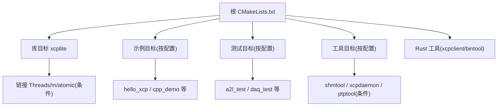
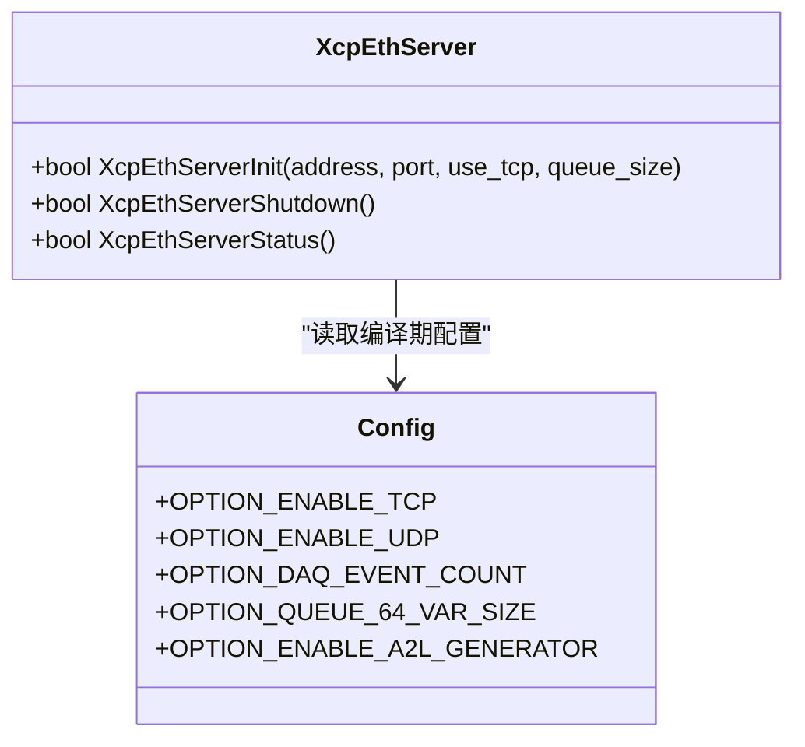
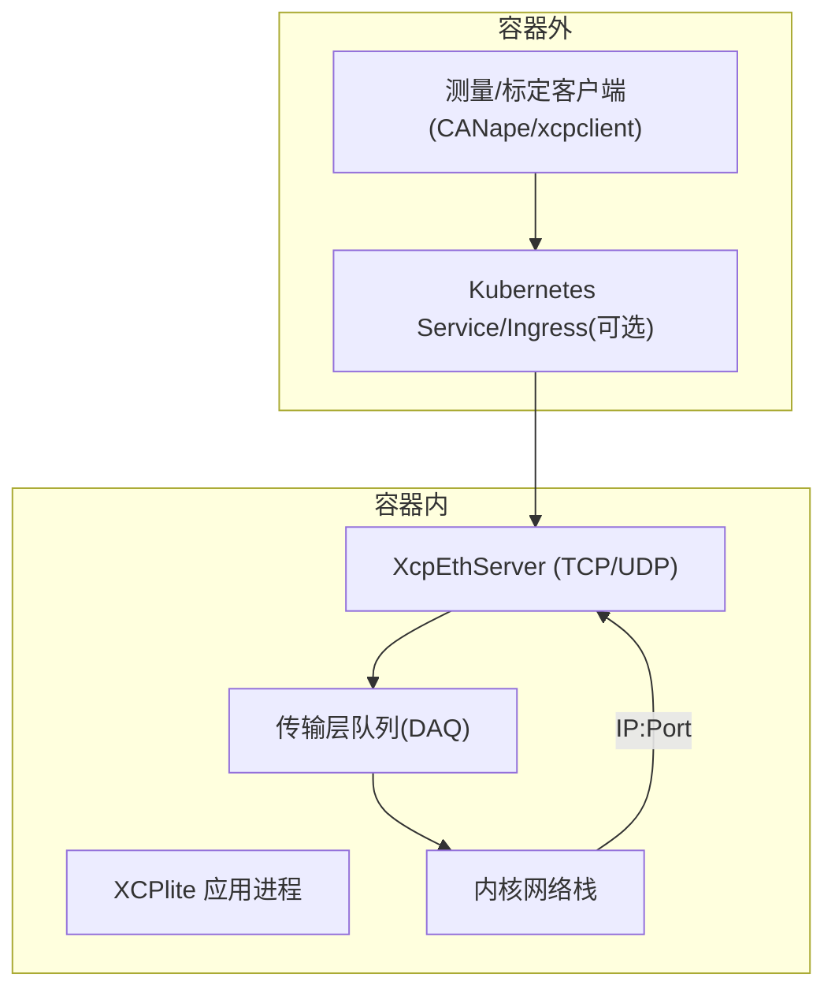
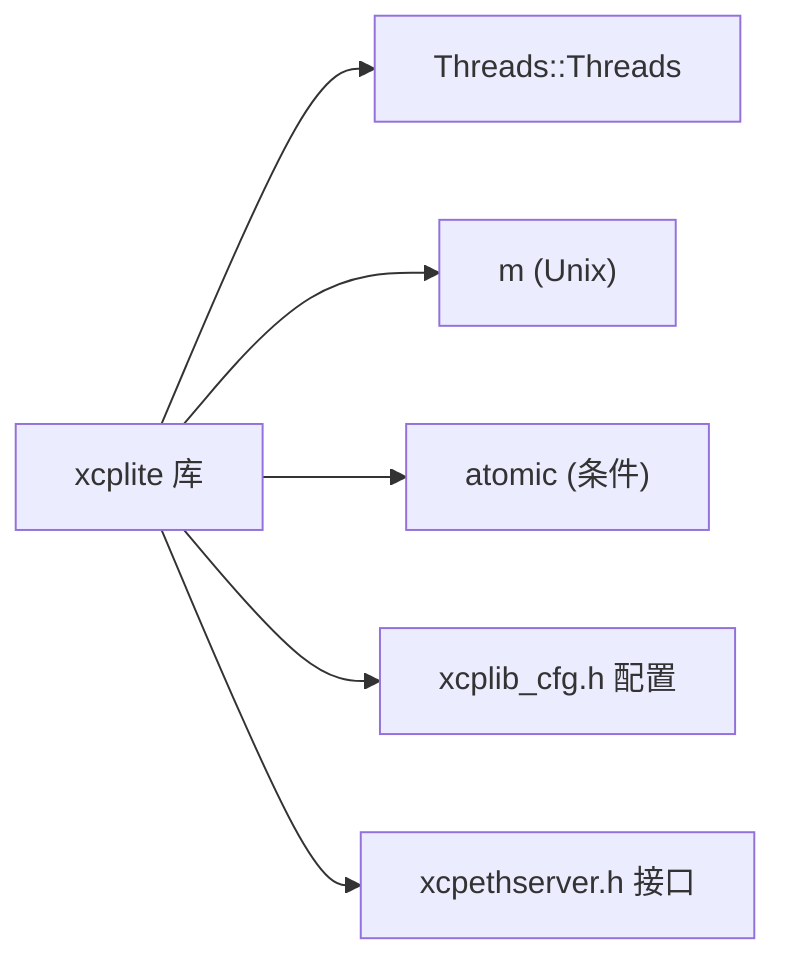

# 容器化部署

<cite>
**本文引用的文件**
- [CMakeLists.txt](file://CMakeLists.txt)
- [README.md](file://README.md)
- [BUILDING.md](file://docs/BUILDING.md)
- [xcpethserver.h](file://src/xcpethserver.h)
- [xcplib_cfg.h](file://src/xcplib_cfg.h)
</cite>

## 目录
1. [简介](#简介)
2. [项目结构](#项目结构)
3. [核心组件](#核心组件)
4. [架构总览](#架构总览)
5. [详细组件分析](#详细组件分析)
6. [依赖分析](#依赖分析)
7. [性能考虑](#性能考虑)
8. [故障排查指南](#故障排查指南)
9. [结论](#结论)
10. [附录](#附录)

## 简介
本指南面向在容器环境中构建、部署和运行 XCPlite 的工程师，覆盖镜像构建最佳实践（多阶段构建、镜像优化与安全加固）、Kubernetes 部署配置（Deployment、Service、ConfigMap）、容器网络与端口映射、服务发现、CI/CD 流水线集成、生产环境优化（资源限制、健康检查、日志收集）、容器安全最佳实践（最小化镜像、权限隔离、敏感信息管理），以及监控与可观测性集成（Prometheus 指标导出、分布式追踪）。同时提供 Docker Compose 示例与编排配置文件，帮助快速落地。

XCPlite 是一个面向现代多核处理器与 RTOS 的 XCP on Ethernet 实现，支持 TCP/UDP 传输、运行时 A2L 生成、线程安全与无锁队列等特性，适合在高并发、低延迟场景下采集与标定数据。

**章节来源**
- [README.md:1-130](file://README.md#L1-L130)

## 项目结构
XCPlite 使用 CMake 作为构建系统，通过配置开关控制功能集与目标产物。关键要点：
- 构建配置互斥：通过 XCPLITE_CONFIGURATION 选择不同功能集（default/no_a2l/ptp/shm/rtos/raw），每个配置需独立构建目录。
- 可选目标：示例、测试、工具、Rust 工具链（xcpclient/bintool）均可按需启用。
- 安装规则：顶层构建默认开启安装规则，便于外部项目 find_package 或 FetchContent 引用。
- 平台相关：Linux/macOS/Windows/QNX/FreeRTOS；部分功能仅 Linux（如 PTP、raw Ethernet）。

**图表来源**
- [CMakeLists.txt:149-155](file://CMakeLists.txt#L149-L155)
- [CMakeLists.txt:245-298](file://CMakeLists.txt#L245-L298)
- [CMakeLists.txt:318-423](file://CMakeLists.txt#L318-L423)
- [CMakeLists.txt:430-502](file://CMakeLists.txt#L430-L502)
- [CMakeLists.txt:509-586](file://CMakeLists.txt#L509-L586)

**章节来源**
- [CMakeLists.txt:1-155](file://CMakeLists.txt#L1-L155)
- [BUILDING.md:11-84](file://docs/BUILDING.md#L11-L84)

## 核心组件
- 以太网服务器初始化：XcpEthServerInit(address, port, use_tcp, measurement_queue_size)，用于绑定地址与端口并启动 XCP over Ethernet 服务。
- 传输层与队列：基于无锁可变长度队列（64位平台）或带锁队列（32位/Windows），支持高吞吐 DAQ 数据。
- 配置头：xcplib_cfg.h 集中定义日志、时钟、XCP 选项、校准段、DAQ、A2L 生成等编译期开关。
- 构建配置：通过 CMake 选项与 XCPLITE_CONFIGURATION 控制功能裁剪与目标产物。

**图表来源**
- [xcpethserver.h:19-33](file://src/xcpethserver.h#L19-L33)
- [xcplib_cfg.h:73-168](file://src/xcplib_cfg.h#L73-L168)

**章节来源**
- [xcpethserver.h:1-34](file://src/xcpethserver.h#L1-L34)
- [xcplib_cfg.h:1-200](file://src/xcplib_cfg.h#L1-L200)

## 架构总览
下图展示从应用进程到网络栈的数据流，以及容器内外的网络边界与服务发现关系。

**图表来源**
- [xcpethserver.h:19-33](file://src/xcpethserver.h#L19-L33)
- [xcplib_cfg.h:73-79](file://src/xcplib_cfg.h#L73-L79)

## 详细组件分析

### 镜像构建最佳实践（多阶段构建、优化与安全）
- 多阶段构建建议
  - 构建阶段：安装 C/C++ 工具链、CMake、可选 Rust 工具链（若启用 XCPLITE_BUILD_RUST_TOOLS），执行 cmake 配置与构建。
  - 运行阶段：仅复制最终二进制与必要运行时库，删除构建缓存与源码，降低镜像体积。
- 镜像优化
  - 使用精简基础镜像（如 distroless 或 alpine），关闭不必要的调试符号与日志宏（Release/RelWithDebInfo）。
  - 合理设置 CMAKE_BUILD_TYPE 与编译器标志（见 CMakeLists 中的 Release/RelWithDebInfo/Debug 策略）。
  - 按需裁剪功能：通过 XCPLITE_CONFIGURATION 与 XCPLITE_BUILD_* 选项禁用不需要的示例/测试/工具。
- 安全加固
  - 以非 root 用户运行容器，最小化文件系统权限。
  - 固定基础镜像版本，启用镜像漏洞扫描。
  - 将敏感配置（如监听地址、端口、日志级别）放入环境变量或挂载卷，避免硬编码进镜像。

参考构建与安装流程与选项说明：
- 构建类型与安装前缀、各配置的目标产物、Rust 工具构建方式等。

**章节来源**
- [CMakeLists.txt:218-243](file://CMakeLists.txt#L218-L243)
- [CMakeLists.txt:555-586](file://CMakeLists.txt#L555-L586)
- [BUILDING.md:85-218](file://docs/BUILDING.md#L85-L218)

### Kubernetes 部署配置（Deployment、Service、ConfigMap）
- Deployment
  - 指定镜像、副本数、资源请求/限制（CPU/Memory）。
  - 健康检查：使用 liveness/readiness 探针调用本地命令或 HTTP/TCP 探测（例如对 XCP 端口进行 TCP 探测）。
  - 环境变量注入：监听地址、端口、日志级别、是否使用 TCP/UDP 等。
- Service
  - ClusterIP/NodePort/LoadBalancer 暴露 XCP 服务端口（默认 UDP/TCP 5555，依示例配置）。
  - 如需 Ingress，注意 XCP over UDP 通常不走 Ingress，建议使用 NodePort 或 LoadBalancer。
- ConfigMap
  - 存放非敏感配置（如日志级别、事件数量、队列大小等编译期之外的可调参数）。
  - 通过环境变量或挂载卷注入到 Pod。

提示：
- 若使用 raw Ethernet HAL（raw 配置），需要特权或 CAP_NET_RAW 能力，谨慎在生产环境使用。
- 对于 PTP 硬件时间戳（ptp 配置），需宿主机网卡支持并正确配置 ptp4l。

**章节来源**
- [xcpethserver.h:19-33](file://src/xcpethserver.h#L19-L33)
- [xcplib_cfg.h:73-79](file://src/xcplib_cfg.h#L73-L79)

### 容器网络配置、端口映射与服务发现
- 端口映射
  - 默认示例使用 UDP 5555 端口；也可切换为 TCP。
  - 在 Deployment 中通过 Service 暴露端口，或在单机环境用 docker run -p 映射。
- 服务发现
  - 在集群内通过 Service DNS 访问；跨命名空间需显式域名。
  - 客户端可通过环境变量或 ConfigMap 获取服务地址与端口。
- 网络模式
  - 推荐 hostNetwork 仅在必要时使用（如 raw Ethernet 或 PTP 直通）。
  - 普通场景使用默认 overlay 网络即可。

**章节来源**
- [xcpethserver.h:19-33](file://src/xcpethserver.h#L19-L33)
- [xcplib_cfg.h:73-79](file://src/xcplib_cfg.h#L73-L79)

### CI/CD 流水线集成（自动化测试与部署）
- 构建阶段
  - 选择构建类型（Debug/Release/RelWithDebInfo）与配置（default/no_a2l/ptp/shm/rtos/raw）。
  - 按需启用示例、测试、工具与 Rust 工具。
- 测试阶段
  - 运行单元测试与集成测试（如 a2l_test、daq_test、clock_test 等）。
  - 针对 raw/ptp 配置的条件测试需在具备相应能力的容器中执行。
- 打包与发布
  - 多阶段构建生成最小运行镜像。
  - 推送镜像到仓库，并在 K8s 中滚动更新。
- 回滚与验证
  - 使用蓝绿/金丝雀发布，结合健康检查与指标阈值自动回滚。

**章节来源**
- [CMakeLists.txt:149-155](file://CMakeLists.txt#L149-L155)
- [CMakeLists.txt:318-502](file://CMakeLists.txt#L318-L502)
- [BUILDING.md:85-218](file://docs/BUILDING.md#L85-L218)

### 生产环境优化建议
- 资源限制
  - 为 Pod 设置 requests/limits，防止资源争用。
  - 调整队列大小与 DAQ 事件数量，平衡内存与吞吐。
- 健康检查
  - 使用 TCP 探针探测 XCP 端口；或使用应用内部健康端点。
- 日志收集
  - 将日志输出到 stdout/stderr，由侧车或 DaemonSet 统一收集。
  - 控制日志级别，生产环境建议 Info 或 Warn。
- 性能调优
  - 选择合适的队列实现（64位无锁 vs 32位有锁）。
  - 根据 MTU 与网络路径调整数据包大小，避免分片。

**章节来源**
- [xcplib_cfg.h:120-168](file://src/xcplib_cfg.h#L120-L168)
- [xcplib_cfg.h:73-79](file://src/xcplib_cfg.h#L73-L79)

### 容器安全最佳实践
- 最小化镜像
  - 仅包含运行时所需二进制与库，移除构建工具与源码。
  - 使用多阶段构建与精简基础镜像。
- 权限隔离
  - 以非 root 用户运行，限制文件系统写入范围。
  - 仅授予必要能力（如 raw Ethernet 场景下的 CAP_NET_RAW）。
- 敏感信息管理
  - 通过环境变量或 Secret 注入敏感信息（密钥、证书）。
  - 避免将敏感信息写入镜像或日志。

**章节来源**
- [CMakeLists.txt:218-243](file://CMakeLists.txt#L218-L243)
- [xcplib_cfg.h:73-79](file://src/xcplib_cfg.h#L73-L79)

### 监控与可观测性集成
- Prometheus 指标
  - 可在应用内暴露指标端点（HTTP），或通过 sidecar 抓取系统指标（CPU/内存/网络）。
  - 结合 K8s Metrics Server 与自定义指标实现告警。
- 分布式追踪
  - 在关键路径插入埋点（如事件触发、队列入队/出队），导出追踪数据至 Jaeger/Zipkin。
- 日志与审计
  - 结构化日志（JSON），包含请求 ID、事件 ID、线程 ID 等上下文。
  - 集中式日志存储与检索（ELK/Loki）。

[本节为通用指导，不直接分析具体文件]

### Docker Compose 示例与编排配置
- 单节点快速验证
  - 使用 docker-compose 启动 XCPlite 服务，映射 UDP/TCP 5555 端口。
  - 通过环境变量配置监听地址、端口、日志级别等。
- 多服务编排
  - 组合 xcpclient、CANape 模拟器或其他测试工具，验证端到端链路。
  - 使用 volumes 挂载配置文件与数据目录。

[本节提供概念性编排思路，具体 YAML 可按实际环境定制]

## 依赖分析
XCPlite 的核心依赖包括线程库、数学库与原子库（条件链接），并通过 CMake 管理构建与安装。

**图表来源**
- [CMakeLists.txt:297-311](file://CMakeLists.txt#L297-L311)
- [xcplib_cfg.h:73-168](file://src/xcplib_cfg.h#L73-L168)
- [xcpethserver.h:19-33](file://src/xcpethserver.h#L19-L33)

**章节来源**
- [CMakeLists.txt:297-311](file://CMakeLists.txt#L297-L311)

## 性能考虑
- 队列与吞吐
  - 64位平台默认使用无锁可变长度队列，提升吞吐与降低延迟。
  - 32位/Windows 使用带锁队列，确保一致性。
- 日志与调试
  - 生产环境关闭或降低日志级别，减少 I/O 开销。
- 网络与 MTU
  - 根据网络路径调整 MTU，避免分片导致丢包。
- 资源占用
  - 合理设置 DAQ 事件数量与队列大小，避免内存溢出。

**章节来源**
- [xcplib_cfg.h:120-168](file://src/xcplib_cfg.h#L120-L168)

## 故障排查指南
- 构建问题
  - 确认 C11/C++17 标准与编译器版本。
  - 检查原子库支持（ARM Clang 可能需要 -latomic）。
  - 清理构建目录后重试，避免混用配置。
- 运行时问题
  - 验证端口占用与防火墙规则。
  - 检查日志级别与输出位置，定位错误堆栈。
  - 对于 raw/ptp 配置，确认宿主机能力与驱动支持。

**章节来源**
- [BUILDING.md:364-416](file://docs/BUILDING.md#L364-L416)

## 结论
通过多阶段构建、严格的安全加固与合理的资源配置，XCPlite 可在容器与 Kubernetes 环境中稳定运行，满足高吞吐、低延迟的采集与标定需求。结合 CI/CD 自动化测试与发布流程，可实现快速迭代与可靠交付。生产环境应重点关注资源限制、健康检查、日志收集与监控告警，确保安全与可观测性。

[本节为总结性内容，不直接分析具体文件]

## 附录
- 快速构建与安装
  - 使用 build.sh 或 CMake 进行快速构建与安装。
  - 针对不同配置（default/no_a2l/ptp/shm/rtos/raw）选择合适目标。
- 示例与文档
  - 参考 examples 与 docs 获取更详细的用法与配置说明。

**章节来源**
- [BUILDING.md:85-218](file://docs/BUILDING.md#L85-L218)
- [README.md:53-110](file://README.md#L53-L110)