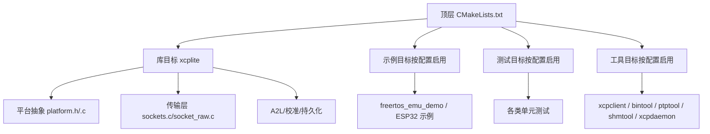
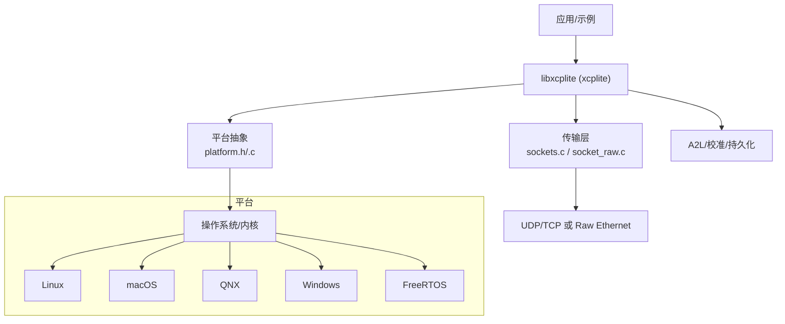
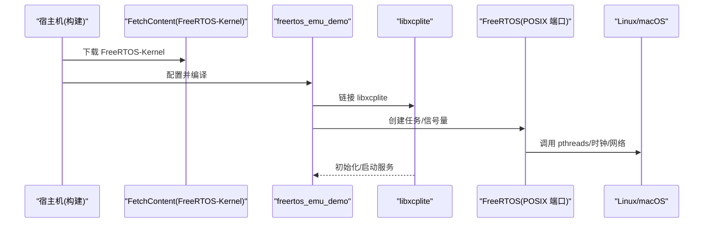
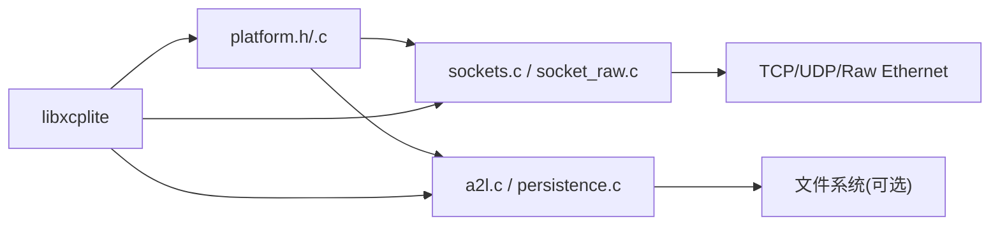

# 平台部署指南

<cite>
**本文引用的文件**
- [README.md](file://README.md)
- [CMakeLists.txt](file://CMakeLists.txt)
- [BUILDING.md](file://docs/BUILDING.md)
- [xcplib_cfg.md](file://docs/xcplib_cfg.md)
- [platform.h](file://src/platform.h)
- [platform.c](file://src/platform.c)
- [xcplib_cfg.h](file://src/xcplib_cfg.h)
- [xcplib_rtos_cfg.h](file://src/xcplib_rtos_cfg.h)
- [freertos_emu_demo/CMakeLists.txt](file://examples/freertos_demo/freertos_emu_demo/CMakeLists.txt)
- [platformio.ini](file://examples/freertos_demo/freertos_esp32_demo/platformio.ini)
</cite>

## 目录
1. [简介](#简介)
2. [项目结构](#项目结构)
3. [核心组件](#核心组件)
4. [架构总览](#架构总览)
5. [详细组件分析](#详细组件分析)
6. [依赖分析](#依赖分析)
7. [性能考虑](#性能考虑)
8. [故障排查指南](#故障排查指南)
9. [结论](#结论)
10. [附录](#附录)

## 简介
本指南面向系统集成工程师，提供在 Linux、Windows、macOS、QNX 以及 FreeRTOS（含 POSIX 模拟器与真实硬件）上的跨平台部署方案。内容涵盖：
- 构建系统与配置选项（CMake、XCPLITE_CONFIGURATION、应用级覆盖头）
- 各平台编译要求与差异（线程、原子、时钟、网络栈）
- FreeRTOS 移植要点（POSIX 模拟器与 ESP32/STM32 等目标）
- 容器化最佳实践（Docker 镜像构建与生产优化）
- 性能调优与内存优化策略（队列、MTU、日志、时钟源）

## 项目结构
XCPlite 采用 CMake 作为统一构建系统，通过“互斥的构建配置”选择不同功能集，并通过“应用级覆盖头”进行二次定制。关键目录与职责：
- src：库源码与平台抽象层（platform.h/.c）、传输层、A2L 生成、共享内存等
- inc：公共头文件
- examples：多平台示例（Linux/macOS/QNX/FreeRTOS 模拟/ESP32）
- tools：辅助工具（xcpclient、bintool、ptptool、shmtool、xcpdaemon）
- docs：构建与配置文档

图表来源
- [CMakeLists.txt:15-148](file://CMakeLists.txt#L15-L148)
- [CMakeLists.txt:245-299](file://CMakeLists.txt#L245-L299)
- [CMakeLists.txt:318-423](file://CMakeLists.txt#L318-L423)
- [CMakeLists.txt:505-586](file://CMakeLists.txt#L505-L586)

章节来源
- [CMakeLists.txt:15-148](file://CMakeLists.txt#L15-L148)
- [CMakeLists.txt:245-299](file://CMakeLists.txt#L245-L299)
- [CMakeLists.txt:318-423](file://CMakeLists.txt#L318-L423)
- [CMakeLists.txt:505-586](file://CMakeLists.txt#L505-L586)

## 核心组件
- 构建配置系统
  - 通过 XCPLITE_CONFIGURATION 选择默认/no_a2l/ptp/shm/rtos/raw 等配置，每个配置对应不同的编译定义与可选目标。
  - 支持应用级覆盖头 XCPLITE_CFG_OVERRIDE（仅 default 配置），用于在不修改仓库的前提下定制 OPTION_*。
- 平台抽象层
  - 统一线程、互斥、时钟、共享内存、原子操作等接口，屏蔽 Linux/Windows/macOS/QNX/FreeRTOS 差异。
- 传输层与协议
  - 以太网 UDP/TCP 或原始以太网（raw）；支持 PTP 时间戳、多播同步、Jumbo Frames。
- A2L/校准/持久化
  - 目标端 A2L 生成与上传、ELF 上传、校准段管理、RCU 更新、持久化存储（文件系统）。
- 工具链
  - xcpclient/bintool（Rust 工具，需 cargo）、ptptool（Linux PTP）、shmtool/xcpdaemon（共享内存模式）。

章节来源
- [CMakeLists.txt:15-148](file://CMakeLists.txt#L15-L148)
- [xcplib_cfg.h:18-204](file://src/xcplib_cfg.h#L18-L204)
- [platform.h:23-172](file://src/platform.h#L23-L172)
- [platform.c:157-363](file://src/platform.c#L157-L363)

## 架构总览
下图展示从应用到平台的调用关系与平台分支：

图表来源
- [CMakeLists.txt:245-299](file://CMakeLists.txt#L245-L299)
- [platform.h:23-172](file://src/platform.h#L23-L172)
- [platform.c:157-363](file://src/platform.c#L157-L363)

## 详细组件分析

### 构建系统与配置（跨平台）
- 构建类型与配置
  - 使用 build.sh 或直接 CMake 指定构建类型（Debug/Release/RelWithDebInfo）与配置（default/no_a2l/ptp/shm/rtos/raw）。
  - 每种配置使用独立构建目录，避免宏污染。
- 平台检测与标准
  - Windows 使用 C++20，其他平台使用 C++17；自动设置警告与优化标志。
  - Linux 自动定义 _GNU_SOURCE；Windows 关闭安全 CRT 告警。
- 链接依赖
  - Threads::Threads 在所有平台启用；Unix 链接 math；必要时链接 atomic。
- 安装与导出
  - 顶层项目默认安装到本地 staging；可自定义前缀；导出 CMake 包配置供外部 find_package 使用。

章节来源
- [BUILDING.md:85-218](file://docs/BUILDING.md#L85-L218)
- [CMakeLists.txt:172-243](file://CMakeLists.txt#L172-L243)
- [CMakeLists.txt:286-311](file://CMakeLists.txt#L286-L311)
- [CMakeLists.txt:588-656](file://CMakeLists.txt#L588-L656)

### 平台特定编译要求与差异
- Linux
  - 需要 _GNU_SOURCE；支持 PTP 工具链（ptptool）、eBPF（可选）、Raw Ethernet（CAP_NET_RAW）。
  - 共享内存基于 POSIX shm_open/mmap。
- macOS
  - 支持共享内存工具；PTP 相关能力受限；时钟精度受平台限制。
- QNX
  - 需 QNX SDP；C++ 目标在旧版本可能受限；时钟使用 CLOCK_MONOTONIC。
- Windows
  - 原子操作通过 Interlocked 内建函数模拟；发送队列使用互斥；性能较 POSIX 略低。
- FreeRTOS
  - 使用 lwIP 或 raw Ethernet HAL；无文件系统；禁用目标端 A2L/ELF 上传；使用绝对寻址。

章节来源
- [platform.h:23-172](file://src/platform.h#L23-L172)
- [platform.c:157-363](file://src/platform.c#L157-L363)
- [BUILDING.md:220-256](file://docs/BUILDING.md#L220-L256)

### FreeRTOS 移植与部署
- POSIX 模拟器（Linux/macOS）
  - 通过 FetchContent 拉取 FreeRTOS-Kernel 的 POSIX 端口；启用 FREE_RTOS_POSIX_SIM 以复用主机 sockets/clock。
  - 必须定义 _GNU_SOURCE；使用 xcplib_rtos_cfg.h 覆盖默认配置。
- 真实硬件（ESP32/STM32 等）
  - 使用 PlatformIO 或厂商工具链；定义 _FREE_RTOS 并包含 xcplib_rtos_cfg.h。
  - 配置 lwIP 或 raw Ethernet HAL；调整任务栈大小与优先级；校准段与 DAQ 内存按需裁剪。

图表来源
- [freertos_emu_demo/CMakeLists.txt:16-99](file://examples/freertos_demo/freertos_emu_demo/CMakeLists.txt#L16-L99)
- [platform.h:106-162](file://src/platform.h#L106-L162)
- [xcplib_rtos_cfg.h:44-88](file://src/xcplib_rtos_cfg.h#L44-L88)

章节来源
- [freertos_emu_demo/CMakeLists.txt:16-99](file://examples/freertos_demo/freertos_emu_demo/CMakeLists.txt#L16-L99)
- [platformio.ini:11-43](file://examples/freertos_demo/freertos_esp32_demo/platformio.ini#L11-L43)
- [xcplib_rtos_cfg.h:44-142](file://src/xcplib_rtos_cfg.h#L44-L142)

### 容器化部署（Docker）
- 基础镜像选择
  - Linux 构建：选用带 GCC/Clang、CMake 的发行版镜像；如需 Rust 工具，额外安装 cargo。
  - Windows 构建：使用 msvc 镜像；注意性能与原子模拟限制。
- 构建步骤建议
  - 将源码与 CMake 脚本放入镜像；使用多阶段构建：第一阶段编译库与工具，第二阶段仅拷贝产物。
  - 为不同配置（default/no_a2l/ptp/shm/rtos/raw）分别构建镜像标签，便于环境隔离。
- 运行时优化
  - 最小化镜像体积：仅保留运行所需二进制与必要库；移除调试符号。
  - 网络与安全：仅暴露必要端口；Linux 下对 Raw Ethernet 场景授予 CAP_NET_RAW。
  - 资源限制：合理设置 CPU/内存配额；监控队列长度与丢包率。

[本节为通用指导，不直接引用具体代码文件]

### 性能调优与内存优化
- 队列与吞吐
  - 64 位平台优先使用无锁可变长队列（queue64v.c）；32 位或 Windows 使用 queue32 系列。
  - 根据负载调整队列缓冲区大小；确保缓存行对齐以减少伪共享。
- MTU 与分片
  - 合理设置 OPTION_MTU；在支持巨帧的网络中提升吞吐；注意路径 MTU 与分片开销。
- 时钟源与精度
  - 选择合适的时间基准：OPTION_CLOCK_EPOCH_ARB（单调）或 OPTION_CLOCK_EPOCH_PTP（PTP/NTP 对齐）。
  - FreeRTOS 目标通常使用 1us 分辨率；必要时注册高精度回调。
- 日志与调试
  - 生产环境降低日志级别或固定日志级别；关闭不必要的调试输出以降低开销。
- 校准与持久化
  - 校准段数量与内存池大小需结合应用需求裁剪；禁用持久化可减少 IO 开销。

章节来源
- [xcplib_cfg.h:120-162](file://src/xcplib_cfg.h#L120-L162)
- [xcplib_cfg.md:30-64](file://docs/xcplib_cfg.md#L30-L64)
- [xcplib_rtos_cfg.h:86-135](file://src/xcplib_rtos_cfg.h#L86-L135)

## 依赖分析
- 内部依赖
  - 平台抽象（platform.h/.c）被所有平台相关模块使用。
  - 传输层（sockets.c/socket_raw.c）依赖平台抽象提供的线程、时钟、共享内存。
  - A2L/校准/持久化依赖文件系统（非嵌入式）与线程同步原语。
- 外部依赖
  - 线程库（pthread/Windows 线程）、数学库（Unix）、atomic（部分 ARM Clang）。
  - Rust 工具链（cargo）用于 xcpclient/bintool。
  - PTP 工具（ptptool）与 eBPF（bpf_demo）为可选。

图表来源
- [CMakeLists.txt:245-299](file://CMakeLists.txt#L245-L299)
- [platform.h:23-172](file://src/platform.h#L23-L172)
- [platform.c:157-363](file://src/platform.c#L157-L363)

章节来源
- [CMakeLists.txt:245-299](file://CMakeLists.txt#L245-L299)
- [platform.h:23-172](file://src/platform.h#L23-L172)
- [platform.c:157-363](file://src/platform.c#L157-L363)

## 性能考虑
- 队列选择
  - 64 位无锁队列在多线程高并发下延迟更低；32 位/Windows 回退到互斥队列。
- 网络参数
  - 增大 MTU 减少包头开销；确保网络设备与驱动支持巨帧。
- 时钟与时间戳
  - 使用单调时钟保证时序稳定；PTP 场景开启硬件时间戳（Linux）。
- 日志与断言
  - 生产环境关闭冗余日志；谨慎使用断言以避免不可预期行为。
- 内存布局
  - 校准段与 DAQ 表静态分配；避免运行时堆分配；合理估算峰值占用。

[本节为通用指导，不直接引用具体代码文件]

## 故障排查指南
- 构建失败
  - 确认编译器与标准（C11/C++17/20）；切换 CC/CXX 后需清理构建目录。
  - Windows 原子模拟导致性能下降；若需更高性能，迁移至 POSIX 平台。
- 运行时问题
  - 共享内存残留：使用工具清理命名对象；检查进程退出时是否正确 unlink。
  - 权限不足：Raw Ethernet 需要 CAP_NET_RAW；PTP 工具需要相应设备访问权限。
  - 时钟异常：确认时钟源与分辨率配置；FreeRTOS 目标需正确配置 tick 频率。
- 网络问题
  - MTU 不匹配导致分片或丢包；检查交换机/网卡 MTU 与路径 MTU。
  - 防火墙/ACL 阻断 UDP/TCP 端口；确认端口开放与路由可达。

章节来源
- [BUILDING.md:364-416](file://docs/BUILDING.md#L364-L416)
- [platform.c:201-363](file://src/platform.c#L201-L363)

## 结论
XCPlite 通过统一的 CMake 构建系统与平台抽象层，实现了在 Linux、Windows、macOS、QNX 与 FreeRTOS 上的跨平台部署。借助可插拔的配置覆盖头与示例工程，开发者可以快速适配不同目标与网络栈。在生产环境中，应重点关注队列与 MTU 调优、时钟源选择、日志级别控制与容器化最佳实践，以获得稳定、高效且可维护的测量与标定解决方案。

## 附录
- 快速构建参考
  - Linux/macOS：./build.sh [type] [configuration] [target] [options]
  - QNX：使用 build_qnx.bat 或 ./build.sh 配合 qcc 与架构参数
  - Windows：cmake + MSBuild；或使用 build.bat 生成解决方案
- 常用命令
  - 构建库与示例：./build.sh examples
  - 构建工具：./build.sh tools
  - 安装到本地：./build.sh lib install
  - 构建 Rust 工具：./build.sh rust_tools [cargo_install]

章节来源
- [BUILDING.md:85-218](file://docs/BUILDING.md#L85-L218)
- [CMakeLists.txt:15-148](file://CMakeLists.txt#L15-L148)