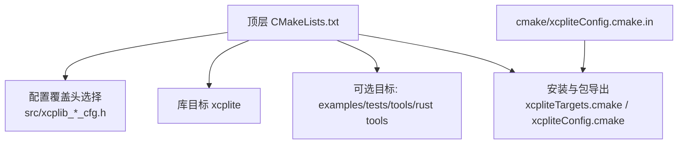
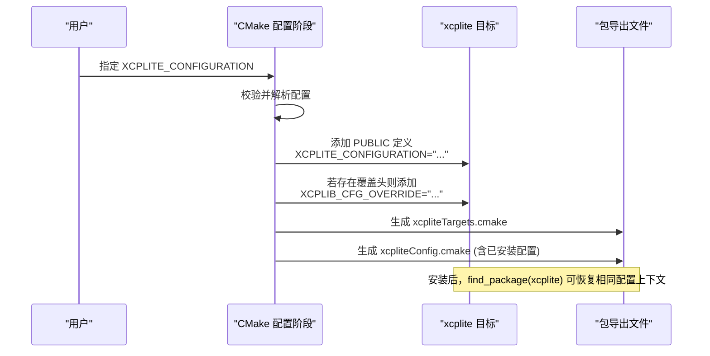
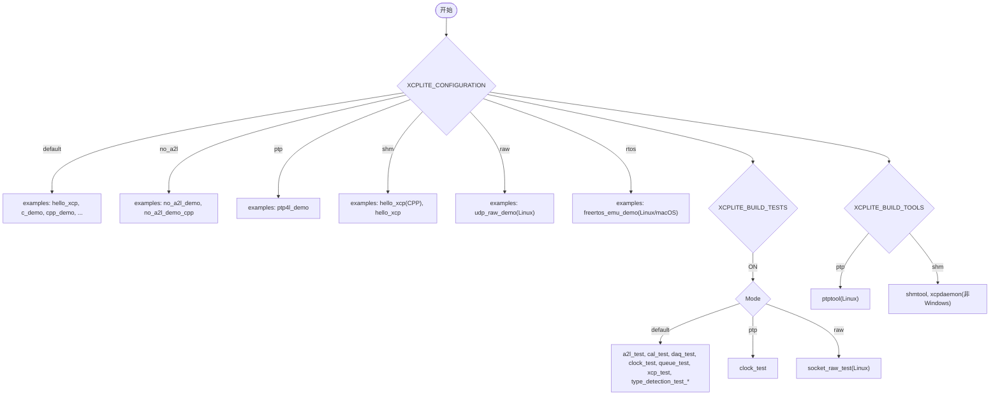
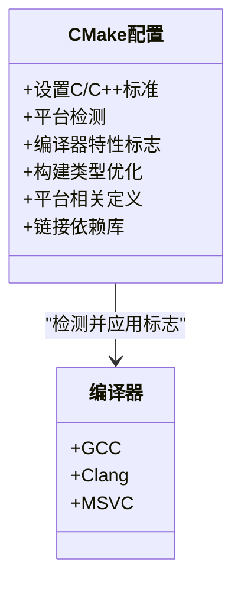
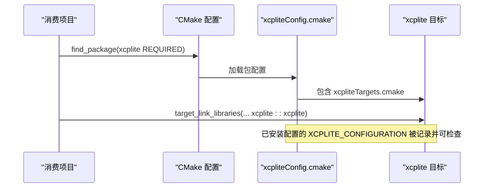
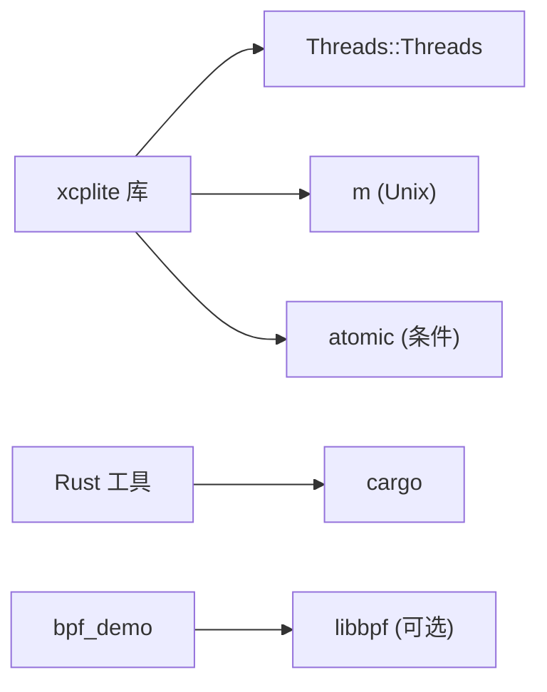

# 构建系统配置

<cite>
**本文引用的文件**
- [CMakeLists.txt](file://CMakeLists.txt)
- [xcpliteConfig.cmake.in](file://cmake/xcpliteConfig.cmake.in)
- [BUILDING.md](file://docs/BUILDING.md)
- [xcplib_cfg.h](file://src/xcplib_cfg.h)
- [xcplib_no_a2l_cfg.h](file://src/xcplib_no_a2l_cfg.h)
- [xcplib_ptp_cfg.h](file://src/xcplib_ptp_cfg.h)
- [xcplib_shm_cfg.h](file://src/xcplib_shm_cfg.h)
- [xcplib_rtos_cfg.h](file://src/xcplib_rtos_cfg.h)
- [xcplib_raw_cfg.h](file://src/xcplib_raw_cfg.h)
</cite>

## 目录
1. [简介](#简介)
2. [项目结构](#项目结构)
3. [核心组件](#核心组件)
4. [架构总览](#架构总览)
5. [详细组件分析](#详细组件分析)
6. [依赖关系分析](#依赖关系分析)
7. [性能考量](#性能考量)
8. [故障排除指南](#故障排除指南)
9. [结论](#结论)
10. [附录：完整构建命令示例](#附录完整构建命令示例)

## 简介
本文件面向使用 XCPlite 的工程师，系统化说明其 CMake 构建系统的架构与配置选项，重点覆盖：
- 六种库构建模式（XCPLITE_CONFIGURATION）：default、no_a2l、ptp、shm、rtos、raw 及其适用场景
- 构建开关：XCPLITE_BUILD_EXAMPLES、XCPLITE_BUILD_TESTS、XCPLITE_BUILD_TOOLS、XCPLITE_BUILD_RUST_TOOLS
- 交叉编译支持：GCC、Clang、MSVC 编译器设置与优化选项
- 包管理器集成：find_package 用法与 CMake 包导出机制
- 完整构建命令与常见问题排查

## 项目结构
XCPlite 采用“单根 CMake 工程 + 多配置头”的方式组织构建：
- 顶层 CMakeLists.txt 负责：
  - 选择并应用配置覆盖头（基于 XCPLITE_CONFIGURATION）
  - 定义公共编译标准、平台检测、编译器特性标志
  - 创建 xcplite 目标、链接线程/数学/原子库
  - 根据选项启用 examples/tests/tools/rust tools
  - 生成安装规则与 CMake 包导出文件
- cmake/xcpliteConfig.cmake.in 为 find_package(xcplite) 提供包配置模板
- src/xcplib_cfg.h 提供默认选项；src/xcplib_<name>_cfg.h 提供各模式的覆盖项
- docs/BUILDING.md 提供快速构建、跨平台说明与参考命令

图表来源
- [CMakeLists.txt:15-108](file://CMakeLists.txt#L15-L108)
- [CMakeLists.txt:245-311](file://CMakeLists.txt#L245-L311)
- [CMakeLists.txt:593-655](file://CMakeLists.txt#L593-L655)
- [xcpliteConfig.cmake.in:1-29](file://cmake/xcpliteConfig.cmake.in#L1-L29)

章节来源
- [CMakeLists.txt:1-108](file://CMakeLists.txt#L1-L108)
- [xcpliteConfig.cmake.in:1-29](file://cmake/xcpliteConfig.cmake.in#L1-L29)

## 核心组件
- 配置模式（XCPLITE_CONFIGURATION）
  - default：64位、目标端 A2L 生成、文件系统、以太网 UDP/TCP
  - no_a2l：关闭目标端 A2L 生成与上传，A2L 由 xcpclient 从 ELF 外部生成
  - ptp：在 default 基础上启用套接字硬件时间戳（Linux）
  - shm：共享内存多应用模式（POSIX），配合 shmtool/xcpdaemon
  - rtos：FreeRTOS 嵌入式目标，精简内存，无文件系统，绝对寻址
  - raw：裸以太网传输（UDP/IPv4 在 xcplib 内实现，无需 TCP/IP 栈，Linux）
- 构建开关
  - XCPLITE_BUILD_EXAMPLES：按当前配置启用对应示例
  - XCPLITE_BUILD_TESTS：按当前配置启用测试
  - XCPLITE_BUILD_TOOLS：按当前配置启用工具（ptp/shm）
  - XCPLITE_BUILD_RUST_TOOLS：通过 cargo 构建 Rust 工具（xcpclient、bintool）
- 应用级配置覆盖（XCPLITE_CFG_OVERRIDE）
  - 仅当 XCPLITE_CONFIGURATION=default 时可用
  - 将自定义头路径注入 include 路径，并在库中定义 XCPLIB_CFG_OVERRIDE

章节来源
- [CMakeLists.txt:15-108](file://CMakeLists.txt#L15-L108)
- [CMakeLists.txt:111-155](file://CMakeLists.txt#L111-L155)
- [BUILDING.md:11-47](file://docs/BUILDING.md#L11-L47)

## 架构总览
下图展示 CMake 如何根据配置选择覆盖头，并将编译定义传播到下游消费者。

图表来源
- [CMakeLists.txt:256-263](file://CMakeLists.txt#L256-L263)
- [CMakeLists.txt:623-649](file://CMakeLists.txt#L623-L649)
- [xcpliteConfig.cmake.in:1-29](file://cmake/xcpliteConfig.cmake.in#L1-L29)

## 详细组件分析

### 配置模式详解（XCPLITE_CONFIGURATION）
- default
  - 默认行为：64位、目标端 A2L 生成、文件系统、UDP/TCP
  - 适用：通用桌面/服务器环境开发调试
- no_a2l
  - 关闭目标端 A2L 生成与上传，A2L 由 xcpclient 从 ELF 生成
  - 适用：CI/CD 或离线 A2L 流程，减少目标端体积
- ptp
  - 启用套接字硬件时间戳（Linux），用于高精度同步
  - 适用：需要 PTP 硬件时间戳的场景（如 ptptool）
- shm
  - 共享内存多应用模式（POSIX），支持 XCP daemon
  - 适用：多进程协作、集中式 XCP 服务
- rtos
  - 面向 FreeRTOS 等嵌入式 RTOS，绝对寻址、无文件系统、精简内存
  - 适用：资源受限嵌入式设备
- raw
  - 裸以太网传输（UDP/IPv4 在 xcplib 内实现），无需 TCP/IP 栈
  - 适用：无网络栈或需极简协议栈的目标（Linux 开发/测试）

章节来源
- [CMakeLists.txt:15-66](file://CMakeLists.txt#L15-L66)
- [xcplib_no_a2l_cfg.h:1-56](file://src/xcplib_no_a2l_cfg.h#L1-L56)
- [xcplib_ptp_cfg.h:1-31](file://src/xcplib_ptp_cfg.h#L1-L31)
- [xcplib_shm_cfg.h:1-38](file://src/xcplib_shm_cfg.h#L1-L38)
- [xcplib_rtos_cfg.h:1-142](file://src/xcplib_rtos_cfg.h#L1-L142)
- [xcplib_raw_cfg.h:1-105](file://src/xcplib_raw_cfg.h#L1-L105)

### 构建开关与目标映射
- XCPLITE_BUILD_EXAMPLES
  - 依据当前配置启用不同示例（如 default/no_a2l/ptp/shm/raw/rtos）
- XCPLITE_BUILD_TESTS
  - 依据当前配置启用测试（default/ptp/raw 有特定测试）
- XCPLITE_BUILD_TOOLS
  - ptp -> ptptool；shm -> shmtool、xcpdaemon
- XCPLITE_BUILD_RUST_TOOLS
  - 通过 cargo 构建 xcpclient、bintool（任何配置均可）

图表来源
- [CMakeLists.txt:318-423](file://CMakeLists.txt#L318-L423)
- [CMakeLists.txt:430-502](file://CMakeLists.txt#L430-L502)
- [CMakeLists.txt:509-553](file://CMakeLists.txt#L509-L553)

章节来源
- [CMakeLists.txt:111-155](file://CMakeLists.txt#L111-L155)
- [CMakeLists.txt:318-553](file://CMakeLists.txt#L318-L553)

### 交叉编译与编译器设置
- 标准与扩展
  - C11；C++ 在非 Windows 为 C++17，Windows 为 C++20
- 平台检测
  - 自动识别 Linux/Windows/macOS，并输出日志
- 编译器特性
  - GCC/Clang：启用 pedantic、Wall 警告
  - MSVC：启用 /W3 警告
- 构建类型优化
  - Release：-O2/-DNDEBUG（GCC/Clang），/O2 /Zi /DNDEBUG（MSVC）
  - RelWithDebInfo：-O1 -g -DNDEBUG（GCC/Clang），/O2 /Zi /Oy- /DNDEBUG（MSVC）
  - Debug：-O0 -g（GCC/Clang），/Od /Zi（MSVC）
- 平台相关定义
  - Linux：PUBLIC 定义 _GNU_SOURCE
  - Windows：PRIVATE 定义 _CRT_SECURE_NO_WARNINGS
- 依赖库
  - Threads::Threads（必需）
  - m（Unix/Linux/macOS）
  - atomic（某些 ARM Clang 平台）

图表来源
- [CMakeLists.txt:172-243](file://CMakeLists.txt#L172-L243)
- [CMakeLists.txt:286-311](file://CMakeLists.txt#L286-L311)

章节来源
- [CMakeLists.txt:172-243](file://CMakeLists.txt#L172-L243)
- [CMakeLists.txt:286-311](file://CMakeLists.txt#L286-L311)

### 包管理器集成（find_package 与导出）
- 安装产物
  - 库与头文件
  - CMake 包配置：xcpliteTargets.cmake、xcpliteConfig.cmake、版本文件
- 消费方式
  - find_package(xcplite REQUIRED)
  - target_link_libraries(your_target PRIVATE xcplite::xcplite)
- 配置一致性
  - 安装后的包配置会记录已安装的 XCPLITE_CONFIGURATION，供消费者校验兼容性
- FetchContent
  - 可在不安装的情况下直接作为子项目引入，保持与 find_package 一致的接口

图表来源
- [CMakeLists.txt:593-655](file://CMakeLists.txt#L593-L655)
- [xcpliteConfig.cmake.in:1-29](file://cmake/xcpliteConfig.cmake.in#L1-L29)
- [BUILDING.md:295-341](file://docs/BUILDING.md#L295-L341)

章节来源
- [CMakeLists.txt:593-655](file://CMakeLists.txt#L593-L655)
- [xcpliteConfig.cmake.in:1-29](file://cmake/xcpliteConfig.cmake.in#L1-L29)
- [BUILDING.md:295-341](file://docs/BUILDING.md#L295-L341)

## 依赖关系分析
- 内部依赖
  - 线程库（Threads::Threads）
  - 数学库（Unix/Linux/macOS）
  - 原子库（部分 ARM Clang 平台）
- 外部依赖
  - Rust 工具链（cargo）用于构建 xcpclient/bintool
  - libbpf（可选，用于 bpf_demo）
  - 特定平台能力（PTP 硬件时间戳、AF_PACKET 权限等）

图表来源
- [CMakeLists.txt:157-162](file://CMakeLists.txt#L157-L162)
- [CMakeLists.txt:297-311](file://CMakeLists.txt#L297-L311)
- [CMakeLists.txt:348-359](file://CMakeLists.txt#L348-L359)
- [CMakeLists.txt:555-586](file://CMakeLists.txt#L555-L586)

章节来源
- [CMakeLists.txt:157-162](file://CMakeLists.txt#L157-L162)
- [CMakeLists.txt:297-311](file://CMakeLists.txt#L297-L311)
- [CMakeLists.txt:348-359](file://CMakeLists.txt#L348-L359)
- [CMakeLists.txt:555-586](file://CMakeLists.txt#L555-L586)

## 性能考量
- 队列策略
  - 64位平台默认使用无锁可变长度队列（queue64v.c）
  - 32位或启用原子模拟时使用互斥队列（queue32.c）
- 优化级别
  - Release 使用 -O2 或 /O2，RelWithDebInfo 使用 -O1 或 /O2+调试信息
- 平台差异
  - Windows 上原子操作为模拟实现，发送队列生产者侧始终使用互斥
- 内存与 MTU
  - 嵌入式/RTOS 模式降低内存占用与 MTU，避免分片
  - raw 模式限制最大 UDP 载荷以适配帧大小

章节来源
- [xcplib_cfg.h:143-162](file://src/xcplib_cfg.h#L143-L162)
- [CMakeLists.txt:218-243](file://CMakeLists.txt#L218-L243)
- [xcplib_rtos_cfg.h:86-135](file://src/xcplib_rtos_cfg.h#L86-L135)
- [xcplib_raw_cfg.h:46-70](file://src/xcplib_raw_cfg.h#L46-L70)

## 故障排除指南
- 常见编译问题
  - 缺少 C11/C++17/20 支持：确保编译器版本满足要求
  - 64位原子库缺失：某些 ARM Clang 平台需链接 atomic（已自动检测）
  - 切换编译器需清理旧构建目录（CMakeCache 缓存编译器）
- 平台能力不足
  - PTP 模式需要 Linux 且网卡支持硬件时间戳
  - raw 模式需要 CAP_NET_RAW（AF_PACKET）
- 配置冲突
  - 每种配置必须使用独立构建目录，避免混用
  - XCPLITE_CFG_OVERRIDE 仅在 default 模式下有效
- 工具链缺失
  - Rust 工具需要 cargo；bpf_demo 需要 libbpf

章节来源
- [BUILDING.md:364-393](file://docs/BUILDING.md#L364-L393)
- [CMakeLists.txt:47-51](file://CMakeLists.txt#L47-L51)
- [CMakeLists.txt:348-359](file://CMakeLists.txt#L348-L359)
- [CMakeLists.txt:555-586](file://CMakeLists.txt#L555-L586)

## 结论
XCPlite 通过“配置覆盖头 + CMake 选项”的组合，提供了灵活、可移植的构建体系。开发者可按目标平台与应用需求选择合适的配置模式，并通过统一的 find_package 接口集成到上层项目。合理的构建选项与编译器设置能显著提升性能与可维护性。

## 附录：完整构建命令示例
以下命令均来源于官方文档与顶层 CMake 脚本，可直接复制使用：

- 基础构建（默认配置，仅库）
  - cmake -B build -S . -DCMAKE_BUILD_TYPE=Debug
  - cmake --build build --parallel
- 构建示例/测试/工具
  - cmake -B build -S . -DCMAKE_BUILD_TYPE=Debug -DXCPLITE_BUILD_EXAMPLES=ON
  - cmake -B build -S . -DCMAKE_BUILD_TYPE=Debug -DXCPLITE_BUILD_TESTS=ON
  - cmake -B build-ptp -S . -DXCPLITE_CONFIGURATION=ptp -DXCPLITE_BUILD_TOOLS=ON -DXCPLITE_BUILD_TESTS=ON
  - cmake -B build-shm -S . -DXCPLITE_CONFIGURATION=shm -DXCPLITE_BUILD_TOOLS=ON
  - cmake -B build-no_a2l -S . -DXCPLITE_CONFIGURATION=no_a2l -DXCPLITE_BUILD_EXAMPLES=ON
  - cmake -B build-rtos -S . -DXCPLITE_CONFIGURATION=rtos -DXCPLITE_BUILD_EXAMPLES=ON
  - cmake -B build-raw -S . -DXCPLITE_CONFIGURATION=raw -DXCPLITE_BUILD_EXAMPLES=ON
- 安装与使用
  - cmake --install build
  - 消费项目：find_package(xcplite REQUIRED) 并链接 xcplite::xcplite
- Rust 工具
  - cmake -B build -S . -DXCPLITE_BUILD_RUST_TOOLS=ON
  - 或使用构建脚本：./build.sh rust_tools 与 ./build.sh rust_tools cargo_install

章节来源
- [BUILDING.md:85-218](file://docs/BUILDING.md#L85-L218)
- [BUILDING.md:267-341](file://docs/BUILDING.md#L267-L341)
- [CMakeLists.txt:111-155](file://CMakeLists.txt#L111-L155)
- [CMakeLists.txt:555-586](file://CMakeLists.txt#L555-L586)