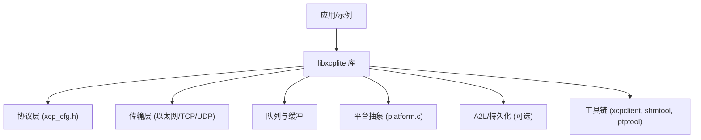
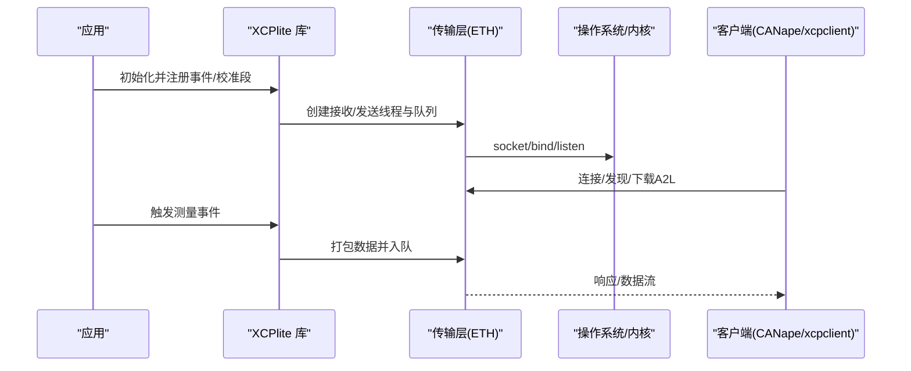
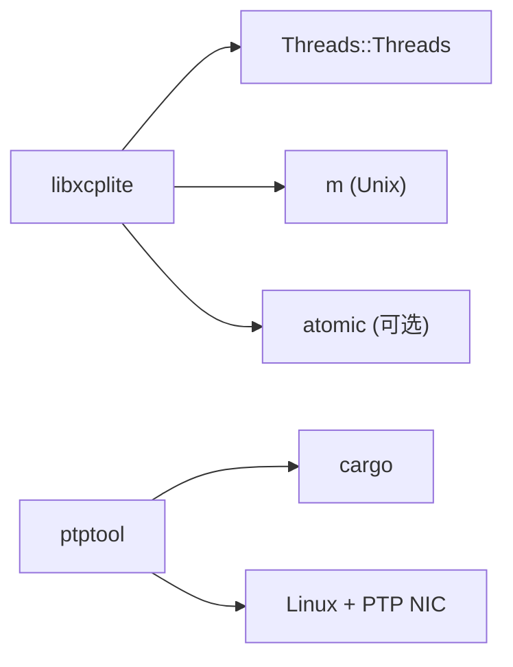

# 生产环境优化

<cite>
**本文引用的文件**
- [README.md](file://README.md)
- [CMakeLists.txt](file://CMakeLists.txt)
- [docs/TECHNICAL.md](file://docs/TECHNICAL.md)
- [docs/BUILDING.md](file://docs/BUILDING.md)
- [src/xcplib_cfg.h](file://src/xcplib_cfg.h)
- [src/xcp_cfg.h](file://src/xcp_cfg.h)
- [src/xcplib_rtos_cfg.h](file://src/xcplib_rtos_cfg.h)
- [src/xcplib_shm_cfg.h](file://src/xcplib_shm_cfg.h)
- [src/xcplib_no_a2l_cfg.h](file://src/xcplib_no_a2l_cfg.h)
- [src/platform.c](file://src/platform.c)
- [src/util.c](file://src/util.c)
</cite>

## 目录
1. [简介](#简介)
2. [项目结构](#项目结构)
3. [核心组件](#核心组件)
4. [架构总览](#架构总览)
5. [详细组件分析](#详细组件分析)
6. [依赖关系分析](#依赖关系分析)
7. [性能与资源优化](#性能与资源优化)
8. [监控与日志](#监控与日志)
9. [安全加固](#安全加固)
10. [故障恢复与高可用](#故障恢复与高可用)
11. [部署最佳实践](#部署最佳实践)
12. [结论](#结论)

## 简介
本指南面向运维工程师，提供XCPlite在生产环境的完整部署与优化方案。内容覆盖内存使用优化、性能调参、资源限制、不同部署场景（服务器端、嵌入式设备、实时系统）的最佳实践，以及监控日志、安全加固、故障恢复和高可用配置。XCPlite基于XCP on Ethernet传输层，支持Linux/QNX/FreeRTOS等POSIX或RTOS平台，强调无锁、可预测的运行时行为与低资源占用。

## 项目结构
- 构建系统与配置：通过CMake选择不同“配置”（default/no_a2l/ptp/shm/rtos/raw），每种配置启用不同的特性集与默认参数。
- 库源码：协议层、传输层、队列、共享内存、A2L生成、持久化、平台抽象等。
- 示例与工具：多语言示例、PTP工具、共享内存工具、xcpclient等。
- 文档：技术细节、构建说明、离线A2L生成等。

图表来源
- [CMakeLists.txt:15-35](file://CMakeLists.txt#L15-L35)
- [src/xcp_cfg.h:17-35](file://src/xcp_cfg.h#L17-L35)
- [src/platform.c:1-20](file://src/platform.c#L1-L20)

章节来源
- [CMakeLists.txt:15-35](file://CMakeLists.txt#L15-L35)
- [docs/BUILDING.md:11-24](file://docs/BUILDING.md#L11-L24)

## 核心组件
- 配置体系：xcplib_cfg.h定义全局选项；xcp_cfg.h定义协议层参数；各配置覆盖头（rtos/shm/no_a2l/ptp/raw）在编译期裁剪功能。
- 传输层：以太网TCP/UDP，支持MTU、Jumbo Frames（路径允许时）、多播（可选）。
- 队列与缓冲：可变/固定条目大小的无锁队列，按平台选择实现。
- 平台抽象：线程、互斥、时钟、睡眠、共享内存、原子操作等。
- A2L与持久化：目标端生成A2L、ELF上传、校准段持久化（可选）。
- 工具链：xcpclient用于离线A2L生成与测试；shmtool/xcpdaemon用于共享内存模式；ptptool用于硬件时间戳。

章节来源
- [src/xcplib_cfg.h:41-170](file://src/xcplib_cfg.h#L41-L170)
- [src/xcp_cfg.h:84-177](file://src/xcp_cfg.h#L84-L177)
- [docs/TECHNICAL.md:5-25](file://docs/TECHNICAL.md#L5-L25)

## 架构总览
XCPlite以“配置驱动”的方式在不同平台上提供一致的XCP服务。生产环境通常采用以下组合：
- 服务器端（Linux/QNX）：default或no_a2l配置，开启A2L生成/上传或离线A2L，合理设置队列大小与DAQ内存。
- 嵌入式（FreeRTOS）：rtos配置，关闭文件系统相关能力，使用绝对寻址，降低内存占用。
- 多进程共享：shm配置，使用共享内存协调多个应用与XCP服务端。
- 高精度时间：ptp配置，结合ptptool与硬件时间戳。

图表来源
- [src/platform.c:434-655](file://src/platform.c#L434-L655)
- [src/xcplib_cfg.h:73-170](file://src/xcplib_cfg.h#L73-L170)
- [src/xcp_cfg.h:293-390](file://src/xcp_cfg.h#L293-L390)

## 详细组件分析

### 配置与构建
- 构建配置：通过XCPLITE_CONFIGURATION选择default/no_a2l/ptp/shm/rtos/raw，每个配置对应不同的功能开关与默认值。
- 应用覆盖：可通过XCPLITE_CFG_OVERRIDE引入自定义覆盖头，在不修改库源码的情况下调整OPTION_*。
- 关键选项：
  - 日志级别与输出：OPTION_ENABLE_DBG_PRINTS/OPTION_DEFAULT_DBG_LEVEL/OPTION_FIXED_DBG_LEVEL。
  - 时钟：OPTION_CLOCK_EPOCH_ARB或OPTION_CLOCK_EPOCH_PTP，分辨率1ns或1us。
  - 传输：OPTION_ENABLE_TCP/UDP，MTU，强制终止选项。
  - 校准段：数量、总内存、是否绝对寻址、是否持久化、EPK段。
  - DAQ：事件列表、事件数、DAQ表内存、队列类型。
  - A2L：目标端生成/上传、ELF上传。

章节来源
- [CMakeLists.txt:15-35](file://CMakeLists.txt#L15-L35)
- [docs/BUILDING.md:11-24](file://docs/BUILDING.md#L11-L24)
- [src/xcplib_cfg.h:41-170](file://src/xcplib_cfg.h#L41-L170)
- [src/xcp_cfg.h:84-177](file://src/xcp_cfg.h#L84-L177)

### 内存与队列
- 静态内存：DAQ表、校准段页等。
- 堆内存：传输层队列（malloc/aligned_alloc），DAQ表内存，校准段页内存（默认4份拷贝）。
- 栈内存：每线程约1KB（收发线程）。
- 队列选择：64位无锁可变/固定条目，或32位有锁队列（Windows/32位平台）。

优化建议：
- 根据预期流量峰值设置队列大小，至少覆盖10ms流量。
- 调整XA_MAX_DTO_SIZE与队列条目大小，平衡内存效率与吞吐。
- 在嵌入式环境使用固定条目队列以减少碎片。

章节来源
- [docs/TECHNICAL.md:5-25](file://docs/TECHNICAL.md#L5-L25)
- [src/xcplib_cfg.h:120-170](file://src/xcplib_cfg.h#L120-L170)
- [src/xcp_cfg.h:360-390](file://src/xcp_cfg.h#L360-L390)

### 时钟与时间戳
- 时钟源：POSIX下可选择CLOCK_MONOTONIC_RAW或CLOCK_REALTIME（PTP epoch），FreeRTOS使用tick计数。
- 分辨率：1ns或1us，需确保CLOCK_TICKS_PER_S满足范围要求。
- PTP支持：可启用GET_DAQ_CLOCK_MULTICAST（不推荐默认），或通过ptptool配合硬件时间戳。

章节来源
- [src/platform.c:434-655](file://src/platform.c#L434-L655)
- [src/xcplib_cfg.h:56-69](file://src/xcplib_cfg.h#L56-L69)
- [src/xcp_cfg.h:408-449](file://src/xcp_cfg.h#L408-L449)

### 校准段与持久化
- 校准段管理：支持RCU懒写、页面切换、冻结命令、断开自动持久化（可选）。
- EPK段：用于校验HEX/BIN兼容性，避免版本错配导致的数据不一致。
- 绝对寻址：在no_a2l/rtos配置中常启用，便于工具兼容。

章节来源
- [src/xcp_cfg.h:293-335](file://src/xcp_cfg.h#L293-L335)
- [src/xcplib_no_a2l_cfg.h:32-56](file://src/xcplib_no_a2l_cfg.h#L32-L56)
- [src/xcplib_rtos_cfg.h:90-112](file://src/xcplib_rtos_cfg.h#L90-L112)

### 共享内存模式
- 多应用共享：通过shm配置启用共享内存，协调XCP服务端与多个应用进程。
- 领导者选举：首个进程成为leader，负责创建/初始化共享区域；follower附加到已有区域。
- 清理与恢复：当SHM尺寸不匹配或为0时，提示手动清理或安全回收。

章节来源
- [src/xcplib_shm_cfg.h:1-38](file://src/xcplib_shm_cfg.h#L1-L38)
- [src/platform.c:161-363](file://src/platform.c#L161-L363)

## 依赖关系分析
- 构建期依赖：Threads、math（Unix）、atomic（部分平台）。
- 运行期依赖：POSIX线程、时钟、socket、文件I/O（A2L/持久化）。
- 工具链依赖：Rust工具（cargo）、ptptool（Linux+PTP网卡）、bpf_demo（libbpf）。

图表来源
- [CMakeLists.txt:156-311](file://CMakeLists.txt#L156-L311)
- [CMakeLists.txt:555-586](file://CMakeLists.txt#L555-L586)

章节来源
- [CMakeLists.txt:156-311](file://CMakeLists.txt#L156-L311)
- [CMakeLists.txt:555-586](file://CMakeLists.txt#L555-L586)

## 性能与资源优化

### 服务器端（Linux/QNX）
- 队列与缓冲：
  - 使用64位无锁队列（可变/固定条目），根据峰值流量设置队列大小，确保覆盖至少10ms流量。
  - 调整XCPTL_MAX_DTO_SIZE与队列条目大小，使整体队列大小为缓存行倍数以提升性能。
- 内存：
  - 合理设置OPTION_DAQ_MEM_SIZE与OPTION_CAL_MEM_SIZE，避免过大浪费或过小拥塞。
  - 若不需要目标端A2L生成，使用no_a2l配置减少内存与I/O开销。
- 时钟：
  - 使用CLOCK_MONOTONIC_RAW以获得稳定单调时间；如需PTP同步，启用ptp配置并结合ptptool。
- 网络：
  - MTU设置为1500或根据路径MTU启用Jumbo Frames；必要时启用多播（谨慎评估）。

章节来源
- [docs/TECHNICAL.md:5-25](file://docs/TECHNICAL.md#L5-L25)
- [src/xcplib_cfg.h:73-170](file://src/xcplib_cfg.h#L73-L170)
- [src/xcp_cfg.h:360-390](file://src/xcp_cfg.h#L360-L390)

### 嵌入式设备（FreeRTOS）
- 功能裁剪：
  - 关闭文件系统相关能力（A2L生成/上传、持久化），使用绝对寻址提高工具兼容性。
  - 使用32位队列与临界区替代互斥，降低开销。
- 内存与栈：
  - 设置合适的FREERTOS_STACK_BYTES与优先级，确保收发任务栈空间充足。
  - 限制校准段数量与总内存，适配SRAM限制。
- 时钟：
  - 使用1us分辨率，配置CLOCK_TICKS_PER_S与实际DAQ时钟一致。

章节来源
- [src/xcplib_rtos_cfg.h:44-142](file://src/xcplib_rtos_cfg.h#L44-L142)

### 实时系统（高精度时间）
- 启用ptp配置，结合ptptool与硬件时间戳，提升时间同步精度。
- 谨慎启用多播命令，避免网络风暴。

章节来源
- [CMakeLists.txt:511-529](file://CMakeLists.txt#L511-L529)
- [src/xcp_cfg.h:436-449](file://src/xcp_cfg.h#L436-L449)

## 监控与日志

### 日志级别与输出
- 控制宏：OPTION_ENABLE_DBG_PRINTS、OPTION_DEFAULT_DBG_LEVEL、OPTION_FIXED_DBG_LEVEL。
- 输出目标：可定向至stderr（OPTION_ENABLE_DBG_STDERR）或标准输出。
- 生产建议：
  - 将默认日志级别设为Info或Warn，禁用Trace/Debug以降低开销。
  - 固定日志级别以避免运行时动态切换带来的不确定性。

章节来源
- [src/xcplib_cfg.h:41-54](file://src/xcplib_cfg.h#L41-L54)
- [src/dbg_print.h:87-133](file://src/dbg_print.h#L87-L133)

### 性能指标收集
- 时钟统计：可启用TEST_CLOCK_GET_STATISTIC统计clockGet调用次数（仅调试）。
- 队列指标：可启用TEST_ENABLE_BUFFERCOUNT_HISTOGRAM统计缓冲区使用分布（仅调试）。
- 建议：
  - 在生产环境中关闭这些统计，避免性能影响。
  - 通过外部监控（如系统指标、网络计数器）结合应用侧日志进行观测。

章节来源
- [src/xcplib_cfg.h:176-189](file://src/xcplib_cfg.h#L176-L189)
- [src/platform.c:445-453](file://src/platform.c#L445-L453)

### 错误追踪
- 错误与警告：通过DBG_PRINTF_ERROR/DBG_PRINTF_WARNING输出，包含上下文信息。
- 建议：
  - 在生产环境保留Error/Warning级别日志，便于问题定位。
  - 结合系统日志（如syslog）集中收集与分析。

章节来源
- [src/dbg_print.h:99-133](file://src/dbg_print.h#L99-L133)

## 安全加固

### 访问控制
- 网络层：
  - 绑定到特定接口或地址，限制监听端口。
  - 使用防火墙规则限制访问来源IP。
- 认证与授权：
  - 当前库未内置认证机制，建议在应用层实现基于令牌或证书的访问控制。
  - 对敏感操作（如校准写入）增加二次确认或审计日志。

章节来源
- [src/platform.c:193-363](file://src/platform.c#L193-L363)
- [src/xcp_cfg.h:342-359](file://src/xcp_cfg.h#L342-L359)

### 数据保护
- 传输加密：
  - 可在应用层封装TLS或使用IPsec保护XCP over Ethernet流量。
- 完整性校验：
  - 启用XCP校验和命令（CRC16CCITT），确保数据传输完整性。
- 持久化安全：
  - 对校准段持久化文件设置权限，防止未授权访问。

章节来源
- [src/xcp_cfg.h:337-341](file://src/xcp_cfg.h#L337-L341)
- [src/platform.c:201-319](file://src/platform.c#L201-L319)

## 故障恢复与高可用

### 共享内存模式恢复
- 领导者崩溃检测：
  - 当共享内存尺寸为0时，新进程可安全回收并重新初始化。
  - 尺寸不匹配时提示手动清理，避免静默损坏。
- 非领导者恢复：
  - 附加到现有共享内存，验证尺寸后继续工作。

章节来源
- [src/platform.c:201-319](file://src/platform.c#L201-L319)

### 服务重启与状态保持
- 校准段持久化：
  - 启用持久化后，重启时可加载上次工作页数据，保持校准状态。
  - 使用EPK段校验兼容性，避免版本错配。
- A2L稳定性：
  - 使用离线A2L生成（no_a2l配置）确保A2L文件稳定，减少启动时动态生成开销。

章节来源
- [src/xcp_cfg.h:325-335](file://src/xcp_cfg.h#L325-L335)
- [src/xcplib_no_a2l_cfg.h:32-56](file://src/xcplib_no_a2l_cfg.h#L32-L56)

### 高可用策略
- 多实例部署：
  - 使用共享内存模式协调多个XCP服务端实例，实现负载均衡与故障转移。
- 健康检查：
  - 通过心跳或状态查询接口监控服务健康，异常时自动切换。

章节来源
- [src/xcplib_shm_cfg.h:1-38](file://src/xcplib_shm_cfg.h#L1-L38)

## 部署最佳实践

### 服务器端（Linux/QNX）
- 构建配置：
  - 使用default或no_a2l配置，根据需求选择目标端A2L生成或离线A2L。
- 资源限制：
  - 设置队列大小与DAQ内存，避免过高内存占用。
  - 限制线程数与优先级，确保关键任务优先。
- 监控与日志：
  - 启用Info/Warning日志，禁用Verbose级别。
  - 集成系统监控（CPU、内存、网络）与日志收集。

章节来源
- [CMakeLists.txt:15-35](file://CMakeLists.txt#L15-L35)
- [src/xcplib_cfg.h:41-170](file://src/xcplib_cfg.h#L41-L170)

### 嵌入式设备（FreeRTOS）
- 构建配置：
  - 使用rtos配置，关闭文件系统相关能力，使用绝对寻址。
- 资源优化：
  - 调整栈大小与队列大小，确保在有限SRAM内稳定运行。
  - 使用固定条目队列减少内存碎片。
- 时钟与同步：
  - 配置CLOCK_TICKS_PER_S与实际时钟一致，确保时间戳准确性。

章节来源
- [src/xcplib_rtos_cfg.h:44-142](file://src/xcplib_rtos_cfg.h#L44-L142)

### 实时系统（高精度时间）
- 构建配置：
  - 使用ptp配置，结合ptptool与硬件时间戳。
- 网络配置：
  - 确保PTP网卡与网络拓扑支持高精度同步。
  - 谨慎启用多播命令，避免网络风暴。

章节来源
- [CMakeLists.txt:511-529](file://CMakeLists.txt#L511-L529)
- [src/xcp_cfg.h:436-449](file://src/xcp_cfg.h#L436-L449)

## 结论
XCPlite通过灵活的配置体系与高性能实现，适用于多种生产环境。通过合理设置内存、队列、时钟与网络参数，结合监控日志与安全加固，可实现稳定高效的XCP数据采集与校准。针对不同部署场景（服务器端、嵌入式、实时系统），应选择合适的配置与优化策略，确保性能与可靠性达到预期。