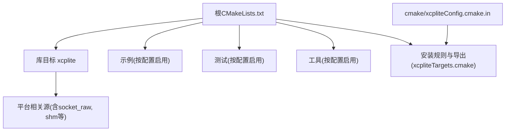
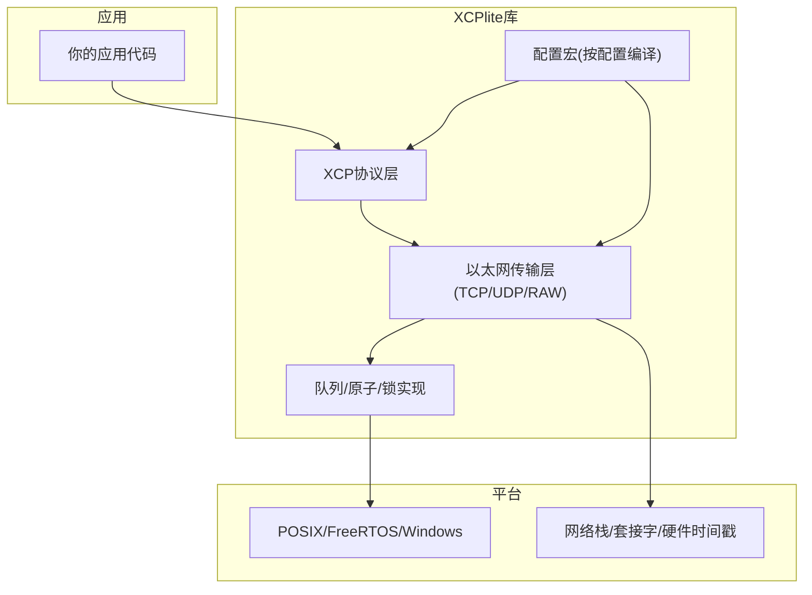
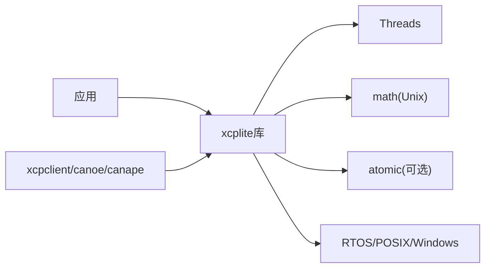

# 部署和集成

<cite>
**本文引用的文件**
- [CMakeLists.txt](file://CMakeLists.txt)
- [xcpliteConfig.cmake.in](file://cmake/xcpliteConfig.cmake.in)
- [BUILDING.md](file://docs/BUILDING.md)
- [README.md](file://README.md)
- [xcplib_cfg.h](file://src/xcplib_cfg.h)
- [xcplib_rtos_cfg.h](file://src/xcplib_rtos_cfg.h)
- [xcplib_shm_cfg.h](file://src/xcplib_shm_cfg.h)
- [freertos_demo README.md](file://examples/freertos_demo/README.md)
- [hello_xcp README.md](file://examples/hello_xcp/README.md)
- [xcpdaemon.service](file://tools/xcpdaemon/xcpdaemon.service)
</cite>

## 目录
1. [简介](#简介)
2. [项目结构](#项目结构)
3. [核心组件](#核心组件)
4. [架构总览](#架构总览)
5. [详细组件分析](#详细组件分析)
6. [依赖关系分析](#依赖关系分析)
7. [性能与优化建议](#性能与优化建议)
8. [故障排查指南](#故障排查指南)
9. [结论](#结论)
10. [附录：平台与工具集成要点](#附录平台与工具集成要点)

## 简介
本指南面向系统集成工程师，提供XCPlite在Linux、QNX、Windows以及FreeRTOS嵌入式环境下的完整部署与集成方案。内容涵盖CMake构建系统配置选项、交叉编译支持、包管理器集成（find_package/FetchContent）、ASAM工具（CANape/CANoe）项目设置、容器化最佳实践与生产优化建议。

## 项目结构
XCPlite采用CMake作为统一构建系统，通过“互斥的构建配置”将不同特性编译进库中；每个配置对应不同的功能集与目标平台能力。根级CMakeLists负责库、示例、测试、工具的安装与导出；cmake模板用于生成可被外部项目find_package使用的包配置。

图表来源
- [CMakeLists.txt:1-656](file://CMakeLists.txt#L1-L656)
- [xcpliteConfig.cmake.in:1-29](file://cmake/xcpliteConfig.cmake.in#L1-L29)

章节来源
- [CMakeLists.txt:1-656](file://CMakeLists.txt#L1-L656)
- [xcpliteConfig.cmake.in:1-29](file://cmake/xcpliteConfig.cmake.in#L1-L29)

## 核心组件
- 构建配置与选项
  - 通过XCPLITE_CONFIGURATION选择互斥配置：default、no_a2l、ptp、shm、rtos、raw。
  - 通过XCPLITE_BUILD_*控制是否构建示例、测试、工具、Rust工具、BPF演示等。
  - 应用级覆盖头XCPLITE_CFG_OVERRIDE仅在default配置下生效，用于在不修改源码的情况下定制宏开关。
- 平台与编译器
  - 自动检测并设置C/C++标准；为GNU/Clang/MSVC分别设置警告与发布/调试优化策略。
  - 链接Threads与math库；在部分ARM平台自动链接atomic。
- 安装与导出
  - 安装库、公共头、平台头、传输层接口头；生成并安装CMake包配置文件，供外部项目find_package使用。
  - 当作为子项目或FetchContent使用时，默认不安装，避免污染宿主工程。

章节来源
- [CMakeLists.txt:15-108](file://CMakeLists.txt#L15-L108)
- [CMakeLists.txt:111-186](file://CMakeLists.txt#L111-L186)
- [CMakeLists.txt:188-311](file://CMakeLists.txt#L188-L311)
- [CMakeLists.txt:588-656](file://CMakeLists.txt#L588-L656)
- [xcpliteConfig.cmake.in:1-29](file://cmake/xcpliteConfig.cmake.in#L1-L29)

## 架构总览
XCPlite以libxcplite为核心，提供XCP协议栈与以太网传输层，支持多种运行模式（默认、无A2L、PTP时间戳、共享内存多进程、RTOS、原始以太网）。上层应用通过API注册测量事件与校准段，运行时由服务器线程收发数据；工具链（如xcpclient、CANape）通过A2L描述进行离线或在线工作流。

图表来源
- [CMakeLists.txt:245-311](file://CMakeLists.txt#L245-L311)
- [xcplib_cfg.h:36-168](file://src/xcplib_cfg.h#L36-L168)

## 详细组件分析

### CMake构建系统与配置选项
- 互斥配置
  - default：64位、目标端A2L生成、文件系统、以太网UDP/TCP。
  - no_a2l：禁用目标端A2L，A2L由xcpclient从ELF离线生成。
  - ptp：启用套接字硬件时间戳（Linux + PTP网卡）。
  - shm：共享内存多应用模式（需POSIX，不支持Windows）。
  - rtos：FreeRTOS嵌入式目标，减小占用，无文件系统。
  - raw：原始以太网传输（Linux，AF_PACKET），无需TCP/IP栈。
- 构建选项
  - XCPLITE_BUILD_EXAMPLES / TESTS / TOOLS / RUST_TOOLS / BPF_DEMO / INSTALL。
  - 各配置下可用目标不同，详见文档表格。
- 应用覆盖头
  - 仅default配置允许XCPLITE_CFG_OVERRIDE指向自定义头，最终通过PUBLIC用法要求暴露给消费者。

章节来源
- [CMakeLists.txt:15-108](file://CMakeLists.txt#L15-L108)
- [CMakeLists.txt:111-155](file://CMakeLists.txt#L111-L155)
- [BUILDING.md:11-47](file://docs/BUILDING.md#L11-L47)

### 交叉编译与平台支持
- Linux/macOS/QNX/Windows
  - Windows：使用MSVC，原子操作模拟，发送队列使用互斥；性能较POSIX有折损。
  - QNX：需要QNX SDP；CPP目标在旧版本受限；支持x86_64/aarch64le。
  - POSIX：默认启用G_NU_SOURCE；链接m库；可选atomic。
- 编译器与标准
  - C11；非Windows用C++17，Windows用C++20。
  - 针对GNU/Clang/MSVC设置不同优化与调试符号策略。

章节来源
- [CMakeLists.txt:172-243](file://CMakeLists.txt#L172-L243)
- [BUILDING.md:220-255](file://docs/BUILDING.md#L220-L255)

### 包管理器与集成方式
- find_package
  - 安装后，外部工程通过find_package(xcplite REQUIRED)获取xcplite::xcplite目标。
  - 包配置记录已安装的XCPLITE_CONFIGURATION，便于兼容性检查。
- FetchContent
  - 在消费工程configure阶段拉取源码并作为子目录构建，无需先安装。
  - 可在MakeAvailable前设置XCPLITE_CONFIGURATION与构建选项。
- 独立示例
  - external_example展示如何链接已安装库；silkit_demo需SilKit与已安装xcplite。

章节来源
- [BUILDING.md:267-362](file://docs/BUILDING.md#L267-L362)
- [xcpliteConfig.cmake.in:1-29](file://cmake/xcpliteConfig.cmake.in#L1-L29)

### ASAM工具集成（CANape/CANoe）
- 示例工程自带CANape项目与A2L，支持自动上传A2L与XCP UDP连接。
- 高级特性（TYPEDEF、相对寻址、共享轴）需要CANape 24+。
- 无A2L工作流：使用xcpclient从ELF离线生成A2L，适合嵌入式或无文件系统场景。

章节来源
- [README.md:38-50](file://README.md#L38-L50)
- [hello_xcp README.md:52-58](file://examples/hello_xcp/README.md#L52-L58)
- [freertos_demo README.md:79-98](file://examples/freertos_demo/README.md#L79-L98)

### 嵌入式FreeRTOS部署与移植
- 配置覆盖
  - 使用xcplib_rtos_cfg.h覆盖默认配置：关闭TCP、限制MTU、禁用持久化/A2L生成、使用32位队列、1us时钟分辨率等。
- 关键步骤
  - 定义_FREE_RTOS与XCPLIB_CFG_OVERRIDE="xcplib_rtos_cfg.h"。
  - 提供FreeRTOSConfig.h；实现sockets.c中的lwIP套接字接口；必要时替换clock实现。
  - 初始化XcpInit/XcpEthServerInit，创建任务并在任务内触发事件与访问校准段。
- 内存与栈
  - 静态队列缓冲大小由OPTION_QUEUE_32_SEGMENT_COUNT决定；RX/TX任务栈可按需调优。
  - 校准段与DAQ表内存按需调整，避免SRAM不足。

章节来源
- [xcplib_rtos_cfg.h:1-142](file://src/xcplib_rtos_cfg.h#L1-L142)
- [freertos_demo README.md:193-253](file://examples/freertos_demo/README.md#L193-L253)
- [freertos_demo README.md:305-423](file://examples/freertos_demo/README.md#L305-L423)

### 共享内存多应用模式（SHM）
- 启用xcplib_shm_cfg.h以开启共享内存模式，允许多进程共享队列、校准RCU与XCP状态。
- 工具：shmtool、xcpdaemon（POSIX平台，Windows不支持）。
- 典型用法：一个进程作为XCP服务端（leader或守护进程），其他应用写入共享数据。

章节来源
- [xcplib_shm_cfg.h:1-38](file://src/xcplib_shm_cfg.h#L1-L38)
- [CMakeLists.txt:531-547](file://CMakeLists.txt#L531-L547)

### 原始以太网传输（RAW）
- 在Linux上通过AF_PACKET直接构造UDP/IPv4帧，绕过TCP/IP栈，适用于特定网络环境或特权场景。
- 需要CAP_NET_RAW权限；示例udp_raw_demo仅Linux可用。

章节来源
- [CMakeLists.txt:396-407](file://CMakeLists.txt#L396-L407)
- [BUILDING.md:139-141](file://docs/BUILDING.md#L139-L141)

### 服务化与守护进程
- xcpdaemon提供系统服务脚本（systemd unit），可将XCPlite作为后台服务运行，配合共享内存模式使用。
- 安装后可通过服务管理命令启停。

章节来源
- [xcpdaemon.service:1-...](file://tools/xcpdaemon/xcpdaemon.service#L1-L...)

## 依赖关系分析
- 内部依赖
  - 库目标xcplite包含XCP协议、传输层、队列与平台抽象；根据配置编译不同源文件。
  - 配置头决定宏开关，影响数据结构布局与行为。
- 外部依赖
  - Threads（pthread）、math（Unix）、atomic（部分ARM平台）。
  - Rust工具链（可选）用于xcpclient/bintool。
  - 第三方工具：CANape/CANoe、ptp4l（PTP模式）、SilKit（示例）。

图表来源
- [CMakeLists.txt:297-311](file://CMakeLists.txt#L297-L311)
- [BUILDING.md:364-368](file://docs/BUILDING.md#L364-L368)

章节来源
- [CMakeLists.txt:297-311](file://CMakeLists.txt#L297-L311)
- [BUILDING.md:364-368](file://docs/BUILDING.md#L364-L368)

## 性能与优化建议
- 构建类型
  - Release：-O2/-DNDEBUG；RelWithDebInfo：-O1/-g/-DNDEBUG；Debug：-O0/-g。
- 队列与内存
  - 64位平台优先使用无锁可变长度队列；32位或Windows回退到互斥队列。
  - 合理设置OPTION_DAQ_MEM_SIZE、OPTION_CAL_MEM_SIZE、OPTION_QUEUE_32_SEGMENT_COUNT。
- 时间戳与同步
  - PTP模式需Linux + PTP网卡 + ptp4l；确保硬件时间戳可用。
- 日志级别
  - 生产环境降低日志级别，关闭冗余输出；保留关键错误与告警。
- 任务栈与优先级
  - FreeRTOS下为RX/TX任务分配足够栈空间；根据负载调整优先级。

章节来源
- [CMakeLists.txt:218-243](file://CMakeLists.txt#L218-L243)
- [xcplib_cfg.h:143-162](file://src/xcplib_cfg.h#L143-L162)
- [xcplib_rtos_cfg.h:44-88](file://src/xcplib_rtos_cfg.h#L44-L88)
- [freertos_demo README.md:208-253](file://examples/freertos_demo/README.md#L208-L253)

## 故障排查指南
- 编译问题
  - 确认C11/C++17或Windows C++20；切换编译器时清理构建目录。
  - ARM平台缺少64位原子时需链接atomic；32位平台自动回退互斥队列。
- 运行问题
  - Windows性能下降属预期；注意发送队列互斥开销。
  - PTP模式需检查网卡驱动与ptp4l状态。
  - RAW模式需CAP_NET_RAW权限。
- 工具链问题
  - CANape 24+才支持部分高级A2L特性；无A2L工作流请使用xcpclient离线生成。
- 服务化
  - systemd服务未启动时检查依赖与权限；确认端口与IP配置正确。

章节来源
- [BUILDING.md:364-416](file://docs/BUILDING.md#L364-L416)
- [CMakeLists.txt:305-311](file://CMakeLists.txt#L305-L311)
- [freertos_demo README.md:156-189](file://examples/freertos_demo/README.md#L156-L189)

## 结论
XCPlite通过可插拔的配置与跨平台抽象，提供了在POSIX、RTOS与Windows上的统一XCP解决方案。借助CMake的互斥配置与包导出机制，开发者可以灵活地在桌面、服务器与嵌入式环境中部署，并与ASAM工具链无缝集成。结合容器化与服务化，可实现从开发到生产的端到端交付。

## 附录：平台与工具集成要点

### Linux
- 推荐配置：default或ptp（需ptp4l与硬件时间戳）。
- 权限：RAW模式需要CAP_NET_RAW。
- 安装：cmake --install至本地或系统路径；外部项目通过find_package使用。

章节来源
- [BUILDING.md:85-218](file://docs/BUILDING.md#L85-L218)
- [CMakeLists.txt:396-407](file://CMakeLists.txt#L396-L407)

### QNX
- 需要QNX SDP；指定SDP路径与架构（x86_64/aarch64le）。
- 注意C++特性限制（旧版本SDP）。

章节来源
- [BUILDING.md:220-237](file://docs/BUILDING.md#L220-L237)

### Windows
- 使用MSVC；原子模拟与互斥队列带来性能折损。
- 示例与测试有限；优先在POSIX验证后再迁移。

章节来源
- [BUILDING.md:239-255](file://docs/BUILDING.md#L239-L255)

### 容器化部署最佳实践
- 镜像基础：选择与目标一致的发行版（Ubuntu/Alpine等），预装必要依赖（threads、math、atomic）。
- 构建产物：仅复制必要的二进制与配置文件，避免携带源码与中间件。
- 运行时权限：如需RAW模式，授予CAP_NET_RAW或使用root（谨慎）。
- 健康检查：暴露监控指标或心跳接口；通过systemd或容器编排管理生命周期。
- 配置外置：将A2L、设备配置、网络参数以卷挂载方式注入，便于升级与灰度。

[本节为通用指导，不直接引用具体文件]

### 生产环境优化建议
- 构建：Release/RelWithDebInfo；关闭冗余日志；裁剪DAQ与校准段数量。
- 内核与网络：启用TSO/GSO/大页（视平台）；调整队列深度与缓冲区。
- 时间同步：部署NTP/PTP；校验硬件时间戳可用性。
- 资源隔离：使用cgroups/命名空间限制CPU与内存；为高优先级任务设置亲和性。
- 可观测性：集中日志与指标采集；设置告警阈值。

[本节为通用指导，不直接引用具体文件]