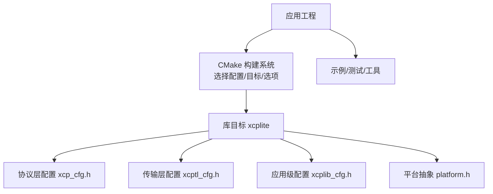
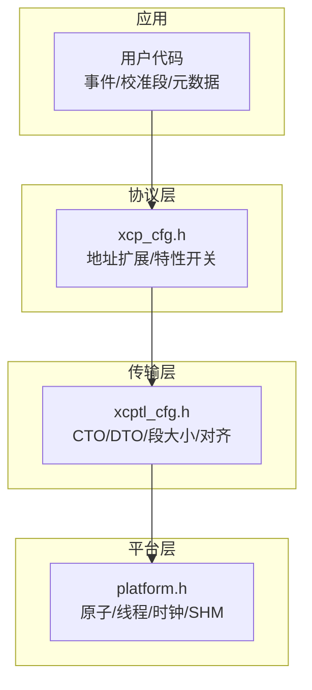
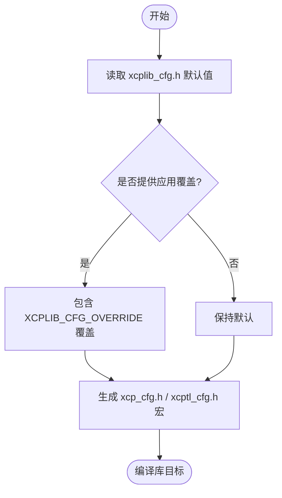
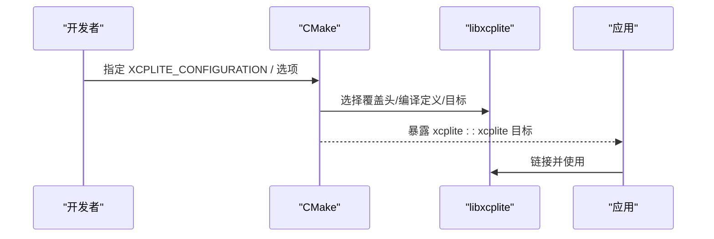
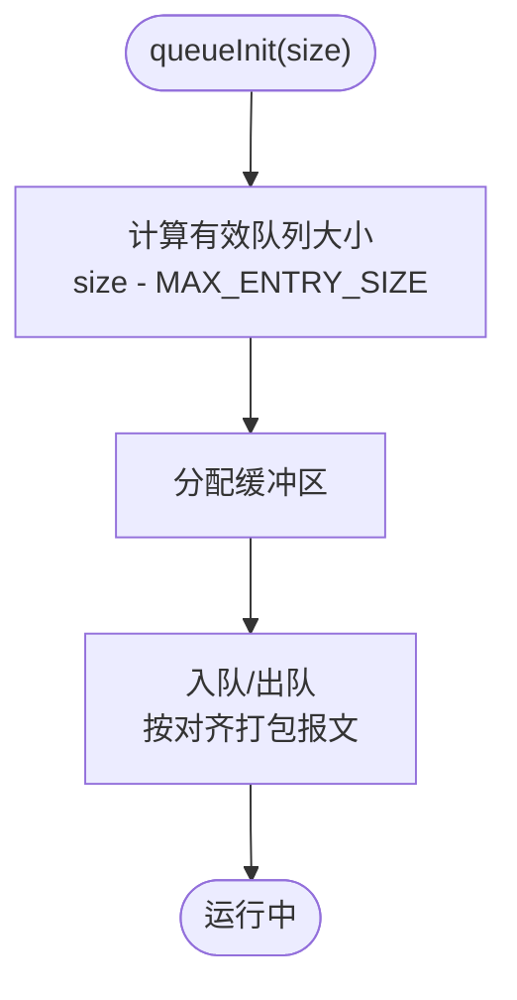
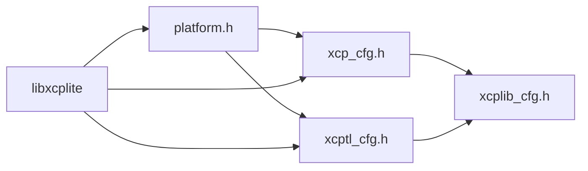

# 附录

<cite>
**本文引用的文件**
- [README.md](file://README.md)
- [CMakeLists.txt](file://CMakeLists.txt)
- [xcplib_cfg.h](file://src/xcplib_cfg.h)
- [xcp_cfg.h](file://src/xcp_cfg.h)
- [xcptl_cfg.h](file://src/xcptl_cfg.h)
- [BUILDING.md](file://docs/BUILDING.md)
- [TECHNICAL.md](file://docs/TECHNICAL.md)
- [XCP_INTRODUCTION.md](file://docs/XCP_INTRODUCTION.md)
- [xcplib_cfg.md](file://docs/xcplib_cfg.md)
- [platform.h](file://src/platform.h)
</cite>

## 目录
1. [简介](#简介)
2. [项目结构](#项目结构)
3. [核心组件](#核心组件)
4. [架构总览](#架构总览)
5. [详细组件分析](#详细组件分析)
6. [依赖关系分析](#依赖关系分析)
7. [性能考量](#性能考量)
8. [故障排查指南](#故障排查指南)
9. [结论](#结论)
10. [附录：配置参考手册、版本历史、许可证与资源、术语表与索引、快速参考卡片](#附录配置参考手册版本历史许可证与资源术语表与索引快速参考卡片)

## 简介
本附录为XCPlite的完整参考资料，覆盖编译时配置、运行时参数、版本历史、许可证与第三方依赖声明、XCP协议标准参考链接、术语表、索引与快速参考卡片。内容基于仓库中的构建脚本、头文件配置与文档整理而成，旨在帮助使用者快速定位并理解各项选项的作用与影响。

## 项目结构
- 构建系统：CMake（支持多配置、安装导出、FetchContent集成）
- 配置层：应用级默认配置 xcplib_cfg.h；协议层 xcp_cfg.h；传输层 xcptl_cfg.h；平台抽象 platform.h
- 文档：构建指南 BUILDING.md、技术细节 TECHNICAL.md、XCP介绍 XCP_INTRODUCTION.md、配置说明 xcplib_cfg.md
- 示例与工具：examples、tools（含xcpclient、bintool、ptptool、shmtool等）

**图示来源**
- [CMakeLists.txt:15-108](file://CMakeLists.txt#L15-L108)
- [xcplib_cfg.h:13-24](file://src/xcplib_cfg.h#L13-L24)
- [xcp_cfg.h:14-30](file://src/xcp_cfg.h#L14-L30)
- [xcptl_cfg.h:14-35](file://src/xcptl_cfg.h#L14-L35)
- [platform.h:23-86](file://src/platform.h#L23-L86)

**章节来源**
- [CMakeLists.txt:15-108](file://CMakeLists.txt#L15-L108)
- [BUILDING.md:11-27](file://docs/BUILDING.md#L11-L27)

## 核心组件
- 配置体系
  - 应用级默认配置：xcplib_cfg.h（日志、时钟、网络、DAQ、A2L生成、队列等）
  - 协议层配置：xcp_cfg.h（地址扩展、校准页、持久化、校验和、事件管理、PTP等）
  - 传输层配置：xcptl_cfg.h（CTO/DTO大小、段大小、对齐、头部、组播端口等）
  - 平台抽象：platform.h（原子、线程、互斥、时钟、共享内存、文件系统接口）
- 构建与分发
  - CMake 提供多配置（default/no_a2l/ptp/shm/rtos/raw）、可选目标（examples/tests/tools/rust_tools）、安装导出（find_package兼容）
- 运行时能力
  - 以太网传输（TCP/UDP或原始套接字）、事件驱动采集、校准段与页面切换、A2L在线/离线生成、EPK版本检查、PTP时间同步准备

**章节来源**
- [xcplib_cfg.h:42-173](file://src/xcplib_cfg.h#L42-L173)
- [xcp_cfg.h:100-456](file://src/xcp_cfg.h#L100-L456)
- [xcptl_cfg.h:34-143](file://src/xcptl_cfg.h#L34-L143)
- [platform.h:255-510](file://src/platform.h#L255-L510)
- [CMakeLists.txt:111-154](file://CMakeLists.txt#L111-L154)

## 架构总览
XCPlite采用分层设计：应用通过API定义事件与校准段，协议层负责XCP命令处理与地址解析，传输层封装以太网报文（TCP/UDP或原始套接字），平台层屏蔽OS差异并提供原子、线程、时钟等基础能力。

**图示来源**
- [xcp_cfg.h:100-208](file://src/xcp_cfg.h#L100-L208)
- [xcptl_cfg.h:34-114](file://src/xcptl_cfg.h#L34-L114)
- [platform.h:255-510](file://src/platform.h#L255-L510)

## 详细组件分析

### 配置体系与编译期开关
- 应用级配置（xcplib_cfg.h）
  - 日志：是否启用调试打印、默认级别、最大可调级别、固定级别
  - 时钟：纪元选择（任意/PTP）、分辨率（1ns/1us）
  - 网络：TCP/UDP、MTU、强制终止、本地地址获取
  - 校准段：数量、内存池、单页模式、持久化、EPK、绝对寻址、启动页
  - DAQ：事件列表、事件数、表内存、异步事件、队列实现（64位可变/固定、32位互斥）
  - A2L：生成器、上传、ELF上传、本地地址获取
- 协议层配置（xcp_cfg.h）
  - 版本：驱动版本、协议层版本、EPK/项目名/A2L文件名长度限制
  - 地址扩展：绝对/段相对/动态/应用回调/文件/指针空间
  - 特性：校准页/COPY_CAL_PAGE/冻结/校验和/种子密钥/SERV_TEXT/GET_ID上传/用户命令
  - DAQ：每ODT地址扩展、静态表内存、控制/预分频/超时
  - 校准段：懒写、获取空闲页超时
  - 时钟：64位时间戳、单位与刻度、PTP支持、组播时钟（不推荐）
- 传输层配置（xcptl_cfg.h）
  - 版本：传输层版本
  - 包尺寸：CTO/DTO、段大小（由MTU推导）、对齐、头部
  - 发送头预留：零拷贝场景
  - 行为：CRM走队列、计数器分离、组播端口
- 平台抽象（platform.h）
  - 平台检测、原子、线程、互斥、时钟、共享内存、文件系统、键盘输入

**图示来源**
- [xcplib_cfg.h:191-204](file://src/xcplib_cfg.h#L191-L204)
- [xcp_cfg.h:14-30](file://src/xcp_cfg.h#L14-L30)
- [xcptl_cfg.h:14-35](file://src/xcptl_cfg.h#L14-L35)

**章节来源**
- [xcplib_cfg.h:42-173](file://src/xcplib_cfg.h#L42-L173)
- [xcp_cfg.h:100-456](file://src/xcp_cfg.h#L100-L456)
- [xcptl_cfg.h:34-143](file://src/xcptl_cfg.h#L34-L143)
- [platform.h:23-86](file://src/platform.h#L23-L86)

### 构建系统与配置选择
- 配置项：default/no_a2l/ptp/shm/rtos/raw（互斥，需独立构建目录）
- 应用覆盖：XCPLITE_CFG_OVERRIDE（仅default配置可用）
- 构建选项：示例/测试/工具/Rust工具/BPF演示/安装规则
- 安装与导出：install规则、CMake包配置、版本兼容策略

**图示来源**
- [CMakeLists.txt:15-108](file://CMakeLists.txt#L15-L108)
- [CMakeLists.txt:111-154](file://CMakeLists.txt#L111-L154)
- [CMakeLists.txt:588-656](file://CMakeLists.txt#L588-L656)

**章节来源**
- [CMakeLists.txt:15-108](file://CMakeLists.txt#L15-L108)
- [BUILDING.md:11-62](file://docs/BUILDING.md#L11-L62)

### 运行时参数与队列
- 队列初始化：queueInit(buffer_size) 决定总内存、条目数与吞吐容量
- 队列类型：64位可变/固定（锁自由）、32位（互斥/临界区）
- 传输层消息：LEN+CTR+协议层报文+填充，按4字节对齐
- 段大小：由OPTION_MTU推导，保留IP/UDP头并对齐

**图示来源**
- [xcptl_cfg.h:86-114](file://src/xcptl_cfg.h#L86-L114)
- [xcplib_cfg.h:143-162](file://src/xcplib_cfg.h#L143-L162)

**章节来源**
- [xcptl_cfg.h:86-114](file://src/xcptl_cfg.h#L86-L114)
- [xcplib_cfg.h:143-162](file://src/xcplib_cfg.h#L143-L162)

## 依赖关系分析
- 内部依赖
  - xcp_cfg.h 依赖 xcplib_cfg.h 的 OPTION_* 宏
  - xcptl_cfg.h 依赖 xcplib_cfg.h 的 OPTION_* 宏
  - platform.h 被各层引用以统一原子/线程/时钟等
- 外部依赖
  - 线程库（Threads::Threads）、数学库（m，Unix）、原子库（atomic，部分ARM Clang）
  - 可选：libbpf（BPF演示）、Rust工具链（xcpclient/bintool）

**图示来源**
- [xcp_cfg.h:14-16](file://src/xcp_cfg.h#L14-L16)
- [xcptl_cfg.h:14-16](file://src/xcptl_cfg.h#L14-L16)
- [CMakeLists.txt:297-311](file://CMakeLists.txt#L297-L311)

**章节来源**
- [CMakeLists.txt:297-311](file://CMakeLists.txt#L297-L311)

## 性能考量
- 静态内存：约10KB（DAQ表、校准段页）
- 堆内存：约32KB（传输队列，可配置）
- 栈内存：每线程约1KB（收发线程）
- 队列与对齐：按4字节对齐，减少复制；固定大小队列在特定场景更优
- 原子与无锁：64位平台使用无锁队列；Windows回退到互斥
- 日志级别：关闭调试可降低开销

**章节来源**
- [TECHNICAL.md:5-24](file://docs/TECHNICAL.md#L5-L24)
- [xcptl_cfg.h:86-114](file://src/xcptl_cfg.h#L86-L114)
- [xcplib_cfg.h:42-53](file://src/xcplib_cfg.h#L42-L53)

## 故障排查指南
- 构建问题
  - 未满足C11/C++17要求：请升级编译器或使用build.sh指定CC/CXX
  - 原子库缺失：某些ARM平台需-link atomic（已自动检测）
  - 配置冲突：raw模式与TCP/UDP互斥；raw需要32位队列
- 运行时问题
  - MTU过大：sendto返回EMSGSIZE；raw HAL报ETH_HAL_ERROR_SIZE
  - 队列不足：增大queueInit buffer_size
  - 日志过多：降低默认日志级别或固定级别
- 工具兼容
  - CANape特定行为见技术文档“已知问题”

**章节来源**
- [BUILDING.md:364-416](file://docs/BUILDING.md#L364-L416)
- [xcptl_cfg.h:51-81](file://src/xcptl_cfg.h#L51-L81)
- [TECHNICAL.md:396-412](file://docs/TECHNICAL.md#L396-L412)

## 结论
XCPlite通过清晰的分层与可插拔配置，提供了面向现代多核系统的XCP测量与标定能力。借助CMake的多配置与应用覆盖机制，可在不同平台上灵活裁剪功能与资源占用。建议根据部署环境选择合适的配置与队列策略，并结合日志与性能指标进行调优。

## 附录：配置参考手册、版本历史、许可证与资源、术语表与索引、快速参考卡片

### 配置参考手册（编译时与运行时）
- 应用级配置（xcplib_cfg.h）
  - 日志：OPTION_ENABLE_DBG_PRINTS、OPTION_DEFAULT_DBG_LEVEL、OPTION_MAX_DBG_LEVEL、OPTION_FIXED_DBG_LEVEL
  - 时钟：OPTION_CLOCK_EPOCH_ARB/PTP、OPTION_CLOCK_TICKS_1NS/1US
  - 网络：OPTION_ENABLE_TCP/UDP、OPTION_MTU、OPTION_SERVER_FORCEFULL_TERMINATION、OPTION_ENABLE_GET_LOCAL_ADDR
  - 校准段：OPTION_CAL_SEGMENTS、OPTION_CAL_SEGMENT_COUNT、OPTION_CAL_MEM_SIZE、OPTION_CAL_SEGMENTS_SINGLE_PAGE、OPTION_ENABLE_PERSISTENCE、OPTION_CAL_SEGMENT_EPK、OPTION_CAL_SEGMENTS_ABS、OPTION_CAL_SEGMENTS_START_ON_REFERENCE_PAGE
  - DAQ：OPTION_DAQ_EVENT_LIST、OPTION_DAQ_EVENT_COUNT、OPTION_DAQ_MEM_SIZE、OPTION_DAQ_ASYNC_EVENT、队列实现（64位可变/固定、32位）
  - A2L：OPTION_ENABLE_A2L_GENERATOR、OPTION_ENABLE_A2L_UPLOAD、OPTION_ENABLE_ELF_UPLOAD
- 协议层配置（xcp_cfg.h）
  - 版本：XCP_DRIVER_VERSION、XCP_PROTOCOL_LAYER_VERSION、XCP_EPK_MAX_LENGTH、XCP_PROJECT_NAME_MAX_LENGTH、XCP_A2L_FILENAME_MAX_LENGTH
  - 地址扩展：XCP_ENABLE_DYN_ADDRESSING、XCP_ADDR_EXT_DYN/DYN_COUNT、XCP_ENABLE_ABS_ADDRESSING、XCP_ADDR_EXT_ABS/SEG/APPLICATION/FIXED
  - 特性：XCP_ENABLE_CAL_PAGE/COPY_CAL_PAGE_WORKAROUND、XCP_ENABLE_FREEZE_CAL_PAGE、XCP_ENABLE_CHECKSUM、XCP_ENABLE_SEED_KEY、XCP_ENABLE_SERV_TEXT、XCP_ENABLE_IDT_A2L_UPLOAD/ELF_UPLOAD、XCP_ENABLE_USER_COMMAND
  - DAQ：XCP_MAX_EVENT_COUNT、XCP_DAQ_MEM_SIZE、XCP_ENABLE_DAQ_RESUME/PRESCALER/CONTROL/OVERRUN_INDICATION_PID、XCP_TRANSMIT_QUEUE_FLUSH_TIMEOUT_MS
  - 校准段：XCP_ENABLE_CALSEG_LAZY_WRITE、XCP_CALSEG_AQUIRE_FREE_PAGE_TIMEOUT
  - 时钟：XCP_DAQ_CLOCK_64BIT、XCP_TIMESTAMP_UNIT/TICKS、XCP_ENABLE_PTP、XCP_ENABLE_DAQ_CLOCK_MULTICAST（不推荐）
- 传输层配置（xcptl_cfg.h）
  - 版本：XCP_TRANSPORT_LAYER_VERSION
  - 包尺寸：XCPTL_MAX_CTO_SIZE、XCPTL_MAX_DTO_SIZE、XCPTL_MAX_SEGMENT_SIZE（由OPTION_MTU推导）、XCPTL_PACKET_ALIGNMENT、XCPTL_TRANSPORT_LAYER_HEADER_SIZE
  - 发送头预留：XCPTL_TX_HEADROOM（零拷贝）
  - 行为：XCPTL_CRM_VIA_TRANSMIT_QUEUE、XCPTL_EXCLUDE_CRM_FROM_CTR、XCPTL_ENABLE_MULTICAST、XCPTL_MULTICAST_PORT
- 平台抽象（platform.h）
  - 平台检测、原子、线程、互斥、时钟、共享内存、文件系统、键盘输入
- 运行时参数
  - 队列大小：queueInit(buffer_size) 决定内存与吞吐
  - 日志级别：可通过配置固定或运行时调整（受最大级别限制）

**章节来源**
- [xcplib_cfg.h:42-173](file://src/xcplib_cfg.h#L42-L173)
- [xcp_cfg.h:100-456](file://src/xcp_cfg.h#L100-L456)
- [xcptl_cfg.h:34-143](file://src/xcptl_cfg.h#L34-L143)
- [platform.h:255-510](file://src/platform.h#L255-L510)
- [xcplib_cfg.md:26-187](file://docs/xcplib_cfg.md#L26-L187)

### 版本历史与兼容性
- 当前版本：2.2.2（项目版本与find_package报告一致）
- 协议层版本：0x0104（支持PACKED_MODE、CC_START_STOP_SYNCH）
- 传输层版本：0x0104
- 兼容性：与CANoe/CANape等ASAM工具兼容；CANape 24+支持共享轴与THIS引用
- 迁移提示：
  - MTU语义变更：自V2.1.11起，OPTION_MTU为链路MTU，不再向上取整至8的倍数
  - 地址扩展：CASDD/ACSDD模式差异影响A2L project_no与工具解码
  - 组播时钟：不推荐使用，除非多设备且非PTP场景

**章节来源**
- [xcplib_cfg.h:18-28](file://src/xcplib_cfg.h#L18-L28)
- [xcp_cfg.h:20-30](file://src/xcp_cfg.h#L20-L30)
- [xcptl_cfg.h:34-35](file://src/xcptl_cfg.h#L34-L35)
- [xcptl_cfg.h:61-81](file://src/xcptl_cfg.h#L61-L81)
- [README.md:38-51](file://README.md#L38-L51)

### 许可证与第三方依赖
- 许可证：参见根目录LICENSE文件（仓库内引用）
- 第三方依赖
  - 线程库：Threads::Threads
  - 数学库：m（Unix）
  - 原子库：atomic（部分ARM平台）
  - Rust工具链：xcpclient、bintool（可选）
  - libbpf：bpf_demo（可选）
- 法律条款：遵循各自依赖的许可证；本项目代码遵循其自身许可（详见LICENSE）

**章节来源**
- [CMakeLists.txt:297-311](file://CMakeLists.txt#L297-L311)
- [CMakeLists.txt:555-586](file://CMakeLists.txt#L555-L586)
- [README.md:127-130](file://README.md#L127-L130)

### XCP协议标准参考与资源
- XCP简介与学习资源：Vector XCP Book、Virtual VectorAcademy E-Learning
- 其他实现：XCPbasic、XCPprof
- 工具兼容性：CANape/CANoe等ASAM工具

**章节来源**
- [XCP_INTRODUCTION.md:25-41](file://docs/XCP_INTRODUCTION.md#L25-L41)
- [README.md:38-51](file://README.md#L38-L51)

### 术语表
- A2L：ASAM测量与标定描述文件
- EPK：ECU软件版本标识，用于A2L/二进制参数兼容性检查
- ODT：DAQ数据传输对象
- STIM/DAQ：刺激与数据采集
- CRO/CRM：客户端请求/响应
- DTO：数据报文
- 地址扩展：指示寻址模式的字段，如绝对、段相对、动态、应用回调等
- 校准段/页：参数存储与切换的基本单元
- 队列：传输层缓冲与打包机制

### 索引（关键词→位置）
- 配置覆盖：[xcplib_cfg.h:191-204](file://src/xcplib_cfg.h#L191-L204)、[CMakeLists.txt:68-108](file://CMakeLists.txt#L68-L108)
- 队列与对齐：[xcptl_cfg.h:86-114](file://src/xcptl_cfg.h#L86-L114)
- 地址扩展与模式：[xcp_cfg.h:100-208](file://src/xcp_cfg.h#L100-L208)
- 时钟与PTP：[xcp_cfg.h:408-449](file://src/xcp_cfg.h#L408-L449)、[xcptl_cfg.h:128-143](file://src/xcptl_cfg.h#L128-L143)
- 构建与安装：[CMakeLists.txt:111-154](file://CMakeLists.txt#L111-L154)、[CMakeLists.txt:588-656](file://CMakeLists.txt#L588-L656)
- 性能与资源：[TECHNICAL.md:5-24](file://docs/TECHNICAL.md#L5-L24)

### 快速参考卡片
- 常用构建命令
  - 默认配置+示例：cmake -B build -S . && cmake --build build
  - no_a2l配置：cmake -B build-no_a2l -S . -DXCPLITE_CONFIGURATION=no_a2l -DXCPLITE_BUILD_EXAMPLES=ON
  - ptp配置+工具：cmake -B build-ptp -S . -DXCPLITE_CONFIGURATION=ptp -DXCPLITE_BUILD_TOOLS=ON
  - shm配置+工具：cmake -B build-shm -S . -DXCPLITE_CONFIGURATION=shm -DXCPLITE_BUILD_TOOLS=ON
  - raw配置+示例：cmake -B build-raw -S . -DXCPLITE_CONFIGURATION=raw -DXCPLITE_BUILD_EXAMPLES=ON
- 关键配置速查
  - MTU：OPTION_MTU → 影响XCPTL_MAX_SEGMENT_SIZE
  - 队列：queueInit(buffer_size) → 决定吞吐与延迟
  - 日志：OPTION_DEFAULT_DBG_LEVEL/OPTION_MAX_DBG_LEVEL
  - 地址模式：CASDD/ACSDD → 影响A2L project_no与工具解码
  - 持久化：OPTION_ENABLE_PERSISTENCE → 启用校准段工作页持久化与冻结
- 常见问题速查
  - sendto失败EMSGSIZE：检查OPTION_MTU是否超过链路MTU
  - 构建报错原子库：确认链接atomic（CMake已自动处理）
  - 工具无法识别A2L：确认project_no与地址扩展设置一致

**章节来源**
- [BUILDING.md:85-218](file://docs/BUILDING.md#L85-L218)
- [xcptl_cfg.h:51-81](file://src/xcptl_cfg.h#L51-L81)
- [xcplib_cfg.h:42-53](file://src/xcplib_cfg.h#L42-L53)
- [xcp_cfg.h:100-168](file://src/xcp_cfg.h#L100-L168)