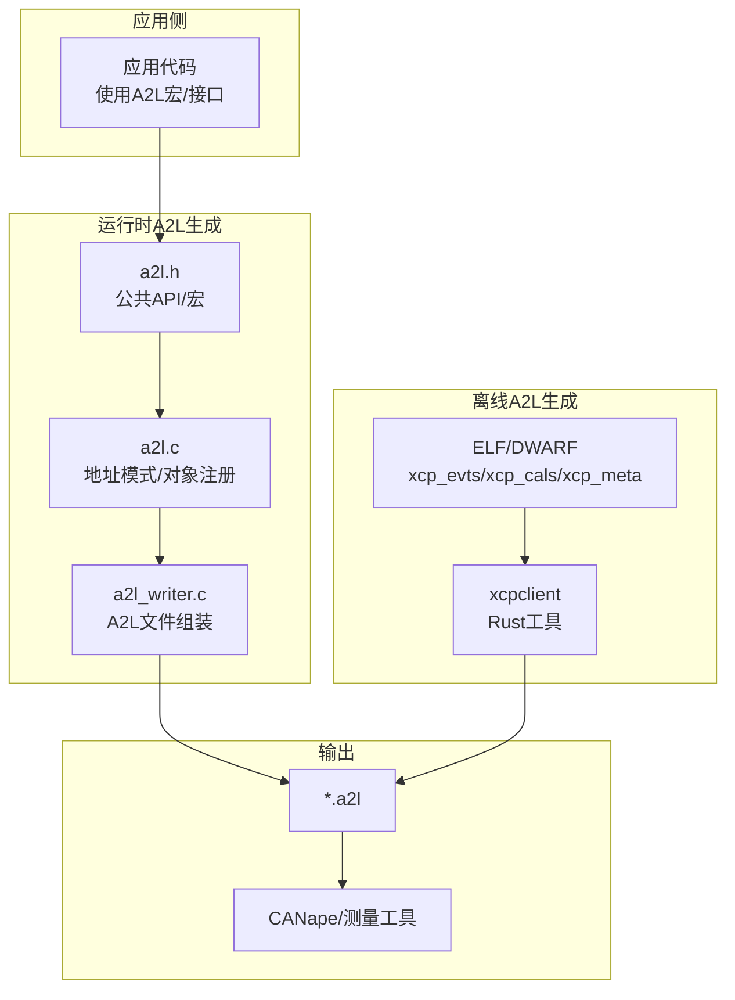
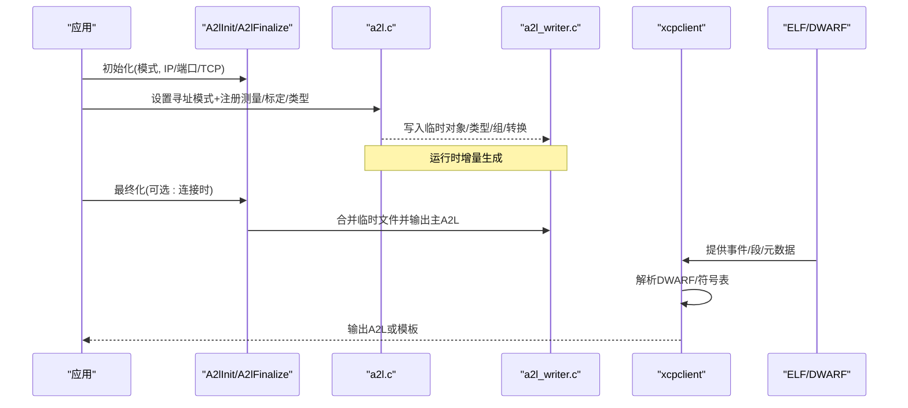
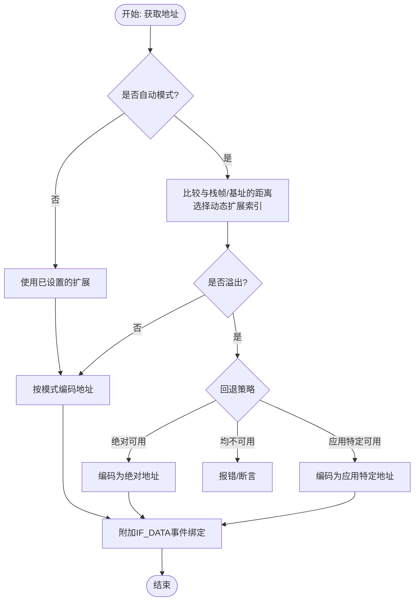
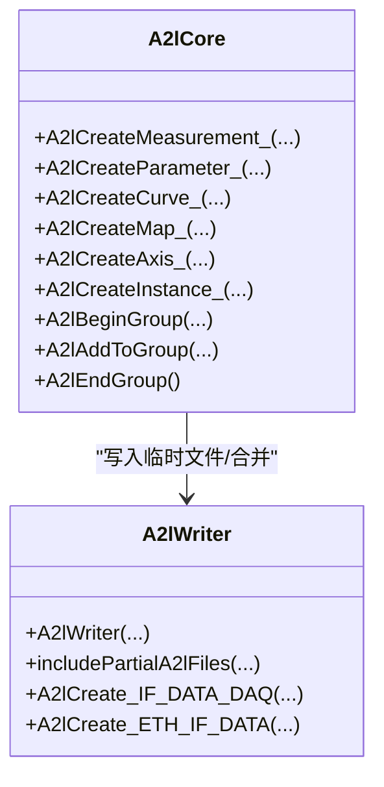
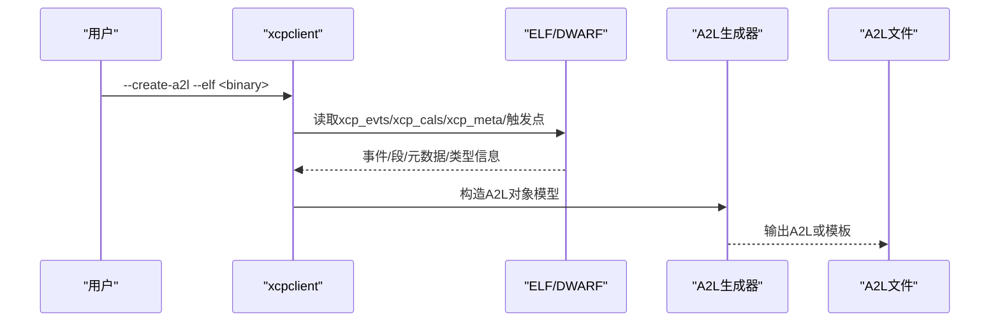
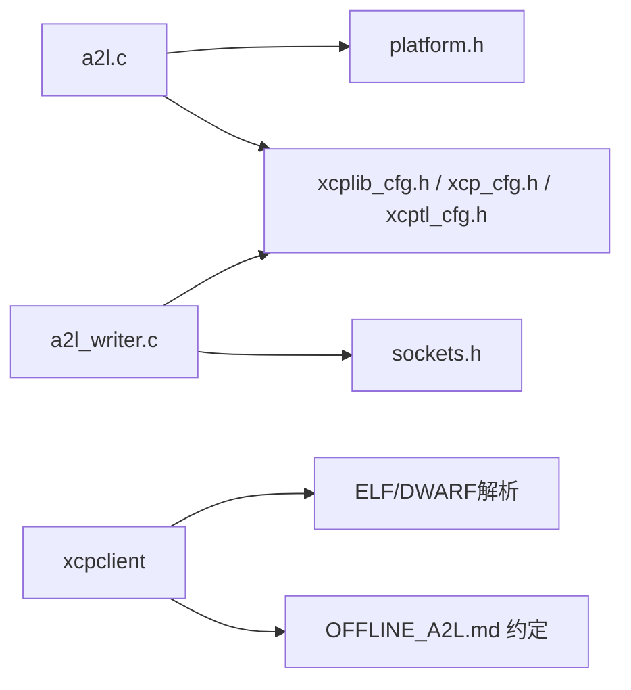

# A2L文件生成机制

<cite>
**本文引用的文件**
- [inc/a2l.h](file://inc/a2l.h)
- [src/a2l.c](file://src/a2l.c)
- [src/a2l_writer.c](file://src/a2l_writer.c)
- [docs/OFFLINE_A2L.md](file://docs/OFFLINE_A2L.md)
- [tools/xcpclient/README.md](file://tools/xcpclient/README.md)
- [examples/hello_xcp/CANape/xcp_demo_autodetect.a2l](file://examples/hello_xcp/CANape/xcp_demo_autodetect.a2l)
- [docs/TECHNICAL.md](file://docs/TECHNICAL.md)
</cite>

## 目录
1. [简介](#简介)
2. [项目结构](#项目结构)
3. [核心组件](#核心组件)
4. [架构总览](#架构总览)
5. [详细组件分析](#详细组件分析)
6. [依赖关系分析](#依赖关系分析)
7. [性能考量](#性能考量)
8. [故障排查指南](#故障排查指南)
9. [结论](#结论)
10. [附录](#附录)

## 简介
本技术文档围绕XCPlite的A2L（ASAM MCD-2 MC）文件生成机制，系统阐述运行时A2L生成与构建时离线A2L生成的工作原理、实现差异与适用场景；深入解析A2L文件结构、元数据处理、复杂类型支持以及地址扩展编码；并详细说明xcpclient工具的功能、使用方法与从ELF生成离线A2L的流程。同时给出与测量工具（如CANape）的集成配置要点、动态系统A2L更新注意事项，以及A2L验证调试方法与常见问题解决方案。

## 项目结构
XCPlite将A2L生成能力分为两部分：
- 运行时A2L生成：由应用侧通过宏与API在目标设备上注册事件、参数、测量值、类型定义等，并在连接或最终化阶段写出A2L文件。
- 离线A2L生成：由xcpclient工具读取应用ELF/DWARF中的标记信息，直接生成完整A2L，无需目标设备运行时的A2L代码。

图表来源
- [src/a2l.c:1496-1579](file://src/a2l.c#L1496-L1579)
- [src/a2l_writer.c:451-530](file://src/a2l_writer.c#L451-L530)
- [docs/OFFLINE_A2L.md:1-12](file://docs/OFFLINE_A2L.md#L1-L12)
- [tools/xcpclient/README.md:24-37](file://tools/xcpclient/README.md#L24-L37)

章节来源
- [src/a2l.c:1496-1579](file://src/a2l.c#L1496-L1579)
- [src/a2l_writer.c:451-530](file://src/a2l_writer.c#L451-L530)
- [docs/OFFLINE_A2L.md:1-12](file://docs/OFFLINE_A2L.md#L1-L12)
- [tools/xcpclient/README.md:24-37](file://tools/xcpclient/README.md#L24-L37)

## 核心组件
- a2l.h：提供A2L生成所需的宏与C/C++类型推导、四种寻址模式设置、测量/标定/类型实例创建接口，以及线程安全与一次性执行辅助。
- a2l.c：实现地址编码、寻址模式切换、测量/标定/轴/曲线/映射/类型实例的注册与写入，自动分组、转换方法、输入量名称等。
- a2l_writer.c：负责A2L文件头、协议层、DAQ事件列表、传输层IF_DATA、MOD_PAR（含校准段）、合并临时文件、最终化输出。
- xcpclient：基于Rust的测试客户端与离线A2L生成器，可从ELF/DWARF提取事件、校准段、元数据，生成完整A2L或模板。

章节来源
- [inc/a2l.h:19-67](file://inc/a2l.h#L19-L67)
- [inc/a2l.h:324-476](file://inc/a2l.h#L324-L476)
- [src/a2l.c:85-121](file://src/a2l.c#L85-L121)
- [src/a2l.c:1225-1320](file://src/a2l.c#L1225-L1320)
- [src/a2l_writer.c:42-57](file://src/a2l_writer.c#L42-L57)
- [src/a2l_writer.c:251-363](file://src/a2l_writer.c#L251-L363)
- [tools/xcpclient/README.md:24-37](file://tools/xcpclient/README.md#L24-L37)

## 架构总览
运行时A2L生成流程：
- 初始化：A2lInit保存通信参数与模式，打开临时文件（对象、类型、组、转换），注册XCP连接回调以支持“连接时最终化”。
- 注册：应用调用A2lSet*AddrMode与A2lCreate*系列宏/函数，按当前寻址模式写入MEASUREMENT/CHARACTERISTIC/AXIS_PTS/INSTANCE等。
- 最终化：A2lFinalize合并临时文件，写入主A2L，必要时写持久化二进制文件。

离线A2L生成流程：
- 解析ELF/DWARF：读取xcp_evts、xcp_cals、xcp_epk、xcp_meta及触发点作用域，推断变量名、类型、偏移、事件与段号。
- 生成A2L：根据XCPlite特定约定生成完整A2L或仅包含事件/段/IF_DATA的模板。

图表来源
- [src/a2l.c:1496-1579](file://src/a2l.c#L1496-L1579)
- [src/a2l.c:1583-1599](file://src/a2l.c#L1583-L1599)
- [src/a2l_writer.c:451-530](file://src/a2l_writer.c#L451-L530)
- [docs/OFFLINE_A2L.md:35-63](file://docs/OFFLINE_A2L.md#L35-L63)
- [tools/xcpclient/README.md:24-37](file://tools/xcpclient/README.md#L24-L37)

## 详细组件分析

### 运行时A2L生成：寻址模式与地址扩展编码
- 四种寻址模式：
  - 绝对寻址：全局/静态变量，固定地址。
  - 相对寻址：相对于基址（如堆对象）。
  - 栈帧相对：相对于触发事件的栈帧指针。
  - 段相对：校准段内偏移（或绝对页地址，取决于配置）。
- 自动寻址：在自动模式下，根据变量与栈帧/基址的距离选择最优的动态地址扩展，溢出时回退到绝对或应用特定寻址。
- 地址扩展编码：根据当前模式计算ECU_ADDRESS与ECU_ADDRESS_EXTENSION，并附加IF_DATA事件绑定（固定事件或默认事件列表）。

图表来源
- [src/a2l.c:715-876](file://src/a2l.c#L715-L876)
- [src/a2l.c:484-514](file://src/a2l.c#L484-L514)
- [src/a2l.c:587-694](file://src/a2l.c#L587-L694)

章节来源
- [src/a2l.c:715-876](file://src/a2l.c#L715-L876)
- [src/a2l.c:484-514](file://src/a2l.c#L484-L514)
- [src/a2l.c:587-694](file://src/a2l.c#L587-L694)
- [inc/a2l.h:324-376](file://inc/a2l.h#L324-L376)

### 运行时A2L生成：测量/标定/类型与分组
- 测量与标定：
  - MEASUREMENT：标量/数组/矩阵，支持物理单位或转换引用，可读写（绝对/动态/应用特定）。
  - CHARACTERISTIC：VALUE/CURVE/MAP，支持共享轴与输入量名称。
- 类型与实例：
  - TYPEDEF_STRUCTURE + STRUCTURE_COMPONENT描述复合结构。
  - INSTANCE用于具体实例的地址绑定。
- 自动分组：
  - 按事件或校准段自动创建GROUP，便于工具组织。

图表来源
- [src/a2l.c:1124-1320](file://src/a2l.c#L1124-L1320)
- [src/a2l_writer.c:291-363](file://src/a2l_writer.c#L291-L363)
- [src/a2l_writer.c:405-445](file://src/a2l_writer.c#L405-L445)

章节来源
- [src/a2l.c:1124-1320](file://src/a2l.c#L1124-L1320)
- [src/a2l_writer.c:291-363](file://src/a2l_writer.c#L291-L363)
- [src/a2l_writer.c:405-445](file://src/a2l_writer.c#L405-L445)
- [inc/a2l.h:387-476](file://inc/a2l.h#L387-L476)

### 离线A2L生成：xcpclient与ELF/DWARF解析
- 关键ELF段：
  - xcp_evts：事件描述符（名称、周期、优先级）。
  - xcp_cals：校准段描述符（名称、默认页地址、大小、类型）。
  - xcp_epk：软件版本字符串。
  - xcp_meta：元数据常量（单位、限值、注释、读写属性）。
- 触发点锚点：trg__<modes>__<event>，提供作用域与可用寻址模式。
- 生成策略：
  - 完全A2L：从ELF/DWARF推断所有变量、类型、事件、段，生成完整A2L。
  - 模板A2L：仅包含IF_DATA、事件、段、EPK，供其他工具补充。

图表来源
- [docs/OFFLINE_A2L.md:15-27](file://docs/OFFLINE_A2L.md#L15-L27)
- [docs/OFFLINE_A2L.md:97-163](file://docs/OFFLINE_A2L.md#L97-L163)
- [tools/xcpclient/README.md:24-37](file://tools/xcpclient/README.md#L24-L37)

章节来源
- [docs/OFFLINE_A2L.md:15-27](file://docs/OFFLINE_A2L.md#L15-L27)
- [docs/OFFLINE_A2L.md:97-163](file://docs/OFFLINE_A2L.md#L97-L163)
- [tools/xcpclient/README.md:24-37](file://tools/xcpclient/README.md#L24-L37)

### A2L文件结构与示例
- 标准结构：PROJECT/HEADER/MODULE/IF_DATA/DAQ/PROTOCOL_LAYER/MOD_PAR等。
- 示例文件展示了事件、测量、标定、类型、转换、段的组织方式，以及IF_DATA中事件列表与传输层信息。

章节来源
- [examples/hello_xcp/CANape/xcp_demo_autodetect.a2l:1-169](file://examples/hello_xcp/CANape/xcp_demo_autodetect.a2l#L1-L169)
- [src/a2l_writer.c:42-57](file://src/a2l_writer.c#L42-L57)
- [src/a2l_writer.c:251-363](file://src/a2l_writer.c#L251-L363)

## 依赖关系分析
- 运行时A2L生成依赖：
  - 平台抽象（mutex、原子、时钟、套接字）。
  - XCP配置与事件/段管理（xcplib_cfg、xcp_cfg、xcptl_cfg）。
  - 持久化（persistence）用于“一次写入”模式。
- 离线A2L生成依赖：
  - ELF/DWARF解析（xcpclient Rust模块）。
  - XCPlite特定标记约定（TECHNICAL.md）。

图表来源
- [src/a2l.c:13-33](file://src/a2l.c#L13-L33)
- [src/a2l_writer.c:13-33](file://src/a2l_writer.c#L13-L33)
- [docs/TECHNICAL.md:96-104](file://docs/TECHNICAL.md#L96-L104)

章节来源
- [src/a2l.c:13-33](file://src/a2l.c#L13-L33)
- [src/a2l_writer.c:13-33](file://src/a2l_writer.c#L13-L33)
- [docs/TECHNICAL.md:96-104](file://docs/TECHNICAL.md#L96-L104)

## 性能考量
- 运行时A2L生成：
  - 文件I/O为主，内存占用低；多线程需加锁保护状态。
  - 自动分组与类型/转换写入可能增加CPU开销，建议按需启用。
- 离线A2L生成：
  - 解析大型ELF/DWARF耗时，但避免目标设备运行时开销。
  - 适合CI/CD流水线生成A2L，减少部署复杂度。

[本节为通用指导，不直接分析具体文件]

## 故障排查指南
- 常见错误与定位：
  - 地址溢出：检查自动寻址的回退路径与范围限制。
  - 事件未找到：确认事件名称/ID正确且已创建。
  - 校准段未找到：确认段名/索引有效。
  - 元数据未匹配：检查命名与作用域前缀。
- 诊断信息：
  - 日志级别与调试输出（DBG_PRINTF_*）。
  - xcpclient的诊断消息（缺失DWARF、Mach-O不支持、EPK不匹配等）。

章节来源
- [src/a2l.c:415-454](file://src/a2l.c#L415-L454)
- [src/a2l.c:529-578](file://src/a2l.c#L529-L578)
- [docs/OFFLINE_A2L.md:244-269](file://docs/OFFLINE_A2L.md#L244-L269)

## 结论
XCPlite提供了灵活的A2L生成机制：运行时生成适用于需要动态注册与持久化的场景；离线生成则通过xcpclient直接从ELF/DWARF生成A2L，降低目标设备负担并提升一致性。两者结合可满足不同平台的工程需求。通过合理的寻址模式、类型定义与元数据标注，能够高效地对接CANape等测量工具，并支持动态更新与验证调试。

[本节为总结性内容，不直接分析具体文件]

## 附录

### 使用xcpclient从ELF生成离线A2L
- 基本命令：
  - 离线生成：xcpclient --offline --elf <binary> --create-a2l --a2l <output.a2l>
  - 在线生成（校验事件/段）：xcpclient --dest-addr <IP> --udp --elf <binary> --create-a2l --a2l <output.a2l>
  - 模板生成：xcpclient --offline --elf <binary> --create-a2l-template --a2l <template.a2l>
- 过滤与限定：
  - 编译单元过滤、变量名正则、仅包含带元数据的变量等。

章节来源
- [docs/OFFLINE_A2L.md:35-63](file://docs/OFFLINE_A2L.md#L35-L63)
- [tools/xcpclient/README.md:94-160](file://tools/xcpclient/README.md#L94-L160)

### 与CANape等测量工具的集成
- 使用示例A2L文件中的IF_DATA与事件列表进行设备配置。
- 确保事件名称、周期、优先级与目标一致。
- 对于无固定事件的变量，可通过工具默认事件或A2L中的DEFAULT_EVENT_LIST指定。

章节来源
- [examples/hello_xcp/CANape/xcp_demo_autodetect.a2l:119-169](file://examples/hello_xcp/CANape/xcp_demo_autodetect.a2l#L119-L169)

### 动态系统A2L更新注意事项
- 运行时“一次写入”模式依赖持久化二进制文件保持顺序一致。
- 若A2L不稳定，需提供反映变化的EPK版本字符串。
- 连接时最终化可避免未完成A2L被使用。

章节来源
- [docs/TECHNICAL.md:56-87](file://docs/TECHNICAL.md#L56-L87)
- [src/a2l.c:1463-1478](file://src/a2l.c#L1463-L1478)

### A2L验证与调试
- 使用xcpclient列出测量/标定变量，验证名称与可见性。
- 检查日志与诊断信息，定位缺失变量或类型问题。
- 对比模板与完整A2L，逐步完善对象定义。

章节来源
- [tools/xcpclient/README.md:211-249](file://tools/xcpclient/README.md#L211-L249)
- [docs/OFFLINE_A2L.md:244-269](file://docs/OFFLINE_A2L.md#L244-L269)