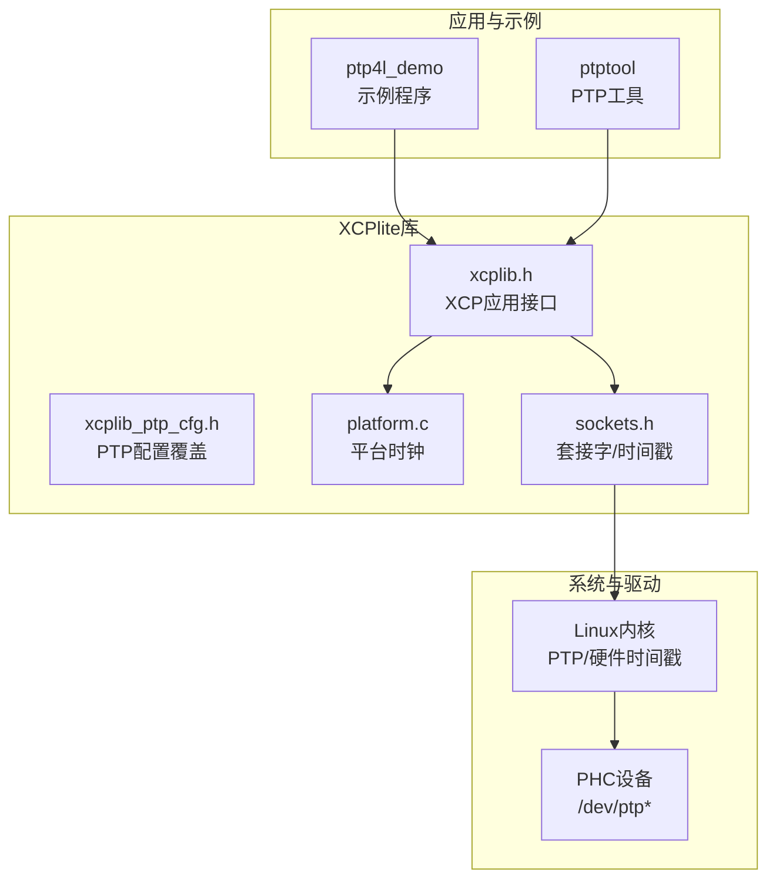
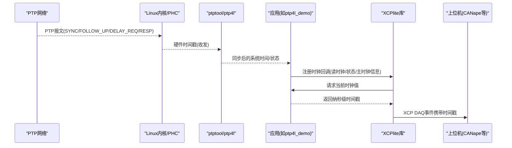
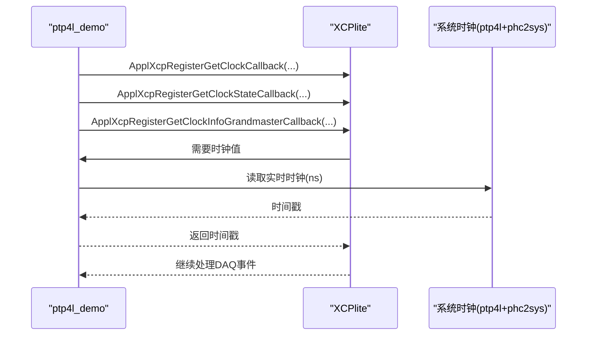
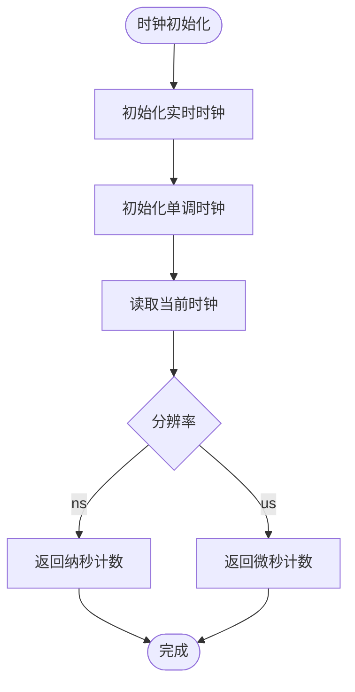
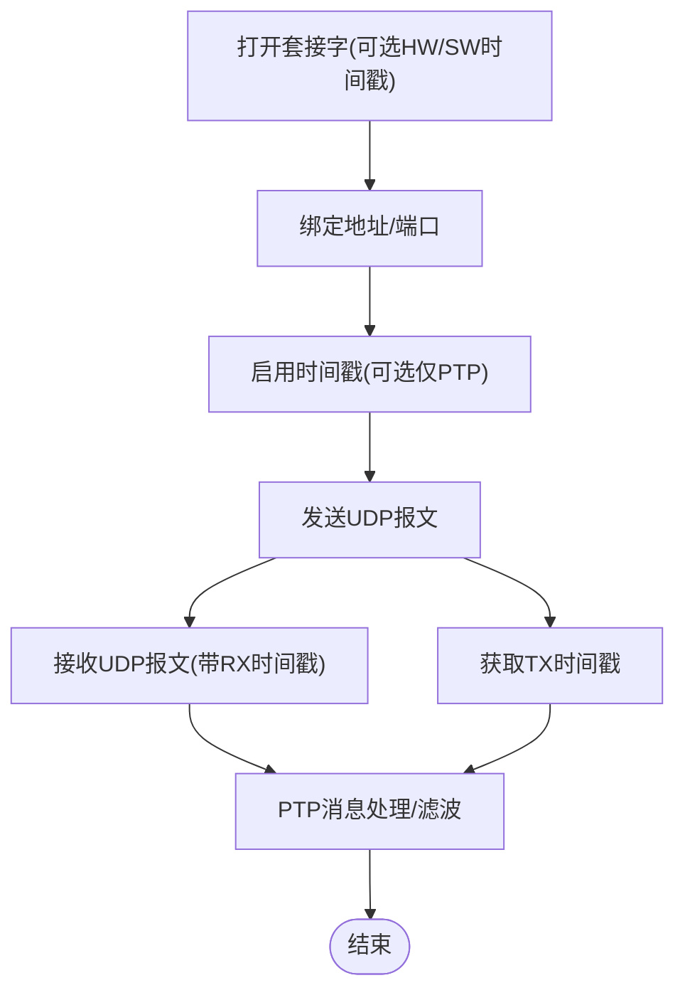
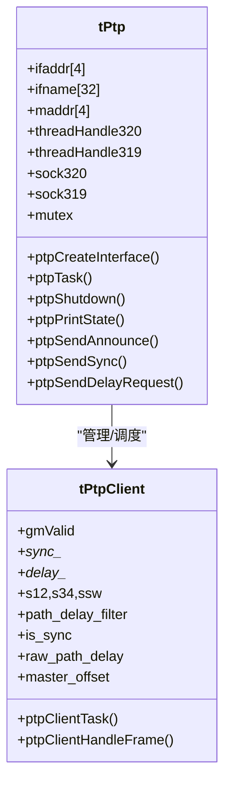
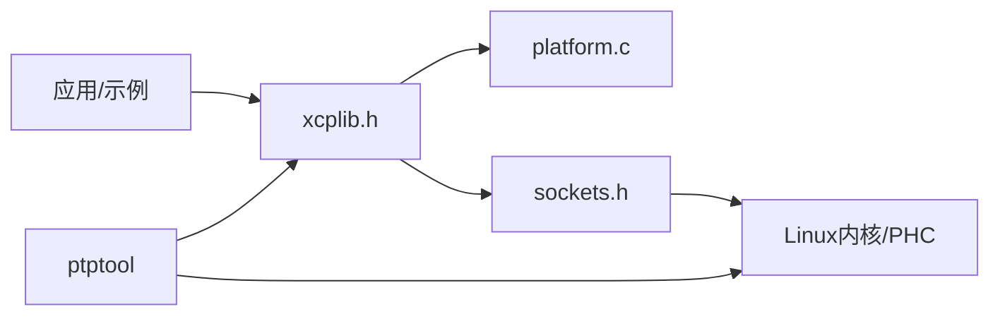

# PTP时间戳支持

<cite>
**本文引用的文件**
- [xcplib_ptp_cfg.h](file://src/xcplib_ptp_cfg.h)
- [xcplib.h](file://inc/xcplib.h)
- [platform.c](file://src/platform.c)
- [sockets.h](file://src/sockets.h)
- [ptp.h](file://tools/ptptool/src/ptp/ptp.h)
- [phc.h](file://tools/ptptool/src/ptp/phc.h)
- [ptp_client.h](file://tools/ptptool/src/ptp/ptp_client.h)
- [main.cpp（ptp4l_demo）](file://examples/ptp4l_demo/src/main.cpp)
- [README.md（ptptool）](file://tools/ptptool/README.md)
</cite>

## 目录
1. [简介](#简介)
2. [项目结构](#项目结构)
3. [核心组件](#核心组件)
4. [架构总览](#架构总览)
5. [详细组件分析](#详细组件分析)
6. [依赖关系分析](#依赖关系分析)
7. [性能考虑](#性能考虑)
8. [故障排查指南](#故障排查指南)
9. [结论](#结论)
10. [附录](#附录)

## 简介
本技术文档围绕XCPlite的PTP时间戳支持，系统阐述精确时间协议（PTP，IEEE 1588）在XCPlite中的集成原理与高精度时间同步机制。内容涵盖：
- PTP时钟源配置、时间戳获取方法与XCP协议的集成方式
- PTP时间戳在数据采集中的应用场景（多节点同步测量、事件精确定时等）
- PTP网络环境部署、时钟同步调优与时间戳精度验证方法
- 实际代码示例路径与性能测试要点

## 项目结构
与PTP时间戳相关的实现分布在以下位置：
- 库层配置与接口
  - 库配置覆盖头文件：启用硬件时间戳等选项
  - XCP应用接口：提供时钟回调注册、时钟状态与主时钟信息上报
  - 平台时钟抽象：统一获取实时/单调时钟，支持不同纪元（PTP或任意）
  - 套接字抽象：Linux下硬件/软件时间戳能力封装
- 工具与示例
  - ptp4l_demo：演示如何基于linuxptp（ptp4l + phc2sys）提供的同步系统时钟为XCP提供高精度时间戳
  - ptptool：PTP客户端/主站/观察者工具，具备XCP可观测性，用于验证与调试
- 测试与文档
  - 工具README包含构建、运行、硬件要求与调试指引

图表来源
- [xcplib.h:940-1000](file://inc/xcplib.h#L940-L1000)
- [xcplib_ptp_cfg.h:1-31](file://src/xcplib_ptp_cfg.h#L1-L31)
- [platform.c:570-640](file://src/platform.c#L570-L640)
- [sockets.h:190-379](file://src/sockets.h#L190-L379)
- [ptp.h:1-103](file://tools/ptptool/src/ptp/ptp.h#L1-L103)

章节来源
- [xcplib_ptp_cfg.h:1-31](file://src/xcplib_ptp_cfg.h#L1-L31)
- [xcplib.h:940-1000](file://inc/xcplib.h#L940-L1000)
- [platform.c:570-640](file://src/platform.c#L570-L640)
- [sockets.h:190-379](file://src/sockets.h#L190-L379)
- [ptp.h:1-103](file://tools/ptptool/src/ptp/ptp.h#L1-L103)

## 核心组件
- PTP配置覆盖
  - 通过编译期宏开启Linux下的UDP套接字硬件时间戳能力，使能ptptool等工具的硬件时间戳采集
- XCP时钟回调接口
  - 应用可注册自定义时钟读取、时钟状态查询、主时钟UUID与时钟层级/纪元上报回调，将PTP同步后的系统时钟接入XCP DAQ事件时间戳
- 平台时钟抽象
  - 提供ns/us分辨率的实时/单调时钟读取；支持PTP纪元或任意纪元两种模式
- 套接字时间戳
  - Linux下支持硬件/软件时间戳开关、接收接口识别、发送后取时等能力，供PTP工具与传输层使用
- PTP工具链
  - ptptool提供PTP客户端/主站/观察者模式，并可通过XCP暴露测量指标，便于评估漂移、抖动与路径延迟

章节来源
- [xcplib_ptp_cfg.h:1-31](file://src/xcplib_ptp_cfg.h#L1-L31)
- [xcplib.h:940-1000](file://inc/xcplib.h#L940-L1000)
- [platform.c:570-640](file://src/platform.c#L570-L640)
- [sockets.h:190-379](file://src/sockets.h#L190-L379)
- [ptp.h:1-103](file://tools/ptptool/src/ptp/ptp.h#L1-L103)

## 架构总览
下图展示从PTP网络到XCP DAQ事件时间戳的端到端数据流：

图表来源
- [sockets.h:200-318](file://src/sockets.h#L200-L318)
- [ptp.h:1-103](file://tools/ptptool/src/ptp/ptp.h#L1-L103)
- [xcplib.h:940-1000](file://inc/xcplib.h#L940-L1000)
- [platform.c:570-640](file://src/platform.c#L570-L640)

## 详细组件分析

### PTP时钟源与XCP集成（以ptp4l_demo为例）
- 时钟源选择
  - 通过调用系统实时时钟（由ptp4l+phc2sys同步），作为XCP的高精度时间源
- 回调注册
  - 注册三个回调：获取当前时钟、获取时钟状态、获取主时钟UUID与时钟层级/纪元
- 启动流程
  - 初始化XCP服务、A2L生成，进入主循环触发DAQ事件并附带时间戳

图表来源
- [main.cpp（ptp4l_demo）:96-149](file://examples/ptp4l_demo/src/main.cpp#L96-L149)
- [xcplib.h:940-1000](file://inc/xcplib.h#L940-L1000)

章节来源
- [main.cpp（ptp4l_demo）:96-149](file://examples/ptp4l_demo/src/main.cpp#L96-L149)
- [xcplib.h:940-1000](file://inc/xcplib.h#L940-L1000)

### 平台时钟抽象与PTP纪元
- 时钟初始化与分辨率
  - 初始化实时/单调时钟，打印分辨率与初始值
- 时钟读取
  - 根据CLOCK_TICKS_PER_S输出ns或us分辨率的时间戳
- 纪元选择
  - 支持OPTION_CLOCK_EPOCH_PTP（真实时间，自1970年起）或OPTION_CLOCK_EPOCH_ARB（任意单调起点）

图表来源
- [platform.c:570-640](file://src/platform.c#L570-L640)

章节来源
- [platform.c:570-640](file://src/platform.c#L570-L640)

### 套接字时间戳与PTP报文
- 能力开关
  - 通过标志位启用硬件/软件时间戳、接收接口识别等
- 收发时间戳
  - 发送后可取TX硬件/软件时间戳；接收时可带回RX时间戳
- 适用场景
  - PTP工具对SYNC/FOLLOW_UP/DELAY_REQ/RESP进行高精度打点，计算路径延迟与偏移

图表来源
- [sockets.h:190-379](file://src/sockets.h#L190-L379)

章节来源
- [sockets.h:190-379](file://src/sockets.h#L190-L379)

### PTP客户端/主站/观察者（ptptool）
- 客户端
  - 维护主时钟信息、SYNC/FOLLOW_UP与DELAY_REQ/RESP状态，计算路径延迟与偏移，提供同步时钟
- 主站
  - 周期性发送SYNC/FOLLOW_UP，响应DELAY_REQUEST，统计连接数
- 观察者
  - 监听PTP报文，分离主时钟漂移与抖动，辅助评估时钟质量

图表来源
- [ptp.h:1-103](file://tools/ptptool/src/ptp/ptp.h#L1-L103)
- [ptp_client.h:1-104](file://tools/ptptool/src/ptp/ptp_client.h#L1-L104)

章节来源
- [ptp.h:1-103](file://tools/ptptool/src/ptp/ptp.h#L1-L103)
- [ptp_client.h:1-104](file://tools/ptptool/src/ptp/ptp_client.h#L1-L104)

### PHC（PTP硬件时钟）
- 能力探测与配置
  - 打开/关闭PHC设备、查询最大频偏、引脚功能、PPS支持、写相位模式等
- 初始化
  - 主站模式下可将PHC初始化为系统时间，便于后续PTP同步

章节来源
- [phc.h:1-114](file://tools/ptptool/src/ptp/phc.h#L1-L114)

## 依赖关系分析
- 应用层（示例/工具）依赖XCP应用接口进行时钟回调注册与DAQ事件触发
- 平台层提供统一的时钟与套接字时间戳能力
- 系统层（Linux内核/PHC）提供硬件时间戳与PTP报文处理
- PTP工具链（ptp4l/ptptool）负责网络侧PTP协议交互与时间同步

图表来源
- [xcplib.h:940-1000](file://inc/xcplib.h#L940-L1000)
- [platform.c:570-640](file://src/platform.c#L570-L640)
- [sockets.h:190-379](file://src/sockets.h#L190-L379)
- [ptp.h:1-103](file://tools/ptptool/src/ptp/ptp.h#L1-L103)

章节来源
- [xcplib.h:940-1000](file://inc/xcplib.h#L940-L1000)
- [platform.c:570-640](file://src/platform.c#L570-L640)
- [sockets.h:190-379](file://src/sockets.h#L190-L379)
- [ptp.h:1-103](file://tools/ptptool/src/ptp/ptp.h#L1-L103)

## 性能考虑
- 时间戳精度
  - 优先使用硬件时间戳（NIC/PHC），避免软件时间戳引入的系统开销与抖动
- 分辨率与纪元
  - 根据需求选择ns或us分辨率；PTP纪元适用于跨节点对齐，任意纪元适合本地单调计时
- 回调开销
  - 时钟回调应轻量高效，避免阻塞；必要时缓存最近一次时钟值
- 网络与队列
  - 合理设置队列大小与超时，避免丢包与拥塞影响时间戳稳定性
- 过滤与稳定
  - PTP客户端内部使用中位数/线性回归等滤波器，需给予足够稳定时间以获得可靠估计

## 故障排查指南
- 硬件时间戳未生效
  - 检查网卡是否支持硬件时间戳（ethtool -T），确认已启用相应标志
  - 确认root权限与内核支持（CONFIG_TIMESTAMPING）
- PHC未同步
  - 先通过ptp4l或ptptool主站模式初始化PHC，再运行客户端
  - 使用phc_ctl查看频偏与状态
- PTP报文丢失或抖动大
  - 调整ptp4l参数（如tx_timestamp_timeout、日志级别），观察链路质量
  - 使用ptptool观察者模式对比多个主时钟漂移与抖动
- XCP时间戳异常
  - 确认已正确注册时钟回调，且回调返回的是PTP同步后的系统时间
  - 检查DAQ事件触发时机与时间戳转换逻辑

章节来源
- [README.md（ptptool）:172-229](file://tools/ptptool/README.md#L172-L229)
- [sockets.h:200-318](file://src/sockets.h#L200-L318)
- [phc.h:1-114](file://tools/ptptool/src/ptp/phc.h#L1-L114)

## 结论
XCPlite通过可插拔的时钟回调机制，将PTP同步后的系统时钟无缝接入XCP DAQ事件时间戳，满足多节点同步测量与事件精确定时的严苛需求。结合Linux内核的硬件时间戳与PHC能力，以及ptptool等工具链，可实现端到端的高精度时间同步与可观测性。生产环境中建议：
- 使用支持硬件时间戳的网卡与合适的内核版本
- 通过ptp4l+phc2sys或ptptool主站建立稳定的PTP域
- 合理配置分辨率、队列与回调策略，并进行精度验证与长期稳定性测试

## 附录
- 典型部署步骤（参考ptptool README）
  - 启动ptp4l与phc2sys，使系统实时时钟与PTP主时钟同步
  - 运行ptptool客户端或观察者，验证时间戳与同步状态
  - 在应用中注册XCP时钟回调，触发DAQ事件并记录时间戳
- 关键API与配置路径
  - 时钟回调注册：ApplXcpRegisterGetClockCallback / ApplXcpRegisterGetClockStateCallback / ApplXcpRegisterGetClockInfoGrandmasterCallback
  - 平台时钟：clockGetRealtimeNs / clockGetMonotonicNs
  - 套接字时间戳：socketEnableTimestamps / socketGetSendTime
  - PTP工具：ptpCreateInterface / ptpClientTask / ptpClientHandleFrame

章节来源
- [README.md（ptptool）:1-240](file://tools/ptptool/README.md#L1-L240)
- [xcplib.h:940-1000](file://inc/xcplib.h#L940-L1000)
- [platform.c:570-640](file://src/platform.c#L570-L640)
- [sockets.h:190-379](file://src/sockets.h#L190-L379)
- [ptp.h:1-103](file://tools/ptptool/src/ptp/ptp.h#L1-L103)
- [ptp_client.h:1-104](file://tools/ptptool/src/ptp/ptp_client.h#L1-L104)
- [main.cpp（ptp4l_demo）:96-149](file://examples/ptp4l_demo/src/main.cpp#L96-L149)