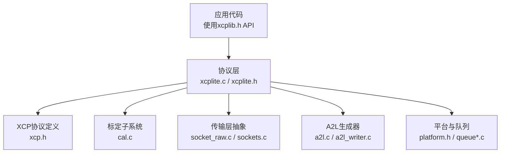
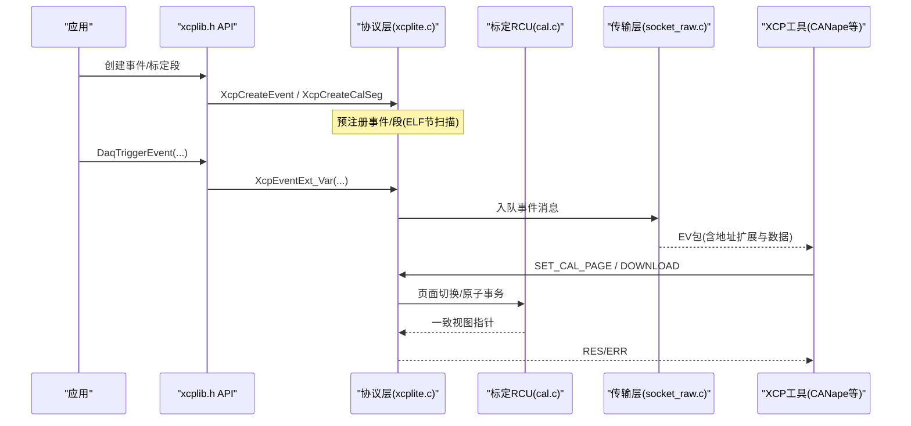
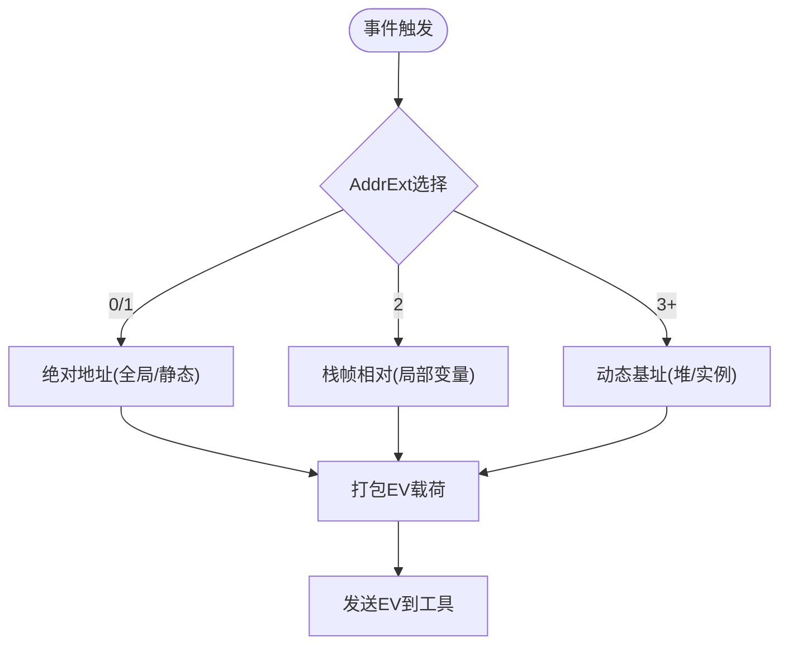
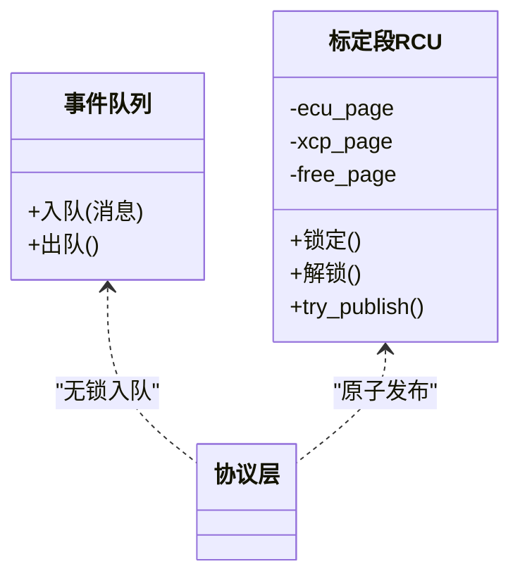
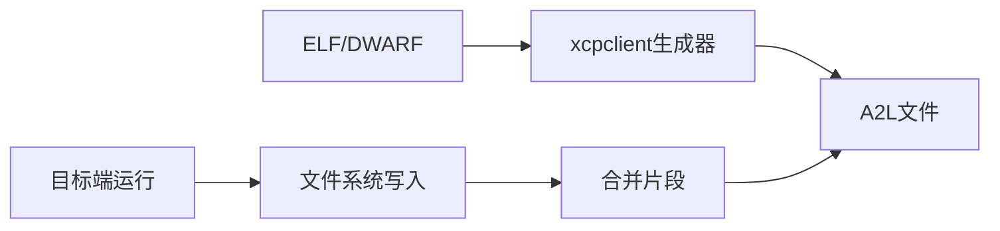
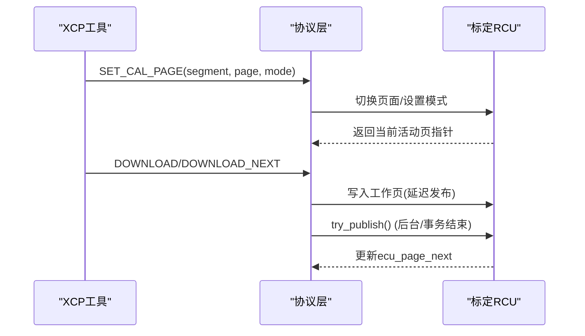
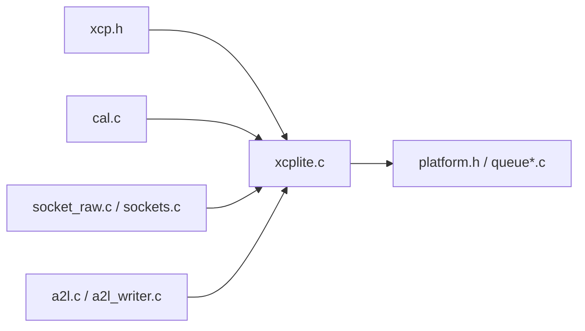

# XCPlite核心特性

<cite>
**本文引用的文件**
- [README.md](file://README.md)
- [TECHNICAL.md](file://docs/TECHNICAL.md)
- [OFFLINE_A2L.md](file://docs/OFFLINE_A2L.md)
- [CAL_RCU.md](file://docs/CAL_RCU.md)
- [xcplib.h](file://inc/xcplib.h)
- [xcplite.h](file://src/xcplite.h)
- [xcp.h](file://src/xcp.h)
- [cal.c](file://src/cal.c)
- [xcplite.c](file://src/xcplite.c)
</cite>

## 目录
1. [简介](#简介)
2. [项目结构](#项目结构)
3. [核心组件](#核心组件)
4. [架构总览](#架构总览)
5. [详细组件分析](#详细组件分析)
6. [依赖关系分析](#依赖关系分析)
7. [性能考量](#性能考量)
8. [故障排查指南](#故障排查指南)
9. [结论](#结论)
10. [附录](#附录)

## 简介
XCPlite将传统嵌入式微控制器上的XCP数据采集与标定协议，扩展到现代多核微处理器和系统级芯片（SoC），支持POSIX系统（Linux、QNX等）与实时操作系统（FreeRTOS、ThreadX）。其面向以太网传输层（TCP/UDP，支持巨型帧），通过相对寻址、无锁线程安全、确定性运行时与零拷贝内存策略，实现高并发、低延迟的测量与标定。同时提供运行时与构建时A2L生成、复杂数据类型支持、校准段管理与PTP时间戳能力，满足现代HPC应用对可观测性与参数调优的需求。

**章节来源**
- [README.md:7-29](file://README.md#L7-L29)

## 项目结构
XCPlite采用分层组织：公共API头文件位于inc/，协议与传输层实现在src/，示例与文档在examples/与docs/。核心模块包括：
- 协议层：xcp.h定义XCP命令与响应格式；xcplite.c实现协议状态机与事件/DAQ管理；xcplite.h暴露内部接口。
- 标定子系统：cal.c实现校准段RCU与页面切换、冻结与持久化。
- A2L生成：a2l.c/a2l_writer.c配合ELF/DWARF标记进行离线或目标端生成。
- 传输层：socket_raw.c/sockets.c等抽象以太网套接字收发。
- 配置与平台适配：xcplib_cfg.h、platform.h等。

**图示来源**
- [xcplite.c:188-194](file://src/xcplite.c#L188-L194)
- [xcp.h:25-130](file://src/xcp.h#L25-L130)
- [cal.c:122-180](file://src/cal.c#L122-L180)
- [xcplite.h:385-423](file://src/xcplite.h#L385-L423)

**章节来源**
- [xcplite.c:188-194](file://src/xcplite.c#L188-L194)
- [xcp.h:25-130](file://src/xcp.h#L25-L130)
- [cal.c:122-180](file://src/cal.c#L122-L180)
- [xcplite.h:385-423](file://src/xcplite.h#L385-L423)

## 核心组件
- 协议层与事件/DAQ：维护会话、事件列表、DAQ表与溢出计数，支持事件触发、时间戳与多核并发。
- 标定段RCU：单写者多读者模型，基于三页缓冲（ecu_page、xcp_page、free_page）实现无锁读取与原子发布。
- A2L生成：目标端文件系统写入与合并，或离线从ELF/DWARF解析生成，支持复杂类型与元数据。
- 传输层：以太网套接字抽象，支持TCP/UDP与巨型帧，队列缓冲控制背压。
- 平台适配：原子操作、线程本地存储、互斥量、时钟与套接字封装。

**章节来源**
- [xcplite.h:385-423](file://src/xcplite.h#L385-L423)
- [CAL_RCU.md:94-185](file://docs/CAL_RCU.md#L94-L185)
- [OFFLINE_A2L.md:13-33](file://docs/OFFLINE_A2L.md#L13-L33)
- [TECHNICAL.md:356-394](file://docs/TECHNICAL.md#L356-L394)

## 架构总览
XCPlite以协议层为核心，向上暴露API供应用注入测量点与标定对象，向下对接传输层与平台服务。事件触发路径走无锁队列，标定访问通过RCU保证一致性，A2L生成可在目标端或构建时完成。

**图示来源**
- [xcplib.h:408-420](file://inc/xcplib.h#L408-L420)
- [xcplite.h:183-195](file://src/xcplite.h#L183-L195)
- [cal.c:122-180](file://src/cal.c#L122-L180)
- [xcp.h:132-183](file://src/xcp.h#L132-L183)

## 详细组件分析

### 相对寻址模式
XCPlite广泛使用相对寻址，通过地址扩展（AddrExt）区分绝对、校准段相对、栈帧相对与动态基址等多种模式。默认方案为CASDD（校准段相对优先），亦支持ACSDD（绝对优先）、AXSDD（无校准段管理）与CXSDD（多应用共享内存模式）。该机制使测量与标定可覆盖全局、栈、堆与线程局部变量，无需复制数据。

**图示来源**
- [TECHNICAL.md:269-313](file://docs/TECHNICAL.md#L269-L313)
- [xcplib.h:572-642](file://inc/xcplib.h#L572-L642)

**章节来源**
- [TECHNICAL.md:269-313](file://docs/TECHNICAL.md#L269-L313)
- [xcplib.h:572-642](file://inc/xcplib.h#L572-L642)

### 线程安全无锁设计
- 事件触发与DAQ：生产者侧无锁入队，消费者侧按配置可能使用互斥保护计数器递增，避免阻塞与争用。
- 标定访问：读路径无锁等待自由，写路径单写者模型，通过RCU三页缓冲与原子指针交换实现一致性发布。
- 事件/段注册：创建阶段使用互斥保护列表一致性，但访问路径保持无锁。

**图示来源**
- [xcplite.h:385-423](file://src/xcplite.h#L385-L423)
- [CAL_RCU.md:94-185](file://docs/CAL_RCU.md#L94-L185)

**章节来源**
- [TECHNICAL.md:28-52](file://docs/TECHNICAL.md#L28-L52)
- [CAL_RCU.md:94-185](file://docs/CAL_RCU.md#L94-L185)

### 确定性运行时性能
- 静态内存为主：DAQ表、校准段页等静态分配，仅传输队列按需堆分配。
- 零拷贝：直接访问原始ABI内存，避免缓冲与重序列化。
- 可预测执行时间：无锁路径与固定开销的事件触发，适合硬实时场景。

**章节来源**
- [TECHNICAL.md:5-25](file://docs/TECHNICAL.md#L5-L25)
- [README.md:13-20](file://README.md#L13-L20)

### 内存管理策略（静态内存使用、零拷贝）
- 静态内存：XAQ表、校准段页、协议状态等尽量静态分配，降低碎片与抖动。
- 堆内存：仅用于传输队列与必要临时缓冲，大小由初始化参数控制。
- 零拷贝：事件与标定数据直接映射到目标内存布局，减少CPU与带宽占用。

**章节来源**
- [TECHNICAL.md:5-25](file://docs/TECHNICAL.md#L5-L25)
- [xcplite.h:385-423](file://src/xcplite.h#L385-L423)

### A2L文件生成机制（运行时与构建时）
- 目标端运行时：通过文件系统打开多个片段并合并，支持一次性执行模式与冻结持久化。
- 构建时离线：xcpclient工具从ELF/DWARF解析事件、校准段、元数据与捕获结构，生成完整A2L，兼容复杂类型与相对寻址。
- 节与标记：xcp_evts、xcp_cals、xcp_meta、trg__<modes>__<event>锚点等构成契约，确保工具与库的一致性。

**图示来源**
- [OFFLINE_A2L.md:13-33](file://docs/OFFLINE_A2L.md#L13-L33)
- [TECHNICAL.md:56-101](file://docs/TECHNICAL.md#L56-L101)

**章节来源**
- [OFFLINE_A2L.md:13-33](file://docs/OFFLINE_A2L.md#L13-L33)
- [TECHNICAL.md:56-101](file://docs/TECHNICAL.md#L56-L101)

### 复杂数据类型支持
- 基本类型、结构体、数组与嵌套结构均受支持，DWARF信息映射为A2L TYPEDEF_STRUCTURE与INSTANCE。
- 捕获结构（capture struct）允许寄存器变量参与测量，成员名带尾下划线并由工具还原。
- 限制：联合体、位域、函数指针、多维数组（>2维）等不被完全支持或降级处理。

**章节来源**
- [OFFLINE_A2L.md:215-243](file://docs/OFFLINE_A2L.md#L215-L243)
- [xcplib.h:676-757](file://inc/xcplib.h#L676-L757)

### 校准段管理（页面切换、原子修改、持久化）
- 页面切换：支持参考页与工作页切换，冻结命令将工作页回写到持久化文件。
- 原子事务：begin/end原子校准保证一致性，写路径收集变更并在可用时发布。
- 持久化：二进制BIN文件保存工作页内容，启动时加载以恢复确定性顺序与数据。

**图示来源**
- [xcp.h:612-681](file://src/xcp.h#L612-L681)
- [CAL_RCU.md:94-185](file://docs/CAL_RCU.md#L94-L185)

**章节来源**
- [CAL_RCU.md:94-185](file://docs/CAL_RCU.md#L94-L185)
- [xcp.h:612-681](file://src/xcp.h#L612-L681)

### 与POSIX系统与RTOS的兼容性
- POSIX：使用pthread_create/join/cancel、nanosleep、clock_gettime、socket等系统调用，支持多线程与以太网传输。
- RTOS：FreeRTOS/ThreadX示例展示在MCU与模拟器上的适配，队列与互斥量由平台抽象提供。
- 线程本地存储：_Thread_local或编译器扩展用于每线程事件句柄与查找缓存。

**章节来源**
- [TECHNICAL.md:356-394](file://docs/TECHNICAL.md#L356-L394)
- [xcplib.h:288-301](file://inc/xcplib.h#L288-L301)

### PTP时间戳支持
- 协议层预留PTP时钟信息与主时钟信息字段，支持高精度时间同步场景。
- DAQ时间戳模式与单位可配置，结合外部PTP源可实现纳秒级对齐。

**章节来源**
- [xcplite.h:474-493](file://src/xcplite.h#L474-L493)
- [xcp.h:742-778](file://src/xcp.h#L742-L778)

## 依赖关系分析
- 协议层依赖xcp.h定义的命令/响应结构，以及平台抽象（原子、互斥、时钟、套接字）。
- 标定子系统依赖RCU算法与持久化接口，与协议层通过回调与状态交互。
- A2L生成依赖ELF/DWARF解析与文件系统，或目标端运行时写入。
- 传输层抽象屏蔽具体网络栈差异，提供统一队列与发送接口。

**图示来源**
- [xcp.h:25-130](file://src/xcp.h#L25-L130)
- [cal.c:122-180](file://src/cal.c#L122-L180)
- [xcplite.c:188-194](file://src/xcplite.c#L188-L194)

**章节来源**
- [xcp.h:25-130](file://src/xcp.h#L25-L130)
- [cal.c:122-180](file://src/cal.c#L122-L180)
- [xcplite.c:188-194](file://src/xcplite.c#L188-L194)

## 性能考量
- 资源占用：释放版约160KB，静态内存约10KB，堆内存约32KB（队列），每线程栈约1KB。
- 触发成本：DAQ触发与数据传输为无锁实现，首次事件查找可能缓存于静态或线程本地存储。
- 优化建议：合理设置队列大小以覆盖峰值流量；避免内联事件触发函数以保证栈帧相对寻址正确性；使用捕获结构减少volatile带来的额外开销。

**章节来源**
- [TECHNICAL.md:5-25](file://docs/TECHNICAL.md#L5-L25)
- [TECHNICAL.md:28-52](file://docs/TECHNICAL.md#L28-L52)
- [xcplib.h:357-366](file://inc/xcplib.h#L357-L366)

## 故障排查指南
- 事件未出现：检查是否使用了DaqCreateEvent/DaqTriggerEvent宏而非C API；确认函数未被内联；验证trg__<modes>__<event>锚点存在。
- 校准段地址错误：确认目标寻址模式（CASDD/ACSDD）与A2L project_no匹配；默认页需静态生命周期且在32位地址范围内（ACSDD）。
- A2L生成失败：确保构建包含调试信息；macOS需从Linux构建ELF；检查EPK匹配与节符号完整性。
- 性能抖动：增大传输队列；减少事件触发频率；避免在高争用路径中频繁创建事件/段。

**章节来源**
- [OFFLINE_A2L.md:244-269](file://docs/OFFLINE_A2L.md#L244-L269)
- [TECHNICAL.md:269-313](file://docs/TECHNICAL.md#L269-L313)
- [TECHNICAL.md:56-101](file://docs/TECHNICAL.md#L56-L101)

## 结论
XCPlite通过相对寻址、无锁线程安全、确定性运行时与零拷贝策略，成功将XCP从传统MCU扩展到现代多核SoC与RTOS环境。其灵活的A2L生成机制、复杂类型支持与校准段RCU管理，为高并发、低延迟的测量与标定提供了坚实基础。结合PTP时间戳与以太网传输，XCPlite适用于汽车电子、工业控制与高性能计算等场景。

## 附录
- 示例与工具：examples/提供多种用法演示；tools/xcpclient支持离线A2L生成与测试。
- 配置选项：xcplib_cfg.h与xcptl_cfg.h控制功能开关与资源上限。
- 兼容性：遵循XCP >1.4，与CANape、CANoe等ASAM工具互通。

**章节来源**
- [README.md:53-99](file://README.md#L53-L99)
- [xcplib_cfg.h](file://src/xcplib_cfg.h)
- [xcptl_cfg.h](file://src/xcptl_cfg.h)