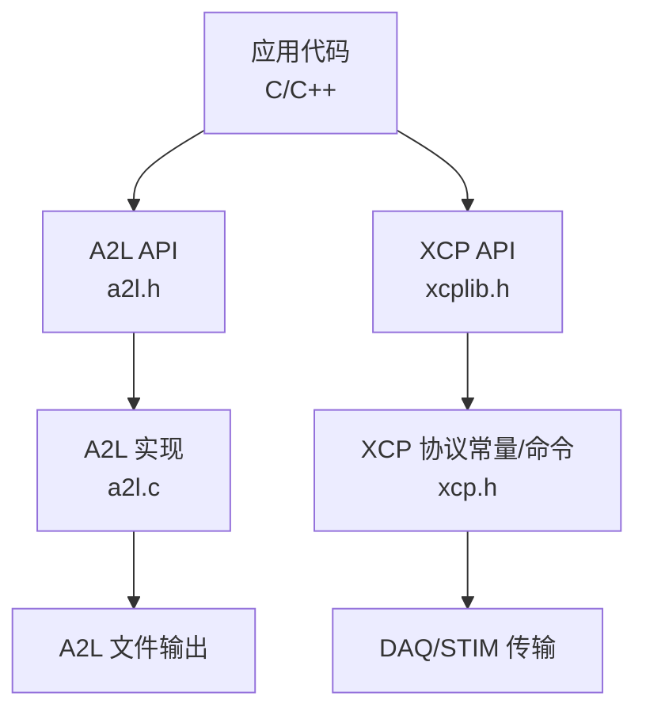
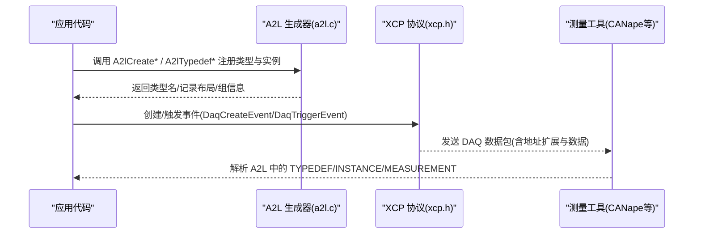
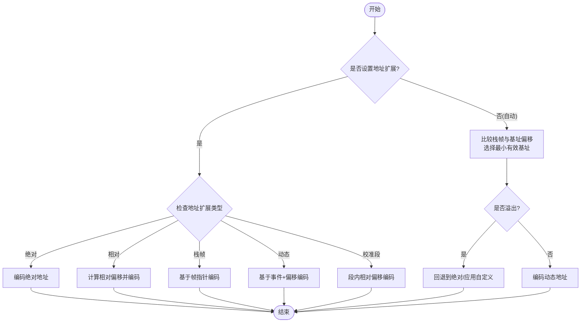
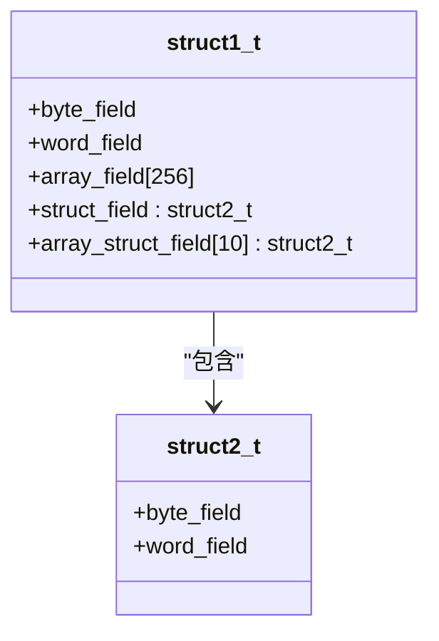
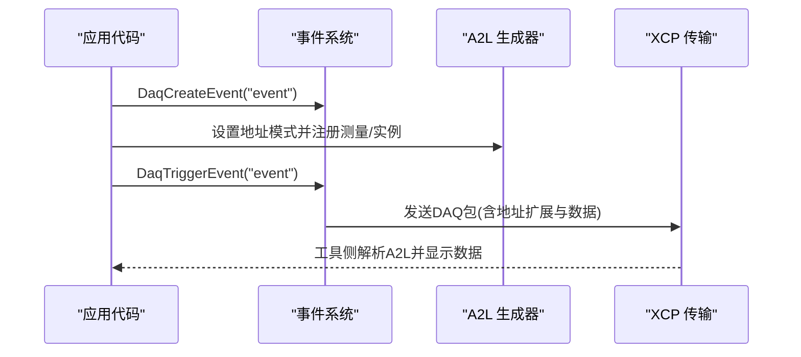
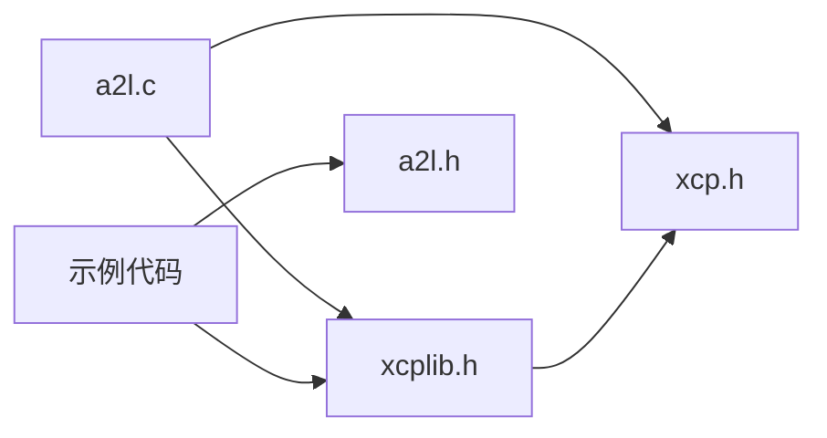

# 复杂数据类型支持

<cite>
**本文引用的文件**
- [inc/xcplib.h](file://inc/xcplib.h)
- [inc/a2l.h](file://inc/a2l.h)
- [src/a2l.c](file://src/a2l.c)
- [examples/struct_demo/src/main.c](file://examples/struct_demo/src/main.c)
- [examples/struct_demo/CANape/xcp_demo_autodetect.a2l](file://examples/struct_demo/CANape/xcp_demo_autodetect.a2l)
- [examples/cpp_demo/src/main.cpp](file://examples/cpp_demo/src/main.cpp)
- [examples/cpp_demo/src/lookup.hpp](file://examples/cpp_demo/src/lookup.hpp)
- [docs/info/CPP_TYPE_TRAITS_GUIDE.md](file://docs/info/CPP_TYPE_TRAITS_GUIDE.md)
</cite>

## 目录
1. [简介](#简介)
2. [项目结构](#项目结构)
3. [核心组件](#核心组件)
4. [架构总览](#架构总览)
5. [详细组件分析](#详细组件分析)
6. [依赖关系分析](#依赖关系分析)
7. [性能考量](#性能考量)
8. [故障排查指南](#故障排查指南)
9. [结论](#结论)
10. [附录](#附录)

## 简介
本技术文档聚焦于 XCPlite 对复杂数据类型的完整支持，涵盖基本类型、结构体、数组与嵌套结构的测量与标定能力；阐述 ABI 兼容性、内存布局处理与数据传输优化；说明共享轴引用、TYPEDEF 定义等高级特性；给出在 C 与 C++ 环境中正确定义和使用复杂数据结构的实践示例；并说明与测量工具的兼容要求，以及如何处理动态长度数据结构与多维数组。

## 项目结构
XCPlite 的复杂数据类型支持由“应用层接口 + A2L 生成器 + XCP 协议”三层协作完成：
- 应用层接口（inc/xcplib.h）：提供事件创建、触发、校准段管理、地址模式辅助宏等。
- A2L 生成器（inc/a2l.h, src/a2l.c）：负责类型推断、地址编码、A2L 输出（含 TYPEDEF、实例、曲线/矩阵、共享轴等）。
- 示例工程（examples/*）：演示在 C/C++ 中如何声明结构体、数组、嵌套结构，并通过 A2L 生成与事件触发进行测量/标定。

图表来源
- [inc/xcplib.h:39-57](file://inc/xcplib.h#L39-L57)
- [inc/a2l.h:323-476](file://inc/a2l.h#L323-L476)
- [src/a2l.c:710-876](file://src/a2l.c#L710-L876)
- [src/xcp.h:19-130](file://src/xcp.h#L19-L130)

章节来源
- [inc/xcplib.h:39-57](file://inc/xcplib.h#L39-L57)
- [inc/a2l.h:323-476](file://inc/a2l.h#L323-L476)
- [src/a2l.c:710-876](file://src/a2l.c#L710-L876)
- [src/xcp.h:19-130](file://src/xcp.h#L19-L130)

## 核心组件
- 类型检测与映射
  - C++：模板元编程将 C++ 基础类型映射为 A2L 类型 ID（如 int->SWORD，double->FLOAT64_IEEE）。
  - C：通过 _Generic 与指针重载函数推导表达式类型。
- 地址模式与偏移计算
  - 绝对/相对/栈帧/动态/校准段相对等多种寻址模式，自动选择最优模式并编码为 ECU_ADDRESS_EXTENSION。
- 复杂类型建模
  - TYPEDEF_BEGIN/END 描述结构体布局；Component 宏注册字段、数组、嵌套结构、曲线/矩阵。
  - 实例化：A2lCreateTypedefInstance/Array/Reference 将具体对象以 TYPEDEF 形式暴露给工具。
- 共享轴与曲线/矩阵
  - 通过 A2lCreateAxis 与 WithSharedAxis 系列宏，实现多曲线/矩阵共享同一坐标轴。
- 事件与测量
  - DaqCreateEvent/DaqTriggerEvent 配合 A2L 中的 MEASUREMENT/INSTANCE，实现按事件采集。

章节来源
- [inc/a2l.h:99-321](file://inc/a2l.h#L99-L321)
- [inc/a2l.h:323-476](file://inc/a2l.h#L323-L476)
- [inc/xcplib.h:239-479](file://inc/xcplib.h#L239-L479)
- [src/a2l.c:125-200](file://src/a2l.c#L125-L200)

## 架构总览
下图展示了从应用代码到 A2L 输出与 XCP 传输的整体流程，重点体现复杂类型在 A2L 中的建模与运行时触发采集。

图表来源
- [inc/a2l.h:323-476](file://inc/a2l.h#L323-L476)
- [inc/xcplib.h:239-479](file://inc/xcplib.h#L239-L479)
- [src/xcp.h:19-130](file://src/xcp.h#L19-L130)

## 详细组件分析

### 类型检测与 ABI 兼容
- C++ 类型特征
  - 使用模板特化将基础类型映射为 A2L 类型 ID；提供 RemoveCVRef 去除 const/volatile 引用，确保类型纯净。
  - 通过 GetTypeIdFromExpr 支持数组元素类型推导（一维/二维）。
- C 类型推导
  - 利用 _Generic 与一组重载函数，根据指针类型推导 A2L 类型 ID。
- ABI 与对齐
  - 通过 static_assert 校验基本类型大小；结构体成员偏移由 offsetof 或显式计算得到，保证与编译器布局一致。
  - 示例中 struct2_t/struct1_t 使用 static_assert 验证布局与尺寸，避免跨平台差异导致的错位。

章节来源
- [inc/a2l.h:99-321](file://inc/a2l.h#L99-L321)
- [examples/struct_demo/src/main.c:32-60](file://examples/struct_demo/src/main.c#L32-L60)
- [docs/info/CPP_TYPE_TRAITS_GUIDE.md:16-163](file://docs/info/CPP_TYPE_TRAITS_GUIDE.md#L16-L163)

### 地址模式与内存布局处理
- 四种寻址模式
  - 绝对：全局/静态变量直接编码为 ECU_ADDRESS。
  - 相对：基于基址（堆对象/类成员）计算偏移。
  - 栈帧：基于 xcp_get_frame_addr() 获取帧基址，捕获局部变量。
  - 动态：结合事件与地址扩展位，支持运行时基址切换。
- 自动寻址
  - 当未指定地址扩展时，A2L 生成器比较栈帧与基址，选择较小且无溢出的方式；溢出时回退至绝对或应用自定义模式。
- 校准段相对
  - 支持以校准段为基址的相对寻址，限制偏移范围并转换为最终地址。

图表来源
- [src/a2l.c:710-876](file://src/a2l.c#L710-L876)
- [inc/xcplib.h:485-556](file://inc/xcplib.h#L485-L556)

章节来源
- [src/a2l.c:710-876](file://src/a2l.c#L710-L876)
- [inc/xcplib.h:485-556](file://inc/xcplib.h#L485-L556)

### 复杂对象建模：TYPEDEF、实例与嵌套结构
- TYPEDEF 定义
  - 使用 A2lTypedefBegin/End 包裹结构体描述；内部通过 Component 宏注册标量、数组、嵌套结构、曲线/矩阵。
- 实例化
  - A2lCreateTypedefInstance/Array/Reference 将具体对象以 TYPEDEF 形式暴露，工具可识别其成员与维度。
- 嵌套与数组
  - 支持结构体中包含数组与结构体，以及结构体数组；示例中 struct1_t 包含字节、字、数组、结构体与结构体数组。

图表来源
- [examples/struct_demo/src/main.c:32-60](file://examples/struct_demo/src/main.c#L32-L60)
- [examples/struct_demo/CANape/xcp_demo_autodetect.a2l:23-33](file://examples/struct_demo/CANape/xcp_demo_autodetect.a2l#L23-L33)

章节来源
- [inc/a2l.h:472-577](file://inc/a2l.h#L472-L577)
- [examples/struct_demo/src/main.c:93-106](file://examples/struct_demo/src/main.c#L93-L106)
- [examples/struct_demo/CANape/xcp_demo_autodetect.a2l:23-33](file://examples/struct_demo/CANape/xcp_demo_autodetect.a2l#L23-L33)

### 共享轴与曲线/矩阵
- 共享轴
  - 通过 A2lCreateAxis 创建独立轴对象；曲线/矩阵可通过 WithSharedAxis 宏引用该轴，实现多曲线共用坐标。
- 多维数组
  - 支持二维矩阵测量与标定；类型推导自动识别元素类型与维度。
- 工具兼容
  - 共享轴功能需要较新工具版本（例如 CANape 24），否则需降级为默认轴。

章节来源
- [inc/a2l.h:390-408](file://inc/a2l.h#L390-L408)
- [examples/cpp_demo/src/lookup.hpp:14-30](file://examples/cpp_demo/src/lookup.hpp#L14-L30)

### 事件触发与数据采集
- 事件创建与触发
  - 使用 DaqCreateEvent 创建事件；DaqTriggerEvent/DaqTriggerEventExt 触发采集，支持栈帧/相对/绝对多种地址模式。
- 捕获局部变量
  - 通过捕获宏将寄存器变量拷贝到栈上结构体，再作为地址扩展 3 传递，供离线 A2L 生成器展开并注册。
- 线程安全
  - 事件列表与 A2L 状态提供一次性执行与互斥保护，避免并发注册冲突。

图表来源
- [inc/xcplib.h:239-479](file://inc/xcplib.h#L239-L479)
- [inc/a2l.h:323-476](file://inc/a2l.h#L323-L476)

章节来源
- [inc/xcplib.h:239-479](file://inc/xcplib.h#L239-L479)
- [inc/a2l.h:323-476](file://inc/a2l.h#L323-L476)

### 校准段与参数访问
- 校准段创建与管理
  - 使用 CalSegDecl/CalSegCreate 等宏在链接期或运行期注册校准段；支持工作页/参考页切换、校验和与持久化。
- 安全访问
  - 通过 lock/unlock 机制获得一致的视图，避免 XCP 修改期间的竞态。
- A2L 集成
  - 校准段可作为 TYPEDEF 实例暴露，便于工具进行标定操作。

章节来源
- [inc/xcplib.h:61-139](file://inc/xcplib.h#L61-L139)
- [inc/xcplib.h:144-234](file://inc/xcplib.h#L144-L234)
- [examples/cpp_demo/src/main.cpp:117-128](file://examples/cpp_demo/src/main.cpp#L117-L128)

## 依赖关系分析
- 模块耦合
  - a2l.c 依赖 xcplib.h 的事件与地址辅助宏；同时依赖 xcp.h 的协议常量与命令。
  - 示例代码依赖 a2l.h 与 xcplib.h 提供的接口进行类型注册与事件触发。
- 外部依赖
  - 工具链：CANape 等需支持 A2L 标准及共享轴特性（部分特性需新版本）。
  - 平台：不同平台的 section 属性与事件 ID 生成策略存在差异（ELF/Mach-O/MSVC）。

图表来源
- [src/a2l.c:1-33](file://src/a2l.c#L1-L33)
- [inc/a2l.h:1-54](file://inc/a2l.h#L1-L54)
- [inc/xcplib.h:1-35](file://inc/xcplib.h#L1-L35)
- [src/xcp.h:1-20](file://src/xcp.h#L1-L20)

章节来源
- [src/a2l.c:1-33](file://src/a2l.c#L1-L33)
- [inc/a2l.h:1-54](file://inc/a2l.h#L1-L54)
- [inc/xcplib.h:1-35](file://inc/xcplib.h#L1-L35)
- [src/xcp.h:1-20](file://src/xcp.h#L1-L20)

## 性能考量
- 零开销类型推导
  - C++ 模板元编程在编译期完成类型映射，无运行时成本。
- 高效地址编码
  - 自动寻址在首次计算后缓存结果；动态地址仅在必要时重新计算。
- 事件触发优化
  - 捕获宏避免强制将变量驻留内存，仅复制必要值；触发路径尽量无锁。
- 队列与缓冲
  - 测量队列大小影响吞吐与延迟，需根据总线带宽与 CPU 负载合理配置。

## 故障排查指南
- 地址溢出
  - 现象：A2L 生成时报地址溢出错误。
  - 原因：动态/相对偏移超出位数限制或基址选择不当。
  - 处理：调整基址或使用绝对模式；检查自动寻址日志。
- 类型不匹配
  - 现象：A2L 中类型名不正确或工具无法识别。
  - 原因：C/C++ 类型推导失败或未覆盖的类型。
  - 处理：确认类型是否在映射表中；必要时扩展类型推导。
- 共享轴不可用
  - 现象：工具无法识别共享轴。
  - 原因：工具版本过低。
  - 处理：升级工具或使用默认轴。
- 事件未触发
  - 现象：工具未收到数据。
  - 原因：事件未创建或未启用；地址模式错误。
  - 处理：检查事件创建与触发宏；确认地址模式与基址。

章节来源
- [src/a2l.c:710-876](file://src/a2l.c#L710-L876)
- [inc/xcplib.h:239-479](file://inc/xcplib.h#L239-L479)

## 结论
XCPlite 通过类型推导、灵活地址模式与强大的 A2L 生成能力，为复杂数据类型提供了完整的测量与标定支持。借助 TYPEDEF、共享轴与事件机制，开发者可在 C/C++ 中以直观方式定义与使用结构体、数组与嵌套结构，并与主流测量工具无缝集成。合理配置地址模式与事件触发路径，可获得稳定高效的采集性能。

## 附录

### 实际代码示例与用法要点
- C 环境：结构体与数组测量
  - 定义结构体与数组，使用 A2lTypedefBegin/End 描述类型，再通过 A2lCreateTypedefInstance/Array 注册实例；设置栈帧/绝对/相对地址模式并触发事件。
  - 参考路径：[examples/struct_demo/src/main.c:93-170](file://examples/struct_demo/src/main.c#L93-L170)
- C++ 环境：校准段与复杂参数
  - 使用 CalSegCreate 包装结构体参数，A2lTypedefBegin/End 描述类型，并在主循环中安全访问与测量。
  - 参考路径：[examples/cpp_demo/src/main.cpp:117-128](file://examples/cpp_demo/src/main.cpp#L117-L128)
- 共享轴与曲线
  - 通过 A2lCreateAxis 与 WithSharedAxis 宏实现多曲线共享坐标轴；注意工具版本要求。
  - 参考路径：[inc/a2l.h:390-408](file://inc/a2l.h#L390-L408), [examples/cpp_demo/src/lookup.hpp:14-30](file://examples/cpp_demo/src/lookup.hpp#L14-L30)

章节来源
- [examples/struct_demo/src/main.c:93-170](file://examples/struct_demo/src/main.c#L93-L170)
- [examples/cpp_demo/src/main.cpp:117-128](file://examples/cpp_demo/src/main.cpp#L117-L128)
- [inc/a2l.h:390-408](file://inc/a2l.h#L390-L408)
- [examples/cpp_demo/src/lookup.hpp:14-30](file://examples/cpp_demo/src/lookup.hpp#L14-L30)

### 与测量工具的兼容性要求
- A2L 标准：遵循 ASAM MCD-2 MC，支持 TYPEDEF、INSTANCE、MEASUREMENT、GROUP、CONVERSION 等。
- 共享轴：需要较新工具版本（如 CANape 24）以识别共享轴；否则回退为默认轴。
- 事件与时间戳：支持固定/可变周期事件与时间戳，需在 IF_DATA 中声明。

章节来源
- [examples/struct_demo/CANape/xcp_demo_autodetect.a2l:118-168](file://examples/struct_demo/CANape/xcp_demo_autodetect.a2l#L118-L168)

### 动态长度数据结构与多维数组处理
- 动态长度
  - 建议通过结构体封装长度与数据指针，并使用相对/动态地址模式；A2L 中记录长度字段以便工具解析。
- 多维数组
  - 使用 A2lCreateMeasurementMatrix/PhysMeasurementMatrix 或 TYPEDEF 中的矩阵组件；类型推导自动识别元素类型与维度。

章节来源
- [inc/a2l.h:438-470](file://inc/a2l.h#L438-L470)
- [inc/a2l.h:549-577](file://inc/a2l.h#L549-L577)