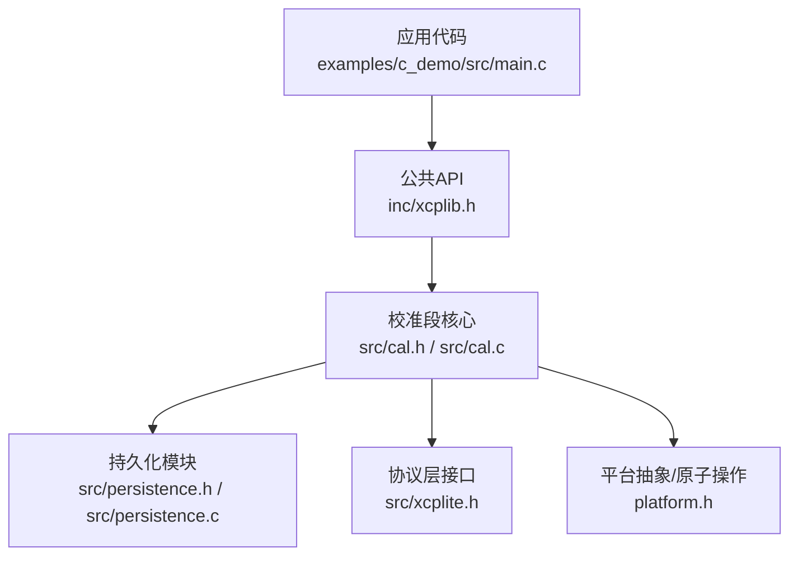
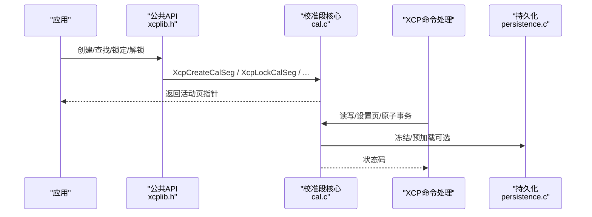
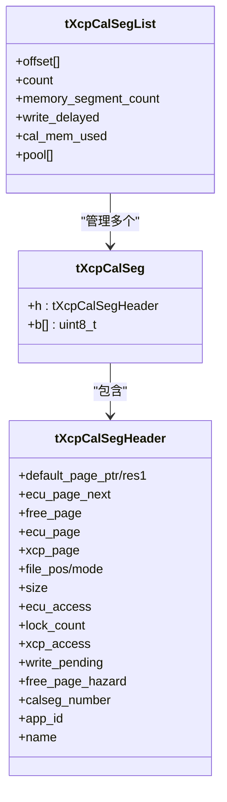
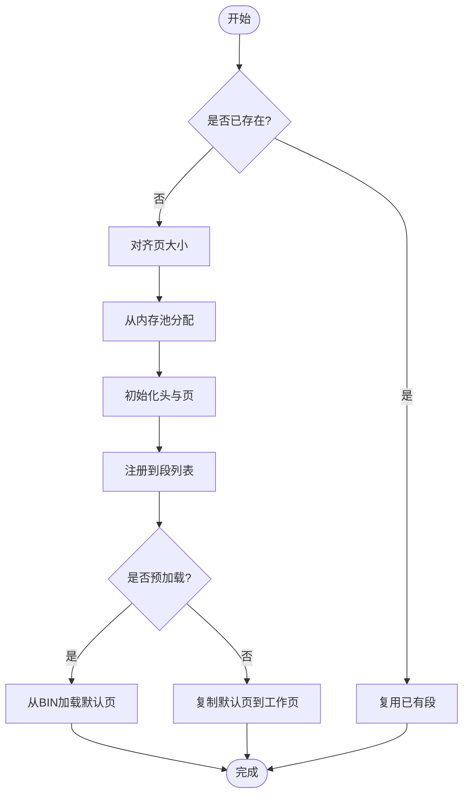
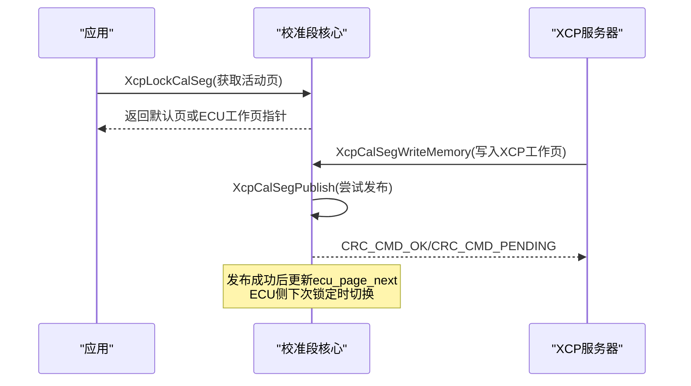
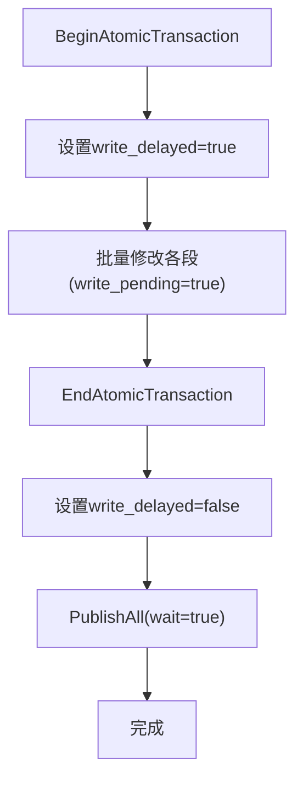
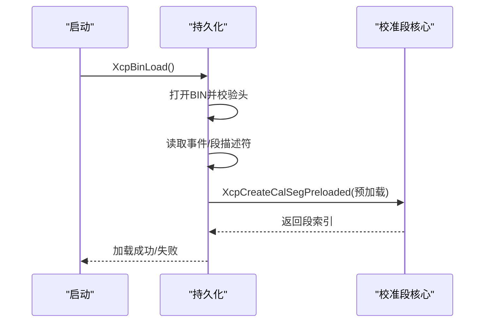
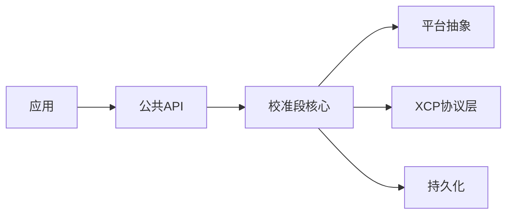

# 校准段管理

<cite>
**本文引用的文件**
- [cal.h](file://src/cal.h)
- [cal.c](file://src/cal.c)
- [persistence.h](file://src/persistence.h)
- [persistence.c](file://src/persistence.c)
- [xcplib.h](file://inc/xcplib.h)
- [xcplite.h](file://src/xcplite.h)
- [main.c（c_demo）](file://examples/c_demo/src/main.c)
</cite>

## 目录
1. [简介](#简介)
2. [项目结构](#项目结构)
3. [核心组件](#核心组件)
4. [架构总览](#架构总览)
5. [详细组件分析](#详细组件分析)
6. [依赖关系分析](#依赖关系分析)
7. [性能考量](#性能考量)
8. [故障排查指南](#故障排查指南)
9. [结论](#结论)
10. [附录：最佳实践与工作流程](#附录最佳实践与工作流程)

## 简介
本技术文档聚焦于 XCPlite 的“校准段管理”能力，系统性阐述以下主题：
- 校准段的创建、注册与生命周期控制
- 页切换机制（参考页/工作页/空闲页）与原子修改保证
- 持久化存储（二进制 BIN 文件）的加载、冻结与回滚策略
- 版本管理与数据一致性保障
- 内存布局优化与访问权限控制
- 实际校准工作流程示例（定义、修改、保存）
- 与测量工具（如 CANape）的集成配置与自动化流程

## 项目结构
校准段管理由以下关键模块组成：
- 校准段核心：cal.h / cal.c
- 持久化：persistence.h / persistence.c
- 公共 API：inc/xcplib.h
- 协议层接口：src/xcplite.h
- 示例应用：examples/c_demo/src/main.c

图表来源
- [cal.h:1-318](file://src/cal.h#L1-L318)
- [cal.c:1-1140](file://src/cal.c#L1-L1140)
- [persistence.h:1-53](file://src/persistence.h#L1-L53)
- [persistence.c:1-554](file://src/persistence.c#L1-L554)
- [xcplib.h:60-235](file://inc/xcplib.h#L60-L235)
- [xcplite.h:46-77](file://src/xcplite.h#L46-L77)

章节来源
- [cal.h:1-318](file://src/cal.h#L1-L318)
- [cal.c:1-1140](file://src/cal.c#L1-L1140)
- [persistence.h:1-53](file://src/persistence.h#L1-L53)
- [persistence.c:1-554](file://src/persistence.c#L1-L554)
- [xcplib.h:60-235](file://inc/xcplib.h#L60-L235)
- [xcplite.h:46-77](file://src/xcplite.h#L46-L77)

## 核心组件
- 校准段数据结构与列表
  - tXcpCalSegHeader：包含页偏移、访问模式、锁计数、持久化位置等元信息
  - tXcpCalSeg：头部 + 可变长度页缓冲区（默认页、ECU工作页、XCP工作页、空闲交换页）
  - tXcpCalSegList：全局段列表、内存池、计数器等
- 页面与访问模式
  - 默认页（Reference Page）：只读或作为初始值源
  - ECU工作页（RAM）：运行时被应用读取/写入
  - XCP工作页：供XCP客户端读写
  - 空闲页：用于RCU发布时的临时缓冲
- 原子事务与延迟写
  - Begin/End 原子事务：批量修改后统一发布，避免中间态暴露
  - 延迟写标志：在事务期间标记 write_pending，结束时批量发布
- 持久化
  - 二进制BIN文件：记录事件、校准段描述符与页数据
  - 预加载：启动时从BIN恢复默认页或工作页
  - 冻结：将当前工作页固化到BIN中，成为下次启动的默认页

章节来源
- [cal.h:86-175](file://src/cal.h#L86-L175)
- [cal.c:185-615](file://src/cal.c#L185-L615)
- [persistence.h:30-47](file://src/persistence.h#L30-L47)
- [persistence.c:45-95](file://src/persistence.c#L45-L95)

## 架构总览
校准段管理的整体交互如下：
- 应用通过公共API创建/查找/锁定/解锁校准段
- 校准段核心维护多页结构与RCU发布逻辑
- XCP命令处理器调用校准段读写、页切换、原子事务
- 持久化模块负责BIN文件的读写与预加载

图表来源
- [xcplib.h:70-139](file://inc/xcplib.h#L70-L139)
- [cal.c:375-503](file://src/cal.c#L375-L503)
- [cal.c:623-767](file://src/cal.c#L623-L767)
- [persistence.c:248-318](file://src/persistence.c#L248-L318)

## 详细组件分析

### 校准段数据结构与内存布局
- 头结构体固定为64字节，对齐至8字节，确保原子访问安全
- 页偏移以uint32_t字节偏移存储，支持跨进程共享内存（POSIX SHM）场景
- 绝对地址模式与相对地址模式下的页宏定义不同，影响默认页指针与偏移计算
- 内存池采用线程安全的bump分配器，按8字节对齐分配

图表来源
- [cal.h:86-175](file://src/cal.h#L86-L175)

章节来源
- [cal.h:86-175](file://src/cal.h#L86-L175)
- [cal.c:99-117](file://src/cal.c#L99-L117)

### 创建与注册流程
- 支持两种创建方式：
  - 动态创建：XcpCreateCalSeg / XcpCreateCalBlk
  - 链接期段扫描：CalSegDecl / CalBlkDecl 或 CalSegCreate / CalBlkCreate，配合 XcpRegisterSectionCalSegs
- 预加载：XcpCreateCalSegPreloaded 从BIN文件恢复默认页并标记PAG_PROPERTY_PRELOAD
- 注册过程使用互斥量保护列表插入，确保并发安全

图表来源
- [cal.c:375-503](file://src/cal.c#L375-L503)
- [cal.c:509-615](file://src/cal.c#L509-L615)
- [cal.c:122-180](file://src/cal.c#L122-L180)

章节来源
- [cal.c:375-503](file://src/cal.c#L375-L503)
- [cal.c:509-615](file://src/cal.c#L509-L615)
- [cal.c:122-180](file://src/cal.c#L122-L180)

### 页切换与RCU发布机制
- 三页模型：默认页、ECU工作页、XCP工作页；空闲页用于发布时的拷贝
- RCU发布流程：
  - 获取空闲页（等待或立即失败）
  - 将旧XCP页内容复制到新空闲页
  - 更新xcp_page并释放旧页到空闲队列
  - 通过ecu_page_next原子变量通知ECU侧切换
- 访问控制：ecu_access/xcp_access决定当前访问哪一页（默认页或工作页）

图表来源
- [cal.c:623-767](file://src/cal.c#L623-L767)
- [cal.c:800-844](file://src/cal.c#L800-L844)

章节来源
- [cal.c:623-767](file://src/cal.c#L623-L767)
- [cal.c:800-844](file://src/cal.c#L800-L844)

### 原子修改与事务
- BeginAtomicTransaction：设置write_delayed标志，清空所有段的write_pending
- EndAtomicTransaction：清除标志，调用PublishAll(true)批量发布所有待提交更改
- 优点：避免多次RCU发布开销，保证批量修改的一致性视图

图表来源
- [cal.c:1047-1062](file://src/cal.c#L1047-L1062)
- [cal.c:769-798](file://src/cal.c#L769-L798)

章节来源
- [cal.c:1047-1062](file://src/cal.c#L1047-L1062)
- [cal.c:769-798](file://src/cal.c#L769-L798)

### 持久化存储与版本管理
- 文件格式：固定头（签名、版本、事件数、段数、应用数、EPK），随后是事件描述符、校准段描述符与页数据
- 加载流程：校验签名与版本，验证EPK匹配，按顺序重建事件与校准段，预注册应用（SHM模式）
- 冻结流程：将指定段的活动工作页写入BIN对应位置，下次启动时作为默认页恢复
- 版本兼容：BIN_VERSION用于向前兼容检查，不匹配则拒绝加载

图表来源
- [persistence.c:375-521](file://src/persistence.c#L375-L521)
- [cal.c:341-368](file://src/cal.c#L341-L368)

章节来源
- [persistence.c:375-521](file://src/persistence.c#L375-L521)
- [cal.c:341-368](file://src/cal.c#L341-L368)

### 页切换API与权限控制
- GET/SET_CAL_PAGE：查询或设置ECU/XCP访问页（默认页或工作页）
- COPY_CAL_PAGE：仅支持从默认页复制到工作页（重置为出厂默认）
- 权限位：GET_PAGE_INFO返回页属性，指示读写权限

章节来源
- [cal.c:917-1045](file://src/cal.c#L917-L1045)

### 与测量工具的集成
- A2L生成：通过A2lSetSegmentAddrMode等宏将校准段映射到A2L
- 参数类型与维度：支持标量、曲线、地图等多维结构
- 示例应用展示了如何创建段、声明类型、绑定地址并触发测量事件

章节来源
- [main.c（c_demo）:158-182](file://examples/c_demo/src/main.c#L158-L182)
- [main.c（c_demo）:192-244](file://examples/c_demo/src/main.c#L192-L244)

## 依赖关系分析
- 校准段核心依赖：
  - 平台抽象（原子操作、互斥量、睡眠）
  - XCP协议层（地址编码/解码、命令处理）
  - 持久化模块（可选）
- 公共API对上层应用屏蔽内部复杂性，提供简洁的创建/访问接口
- 示例应用演示了端到端的使用流程

图表来源
- [cal.c:13-38](file://src/cal.c#L13-L38)
- [xcplib.h:60-235](file://inc/xcplib.h#L60-L235)

章节来源
- [cal.c:13-38](file://src/cal.c#L13-L38)
- [xcplib.h:60-235](file://inc/xcplib.h#L60-L235)

## 性能考量
- 无锁访问：XcpLockCalSeg/XcpUnlockCalSeg为无锁操作，仅原子增减锁计数
- 延迟发布：非阻塞模式下返回CRC_CMD_PENDING，避免阻塞XCP服务器线程
- 内存对齐：页大小对齐至8字节，提升缓存与原子操作效率
- 批量发布：原子事务减少RCU发布次数，降低系统开销

[本节为通用性能讨论，无需特定文件引用]

## 故障排查指南
- 常见错误码：
  - CRC_ACCESS_DENIED：访问越界、未激活、权限不足
  - CRC_CMD_PENDING：暂无空闲页，稍后重试
  - CRC_OUT_OF_RANGE：段号无效
  - CRC_WRITE_PROTECTED：不支持的复制操作
- 调试建议：
  - 启用日志级别，观察段创建、发布、冻结过程
  - 检查BIN文件版本与EPK匹配
  - 确认XCP已激活且会话有效

章节来源
- [cal.c:698-717](file://src/cal.c#L698-L717)
- [cal.c:800-844](file://src/cal.c#L800-L844)
- [persistence.c:375-404](file://src/persistence.c#L375-L404)

## 结论
XCPlite的校准段管理提供了高效、安全、可持久化的参数管理机制。通过RCU页切换、原子事务与BIN持久化，实现了：
- 线程安全与一致性访问
- 低开销的批量修改与发布
- 启动时确定性恢复与运行中冻结
- 与XCP/A2L生态无缝集成

[本节为总结性内容，无需特定文件引用]

## 附录：最佳实践与工作流程

### 内存布局优化
- 对齐页大小至8字节，避免跨缓存行访问
- 合理划分默认页与工作页，减少不必要的数据拷贝
- 在SHM模式下注意进程间边界与app_id隔离

### 访问权限控制
- 明确区分ECU访问页与XCP访问页，避免误写默认页
- 使用GET_PAGE_INFO了解页属性，遵循只读/可写约束
- 在紧急情况下使用XcpResetAllCalSegs恢复到默认页

### 校准工作流程示例
1. 定义参数结构体并创建校准段
2. 通过A2L宏声明类型与成员，绑定到段地址
3. 在主循环中锁定段读取参数，解锁后使用
4. 通过XCP工具修改参数，必要时使用原子事务批量更新
5. 运行结束后冻结工作页到BIN，下次启动自动恢复

章节来源
- [main.c（c_demo）:158-182](file://examples/c_demo/src/main.c#L158-L182)
- [main.c（c_demo）:286-324](file://examples/c_demo/src/main.c#L286-L324)
- [persistence.c:322-365](file://src/persistence.c#L322-L365)

### 与测量工具的集成配置
- 使用A2lInit与A2lFinalize管理A2L文件生命周期
- 在XCP连接时自动生成A2L，便于工具识别
- 通过CANape等工具进行在线标定与数据采集

章节来源
- [main.c（c_demo）:147-156](file://examples/c_demo/src/main.c#L147-L156)
- [main.c（c_demo）:192-244](file://examples/c_demo/src/main.c#L192-L244)