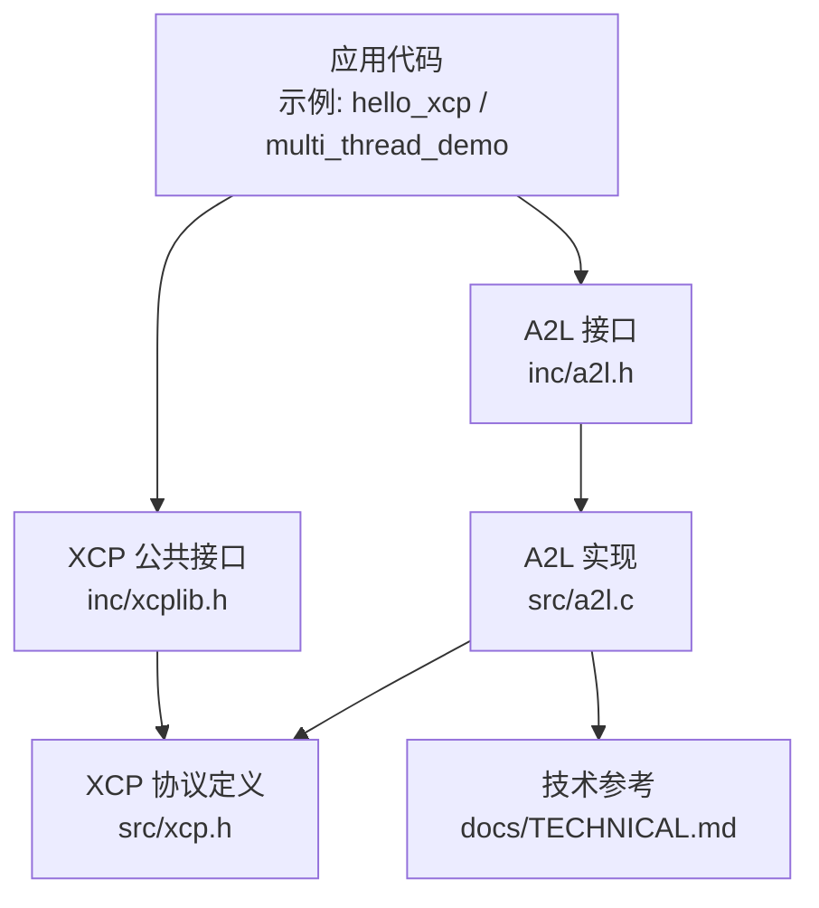
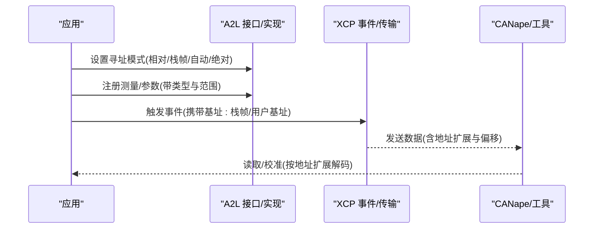
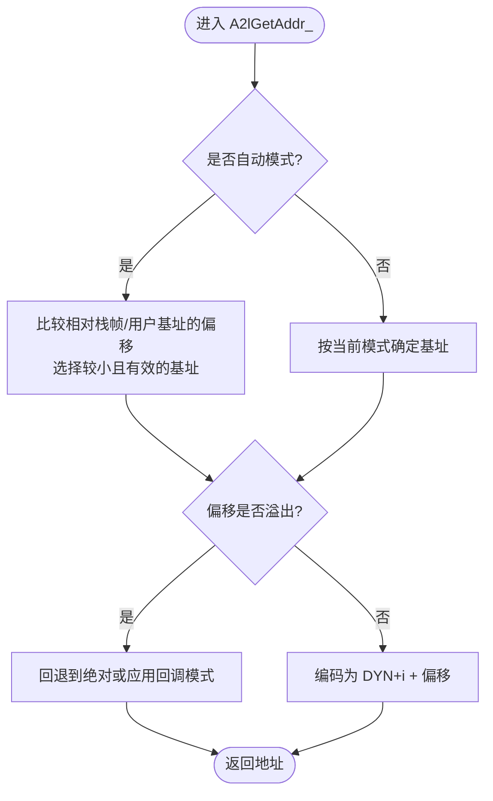
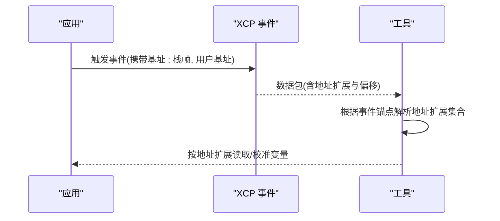
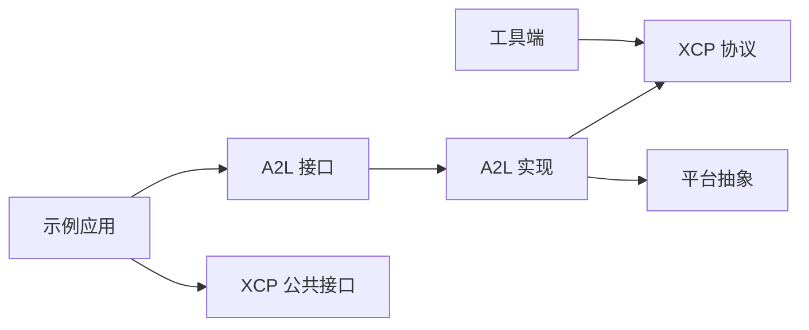

# 相对寻址模式

<cite>
**本文引用的文件**
- [inc/a2l.h](file://inc/a2l.h)
- [src/a2l.c](file://src/a2l.c)
- [inc/xcplib.h](file://inc/xcplib.h)
- [src/xcp.h](file://src/xcp.h)
- [docs/TECHNICAL.md](file://docs/TECHNICAL.md)
- [examples/hello_xcp/src/main.c](file://examples/hello_xcp/src/main.c)
- [examples/multi_thread_demo/src/main.c](file://examples/multi_thread_demo/src/main.c)
</cite>

## 目录
1. [简介](#简介)
2. [项目结构](#项目结构)
3. [核心组件](#核心组件)
4. [架构总览](#架构总览)
5. [详细组件分析](#详细组件分析)
6. [依赖关系分析](#依赖关系分析)
7. [性能考量](#性能考量)
8. [故障排查指南](#故障排查指南)
9. [结论](#结论)
10. [附录](#附录)

## 简介
本技术文档聚焦于 XCPlite 的“相对寻址模式”，系统阐述其如何在栈、堆、线程本地存储与全局内存中安全地测量与校准变量。文档覆盖：
- 地址扩展机制与相对地址编码方式
- 与 XCP 协议的集成（事件、DAQ/STIM、A2L）
- 相对寻址相比绝对寻址的优势（动态分配、多线程安全访问等）
- 在不同内存区域定义测量点与校准参数的实践示例
- 与 CANape 等工具的兼容性要求及工具端注意事项

## 项目结构
XCPlite 将 A2L 生成、XCP 协议层、事件与校准段管理、以及示例应用分层组织。相对寻址贯穿以下关键位置：
- A2L 接口与宏：提供设置相对/栈帧/自动/绝对寻址模式的 API
- A2L 实现：维护当前地址扩展、事件、基址指针，并负责地址编码
- XCP 公共头：定义事件触发、多基址传递、栈帧基址获取等
- 技术文档：说明地址扩展映射、命名约定与工具兼容性

**图表来源**
- [inc/a2l.h:324-376](file://inc/a2l.h#L324-L376)
- [src/a2l.c:481-514](file://src/a2l.c#L481-L514)
- [inc/xcplib.h:458-480](file://inc/xcplib.h#L458-L480)
- [src/xcp.h:683-701](file://src/xcp.h#L683-L701)
- [docs/TECHNICAL.md:269-313](file://docs/TECHNICAL.md#L269-L313)

**章节来源**
- [inc/a2l.h:324-376](file://inc/a2l.h#L324-L376)
- [src/a2l.c:481-514](file://src/a2l.c#L481-L514)
- [inc/xcplib.h:458-480](file://inc/xcplib.h#L458-L480)
- [src/xcp.h:683-701](file://src/xcp.h#L683-L701)
- [docs/TECHNICAL.md:269-313](file://docs/TECHNICAL.md#L269-L313)

## 核心组件
- 地址模式设置宏与函数
  - 相对寻址：A2lSetRelativeAddrMode_* 系列，绑定事件与用户提供的基址指针（对应地址扩展 DYN+1）
  - 栈帧相对：A2lSetStackAddrMode_* 系列，绑定事件与 xcp_get_frame_addr()（对应地址扩展 DYN+0）
  - 自动寻址：A2lSetAutomaticAddrMode_* 系列，运行时根据变量地址选择栈或相对基址
  - 绝对寻址：A2lSetAbsoluteAddrMode_* 系列，直接以绝对地址访问
- 事件与触发
  - DaqTriggerEvent* 与 XcpEventExt* 系列用于在事件触发时携带多个基址（栈帧、用户基址等）
- 地址编码与扩展
  - A2lGetAddr_ 与 A2lGetAddrExt_ 负责在当前模式下计算偏移与地址扩展
  - 支持溢出回退到绝对或应用回调模式
- 工具兼容性与命名约定
  - 通过 trg__<modes>__name 锚点描述事件处的地址扩展布局，供离线 A2L 工具解析

**章节来源**
- [inc/a2l.h:324-376](file://inc/a2l.h#L324-L376)
- [src/a2l.c:481-514](file://src/a2l.c#L481-L514)
- [inc/xcplib.h:458-480](file://inc/xcplib.h#L458-L480)
- [docs/TECHNICAL.md:179-213](file://docs/TECHNICAL.md#L179-L213)

## 架构总览
相对寻址模式在 XCPlite 中的整体流程如下：
- 应用侧通过 A2L 宏设置当前事件的寻址模式（相对/栈帧/自动/绝对），并注册测量/参数
- 触发事件时，使用 XcpEventExt* 传入一个或多个基址（栈帧、用户基址等）
- A2L 实现根据当前模式与变量地址计算偏移与地址扩展，写入 A2L 并配合 XCP 传输
- 工具端依据事件锚点名称与地址扩展，正确解码变量的实际位置

**图表来源**
- [inc/a2l.h:324-376](file://inc/a2l.h#L324-L376)
- [src/a2l.c:713-814](file://src/a2l.c#L713-L814)
- [inc/xcplib.h:458-480](file://inc/xcplib.h#L458-L480)
- [docs/TECHNICAL.md:179-213](file://docs/TECHNICAL.md#L179-L213)

## 详细组件分析

### 地址扩展与相对地址编码
- 地址扩展含义
  - 0x00/0x01：绝对或校准段相对（取决于配置 CASDD/ACSDD）
  - 0x02：栈帧相对（DYN+0）
  - 0x03+：动态/相对基址（DYN+i），i=1 为用户基址，常用于堆对象或类成员
- 编码过程
  - 自动模式：比较变量相对于栈帧和用户基址的偏移，选择更合适的基址；若溢出则回退到绝对或应用回调模式
  - 相对模式：固定使用用户基址，计算偏移并编码为 DYN+i
  - 栈帧模式：固定使用栈帧基址，计算偏移并编码为 DYN+0

**图表来源**
- [src/a2l.c:713-814](file://src/a2l.c#L713-L814)

**章节来源**
- [src/a2l.c:713-814](file://src/a2l.c#L713-L814)
- [docs/TECHNICAL.md:269-313](file://docs/TECHNICAL.md#L269-L313)

### 事件触发与多基址传递
- 事件触发
  - DaqTriggerEvent* 与 XcpEventExt* 系列允许在触发事件时传递多个基址（如栈帧与用户基址）
  - 通过可变参数或显式数组传递基址，适配不同寻址模式
- 工具解析
  - 事件锚点名称（trg__AAS/AASD/AASDD/AASR__name）指示该事件处可用的地址扩展集合
  - 工具据此对每个测量变量选择合适的地址扩展进行解码

**图表来源**
- [inc/xcplib.h:458-480](file://inc/xcplib.h#L458-L480)
- [docs/TECHNICAL.md:179-213](file://docs/TECHNICAL.md#L179-L213)

**章节来源**
- [inc/xcplib.h:458-480](file://inc/xcplib.h#L458-L480)
- [docs/TECHNICAL.md:179-213](file://docs/TECHNICAL.md#L179-L213)

### 不同内存区域的测量与校准示例
- 栈帧局部变量
  - 使用 A2lSetStackAddrMode 并在事件触发时传递栈帧基址
  - 适用于函数局部变量与参数
- 堆对象/类成员
  - 使用 A2lSetRelativeAddrMode 绑定用户基址（如堆对象指针）
  - 适用于动态分配的实例成员
- 线程本地存储
  - 为每个线程创建独立事件，并使用 A2lSetRelativeAddrMode_i 绑定线程上下文基址
  - 确保多线程下测量点的隔离与安全访问
- 全局/静态变量
  - 使用 A2lSetAbsoluteAddrMode 直接以绝对地址访问
  - 适用于程序生命周期内固定地址的变量

**章节来源**
- [examples/hello_xcp/src/main.c:90-138](file://examples/hello_xcp/src/main.c#L90-L138)
- [examples/hello_xcp/src/main.c:199-221](file://examples/hello_xcp/src/main.c#L199-L221)
- [examples/multi_thread_demo/src/main.c:140-163](file://examples/multi_thread_demo/src/main.c#L140-L163)
- [examples/multi_thread_demo/src/main.c:274-292](file://examples/multi_thread_demo/src/main.c#L274-L292)

### 与 XCP 协议的集成
- 事件与 DAQ/STIM
  - 事件作为测量与校准的同步点，支持周期性或随机触发
  - 地址扩展与偏移通过 XCP 数据包传输，工具端解码后访问目标内存
- 校准段与持久化
  - 校准段相对寻址（SEG）与绝对寻址（ABS）可结合使用，支持页切换、校验和与持久化
  - 工具端需注意段号与地址扩展的兼容性

**章节来源**
- [src/xcp.h:683-701](file://src/xcp.h#L683-L701)
- [docs/TECHNICAL.md:269-313](file://docs/TECHNICAL.md#L269-L313)

## 依赖关系分析
- 模块耦合
  - A2L 接口依赖 XCP 事件与地址扩展定义
  - A2L 实现依赖平台抽象与持久化模块
  - 示例应用依赖 A2L 与 XCP 接口进行测量与校准
- 外部依赖
  - 工具端（如 CANape）需正确解析地址扩展与事件锚点
  - 编译器与平台特性影响栈帧基址获取与 DWARF 信息

**图表来源**
- [inc/a2l.h:324-376](file://inc/a2l.h#L324-L376)
- [src/a2l.c:481-514](file://src/a2l.c#L481-L514)
- [inc/xcplib.h:458-480](file://inc/xcplib.h#L458-L480)
- [src/xcp.h:683-701](file://src/xcp.h#L683-L701)

**章节来源**
- [inc/a2l.h:324-376](file://inc/a2l.h#L324-L376)
- [src/a2l.c:481-514](file://src/a2l.c#L481-L514)
- [inc/xcplib.h:458-480](file://inc/xcplib.h#L458-L480)
- [src/xcp.h:683-701](file://src/xcp.h#L683-L701)

## 性能考量
- 触发开销
  - 事件触发与数据传输采用无锁实现，降低生产者侧开销
  - 懒查找事件 ID 并缓存结果，减少重复查找成本
- 栈帧与寄存器
  - 测量局部变量会迫使编译器将参数与局部变量 spill 到栈帧，避免未定义行为
- 队列与内存
  - 传输队列大小需足够覆盖预期流量峰值，避免丢包与拥塞

[本节为通用指导，不直接分析具体文件]

## 故障排查指南
- 地址溢出
  - 自动模式下若偏移超出范围，将回退到绝对或应用回调模式；检查基址与变量距离
- 事件未找到
  - 设置寻址模式前需确保事件已创建；否则将重置寻址状态
- 工具兼容性问题
  - CANape 对某些地址扩展与段号的解析存在限制，需遵循文档中的工作区方案

**章节来源**
- [src/a2l.c:713-814](file://src/a2l.c#L713-L814)
- [docs/TECHNICAL.md:398-412](file://docs/TECHNICAL.md#L398-L412)

## 结论
XCPlite 的相对寻址模式通过地址扩展与事件机制，灵活支持栈、堆、线程本地与全局内存的测量与校准。相比传统绝对寻址，它更好地适应动态内存分配与多线程环境，同时保持与 XCP 协议及主流工具的兼容性。合理选择寻址模式与基址，可显著提升系统的可观测性与可维护性。

[本节为总结性内容，不直接分析具体文件]

## 附录
- 最佳实践
  - 优先使用自动寻址模式，让库选择最优基址
  - 对于堆对象，明确绑定用户基址并验证偏移范围
  - 多线程场景下为每个上下文创建独立事件与基址
- 工具端注意事项
  - 确保工具正确解析事件锚点与地址扩展
  - 关注 CANape 对段号与地址扩展的限制，必要时调整配置

[本节为补充信息，不直接分析具体文件]