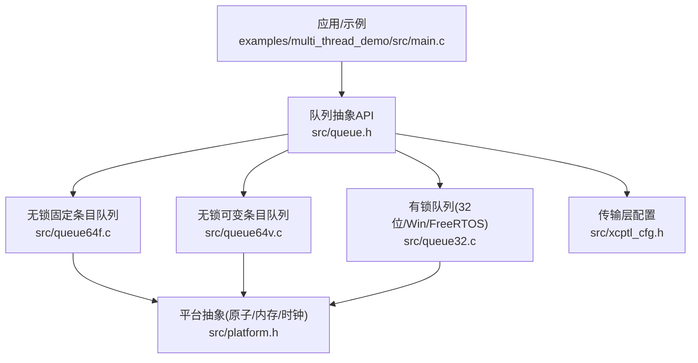
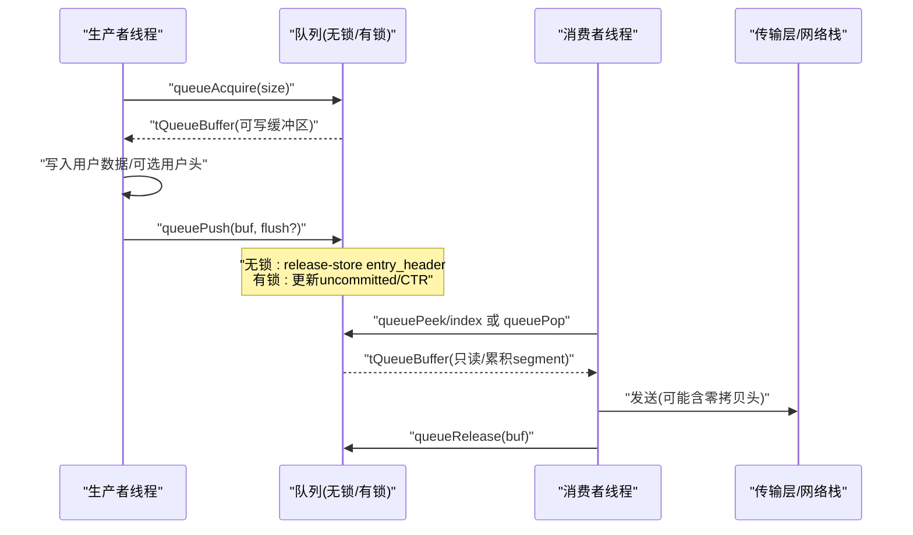
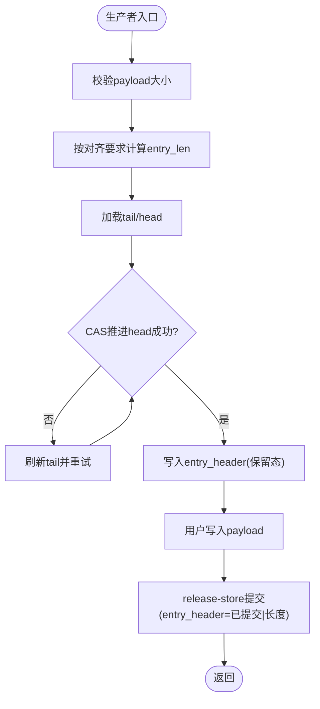
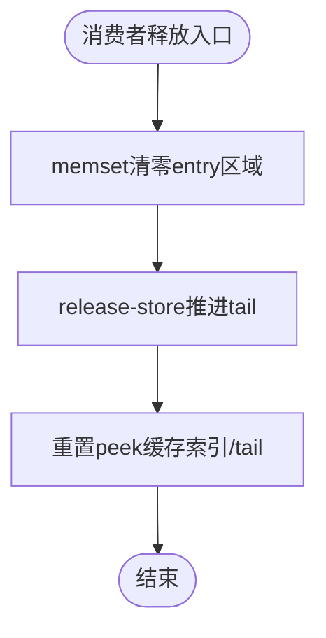
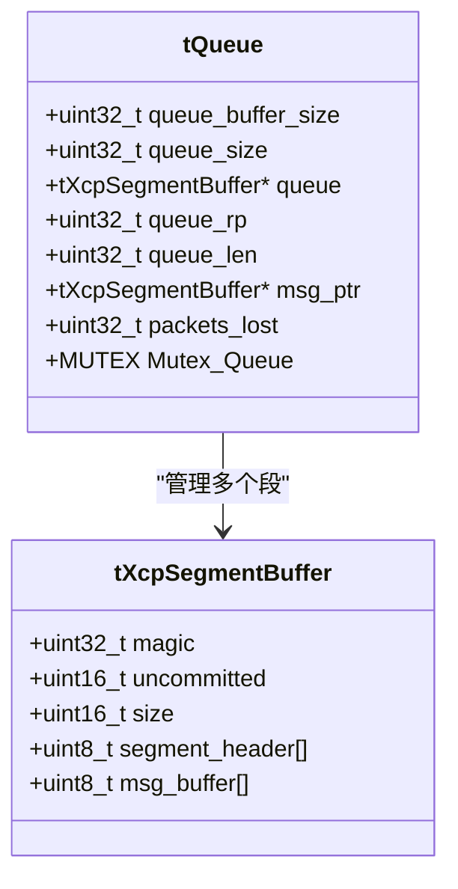
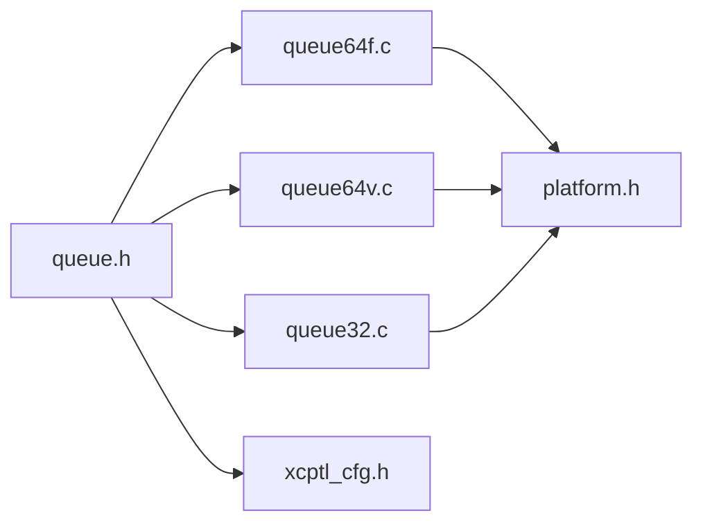

# 线程安全无锁设计

<cite>
**本文引用的文件**
- [queue.h](file://src/queue.h)
- [queue32.c](file://src/queue32.c)
- [queue64f.c](file://src/queue64f.c)
- [queue64v.c](file://src/queue64v.c)
- [platform.h](file://src/platform.h)
- [xcptl_cfg.h](file://src/xcptl_cfg.h)
- [TECHNICAL.md](file://docs/TECHNICAL.md)
- [main.c（多线程示例）](file://examples/multi_thread_demo/src/main.c)
- [main.c（队列测试）](file://test/queue_test/src/main.c)
</cite>

## 目录
1. [简介](#简介)
2. [项目结构](#项目结构)
3. [核心组件](#核心组件)
4. [架构总览](#架构总览)
5. [详细组件分析](#详细组件分析)
6. [依赖关系分析](#依赖关系分析)
7. [性能考量](#性能考量)
8. [故障排查指南](#故障排查指南)
9. [结论](#结论)
10. [附录](#附录)

## 简介
本技术文档聚焦 XCPlite 的线程安全与无锁设计，系统阐述在多核处理器环境下如何实现一致的数据采集与参数修改、避免阻塞与线程间竞争。重点覆盖：
- 无锁队列的实现原理与内存模型（原子操作、内存屏障、缓存行对齐）
- 确定性运行时性能的设计考虑（零拷贝机制、静态内存使用策略）
- 多线程环境下的最佳实践（事件驱动数据访问模式、并发安全保证）
- 性能基准测试结果与实际应用场景的性能分析

## 项目结构
XCPlite 将“通用队列抽象”与“多实现变体”解耦，通过编译期选项选择不同队列实现：
- 通用接口：src/queue.h
- 有锁实现（32位/Windows/FreeRTOS）：src/queue32.c
- 无锁固定条目实现（64位POSIX）：src/queue64f.c
- 无锁可变条目实现（64位POSIX）：src/queue64v.c
- 平台抽象（原子、互斥、线程、时钟等）：src/platform.h
- 传输层配置（段大小、对齐、头预留空间等）：src/xcptl_cfg.h
- 技术细节与资源消耗说明：docs/TECHNICAL.md
- 多线程示例与队列压测用例：examples/multi_thread_demo/src/main.c, test/queue_test/src/main.c

图表来源
- [queue.h:1-187](file://src/queue.h#L1-L187)
- [queue64f.c:1-664](file://src/queue64f.c#L1-L664)
- [queue64v.c:1-662](file://src/queue64v.c#L1-L662)
- [queue32.c:1-420](file://src/queue32.c#L1-L420)
- [platform.h:1-677](file://src/platform.h#L1-L677)
- [xcptl_cfg.h:1-143](file://src/xcptl_cfg.h#L1-L143)

章节来源
- [queue.h:1-187](file://src/queue.h#L1-L187)
- [xcptl_cfg.h:1-143](file://src/xcptl_cfg.h#L1-L143)
- [TECHNICAL.md:1-412](file://docs/TECHNICAL.md#L1-L412)

## 核心组件
- 队列抽象 API（生产者/消费者语义、peek/pop/release、level/clear）
- 三种队列实现：
  - queue64f.c：无锁、固定条目大小、单消费者、多生产者；基于原子 entry_header 发布/获取
  - queue64v.c：无锁、可变条目大小、单消费者、多生产者；释放时清零已用区域并推进 tail
  - queue32.c：有锁（互斥量）、消息累积为 segment、支持原始以太网零拷贝头预留
- 平台抽象：原子操作、互斥、线程、时钟、共享内存等
- 传输层配置：段大小、对齐、用户头预留、最大 DTO 等

章节来源
- [queue.h:88-187](file://src/queue.h#L88-L187)
- [queue64f.c:250-391](file://src/queue64f.c#L250-L391)
- [queue64v.c:216-358](file://src/queue64v.c#L216-L358)
- [queue32.c:57-100](file://src/queue32.c#L57-L100)
- [platform.h:300-433](file://src/platform.h#L300-L433)
- [xcptl_cfg.h:37-114](file://src/xcptl_cfg.h#L37-L114)

## 架构总览
XCPlite 采用“多生产者-单消费者”队列作为数据采集与参数修改的核心通道。生产者线程以无锁或轻量同步方式申请缓冲区并写入数据，消费者线程以 peek/pop 顺序消费并发送。关键特性：
- 无锁路径：64位POSIX下使用C11原子与release/acquire语义，避免全局锁
- 零拷贝：在 raw Ethernet 场景下，通过 segment headroom 直接填充链路层头，无需额外拷贝
- 静态内存优先：除队列缓冲外，其余状态尽量静态分配，降低堆分配开销
- 确定性延迟：通过缓存行对齐、最小化跨核同步点、批量处理减少抖动

图表来源
- [queue64f.c:399-519](file://src/queue64f.c#L399-L519)
- [queue64v.c:366-485](file://src/queue64v.c#L366-L485)
- [queue32.c:207-304](file://src/queue32.c#L207-L304)
- [queue32.c:333-417](file://src/queue32.c#L333-L417)

章节来源
- [queue64f.c:399-660](file://src/queue64f.c#L399-L660)
- [queue64v.c:366-658](file://src/queue64v.c#L366-L658)
- [queue32.c:207-417](file://src/queue32.c#L207-L417)

## 详细组件分析

### 无锁固定条目队列（queue64f.c）
- 设计要点
  - 每个槽位包含一个原子 entry_header，编码“提交状态+长度”，用于发布/获取一致性
  - 生产者通过 CAS 推进 head，写入 payload 后 release-store 提交
  - 消费者 acquire-load entry_header 读取 payload，release 时清零 entry_header 并推进 tail
  - 头部 cache line 对齐，减少伪共享
- 内存模型
  - 使用 memory_order_release 发布数据，memory_order_acquire 获取数据
  - tail 默认 relaxed 仅用于容量元数据，避免污染共享缓存行
- 性能优化
  - 固定条目大小便于对齐与批量处理
  - 可选 tail 同步模式（OPTION_QUEUE_64_FIX_SIZE_SYNC_TAIL）

图表来源
- [queue64f.c:399-519](file://src/queue64f.c#L399-L519)

章节来源
- [queue64f.c:250-391](file://src/queue64f.c#L250-L391)
- [queue64f.c:399-660](file://src/queue64f.c#L399-L660)

### 无锁可变条目队列（queue64v.c）
- 设计要点
  - 将队列缓冲区视为原始对齐存储，支持可变长度条目
  - 消费者释放时 memset 清零已用区域，再 release-store 推进 tail，使后续生产者可见
  - 提供 peek 循环中的缓存索引与 tail 加速
- 内存模型
  - 释放时清零 + release-store tail，确保生产者看到清理后的内存
  - 对 entry_header 使用 acquire/load 检查提交状态
- 适用场景
  - 中等吞吐、条目大小变化较大的场景

图表来源
- [queue64v.c:640-658](file://src/queue64v.c#L640-L658)

章节来源
- [queue64v.c:216-358](file://src/queue64v.c#L216-L358)
- [queue64v.c:366-658](file://src/queue64v.c#L366-L658)

### 有锁队列（queue32.c）
- 设计要点
  - 使用互斥量保护环形段队列，适合32位/Windows/FreeRTOS目标
  - 支持消息累积为 segment，便于一次发送多个消息
  - 支持原始以太网零拷贝：segment 前预留头空间，直接填充链路层头
- 关键点
  - 生产者：acquire 分配段内空间，写入 tXcpMessage 头（ctr/dlc），push 时标记提交
  - 消费者：pop 时遍历 segment 设置传输层计数器，release 推进读指针

图表来源
- [queue32.c:57-100](file://src/queue32.c#L57-L100)

章节来源
- [queue32.c:146-200](file://src/queue32.c#L146-L200)
- [queue32.c:207-304](file://src/queue32.c#L207-L304)
- [queue32.c:333-417](file://src/queue32.c#L333-L417)

### 平台抽象与原子/内存屏障
- 原子与内存序
  - POSIX 使用 stdatomic.h；Windows 可通过 OPTION_ATOMIC_EMULATION 使用 Interlocked intrinsics
  - 明确使用 memory_order_acquire/release 保证发布-获取语义
- 互斥与线程
  - 统一 MUTEX/THREAD_HANDLE 抽象，适配 POSIX/Windows/FreeRTOS
- 时钟与延时
  - 高精度单调时钟用于测量与超时控制

章节来源
- [platform.h:177-197](file://src/platform.h#L177-L197)
- [platform.h:300-433](file://src/platform.h#L300-L433)
- [platform.h:520-672](file://src/platform.h#L520-L672)

### 传输层配置与零拷贝
- 段大小与对齐
  - XCPTL_MAX_SEGMENT_SIZE 由 MTU 推导，确保不超链路限制
  - XCPTL_PACKET_ALIGNMENT 强制为4，保证消息头字访问对齐
- 零拷贝头预留
  - 当启用原始以太网且开启零拷贝时，QUEUE_SEGMENT_HEADER_SIZE 非零，允许直接在 segment 前写入以太网/IPv4/UDP 头，避免复制

章节来源
- [xcptl_cfg.h:51-114](file://src/xcptl_cfg.h#L51-L114)
- [queue.h:39-55](file://src/queue.h#L39-L55)

## 依赖关系分析
- 模块耦合
  - queue.h 定义统一接口，被 queue64f/v/32 实现引用
  - queue64f/v 依赖 platform.h 的原子与内存序
  - queue32 依赖 platform.h 的互斥与线程原语
  - xcptl_cfg.h 为所有队列实现提供段大小、对齐、头预留等约束
- 外部依赖
  - C11 atomics（POSIX）或 Windows Interlocked intrinsics
  - 平台线程/互斥/时钟（pthread/WinRT/FreeRTOS）

图表来源
- [queue.h:1-187](file://src/queue.h#L1-L187)
- [queue64f.c:1-664](file://src/queue64f.c#L1-L664)
- [queue64v.c:1-662](file://src/queue64v.c#L1-L662)
- [queue32.c:1-420](file://src/queue32.c#L1-L420)
- [platform.h:1-677](file://src/platform.h#L1-L677)
- [xcptl_cfg.h:1-143](file://src/xcptl_cfg.h#L1-L143)

章节来源
- [queue.h:1-187](file://src/queue.h#L1-L187)
- [platform.h:1-677](file://src/platform.h#L1-L677)
- [xcptl_cfg.h:1-143](file://src/xcptl_cfg.h#L1-L143)

## 性能考量
- 无锁路径优势
  - 64位POSIX下，queue64f/v 避免全局锁，生产者侧无阻塞，降低尾延迟
  - 固定条目队列（queue64f）在高频小包场景更优；可变条目（queue64v）在大小波动场景更灵活
- 零拷贝与静态内存
  - 原始以太网路径通过 segment headroom 直接写入链路层头，减少拷贝
  - 除队列缓冲外，其他状态静态分配，降低堆分配开销与抖动
- 基准测试与结果
  - 队列测试（test/queue_test）提供多生产者/单消费者压测，统计丢包率、队列水位、吞吐量
  - 可启用 acquire lock timing 直方图，评估生产者获取延迟分布
  - 多线程示例（examples/multi_thread_demo）演示事件驱动采集与参数修改的并发安全

章节来源
- [TECHNICAL.md:5-24](file://docs/TECHNICAL.md#L5-L24)
- [test/queue_test/src/main.c:46-97](file://test/queue_test/src/main.c#L46-L97)
- [test/queue_test/src/main.c:105-211](file://test/queue_test/src/main.c#L105-L211)
- [examples/multi_thread_demo/src/main.c:342-418](file://examples/multi_thread_demo/src/main.c#L342-L418)

## 故障排查指南
- 常见错误与定位
  - 队列溢出：queueAcquire 返回 size=0，packets_lost 递增；检查消费者速率与队列大小
  - 未提交读取：queuePeek 发现 entry_header 仍为保留态；确认生产者是否完成写入并提交
  - 对齐错误：编译期 #error 提示 QUEUE_PAYLOAD_SIZE_ALIGNMENT 必须为2的幂；检查配置
  - 段大小超限：XCPTL_MAX_SEGMENT_SIZE 需满足链路MTU；否则发送失败或分片
- 调试建议
  - 启用日志级别与断言，观察队列水位与丢包计数
  - 使用队列测试工具进行压力测试，逐步调整 THREAD_BURST_SIZE、THREAD_DELAY_US
  - 在 raw Ethernet 场景验证 segment headroom 是否正确写入链路层头

章节来源
- [queue64f.c:478-487](file://src/queue64f.c#L478-L487)
- [queue64v.c:446-456](file://src/queue64v.c#L446-L456)
- [queue32.c:260-264](file://src/queue32.c#L260-L264)
- [xcptl_cfg.h:51-82](file://src/xcptl_cfg.h#L51-L82)

## 结论
XCPlite 通过“无锁队列 + 平台抽象 + 传输层配置”的组合，实现了高吞吐、低延迟、可扩展的多核数据采集与参数修改通道。其核心在于：
- 使用 C11 原子与内存序保证发布-获取一致性
- 通过固定/可变条目队列满足不同负载特征
- 借助 segment headroom 实现零拷贝发送
- 以静态内存为主、堆分配为辅的策略提升确定性
在实际应用中，结合事件驱动访问模式与合理的队列尺寸配置，可在多核环境下获得稳定且高效的性能表现。

## 附录
- 多线程最佳实践
  - 生产者侧尽量无锁，避免阻塞热点路径
  - 消费者侧顺序消费，必要时使用 peek 预取以提升批处理效率
  - 校准队列大小以覆盖峰值流量（例如至少覆盖 10ms 预期流量）
  - 在 raw Ethernet 场景启用零拷贝头预留，减少拷贝开销
- 参考实现与用例
  - 多线程示例：examples/multi_thread_demo/src/main.c
  - 队列压测：test/queue_test/src/main.c

章节来源
- [examples/multi_thread_demo/src/main.c:342-418](file://examples/multi_thread_demo/src/main.c#L342-L418)
- [test/queue_test/src/main.c:519-800](file://test/queue_test/src/main.c#L519-L800)
- [TECHNICAL.md:5-24](file://docs/TECHNICAL.md#L5-L24)