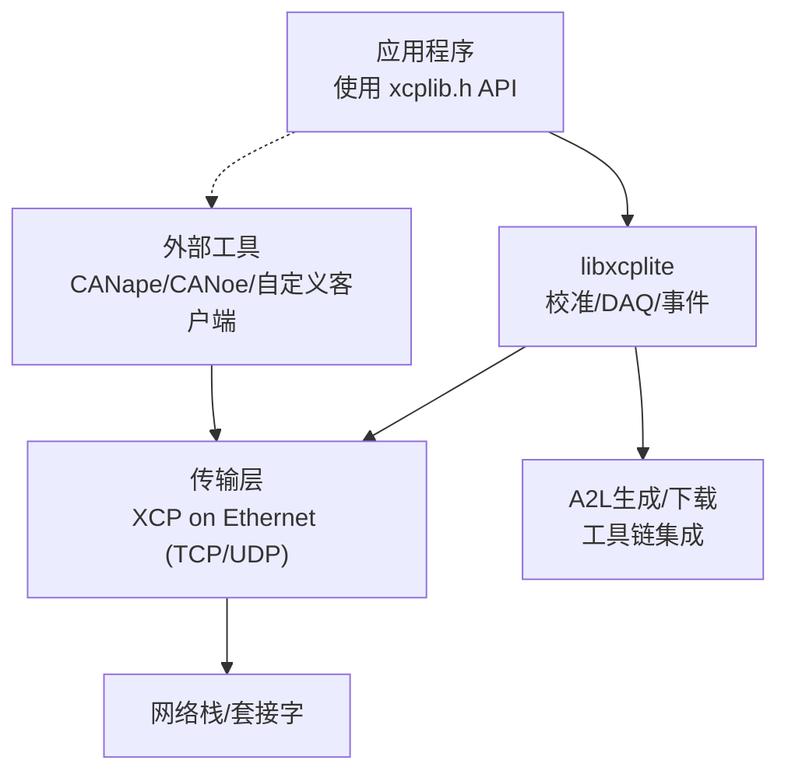
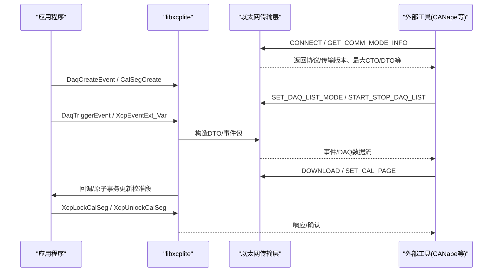
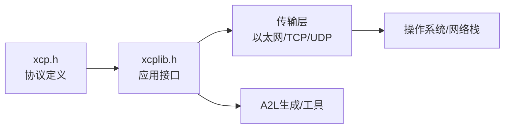

# XCP协议基础

<cite>
**本文引用的文件**
- [README.md](file://README.md)
- [XCP_INTRODUCTION.md](file://docs/XCP_INTRODUCTION.md)
- [TECHNICAL.md](file://docs/TECHNICAL.md)
- [CAL_RCU.md](file://docs/CAL_RCU.md)
- [XCP_DISCOVERY.md](file://docs/XCP_DISCOVERY.md)
- [xcp.h](file://src/xcp.h)
- [xcplib.h](file://inc/xcplib.h)
</cite>

## 目录
1. [简介](#简介)
2. [项目结构](#项目结构)
3. [核心组件](#核心组件)
4. [架构总览](#架构总览)
5. [详细组件分析](#详细组件分析)
6. [依赖关系分析](#依赖关系分析)
7. [性能考量](#性能考量)
8. [故障排查指南](#故障排查指南)
9. [结论](#结论)
10. [附录](#附录)

## 简介
本章节面向初学者，系统阐述XCP（通用测量与校准协议）的概念、历史背景、在汽车行业的应用价值，以及XCPlite实现的特点。重点包括：
- XCP是什么：由ASAM标准化的测量与参数校准协议，广泛用于汽车ECU的实时数据采集与在线标定。
- 为什么重要：提供低开销、可配置、时间戳化的事件驱动采集与原子一致的参数修改能力，适配现代多核/多线程平台。
- 与其他协议的区别与优势：相比传统日志/遥测方案，XCP直接访问原始内存布局，避免拷贝与重序列化；支持多种传输层（CAN、以太网等），具备丰富的命令集与A2L描述体系。
- XCPlite的定位：专注于XCP on Ethernet（TCP/UDP），面向POSIX/RTOS与现代多核处理器，强调相对寻址、线程安全无锁、确定性运行时与资源占用可控。

本节为概念性介绍，不直接分析具体代码文件。

## 项目结构
XCPlite仓库围绕“协议定义 + 库API + 传输层 + 示例与工具”组织：
- 协议与类型定义：src/xcp.h 定义了XCP命令、响应、状态码、DAQ/PGM/PAG相关常量与报文结构片段。
- 应用接口与仪器化宏：inc/xcplib.h 提供C API（初始化、校准段、事件创建/触发、帧基址获取等）与大量用于事件/校准的宏。
- 传输层与服务器：src/ 下包含以太网传输、套接字抽象、共享内存等实现（如 xcpethserver.c、socket_raw*.c）。
- A2L生成与离线工具：docs/OFFLINE_A2L.md、tools/xcpclient 等。
- 示例与测试：examples/ 覆盖C/C++、FreeRTOS、PTP、eBPF、多点云等场景；test/ 覆盖功能与集成测试。

图表来源
- [xcp.h:25-130](file://src/xcp.h#L25-L130)
- [xcplib.h:39-58](file://inc/xcplib.h#L39-L58)

章节来源
- [README.md:1-130](file://README.md#L1-L130)

## 核心组件
- 协议层（命令/响应/状态）：集中定义于 src/xcp.h，涵盖连接、通信模式、上传/下载、校准页切换、DAQ/STIM、非易失编程等命令族及错误码、事件码、服务请求码。
- 应用接口（xcplib.h）：提供以太网服务器初始化、启动/连接/DAQ状态查询、校准段创建/锁定/持久化、事件创建/触发/捕获、栈帧基址获取、绝对/相对寻址辅助等。
- 传输层：基于以太网套接字（TCP/UDP），支持多播发现（可选）、队列缓冲、收发线程模型。
- A2L与元数据：通过ELF/DWARF标记或运行时生成，向工具暴露测量点、校准段、单位/限值/注释等元信息。

章节来源
- [xcp.h:25-130](file://src/xcp.h#L25-L130)
- [xcplib.h:39-58](file://inc/xcplib.h#L39-L58)

## 架构总览
下图展示从应用到协议的端到端流程：应用通过xcplib.h提供的API进行事件触发与校准段访问；库将数据封装为XCP消息，经以太网传输层发送/接收；外部工具（如CANape）通过A2L理解数据结构并发起控制与采集。

图表来源
- [xcp.h:25-130](file://src/xcp.h#L25-L130)
- [xcplib.h:39-58](file://inc/xcplib.h#L39-L58)

## 详细组件分析

### 协议层（命令、响应、状态）
- 命令族：标准命令（CONNECT/DISCONNECT/GET_STATUS/SYNCH/GET_COMM_MODE_INFO/GET_ID/SET_REQUEST/GET_SEED/UNLOCK）、内存访问（SET_MTA/UPLOAD/SHORT_UPLOAD/BUILD_CHECKSUM）、校准（DOWNLOAD/DOWNLOAD_NEXT/DOWNLOAD_MAX/SHORT_DOWNLOAD/MODIFY_BITS/SET_CAL_PAGE/GET_CAL_PAGE/...）、DAQ/STIM（CLEAR_DAQ_LIST/SET_DAQ_PTR/WRITE_DAQ/SET_DAQ_LIST_MODE/START_STOP_DAQ_LIST/...）、PGM（PROGRAM_*系列）。
- 事件与服务：事件码（EVC_*）与服务请求码（SERV_*）用于异步通知与文本输出等。
- 状态与选项：资源掩码、通信模式、会话状态、DAQ属性、时间戳模式、列表属性等。

这些定义构成了XCP协议交互的基础契约，确保不同实现之间的互操作性。

章节来源
- [xcp.h:25-130](file://src/xcp.h#L25-L130)
- [xcp.h:132-184](file://src/xcp.h#L132-L184)
- [xcp.h:196-465](file://src/xcp.h#L196-L465)

### 应用接口与仪器化（xcplib.h）
- 以太网服务器：XcpEthServerInit/Shutdown/Status，XcpIsStarted/Connected/DaqRunning。
- 校准段：创建（XcpCreateCalSeg/XcpCreateCalBlk）、查找/命名/尺寸/编号、锁定/解锁（XcpLockCalSeg/XcpUnlockCalSeg）、持久化（XcpFreeze/XcpBinWrite）。
- 事件：动态/链接期创建（DaqCreateEvent/DaqCreateEventExt/DaqCreateAndTriggerEvent）、实例化（DaqCreateEventInstance）、启用/禁用（DaqEventEnable/Disable）。
- 触发与捕获：XcpEvent/XcpEventExt/XcpEventExt_Var 及其At变体；捕获局部变量（DaqTriggerEventCapture*）。
- 寻址：栈帧基址获取（xcp_get_frame_addr）、绝对寻址基址（ApplXcpGetBaseAddr/ApplXcpGetModuleAddr/ApplXcpGetAddr/ApplXcpGetAddrExt）。

这些API与宏使开发者以最小侵入方式完成测量与标定，同时保持线程安全与确定性。

章节来源
- [xcplib.h:39-58](file://inc/xcplib.h#L39-L58)
- [xcplib.h:63-139](file://inc/xcplib.h#L63-L139)
- [xcplib.h:239-453](file://inc/xcplib.h#L239-L453)
- [xcplib.h:458-780](file://inc/xcplib.h#L458-L780)
- [xcplib.h:548-557](file://inc/xcplib.h#L548-L557)

### 校准段与RCU一致性（CAL_RCU）
- 设计目标：单写者（XCP命令线程）+ 多读者（应用线程）的无锁/等待自由访问，保证一致性与可见性。
- 关键操作：页面切换（参考页/工作页）、复制、冻结、原子事务（Begin/End）、发布（PublishAll）。
- RCU伪代码要点：三页模型（ecu_page/xcp_page/free_page），原子指针与计数，延迟可见性与竞争下的发布策略。
- 权衡与约束：仅允许单写者；可见性延迟可能非确定；极端情况下可能饥饿；每块需额外头部与多页副本空间。

该机制为高并发环境下安全、高效的参数校准提供了坚实基础。

章节来源
- [CAL_RCU.md:14-59](file://docs/CAL_RCU.md#L14-L59)
- [CAL_RCU.md:63-93](file://docs/CAL_RCU.md#L63-L93)
- [CAL_RCU.md:94-185](file://docs/CAL_RCU.md#L94-L185)

### 设备发现（XCP_DISCOVERY）
- 机制：通过XCP传输层命令（CC_TRANSPORT_LAYER_CMD）的多播子命令（GET_SERVER_ID/EXTENDED）发现服务器IP与端口。
- 现状：扩展ID已实现，普通ID为存根；多播套接字与线程存在但默认未启用；A2L中未声明发现能力。
- 实践要点：多播组与端口（5556 vs 5557）、接口枚举与回环处理、回复地址取自请求、跨网段转发限制等。

这为“零配置接入”提供了可能，但在默认构建中需显式开启并验证兼容性。

章节来源
- [XCP_DISCOVERY.md:11-29](file://docs/XCP_DISCOVERY.md#L11-L29)
- [XCP_DISCOVERY.md:30-50](file://docs/XCP_DISCOVERY.md#L30-L50)
- [XCP_DISCOVERY.md:61-96](file://docs/XCP_DISCOVERY.md#L61-L96)
- [XCP_DISCOVERY.md:97-130](file://docs/XCP_DISCOVERY.md#L97-L130)

### 技术细节与寻址模式（TECHNICAL）
- 资源消耗：静态/堆/栈占用估算，队列大小与分配策略。
- 仪器成本：DAQ触发与传输采用无锁生产者；部分宏首次懒查找并缓存；函数参数/局部变量测量会迫使寄存器溢出至栈。
- 在线A2L生成：文件系统写入，四文件合并；一次性执行模式；稳定版EPK校验。
- 离线A2L生成：通过ELF/DWARF标记（xcp_evts/xcp_cals/xcp_meta/xcp_epk）与DWARF作用域锚点（trg__AAS*）推断测量点与寻址模式。
- 寻址模式：CASDD/ACSDD/AXSDD/CXSDD等，区分绝对/段相对/栈相对/动态/捕获相对等扩展位。
- 平台要求：C11/C++17特性、原子、线程、时钟、套接字等。

这些细节帮助开发者评估性能、选择合适模式并正确配置工具链。

章节来源
- [TECHNICAL.md:5-25](file://docs/TECHNICAL.md#L5-L25)
- [TECHNICAL.md:28-52](file://docs/TECHNICAL.md#L28-L52)
- [TECHNICAL.md:56-87](file://docs/TECHNICAL.md#L56-L87)
- [TECHNICAL.md:89-104](file://docs/TECHNICAL.md#L89-L104)
- [TECHNICAL.md:106-214](file://docs/TECHNICAL.md#L106-L214)
- [TECHNICAL.md:269-313](file://docs/TECHNICAL.md#L269-L313)
- [TECHNICAL.md:317-340](file://docs/TECHNICAL.md#L317-L340)
- [TECHNICAL.md:342-395](file://docs/TECHNICAL.md#L342-L395)

## 依赖关系分析
- 协议与库：xcp.h 提供协议常量与报文片段；xcplib.h 在其之上提供高层API与仪器化宏。
- 传输层：基于以太网套接字，支持TCP/UDP与可选多播；队列缓冲与收发线程模型。
- 工具链：A2L生成（在线/离线）与外部工具（CANape/CANoe）通过协议与A2L协同工作。
- 平台抽象：原子、线程、时钟、套接字等系统调用在不同平台上被封装。

图表来源
- [xcp.h:25-130](file://src/xcp.h#L25-L130)
- [xcplib.h:39-58](file://inc/xcplib.h#L39-L58)

章节来源
- [xcp.h:25-130](file://src/xcp.h#L25-L130)
- [xcplib.h:39-58](file://inc/xcplib.h#L39-L58)

## 性能考量
- 资源占用：静态内存约~10KB（DAQ表/校准段页），堆内存约~32KB（传输队列），栈约~1KB/线程（收发线程）。
- 无锁路径：DAQ触发与传输对生产者无锁；事件懒查找与缓存减少开销。
- 仪器副作用：测量局部变量/参数会强制寄存器溢出至栈；避免内联影响栈相对寻址。
- 校准段访问：读路径无锁/等待自由；写路径受限于单写者与发布策略。
- 时间戳：支持高精度时钟源（如PTP），便于同步与排序。

[本节提供一般性指导，无需特定文件引用]

## 故障排查指南
- 常见兼容性问题：CANape对某些行为（如COPY_CAL_PAGE、GET_ID EPK模式、地址扩展忽略等）有特定限制，需按文档采取规避措施。
- 多播发现：若无法发现设备，检查多播端口（5556/5557）、组地址、接口枚举与回环设置、路由器是否转发多播。
- 校准一致性：确保单写者模型；必要时显式调用发布（PublishAll）；注意可见性延迟与竞争情况。
- 仪器成本：避免过度触发高频事件；合理使用捕获宏以减少栈压力；关注编译器优化对栈帧的影响。

章节来源
- [TECHNICAL.md:396-412](file://docs/TECHNICAL.md#L396-L412)
- [XCP_DISCOVERY.md:97-130](file://docs/XCP_DISCOVERY.md#L97-L130)
- [CAL_RCU.md:63-93](file://docs/CAL_RCU.md#L63-L93)

## 结论
XCP作为ASAM标准化的测量与校准协议，在汽车电子开发中扮演关键角色。XCPlite聚焦XCP on Ethernet，提供面向现代多核/多线程平台的低开销、线程安全、确定性实现，结合A2L与工具链形成完整的测量与标定工作流。通过理解协议层、应用接口、传输层与工具链的协作关系，开发者可以高效地在复杂系统中实现可靠的数据采集与参数校准。

[本节为总结性内容，无需特定文件引用]

## 附录

### 术语与概念速查
- XCP：通用测量与校准协议（ASAM标准）。
- A2L：ECU测量与参数的标准化描述文件（ASCII格式）。
- DAQ：数据采集（Measurement/Logging）。
- STIM：刺激（Stimulation）。
- PAG：校准页（Page）管理。
- PGM：非易失编程（Flash/EEPROM）。
- EPK：ECU软件版本标识，用于A2L/二进制参数兼容性校验。
- 寻址模式：绝对/段相对/栈相对/动态/捕获相对等，通过地址扩展位表示。

[本节为概念性说明，无需特定文件引用]