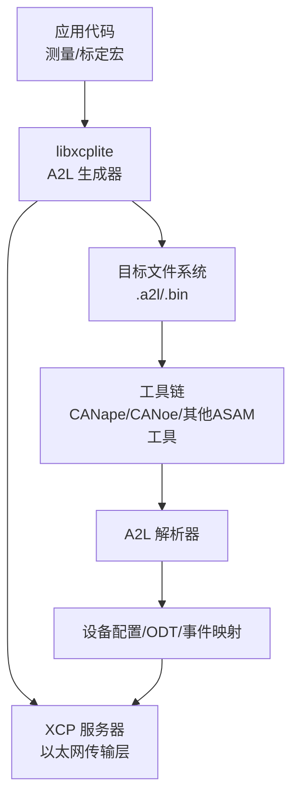
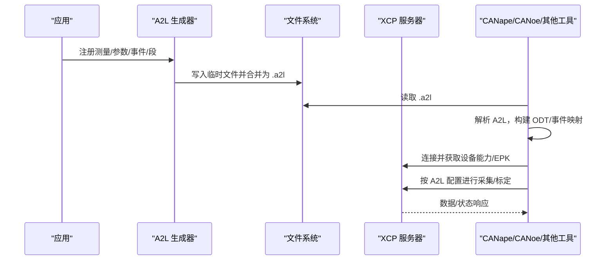
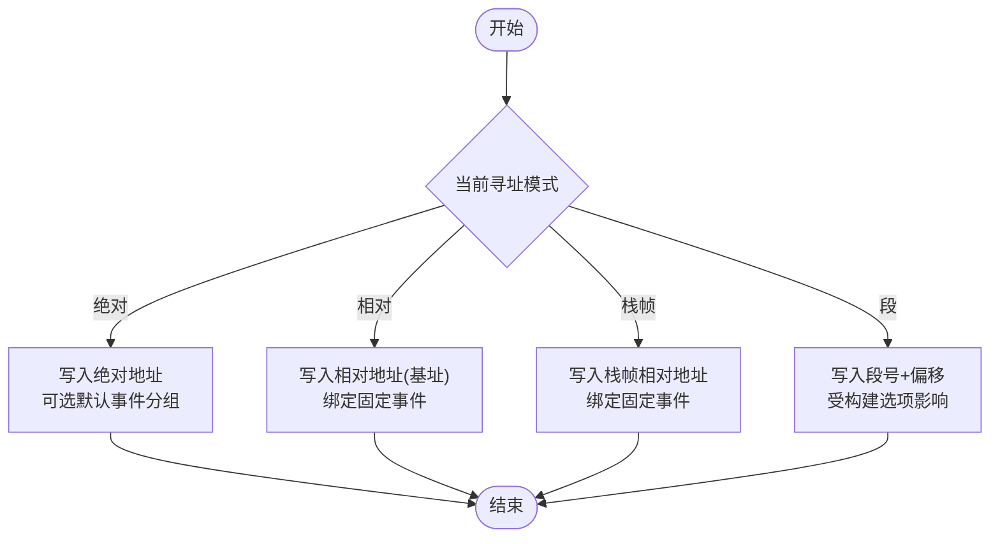
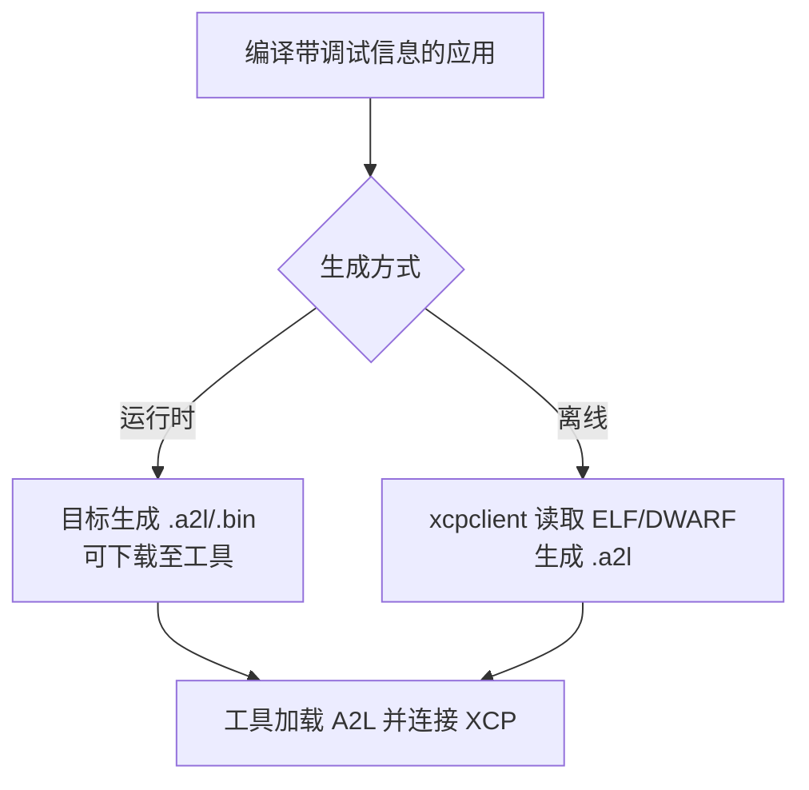
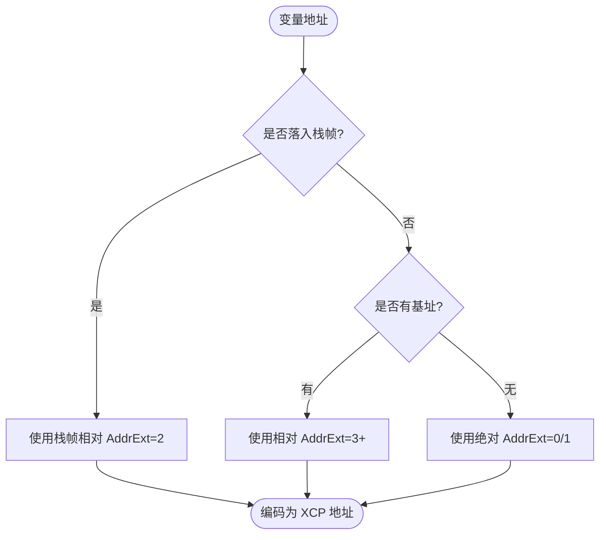
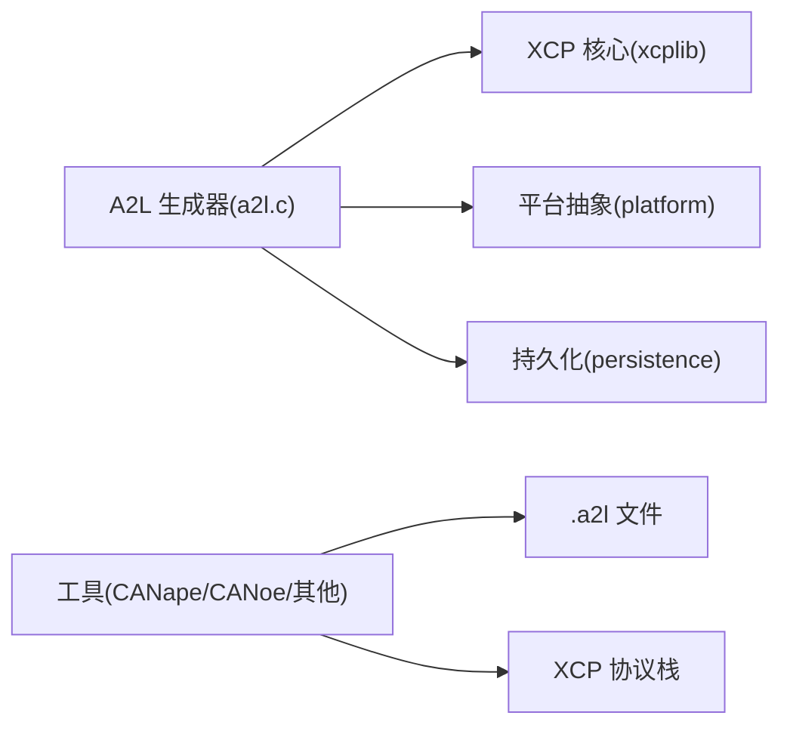

# 工具兼容性

<cite>
**本文引用的文件**
- [README.md](file://README.md)
- [TECHNICAL.md](file://docs/TECHNICAL.md)
- [OFFLINE_A2L.md](file://docs/OFFLINE_A2L.md)
- [xcplib.md](file://docs/xcplib.md)
- [a2l.h](file://inc/a2l.h)
- [a2l.c](file://src/a2l.c)
- [XCP_104.aml](file://XCP_104.aml)
</cite>

## 目录
1. [简介](#简介)
2. [项目结构](#项目结构)
3. [核心组件](#核心组件)
4. [架构总览](#架构总览)
5. [详细组件分析](#详细组件分析)
6. [依赖关系分析](#依赖关系分析)
7. [性能考虑](#性能考虑)
8. [故障排查指南](#故障排查指南)
9. [结论](#结论)
10. [附录](#附录)

## 简介
本文件面向使用 CANape、CANoe 等 ASAM 兼容工具的工程师，系统说明 XCPlite 与这些工具的兼容性要点。重点覆盖：
- A2L 文件的作用与重要性（运行时生成 vs 离线生成）
- XCP >1.4 标准遵循情况与第三方工具互操作
- 地址扩展与相对寻址编码的处理方式
- 复杂数据类型与 ABI 细节理解
- 不同工具的集成配置与最佳实践建议

XCPlite 明确声明为 XCP >1.4 兼容，并定期与 CANape 23+ 进行验证；同时可与 CANoe 及其他第三方 ASAM 兼容的 XCP 工具与数据记录器互操作。对于保存操作，客户端工具必须尊重固定事件定义并正确处理地址扩展，因为 XCPlite 使用地址扩展来编码相对内存寻址。若工具能理解复杂数据实例的 ABI 细节，仍可执行常规地址计算以访问复合类型的字段或数组成员，从而优化上传、下载与数据采集。

**章节来源**
- [README.md:38-50](file://README.md#L38-L50)

## 项目结构
围绕“工具兼容性”的关键位置包括：
- 协议与接口描述：XCP_104.aml（ASAM A2ML 1.4）
- 运行时 A2L 生成 API：inc/a2l.h、src/a2l.c
- 技术细节与寻址模式：docs/TECHNICAL.md
- 离线 A2L 生成流程与规则：docs/OFFLINE_A2L.md
- 示例工程中的 CANape 配置与自动检测 A2L：examples/*/CANape/*

**图表来源**
- [a2l.h:20-47](file://inc/a2l.h#L20-L47)
- [a2l.c:36-69](file://src/a2l.c#L36-L69)
- [XCP_104.aml:30-140](file://XCP_104.aml#L30-L140)

**章节来源**
- [a2l.h:20-47](file://inc/a2l.h#L20-L47)
- [a2l.c:36-69](file://src/a2l.c#L36-L69)
- [XCP_104.aml:30-140](file://XCP_104.aml#L30-L140)

## 核心组件
- A2L 生成子系统
  - 提供四种寻址模式：绝对、相对、栈帧相对、段相对；支持自动模式在生成时选择最优路径
  - 线程安全与一次性注册模式，避免重复定义
  - 输出 .a2l 与可选的二进制持久化文件，保证事件/段编号稳定
- XCP 协议层与传输
  - 基于以太网（TCP/UDP），遵循 XCP 1.4 协议能力集
  - 支持 DAQ/STIM、事件、校准段、时间戳等
- 工具互操作
  - 通过 A2L 描述测量/参数/类型/元信息，供 CANape/CANoe 等工具加载
  - 对地址扩展与相对寻址的正确处理是互操作关键

**章节来源**
- [a2l.h:20-47](file://inc/a2l.h#L20-L47)
- [a2l.h:324-376](file://inc/a2l.h#L324-L376)
- [a2l.c:381-409](file://src/a2l.c#L381-L409)
- [XCP_104.aml:30-140](file://XCP_104.aml#L30-L140)

## 架构总览
下图展示从应用到工具的完整数据流：应用通过宏/API 注册测量与参数，A2L 生成器产出描述文件；工具读取 A2L 建立 ODT/事件映射并通过 XCP 协议访问目标。

**图表来源**
- [a2l.c:288-377](file://src/a2l.c#L288-L377)
- [XCP_104.aml:30-140](file://XCP_104.aml#L30-L140)

**章节来源**
- [a2l.c:288-377](file://src/a2l.c#L288-L377)
- [XCP_104.aml:30-140](file://XCP_104.aml#L30-L140)

## 详细组件分析

### A2L 生成与寻址模式
- 四种寻址模式
  - 绝对寻址：全局/静态变量
  - 相对寻址：基于基址指针（如堆对象）
  - 栈帧相对：函数局部变量，基于触发时的栈帧基址
  - 段相对：校准段内偏移（受 CASDD/ACSDD 构建选项影响）
- 自动寻址模式
  - 在生成阶段根据变量地址与基址/栈帧的关系选择最优模式，必要时回退到绝对或应用自定义寻址
- 事件与默认事件
  - 相对/动态寻址需绑定固定事件；绝对寻址可设置默认事件用于分组
- 线程安全与一次性
  - 提供锁与 once 模式，确保 A2L 定义不重复且线程安全

**图表来源**
- [a2l.h:324-376](file://inc/a2l.h#L324-L376)
- [a2l.c:466-514](file://src/a2l.c#L466-L514)
- [a2l.c:580-694](file://src/a2l.c#L580-L694)

**章节来源**
- [a2l.h:324-376](file://inc/a2l.h#L324-L376)
- [a2l.c:466-514](file://src/a2l.c#L466-L514)
- [a2l.c:580-694](file://src/a2l.c#L580-L694)

### 运行时 A2L 生成 vs 离线 A2L 生成
- 运行时生成
  - 在目标上创建 A2L 文件，可通过 XCP 下载到工具；支持持久化以保证事件/段编号稳定
  - 适合需要动态事件（如线程局部数据）的场景
- 离线生成
  - 通过 xcpclient 从 ELF/DWARF 提取标记与类型信息，生成完整 A2L
  - 无需目标文件系统依赖，适用于 RTOS/微控制器场景
  - 严格依赖宏产生的 ELF 节与 DWARF 锚点（trg__*）

**图表来源**
- [OFFLINE_A2L.md:1-11](file://docs/OFFLINE_A2L.md#L1-L11)
- [OFFLINE_A2L.md:35-70](file://docs/OFFLINE_A2L.md#L35-L70)
- [TECHNICAL.md:56-101](file://docs/TECHNICAL.md#L56-L101)

**章节来源**
- [OFFLINE_A2L.md:1-11](file://docs/OFFLINE_A2L.md#L1-L11)
- [OFFLINE_A2L.md:35-70](file://docs/OFFLINE_A2L.md#L35-L70)
- [TECHNICAL.md:56-101](file://docs/TECHNICAL.md#L56-L101)

### 地址扩展与相对寻址编码
- 地址扩展（AddrExt）用于指示寻址模式：
  - 绝对、段相对、栈帧相对、动态（含捕获结构）、应用自定义等
- 两种主要方案：
  - CASDD：段相对优先（默认）
  - ACSDD：绝对优先（适用于某些 MCU 或工具限制）
- 工具注意事项：
  - 保存操作必须正确保留地址扩展，将其视为不透明句柄
  - 若工具理解 ABI，可进一步做字段级访问优化

**图表来源**
- [TECHNICAL.md:269-313](file://docs/TECHNICAL.md#L269-L313)
- [TECHNICAL.md:179-213](file://docs/TECHNICAL.md#L179-L213)
- [README.md:42-45](file://README.md#L42-L45)

**章节来源**
- [TECHNICAL.md:269-313](file://docs/TECHNICAL.md#L269-L313)
- [TECHNICAL.md:179-213](file://docs/TECHNICAL.md#L179-L213)
- [README.md:42-45](file://README.md#L42-L45)

### 复杂数据类型与 ABI 细节
- 支持基本类型、数组、结构体与嵌套结构
- 离线生成时，DWARF 类型信息映射为 A2L 的 TYPEDEF_STRUCTURE/INSTANCE
- 若工具理解 ABI，可对复合类型进行字段级访问与范围合并优化
- 注意：通用 A2L 编辑器通常无法自动重建 XCPlite 特定的相对地址编码

**章节来源**
- [OFFLINE_A2L.md:215-239](file://docs/OFFLINE_A2L.md#L215-L239)
- [README.md:44-46](file://README.md#L44-L46)

### 与 CANape/CANoe 及第三方工具的互操作
- 遵循 XCP >1.4，与 CANape 23+ 定期验证；亦与 CANoe 及其他 ASAM 工具互操作
- 关键点：
  - 固定事件与地址扩展的正确性
  - EPK（ECU 软件版本）用于 A2L/BIN 兼容性校验
  - GET_ID 5（EPK）在某些工具上的行为差异与规避策略
  - 共享轴与 this. 引用在较新版本中受益但非必需

**章节来源**
- [README.md:38-50](file://README.md#L38-L50)
- [TECHNICAL.md:342-353](file://docs/TECHNICAL.md#L342-L353)
- [TECHNICAL.md:398-412](file://docs/TECHNICAL.md#L398-L412)

### 集成配置与最佳实践
- 使用运行时 A2L 生成时：
  - 确保事件/段注册顺序确定或使用持久化保持编号稳定
  - 在连接时完成 A2L 最终化，避免后续定义不可见
- 使用离线 A2L 生成时：
  - 使用提供的 xcpclient 工具，遵循宏与命名约定
  - 仅发布显式标注的变量以减少噪声
- 工具侧：
  - 保存校准值时务必保留地址扩展
  - 对复杂类型，若工具支持 ABI，可利用字段级访问优化吞吐

**章节来源**
- [xcplib.md:547-607](file://docs/xcplib.md#L547-L607)
- [OFFLINE_A2L.md:85-95](file://docs/OFFLINE_A2L.md#L85-L95)
- [OFFLINE_A2L.md:196-213](file://docs/OFFLINE_A2L.md#L196-L213)

## 依赖关系分析
- A2L 生成器依赖：
  - 平台抽象（文件、线程、原子、时钟、套接字）
  - XCP 核心（事件、段、地址编码）
  - 持久化模块（二进制文件读写）
- 工具依赖：
  - A2L 解析与设备建模
  - XCP 协议栈（以太网传输）

**图表来源**
- [a2l.c:13-33](file://src/a2l.c#L13-L33)
- [a2l.c:288-377](file://src/a2l.c#L288-L377)

**章节来源**
- [a2l.c:13-33](file://src/a2l.c#L13-L33)
- [a2l.c:288-377](file://src/a2l.c#L288-L377)

## 性能考虑
- 资源占用
  - 释放版库大小约 160KB（不含调试打印）
  - 静态内存用于 DAQ 表与校准段页；堆内存用于传输队列；每线程栈约 1KB
- 触发与传输
  - 采集触发与数据传输采用无锁实现；DAQ 触发可能调用外部时间源
  - 事件创建可能使用互斥锁；校准段创建使用互斥锁，访问无锁
- 工具侧优化
  - 若工具理解 ABI，可对复合类型进行字段级访问与范围合并，减少带宽与延迟

**章节来源**
- [TECHNICAL.md:5-52](file://docs/TECHNICAL.md#L5-L52)

## 故障排查指南
- 常见问题与规避
  - 保存校准值时必须保留地址扩展，否则可能导致不一致或损坏的数据
  - 某些工具忽略段号或地址扩展，需采用替代策略（如始终复制所有段、使用绝对地址）
  - GET_ID 5（EPK）在某些工具上被忽略，应通过下载提供 EPK
  - 共享轴与 this. 引用在旧版本工具中不受支持
- 诊断建议
  - 检查 A2L 与目标 EPK 是否匹配
  - 确认事件/段编号稳定性（使用持久化或确定性注册顺序）
  - 对于缺失变量，检查 DWARF 位置与 volatile 修饰

**章节来源**
- [README.md:42-50](file://README.md#L42-L50)
- [TECHNICAL.md:398-412](file://docs/TECHNICAL.md#L398-L412)
- [OFFLINE_A2L.md:244-269](file://docs/OFFLINE_A2L.md#L244-L269)

## 结论
XCPlite 严格遵循 XCP >1.4，能够与 CANape、CANoe 及其他 ASAM 兼容工具良好互操作。成功集成的关键在于：
- 正确使用 A2L（运行时或离线）
- 正确处理地址扩展与相对寻址
- 合理管理事件与校准段编号稳定性
- 在工具侧尊重 XCPlite 的寻址语义，并在支持 ABI 的情况下进行优化

## 附录
- 协议与接口参考
  - XCP 1.4 协议能力集与枚举定义参见 XCP_104.aml
  - A2L 生成 API 与寻址模式详见 inc/a2l.h 与 src/a2l.c
- 工作流参考
  - 离线 A2L 生成流程与规则详见 docs/OFFLINE_A2L.md
  - 技术细节（寻址、标记、平台要求）详见 docs/TECHNICAL.md

**章节来源**
- [XCP_104.aml:30-140](file://XCP_104.aml#L30-L140)
- [a2l.h:20-47](file://inc/a2l.h#L20-L47)
- [a2l.c:36-69](file://src/a2l.c#L36-L69)
- [OFFLINE_A2L.md:1-11](file://docs/OFFLINE_A2L.md#L1-L11)
- [TECHNICAL.md:56-101](file://docs/TECHNICAL.md#L56-L101)