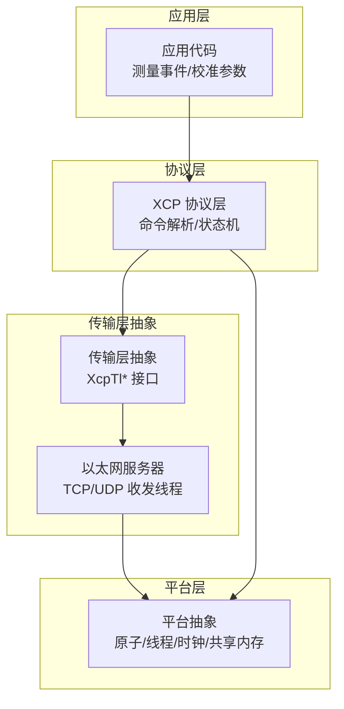
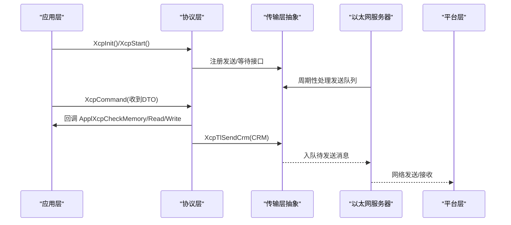
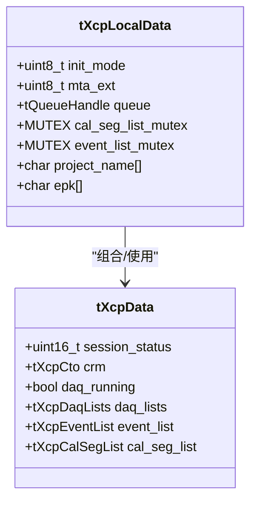
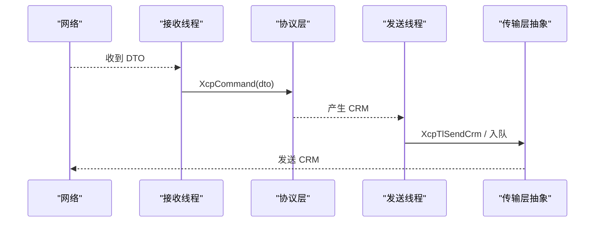
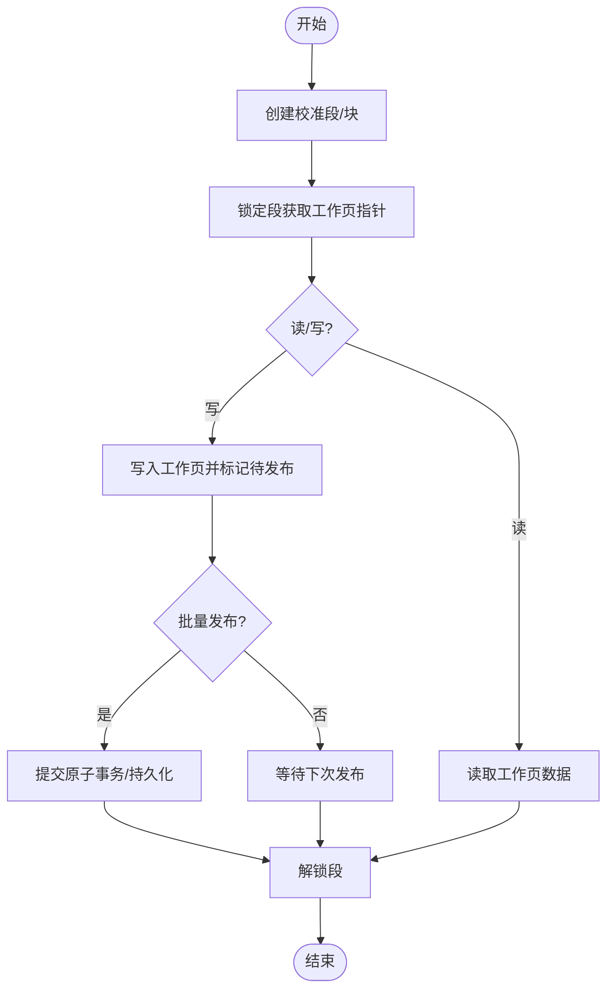
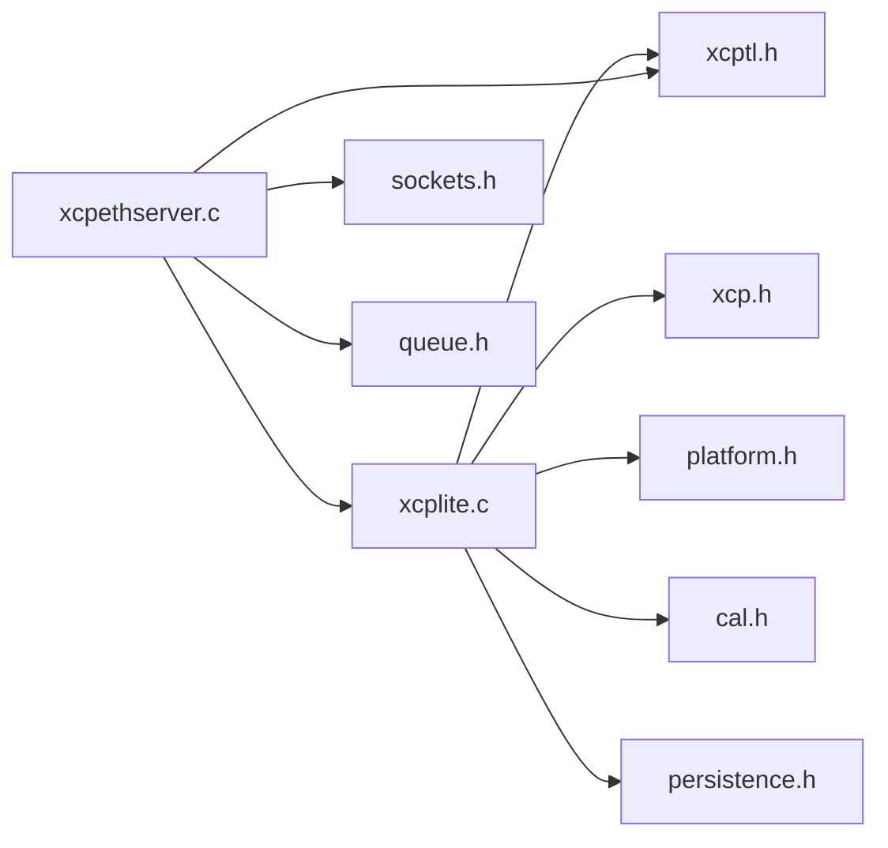

# 架构概览

<cite>
**本文引用的文件**
- [README.md](file://README.md)
- [src/xcplite.h](file://src/xcplite.h)
- [src/xcplite.c](file://src/xcplite.c)
- [src/xcp.h](file://src/xcp.h)
- [src/xcptl.h](file://src/xcptl.h)
- [src/xcptl_cfg.h](file://src/xcptl_cfg.h)
- [src/platform.h](file://src/platform.h)
- [src/xcpethserver.h](file://src/xcpethserver.h)
- [src/xcpethserver.c](file://src/xcpethserver.c)
- [src/cal.h](file://src/cal.h)
- [examples/hello_xcp/src/main.c](file://examples/hello_xcp/src/main.c)
</cite>

## 目录
1. [简介](#简介)
2. [项目结构](#项目结构)
3. [核心组件](#核心组件)
4. [架构总览](#架构总览)
5. [详细组件分析](#详细组件分析)
6. [依赖关系分析](#依赖关系分析)
7. [性能与可扩展性](#性能与可扩展性)
8. [故障排查指南](#故障排查指南)
9. [结论](#结论)

## 简介
XCPlite 是面向现代多核处理器和 SoC 的 XCP（ASAM 标准）实现，专注于“XCP on Ethernet”传输层（TCP/UDP），提供低延迟、可预测、无锁的数据采集与参数校准能力。其设计采用分层架构：协议层（XCP 命令处理）、传输层抽象（统一发送/接收队列接口）、应用层回调（内存访问、时钟、DAQ/CAL 钩子等）。通过单例模式管理全局状态，以插件式传输层解耦底层网络栈，平台适配层屏蔽 OS/RTOS 差异，从而实现高扩展性与可维护性。

## 项目结构
- 协议层与核心状态：src/xcplite.*、src/xcp.h
- 传输层抽象与配置：src/xcptl.*、src/xcptl_cfg.h
- 以太网服务器与线程模型：src/xcpethserver.*
- 校准段管理：src/cal.h/.c
- 平台抽象：src/platform.h/.c
- 示例与应用集成：examples/hello_xcp/src/main.c

图表来源
- [src/xcplite.h:42-109](file://src/xcplite.h#L42-L109)
- [src/xcptl.h:19-26](file://src/xcptl.h#L19-L26)
- [src/xcpethserver.c:55-113](file://src/xcpethserver.c#L55-L113)
- [src/platform.h:255-510](file://src/platform.h#L255-L510)

章节来源
- [README.md:7-35](file://README.md#L7-L35)
- [src/xcptl_cfg.h:34-143](file://src/xcptl_cfg.h#L34-L143)

## 核心组件
- XCP 协议层（xcplite）：实现 XCP V1.4 命令集、会话状态、DAQ/STIM/PAG/PGM 流程；维护全局 tXcpData 与进程本地 tXcpLocalData；提供事件触发、后台任务、连接断开等 API。
- 传输层抽象（xcptl）：定义统一的发送队列处理、等待队列为空、CRM 发送、CTR 计数获取等接口，屏蔽 TCP/UDP/Raw 差异。
- 以太网服务器（xcpethserver）：创建接收/发送线程，管理队列与 SHM 模式下的共享队列；负责将网络数据交给协议层，并将响应写回网络。
- 校准段管理器（cal）：实现校准段/块的生命周期、页切换、原子写入、持久化、查找与索引映射；支持段内默认页/ECU页/XCP页及自由交换页。
- 平台适配层（platform）：封装原子操作、线程/互斥量、高精度时钟、共享内存、延时等跨平台能力。

章节来源
- [src/xcplite.h:382-495](file://src/xcplite.h#L382-L495)
- [src/xcptl.h:19-26](file://src/xcptl.h#L19-L26)
- [src/xcpethserver.c:80-113](file://src/xcpethserver.c#L80-L113)
- [src/cal.h:86-175](file://src/cal.h#L86-L175)
- [src/platform.h:255-510](file://src/platform.h#L255-L510)

## 架构总览
XCPlite 采用清晰的分层与回调机制：
- 协议层负责 XCP 协议语义，不直接操作网络 IO，仅通过传输层抽象发送 CRM 并消费 DTO。
- 传输层抽象提供最小化的发送/等待接口，具体实现由以太网服务器驱动。
- 应用层通过回调注册内存访问、时钟、DAQ/CAL 钩子，使协议层与业务逻辑解耦。
- 平台层提供原子、线程、时钟、共享内存等基础能力，保证在 POSIX/RTOS 上的一致行为。

图表来源
- [src/xcplite.h:501-627](file://src/xcplite.h#L501-L627)
- [src/xcptl.h:19-26](file://src/xcptl.h#L19-L26)
- [src/xcpethserver.c:55-113](file://src/xcpethserver.c#L55-L113)
- [src/platform.h:255-510](file://src/platform.h#L255-L510)

## 详细组件分析

### 协议层（xcplite）
- 单例状态：tXcpData（跨进程共享或进程内静态）+ tXcpLocalData（进程本地）。
- 关键能力：
  - 初始化与启动：XcpInit/XcpStart，支持 LOCAL/SHM/SHM_AUTO/DEACTIVATE/PERSISTENCE 模式。
  - 命令处理：XcpCommand 解析 XCP 命令，调用应用回调完成内存访问、DAQ/CAL 控制。
  - DAQ 事件：事件列表/预注册段扫描，触发事件并生成 DTO。
  - 后台任务：XcpBackgroundTasks 处理非实时任务（如超时、发布延迟写入）。
  - 时间同步：可选 PTP/多播时钟信息。
- 回调机制：ApplXcp* 系列函数为应用侧实现点，包括连接/断开、DAQ 准备/启停、内存读写、时钟、用户命令、冻结/恢复等。

图表来源
- [src/xcplite.h:382-495](file://src/xcplite.h#L382-L495)

章节来源
- [src/xcplite.h:42-109](file://src/xcplite.h#L42-L109)
- [src/xcplite.h:501-627](file://src/xcplite.h#L501-L627)
- [src/xcplite.c:184-200](file://src/xcplite.c#L184-L200)

### 传输层抽象（xcptl）
- 统一接口：
  - XcpTlHandleTransmitQueue：从队列取出消息并交由具体传输实现发送。
  - XcpTlWaitForTransmitQueueEmpty：阻塞等待发送队列清空（带超时）。
  - XcpTlSendCrm：发送 CRM 响应。
  - XcpTlGetCtr：获取下一个 CTR 计数器值。
- 配置项：CTO/DTO 最大尺寸、段大小、对齐、头预留、是否走队列发送 CRM、是否排除 CRM 计数器等。

章节来源
- [src/xcptl.h:19-26](file://src/xcptl.h#L19-L26)
- [src/xcptl_cfg.h:34-143](file://src/xcptl_cfg.h#L34-L143)

### 以太网服务器（xcpethserver）
- 线程模型：
  - 接收线程：读取网络数据，交给协议层处理。
  - 发送线程：周期性处理发送队列，调用传输层发送。
- SHM 模式：
  - 共享队列头 tShmQueueHeader，首个进程作为 leader 初始化队列，其他进程 attach。
  - 非服务器进程启动后台线程，轮询 A2L finalize 标志并推进 alive counter。
- 生命周期：XcpEthServerInit/Shutdown/Status。

图表来源
- [src/xcpethserver.c:55-113](file://src/xcpethserver.c#L55-L113)
- [src/xcpethserver.c:118-200](file://src/xcpethserver.c#L118-L200)

章节来源
- [src/xcpethserver.h:19-34](file://src/xcpethserver.h#L19-L34)
- [src/xcpethserver.c:80-200](file://src/xcpethserver.c#L80-L200)

### 校准段管理器（cal）
- 数据结构：
  - tXcpCalSegHeader：包含 ECU/XCP/默认页偏移、访问锁、持久化位置、名称等。
  - tXcpCalSeg：头部 + 可变长度页数据区。
  - tXcpCalSegList：段列表、内存池、原子分配器。
- 功能：
  - 创建/查找/锁定/解锁校准段与块。
  - 设置/获取校准页、复制页、冻结模式。
  - 原子事务：Begin/End 批量更新，提升一致性。
  - 持久化：结合二进制文件保存/加载校准数据。
- 地址模式：支持绝对地址与段相对地址，确保跨进程共享内存安全（偏移而非指针）。

图表来源
- [src/cal.h:86-175](file://src/cal.h#L86-L175)
- [src/cal.h:186-310](file://src/cal.h#L186-L310)

章节来源
- [src/cal.h:86-175](file://src/cal.h#L86-L175)
- [src/cal.h:186-310](file://src/cal.h#L186-L310)

### 平台适配层（platform）
- 原子操作：C11 stdatomic 或 Windows Interlocked 模拟，保证跨平台一致性。
- 线程/互斥：POSIX pthreads、Windows CRITICAL_SECTION、FreeRTOS Semaphore。
- 时钟：高精度单调/实时时钟，支持 ns/us 分辨率，提供 last 缓存优化。
- 共享内存：POSIX shm_open/mmap，leader/follower 协作初始化。
- 延时：微秒/毫秒级 sleep。

章节来源
- [src/platform.h:255-510](file://src/platform.h#L255-L510)
- [src/platform.h:520-672](file://src/platform.h#L520-L672)

### 应用集成示例
- hello_xcp 展示了完整的初始化流程：XcpInit -> XcpEthServerInit -> A2lInit -> 创建校准段 -> 主循环中锁定/解锁段并触发事件。
- 体现了事件驱动的测量与参数校准，以及运行时 A2L 生成。

章节来源
- [examples/hello_xcp/src/main.c:146-282](file://examples/hello_xcp/src/main.c#L146-L282)

## 依赖关系分析
- 协议层依赖：
  - xcp.h：XCP 命令/响应定义、错误码、事件码。
  - xcptl.h：传输层抽象接口。
  - platform.h：原子/线程/时钟等。
  - cal.h：校准段管理（可选）。
  - persistence.h：持久化（可选）。
- 传输层依赖：
  - sockets.h：网络套接字封装。
  - queue.h：队列抽象（支持共享内存）。
- 服务器依赖：
  - xcpethtl.h：以太网特定传输函数（可选）。
  - a2l.h：A2L 生成与最终化（SHM 模式下）。

图表来源
- [src/xcplite.c:49-89](file://src/xcplite.c#L49-L89)
- [src/xcpethserver.c:14-39](file://src/xcpethserver.c#L14-L39)

章节来源
- [src/xcplite.c:49-89](file://src/xcplite.c#L49-L89)
- [src/xcpethserver.c:14-39](file://src/xcpethserver.c#L14-L39)

## 性能与可扩展性
- 无锁与原子：DAQ 事件与校准段使用原子变量与无锁队列，避免阻塞与上下文切换开销。
- 零拷贝与固定内存：队列与缓冲区静态分配，减少堆分配与碎片。
- 传输层插件化：通过 xcptl 抽象，可替换 TCP/UDP/Raw 实现而不影响协议层。
- 平台抽象：同一份协议与传输逻辑可在 Linux/QNX/macOS/Windows/FreeRTOS 运行。
- 可扩展点：
  - 新增传输层：实现 xcptl 接口并在服务器中接入。
  - 新增回调：注册 ApplXcp* 回调以定制内存访问、时钟、DAQ/CAL 行为。
  - 配置裁剪：通过 xcptl_cfg.h 与 xcplib_cfg.h 开关功能，减小体积与复杂度。

[本节为通用指导，无需特定文件引用]

## 故障排查指南
- 常见问题定位：
  - 传输队列堆积：检查 XcpTlHandleTransmitQueue 是否被周期性调用，确认发送线程是否正常运行。
  - DAQ 溢出：关注 daq_overflow_count，调整队列大小或降低事件频率。
  - 校准段冲突：确保正确使用 XcpLockCalSeg/XcpUnlockCalSeg，避免跨线程不一致。
  - 共享内存初始化失败：确认 leader/follower 角色与队列 size 一致，检查 platformShmOpen 返回值。
- 日志与指标：
  - 使用 XcpSetLogLevel 调节日志级别。
  - 启用 TEST_ENABLE_DBG_METRICS 收集 tx/rx 计数、事件计数等调试指标。

章节来源
- [src/xcplite.h:637-653](file://src/xcplite.h#L637-L653)
- [src/xcpethserver.c:118-200](file://src/xcpethserver.c#L118-L200)

## 结论
XCPlite 通过分层架构（协议层/传输层抽象/应用回调/平台适配）实现了高内聚、低耦合的设计。单例模式集中管理状态，插件式传输层与平台抽象确保了跨平台与可扩展性。校准段管理器提供原子一致的参数访问与持久化，DAQ 事件系统支持高效数据采集。整体设计兼顾了实时性、可维护性与可移植性，适用于现代多核系统与多种目标平台。