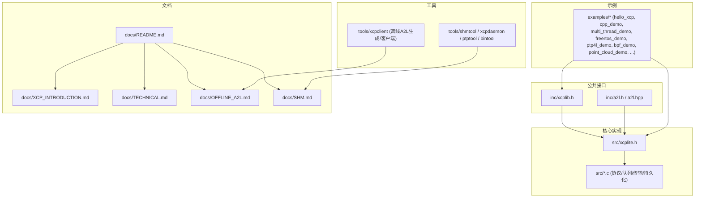
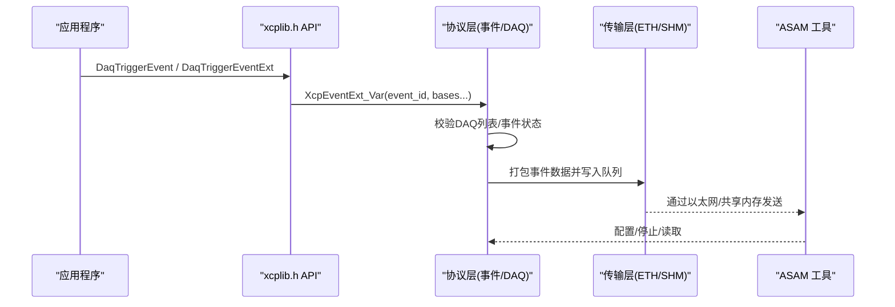
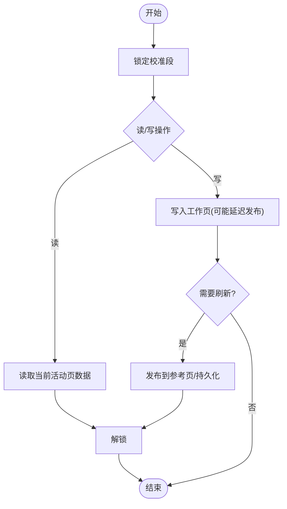
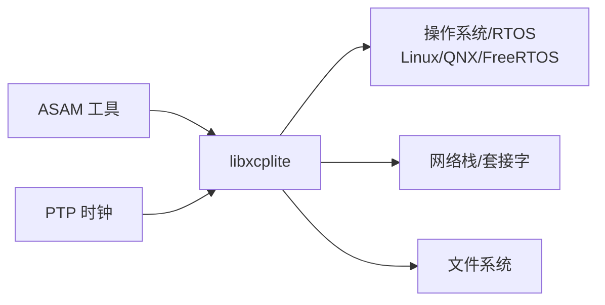

# 项目概述

<cite>
**本文引用的文件**
- [README.md](file://README.md)
- [docs/README.md](file://docs/README.md)
- [docs/XCP_INTRODUCTION.md](file://docs/XCP_INTRODUCTION.md)
- [docs/TECHNICAL.md](file://docs/TECHNICAL.md)
- [docs/OFFLINE_A2L.md](file://docs/OFFLINE_A2L.md)
- [docs/SHM.md](file://docs/SHM.md)
- [examples/README.md](file://examples/README.md)
- [inc/xcplib.h](file://inc/xcplib.h)
- [src/xcplite.h](file://src/xcplite.h)
</cite>

## 目录
1. [简介](#简介)
2. [项目结构](#项目结构)
3. [核心组件](#核心组件)
4. [架构总览](#架构总览)
5. [详细组件分析](#详细组件分析)
6. [依赖关系分析](#依赖关系分析)
7. [性能考量](#性能考量)
8. [故障排查指南](#故障排查指南)
9. [结论](#结论)
10. [附录](#附录)

## 简介
XCPlite 是一个面向现代多核微处理器与系统级芯片的 XCP（测量与标定协议）实现，专注于在 POSIX（Linux、QNX）或实时操作系统（FreeRTOS、ThreadX）上提供高性能、可预测的运行时数据采集与参数标定能力。它通过“相对寻址模式”“线程安全无锁设计”“确定性运行时性能”等关键特性，将传统仅用于嵌入式微控制器的 XCP 使用场景扩展到更复杂的现代系统中。

- 目标：为多核/多线程环境提供低开销、可预测的数据采集与参数修改通道，兼容主流 ASAM 工具（如 CANape、CANoe）。
- 传输层：专注 XCP over Ethernet（TCP/UDP），支持巨型帧以提升吞吐。
- A2L 文件：作为工具与目标的“清单”，描述信号、参数、类型与元数据；支持目标端生成与构建期离线生成两种工作流。
- 适用场景：汽车电子、工业控制、机器人、音视频处理、网络栈与内核态观测（eBPF）、PTP 高精度时间同步等。
- 目标用户：嵌入式/系统工程师、测试与标定工程师、平台与中间件开发者、工具链集成者。

**章节来源**
- [README.md:3-36](file://README.md#L3-L36)
- [docs/XCP_INTRODUCTION.md:3-24](file://docs/XCP_INTRODUCTION.md#L3-L24)

## 项目结构
仓库采用分层组织：公共 API（inc）、核心实现（src）、文档（docs）、示例（examples）、工具（tools）与测试（test）。CMake 构建系统与配置头使库可在不同平台与配置下编译。



**图表来源**
- [inc/xcplib.h:39-59](file://inc/xcplib.h#L39-L59)
- [src/xcplite.h:46-74](file://src/xcplite.h#L46-L74)
- [docs/README.md:5-20](file://docs/README.md#L5-L20)

**章节来源**
- [docs/README.md:5-20](file://docs/README.md#L5-L20)
- [examples/README.md:21-184](file://examples/README.md#L21-L184)

## 核心组件
- XCP 协议层与状态机：事件管理、DAQ 列表、命令处理、会话与连接状态、时钟信息。
- 传输层抽象：以太网 TCP/UDP 套接字、共享内存（SHM）模式、原始套接字 HAL。
- 校准段（Calibration Segments）：工作页/参考页切换、原子一致性访问、持久化（freeze/bin）。
- DAQ 事件与触发：无锁生产者路径、时间戳、捕获局部变量、相对寻址（栈帧/动态基址）。
- A2L 生成：目标端运行时生成与构建期离线生成（xcpclient 基于 ELF/DWARF）。
- 多应用/多进程：POSIX 共享内存模式下的跨进程状态共享与合并 A2L。

**章节来源**
- [src/xcplite.h:46-74](file://src/xcplite.h#L46-L74)
- [src/xcplite.h:382-423](file://src/xcplite.h#L382-L423)
- [inc/xcplib.h:61-139](file://inc/xcplib.h#L61-L139)
- [inc/xcplib.h:239-453](file://inc/xcplib.h#L239-L453)
- [docs/TECHNICAL.md:5-27](file://docs/TECHNICAL.md#L5-L27)
- [docs/OFFLINE_A2L.md:13-34](file://docs/OFFLINE_A2L.md#L13-L34)
- [docs/SHM.md:6-26](file://docs/SHM.md#L6-L26)

## 架构总览
XCPlite 以“协议层 + 传输层 + 应用适配”的分层架构组织。应用通过 C/C++ API 注册事件与校准段，协议层负责事件调度、DAQ 列表管理与 XCP 命令处理，传输层负责与主机工具通信。A2L 既可在目标端生成并上传，也可由构建期工具从 ELF/DWARF 离线生成。

```mermaid
graph TB
App["应用程序<br/>事件/校准段/元数据"]
API["libxcplite API<br/>xcplib.h / xcplib.hpp"]
Proto["协议层<br/>xcplite.c / xcplite.h"]
TL["传输层<br/>ETH(TCP/UDP)/SHM/RAW"]
Tool["ASAM 工具<br/>CANape / CANoe / xcpclient"]
A2L["A2L 生成<br/>目标端/离线(xcpclient)"]
App --> API
API --> Proto
Proto --> TL
TL < --> Tool
A2L --> Tool
A2L --> Proto
```

**图表来源**
- [inc/xcplib.h:39-59](file://inc/xcplib.h#L39-L59)
- [src/xcplite.h:46-74](file://src/xcplite.h#L46-L74)
- [docs/OFFLINE_A2L.md:35-63](file://docs/OFFLINE_A2L.md#L35-L63)

## 详细组件分析

### 相对寻址模式与地址扩展
XCPlite 广泛使用相对寻址，通过地址扩展（AddrExt）区分绝对地址、校准段相对、栈帧相对、动态基址等模式，从而实现对全局、栈、堆、线程本地以及复杂对象成员的零拷贝直接访问。

- 默认 CASDD：校准段相对寻址优先，适合 64 位地址空间与灵活布局。
- ACSDD：绝对寻址优先，适用于传统 MCU 或要求绝对地址的场景。
- AXSDD：无校准段管理的绝对寻址变体。
- CXSDD：多应用 SHM 模式下的绝对寻址扩展。

这些模式由库导出签名变量指示，A2L 生成器据此正确解析测量与标定对象的地址编码。

**章节来源**
- [docs/TECHNICAL.md:269-313](file://docs/TECHNICAL.md#L269-L313)
- [docs/OFFLINE_A2L.md:72-84](file://docs/OFFLINE_A2L.md#L72-L84)

### 线程安全与无锁设计
- 采集触发与数据传输对生产者路径采用无锁实现，避免阻塞与线程间争用，确保高并发下的确定性时延。
- 校准段访问线程安全且无锁，支持原子页面切换与一致性写入。
- 事件创建与校准段创建在必要时使用互斥保护，保证列表一致性。
- 共享内存模式下，跨进程的状态同样遵循无锁与原子操作，保证多应用并发安全。

**章节来源**
- [docs/TECHNICAL.md:28-52](file://docs/TECHNICAL.md#L28-L52)
- [docs/SHM.md:16-19](file://docs/SHM.md#L16-L19)
- [inc/xcplib.h:70-88](file://inc/xcplib.h#L70-L88)

### 确定性运行时性能与资源占用
- 静态内存为主，堆分配主要用于传输队列与部分表项，栈每线程少量开销。
- 无额外缓冲与重序列化，直接按 ABI 访问原语类型与复合类型，降低 CPU 与内存压力。
- 事件触发与 DAQ 路径具备可预测执行时间，适合硬实时与高吞吐场景。

**章节来源**
- [docs/TECHNICAL.md:5-27](file://docs/TECHNICAL.md#L5-L27)
- [README.md:13-20](file://README.md#L13-L20)

### A2L 文件的作用与重要性
- A2L 是工具与目标的“清单”，描述测量点、参数、数据类型、单位、限值、转换规则与 XCP 设置。
- 支持目标端运行时生成与构建期离线生成（xcpclient 读取 ELF/DWARF）。
- 对于相对寻址与复杂类型，XCPlite 专用生成器能正确重建 A2L，通用编辑器通常无法自动推断。

**章节来源**
- [README.md:22-26](file://README.md#L22-L26)
- [docs/OFFLINE_A2L.md:13-34](file://docs/OFFLINE_A2L.md#L13-L34)
- [docs/OFFLINE_A2L.md:97-115](file://docs/OFFLINE_A2L.md#L97-L115)

### 与 ASAM 工具的兼容性
- 符合 XCP >1.4，与 CANape、CANoe 等第三方 ASAM 工具互通，定期验证于 CANape 23+。
- 保存参数时需尊重固定事件定义与地址扩展，XCPlite 使用地址扩展编码相对寻址。
- 若工具理解复杂类型的 ABI，可按字段/数组优化上传/下载与采集。

**章节来源**
- [README.md:38-49](file://README.md#L38-L49)

### 多核/多进程与共享内存（SHM）模式
- 启用 SHM 模式后，所有应用进程共享发送队列与校准 RCU 状态，仅一个进程充当 XCP 服务器（可为首个启动或专用守护进程）。
- 支持应用任意顺序启动/重启，快速恢复测量状态；BIN 持久化保证事件与校准段编号一致。
- 服务器合并各应用 A2L 并提供单一文件下载，EPK 由各应用 EPK 哈希生成。

**章节来源**
- [docs/SHM.md:6-26](file://docs/SHM.md#L6-L26)
- [docs/SHM.md:44-58](file://docs/SHM.md#L44-L58)

### 事件与触发机制（序列图）
以下序列图展示一次事件触发的典型调用流程，包括事件查找、相对寻址基址传递与无锁传输队列入队。



**图表来源**
- [inc/xcplib.h:570-642](file://inc/xcplib.h#L570-L642)
- [src/xcplite.h:183-195](file://src/xcplite.h#L183-L195)

### 校准段与页面切换（流程图）
校准段提供工作页（RAM）与参考页（FLASH）的原子切换与一致性访问，支持冻结持久化。



**图表来源**
- [inc/xcplib.h:70-139](file://inc/xcplib.h#L70-L139)
- [docs/TECHNICAL.md:46-52](file://docs/TECHNICAL.md#L46-L52)

**章节来源**
- [inc/xcplib.h:70-139](file://inc/xcplib.h#L70-L139)
- [docs/TECHNICAL.md:46-52](file://docs/TECHNICAL.md#L46-L52)

## 依赖关系分析
- 语言与标准：C11/C++17，原子操作、线程本地存储、DWARF 调试信息。
- 系统资源：文件系统（A2L 生成/持久化）、堆分配（队列/表项）、线程（收发任务）、时钟（时间戳）、套接字（以太网）。
- 外部依赖：ASAM 工具（CANape/CANoe）、可选 PTP 时间源、eBPF（示例）。



**图表来源**
- [docs/TECHNICAL.md:356-394](file://docs/TECHNICAL.md#L356-L394)
- [docs/SHM.md:6-26](file://docs/SHM.md#L6-L26)

**章节来源**
- [docs/TECHNICAL.md:356-394](file://docs/TECHNICAL.md#L356-L394)

## 性能考量
- 无锁生产者路径与原子操作减少争用，确保高并发下的低延迟与确定性。
- 静态内存为主，堆分配可控；队列大小应覆盖预期流量峰值（建议至少覆盖 10ms 流量）。
- 事件触发与 DAQ 路径避免不必要的复制与缓冲，直接按 ABI 访问内存。
- 校准段页面切换与持久化策略影响写入时延与一致性，需根据应用场景权衡。

**章节来源**
- [docs/TECHNICAL.md:5-27](file://docs/TECHNICAL.md#L5-L27)
- [docs/TECHNICAL.md:28-52](file://docs/TECHNICAL.md#L28-L52)

## 故障排查指南
- 工具兼容性问题：
  - COPY_CAL_PAGE、GET_ID 5（EPK）行为差异与规避方法。
  - 地址扩展与段号在特定工具中的限制与替代方案。
- 事件与变量可见性：
  - 内联函数导致栈帧相对地址失效，需标记非内联或使用捕获。
  - 寄存器变量无地址，需 volatile 或捕获。
- 多应用/SHM：
  - 服务器迁移、BIN 持久化与 EPK 哈希一致性。
- 构建与 A2L：
  - 调试信息缺失、符号不可见、类型冲突与命名冲突的处理。

**章节来源**
- [docs/TECHNICAL.md:396-412](file://docs/TECHNICAL.md#L396-L412)
- [docs/OFFLINE_A2L.md:244-269](file://docs/OFFLINE_A2L.md#L244-L269)

## 结论
XCPlite 将 XCP 的能力从传统 MCU 扩展到现代多核 SoC 与系统级软件，通过相对寻址、无锁线程安全与确定性运行时性能，满足高吞吐、低延迟与强一致性的采集与标定需求。其灵活的 A2L 生成方式与对 ASAM 工具的兼容性，使其成为汽车、工业与科研领域的可靠基础设施。结合示例与工具链，开发者可以快速搭建从原型到生产的完整测量与标定工作流。

## 附录
- 快速入门：从 hello_xcp 与 hello_xcp_cpp 开始，逐步探索复杂类型、多核与 RTOS 示例。
- 构建与配置：参考 docs/BUILDING.md 与 examples/README.md 中的构建脚本与配置选项。
- 高级主题：离线 A2L、SHM 模式、PTP 时间同步、eBPF 追踪与点云可视化。

**章节来源**
- [examples/README.md:21-184](file://examples/README.md#L21-L184)
- [docs/README.md:5-20](file://docs/README.md#L5-L20)