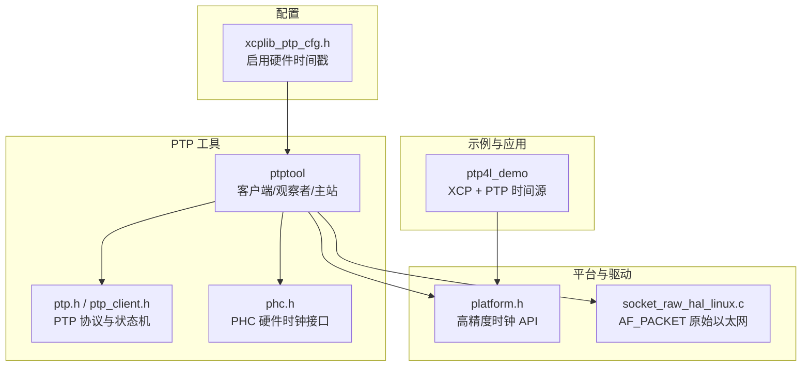
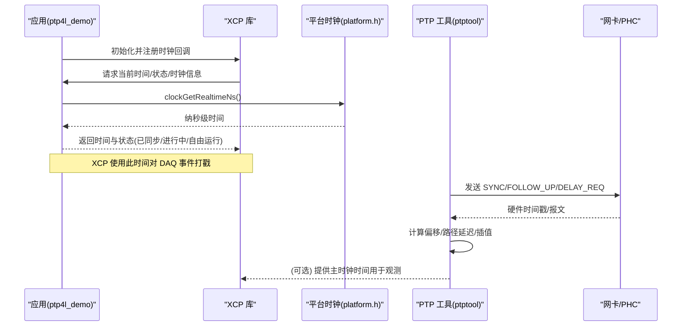
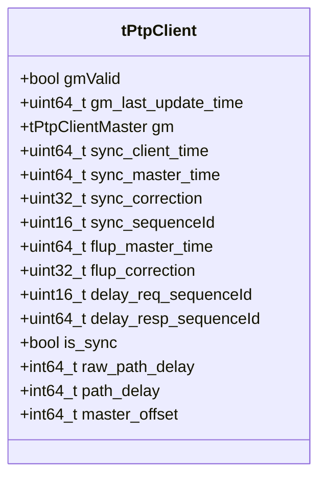
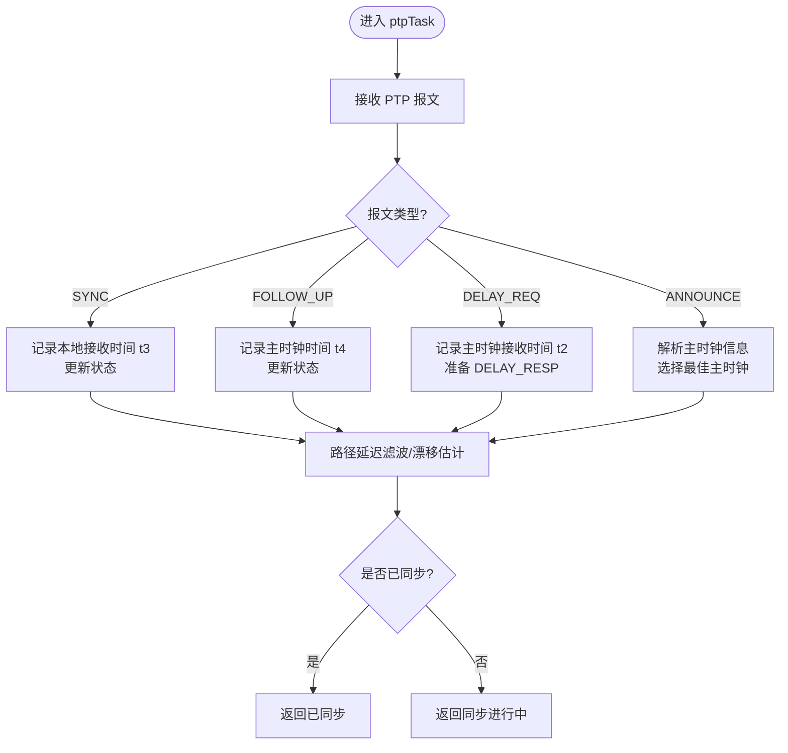
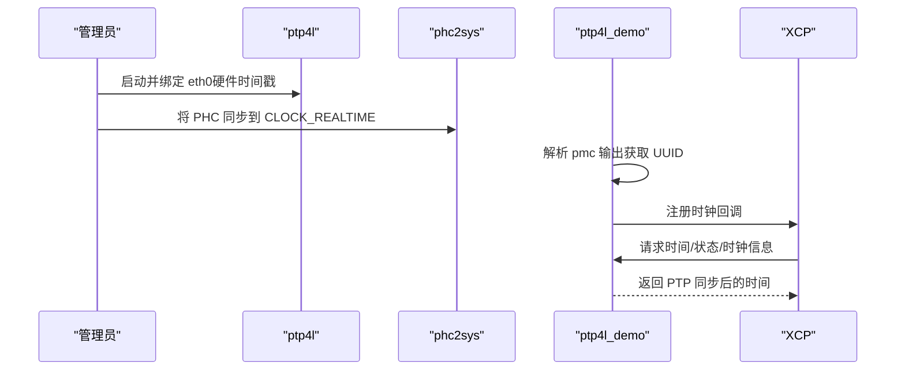
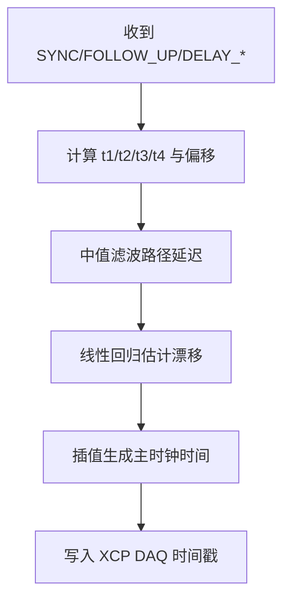
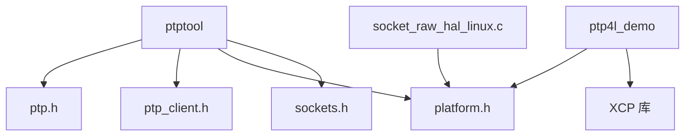

# PTP时间同步

<cite>
**本文引用的文件**
- [src/xcplib_ptp_cfg.h](file://src/xcplib_ptp_cfg.h)
- [examples/ptp4l_demo/src/main.cpp](file://examples/ptp4l_demo/src/main.cpp)
- [tools/ptptool/src/main.cpp](file://tools/ptptool/src/main.cpp)
- [tools/ptptool/src/ptp/ptp.h](file://tools/ptptool/src/ptp/ptp.h)
- [tools/ptptool/src/ptp/ptp_client.h](file://tools/ptptool/src/ptp/ptp_client.h)
- [tools/ptptool/src/ptp/phc.h](file://tools/ptptool/src/ptp/phc.h)
- [src/platform.h](file://src/platform.h)
- [src/socket_raw_hal_linux.c](file://src/socket_raw_hal_linux.c)
- [examples/ptp4l_demo/README.md](file://examples/ptp4l_demo/README.md)
- [tools/ptptool/README.md](file://tools/ptptool/README.md)
</cite>

## 目录
1. [简介](#简介)
2. [项目结构](#项目结构)
3. [核心组件](#核心组件)
4. [架构总览](#架构总览)
5. [详细组件分析](#详细组件分析)
6. [依赖关系分析](#依赖关系分析)
7. [性能考虑](#性能考虑)
8. [故障诊断指南](#故障诊断指南)
9. [结论](#结论)
10. [附录](#附录)

## 简介
本文件系统性阐述 XCPlite 在 PTP（精确时间协议）时间同步与高精度时间戳处理方面的能力与实践。内容覆盖：
- IEEE 1588 PTP 协议栈集成：主从时钟同步、延迟测量与时钟调整机制
- 硬件时间戳获取与软件补偿算法，实现亚微秒级时间精度
- 与 ptp4l 工具的集成方式：网络配置、设备发现、同步参数调优
- 时间戳数据采集、处理与校准流程，确保时序准确性
- 多节点系统中的时间同步拓扑与时钟层级管理
- PTP 网络部署指南、性能调优方法与故障诊断工具
为分布式测量系统与时间敏感应用提供精确的时间同步解决方案

## 项目结构
围绕 PTP 与高精度时间戳的关键代码分布在以下位置：
- 示例应用：通过回调将系统实时时钟（由 ptp4l + phc2sys 同步）接入 XCP DAQ 时间源
- PTP 工具：内置 PTP 客户端、观察者、主站，支持 XCP 观测与测试
- 平台抽象：统一的高分辨率时钟接口（单调/实时），供 PTP 与 XCP 使用
- Linux 原始以太网 HAL：用于底层帧收发与权限控制
- 构建配置：启用套接字硬件时间戳等选项

图示来源
- [examples/ptp4l_demo/src/main.cpp:1-209](file://examples/ptp4l_demo/src/main.cpp#L1-L209)
- [tools/ptptool/src/main.cpp:1-617](file://tools/ptptool/src/main.cpp#L1-L617)
- [tools/ptptool/src/ptp/ptp.h:1-103](file://tools/ptptool/src/ptp/ptp.h#L1-L103)
- [tools/ptptool/src/ptp/ptp_client.h:1-104](file://tools/ptptool/src/ptp/ptp_client.h#L1-L104)
- [tools/ptptool/src/ptp/phc.h:1-114](file://tools/ptptool/src/ptp/phc.h#L1-L114)
- [src/platform.h:470-506](file://src/platform.h#L470-L506)
- [src/socket_raw_hal_linux.c:55-157](file://src/socket_raw_hal_linux.c#L55-L157)
- [src/xcplib_ptp_cfg.h:1-31](file://src/xcplib_ptp_cfg.h#L1-L31)

章节来源
- [examples/ptp4l_demo/src/main.cpp:1-209](file://examples/ptp4l_demo/src/main.cpp#L1-L209)
- [tools/ptptool/src/main.cpp:1-617](file://tools/ptptool/src/main.cpp#L1-L617)
- [src/platform.h:470-506](file://src/platform.h#L470-L506)
- [src/xcplib_ptp_cfg.h:1-31](file://src/xcplib_ptp_cfg.h#L1-L31)

## 核心组件
- PTP 协议栈与状态机：封装 PTPv2 消息发送/接收、主从角色、延迟测量与滤波
- PTP 客户端：维护主时钟信息、计算偏移与路径延迟、插值生成“主时钟”时间
- PHC 接口：访问内核 PTP 硬件时钟，进行频率/相位调整
- 平台时钟：提供单调/实时高精度时钟，作为时间基准与超时控制
- XCP 集成：通过回调将 PTP 同步后的时间注入 XCP DAQ 事件，保证时间戳一致性
- 原始以太网 HAL：Linux 下 AF_PACKET 收发，配合权限与 MTU 错误提示

章节来源
- [tools/ptptool/src/ptp/ptp.h:13-79](file://tools/ptptool/src/ptp/ptp.h#L13-L79)
- [tools/ptptool/src/ptp/ptp_client.h:19-72](file://tools/ptptool/src/ptp/ptp_client.h#L19-L72)
- [tools/ptptool/src/ptp/phc.h:24-111](file://tools/ptptool/src/ptp/phc.h#L24-L111)
- [src/platform.h:470-506](file://src/platform.h#L470-L506)
- [examples/ptp4l_demo/src/main.cpp:96-149](file://examples/ptp4l_demo/src/main.cpp#L96-L149)
- [src/socket_raw_hal_linux.c:55-157](file://src/socket_raw_hal_linux.c#L55-L157)

## 架构总览
下图展示 PTP 工具与示例应用在 XCP 中的协作关系，以及平台时钟与 PHC 的交互。

图示来源
- [examples/ptp4l_demo/src/main.cpp:96-149](file://examples/ptp4l_demo/src/main.cpp#L96-L149)
- [tools/ptptool/src/main.cpp:76-174](file://tools/ptptool/src/main.cpp#L76-L174)
- [src/platform.h:470-506](file://src/platform.h#L470-L506)
- [tools/ptptool/src/ptp/ptp.h:86-99](file://tools/ptptool/src/ptp/ptp.h#L86-L99)

## 详细组件分析

### PTP 客户端与主从同步
- 客户端状态机：维护主时钟信息、SYNC/FOLLOW_UP、DELAY_REQ/RESP 序列号与时间戳，使用滤波器估计路径延迟与抖动
- 时钟插值：基于最近一次主时钟 t1/t4 与本地 t1/t3，结合漂移估计，生成平滑的主时钟时间
- 同步状态：is_sync 标志指示是否已锁定主时钟；raw_path_delay/path_delay 表示未滤波与滤波后的路径延迟

图示来源
- [tools/ptptool/src/ptp/ptp_client.h:19-72](file://tools/ptptool/src/ptp/ptp_client.h#L19-L72)

章节来源
- [tools/ptptool/src/ptp/ptp_client.h:19-72](file://tools/ptptool/src/ptp/ptp_client.h#L19-L72)

### PTP 协议栈与消息流
- 接口层：创建/关闭 PTP 接口，发送 ANNOUNCE/SYNC/FOLLOW_UP/DELAY_REQ/DELAY_RESP
- 线程与套接字：分别处理 320/319 端口，互斥保护共享状态
- 观察者/主站：可监听多个主站或主动充当主站，便于对比与测试

图示来源
- [tools/ptptool/src/ptp/ptp.h:53-99](file://tools/ptptool/src/ptp/ptp.h#L53-L99)
- [tools/ptptool/src/main.cpp:431-546](file://tools/ptptool/src/main.cpp#L431-L546)

章节来源
- [tools/ptptool/src/ptp/ptp.h:53-99](file://tools/ptptool/src/ptp/ptp.h#L53-L99)
- [tools/ptptool/src/main.cpp:431-546](file://tools/ptptool/src/main.cpp#L431-L546)

### 硬件时间戳与 PHC 集成
- PHC 接口：打开/关闭 PTP 硬件时钟，查询最大频率调整、引脚功能、PPS 支持、写相位模式
- 系统时钟：通过 platform.h 暴露的 clockGetRealtimeNs/clockGetMonotonicNs 提供高精度时间
- 构建选项：启用 OPTION_SOCKET_HW_TIMESTAMPS 以支持套接字硬件时间戳（Linux 工具链）

图示来源
- [tools/ptptool/src/ptp/phc.h:24-111](file://tools/ptptool/src/ptp/phc.h#L24-L111)
- [src/platform.h:470-506](file://src/platform.h#L470-L506)
- [src/xcplib_ptp_cfg.h:13-31](file://src/xcplib_ptp_cfg.h#L13-L31)

章节来源
- [tools/ptptool/src/ptp/phc.h:24-111](file://tools/ptptool/src/ptp/phc.h#L24-L111)
- [src/platform.h:470-506](file://src/platform.h#L470-L506)
- [src/xcplib_ptp_cfg.h:13-31](file://src/xcplib_ptp_cfg.h#L13-L31)

### 与 ptp4l 的集成与部署
- 典型流程：启动 ptp4l（带硬件时间戳）、phc2sys（将 PHC 同步到系统时间），随后运行示例程序
- 时钟身份：通过 pmc 命令获取本地与主时钟 UUID，必要时在应用中匹配
- XCP 回调：注册 getClock/getClockState/getClockInfo，使 XCP 使用 PTP 同步后的时间

图示来源
- [examples/ptp4l_demo/README.md:7-40](file://examples/ptp4l_demo/README.md#L7-L40)
- [examples/ptp4l_demo/src/main.cpp:36-94](file://examples/ptp4l_demo/src/main.cpp#L36-L94)
- [examples/ptp4l_demo/src/main.cpp:96-149](file://examples/ptp4l_demo/src/main.cpp#L96-L149)

章节来源
- [examples/ptp4l_demo/README.md:7-40](file://examples/ptp4l_demo/README.md#L7-L40)
- [examples/ptp4l_demo/src/main.cpp:36-94](file://examples/ptp4l_demo/src/main.cpp#L36-L94)
- [examples/ptp4l_demo/src/main.cpp:96-149](file://examples/ptp4l_demo/src/main.cpp#L96-L149)

### 时间戳采集、处理与校准流程
- 采集：PTP 报文在网卡/内核层获得硬件时间戳，减少软件路径抖动
- 处理：客户端根据 t1/t2/t3/t4 计算路径延迟与主时钟偏移，使用中值滤波降低抖动影响
- 校准：通过线性回归/平均滤波器估计漂移，插值生成连续的主时钟时间
- 输出：XCP DAQ 事件使用该时间戳，保证跨节点时序一致

图示来源
- [tools/ptptool/src/ptp/ptp_client.h:37-72](file://tools/ptptool/src/ptp/ptp_client.h#L37-L72)
- [tools/ptptool/src/main.cpp:76-174](file://tools/ptptool/src/main.cpp#L76-L174)

章节来源
- [tools/ptptool/src/ptp/ptp_client.h:37-72](file://tools/ptptool/src/ptp/ptp_client.h#L37-L72)
- [tools/ptptool/src/main.cpp:76-174](file://tools/ptptool/src/main.cpp#L76-L174)

### 多节点拓扑与时钟层级管理
- 主从层级：Grandmaster -> Master -> Slave，通过 ANNOUNCE 选择最佳主时钟
- 域与 UUID：不同 domain/uuid 隔离不同 PTP 域，避免冲突
- 观察者模式：可同时观察多个主站，比较其漂移与抖动，辅助评估时钟质量

章节来源
- [tools/ptptool/src/ptp/ptp.h:67-79](file://tools/ptptool/src/ptp/ptp.h#L67-L79)
- [tools/ptptool/src/main.cpp:501-546](file://tools/ptptool/src/main.cpp#L501-L546)

## 依赖关系分析
- ptptool 依赖 platform.h 的高精度时钟 API 与 sockets 抽象
- ptp_client.h 依赖 ptp.h 提供的接口与 util 中的滤波器
- 示例应用依赖 platform.h 的 clockGetRealtimeNs 并通过回调注入 XCP
- Linux 原始以太网 HAL 提供 AF_PACKET 收发，需 CAP_NET_RAW 权限

图示来源
- [tools/ptptool/src/main.cpp:1-617](file://tools/ptptool/src/main.cpp#L1-L617)
- [tools/ptptool/src/ptp/ptp.h:1-103](file://tools/ptptool/src/ptp/ptp.h#L1-L103)
- [tools/ptptool/src/ptp/ptp_client.h:1-104](file://tools/ptptool/src/ptp/ptp_client.h#L1-L104)
- [src/platform.h:470-506](file://src/platform.h#L470-L506)
- [src/socket_raw_hal_linux.c:55-157](file://src/socket_raw_hal_linux.c#L55-L157)

章节来源
- [tools/ptptool/src/main.cpp:1-617](file://tools/ptptool/src/main.cpp#L1-L617)
- [tools/ptptool/src/ptp/ptp.h:1-103](file://tools/ptptool/src/ptp/ptp.h#L1-L103)
- [tools/ptptool/src/ptp/ptp_client.h:1-104](file://tools/ptptool/src/ptp/ptp_client.h#L1-L104)
- [src/platform.h:470-506](file://src/platform.h#L470-L506)
- [src/socket_raw_hal_linux.c:55-157](file://src/socket_raw_hal_linux.c#L55-L157)

## 性能考虑
- 硬件时间戳：优先使用网卡/内核硬件时间戳，减少软件路径抖动，提高稳定性
- 滤波与回归：使用中值滤波与线性回归估计漂移，提升长期稳定性
- 日志级别：合理设置 PTP/XCP 日志级别，平衡调试信息与性能开销
- 队列与吞吐：XCP 队列大小与主循环延时影响 DAQ 吞吐与时序抖动

[本节为通用指导，不直接分析具体文件]

## 故障诊断指南
- 权限问题：Linux 原始以太网需要 CAP_NET_RAW，否则无法打开 AF_PACKET 套接字
- 硬件时间戳：确认网卡支持硬件时间戳，检查 /dev/ptp* 与内核 timestamping 配置
- PHC 同步：若 PHC 未同步，需先通过 ptp4l 或 phc2sys 初始化
- 连接失败：检查 CANape 等设备配置的 IP/端口与自动 A2L 上传
- 跟踪与调试：使用 strace 追踪 setsockopt 调用，验证硬件时间戳启用

章节来源
- [src/socket_raw_hal_linux.c:72-84](file://src/socket_raw_hal_linux.c#L72-L84)
- [tools/ptptool/README.md:172-220](file://tools/ptptool/README.md#L172-L220)
- [examples/ptp4l_demo/README.md:55-63](file://examples/ptp4l_demo/README.md#L55-L63)

## 结论
XCPlite 通过平台化的高精度时钟接口、PTP 协议栈与 PHC 集成，为 XCP DAQ 提供了稳定且高精度的时间戳能力。借助 ptp4l 与 phc2sys，可实现端到端的 PTP 同步；通过滤波与插值算法，可在存在抖动与漂移的网络环境中保持亚微秒级的时序准确性。配合完善的部署指南与诊断工具，适用于分布式测量与时间敏感应用的工程落地。

[本节为总结性内容，不直接分析具体文件]

## 附录
- 快速部署要点
  - 启用硬件时间戳：编译时定义 OPTION_SOCKET_HW_TIMESTAMPS
  - 启动 ptp4l 与 phc2sys，确保 PHC 与系统时间同步
  - 运行示例或 ptptool，注册 XCP 时钟回调
  - 使用 pmc 校验时钟身份与同步状态

章节来源
- [src/xcplib_ptp_cfg.h:13-31](file://src/xcplib_ptp_cfg.h#L13-L31)
- [examples/ptp4l_demo/README.md:7-40](file://examples/ptp4l_demo/README.md#L7-L40)
- [tools/ptptool/README.md:38-76](file://tools/ptptool/README.md#L38-L76)