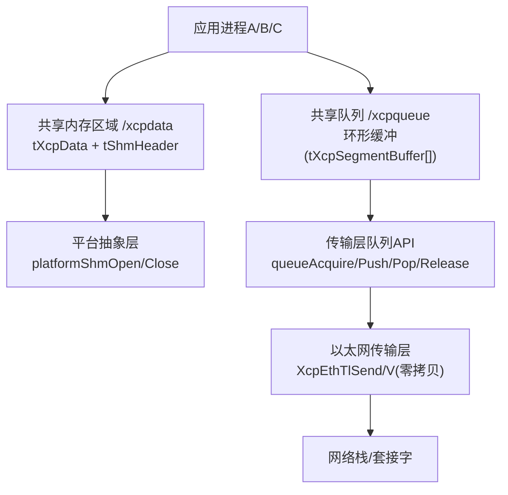
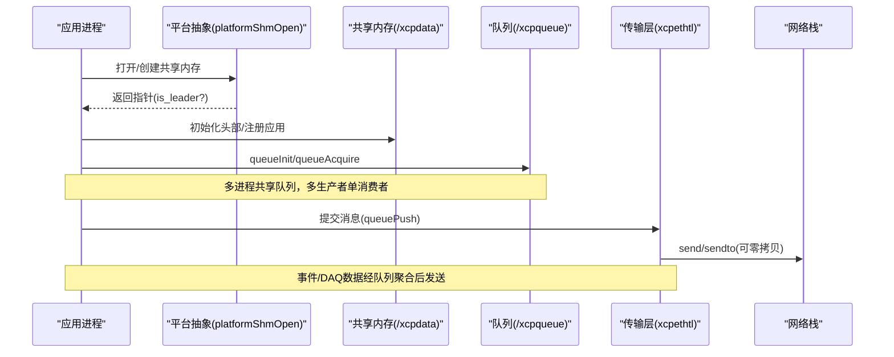
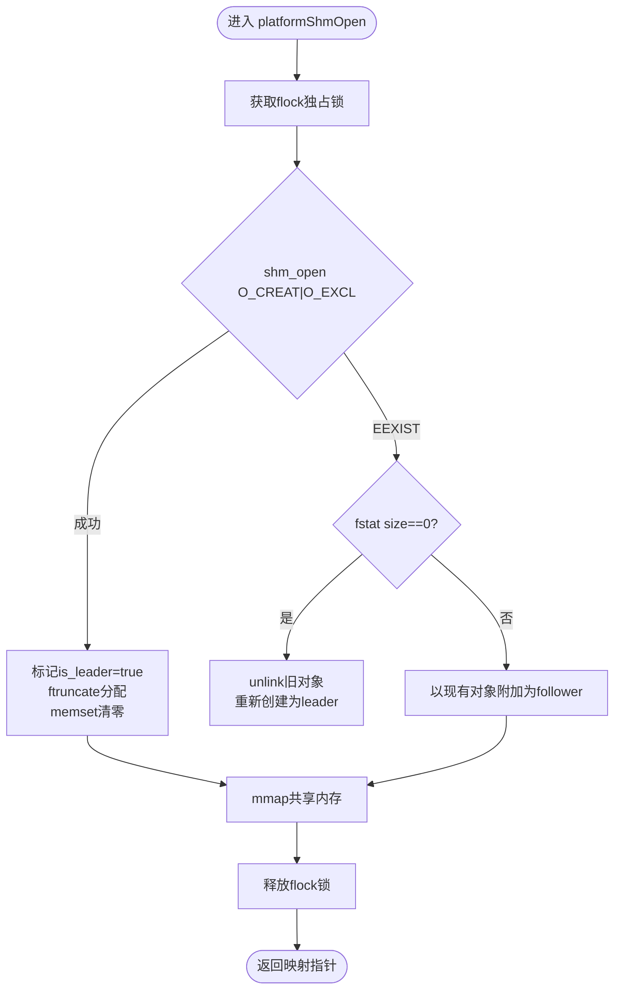
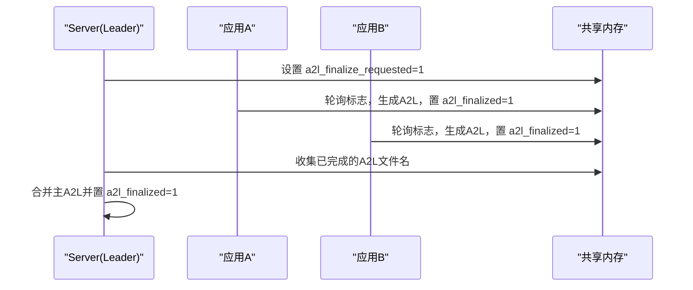
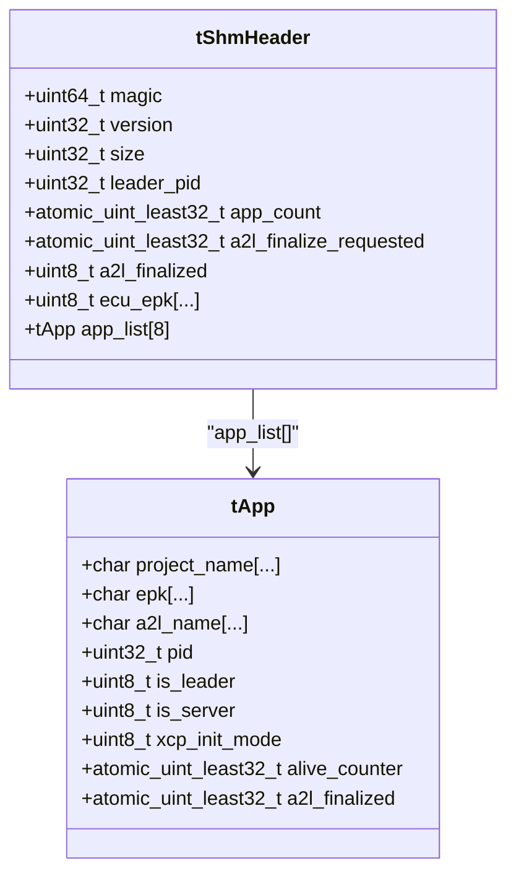
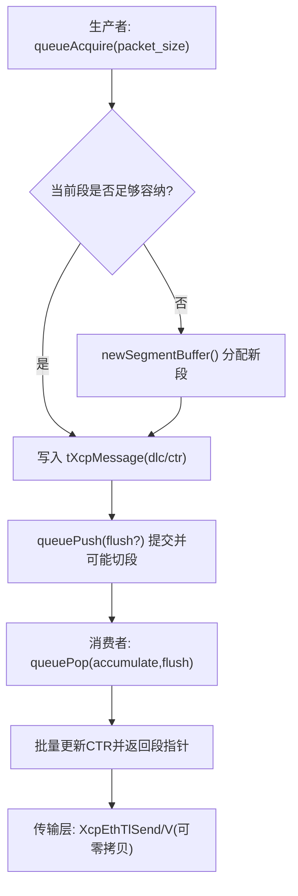
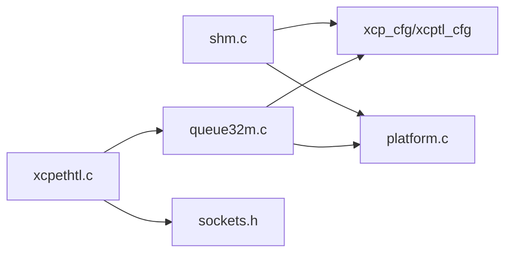

# 共享内存传输

<cite>
**本文引用的文件**
- [src/shm.c](file://src/shm.c)
- [src/shm.h](file://src/shm.h)
- [src/platform.c](file://src/platform.c)
- [src/platform.h](file://src/platform.h)
- [src/queue32m.c](file://src/queue32m.c)
- [src/xcpethtl.c](file://src/xcpethtl.c)
- [docs/SHM.md](file://docs/SHM.md)
- [tools/shmtool/src/main.cpp](file://tools/shmtool/src/main.cpp)
- [tools/shmtool/README.md](file://tools/shmtool/README.md)
- [src/xcplib_shm_cfg.h](file://src/xcplib_shm_cfg.h)
</cite>

## 目录
1. [简介](#简介)
2. [项目结构](#项目结构)
3. [核心组件](#核心组件)
4. [架构总览](#架构总览)
5. [详细组件分析](#详细组件分析)
6. [依赖关系分析](#依赖关系分析)
7. [性能考量](#性能考量)
8. [故障诊断与监控](#故障诊断与监控)
9. [结论](#结论)
10. [附录](#附录)

## 简介
本文件系统性阐述 XCPlite 的共享内存（SHM）传输机制与高性能数据交换方案，覆盖以下主题：
- 共享内存的创建、映射与管理：POSIX shm_open/mmap 流程、领导者选举与锁竞争、异常恢复与资源清理。
- 多进程协调与一致性：应用注册表、存活计数、A2L 最终化协议、服务器角色选择。
- 内存布局与对齐：tShmHeader/tApp 布局、缓存行对齐、跨进程访问优化。
- 环形缓冲区与零拷贝：多生产者单消费者队列、段聚合、向量发送与 headroom 零拷贝路径。
- 进程生命周期管理：启动顺序无关、崩溃恢复、状态同步。
- 性能基准、监控工具与故障诊断：shmtool 使用、关键指标与常见问题定位。

## 项目结构
围绕共享内存与数据传输的关键代码分布如下：
- 共享内存管理与多进程协调：src/shm.c, src/shm.h
- 平台抽象（POSIX shm_open/mmap/flock 等）：src/platform.c, src/platform.h
- 传输层队列（多生产者单消费者环形缓冲）：src/queue32m.c
- 以太网传输层（含零拷贝路径）：src/xcpethtl.c
- SHM 模式配置开关：src/xcplib_shm_cfg.h
- 文档与工具：docs/SHM.md, tools/shmtool/*

图表来源
- [src/shm.c:162-208](file://src/shm.c#L162-L208)
- [src/platform.c:201-319](file://src/platform.c#L201-L319)
- [src/queue32m.c:275-463](file://src/queue32m.c#L275-L463)
- [src/xcpethtl.c:128-200](file://src/xcpethtl.c#L128-L200)

章节来源
- [docs/SHM.md:1-72](file://docs/SHM.md#L1-L72)
- [src/xcplib_shm_cfg.h:28-38](file://src/xcplib_shm_cfg.h#L28-L38)

## 核心组件
- 共享内存头与应用列表：tShmHeader 包含控制区（magic/version/size/leader_pid/app_count/a2l_finalize_requested/a2l_finalized/ecu_epk）与固定大小的应用槽数组 tApp[]。每个应用通过 project_name+epk 唯一标识并复用槽位。
- 平台抽象：platformShmOpen 使用 POSIX shm_open + mmap，配合 flock 序列化领导者选举窗口；支持零大小恢复与版本不兼容提示。
- 传输队列：多生产者单消费者环形缓冲，按段（segment）聚合多个 XCP 消息，支持 flush 与丢失计数。
- 以太网传输层：支持 UDP/TCP，提供向量发送与 headroom 零拷贝路径，减少系统调用与拷贝。
- 工具链：shmtool 用于查看/触发 A2L 最终化/清理共享内存对象。

章节来源
- [src/shm.h:45-81](file://src/shm.h#L45-L81)
- [src/platform.c:201-319](file://src/platform.c#L201-L319)
- [src/queue32m.c:53-98](file://src/queue32m.c#L53-L98)
- [src/xcpethtl.c:70-105](file://src/xcpethtl.c#L70-L105)
- [tools/shmtool/README.md:1-111](file://tools/shmtool/README.md#L1-L111)

## 架构总览
XCPlite 在 SHM 模式下允许多个独立进程共享同一份 XCP 状态与传输队列。首个成功创建共享内存的进程成为 leader，负责初始化状态、维护应用注册表、协调 A2L 生成；其他进程作为 follower 附加到已有共享内存。XCP server 可以是 leader 或专用守护进程，负责处理客户端连接与 DAQ/EVENT 发送。

图表来源
- [src/platform.c:201-319](file://src/platform.c#L201-L319)
- [src/shm.c:162-208](file://src/shm.c#L162-L208)
- [src/queue32m.c:275-361](file://src/queue32m.c#L275-L361)
- [src/xcpethtl.c:128-200](file://src/xcpethtl.c#L128-L200)

## 详细组件分析

### 共享内存创建、映射与管理（POSIX shm_open/mmap）
- 领导者选举与序列化：通过 flock 对锁文件加独占锁，确保只有一个进程能进入“创建+初始化”临界区。
- 创建流程：shm_open(O_CREAT|O_EXCL) 成功后 ftruncate 分配空间，随后 memset 清零，保证 follower 看到干净状态。
- 跟随者流程：若已存在且 size==0 视为 leader 崩溃未完成初始化，直接回收重建；否则以只读/读写方式附加。
- 关闭与清理：munmap 解映射，可选 shm_unlink 移除名称；当无活跃应用时自动 unlink，便于下一轮 leader 重建。

图表来源
- [src/platform.c:201-319](file://src/platform.c#L201-L319)

章节来源
- [src/platform.c:201-319](file://src/platform.c#L201-L319)
- [src/shm.c:162-208](file://src/shm.c#L162-L208)

### 多进程协调与一致性（应用注册表、存活检测、A2L 协议）
- 应用注册：按 project_name+epk 查找槽位，若 EPK 不同则判定版本变化，删除持久化状态并拒绝注册；否则复用槽位并重置 alive_counter。
- 存活检测：每应用槽位维护 atomic alive_counter，由 follower 周期性递增；server 每秒扫描，结合 kill(pid,0) 判断进程是否存活，清理僵尸槽位。
- A2L 最终化：server 设置 a2l_finalize_requested，各应用轮询该标志并生成自身 A2L 后将 a2l_finalized 置位；主 A2L 最终化后通知所有应用。
- ECU EPK：对所有应用 EPK 计算 FNV-1a 哈希写入 ecu_epk，供客户端识别整体 ECU 版本。

图表来源
- [src/shm.c:285-369](file://src/shm.c#L285-L369)
- [src/shm.c:526-608](file://src/shm.c#L526-L608)
- [src/shm.c:433-517](file://src/shm.c#L433-L517)

章节来源
- [src/shm.c:98-130](file://src/shm.c#L98-L130)
- [src/shm.c:285-369](file://src/shm.c#L285-L369)
- [src/shm.c:433-517](file://src/shm.c#L433-L517)
- [src/shm.c:526-608](file://src/shm.c#L526-L608)

### 内存布局设计与数据结构对齐策略
- tShmHeader 控制区严格 64 字节（单缓存行），包含 magic/version/size/leader_pid/app_count/a2l_finalize_requested/a2l_finalized/ecu_epk 及填充，避免伪共享。
- tApp 槽位固定 512 字节，预留扩展空间，字段包含 project_name/epk/a2l_name/pid/is_leader/is_server/xcp_init_mode/alive_counter/a2l_finalized。
- 队列段缓冲 tXcpSegmentBuffer 中 msg_buffer 需满足 XCPTL_PACKET_ALIGNMENT，确保内部 tXcpMessage（dlc/ctr）按字对齐读取。

图表来源
- [src/shm.h:45-81](file://src/shm.h#L45-L81)
- [src/queue32m.c:53-79](file://src/queue32m.c#L53-L79)

章节来源
- [src/shm.h:45-81](file://src/shm.h#L45-L81)
- [src/queue32m.c:53-79](file://src/queue32m.c#L53-L79)

### 环形缓冲区实现与零拷贝数据传输
- 环形缓冲：多生产者单消费者，按段聚合多个 XCP 消息（tXcpMessage: dlc/ctr+packet）。queueAcquire 申请缓冲区，queuePush 提交并标记 ctr，queuePop 消费并更新 ctr，queueRelease 推进读指针。
- 段聚合与 flush：高优先级数据可通过 flush 立即切分新段，降低尾延迟。
- 零拷贝路径：以太网传输层支持 headroom 场景下将协议头直接写入预留空间，避免额外 memcpy；同时支持 iovec 向量发送以减少系统调用开销。

图表来源
- [src/queue32m.c:275-463](file://src/queue32m.c#L275-L463)
- [src/xcpethtl.c:128-200](file://src/xcpethtl.c#L128-L200)

章节来源
- [src/queue32m.c:275-463](file://src/queue32m.c#L275-L463)
- [src/xcpethtl.c:128-200](file://src/xcpethtl.c#L128-L200)

### 进程生命周期管理（异常恢复、资源清理、状态同步）
- 启动顺序无关：任何进程均可先于 server 启动，通过 attach 到已有 SHM 加入会话；若无活动 session，首个进程成为 leader。
- 崩溃恢复：若发现 size==0 的残留 SHM，视为 leader 崩溃未完成初始化，直接 reclaim；若 size 不匹配（旧版本），提示手动清理。
- 资源清理：无活跃应用时自动 unlink SHM；shmtool clean 命令可强制清理遗留对象。
- 状态同步：通过原子变量与定期存活检查保持多进程一致视图。

章节来源
- [src/platform.c:201-319](file://src/platform.c#L201-L319)
- [src/shm.c:162-208](file://src/shm.c#L162-L208)
- [src/shm.c:610-633](file://src/shm.c#L610-L633)
- [tools/shmtool/src/main.cpp:272-302](file://tools/shmtool/src/main.cpp#L272-L302)

## 依赖关系分析
- 模块耦合：
  - shm.c 依赖 platform.c（共享内存）、persistence.h（BIN 持久化）、xcp_cfg/xcptl_cfg（协议参数）。
  - queue32m.c 依赖 xcptl_cfg（段大小/对齐）与平台抽象（临界区/互斥）。
  - xcpethtl.c 依赖 queue.h、sockets.h、xcptl_cfg，实现发送路径与零拷贝。
- 外部依赖：POSIX shm_open/mmap/flock、线程/时钟 API。
- 潜在循环依赖：无直接循环；通过头文件前向声明与分层接口解耦。

图表来源
- [src/shm.c:12-36](file://src/shm.c#L12-L36)
- [src/queue32m.c:16-31](file://src/queue32m.c#L16-L31)
- [src/xcpethtl.c:13-29](file://src/xcpethtl.c#L13-L29)

章节来源
- [src/shm.c:12-36](file://src/shm.c#L12-L36)
- [src/queue32m.c:16-31](file://src/queue32m.c#L16-L31)
- [src/xcpethtl.c:13-29](file://src/xcpethtl.c#L13-L29)

## 性能考量
- 无锁/低锁设计：
  - 共享内存头部采用原子变量与缓存行隔离，减少伪共享。
  - 队列采用多生产者单消费者模型，生产者侧临界区短小，消费者侧批量处理。
- 零拷贝与向量 I/O：
  - headroom 允许直接在段缓冲头部写入协议头，避免二次拷贝。
  - 向量发送减少系统调用次数，提升吞吐。
- 段聚合：
  - 将多个小消息聚合成一个段发送，提高带宽利用率，降低内核态切换成本。
- 建议：
  - 合理设置 XCPTL_MAX_SEGMENT_SIZE 与队列深度，平衡延迟与吞吐。
  - 在高负载下关注 packets_lost 指标，必要时增大队列或降低采集频率。

[本节为通用性能讨论，不直接分析具体文件]

## 故障诊断与监控
- 使用 shmtool：
  - status：查看共享内存头部、应用槽位、A2L 最终化状态。
  - finalize：设置 a2l_finalize_requested 并轮询各应用确认，支持超时配置。
  - clean：清理遗留的 /xcpdata、/xcpqueue 及其锁文件。
- 常见错误与处理：
  - “SHM too small”：二进制版本不匹配，需运行清理脚本后重启。
  - “No applications registered”：无应用注册，检查应用是否以 SHM 模式编译并正确启动。
  - “Timeout finalizing A2L”：某应用未响应，检查其日志与进程状态。
- 监控指标：
  - 队列 level、packets_lost。
  - 应用 alive_counter 变化趋势。
  - A2L finalize 请求与完成状态。

章节来源
- [tools/shmtool/src/main.cpp:71-167](file://tools/shmtool/src/main.cpp#L71-L167)
- [tools/shmtool/src/main.cpp:173-266](file://tools/shmtool/src/main.cpp#L173-L266)
- [tools/shmtool/src/main.cpp:272-302](file://tools/shmtool/src/main.cpp#L272-L302)
- [tools/shmtool/README.md:31-87](file://tools/shmtool/README.md#L31-L87)

## 结论
XCPlite 的共享内存传输机制通过 POSIX shm_open/mmap 与严格的内存布局设计，实现了跨进程的高性能数据交换。领导者选举、应用注册表与存活检测确保了多进程环境下的稳定性与一致性；环形缓冲与零拷贝路径显著降低了延迟与 CPU 占用。配合 shmtool 等诊断工具，可在生产环境中快速定位问题并进行调优。该方案适用于高性能数据采集与实时监控系统，提供可扩展、低开销的进程间通信能力。

[本节为总结性内容，不直接分析具体文件]

## 附录
- 启用 SHM 模式：在构建时定义 OPTION_SHM_MODE（参考 xcplib_shm_cfg.h）。
- 相关文档：docs/SHM.md 提供了多应用模式的总体说明与工具介绍。
- 示例与测试：examples 与 test 目录下提供多种使用场景与验证用例。

章节来源
- [src/xcplib_shm_cfg.h:28-38](file://src/xcplib_shm_cfg.h#L28-L38)
- [docs/SHM.md:1-72](file://docs/SHM.md#L1-L72)