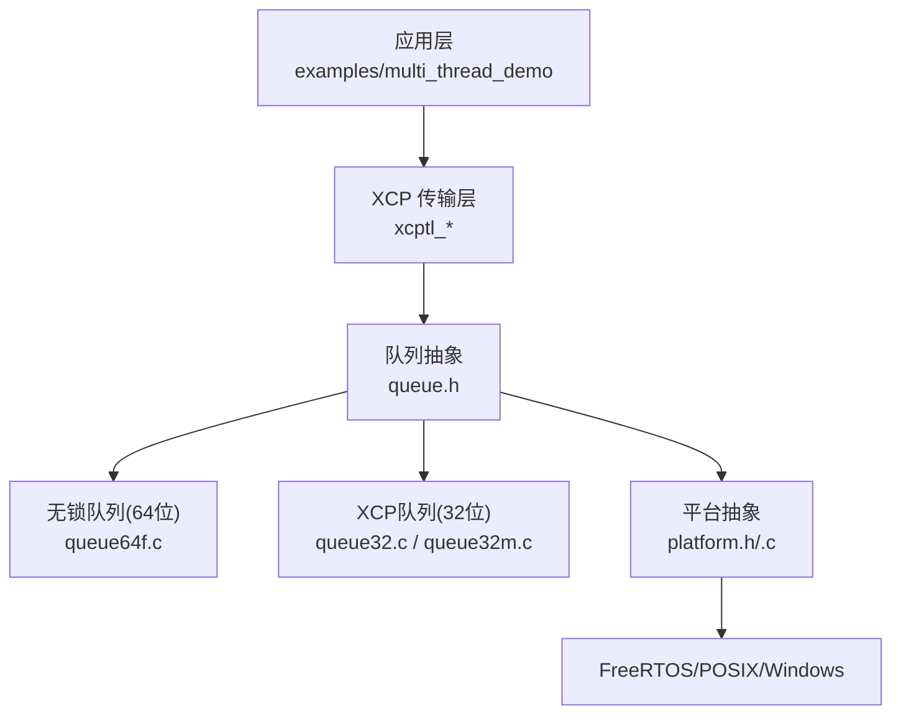
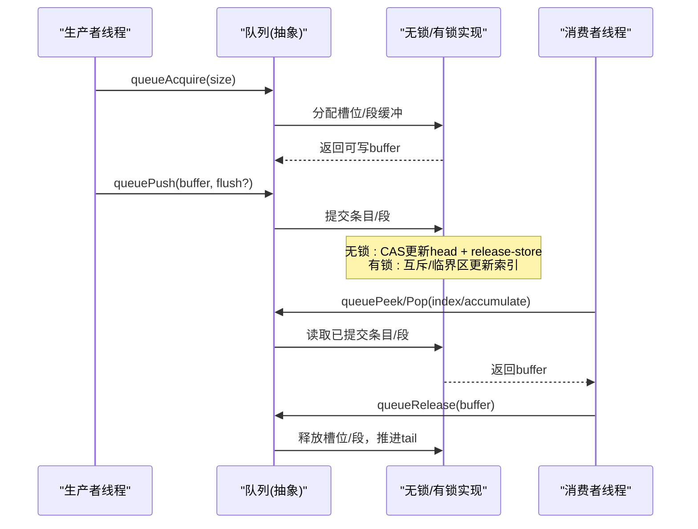
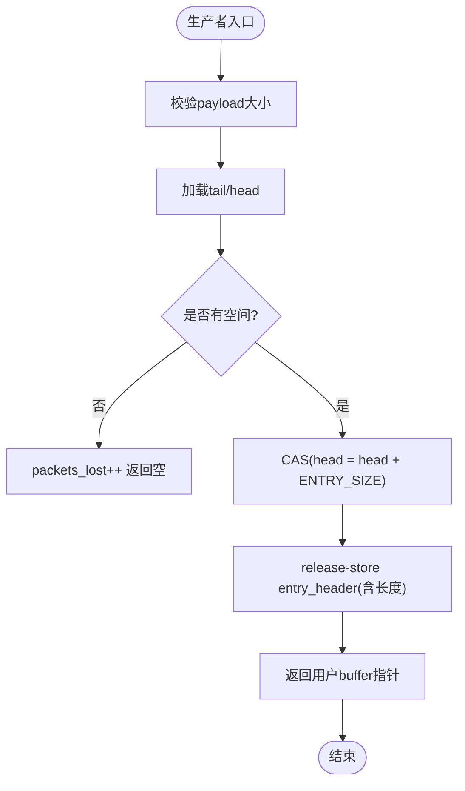
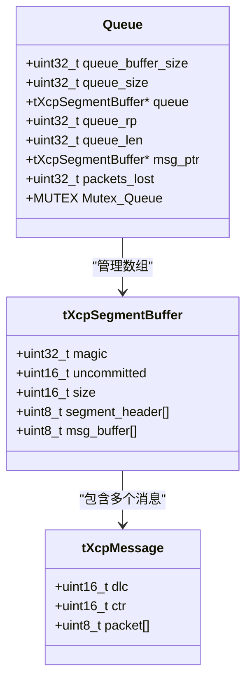
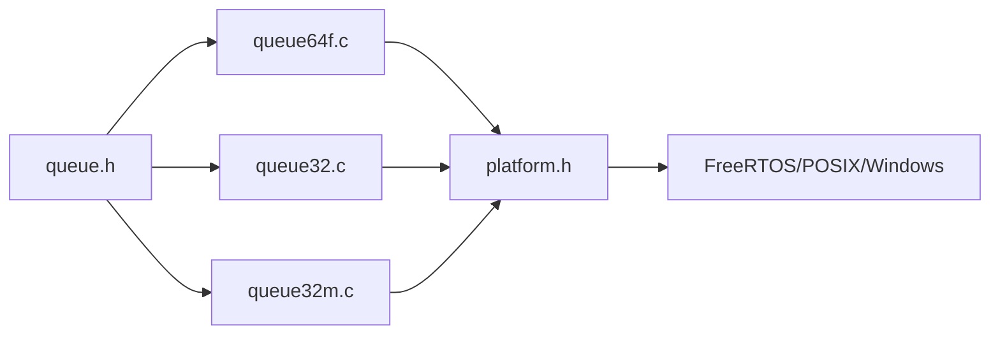

# 多线程支持

<cite>
**本文引用的文件**
- [src/queue.h](file://src/queue.h)
- [src/queue32.c](file://src/queue32.c)
- [src/queue64f.c](file://src/queue64f.c)
- [src/queue32m.c](file://src/queue32m.c)
- [src/platform.h](file://src/platform.h)
- [src/platform.c](file://src/platform.c)
- [src/xcplib_rtos_cfg.h](file://src/xcplib_rtos_cfg.h)
- [examples/multi_thread_demo/src/main.c](file://examples/multi_thread_demo/src/main.c)
</cite>

## 目录
1. [简介](#简介)
2. [项目结构](#项目结构)
3. [核心组件](#核心组件)
4. [架构总览](#架构总览)
5. [详细组件分析](#详细组件分析)
6. [依赖关系分析](#依赖关系分析)
7. [性能考量](#性能考量)
8. [故障排查指南](#故障排查指南)
9. [结论](#结论)
10. [附录](#附录)

## 简介
本文件系统性阐述 XCPlite 的多线程支持机制，重点覆盖：
- 无锁设计原理：原子操作、内存序与缓存一致性保证
- 线程本地存储（TLS）的实现与应用场景
- 并发安全机制：互斥锁、临界区与条件变量（在队列中的使用方式）
- 队列实现（queue32.c、queue64f.c）的无锁算法与性能优化策略
- FreeRTOS 环境下的线程同步与 POSIX 线程适配
- 多线程编程最佳实践、性能调优与常见并发问题解决方案

## 项目结构
XCPlite 通过平台抽象层统一线程、互斥量、时钟等能力，并通过多套队列实现适配不同目标平台与性能需求：
- 通用无锁队列（64位POSIX）：queue64f.c（固定条目大小）、queue64v.c（可变条目大小）
- XCP专用队列（消息累积）：queue32.c（互斥锁）、queue32m.c（FreeRTOS临界区/互斥量）
- 平台抽象：platform.h/.c 提供线程、互斥量、时钟、共享内存等接口
- 配置：xcplib_rtos_cfg.h 针对 FreeRTOS 的目标裁剪与默认值

图表来源
- [src/queue.h:1-187](file://src/queue.h#L1-L187)
- [src/queue64f.c:1-664](file://src/queue64f.c#L1-L664)
- [src/queue32.c:1-420](file://src/queue32.c#L1-L420)
- [src/queue32m.c:1-466](file://src/queue32m.c#L1-L466)
- [src/platform.h:1-677](file://src/platform.h#L1-L677)
- [src/platform.c:1-848](file://src/platform.c#L1-L848)

章节来源
- [src/queue.h:1-187](file://src/queue.h#L1-L187)
- [src/platform.h:1-677](file://src/platform.h#L1-L677)

## 核心组件
- 队列抽象接口（queue.h）：定义统一的 acquire/push/peek/pop/release/level/clear API，屏蔽底层实现差异。
- 无锁队列（queue64f.c）：基于C11原子操作的固定条目大小多生产者单消费者队列，采用发布-订阅语义与显式内存序。
- XCP队列（queue32.c/queue32m.c）：面向XCP传输层的可变长度消息累积队列，使用互斥或临界区保护关键路径。
- 平台抽象（platform.h/.c）：跨平台线程、互斥、时钟、共享内存等能力封装；FreeRTOS下提供任务创建、优先级、栈深等配置。
- FreeRTOS配置（xcplib_rtos_cfg.h）：针对嵌入式目标的默认参数（MTU、队列尺寸、时钟分辨率、禁用TCP/PTP等）。

章节来源
- [src/queue.h:1-187](file://src/queue.h#L1-L187)
- [src/queue64f.c:1-664](file://src/queue64f.c#L1-L664)
- [src/queue32.c:1-420](file://src/queue32.c#L1-L420)
- [src/queue32m.c:1-466](file://src/queue32m.c#L1-L466)
- [src/platform.h:1-677](file://src/platform.h#L1-L677)
- [src/platform.c:1-848](file://src/platform.c#L1-L848)
- [src/xcplib_rtos_cfg.h:1-142](file://src/xcplib_rtos_cfg.h#L1-L142)

## 架构总览
XCPlite 的多线程架构围绕“生产者-消费者”模型构建：
- 多个生产者线程将测量数据写入队列（acquire -> 填充 -> push）
- 单一消费者线程从队列取出并发送（pop/peek -> 处理 -> release）
- 无锁队列通过原子头尾指针与条目状态完成同步；有锁队列通过互斥/临界区保护环形缓冲区
- 平台抽象屏蔽FreeRTOS/POSIX/Windows差异，确保一致的API

图表来源
- [src/queue.h:122-176](file://src/queue.h#L122-L176)
- [src/queue64f.c:399-660](file://src/queue64f.c#L399-L660)
- [src/queue32.c:207-417](file://src/queue32.c#L207-L417)
- [src/queue32m.c:275-463](file://src/queue32m.c#L275-L463)

## 详细组件分析

### 无锁队列（queue64f.c）：原子操作、内存序与缓存一致性
- 数据结构
  - 每个条目包含一个原子 entry_header（状态+长度），数据紧随其后，固定布局避免伪共享与对齐问题
  - 队列头部包含 head/tail（原子64位）、packets_lost、flush_offset，按缓存行对齐减少竞争
- 生产者流程
  - 通过CAS循环尝试增加 head，成功后以 release-store 写入 entry_header，使数据对消费者可见
  - 若队满则递增 packets_lost 并返回空
- 消费者流程
  - 以 acquire-load 读取 entry_header，确认已提交后读取数据
  - 释放时清零 entry_header 并以 release 语义推进 tail
- 内存序与一致性
  - 使用 memory_order_acquire/memory_order_release 建立 happens-before 关系，确保数据可见性
  - 通过固定布局与缓存行对齐避免 false sharing，提升高争用下的吞吐
- 性能优化
  - 可选 tail 同步策略（OPTION_QUEUE_64_FIX_SIZE_SYNC_TAIL）用于基准测试
  - 统计采集（TEST_ACQUIRE_LOCK_TIMING/SPIN_COUNT）便于定位热点

图表来源
- [src/queue64f.c:399-494](file://src/queue64f.c#L399-L494)

章节来源
- [src/queue64f.c:1-664](file://src/queue64f.c#L1-L664)

### XCP队列（queue32.c/queue32m.c）：互斥/临界区与消息累积
- 数据结构
  - 以 tXcpSegmentBuffer 为单位累积多条 tXcpMessage（ctr+len+payload），适合UDP分段发送
  - 维护环形缓冲区（rp/len/msg_ptr），未提交计数 uncommitted 控制消费时机
- 生产者
  - 加锁后检查当前段是否可容纳新消息，必要时申请新段
  - 写入消息头（预留ctr占位），标记 uncommitted++
- 消费者
  - 仅在单线程调用，获取完整且已提交的段，批量设置ctr并返回
  - 释放时推进rp并递减len
- 线程安全
  - 32位POSIX/Windows：使用 MUTEX（pthread/CriticalSection）
  - FreeRTOS：使用 taskENTER_CRITICAL()/taskEXIT_CRITICAL() 或互斥量（可配置）
- 性能优化
  - 缓存行对齐、段内消息对齐、最小化锁粒度
  - 在STM32等平台上可将队列置于DTCM/非缓存SRAM以减少DMA一致性开销

图表来源
- [src/queue32.c:57-100](file://src/queue32.c#L57-L100)
- [src/queue32m.c:53-98](file://src/queue32m.c#L53-L98)

章节来源
- [src/queue32.c:1-420](file://src/queue32.c#L1-L420)
- [src/queue32m.c:1-466](file://src/queue32m.c#L1-L466)

### 平台抽象与线程同步（platform.h/.c）
- 线程与同步
  - create_thread/join_thread/cancel_thread/get_thread_id 宏在不同平台映射到 pthread/WinAPI/FreeRTOS Task
  - MUTEX 在POSIX为 pthread_mutex_t，Windows为 CRITICAL_SECTION，FreeRTOS为 SemaphoreHandle_t
  - FreeRTOS下可通过 configUSE_RECURSIVE_MUTEXES 选择递归互斥
- 时钟
  - clockInit/clockGet/clockGetLast 提供单调/实时时钟，FreeRTOS基于xTaskGetTickCount，POSIX基于clock_gettime
- 共享内存
  - platformShmOpen/Attach/Close/Unlink 提供POSIX共享内存的创建、附加、卸载与清理
- FreeRTOS适配
  - 任务栈深度与优先级由 OPTION_FREERTOS_STACK_BYTES/OPTION_FREERTOS_PRIORITY 控制
  - 在POSIX模拟器下可使用主机socket与时钟进行调试

章节来源
- [src/platform.h:300-467](file://src/platform.h#L300-L467)
- [src/platform.c:366-432](file://src/platform.c#L366-L432)
- [src/platform.c:455-800](file://src/platform.c#L455-L800)

### FreeRTOS环境下的线程同步与配置
- 队列选择
  - 32位FreeRTOS强制使用 OPTION_QUEUE_32（queue32m.c），避免64位原子不可用问题
  - 可选择使用临界区（taskENTER_CRITICAL）替代互斥量以降低开销
- 资源限制
  - 标准MTU（1500字节）、禁用TCP/PTP、减小队列与事件数量以适应SRAM
- 时钟
  - 默认1us分辨率，可通过 CLOCK_TICKS_PER_S 调整

章节来源
- [src/xcplib_rtos_cfg.h:44-142](file://src/xcplib_rtos_cfg.h#L44-L142)
- [src/platform.h:381-418](file://src/platform.h#L381-L418)

### 线程本地存储（TLS）的应用
- 实现
  - THREAD_LOCAL 宏在C++使用 thread_local，C11使用 _Thread_local，GCC/MSVC分别使用 __thread/__declspec(thread)
- 应用场景
  - 示例中演示了线程上下文（名称、事件ID、嵌套层级）的TLS存储，配合A2L生成与事件追踪
  - 函数内部静态 TLS 变量（如滤波器状态）避免跨线程共享，降低锁竞争

章节来源
- [src/platform.h:454-467](file://src/platform.h#L454-L467)
- [examples/multi_thread_demo/src/main.c:78-168](file://examples/multi_thread_demo/src/main.c#L78-L168)

## 依赖关系分析
- 队列抽象（queue.h）被所有队列实现引用，向上暴露统一API
- 无锁队列依赖C11原子（stdatomic.h），在Windows下通过OPTION_ATOMIC_EMULATION回退到Interlocked intrinsics
- XCP队列依赖平台互斥/临界区，FreeRTOS下可切换至临界区以提升性能
- 平台抽象为队列和上层提供线程、时钟、共享内存等基础能力

图表来源
- [src/queue.h:1-187](file://src/queue.h#L1-L187)
- [src/platform.h:1-677](file://src/platform.h#L1-L677)

章节来源
- [src/queue.h:1-187](file://src/queue.h#L1-L187)
- [src/platform.h:1-677](file://src/platform.h#L1-L677)

## 性能考量
- 无锁队列优势
  - 低延迟、高吞吐，避免上下文切换与锁竞争
  - 通过内存序精确控制可见性，避免不必要的屏障
- 缓存友好设计
  - 队列头与条目按缓存行对齐，减少伪共享
  - 固定条目布局简化初始化与清理
- 锁粒度与路径
  - XCP队列在关键路径上尽量缩小锁范围，仅保护必要的索引与状态更新
  - FreeRTOS下优先使用临界区以降低调度开销
- 统计与诊断
  - 启用统计宏（如 TEST_ACQUIRE_LOCK_TIMING）评估锁时间与自旋次数，指导调优

[本节为通用性能讨论，不直接分析具体文件]

## 故障排查指南
- 队列溢出
  - 现象：packets_lost 递增，生产者返回空buffer
  - 排查：增大队列容量、降低生产者速率、检查消费者处理延迟
- 数据不一致
  - 无锁队列：确认entry_header的状态与长度一致，避免越界访问
  - 有锁队列：确认锁配对正确，避免死锁与竞态
- FreeRTOS栈不足
  - 现象：任务崩溃或行为异常
  - 排查：调整 OPTION_FREERTOS_STACK_BYTES，观察堆栈使用情况
- 共享内存错误
  - 现象：进程间通信失败或数据损坏
  - 排查：检查SHM生命周期、大小匹配、leader/follower初始化顺序

章节来源
- [src/queue64f.c:478-487](file://src/queue64f.c#L478-L487)
- [src/queue32.c:260-264](file://src/queue32.c#L260-L264)
- [src/platform.c:201-360](file://src/platform.c#L201-L360)

## 结论
XCPlite 通过分层设计与多实现策略，提供了高效、可移植的多线程支持：
- 无锁队列在高吞吐场景下表现优异，结合内存序保证正确性
- XCP队列通过锁/临界区保障消息累积的正确性与易用性
- 平台抽象与FreeRTOS配置使代码能在多种目标上运行
- 开发者应依据目标平台与性能需求选择合适的队列实现，并结合统计工具进行调优

[本节为总结性内容，不直接分析具体文件]

## 附录
- 多线程编程最佳实践
  - 优先使用无锁队列，必要时再考虑锁方案
  - 合理设置队列容量与生产者/消费者速率，避免溢出
  - 使用TLS隔离线程局部状态，减少共享竞争
  - 在FreeRTOS中谨慎设置任务优先级与栈深
- 性能调优指南
  - 启用统计宏，分析锁时间分布与自旋次数
  - 调整队列条目大小与对齐，优化缓存命中
  - 在嵌入式目标上将热点数据放置于DTCM/非缓存SRAM
- 常见并发问题解决方案
  - 数据可见性问题：确保使用正确的内存序（acquire/release）
  - 死锁与优先级反转：避免嵌套锁，使用优先级继承互斥（如适用）
  - 虚假共享：通过缓存行对齐与独立变量布局避免

[本节为通用指导，不直接分析具体文件]