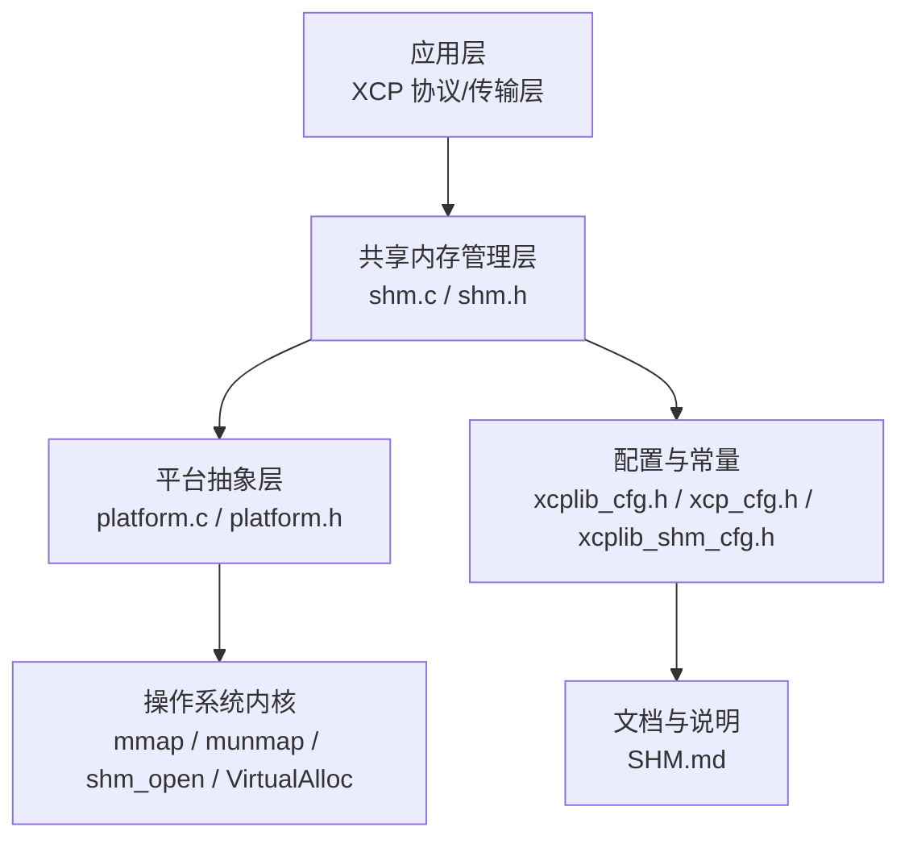
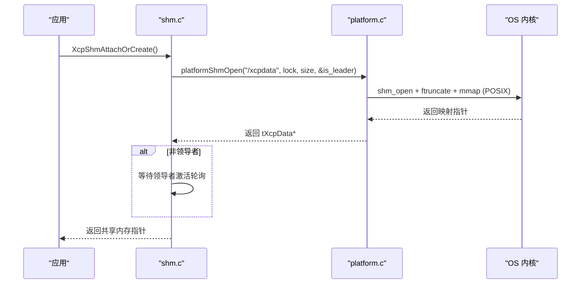
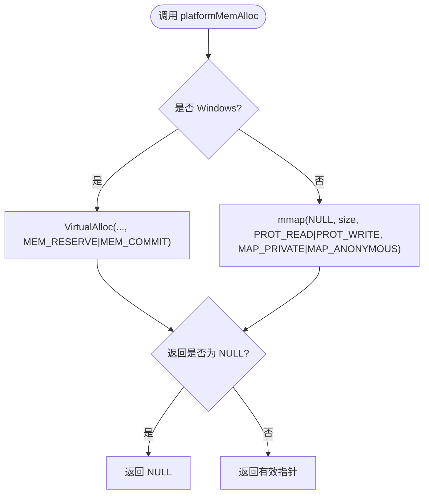
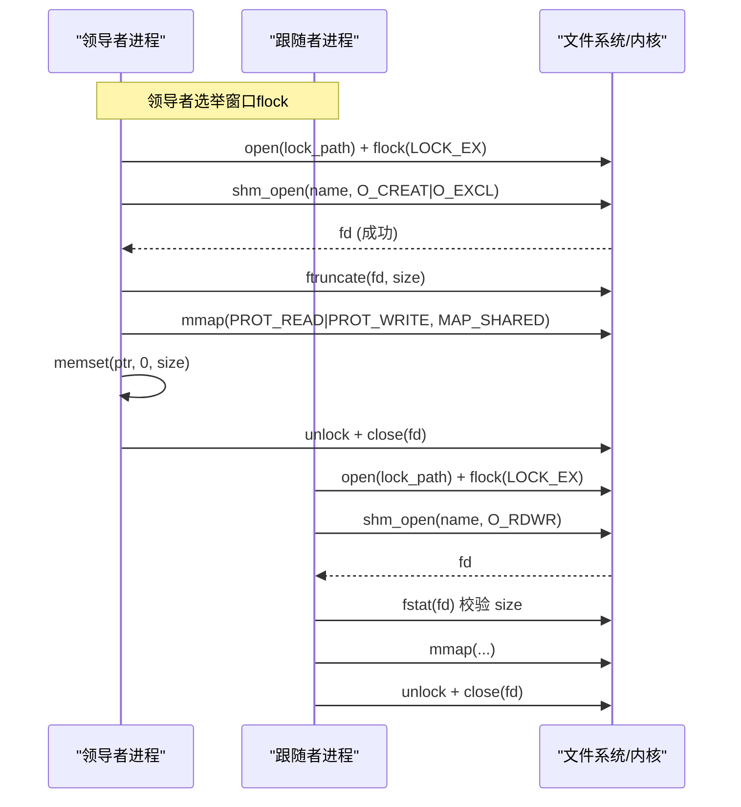
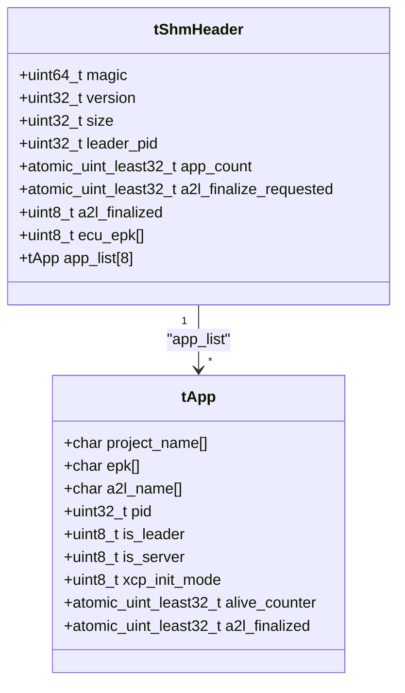
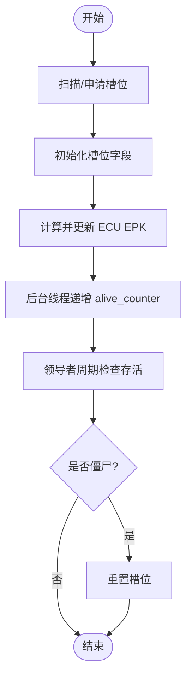
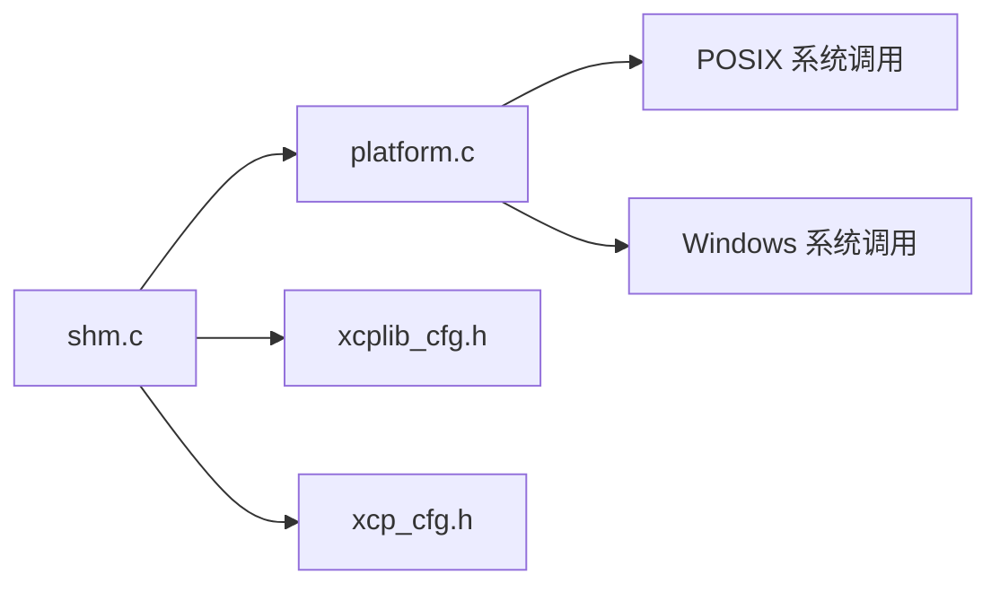

# 内存管理

<cite>
**本文引用的文件**
- [platform.c](file://src/platform.c)
- [platform.h](file://src/platform.h)
- [shm.c](file://src/shm.c)
- [shm.h](file://src/shm.h)
- [xcplib_cfg.h](file://src/xcplib_cfg.h)
- [xcp_cfg.h](file://src/xcp_cfg.h)
- [xcplib_shm_cfg.h](file://src/xcplib_shm_cfg.h)
- [SHM.md](file://docs/SHM.md)
</cite>

## 目录
1. [简介](#简介)
2. [项目结构](#项目结构)
3. [核心组件](#核心组件)
4. [架构总览](#架构总览)
5. [详细组件分析](#详细组件分析)
6. [依赖关系分析](#依赖关系分析)
7. [性能考量](#性能考量)
8. [故障排查指南](#故障排查指南)
9. [结论](#结论)
10. [附录](#附录)

## 简介
本文件系统性阐述 XCPlite 的内存管理层实现，重点覆盖：
- 跨平台内存分配与释放的统一接口设计（堆分配、匿名映射）
- 虚拟内存管理机制（mmap/VirtualAlloc 封装策略）
- 共享内存实现原理（POSIX shm_open/mmap + flock 领导者选举；Windows 路径说明）
- 内存对齐与边界检查机制（结构体布局、缓存行对齐、版本/魔数校验）
- 内存泄漏检测与性能监控工具的使用建议
- 内存池管理与自定义分配器的集成方法
- 高效内存使用的最佳实践指导

## 项目结构
XCPlite 将平台相关能力抽象在 platform.* 中，共享内存逻辑集中在 shm.*，配置项分布在 xcplib_cfg.h、xcp_cfg.h 以及可选的 xcplib_shm_cfg.h。文档 SHM.md 提供了多应用模式的整体说明。

图表来源
- [platform.c:157-187](file://src/platform.c#L157-L187)
- [shm.c:162-208](file://src/shm.c#L162-L208)
- [xcplib_cfg.h:18-204](file://src/xcplib_cfg.h#L18-L204)
- [xcp_cfg.h:128-170](file://src/xcp_cfg.h#L128-L170)
- [SHM.md:1-72](file://docs/SHM.md#L1-L72)

章节来源
- [platform.c:157-187](file://src/platform.c#L157-L187)
- [shm.c:162-208](file://src/shm.c#L162-L208)
- [xcplib_cfg.h:18-204](file://src/xcplib_cfg.h#L18-L204)
- [xcp_cfg.h:128-170](file://src/xcp_cfg.h#L128-L170)
- [SHM.md:1-72](file://docs/SHM.md#L1-L72)

## 核心组件
- 平台抽象层（platform.c/h）
  - 统一内存分配/释放：platformMemAlloc / platformMemFree
  - 共享内存（POSIX）：platformShmOpen / platformShmOpenAttach / platformShmClose / platformShmUnlink
  - 时钟、线程、互斥量等系统原语抽象
- 共享内存管理层（shm.c/h）
  - 共享头 tShmHeader 与应用表 tApp，包含魔数、版本、大小、领导者 PID、应用计数、A2L 状态、EPK 汇总等
  - 应用注册/注销、存活计数器、A2L 最终化流程、调试输出
- 配置层（xcplib_cfg.h / xcp_cfg.h / xcplib_shm_cfg.h）
  - 启用/关闭功能开关（如 OPTION_SHM_MODE、OPTION_CAL_SEGMENTS、队列选项等）
  - 地址模式与寻址扩展（含 SHM 模式下的应用级绝对寻址）

章节来源
- [platform.h:266-298](file://src/platform.h#L266-L298)
- [shm.h:40-82](file://src/shm.h#L40-L82)
- [xcplib_cfg.h:55-162](file://src/xcplib_cfg.h#L55-L162)
- [xcp_cfg.h:128-170](file://src/xcp_cfg.h#L128-L170)
- [xcplib_shm_cfg.h:28-37](file://src/xcplib_shm_cfg.h#L28-L37)

## 架构总览
XCPlite 通过 platform.* 屏蔽底层 OS 差异，向上提供统一的内存与共享内存 API；shm.* 基于这些 API 构建多进程共享的 XCP 状态机与元数据区，并通过原子操作保证无锁并发访问。配置层决定编译期特性，例如是否启用 SHM 模式、校准段管理等。

图表来源
- [shm.c:162-208](file://src/shm.c#L162-L208)
- [platform.c:201-318](file://src/platform.c#L201-L318)

章节来源
- [shm.c:162-208](file://src/shm.c#L162-L208)
- [platform.c:201-318](file://src/platform.c#L201-L318)

## 详细组件分析

### 平台内存分配与释放（堆/匿名映射）
- 统一接口
  - platformMemAlloc(size_t): 在 Windows 使用 VirtualAlloc(MEM_RESERVE|MEM_COMMIT)，在非 Windows 使用 mmap(MAP_PRIVATE|MAP_ANONYMOUS)
  - platformMemFree(void*, size_t): 在 Windows 使用 VirtualFree(MEM_RELEASE)，在非 Windows 使用 munmap
- 设计要点
  - 仅用于“进程内”的临时或内部缓冲，不跨进程共享
  - 错误处理：mmap 失败返回 MAP_FAILED，函数返回 NULL；VirtualAlloc 失败返回 NULL
  - 释放时注意参数传递：Windows 忽略 size，POSIX 需要传入 size

图表来源
- [platform.c:167-187](file://src/platform.c#L167-L187)

章节来源
- [platform.c:167-187](file://src/platform.c#L167-L187)

### 虚拟内存管理（mmap 与 VirtualAlloc 封装）
- 封装策略
  - 通过条件编译选择不同系统调用，对外暴露一致语义
  - 对 POSIX 侧，使用匿名映射创建私有内存；对 Windows 侧，使用保留+提交方式
- 注意事项
  - 对齐与粒度：由 OS 页大小决定，通常无需显式对齐
  - 权限：读写权限，按需调整
  - 错误码：POSIX 使用 errno，Windows 使用 GetLastError（当前实现未暴露）

章节来源
- [platform.c:157-187](file://src/platform.c#L157-L187)

### 共享内存实现（POSIX shm_open + mmap + flock）
- 生命周期
  - 首次打开：flock 独占锁 -> shm_open(O_CREAT|O_EXCL) -> ftruncate -> mmap -> 清零区域 -> 解锁
  - 后续附加：flock 独占锁 -> shm_open(O_RDWR) -> fstat 校验尺寸 -> mmap -> 解锁
  - 附加只读：platformShmOpenAttach 直接 fstat + mmap，跳过选举
- 领导者选举与恢复
  - 使用 flock 序列化竞争窗口，确保只有一个领导者成功创建并初始化
  - 若发现零长度残留对象，视为领导者崩溃，安全回收并重新创建
  - 若尺寸小于预期且非零，判定为旧版本残留，拒绝自动回收，提示清理
- 关闭与清理
  - platformShmClose 负责 munmap，可选择 shm_unlink
  - platformShmUnlink 仅删除名称，已映射仍有效

图表来源
- [platform.c:201-318](file://src/platform.c#L201-L318)
- [platform.c:321-342](file://src/platform.c#L321-L342)
- [platform.c:344-360](file://src/platform.c#L344-L360)

章节来源
- [platform.c:201-318](file://src/platform.c#L201-L318)
- [platform.c:321-342](file://src/platform.c#L321-L342)
- [platform.c:344-360](file://src/platform.c#L344-L360)

### 共享内存数据结构与对齐
- 头部 tShmHeader
  - 控制区前 64 字节（单缓存行），包含魔数、版本、大小、领导者 PID、应用计数、A2L 标志、ECU EPK 等
  - 应用列表 app_list[SHM_MAX_APP_COUNT]，每项 512 字节，便于未来扩展
- 对齐与边界
  - static_assert 保证 tShmHeader 大小为 64 的倍数，tApp 固定 512 字节
  - 通过魔数与版本进行运行时一致性校验，避免 ABI 不兼容
- 应用槽位
  - 每个槽位记录项目名、EPK、A2L 文件名、PID、角色（leader/server）、初始化模式、存活计数、A2L 完成标志

图表来源
- [shm.h:40-82](file://src/shm.h#L40-L82)

章节来源
- [shm.h:40-82](file://src/shm.h#L40-L82)

### 应用注册与存活检测
- 注册流程
  - 扫描已有槽位，若同名同 EPK 则复用（重启场景）
  - 否则原子递增 app_count 并初始化新槽位
  - 更新 ECU EPK 汇总（对所有应用 EPK 做 FNV-1a 哈希）
- 存活检测
  - 跟随者周期性递增 alive_counter
  - 领导者定期检查，若某槽位 alive_counter==0 且进程不存在（kill 0 失败且 errno==ESRCH），则重置槽位
- A2L 最终化
  - 服务器设置全局 finalize 请求，各应用轮询并生成/标记 A2L 完成
  - 收集所有应用的 A2L 文件名供合并

图表来源
- [shm.c:526-608](file://src/shm.c#L526-L608)
- [shm.c:433-517](file://src/shm.c#L433-L517)
- [shm.c:283-369](file://src/shm.c#L283-L369)

章节来源
- [shm.c:526-608](file://src/shm.c#L526-L608)
- [shm.c:433-517](file://src/shm.c#L433-L517)
- [shm.c:283-369](file://src/shm.c#L283-L369)

### 寻址模式与跨应用内存访问
- SHM 模式下启用多应用绝对寻址：地址扩展以 0x80 + app_id 表示目标应用
- 配合 ApplXcpGetAddr 编码/解码，使客户端可跨应用访问校准段与事件数据
- 该模式要求启用 DAQ 事件列表与校准段管理

章节来源
- [xcp_cfg.h:128-170](file://src/xcp_cfg.h#L128-L170)
- [xcp_cfg.h:214-228](file://src/xcp_cfg.h#L214-L228)

### Windows 共享内存与命名事件适配说明
- 当前代码库中，共享内存路径仅在 POSIX 平台实现（Linux/macOS/QNX）
- Windows 路径被条件编译排除，因此不支持 Windows 上的 shm 模式
- 如需在 Windows 上实现类似能力，应替换 platformShmOpen 系列为命名事件 + 命名文件映射（CreateFileMapping/MapViewOfFile），并保持与现有接口一致的语义（领导者选举、尺寸校验、零初始化、附加只读等）

章节来源
- [platform.h:274-298](file://src/platform.h#L274-L298)
- [platform.c:161-165](file://src/platform.c#L161-L165)
- [SHM.md:1-20](file://docs/SHM.md#L1-L20)

## 依赖关系分析
- 模块耦合
  - shm.c 强依赖 platform.* 提供的内存与共享内存 API
  - shm.c 依赖配置宏（如 OPTION_SHM_MODE、XCP_ENABLE_DAQ_EVENT_LIST、XCP_ENABLE_CALSEG_LIST）
  - xcp_cfg.h 根据是否启用 SHM 模式切换寻址模式
- 外部依赖
  - POSIX：sys/mman.h、fcntl.h、sys/stat.h、unistd.h、signal.h
  - Windows：未启用 shm 模式，但 platform.c 仍包含 VirtualAlloc/VirtualFree 用于普通内存分配

图表来源
- [shm.c:1-37](file://src/shm.c#L1-L37)
- [platform.c:157-187](file://src/platform.c#L157-L187)
- [xcp_cfg.h:128-170](file://src/xcp_cfg.h#L128-L170)

章节来源
- [shm.c:1-37](file://src/shm.c#L1-L37)
- [platform.c:157-187](file://src/platform.c#L157-L187)
- [xcp_cfg.h:128-170](file://src/xcp_cfg.h#L128-L170)

## 性能考量
- 无锁共享
  - 共享头与控制字段使用原子变量，避免跨进程加锁开销
  - 应用列表采用固定大小数组，减少动态分配
- 缓存友好
  - 头部控制在单缓存行（64 字节），热点字段集中
  - 应用槽位固定 512 字节，便于预测性访问
- I/O 与系统调用
  - 共享内存创建阶段使用一次 mmap，后续仅读取映射内存
  - 存活检测使用轻量信号探测（kill 0），避免频繁系统调用
- 队列与传输层
  - 默认使用可变长度队列（64 位平台），减少碎片与拷贝
  - 可通过配置切换为固定长度队列以获得更优吞吐（需权衡内存占用）

章节来源
- [xcplib_cfg.h:143-162](file://src/xcplib_cfg.h#L143-L162)
- [shm.h:66-82](file://src/shm.h#L66-L82)
- [shm.c:433-517](file://src/shm.c#L433-L517)

## 故障排查指南
- 共享内存尺寸不匹配
  - 现象：打开共享内存时报错“太小”，提示运行清理脚本
  - 原因：旧版本残留导致尺寸不一致
  - 处理：执行 tools/shm_cleanup.sh 清理后重试
- 领导者崩溃后的恢复
  - 现象：跟随者检测到零长度共享内存并自动回收
  - 行为：跟随者成为新领导者并重新初始化
- 应用僵尸检测
  - 现象：领导者周期检查到 alive_counter==0 且进程不存在，重置槽位
  - 处理：确认应用是否正常启动并周期性递增计数器
- 日志与调试
  - 使用 XcpShmDebugPrint 打印共享内存状态
  - 提高 DBG_LEVEL 获取更详细的错误信息

章节来源
- [platform.c:273-287](file://src/platform.c#L273-L287)
- [platform.c:252-272](file://src/platform.c#L252-L272)
- [shm.c:221-277](file://src/shm.c#L221-L277)
- [shm.c:464-517](file://src/shm.c#L464-L517)

## 结论
XCPlite 的内存管理层通过平台抽象层屏蔽了不同操作系统的差异，提供了统一的内存分配与共享内存接口。共享内存采用 POSIX 标准实现，结合 flock 实现领导者选举与健壮恢复，并通过原子操作与固定布局保证高性能与跨进程安全。配置层灵活启停功能，支持多应用协同工作。对于 Windows，当前未启用共享内存模式，可按相同语义扩展命名事件与命名文件映射以实现等效能力。

## 附录

### 内存泄漏检测与性能监控建议
- 内存泄漏检测
  - Linux/macOS：Valgrind、AddressSanitizer（-fsanitize=address）
  - Windows：Visual Studio 诊断工具、CRT 调试堆（_CrtDumpMemoryLeaks）
- 性能监控
  - 使用 perf（Linux）或 Instruments（macOS）观察 mmap/munmap 调用频率与延迟
  - 开启 TEST_CLOCK_GET_STATISTIC 统计高频调用点，辅助定位热点
  - 利用 shmtool 查看共享内存状态，快速定位异常

### 内存池管理与自定义分配器集成
- 校准段内存池
  - 通过 OPTION_CAL_SEGMENTS 与 OPTION_CAL_MEM_SIZE 启用内置校准段内存池
  - 支持分页、持久化、参考页与工作页切换
- 自定义分配器
  - 可在 platformMemAlloc/Free 之上封装业务级分配器（如 slab、pool）
  - 保持对齐与边界检查，确保跨平台一致性
  - 在 SHM 模式下，谨慎使用堆分配，优先使用共享内存中的固定布局

章节来源
- [xcplib_cfg.h:82-118](file://src/xcplib_cfg.h#L82-L118)
- [platform.c:167-187](file://src/platform.c#L167-L187)

### 高效内存使用最佳实践
- 优先使用共享内存中的固定结构，避免运行时动态分配
- 合理使用原子变量，避免不必要的锁竞争
- 控制共享内存尺寸，避免过大导致页浪费
- 在高频路径中复用缓冲区，减少分配/释放
- 使用 A2L 与 BIN 持久化，降低启动时的重建成本