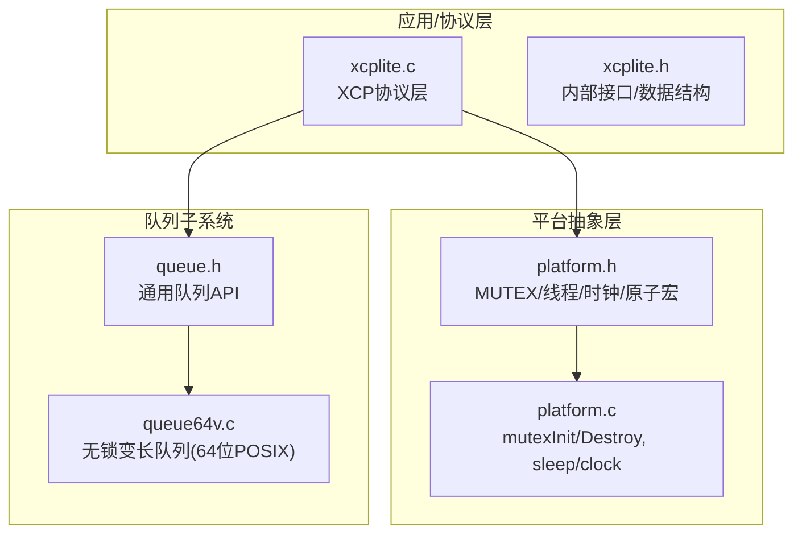
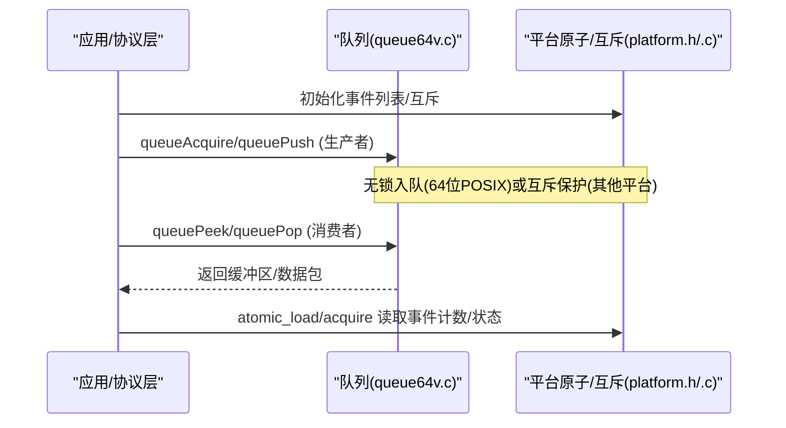
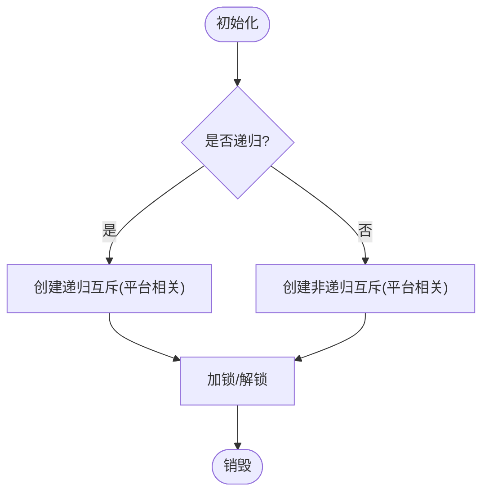
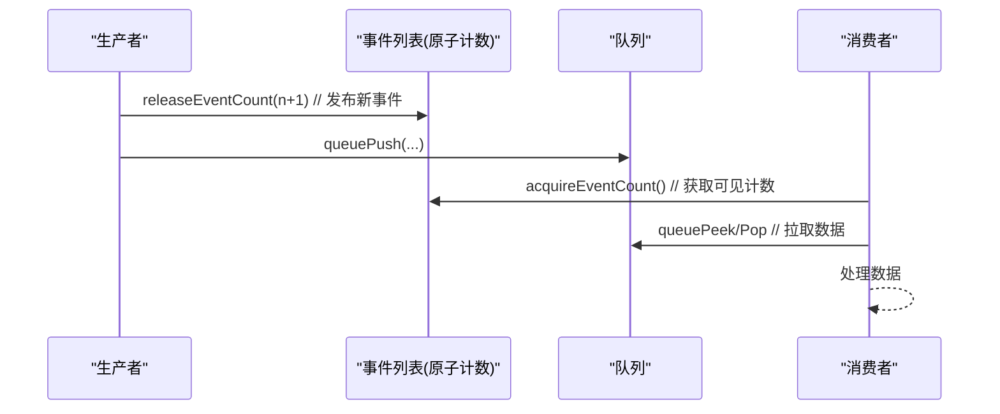
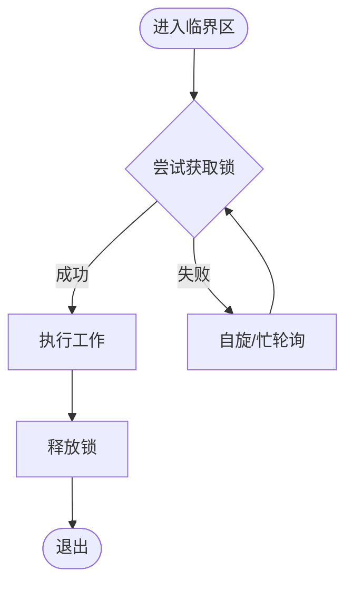
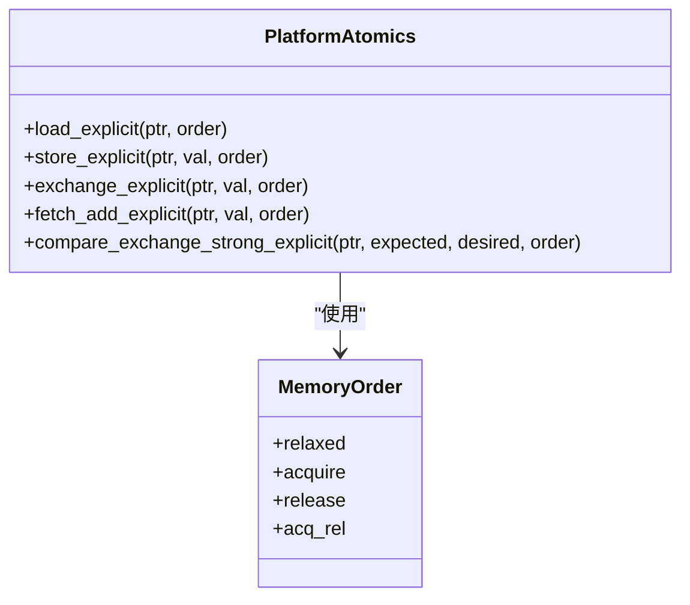
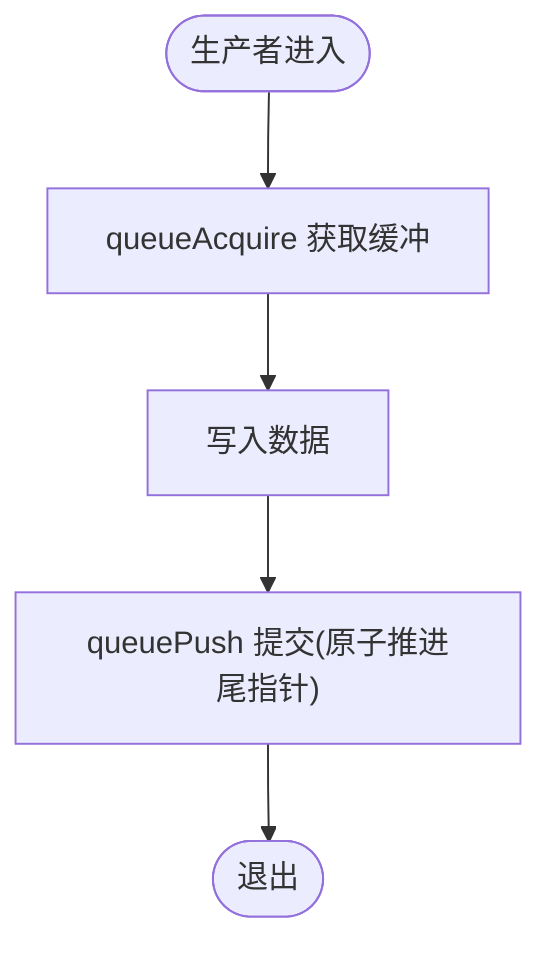
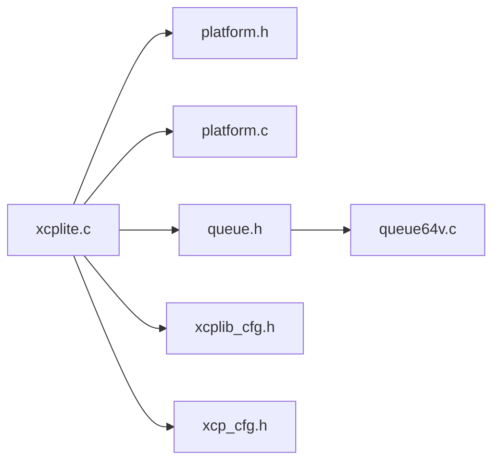

# 同步原语

<cite>
**本文引用的文件**
- [src/xcplite.h](file://src/xcplite.h)
- [src/xcplite.c](file://src/xcplite.c)
- [src/platform.h](file://src/platform.h)
- [src/platform.c](file://src/platform.c)
- [src/queue.h](file://src/queue.h)
- [src/queue64v.c](file://src/queue64v.c)
- [src/xcplib_cfg.h](file://src/xcplib_cfg.h)
- [src/xcp_cfg.h](file://src/xcp_cfg.h)
</cite>

## 目录
1. [简介](#简介)
2. [项目结构](#项目结构)
3. [核心组件](#核心组件)
4. [架构总览](#架构总览)
5. [详细组件分析](#详细组件分析)
6. [依赖关系分析](#依赖关系分析)
7. [性能考量](#性能考量)
8. [故障排查指南](#故障排查指南)
9. [结论](#结论)
10. [附录](#附录)

## 简介
本文件聚焦于 XCPlite 的“同步原语抽象层”实现，围绕互斥锁、条件变量（通过队列与事件机制体现）、自旋锁（在平台层延时与获取路径中体现）以及原子操作进行跨平台封装设计说明。内容涵盖 FreeRTOS、POSIX、Windows 三平台的差异化实现，递归与非递归锁支持、内存序与缓存一致性保证、无锁数据结构策略与性能优势、死锁检测与避免（超时锁、层次化锁思想），并给出并发编程最佳实践与高性能同步原语选择建议。

## 项目结构
XCPlite 将同步原语抽象集中在 platform 层，并在上层协议栈中使用原子类型和轻量级互斥量保护共享状态；队列子系统提供多生产者单消费者的高性能无锁或低锁通道，作为事件/数据流的核心同步载体。

图表来源
- [src/xcplite.c:188-241](file://src/xcplite.c#L188-L241)
- [src/platform.h:300-348](file://src/platform.h#L300-L348)
- [src/platform.c:366-432](file://src/platform.c#L366-L432)
- [src/queue.h:1-56](file://src/queue.h#L1-L56)
- [src/queue64v.c:1-34](file://src/queue64v.c#L1-L34)

章节来源
- [src/xcplite.h:382-495](file://src/xcplite.h#L382-L495)
- [src/xcplite.c:188-241](file://src/xcplite.c#L188-L241)
- [src/platform.h:300-348](file://src/platform.h#L300-L348)
- [src/platform.c:366-432](file://src/platform.c#L366-L432)
- [src/queue.h:1-56](file://src/queue.h#L1-L56)
- [src/queue64v.c:1-34](file://src/queue64v.c#L1-L34)

## 核心组件
- 互斥锁（MUTEX）：跨平台封装，FreeRTOS 支持递归/非递归，POSIX 使用 pthread_mutex_t，Windows 使用 CRITICAL_SECTION。
- 原子操作：C11 stdatomic 或 Windows Interlocked 模拟，提供 load/store/exchange/fetch_add/CAS 等语义，配合 memory_order 控制可见性与顺序。
- 队列（无锁/低锁）：64位POSIX下采用无锁变长队列（queue64v.c），其他平台回退到基于互斥量的队列实现。
- 事件/条件：通过事件列表与队列协作实现“条件等待/通知”的等价能力（如事件计数、队列空满）。
- 延时/自旋：sleepUs/sleepMs 在不同平台提供忙轮询或系统调用；在高争用场景下可结合自旋策略降低上下文切换开销。

章节来源
- [src/platform.h:300-348](file://src/platform.h#L300-L348)
- [src/platform.c:366-432](file://src/platform.c#L366-L432)
- [src/queue.h:1-56](file://src/queue.h#L1-L56)
- [src/queue64v.c:1-34](file://src/queue64v.c#L1-L34)
- [src/xcplite.c:779-797](file://src/xcplite.c#L779-L797)

## 架构总览
XCPlite 的同步体系由“原子 + 互斥 + 队列”构成：
- 共享状态（tXcpData）中的关键标志使用 ATOMIC_BOOL 并通过 acquire/release 语义保证可见性。
- 进程内局部状态（tXcpLocalData）中的创建/管理资源（如事件列表、校准段列表）通过 MUTEX 保护。
- 高吞吐数据通路通过无锁队列解耦生产/消费，减少锁竞争。

图表来源
- [src/xcplite.c:779-797](file://src/xcplite.c#L779-L797)
- [src/queue64v.c:1-34](file://src/queue64v.c#L1-L34)
- [src/platform.h:300-348](file://src/platform.h#L300-L348)

## 详细组件分析

### 互斥锁（MUTEX）跨平台封装
- FreeRTOS：
  - 支持递归与非递归两种模式，通过编译期配置开关 configUSE_RECURSIVE_MUTEXES 决定。
  - 静态分配支持（configSUPPORT_STATIC_ALLOCATION）可选，便于嵌入式环境确定性内存。
  - 加锁/解锁宏根据是否递归选择 xSemaphoreTake/Recursive 系列 API。
- POSIX：
  - 使用 pthread_mutex_t，可通过属性设置 PTHREAD_MUTEX_RECURSIVE 以启用递归锁。
- Windows：
  - 使用 CRITICAL_SECTION，天然支持递归；初始化时附带 spinCount 优化短临界区。

图表来源
- [src/platform.h:310-345](file://src/platform.h#L310-L345)
- [src/platform.c:366-432](file://src/platform.c#L366-L432)

章节来源
- [src/platform.h:300-348](file://src/platform.h#L300-L348)
- [src/platform.c:366-432](file://src/platform.c#L366-L432)

### 条件变量与事件/队列协同
XCPlite 未直接暴露 POSIX condition_variable 抽象，而是通过“事件列表 + 队列”的组合实现条件等待/通知：
- 事件计数使用原子变量（ATOMIC_BOOL/atomic_uint_fast16_t），配合 acquire/release 语义确保新事件可见性。
- 生产者通过队列推送数据，消费者通过 peek/pop 拉取；当队列为空时，可视为“条件不满足”，需要等待或重试。
- 事件列表初始化时会创建互斥量用于受保护的创建/注册流程。

图表来源
- [src/xcplite.c:779-797](file://src/xcplite.c#L779-L797)
- [src/queue.h:122-176](file://src/queue.h#L122-L176)

章节来源
- [src/xcplite.c:779-797](file://src/xcplite.c#L779-L797)
- [src/queue.h:122-176](file://src/queue.h#L122-L176)

### 自旋锁与忙轮询
- 平台层提供 sleepUs/sleepMs，在短延时场景可能采用忙轮询（例如 Windows 短延时路径），以减少系统调用开销。
- 在无锁队列的获取路径中，存在自旋统计与计时测试代码，用于评估高争用下的自旋次数与时延分布。
- 自旋策略适用于极短临界区且避免上下文切换的场景，但需警惕长时间自旋导致 CPU 占用过高。

图表来源
- [src/platform.c:92-153](file://src/platform.c#L92-L153)
- [src/queue64v.c:108-159](file://src/queue64v.c#L108-L159)

章节来源
- [src/platform.c:92-153](file://src/platform.c#L92-L153)
- [src/queue64v.c:108-159](file://src/queue64v.c#L108-L159)

### 原子操作的实现原理与内存序
- 平台抽象：
  - POSIX/FreeRTOS：使用 C11 stdatomic，定义 ATOMIC_BOOL 及各类 atomic_uint_fast*_t，并提供 memory_order_* 语义。
  - Windows：通过 Interlocked intrinsics 模拟原子操作，提供 load/store/exchange/fetch_add/CAS 等，并映射 memory_order 为全屏障语义。
- 内存序与可见性：
  - 事件计数使用 acquire/release 语义，确保生产者写入对消费者可见。
  - 共享状态（如 daq_running）使用 relaxed 加载，适合仅做快速检查的场景。
- 缓存一致性：
  - 无锁队列假设底层硬件/编译器保证对齐原子访问的可见性；注释明确说明其依赖目标平台特性（x86强序/ARM弱序）。

图表来源
- [src/platform.h:520-672](file://src/platform.h#L520-L672)
- [src/xcplite.c:779-797](file://src/xcplite.c#L779-L797)

章节来源
- [src/platform.h:520-672](file://src/platform.h#L520-L672)
- [src/xcplite.c:779-797](file://src/xcplite.c#L779-L797)

### 无锁数据结构的实现策略与性能优势
- 无锁队列（queue64v.c）：
  - 多生产者单消费者，变长条目，利用原子头与尾部推进实现无锁入队。
  - 通过 memset 清理释放区域，使消费者能安全读取原子头；注释强调该行为依赖目标平台特性。
  - 在高吞吐场景下显著降低锁开销与上下文切换，提升整体延迟稳定性。
- 固定大小队列（queue64f.c）：
  - 针对大负载高频场景，减少内存碎片与缓存抖动，提高吞吐。
- 32位/Windows 回退：
  - 使用互斥量保护队列，保证功能正确性，牺牲部分性能。

图表来源
- [src/queue64v.c:1-34](file://src/queue64v.c#L1-L34)
- [src/queue.h:122-139](file://src/queue.h#L122-L139)

章节来源
- [src/queue64v.c:1-34](file://src/queue64v.c#L1-L34)
- [src/queue.h:122-139](file://src/queue.h#L122-L139)

### 死锁检测与避免机制
- 超时锁：
  - 队列/传输层在停止 DAQ 后等待发送队列清空时使用超时（XCP_TRANSMIT_QUEUE_FLUSH_TIMEOUT_MS），避免无限阻塞。
- 层次化锁思想：
  - 通过分离“共享状态（原子）”与“进程内局部状态（互斥）”的访问边界，降低嵌套锁复杂度。
  - 事件列表与校准段列表各自拥有独立互斥量，避免全局锁竞争。
- 递归锁：
  - FreeRTOS/POSIX 支持递归互斥，允许同一线程多次获取，简化复杂调用链的加锁逻辑。

章节来源
- [src/xcp_cfg.h:388-405](file://src/xcp_cfg.h#L388-L405)
- [src/xcplite.h:455-458](file://src/xcplite.h#L455-L458)
- [src/platform.c:366-432](file://src/platform.c#L366-L432)

### 并发编程最佳实践与常见陷阱
- 最佳实践
  - 优先使用原子变量表示简单状态（如事件计数、运行标志），配合合适的 memory_order。
  - 将高频数据通路置于无锁队列，减少锁竞争。
  - 使用分层锁：共享状态原子化，进程内资源用互斥保护，避免深层嵌套。
  - 合理设置超时，防止死锁与长时间阻塞。
- 常见陷阱
  - 误用 relaxed 语义导致可见性问题（应使用 acquire/release 对）。
  - 在非 64 位/Windows 平台期望无锁队列，实际回退到互斥实现，性能不及预期。
  - 长时间自旋导致 CPU 占用飙升，应结合忙轮询阈值与系统调度策略。

章节来源
- [src/xcplite.c:779-797](file://src/xcplite.c#L779-L797)
- [src/queue64v.c:1-34](file://src/queue64v.c#L1-L34)
- [src/platform.c:92-153](file://src/platform.c#L92-L153)

## 依赖关系分析
- xcplite.c 依赖 platform.h/.c 提供的原子、互斥、时钟与延时能力。
- queue64v.c 依赖 platform.h 的原子与平台判断，仅在 64 位 POSIX 平台启用无锁路径。
- 配置头 xcplib_cfg.h 与 xcp_cfg.h 决定队列实现、事件数量、内存布局与超时等参数。

图表来源
- [src/xcplite.c:188-241](file://src/xcplite.c#L188-L241)
- [src/queue64v.c:1-34](file://src/queue64v.c#L1-L34)
- [src/xcplib_cfg.h:120-162](file://src/xcplib_cfg.h#L120-L162)
- [src/xcp_cfg.h:388-405](file://src/xcp_cfg.h#L388-L405)

章节来源
- [src/xcplite.c:188-241](file://src/xcplite.c#L188-L241)
- [src/queue64v.c:1-34](file://src/queue64v.c#L1-L34)
- [src/xcplib_cfg.h:120-162](file://src/xcplib_cfg.h#L120-L162)
- [src/xcp_cfg.h:388-405](file://src/xcp_cfg.h#L388-L405)

## 性能考量
- 无锁队列在 64 位 POSIX 平台提供最低延迟与最高吞吐，适合高频 DAQ 事件。
- 固定大小队列可减少内存碎片与缓存抖动，适合大负载场景。
- 原子操作在 ARM 弱序平台上需谨慎选择 memory_order，避免不必要的屏障。
- 自旋仅在极短临界区有效，过长自旋会浪费 CPU；应结合忙轮询阈值与系统调度。

[本节为一般性指导，无需特定文件引用]

## 故障排查指南
- 事件不可见：检查事件计数是否使用 acquire/release 语义，而非 relaxed。
- 队列溢出：确认队列容量与生产者速率匹配，必要时增大队列或降低生产频率。
- 死锁/阻塞：检查是否有超时缺失或嵌套锁顺序不一致；使用分层锁与超时机制。
- 平台差异：确认当前平台是否启用无锁队列（64 位 POSIX），否则回退到互斥实现。

章节来源
- [src/xcplite.c:779-797](file://src/xcplite.c#L779-L797)
- [src/queue.h:122-176](file://src/queue.h#L122-L176)
- [src/xcp_cfg.h:388-405](file://src/xcp_cfg.h#L388-L405)

## 结论
XCPlite 通过“原子 + 互斥 + 无锁队列”的分层设计，实现了跨平台的高效同步原语抽象。FreeRTOS、POSIX、Windows 在互斥与原子层面各有实现细节，但对外接口一致；事件与条件通过原子计数与队列协作达成；无锁队列在合适平台提供极致性能。通过超时锁与分层锁思想，降低了死锁风险。开发者应根据目标平台与负载特征选择合适的同步原语与队列实现，遵循内存序与可见性最佳实践，以获得稳定高效的并发性能。

[本节为总结性内容，无需特定文件引用]

## 附录
- 配置项参考：
  - 队列实现选择：OPTION_QUEUE_64_VAR_SIZE / OPTION_QUEUE_64_FIX_SIZE / OPTION_QUEUE_32
  - 事件数量：OPTION_DAQ_EVENT_COUNT
  - 超时：XCP_TRANSMIT_QUEUE_FLUSH_TIMEOUT_MS
- 平台宏：
  - _WIN / _LINUX / _MACOS / _QNX / _FREE_RTOS

章节来源
- [src/xcplib_cfg.h:120-162](file://src/xcplib_cfg.h#L120-L162)
- [src/xcp_cfg.h:388-405](file://src/xcp_cfg.h#L388-L405)