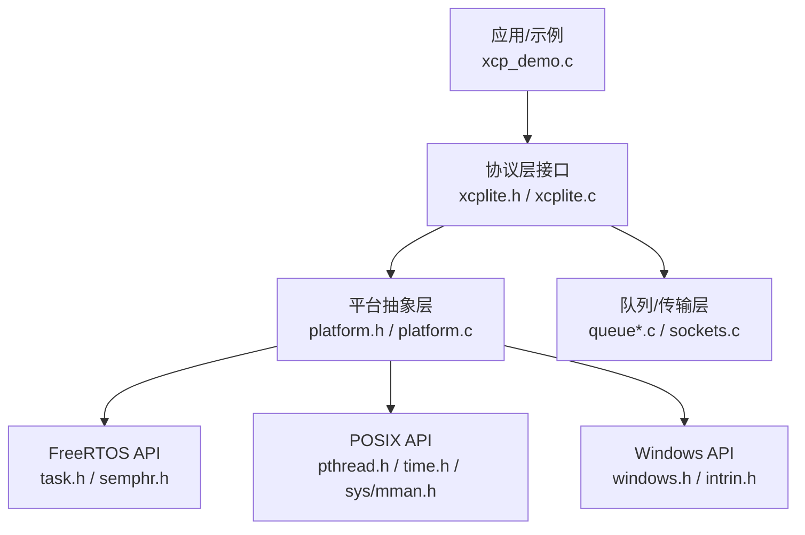
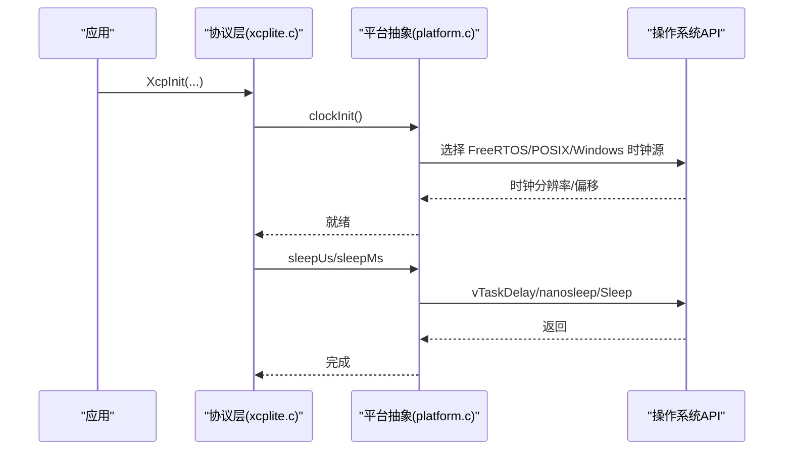
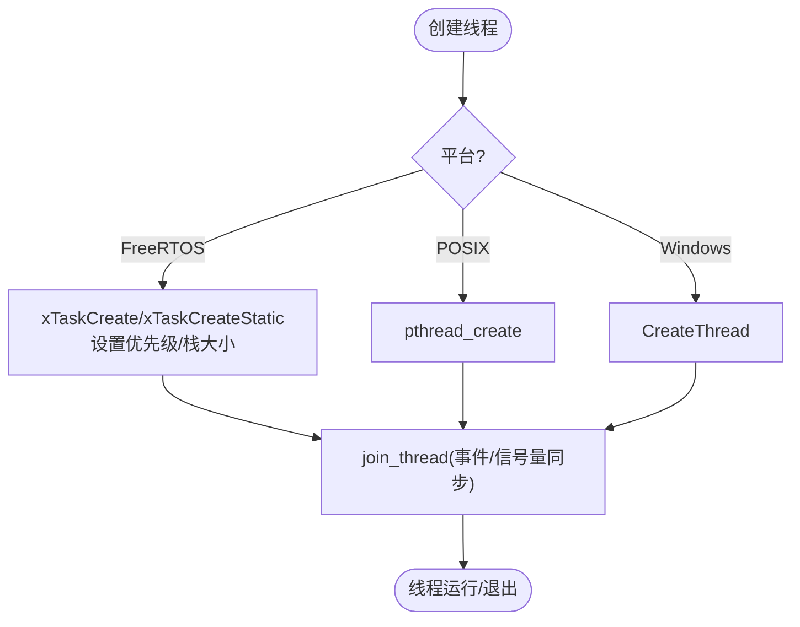
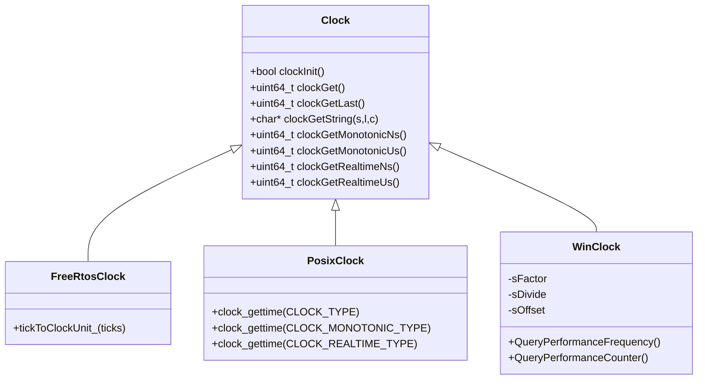
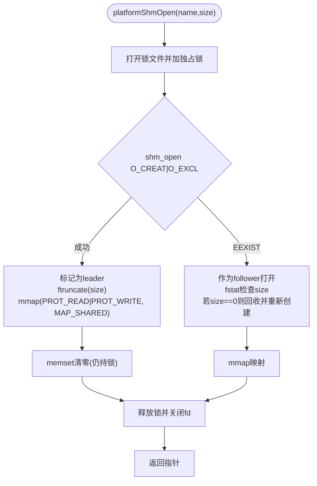
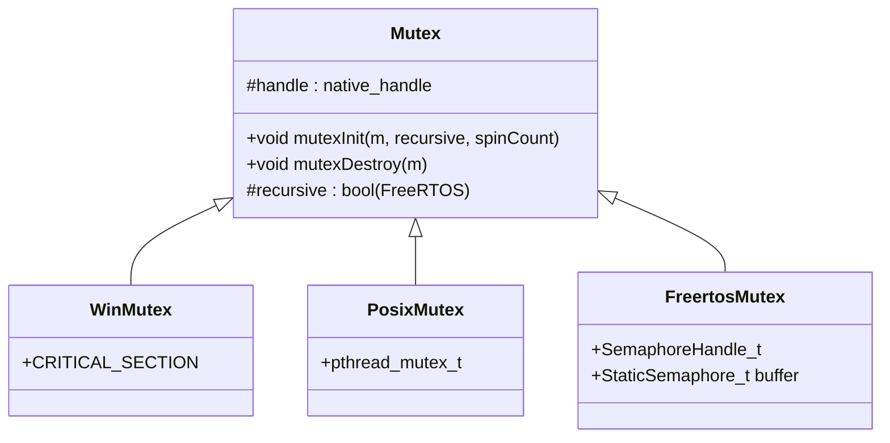
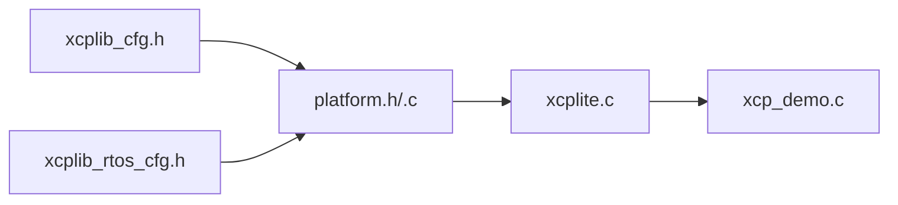

# 平台抽象层

<cite>
**本文引用的文件**
- [platform.h](file://src/platform.h)
- [platform.c](file://src/platform.c)
- [xcplib_cfg.h](file://src/xcplib_cfg.h)
- [xcplib_rtos_cfg.h](file://src/xcplib_rtos_cfg.h)
- [xcplite.h](file://src/xcplite.h)
- [xcplite.c](file://src/xcplite.c)
- [xcplib.h](file://inc/xcplib.h)
- [xcp_demo.c](file://examples/freertos_demo/xcp_demo.c)
</cite>

## 目录
1. [简介](#简介)
2. [项目结构](#项目结构)
3. [核心组件](#核心组件)
4. [架构总览](#架构总览)
5. [详细组件分析](#详细组件分析)
6. [依赖关系分析](#依赖关系分析)
7. [性能考量](#性能考量)
8. [故障排查指南](#故障排查指南)
9. [结论](#结论)
10. [附录：新平台移植指南](#附录新平台移植指南)

## 简介
本文件系统性阐述 XCPlite 的平台抽象层（Platform Abstraction Layer, PAL）设计与实现，覆盖跨平台线程模型、时钟系统、内存管理（堆分配、内存映射、共享内存）、同步原语（互斥锁、条件变量与自旋锁的适配），以及 FreeRTOS、POSIX 与 Windows 三大平台的差异化实现。同时提供新平台移植的指导原则与最小化修改策略，帮助开发者扩展平台支持。

## 项目结构
XCPlite 将平台相关能力集中在 platform.h/.c 中，通过编译期宏（_WIN、_LINUX、_MACOS、_QNX、_FREE_RTOS）选择具体实现；上层协议栈 xcplite.c 仅依赖统一接口，屏蔽底层差异。配置项集中在 xcplib_cfg.h，FreeRTOS 目标通过 xcplib_rtos_cfg.h 进行覆盖。

图表来源
- [xcplite.c:188-241](file://src/xcplite.c#L188-L241)
- [platform.h:26-72](file://src/platform.h#L26-L72)
- [platform.c:161-187](file://src/platform.c#L161-L187)

章节来源
- [platform.h:26-72](file://src/platform.h#L26-L72)
- [xcplib_cfg.h:56-71](file://src/xcplib_cfg.h#L56-L71)
- [xcplib_rtos_cfg.h:44-88](file://src/xcplib_rtos_cfg.h#L44-L88)

## 核心组件
- 线程与调度：统一的 create_thread/join_thread/cancel_thread/get_thread_id 宏与线程函数返回类型适配器，屏蔽 POSIX、Windows、FreeRTOS 差异。
- 时钟系统：clockInit/clockGet/clockGetLast 等接口，支持 FreeRTOS tick、POSIX clock_gettime、Windows QueryPerformanceCounter，并提供单调与时钟“最近值”优化。
- 内存管理：platformMemAlloc/Free 封装 VirtualAlloc/mmap；POSIX 共享内存通过 shm_open/mmap/flock 实现 leader/follower 选举与零初始化。
- 同步原语：MUTEX 在 Windows 使用 CRITICAL_SECTION，POSIX 使用 pthread_mutex_t，FreeRTOS 使用 xSemaphoreCreateMutex/RecursiveMutex，并支持静态分配。
- 原子操作：C11 stdatomic 或 Windows Interlocked 内建，提供 load/store/exchange/CAS/FetchAdd/FetchSub 的统一宏。

章节来源
- [platform.h:300-467](file://src/platform.h#L300-L467)
- [platform.c:366-432](file://src/platform.c#L366-L432)
- [platform.c:434-800](file://src/platform.c#L434-L800)
- [platform.h:520-672](file://src/platform.h#L520-L672)

## 架构总览
平台抽象层位于协议层与应用之间，向上暴露稳定接口，向下适配不同操作系统内核与运行时。协议层通过回调注册机制（如 ApplXcpRegisterGetClockCallback）注入高精度时钟，保证 DAQ 时间戳一致性。

图表来源
- [platform.c:78-155](file://src/platform.c#L78-L155)
- [platform.c:455-500](file://src/platform.c#L455-L500)
- [platform.c:505-654](file://src/platform.c#L505-L654)
- [platform.c:657-800](file://src/platform.c#L657-L800)

## 详细组件分析

### 线程模型与调度优先级
- 统一接口：create_thread/join_thread/cancel_thread/get_thread_id 宏在不同平台下分别调用 CreateThread/pthread_create/FreeRTOS xTaskCreate，并保证一致的返回值约定与错误处理。
- 线程函数签名：THREAD_FUNC_RETURN/THREAD_FUNC_END 适配 POSIX(void*)、Windows(DWORD WINAPI)、FreeRTOS(void) 三种 ABI。
- 优先级与栈大小：FreeRTOS 路径通过 OPTION_FREERTOS_STACK_BYTES 与 OPTION_FREERTOS_PRIORITY 控制任务栈与优先级；POSIX/Windows 使用默认属性或可配置参数。
- 线程本地存储：THREAD_LOCAL 宏基于编译器特性提供 thread_local/__thread/__declspec(thread)。

图表来源
- [platform.h:351-433](file://src/platform.h#L351-L433)
- [platform.h:435-467](file://src/platform.h#L435-L467)
- [xcplib_rtos_cfg.h:44-52](file://src/xcplib_rtos_cfg.h#L44-L52)

章节来源
- [platform.h:351-467](file://src/platform.h#L351-L467)
- [xcplib_rtos_cfg.h:44-52](file://src/xcplib_rtos_cfg.h#L44-L52)

### 时钟系统抽象
- FreeRTOS：以 xTaskGetTickCount() 为基准，按 CLOCK_TICKS_PER_S 换算为所需分辨率；提供 clockGetLast 缓存最近值以降低 syscall 开销。
- POSIX：根据 OPTION_CLOCK_EPOCH_ARB 或 OPTION_CLOCK_EPOCH_PTP 选择 CLOCK_MONOTONIC_RAW/MONOTONIC 或 CLOCK_REALTIME；提供 ns/us 两种精度查询与 Last 版本。
- Windows：使用 QueryPerformanceCounter 配合频率与偏移计算，支持 ARB 或 UNIX 纪元；初始化时计算转换因子与偏移。

图表来源
- [platform.h:470-510](file://src/platform.h#L470-L510)
- [platform.c:455-500](file://src/platform.c#L455-L500)
- [platform.c:505-654](file://src/platform.c#L505-L654)
- [platform.c:657-800](file://src/platform.c#L657-L800)

章节来源
- [platform.h:470-510](file://src/platform.h#L470-L510)
- [platform.c:455-800](file://src/platform.c#L455-L800)
- [xcplib_cfg.h:56-71](file://src/xcplib_cfg.h#L56-L71)

### 内存管理：堆分配、内存映射与共享内存
- 堆分配：platformMemAlloc/Free 在 Windows 使用 VirtualAlloc/VirtualFree，POSIX 使用 mmap/munmap。
- 共享内存（POSIX）：platformShmOpen 通过 flock 序列化 leader 选举，shm_open(O_CREAT|O_EXCL) 创建唯一段，ftruncate 设定大小，mmap 映射；leader 负责清零区域，follower 直接附加；提供 attach/close/unlink 辅助。
- 安全策略：对残留 SHM 尺寸不匹配给出明确错误提示，避免误删正在使用的段；zero-size 视为崩溃恢复场景可回收。

图表来源
- [platform.c:161-187](file://src/platform.c#L161-L187)
- [platform.c:201-360](file://src/platform.c#L201-L360)

章节来源
- [platform.c:161-187](file://src/platform.c#L161-L187)
- [platform.c:201-360](file://src/platform.c#L201-L360)

### 同步原语抽象：互斥锁、条件变量与自旋锁
- 互斥锁：MUTEX 在 Windows 为 CRITICAL_SECTION（始终递归），POSIX 为 pthread_mutex_t（可选递归），FreeRTOS 为 xSemaphoreCreateMutex/RecursiveMutex，支持静态分配（StaticSemaphore_t）。
- 自旋等待：Windows Critical Section 支持 spinCount；FreeRTOS 路径忽略 spinCount 并使用阻塞取锁；POSIX 路径忽略 spinCount。
- 条件变量：当前 PAL 未暴露条件变量接口；如需可在平台分支中添加 pthread_condvar/条件变量模拟。

图表来源
- [platform.h:300-349](file://src/platform.h#L300-L349)
- [platform.c:366-432](file://src/platform.c#L366-L432)

章节来源
- [platform.h:300-349](file://src/platform.h#L300-L349)
- [platform.c:366-432](file://src/platform.c#L366-L432)

### FreeRTOS 特定适配：任务调度、中断与实时性
- 任务栈与优先级：通过 OPTION_FREERTOS_STACK_BYTES 与 OPTION_FREERTOS_PRIORITY 配置；POSIX 模拟器需更大栈空间。
- 时钟：默认 1us 分辨率（OPTION_CLOCK_TICKS_1US），可通过 CLOCK_TICKS_PER_S 调整；示例工程通过 ApplXcpRegisterGetClockCallback 注入高精度时钟。
- 队列：强制使用 32 位队列（OPTION_QUEUE_32）以避免 64 位原子在 Cortex-M 上的代价；可使用临界区替代互斥以提升短临界区性能。
- 网络：启用 lwIP 套接字（OPTION_FREERTOS_LWIP），禁用 TCP 支持；无文件系统，A2L/ELF 上传不可用。

章节来源
- [xcplib_rtos_cfg.h:44-88](file://src/xcplib_rtos_cfg.h#L44-L88)
- [xcplib_rtos_cfg.h:113-135](file://src/xcplib_rtos_cfg.h#L113-L135)
- [xcp_demo.c:51-56](file://examples/freertos_demo/xcp_demo.c#L51-L56)

### POSIX 与 Windows 差异化实现：API 映射与系统调用封装
- POSIX：
  - 时钟：依据选项选择 MONOTONIC_RAW/MONOTONIC/REALTIME；提供 ns/us 精度与 Last 快速读取。
  - 共享内存：shm_open/mmap/flock 实现 leader/follower 与清理策略。
  - 线程/互斥：pthread_create/pthread_mutex_*。
- Windows：
  - 时钟：QueryPerformanceCounter 结合频率与偏移，支持 ARB/UNIX 纪元。
  - 原子：通过 Interlocked 系列内建函数实现 C11 原子语义。
  - 线程/互斥：CreateThread/EnterCriticalSection。

章节来源
- [platform.c:505-654](file://src/platform.c#L505-L654)
- [platform.c:657-800](file://src/platform.c#L657-L800)
- [platform.h:520-672](file://src/platform.h#L520-L672)

## 依赖关系分析
- 协议层 xcplite.c 依赖平台抽象层提供的原子、时钟、线程、互斥等接口；通过回调注册时钟源，确保 DAQ 时间戳一致。
- 配置层 xcplib_cfg.h 提供全局选项（时钟分辨率、队列类型、DAQ 内存等），FreeRTOS 目标通过 xcplib_rtos_cfg.h 覆盖默认值。
- 示例 xcp_demo.c 演示如何在 FreeRTOS 上注册高精度时钟并启动 XCP 服务器。

图表来源
- [xcplib_cfg.h:56-71](file://src/xcplib_cfg.h#L56-L71)
- [xcplib_rtos_cfg.h:44-88](file://src/xcplib_rtos_cfg.h#L44-L88)
- [xcplite.c:188-241](file://src/xcplite.c#L188-L241)
- [xcp_demo.c:51-56](file://examples/freertos_demo/xcp_demo.c#L51-L56)

章节来源
- [xcplib_cfg.h:56-71](file://src/xcplib_cfg.h#L56-L71)
- [xcplib_rtos_cfg.h:44-88](file://src/xcplib_rtos_cfg.h#L44-L88)
- [xcplite.c:188-241](file://src/xcplite.c#L188-L241)
- [xcp_demo.c:51-56](file://examples/freertos_demo/xcp_demo.c#L51-L56)

## 性能考量
- 时钟 Last 优化：POSIX/FreeRTOS 路径维护最近一次时钟值，减少频繁系统调用。
- 队列选择：FreeRTOS 目标强制 32 位队列，避免 64 位原子开销；短临界区可用临界区替代互斥。
- 共享内存：leader 在锁内清零，避免 follower 读到脏数据；尺寸校验防止误用旧段。
- 原子操作：Windows 使用 Interlocked 内建，保证强内存序；POSIX 使用 stdatomic。

[本节为通用指导，无需引用具体文件]

## 故障排查指南
- 共享内存失败：
  - 检查 lock_path 是否可写，flock 是否成功。
  - 若发现 size 不匹配，运行清理脚本后重试。
- 时钟初始化失败：
  - Windows 确认 QueryPerformanceFrequency 可用。
  - POSIX 确认 _GNU_SOURCE 已定义（Linux 构建要求）。
- 线程创建失败：
  - FreeRTOS 检查栈大小与优先级是否合理；POSIX/Windows 检查资源限制。
- 原子操作异常：
  - Windows 启用 OPTION_ATOMIC_EMULATION 时使用 Interlocked 内建；确保 64 位平台。

章节来源
- [platform.c:201-360](file://src/platform.c#L201-L360)
- [platform.c:693-783](file://src/platform.c#L693-L783)
- [platform.h:166-172](file://src/platform.h#L166-L172)
- [platform.h:520-672](file://src/platform.h#L520-L672)

## 结论
XCPlite 的平台抽象层通过编译期分支与统一接口，实现了线程、时钟、内存与同步原语的跨平台一致性。其设计强调低开销与可移植性：时钟 Last 优化、队列与原子选择的平台适配、共享内存 leader/follower 模式与严格尺寸校验。借助配置覆盖机制，FreeRTOS 目标能以极小改动获得嵌入式友好特性。整体架构清晰，便于扩展新平台。

[本节为总结，无需引用具体文件]

## 附录：新平台移植指南
- 新增平台识别：
  - 在 platform.h 中添加平台宏检测（如 _NEWOS），并设置 _NEWOS 标志。
  - 确保 32/64 位检测正确（PLATFORM_32BIT/PLATFORM_64BIT）。
- 线程适配：
  - 实现 create_thread/join_thread/cancel_thread/get_thread_id 宏。
  - 实现 THREAD_FUNC_RETURN/THREAD_FUNC_END 适配新 ABI。
- 时钟适配：
  - 实现 clockInit/clockGet/clockGetLast/clockGetString。
  - 提供单调与时钟 Realtime 的 ns/us 查询及 Last 版本。
- 内存与共享内存：
  - 实现 platformMemAlloc/Free。
  - 若支持共享内存，实现 platformShmOpen/Attach/Close/Unlink，遵循 leader/follower 与尺寸校验策略。
- 同步原语：
  - 实现 MUTEX 结构与 mutexInit/Destroy，必要时添加条件变量。
- 原子操作：
  - 若平台不支持 C11 原子，提供 Interlocked 风格或汇编级实现，并启用 OPTION_ATOMIC_EMULATION。
- 配置覆盖：
  - 为新平台提供专用 xcplib_newos_cfg.h，覆盖默认选项（队列、时钟分辨率、MTU、功能开关）。
- 验证步骤：
  - 使用现有示例（如 freertos_demo）替换平台分支，验证线程、时钟、共享内存与同步原语。
  - 运行单元测试与示例测试，关注日志与断言。

[本节为通用指导，无需引用具体文件]