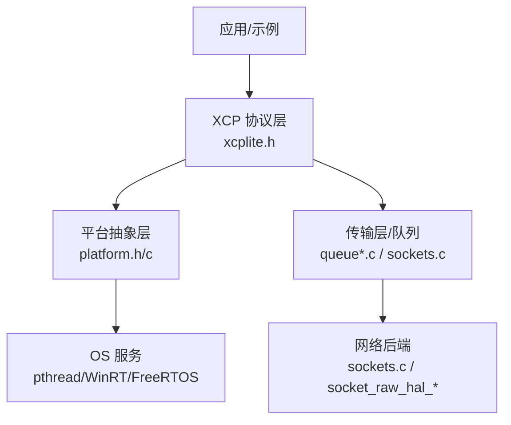
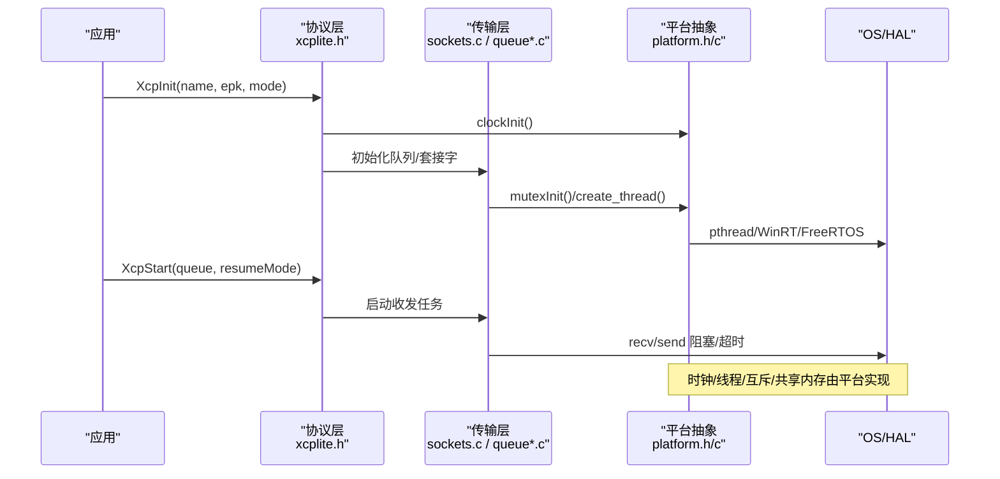
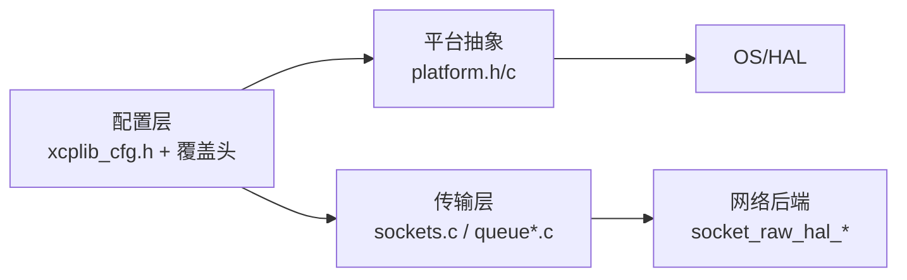

# 平台移植指南

<cite>
**本文引用的文件**
- [platform.h](file://src/platform.h)
- [platform.c](file://src/platform.c)
- [xcplib_cfg.h](file://src/xcplib_cfg.h)
- [xcplib_rtos_cfg.h](file://src/xcplib_rtos_cfg.h)
- [xcplite.h](file://src/xcplite.h)
- [BUILDING.md](file://docs/BUILDING.md)
- [TECHNICAL.md](file://docs/TECHNICAL.md)
- [socket_raw_hal.h](file://src/socket_raw_hal.h)
- [socket_raw_hal_linux.c](file://src/socket_raw_hal_linux.c)
- [xcp_demo.h](file://examples/freertos_demo/xcp_demo.h)
- [freertos_emu_demo main.c](file://examples/freertos_demo/freertos_emu_demo/src/main.c)
</cite>

## 目录
1. [简介](#简介)
2. [项目结构](#项目结构)
3. [核心组件](#核心组件)
4. [架构总览](#架构总览)
5. [详细组件分析](#详细组件分析)
6. [依赖关系分析](#依赖关系分析)
7. [性能考虑](#性能考虑)
8. [故障排除指南](#故障排除指南)
9. [结论](#结论)
10. [附录：移植检查清单](#附录移植检查清单)

## 简介
本指南面向需要在不同操作系统与实时系统上移植 XCPlite 的开发者。内容涵盖最小修改策略、必需实现的接口、可选优化、平台检测宏与条件编译、FreeRTOS/Linux/Windows/QNX 适配要点、硬件相关配置（中断/DMA）、交叉编译与依赖管理、性能调优与测试策略，以及完整的移植检查清单与故障排除方法。

## 项目结构
XCPlite 通过平台抽象层将线程、互斥量、时钟、内存映射、共享内存等能力统一暴露给上层 XCP 协议栈与传输层。关键目录与职责：
- src/platform.{h,c}：平台抽象（线程/互斥/时钟/睡眠/共享内存/原子模拟）
- src/xcplib_cfg.h：默认构建选项（DAQ、队列、A2L、时间源等）
- src/xcplib_rtos_cfg.h：FreeRTOS 嵌入式目标覆盖配置
- src/xcplite.h：协议层对外接口与回调注册点
- docs/BUILDING.md：构建配置、工具链、安装与示例
- docs/TECHNICAL.md：资源消耗、地址模式、平台要求与已知问题
- src/socket_raw_hal.*：原始以太网 HAL（Linux AF_PACKET 等），用于无 TCP/IP 栈场景

图表来源
- [xcplite.h:42-108](file://src/xcplite.h#L42-L108)
- [platform.h:98-200](file://src/platform.h#L98-L200)
- [platform.c:157-364](file://src/platform.c#L157-L364)

章节来源
- [BUILDING.md:11-24](file://docs/BUILDING.md#L11-L24)
- [TECHNICAL.md:356-394](file://docs/TECHNICAL.md#L356-L394)

## 核心组件
- 平台抽象层（Platform Abstraction Layer, PAL）
  - 线程/互斥/睡眠/时钟/共享内存/原子操作封装
  - 提供 sleepUs/sleepMs、mutexInit/mutexDestroy、clockGet/clockInit、platformMemAlloc/Free、platformShmOpen/Close 等
- 构建配置层
  - xcplib_cfg.h 定义默认选项；可通过 xcplib_rtos_cfg.h 或自定义覆盖头进行替换
- 协议层接口
  - xcplite.h 暴露 XcpInit/XcpStart/XcpCommand 等 API，并提供回调注册点（连接/断开/DAQ/校准页/时钟/文件上传等）
- 传输与网络
  - 标准套接字（UDP/TCP）与原始以太网 HAL（AF_PACKET/CMP/XLAPI 等）

章节来源
- [platform.h:255-510](file://src/platform.h#L255-L510)
- [platform.c:74-155](file://src/platform.c#L74-L155)
- [xcplib_cfg.h:55-162](file://src/xcplib_cfg.h#L55-L162)
- [xcplib_rtos_cfg.h:44-142](file://src/xcplib_rtos_cfg.h#L44-L142)
- [xcplite.h:42-108](file://src/xcplite.h#L42-L108)

## 架构总览
XCPlite 在运行时由“应用 → 协议层 → 传输层 → 平台抽象层 → OS/HAL”构成。平台差异被收敛在 platform.h/c 与 socket_raw_hal_* 中，使上层代码可跨平台复用。

图表来源
- [xcplite.h:46-78](file://src/xcplite.h#L46-L78)
- [platform.c:434-654](file://src/platform.c#L434-L654)
- [platform.c:366-432](file://src/platform.c#L366-L432)

## 详细组件分析

### 平台检测宏与条件编译
- 平台识别宏
  - _WIN、_LINUX、_MACOS、_QNX、_FREE_RTOS（含 FreeRTOS POSIX 模拟器 FREE_RTOS_POSIX_SIM）
  - 位宽宏 PLATFORM_32BIT/PLATFORM_64BIT
- 关键编译开关
  - OPTION_CLOCK_EPOCH_ARB / OPTION_CLOCK_EPOCH_PTP
  - OPTION_CLOCK_TICKS_1NS / OPTION_CLOCK_TICKS_1US
  - OPTION_ENABLE_TCP / OPTION_ENABLE_UDP / OPTION_MTU
  - OPTION_QUEUE_64_VAR_SIZE / OPTION_QUEUE_64_FIX_SIZE / OPTION_QUEUE_32
  - OPTION_SHM_MODE、OPTION_ENABLE_A2L_GENERATOR、OPTION_ENABLE_PERSISTENCE 等
- 行为差异
  - Windows 使用原子模拟（OPTION_ATOMIC_EMULATION）
  - Linux/QNX/macOS 使用 POSIX 线程/时钟/共享内存
  - FreeRTOS 使用任务/信号量/定时器，并支持静态分配

章节来源
- [platform.h:23-72](file://src/platform.h#L23-L72)
- [platform.h:101-199](file://src/platform.h#L101-L199)
- [xcplib_cfg.h:55-162](file://src/xcplib_cfg.h#L55-L162)
- [xcplib_rtos_cfg.h:44-142](file://src/xcplib_rtos_cfg.h#L44-L142)

### 必需实现的接口与回调
- 时钟
  - 平台侧：clockInit、clockGet、clockGetLast、clockGetString、单调/实时时钟获取
  - 应用侧：ApplXcpRegisterGetClockCallback（可在需要时注册高精度 DAQ 时钟）
- 线程/互斥/睡眠
  - 平台侧：create_thread/join_thread/cancel_thread、mutexInit/mutexDestroy、sleepUs/sleepMs
- 共享内存（POSIX）
  - platformShmOpen/Attach/Close/Unlink（非 Windows/FreeRTOS）
- 协议层回调（应用实现）
  - 连接/断开、准备/开始/停止 DAQ、内存访问权限检查、读/写/刷新、校准页切换、文件读取（A2L/ELF 上传）等

章节来源
- [platform.h:255-510](file://src/platform.h#L255-L510)
- [platform.c:434-654](file://src/platform.c#L434-L654)
- [xcplite.h:501-627](file://src/xcplite.h#L501-L627)

### 操作系统与实时系统适配要点

#### FreeRTOS
- 任务与优先级
  - 使用 create_thread 宏创建内部任务；堆栈大小与优先级可通过 OPTION_FREERTOS_STACK_BYTES/OPTION_FREERTOS_PRIORITY 调整
- 时钟
  - 默认 1us 分辨率（OPTION_CLOCK_TICKS_1US），也可自定义 CLOCK_TICKS_PER_S
  - 建议使用更高精度时钟并通过 ApplXcpRegisterGetClockCallback 注册
- 队列
  - 32 位平台强制使用 OPTION_QUEUE_32；可使用临界区替代互斥以提升性能（OPTION_QUEUE32_CRITICAL_SECTION）
- 网络
  - 使用 lwIP 套接字（OPTION_FREERTOS_LWIP）；无 IP 栈时使用 raw 模式（OPTION_ENABLE_UDP_RAW）
- 内存与功能裁剪
  - 关闭文件系统、A2L 生成/上传、持久化；使用绝对寻址（OPTION_CAL_SEGMENTS_ABS）

章节来源
- [xcplib_rtos_cfg.h:44-142](file://src/xcplib_rtos_cfg.h#L44-L142)
- [platform.h:381-433](file://src/platform.h#L381-L433)
- [platform.c:455-500](file://src/platform.c#L455-L500)

#### Linux
- 线程/互斥/时钟
  - 基于 pthread、clock_gettime（CLOCK_MONOTONIC_RAW/CLOCK_REALTIME）
- 共享内存
  - 使用 shm_open/mmap/ftruncate/flock 实现 leader-follower 选举与零拷贝映射
- 原始以太网
  - 通过 socket_raw_hal_linux.c 提供 AF_PACKET 后端，实现 ARP/ICMP/UDP 自研协议栈
- 构建
  - 需定义 _GNU_SOURCE；PTP 工具需网卡硬件时间戳支持

章节来源
- [platform.c:193-364](file://src/platform.c#L193-L364)
- [socket_raw_hal.h:1-108](file://src/socket_raw_hal.h#L1-L108)
- [BUILDING.md:220-238](file://docs/BUILDING.md#L220-L238)

#### Windows
- 线程/互斥/时钟
  - 使用 Win32 线程/临界区/QueryPerformanceCounter
- 原子操作
  - 启用 OPTION_ATOMIC_EMULATION，使用 Interlocked intrinsics 模拟 C11 原子
- 限制
  - 性能不及 POSIX；发送队列生产者端始终使用互斥

章节来源
- [platform.h:303-345](file://src/platform.h#L303-L345)
- [platform.h:520-672](file://src/platform.h#L520-L672)
- [BUILDING.md:239-255](file://docs/BUILDING.md#L239-L255)

#### QNX
- 时钟选择
  - 使用 CLOCK_MONOTONIC（与 MONOTONIC_RAW 行为一致）
- 其他
  - 遵循 POSIX 路径；注意编译器版本对 C++ 特性的支持

章节来源
- [platform.c:535-549](file://src/platform.c#L535-L549)
- [BUILDING.md:220-238](file://docs/BUILDING.md#L220-L238)

### 硬件相关配置（中断与 DMA）
- 中断
  - XCPlite 不直接绑定特定中断；应用应在中断中将数据放入 DAQ 事件或队列，再触发 XCP 事件
  - 在 FreeRTOS 中，ISR 应调用 vTaskNotifyFromISR 或 xQueueSendFromISR 唤醒任务
- DMA
  - 通过 DMA 搬运的数据可直接作为 DAQ ODT 源；确保基地址稳定且对齐，避免缓存一致性风险
- 时钟源
  - 若硬件提供高精度计时器，可通过 ApplXcpRegisterGetClockCallback 注册为 DAQ 时钟
- 原始以太网 HAL
  - 在无 TCP/IP 栈的目标上，实现 eth_hal_send/recv/get_mac/open/close/wakeup，即可接入 UDP/IPv4/ARP/ICMP 自实现协议栈

章节来源
- [xcplite.h:558-627](file://src/xcplite.h#L558-L627)
- [socket_raw_hal.h:1-108](file://src/socket_raw_hal.h#L1-L108)

### 交叉编译环境与依赖库管理
- 工具链
  - 支持 GCC/Clang/MSVC；QNX 需 SDP 环境；FreeRTOS 示例在 POSIX 模拟器下运行于 Linux/macOS
- CMake 配置
  - 通过 XCPLITE_CONFIGURATION 选择 default/no_a2l/ptp/shm/rtos/raw
  - 通过 XCPLITE_CFG_OVERRIDE 注入应用级覆盖头，统一库与应用编译选项
- 依赖
  - Linux PTP：需要支持硬件时间戳的网卡与工具链
  - Raw 模式：Linux 下 CAP_NET_RAW 权限
  - Rust 工具：xcpclient/bintool 通过 cargo 构建

章节来源
- [BUILDING.md:11-24](file://docs/BUILDING.md#L11-L24)
- [BUILDING.md:49-84](file://docs/BUILDING.md#L49-L84)
- [BUILDING.md:220-255](file://docs/BUILDING.md#L220-L255)
- [BUILDING.md:267-341](file://docs/BUILDING.md#L267-L341)

### 性能调优与测试策略
- 队列与原子
  - 64 位平台优先 lockless 队列（OPTION_QUEUE_64_VAR_SIZE/FIX_SIZE）；32 位/Windows 回退到 mutex 队列
  - 在 FreeRTOS 上使用临界区减少锁开销（OPTION_QUEUE32_CRITICAL_SECTION）
- 时钟
  - 使用高精度单调时钟；必要时注册应用时钟回调以获得更精确 DAQ 时间戳
- 内存与栈
  - 合理设置 OPTION_DAQ_MEM_SIZE、OPTION_CAL_MEM_SIZE、OPTION_FREERTOS_STACK_BYTES
- 测试
  - 使用内置测试与示例（daq_test、clock_test、queue_test、socket_raw_test 等）
  - 在 FreeRTOS POSIX 模拟器验证任务/调度行为后再移植到真实目标

章节来源
- [xcplib_cfg.h:120-162](file://src/xcplib_cfg.h#L120-L162)
- [xcplib_rtos_cfg.h:113-135](file://src/xcplib_rtos_cfg.h#L113-L135)
- [BUILDING.md:63-84](file://docs/BUILDING.md#L63-L84)
- [TECHNICAL.md:28-52](file://docs/TECHNICAL.md#L28-L52)

## 依赖关系分析
- 模块耦合
  - 协议层依赖平台抽象（线程/时钟/互斥/共享内存）
  - 传输层依赖平台抽象与网络后端（套接字或原始以太网 HAL）
  - 配置层（xcplib_cfg.h + 覆盖头）决定具体实现分支
- 外部依赖
  - POSIX：pthread、clock_gettime、shm_open/mmap
  - Windows：Win32 API、Interlocked intrinsics
  - FreeRTOS：任务/信号量/定时器、lwIP（可选）
  - 工具链：C11/C++17、Rust（工具）

图表来源
- [xcplib_cfg.h:191-204](file://src/xcplib_cfg.h#L191-L204)
- [platform.h:23-72](file://src/platform.h#L23-L72)
- [socket_raw_hal.h:47-63](file://src/socket_raw_hal.h#L47-L63)

章节来源
- [platform.h:23-72](file://src/platform.h#L23-L72)
- [xcplib_cfg.h:55-162](file://src/xcplib_cfg.h#L55-L162)
- [socket_raw_hal.h:47-63](file://src/socket_raw_hal.h#L47-L63)

## 性能考虑
- 队列选择
  - 64 位平台优先 lockless 队列；32 位/Windows 使用 mutex 队列
- 时钟开销
  - 使用 last-value 缓存减少 syscall 次数；必要时注册高精度时钟回调
- 内存布局
  - 合理设置 DAQ/校准段内存池大小，避免频繁分配
- 任务栈与优先级
  - 根据实际负载调整 FreeRTOS 任务栈与优先级，避免抢占导致抖动
- 网络 MTU
  - 根据链路 MTU 调整 OPTION_MTU，避免分片与重传

章节来源
- [xcplib_cfg.h:143-162](file://src/xcplib_cfg.h#L143-L162)
- [platform.c:616-654](file://src/platform.c#L616-L654)
- [xcplib_rtos_cfg.h:44-52](file://src/xcplib_rtos_cfg.h#L44-L52)
- [TECHNICAL.md:5-24](file://docs/TECHNICAL.md#L5-L24)

## 故障排除指南
- 编译期错误
  - 未定义平台宏或同时定义冲突宏：检查 platform.h 中的平台检测逻辑
  - 缺少 _GNU_SOURCE：Linux 构建必须定义该宏
  - 未定义时钟分辨率：需明确 OPTION_CLOCK_TICKS_1NS 或 OPTION_CLOCK_TICKS_1US
- 运行时问题
  - 共享内存失败：检查 flock/shm_open/mmap 返回值与权限；清理残留对象
  - 时钟异常：确认底层时钟可用性与分辨率；必要时注册回调
  - 任务无法退出：FreeRTOS 使用 vTaskDelete 而非强制终止；确保正确同步
- 网络问题
  - Raw 模式：确认 CAP_NET_RAW 权限与网卡驱动支持；检查 MTU 与帧长
  - PTP：确认网卡支持硬件时间戳与内核配置

章节来源
- [platform.h:166-172](file://src/platform.h#L166-L172)
- [platform.c:201-364](file://src/platform.c#L201-L364)
- [platform.c:455-500](file://src/platform.c#L455-L500)
- [BUILDING.md:364-416](file://docs/BUILDING.md#L364-L416)

## 结论
XCPlite 通过清晰的平台抽象与可插拔的网络后端，实现了在多平台上的可移植性。移植时应优先遵循最小修改策略：仅实现必要的平台接口与回调，利用现有配置覆盖头与构建选项裁剪功能。针对 FreeRTOS/Linux/Windows/QNX 的差异，重点关注时钟、线程/互斥、共享内存与网络后端的适配。结合性能调优与系统化测试，可高效完成平台移植并保证稳定性。

## 附录：移植检查清单
- 平台与工具链
  - 确认目标平台宏（_WIN/_LINUX/_MACOS/_QNX/_FREE_RTOS）与位宽宏正确
  - 设置正确的编译器与工具链（GCC/Clang/MSVC/QNX SDP）
- 构建配置
  - 选择 XCPLITE_CONFIGURATION（default/no_a2l/ptp/shm/rtos/raw）
  - 如需应用级覆盖，提供 xcplib_app_cfg.h 并通过 XCPLITE_CFG_OVERRIDE 引用
- 平台接口
  - 时钟：实现/注册高精度时钟；确认分辨率与 epoch
  - 线程/互斥/睡眠：确保 create_thread/join_thread/cancel_thread、mutexInit/mutexDestroy、sleepUs/sleepMs 工作正常
  - 共享内存（POSIX）：实现 platformShmOpen/Attach/Close/Unlink
- 协议层回调
  - 注册连接/断开、DAQ、校准页、内存访问、文件读取等回调
- 网络后端
  - 标准套接字：确认 UDP/TCP 可用；raw 模式：实现 eth_hal_* 接口
- 性能与资源
  - 调整 OPTION_DAQ_MEM_SIZE、OPTION_CAL_MEM_SIZE、OPTION_MTU、OPTION_FREERTOS_STACK_BYTES
  - 评估队列类型与原子操作支持
- 测试与验证
  - 运行 daq_test/clock_test/queue_test/socket_raw_test
  - FreeRTOS：先在 POSIX 模拟器验证，再移植至真实目标
- 常见问题
  - 检查 _GNU_SOURCE、原子库链接、权限（CAP_NET_RAW）、MTU 与帧长

章节来源
- [platform.h:23-72](file://src/platform.h#L23-L72)
- [platform.h:255-510](file://src/platform.h#L255-L510)
- [xcplib_cfg.h:55-162](file://src/xcplib_cfg.h#L55-L162)
- [xcplib_rtos_cfg.h:44-142](file://src/xcplib_rtos_cfg.h#L44-L142)
- [socket_raw_hal.h:1-108](file://src/socket_raw_hal.h#L1-L108)
- [BUILDING.md:11-24](file://docs/BUILDING.md#L11-L24)
- [BUILDING.md:220-255](file://docs/BUILDING.md#L220-L255)
- [BUILDING.md:364-416](file://docs/BUILDING.md#L364-L416)