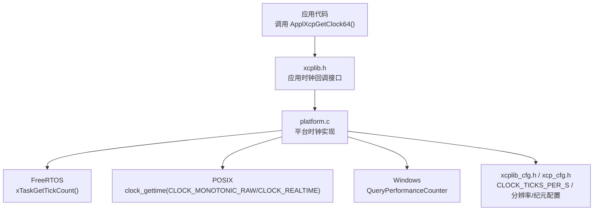
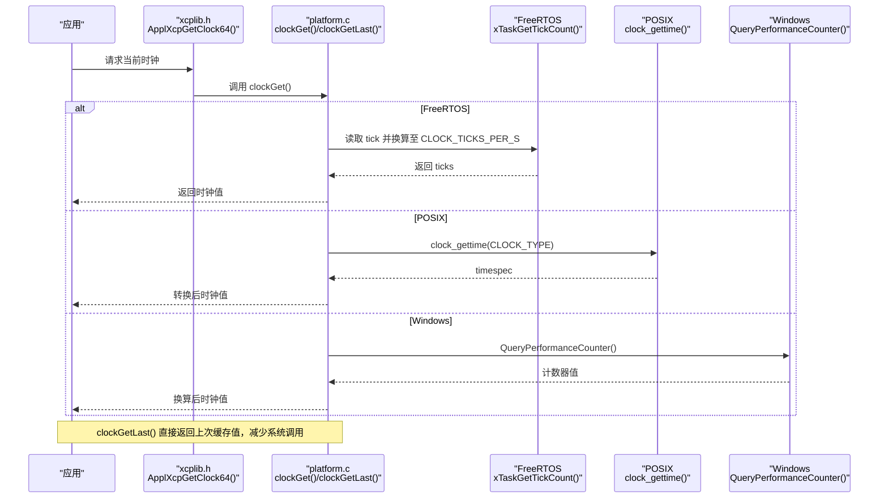
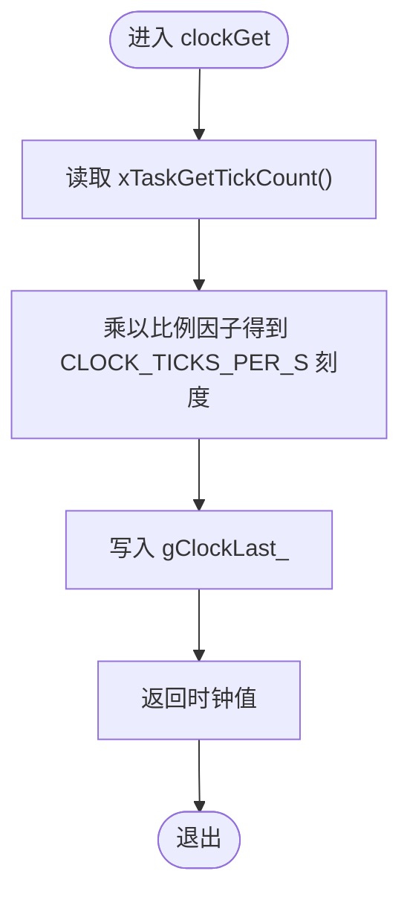
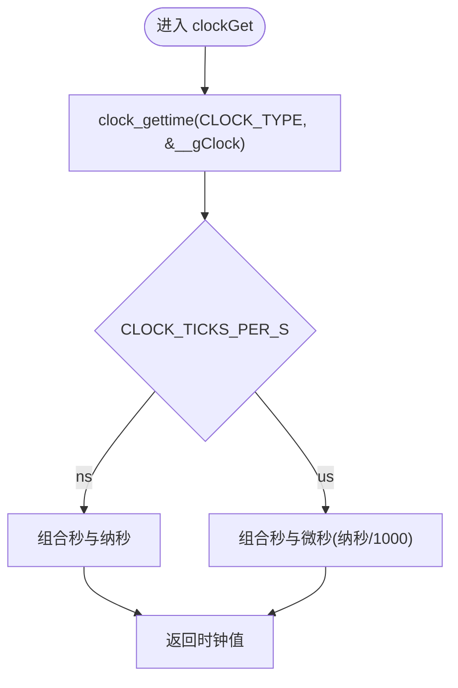
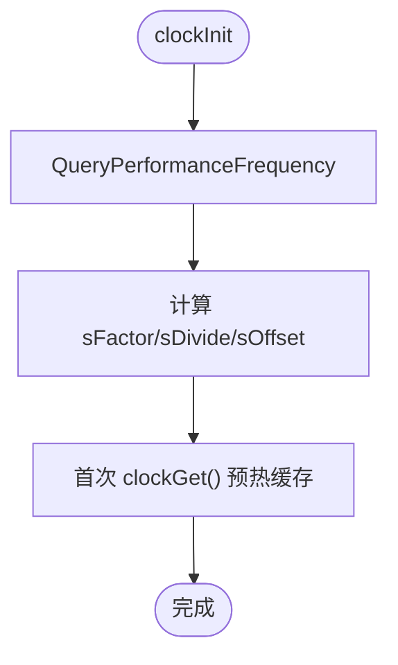
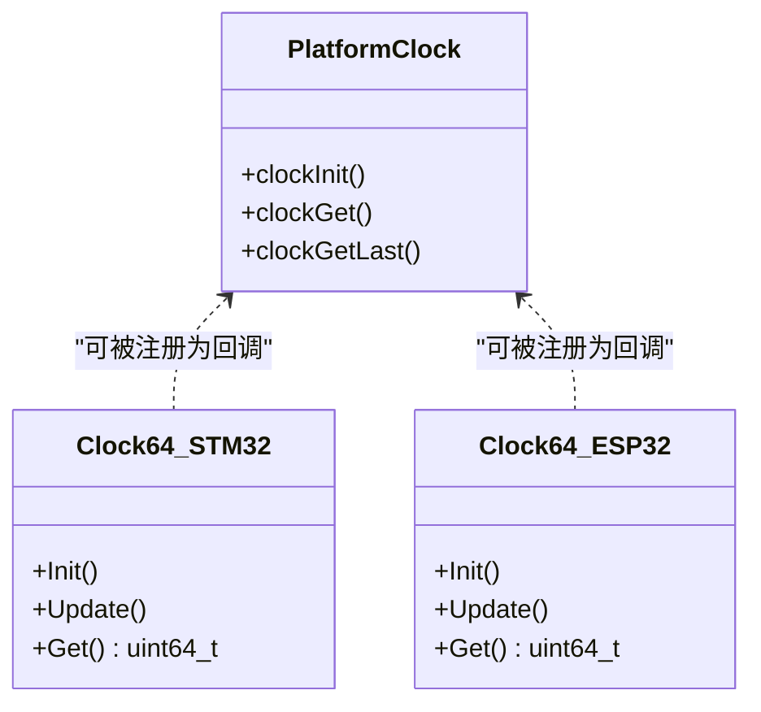
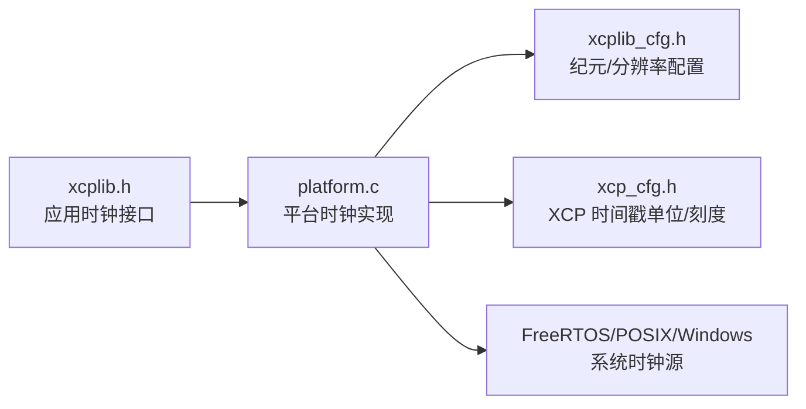

# 时钟抽象层

<cite>
**本文引用的文件**
- [platform.c](file://src/platform.c)
- [platform.h](file://src/platform.h)
- [xcplib_cfg.h](file://src/xcplib_cfg.h)
- [xcp_cfg.h](file://src/xcp_cfg.h)
- [xcplib.h](file://inc/xcplib.h)
- [clock64.h（STM32）](file://examples/freertos_demo/freertos_stm32_demo/Core/Inc/clock64.h)
- [clock64.c（STM32）](file://examples/freertos_demo/freertos_stm32_demo/Core/Src/clock64.c)
- [clock64.h（ESP32）](file://examples/freertos_demo/freertos_esp32_demo/include/clock64.h)
- [clock64.c（ESP32）](file://examples/freertos_demo/freertos_esp32_demo/src/clock64.c)
</cite>

## 目录
1. [简介](#简介)
2. [项目结构](#项目结构)
3. [核心组件](#核心组件)
4. [架构总览](#架构总览)
5. [详细组件分析](#详细组件分析)
6. [依赖关系分析](#依赖关系分析)
7. [性能考虑](#性能考虑)
8. [故障排查指南](#故障排查指南)
9. [结论](#结论)
10. [附录](#附录)

## 简介
本文件系统性阐述 XCPlite 的时钟抽象层设计与实现，覆盖多平台统一接口、精度与分辨率配置、单调时钟与实时时钟的区别与适用场景、初始化流程与性能优化策略（缓存最近时钟值以减少系统调用开销）、不同平台的时钟源选择与精度保证，以及时间同步与高精度测量的最佳实践。目标是帮助开发者在不同平台上以一致的方式获取高精度时间戳，并理解其约束与权衡。

## 项目结构
XCPlite 将“应用层时钟”和“平台时钟”解耦：
- 应用层通过 xcplib.h 暴露统一的时钟回调接口（如 ApplXcpGetClock64），并可注册自定义时钟源。
- 平台层在 platform.c 中为 FreeRTOS、POSIX（Linux/macOS/QNX）和 Windows 提供具体实现，统一对外提供 clockInit/clockGet/clockGetLast 等函数。
- 配置集中在 xcplib_cfg.h（时区/纪元选项、分辨率开关）与 xcp_cfg.h（DAQ 时钟单位与刻度换算）。

**图示来源**
- [xcplib.h:940-987](file://inc/xcplib.h#L940-L987)
- [platform.c:434-818](file://src/platform.c#L434-L818)
- [xcplib_cfg.h:55-65](file://src/xcplib_cfg.h#L55-L65)
- [xcp_cfg.h:410-434](file://src/xcp_cfg.h#L410-L434)

**章节来源**
- [xcplib.h:940-987](file://inc/xcplib.h#L940-L987)
- [platform.c:434-818](file://src/platform.c#L434-L818)
- [xcplib_cfg.h:55-65](file://src/xcplib_cfg.h#L55-L65)
- [xcp_cfg.h:410-434](file://src/xcp_cfg.h#L410-L434)

## 核心组件
- 统一时钟接口
  - 应用侧：ApplXcpGetClock64() 返回 DAQ 时钟值（单位为 1/CLOCK_TICKS_PER_S 秒），分辨率与纪元由配置决定。
  - 可替换：ApplXcpRegisterGetClockCallback() 允许应用注入自定义时钟源。
- 平台时钟抽象
  - clockInit()：初始化平台时钟，预热缓存与时钟状态。
  - clockGet()：返回当前时钟值（按 CLOCK_TICKS_PER_S 归一化）。
  - clockGetLast()：返回最近一次读取的缓存值，避免频繁系统调用。
  - 单调/实时专用：clockGetMonotonicNs/Us 与 clockGetRealtimeNs/Us，及其 Last 版本用于快速路径。
- 配置项
  - OPTION_CLOCK_EPOCH_ARB 或 OPTION_CLOCK_EPOCH_PTP：选择任意起点（单调）或真实时间（PTP/NTP 可调）。
  - OPTION_CLOCK_TICKS_1NS / OPTION_CLOCK_TICKS_1US：选择纳秒或微秒分辨率；未定义时需显式定义 CLOCK_TICKS_PER_S。
  - XCP_TIMESTAMP_UNIT / XCP_TIMESTAMP_TICKS：将内部时钟刻度转换为 XCP 协议所需的纳秒/微秒单位与刻度粒度。

**章节来源**
- [xcplib.h:940-987](file://inc/xcplib.h#L940-L987)
- [platform.h:470-506](file://src/platform.h#L470-L506)
- [xcplib_cfg.h:55-65](file://src/xcplib_cfg.h#L55-L65)
- [xcp_cfg.h:410-434](file://src/xcp_cfg.h#L410-L434)

## 架构总览
下图展示了从应用到平台的具体调用链，包括 FreeRTOS、POSIX 与 Windows 三条分支，以及缓存最近值的优化路径。

**图示来源**
- [platform.c:455-501](file://src/platform.c#L455-L501)
- [platform.c:505-654](file://src/platform.c#L505-L654)
- [platform.c:659-818](file://src/platform.c#L659-L818)

## 详细组件分析

### 统一接口与应用集成
- 应用通过 ApplXcpGetClock64() 获取 DAQ 时钟，返回值单位为 1/CLOCK_TICKS_PER_S。
- 若需更高精度或特殊语义，可通过 ApplXcpRegisterGetClockCallback() 注入自定义时钟源，从而完全接管 clockGet 的行为。
- 同时支持注册时钟状态与主时钟信息回调，以便在 PTP 同步场景下上报同步状态与参考时钟信息。

**章节来源**
- [xcplib.h:940-987](file://inc/xcplib.h#L940-L987)

### 平台时钟实现（FreeRTOS）
- 使用 xTaskGetTickCount() 作为基础时钟源，按 configTICK_RATE_HZ 换算到配置的 CLOCK_TICKS_PER_S。
- 维护 gClockLast_ 缓存最近一次读取值，clockGetLast() 可直接返回该值以降低开销。
- 单调时钟派生：clockGetMonotonicNs/Us 基于同一刻度进行单位换算。

**图示来源**
- [platform.c:455-501](file://src/platform.c#L455-L501)

**章节来源**
- [platform.c:455-501](file://src/platform.c#L455-L501)

### 平台时钟实现（POSIX）
- 根据配置选择 CLOCK_MONOTONIC_RAW 或 CLOCK_REALTIME 作为基准时钟。
- 全局缓存 __gClock/__gClockMonotonic/__gClockRealtime，分别保存最近一次读取结果，供 clockGetLast 及 *_Last 系列快速访问。
- 支持 us/ns 两种分辨率，编译期分支优化转换逻辑。

**图示来源**
- [platform.c:505-654](file://src/platform.c#L505-L654)

**章节来源**
- [platform.c:505-654](file://src/platform.c#L505-L654)

### 平台时钟实现（Windows）
- 使用 QueryPerformanceFrequency/QueryPerformanceCounter 获取高精度计数。
- 启动时计算 sFactor/sDivide/sOffset，将硬件计数映射到 CLOCK_TICKS_PER_S 刻度；可选偏移以对齐 UNIX 纪元或任意起点。
- 同样维护 __gClock 缓存，clockGetLast() 直接返回。

**图示来源**
- [platform.c:659-818](file://src/platform.c#L659-L818)

**章节来源**
- [platform.c:659-818](file://src/platform.c#L659-L818)

### 高精度时钟源扩展（FreeRTOS 示例）
- STM32：基于 DWT 周期计数器，提供 64 位微秒级时钟，支持溢出处理与可选的整数除法转换。
- ESP32：基于 esp_timer_get_time() 的高分辨率定时器。
- 这些实现可作为 ApplXcpRegisterGetClockCallback() 的输入，替代默认平台时钟以获得更高精度。

**图示来源**
- [clock64.h（STM32）:1-26](file://examples/freertos_demo/freertos_stm32_demo/Core/Inc/clock64.h#L1-L26)
- [clock64.c（STM32）:1-77](file://examples/freertos_demo/freertos_stm32_demo/Core/Src/clock64.c#L1-L77)
- [clock64.h（ESP32）:1-11](file://examples/freertos_demo/freertos_esp32_demo/include/clock64.h#L1-L11)
- [clock64.c（ESP32）:1-22](file://examples/freertos_demo/freertos_esp32_demo/src/clock64.c#L1-L22)

**章节来源**
- [clock64.h（STM32）:1-26](file://examples/freertos_demo/freertos_stm32_demo/Core/Inc/clock64.h#L1-L26)
- [clock64.c（STM32）:1-77](file://examples/freertos_demo/freertos_stm32_demo/Core/Src/clock64.c#L1-L77)
- [clock64.h（ESP32）:1-11](file://examples/freertos_demo/freertos_esp32_demo/include/clock64.h#L1-L11)
- [clock64.c（ESP32）:1-22](file://examples/freertos_demo/freertos_esp32_demo/src/clock64.c#L1-L22)

### 时钟精度与分辨率配置（CLOCK_TICKS_PER_S）
- 分辨率选择：OPTION_CLOCK_TICKS_1NS 或 OPTION_CLOCK_TICKS_1US，未定义时需显式定义 CLOCK_TICKS_PER_S。
- 作用范围：影响 ApplXcpGetClock64() 返回值单位、XCP 时间戳单位与刻度换算（XCP_TIMESTAMP_UNIT/TICKS）。
- 约束检查：编译期校验确保刻度在协议范围内且无舍入误差（或在特定模式下可接受）。

**章节来源**
- [platform.h:470-486](file://src/platform.h#L470-L486)
- [xcp_cfg.h:410-434](file://src/xcp_cfg.h#L410-L434)

### 单调时钟与实时时钟
- 单调时钟（CLOCK_MONOTONIC_RAW 或 QNX 下的 CLOCK_MONOTONIC）：不受 NTP/PTP 调整影响，适合测量间隔、超时控制与性能统计。
- 实时时钟（CLOCK_REALTIME）：受 NTP/PTP 调整影响，适合需要与墙钟时间对齐的场景（如日志时间戳、跨设备时间一致性）。
- 在 XCPlite 中，通过 OPTION_CLOCK_EPOCH_ARB 选择任意起点（单调），或通过 OPTION_CLOCK_EPOCH_PTP 选择真实时间（可能漂移校正）。

**章节来源**
- [xcplib_cfg.h:55-65](file://src/xcplib_cfg.h#L55-L65)
- [platform.c:505-549](file://src/platform.c#L505-L549)

### 初始化流程与性能优化
- 初始化：
  - FreeRTOS：调用 clockGet() 预热 gClockLast_。
  - POSIX：初始化 __gClock/__gClockMonotonic/__gClockRealtime，并打印分辨率与初始值（调试级别）。
  - Windows：查询性能计数器频率，计算缩放因子与偏移，预热缓存。
- 性能优化：
  - 缓存最近时钟值：clockGetLast() 直接返回上次结果，避免系统调用。
  - 快速路径：*_Last 系列函数（如 clockGetMonotonicNsLast）用于低开销的超时判断。
  - 短延时优化：sleepUs 在非 FreeRTOS 平台使用 nanosleep，Windows 上对短延时采用忙等待+Sleep(0) 折衷。

**章节来源**
- [platform.c:455-501](file://src/platform.c#L455-L501)
- [platform.c:573-598](file://src/platform.c#L573-L598)
- [platform.c:693-783](file://src/platform.c#L693-L783)
- [platform.c:78-155](file://src/platform.c#L78-L155)

### 不同平台的时钟源选择与精度保证
- FreeRTOS：tick 粒度取决于 configTICK_RATE_HZ；建议通过 ApplXcpRegisterGetClockCallback() 注册更高精度时钟（如 DWT/外部定时器）。
- POSIX：CLOCK_MONOTONIC_RAW 提供稳定单调时间；CLOCK_REALTIME 可能受 NTP/PTP 调整。macOS 上 MONOTONIC_RAW 粒度通常优于 1us。
- Windows：QueryPerformanceCounter 提供高分辨率计数；通过频率与偏移映射到 CLOCK_TICKS_PER_S。

**章节来源**
- [platform.c:455-501](file://src/platform.c#L455-L501)
- [platform.c:505-654](file://src/platform.c#L505-L654)
- [platform.c:659-818](file://src/platform.c#L659-L818)

### 时间同步与校准最佳实践
- 选择合适纪元：
  - 需要与墙钟一致：启用 OPTION_CLOCK_EPOCH_PTP，使用 CLOCK_REALTIME。
  - 仅需单调稳定：启用 OPTION_CLOCK_EPOCH_ARB，使用 CLOCK_MONOTONIC_RAW。
- 高精度需求：
  - 在 FreeRTOS 目标上，注册基于 DWT/外部定时器的高精度时钟源。
  - 在 POSIX/Windows 上，优先使用单调时钟进行测量，使用实时时钟进行时间显示与同步。
- 同步状态上报：
  - 通过 ApplXcpRegisterGetClockStateCallback 与 ApplXcpRegisterGetClockInfoGrandmasterCallback 上报 PTP 同步状态与主时钟信息，便于上层工具识别是否已同步。

**章节来源**
- [xcplib_cfg.h:55-65](file://src/xcplib_cfg.h#L55-L65)
- [xcplib.h:952-987](file://inc/xcplib.h#L952-L987)

### 高精度时间测量实现指南
- 步骤概览：
  1) 确定分辨率：选择 OPTION_CLOCK_TICKS_1NS 或 OPTION_CLOCK_TICKS_1US，或显式定义 CLOCK_TICKS_PER_S。
  2) 选择纪元：MONO（任意起点）或 REALTIME（真实时间）。
  3) 如需更高精度：注册自定义时钟回调（如 STM32 DWT 或 ESP32 esp_timer）。
  4) 使用单调时钟进行测量，使用实时时钟进行时间显示与同步。
  5) 利用 clockGetLast() 与 *_Last 系列降低系统调用开销。
- 注意事项：
  - 确保 CLOCK_TICKS_PER_S 满足协议限制与精度要求。
  - 在 FreeRTOS 上注意 tick 粒度限制，必要时使用外部高精度源。
  - 在 POSIX 上区分 MONOTONIC_RAW 与 MONOTONIC 的差异（后者可能被频率调整）。

**章节来源**
- [platform.h:470-506](file://src/platform.h#L470-L506)
- [xcplib_cfg.h:55-65](file://src/xcplib_cfg.h#L55-L65)
- [xcplib.h:940-987](file://inc/xcplib.h#L940-L987)

## 依赖关系分析

**图示来源**
- [xcplib.h:940-987](file://inc/xcplib.h#L940-L987)
- [platform.c:434-818](file://src/platform.c#L434-L818)
- [xcplib_cfg.h:55-65](file://src/xcplib_cfg.h#L55-L65)
- [xcp_cfg.h:410-434](file://src/xcp_cfg.h#L410-L434)

**章节来源**
- [xcplib.h:940-987](file://inc/xcplib.h#L940-L987)
- [platform.c:434-818](file://src/platform.c#L434-L818)
- [xcplib_cfg.h:55-65](file://src/xcplib_cfg.h#L55-L65)
- [xcp_cfg.h:410-434](file://src/xcp_cfg.h#L410-L434)

## 性能考虑
- 系统调用成本：POSIX 的 clock_gettime 与 Windows 的 QueryPerformanceCounter 均有内核交互成本；通过 clockGetLast() 与 *_Last 系列显著降低开销。
- 短延时策略：非 FreeRTOS 平台使用 nanosleep；Windows 对短延时采用忙等待+Sleep(0)，需注意 CPU 占用。
- 分辨率与精度权衡：1ns 分辨率在部分平台实际粒度仍受限于硬件/内核；应结合应用场景选择合适的分辨率。
- 高负载场景：在高频率采样中优先使用单调时钟与 Last 版本，避免不必要的系统调用。

[本节为通用指导，不直接分析具体文件]

## 故障排查指南
- 编译错误：
  - 未定义 CLOCK_TICKS_PER_S 或未选择 1ns/1us 分辨率：检查 xcplib_cfg.h 与 platform.h 的配置。
  - CLOCK_TICKS_PER_S 超出范围或无法无舍入表示：检查 xcp_cfg.h 的约束与换算。
- 运行时问题：
  - Windows 性能计数器不可用：检查系统支持与初始化返回值。
  - POSIX 分辨率异常：确认选择的 CLOCK_* 类型与平台支持情况。
  - FreeRTOS 精度不足：考虑注册更高精度时钟回调。
- 调试手段：
  - 启用调试输出查看初始分辨率与初始时钟值。
  - 使用 TEST_CLOCK_GET_STATISTIC 统计 clockGet/clockGetLast 调用次数，评估缓存命中率。

**章节来源**
- [platform.c:573-598](file://src/platform.c#L573-L598)
- [platform.c:693-783](file://src/platform.c#L693-L783)
- [xcp_cfg.h:410-434](file://src/xcp_cfg.h#L410-L434)

## 结论
XCPlite 的时钟抽象层通过统一接口与平台适配，实现了在多平台上一致的高精度时间获取能力。通过配置 CLOCK_TICKS_PER_S 与纪元选项，开发者可在单调与实时时钟之间灵活切换；借助缓存最近值与 Last 系列函数，有效降低系统调用开销。对于更高精度需求，可在 FreeRTOS 目标上注册 DWT/外部定时器等高精时钟源。合理的时间同步与校准策略，结合 PTP/NTP 上下文，能够进一步提升跨设备时间一致性与测量准确性。

[本节为总结性内容，不直接分析具体文件]

## 附录
- 关键配置速查
  - 纪元：OPTION_CLOCK_EPOCH_ARB（单调）/ OPTION_CLOCK_EPOCH_PTP（真实时间）
  - 分辨率：OPTION_CLOCK_TICKS_1NS / OPTION_CLOCK_TICKS_1US 或显式定义 CLOCK_TICKS_PER_S
  - XCP 时间戳：XCP_TIMESTAMP_UNIT / XCP_TIMESTAMP_TICKS
- 常用 API
  - ApplXcpGetClock64()：获取 DAQ 时钟
  - clockInit()/clockGet()/clockGetLast()：平台时钟初始化与读取
  - clockGetMonotonicNs/Us 与 clockGetRealtimeNs/Us：单调/实时专用接口

**章节来源**
- [xcplib_cfg.h:55-65](file://src/xcplib_cfg.h#L55-L65)
- [xcp_cfg.h:410-434](file://src/xcp_cfg.h#L410-L434)
- [xcplib.h:940-987](file://inc/xcplib.h#L940-L987)
- [platform.h:470-506](file://src/platform.h#L470-L506)