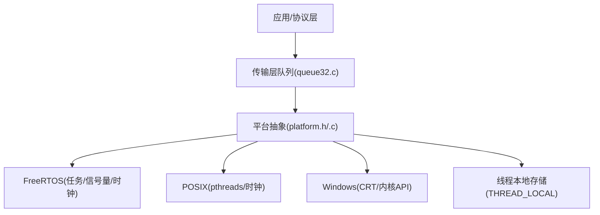
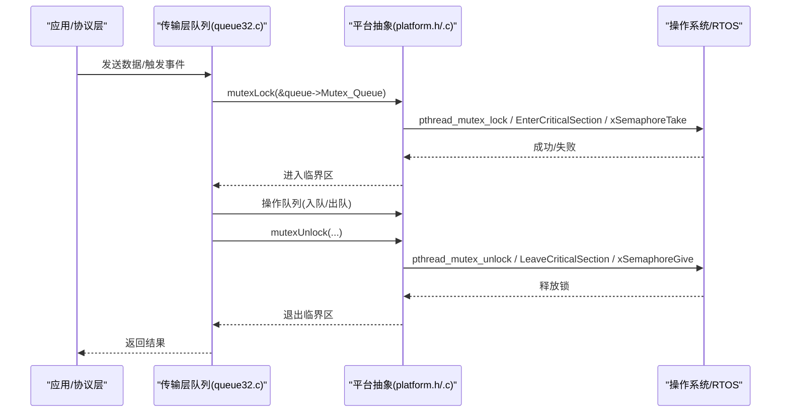
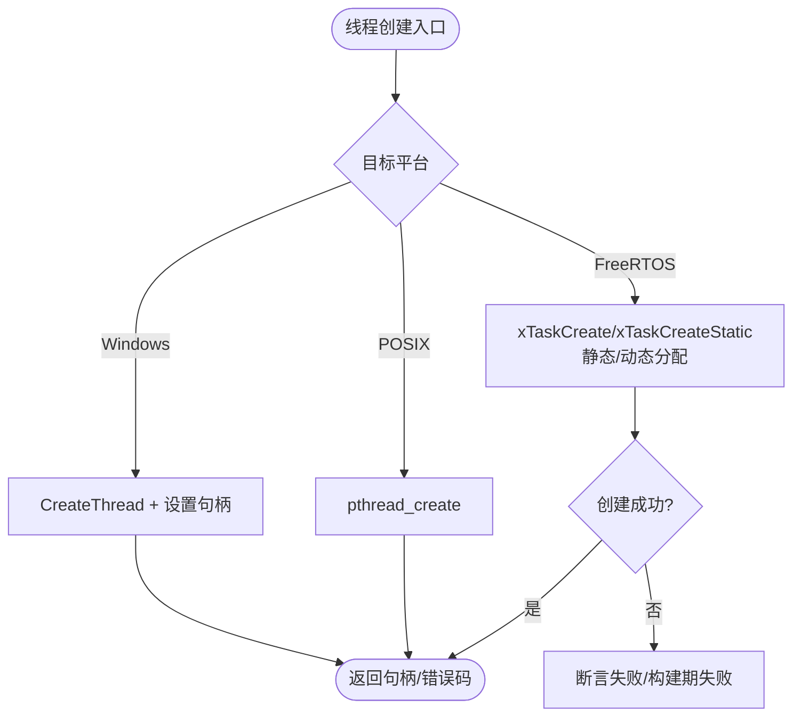
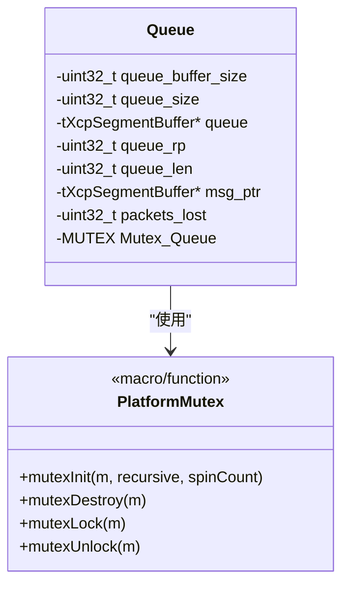
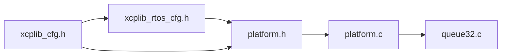

# 线程抽象层

<cite>
**本文引用的文件**
- [platform.h](file://src/platform.h)
- [platform.c](file://src/platform.c)
- [xcplib_cfg.h](file://src/xcplib_cfg.h)
- [xcplib_rtos_cfg.h](file://src/xcplib_rtos_cfg.h)
- [queue32.c](file://src/queue32.c)
- [xcplib.h](file://inc/xcplib.h)
</cite>

## 目录
1. [简介](#简介)
2. [项目结构](#项目结构)
3. [核心组件](#核心组件)
4. [架构总览](#架构总览)
5. [详细组件分析](#详细组件分析)
6. [依赖关系分析](#依赖关系分析)
7. [性能考量](#性能考量)
8. [故障排查指南](#故障排查指南)
9. [结论](#结论)
10. [附录](#附录)

## 简介
本文件系统性阐述 XCPlite 的线程抽象层实现，覆盖跨平台线程模型的统一接口设计（线程创建、调度优先级与栈大小配置）、FreeRTOS/POSIX/Windows 平台的 API 映射与差异兼容、线程同步机制（互斥锁、条件变量、自旋锁）的封装策略、线程本地存储的实现原理与使用场景，以及线程性能优化与调试技巧。同时提供新平台适配的指导原则，帮助开发者在目标系统上快速集成并正确扩展线程能力。

## 项目结构
XCPlite 将平台相关能力集中在 platform.h/.c 中，通过编译期宏选择具体实现；线程与同步相关的公共接口以宏和函数形式暴露给上层模块（如传输层队列）。FreeRTOS 专用配置由 xcplib_rtos_cfg.h 提供，默认通用配置在 xcplib_cfg.h 中定义。线程本地存储宏在 xcplib.h 与 platform.h 中均有定义，确保 C/C++ 多编译器环境的一致性。

图表来源
- [platform.h:300-467](file://src/platform.h#L300-L467)
- [platform.c:366-432](file://src/platform.c#L366-L432)
- [queue32.c:85-100](file://src/queue32.c#L85-L100)

章节来源
- [platform.h:23-72](file://src/platform.h#L23-L72)
- [xcplib_cfg.h:55-71](file://src/xcplib_cfg.h#L55-L71)
- [xcplib_rtos_cfg.h:44-53](file://src/xcplib_rtos_cfg.h#L44-L53)

## 核心组件
- 线程抽象：统一的 create_thread/join_thread/cancel_thread/get_thread_id 宏，屏蔽 POSIX/Windows/FreeRTOS 差异。
- 线程函数签名适配：THREAD_FUNC_RETURN/THREAD_FUNC_END 统一不同 ABI 的返回与退出语义。
- 互斥锁：MUTEX/mutexInit/mutexDestroy/mutexLock/mutexUnlock 宏或函数，支持递归与非递归，适配 FreeRTOS 静态分配。
- 线程本地存储：THREAD_LOCAL 宏，基于 C11/编译器扩展，保证多线程下局部状态隔离。
- 时钟与延时：sleepUs/sleepMs 与 clockGet/clockGetLast 等，为线程调度与超时提供时间基础。
- 传输层队列：queue32.c 使用 MUTEX 保护关键区，体现线程同步的实际用法。

章节来源
- [platform.h:300-467](file://src/platform.h#L300-L467)
- [platform.c:366-432](file://src/platform.c#L366-L432)
- [queue32.c:85-100](file://src/queue32.c#L85-L100)

## 架构总览
下图展示线程抽象层在不同平台上的调用路径与资源映射。上层通过统一宏/函数访问线程、锁与时钟；底层根据编译期宏选择具体实现。

图表来源
- [queue32.c:85-100](file://src/queue32.c#L85-L100)
- [platform.h:300-345](file://src/platform.h#L300-L345)
- [platform.c:366-432](file://src/platform.c#L366-L432)

## 详细组件分析

### 线程模型与统一接口
- 线程创建：create_thread 在 Windows 使用 CreateThread，POSIX 使用 pthread_create，FreeRTOS 使用 xTaskCreate/xTaskCreateStatic；FreeRTOS 路径支持静态分配与动态分配两种模式，并通过断言保障创建成功。
- 线程生命周期：join_thread 在 POSIX 阻塞等待，Windows 使用 WaitForSingleObject，FreeRTOS 无阻塞 join，需通过事件/信号量同步。cancel_thread 在 POSIX 分离并取消，Windows 终止并关闭句柄，FreeRTOS 删除任务。
- 线程 ID：get_thread_id 分别返回 GetCurrentThreadId、pthread_self 或当前任务句柄。
- 线程函数签名：THREAD_FUNC_RETURN/THREAD_FUNC_END 统一不同 ABI 的返回值与退出方式，FreeRTOS 使用 vTaskDelete(NULL) 作为退出点。

图表来源
- [platform.h:368-433](file://src/platform.h#L368-L433)

章节来源
- [platform.h:351-451](file://src/platform.h#L351-L451)

### 调度优先级与栈大小配置
- FreeRTOS：默认优先级 OPTION_FREERTOS_PRIORITY = tskIDLE_PRIORITY + 2U；默认栈大小 OPTION_FREERTOS_STACK_BYTES 在 POSIX 模拟器与真实目标有不同默认值；ESP_PLATFORM 下堆栈深度换算考虑 StackType_t 粒度。
- POSIX/Windows：不直接暴露优先级/栈大小配置项，通常由平台默认或上层线程属性控制；XCPlite 保持最小化抽象，避免引入平台特定参数。
- 建议：在嵌入式目标上根据 XCP 服务器任务的实际开销调整 OPTION_FREERTOS_STACK_BYTES 与优先级，确保实时性与稳定性。

章节来源
- [xcplib_rtos_cfg.h:44-53](file://src/xcplib_rtos_cfg.h#L44-L53)
- [platform.h:381-418](file://src/platform.h#L381-L418)

### 互斥锁与同步机制
- 互斥锁：MUTEX 类型与初始化/销毁/加解锁宏在不同平台映射到 CRITICAL_SECTION、pthread_mutex_t、FreeRTOS 信号量；FreeRTOS 支持递归锁（当启用 configUSE_RECURSIVE_MUTEXES），并在静态分配模式下使用 StaticSemaphore_t 缓冲。
- 自旋锁：XCPlite 未提供显式自旋锁抽象；在高竞争短临界区可使用平台原语（如 Windows Critical Section 的 spinCount 参数）或在 FreeRTOS 中使用临界区（关中断）替代，但需谨慎评估上下文切换与延迟影响。
- 条件变量：XCPlite 未暴露条件变量抽象；可在 POSIX 上使用 pthread_cond_t，FreeRTOS 可通过信号量+计数模拟，Windows 使用 CONDITION_VARIABLE。
- 使用示例：传输层队列 queue32.c 使用 MUTEX 保护队列头尾指针与长度，确保多生产者安全。

图表来源
- [queue32.c:85-100](file://src/queue32.c#L85-L100)
- [platform.h:300-345](file://src/platform.h#L300-L345)
- [platform.c:366-432](file://src/platform.c#L366-L432)

章节来源
- [platform.h:300-345](file://src/platform.h#L300-L345)
- [platform.c:366-432](file://src/platform.c#L366-L432)
- [queue32.c:85-100](file://src/queue32.c#L85-L100)

### 线程本地存储（TLS）
- 实现：THREAD_LOCAL 宏在 C/C++ 环境下分别映射到 thread_local/_Thread_local/__thread/__declspec(thread)，回退到 static（非线程安全）并报错提示缺失支持。
- 使用场景：每线程独立的事件 ID、临时缓冲区、统计计数等，避免全局竞争与锁开销。
- 注意事项：FreeRTOS 目标需配置 configNUM_THREAD_LOCAL_STORAGE_POINTERS 以满足 TLS 指针数量需求。

章节来源
- [platform.h:454-467](file://src/platform.h#L454-L467)
- [xcplib.h:280-301](file://inc/xcplib.h#L280-L301)

### 时钟与延时对线程行为的影响
- sleepUs/sleepMs：FreeRTOS 基于 tick 粒度舍入；Windows 对小延时采用忙轮询+Sleep(0)；POSIX 使用 nanosleep。
- clockGet/clockGetLast：FreeRTOS 基于 xTaskGetTickCount 转换至配置的分辨率；POSIX/Windows 分别基于高精度计数器或系统时钟，并提供 last 缓存以减少系统调用开销。
- 对线程调度的意义：合理选择延时与计时方式可降低 CPU 占用并提高定时精度。

章节来源
- [platform.c:78-155](file://src/platform.c#L78-L155)
- [platform.c:455-800](file://src/platform.c#L455-L800)

## 依赖关系分析
- 编译期配置：xcplib_cfg.h 提供默认选项（如原子模拟、队列选择、DAQ 事件管理）；xcplib_rtos_cfg.h 针对 FreeRTOS 目标进行覆盖（栈大小、优先级、MTU、队列策略等）。
- 平台抽象：platform.h/.c 依据 _WIN/_LINUX/_MACOS/_QNX/_FREE_RTOS 选择具体实现；FreeRTOS_POSIX_SIM 允许在主机上仿真 FreeRTOS 路径。
- 传输层：queue32.c 依赖 platform.h 提供的 MUTEX 与内存分配，体现线程同步的实际集成点。

图表来源
- [xcplib_cfg.h:55-71](file://src/xcplib_cfg.h#L55-L71)
- [xcplib_rtos_cfg.h:44-53](file://src/xcplib_rtos_cfg.h#L44-L53)
- [platform.h:23-72](file://src/platform.h#L23-L72)
- [queue32.c:16-22](file://src/queue32.c#L16-L22)

章节来源
- [xcplib_cfg.h:55-71](file://src/xcplib_cfg.h#L55-L71)
- [xcplib_rtos_cfg.h:44-53](file://src/xcplib_rtos_cfg.h#L44-L53)
- [platform.h:23-72](file://src/platform.h#L23-L72)
- [queue32.c:16-22](file://src/queue32.c#L16-L22)

## 性能考量
- 队列同步：在高频路径优先使用临界区或无锁队列（64位平台可用 lockless 变体）；32位/Windows 使用 MUTEX 保护，注意锁粒度与持有时间。
- 延时策略：小延时在 Windows 使用忙轮询可能增加 CPU 负载，应权衡精度与功耗；FreeRTOS 基于 tick 的舍入可能导致抖动，必要时注册更高精度时钟回调。
- 时钟缓存：clockGetLast 利用最近一次读取值减少系统调用，适用于慢速超时与周期性检查。
- 栈与优先级：FreeRTOS 目标需根据实际任务开销调整栈大小与优先级，避免抢占不足或栈溢出。

[本节为通用指导，不直接分析具体文件]

## 故障排查指南
- 线程创建失败：FreeRTOS 路径使用断言，若失败会在构建或运行期立即暴露；POSIX/Windows 返回错误码，需检查资源限制与权限。
- 死锁与优先级反转：确认互斥锁使用模式（递归/非递归）与获取顺序；FreeRTOS 启用递归锁时需确保匹配释放。
- 栈溢出：监控 FreeRTOS 任务栈使用率，适当增大 OPTION_FREERTOS_STACK_BYTES；在 POSIX/Windows 下检查线程栈大小与递归深度。
- 时钟漂移：POSIX/Windows 下确认 CLOCK_TICKS_PER_S 与 epoch 配置；FreeRTOS 下建议使用更高精度时钟回调。

章节来源
- [platform.h:368-433](file://src/platform.h#L368-L433)
- [platform.c:366-432](file://src/platform.c#L366-L432)
- [platform.c:455-800](file://src/platform.c#L455-L800)

## 结论
XCPlite 的线程抽象层通过编译期宏与统一接口屏蔽了 FreeRTOS、POSIX 与 Windows 的差异，提供了线程创建、生命周期管理、互斥锁与线程本地存储等核心能力。结合配置覆盖与平台特性，能够在桌面、服务器与嵌入式环境中保持一致的行为与性能。对于新平台适配，建议遵循“最小抽象、最大可移植”的原则，优先复用现有宏与配置机制，逐步补充平台特定实现。

[本节为总结性内容，不直接分析具体文件]

## 附录

### 新平台适配指导原则
- 定义平台宏：在 platform.h 中添加平台识别宏（如 _NEW_OS），并确保与其他平台宏互斥。
- 实现线程 API：为 create_thread/join_thread/cancel_thread/get_thread_id 提供新平台实现，保持与现有约定一致（返回值语义、错误处理）。
- 实现互斥锁：为新平台提供 MUTEX/mutexInit/mutexDestroy/mutexLock/mutexUnlock 映射，支持递归与非递归模式。
- 实现 TLS：确保 THREAD_LOCAL 在新平台上有效，必要时配置运行时 TLS 指针槽位。
- 验证与测试：在目标平台运行队列与线程相关用例，验证锁竞争、延时精度与时钟一致性。

[本节为概念性指导，不直接分析具体文件]