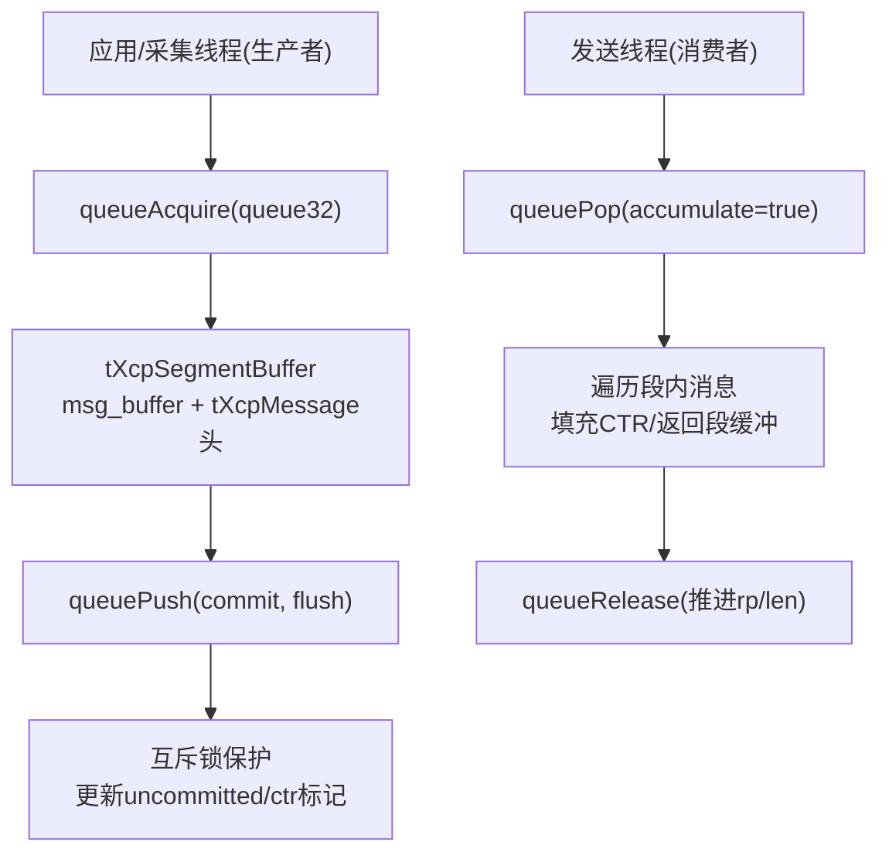
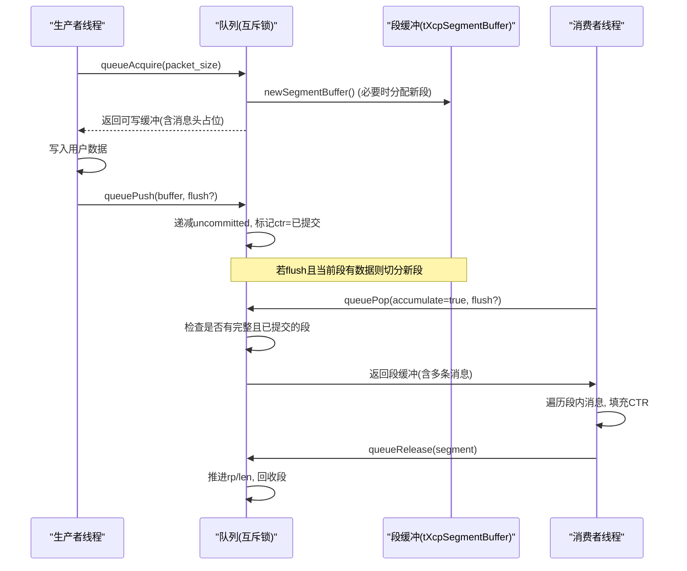
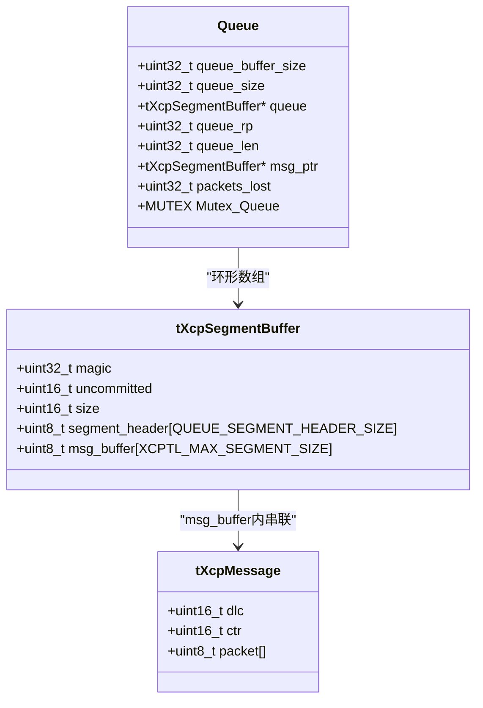
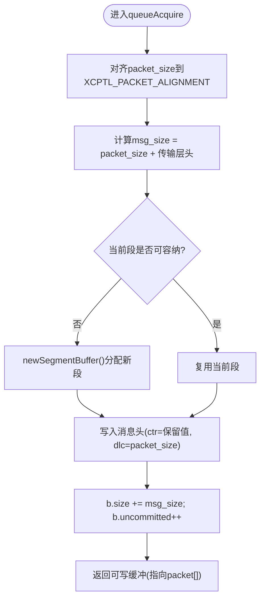
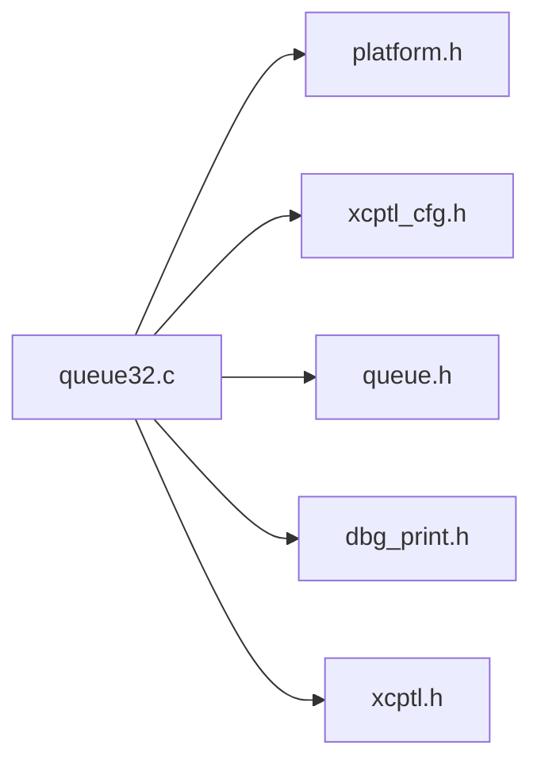

# 32位整数队列实现

<cite>
**本文引用的文件**   
- [src/queue32.c](file://src/queue32.c)
- [src/queue.h](file://src/queue.h)
- [src/xcptl_cfg.h](file://src/xcptl_cfg.h)
- [src/queue64f.c](file://src/queue64f.c)
- [src/queue64v.c](file://src/queue64v.c)
- [test/queue_test/src/main.c](file://test/queue_test/src/main.c)
</cite>

## 目录
1. [简介](#简介)
2. [项目结构](#项目结构)
3. [核心组件](#核心组件)
4. [架构总览](#架构总览)
5. [详细组件分析](#详细组件分析)
6. [依赖关系分析](#依赖关系分析)
7. [性能考量](#性能考量)
8. [故障排查指南](#故障排查指南)
9. [结论](#结论)
10. [附录：使用示例与最佳实践](#附录使用示例与最佳实践)

## 简介
本文件针对XCPlite中基于互斥锁的32位整数队列实现（queue32.c）进行深入技术文档化。该实现是XCP传输层专用的多生产者单消费者队列，采用“消息累积”策略将多个小消息合并为段以提升传输效率；通过互斥锁保证生产侧线程安全，消费侧由单一线程串行处理。文档同时对比64位无锁队列实现（queue64f.c、queue64v.c），解释在32位平台或Windows上的回退机制，并给出内存布局、读写指针管理、溢出处理、性能特征及正确使用方法。

## 项目结构
- queue32.c：XCP专用、基于互斥锁的32位可变长度条目队列，支持消息累积到段。
- queue.h：通用队列API定义，统一接口抽象，屏蔽不同实现差异。
- xcptl_cfg.h：XCP传输层配置（最大DTO大小、段大小、对齐、头预留等）。
- queue64f.c / queue64v.c：64位无锁固定/可变长度队列实现（非Windows/原子支持）。
- test/queue_test/src/main.c：队列压力测试与使用示例，演示Acquire/Push/Pop/Release流程。

图表来源
- [src/queue32.c:207-304](file://src/queue32.c#L207-L304)
- [src/queue32.c:333-417](file://src/queue32.c#L333-L417)

章节来源
- [src/queue32.c:1-420](file://src/queue32.c#L1-L420)
- [src/queue.h:1-187](file://src/queue.h#L1-L187)
- [src/xcptl_cfg.h:1-143](file://src/xcptl_cfg.h#L1-L143)

## 核心组件
- 段缓冲结构体：包含魔数、未提交计数、段大小、可选段头预留区、以及承载多个XCP消息的msg_buffer。
- 队列控制块：维护环形缓冲区数组、读/写索引、当前未完成段指针、丢包计数、互斥锁。
- 消息头结构体：包含长度(dlc)和计数器(ctr)，用于逐条消息的协议层封装。
- 关键API：
  - 生产侧：queueInit、queueAcquire、queuePush、queueClear、queueDeinit
  - 消费侧：queueLevel、queuePop、queueRelease

章节来源
- [src/queue32.c:57-100](file://src/queue32.c#L57-L100)
- [src/queue.h:88-187](file://src/queue.h#L88-L187)

## 架构总览
queue32.c作为XCP传输层的专用队列，遵循“多生产者、单消费者”模型：
- 生产者线程并发调用queueAcquire申请缓冲，写入数据后通过queuePush提交。提交时以互斥锁保护，确保对共享状态的一致访问。
- 消费者线程独占调用queuePop获取已提交的完整段（可能包含多条消息），并为每条消息设置传输层计数器，随后通过queueRelease释放段空间。

图表来源
- [src/queue32.c:207-304](file://src/queue32.c#L207-L304)
- [src/queue32.c:333-417](file://src/queue32.c#L333-L417)

## 详细组件分析

### 环形缓冲区与内存布局
- 环形数组：queue[]为tXcpSegmentBuffer数组，queue_rp为读索引，queue_len为当前段数量，queue_size为容量。
- 段结构：每个段包含魔数、未提交计数、段大小、可选段头预留区、以及msg_buffer承载的消息序列。
- 消息结构：每条消息以tXcpMessage开头，包含dlc(长度)和ctr(计数器)，其后为用户数据包。
- 对齐要求：XCPTL_PACKET_ALIGNMENT确保消息头按字访问；段payload需满足对齐约束。

图表来源
- [src/queue32.c:57-100](file://src/queue32.c#L57-L100)

章节来源
- [src/queue32.c:57-100](file://src/queue32.c#L57-L100)
- [src/xcptl_cfg.h:86-114](file://src/xcptl_cfg.h#L86-L114)

### 互斥锁与线程安全
- 生产侧：所有修改queue内部状态的操作（newSegmentBuffer、queuePush、queueRelease）均被互斥锁保护，确保多线程并发安全。
- 消费者侧：queuePop与queueRelease仅由单一消费者线程调用，无需额外同步。
- 临界区最小化：仅在必要处加锁，减少锁竞争开销。

章节来源
- [src/queue32.c:140-183](file://src/queue32.c#L140-L183)
- [src/queue32.c:283-304](file://src/queue32.c#L283-L304)
- [src/queue32.c:406-417](file://src/queue32.c#L406-L417)

### 消息累积与段组装
- 累积策略：queueAcquire将多个小消息追加到同一msg_buffer，直到达到XCPTL_MAX_SEGMENT_SIZE或需要flush。
- 提交语义：queuePush将消息标记为已提交（ctr从保留值改为已提交标志），并递减uncommitted计数。
- Flush行为：当flush为真且当前段有数据时，强制切分新段，确保高优先级数据尽快出队。

图表来源
- [src/queue32.c:207-280](file://src/queue32.c#L207-L280)

章节来源
- [src/queue32.c:207-280](file://src/queue32.c#L207-L280)

### 读写指针管理与溢出处理
- 写指针：queue_len表示当前段数量，queue_msg_ptr指向当前正在填充的段。
- 读指针：queue_rp为消费起始位置，queueRelease递增并循环回绕。
- 溢出检测：当queue_len达到queue_size时，newSegmentBuffer将msg_ptr置空，后续queueAcquire无法获得缓冲，packets_lost自增。

章节来源
- [src/queue32.c:106-126](file://src/queue32.c#L106-L126)
- [src/queue32.c:260-264](file://src/queue32.c#L260-L264)
- [src/queue32.c:406-417](file://src/queue32.c#L406-L417)

### 与64位队列实现的差异
- 无锁 vs 互斥锁：queue64f.c/queue64v.c使用原子操作实现无锁队列，适用于64位POSIX平台；queue32.c使用互斥锁，适用于32位平台或Windows。
- 消息累积：queue32系列支持将多条消息累积到段；64位队列不支持此特性，采用向量IO路径直接发送。
- 头预留区：queue32支持QUEUE_SEGMENT_HEADER_SIZE用于链路层头预留；64位队列不启用该功能。
- 选择条件：编译期根据PLATFORM_32BIT、_WIN、OPTION_ATOMIC_EMULATION等宏选择实现。

章节来源
- [src/queue.h:10-15](file://src/queue.h#L10-L15)
- [src/queue64f.c:45-50](file://src/queue64f.c#L45-L50)
- [src/queue64v.c:36-41](file://src/queue64v.c#L36-L41)
- [src/xcptl_cfg.h:23-32](file://src/xcptl_cfg.h#L23-L32)

## 依赖关系分析
- queue32.c依赖platform.h提供MUTEX、mutexLock/Unlock等跨平台原语。
- 依赖xcptl_cfg.h中的XCPTL_*常量（最大DTO、段大小、对齐、头大小等）。
- 依赖dbg_print.h进行调试输出。
- 与queue.h定义的统一API解耦，便于替换实现。

图表来源
- [src/queue32.c:16-35](file://src/queue32.c#L16-L35)

章节来源
- [src/queue32.c:16-35](file://src/queue32.c#L16-L35)

## 性能考量
- 吞吐量：消息累积减少系统调用次数，提升UDP/以太网帧利用率；在高负载下显著降低开销。
- 延迟：互斥锁引入上下文切换成本，但在多生产者场景下仍优于频繁锁竞争；flush机制保障低延迟路径。
- 内存效率：段缓冲复用，避免频繁分配；缓存行对齐减少伪共享。
- 对比64位无锁队列：在无锁平台上可获得更低延迟与更高吞吐，但牺牲了消息累积能力。

章节来源
- [src/queue32.c:55-56](file://src/queue32.c#L55-L56)
- [src/queue32.c:244-249](file://src/queue32.c#L244-L249)
- [src/queue64f.c:16-43](file://src/queue64f.c#L16-L43)
- [src/queue64v.c:15-34](file://src/queue64v.c#L15-L34)

## 故障排查指南
- 队列满：queueAcquire返回size=0，packets_lost增加；检查生产者速率或增大队列容量。
- 数据损坏：断言失败（如dlc范围、ctr状态）；确认对齐与消息边界正确。
- 死锁/饥饿：确保消费者及时调用queueRelease；避免长时间持有锁。
- 日志定位：启用DBG级别日志，观察queueAcquire/queuePush/queuePop调用轨迹。

章节来源
- [src/queue32.c:216-225](file://src/queue32.c#L216-L225)
- [src/queue32.c:293-297](file://src/queue32.c#L293-L297)
- [src/queue32.c:387-394](file://src/queue32.c#L387-L394)

## 结论
queue32.c为XCP传输层提供了可靠、高效的32位消息队列实现，通过互斥锁保证线程安全，借助消息累积提升传输效率。其环形缓冲设计简洁高效，配合严格的对齐与溢出处理，适用于资源受限或Windows环境。与64位无锁实现相比，虽有一定锁开销，但具备累积优势，适合小消息高频场景。合理配置参数与正确使用API，可在数据采集与传输中取得良好性能。

## 附录：使用示例与最佳实践
- 初始化：调用queueInit分配队列内存，传入期望字节大小。
- 生产流程：
  - queueAcquire申请缓冲，写入用户数据。
  - queuePush提交，必要时设置flush以优先发送。
- 消费流程：
  - queuePop获取段，遍历段内消息，处理数据。
  - queueRelease释放段，推进读指针。
- 监控指标：
  - queueLevel查询队列深度。
  - packets_lost统计丢包情况。

参考测试用例：
- 生产者：test/queue_test/src/main.c中task函数演示Acquire/Push。
- 消费者：main函数中queuePop/Release循环演示段解析与释放。

章节来源
- [test/queue_test/src/main.c:361-435](file://test/queue_test/src/main.c#L361-L435)
- [test/queue_test/src/main.c:703-754](file://test/queue_test/src/main.c#L703-L754)