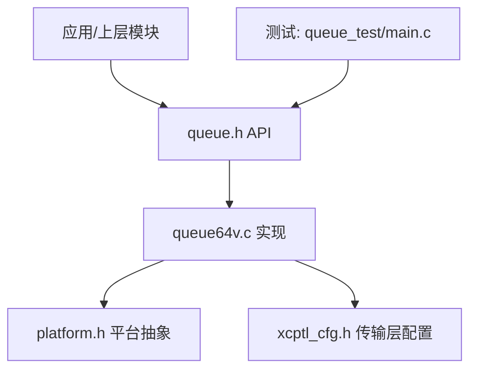
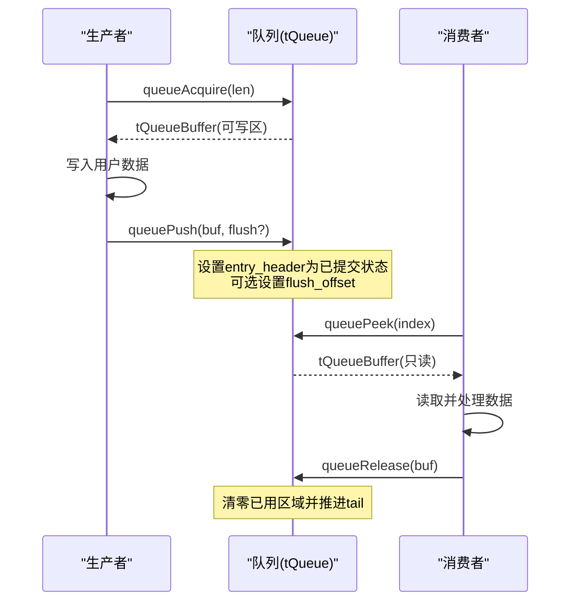
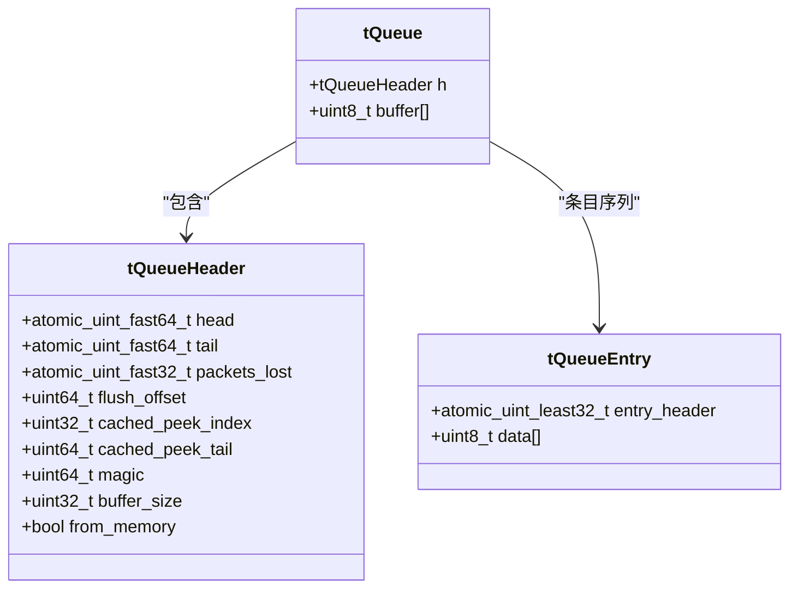
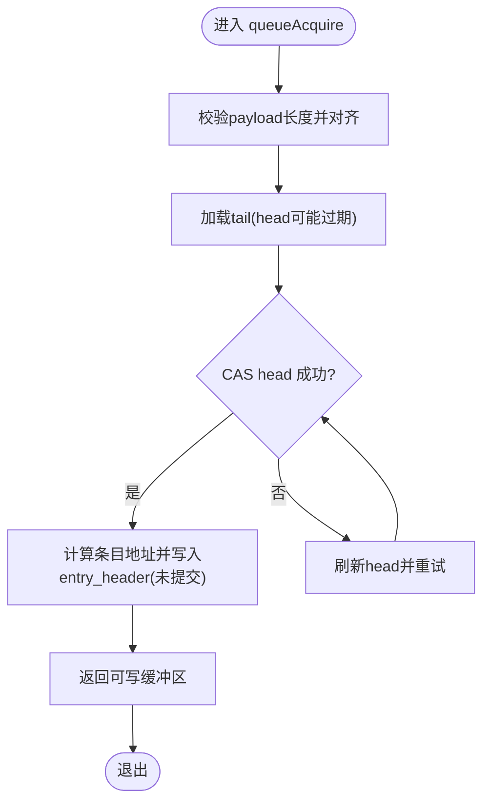
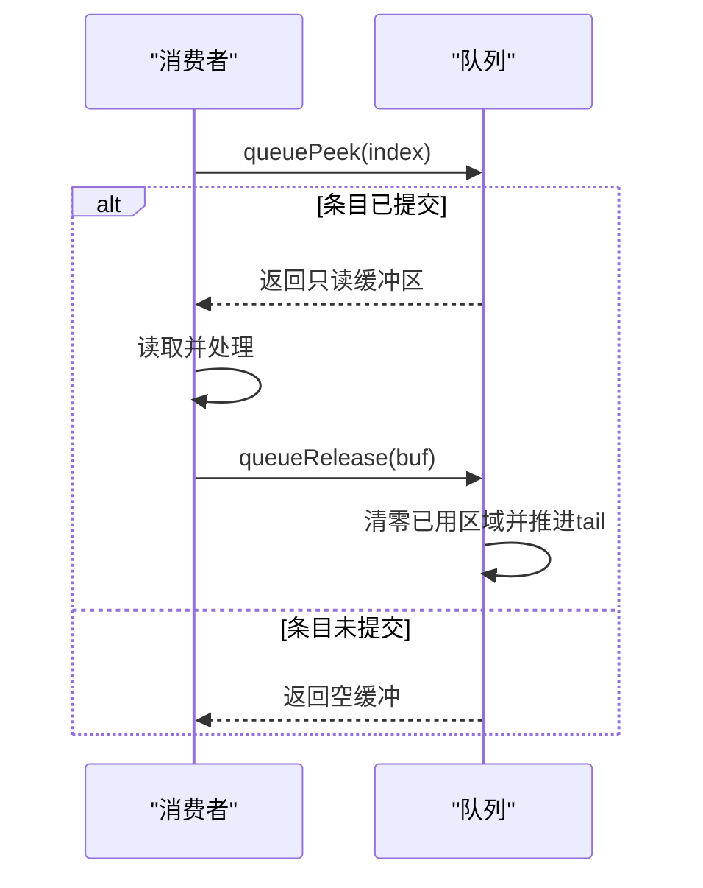
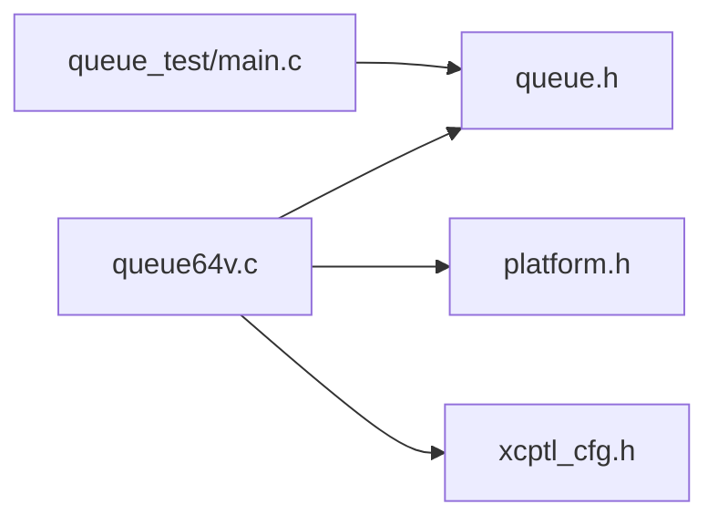

# 64位向量队列实现

<cite>
**本文引用的文件**
- [src/queue64v.c](file://src/queue64v.c)
- [src/queue.h](file://src/queue.h)
- [src/xcptl_cfg.h](file://src/xcptl_cfg.h)
- [src/platform.h](file://src/platform.h)
- [test/queue_test/src/main.c](file://test/queue_test/src/main.c)
</cite>

## 目录
1. [简介](#简介)
2. [项目结构](#项目结构)
3. [核心组件](#核心组件)
4. [架构总览](#架构总览)
5. [详细组件分析](#详细组件分析)
6. [依赖关系分析](#依赖关系分析)
7. [性能考量](#性能考量)
8. [故障排除指南](#故障排除指南)
9. [结论](#结论)
10. [附录](#附录)

## 简介
本文件对 queue64v.c 中的无锁可变大小64位向量队列进行深入技术解析，重点涵盖：
- 无锁并发模型与内存可见性语义（x86强序与ARM弱序）
- 可变长度条目的布局、对齐与原子头部设计
- 动态内存管理与碎片化规避策略
- 消费者侧 peek 优化与缓存命中提升
- 与固定大小队列的性能权衡（缓存行、带宽、一致性流量）
- 配置调优建议与不同负载场景下的实践
- 复杂应用场景示例与故障排查技巧

说明：该实现为多生产者单消费者（MPS C）的无锁队列，面向高吞吐、低延迟的数据通道。其“向量化”体现在批量 peek 与顺序释放带来的数据并行处理优势，而非显式SIMD指令；队列本身不直接调用SIMD指令，但通过数据结构与访问模式最大化CPU缓存友好性与批处理能力。

## 项目结构
- 队列API定义位于 src/queue.h，统一抽象了初始化、获取缓冲区、提交、窥视、释放、清空等接口。
- 可变大小64位无锁实现位于 src/queue64v.c，提供具体算法与内存布局。
- 传输层参数（如最大DTO、对齐方式、段头预留空间）在 src/xcptl_cfg.h 中集中配置，影响队列条目大小与对齐。
- 平台抽象（原子、线程、时钟、共享内存等）在 src/platform.h 中提供跨平台支持。
- 测试用例 test/queue_test/src/main.c 展示了多线程生产、peek 批量读取、统计与压力测试方法。

图表来源
- [src/queue.h:1-187](file://src/queue.h#L1-L187)
- [src/queue64v.c:1-662](file://src/queue64v.c#L1-L662)
- [src/xcptl_cfg.h:1-143](file://src/xcptl_cfg.h#L1-L143)
- [src/platform.h:1-677](file://src/platform.h#L1-L677)

章节来源
- [src/queue.h:1-187](file://src/queue.h#L1-L187)
- [src/queue64v.c:1-662](file://src/queue64v.c#L1-L662)
- [src/xcptl_cfg.h:1-143](file://src/xcptl_cfg.h#L1-L143)
- [src/platform.h:1-677](file://src/platform.h#L1-L677)
- [test/queue_test/src/main.c:1-849](file://test/queue_test/src/main.c#L1-L849)

## 核心组件
- 队列头 tQueueHeader：包含 head/tail 原子指针、丢包计数、flush 请求偏移、peek 缓存索引与尾部偏移、魔数与缓冲大小等，按缓存行对齐以减少伪共享。
- 条目结构 tQueueEntry：以 atomic_uint_least32_t 作为 entry_header，后接变长 data[]，用于记录条目状态与长度。
- 队列对象 tQueue：由 tQueueHeader + 连续 buffer 组成，buffer 内条目按顺序存放，支持环形复用。
- 关键操作：
  - 生产者：queueAcquire 获取可写缓冲区并保留位置；queuePush 提交数据并设置 flush 优先级。
  - 消费者：queuePeek 窥视指定索引条目（支持批量）；queueRelease 释放已处理条目并推进 tail；queueLevel 查询当前占用。

章节来源
- [src/queue64v.c:216-262](file://src/queue64v.c#L216-L262)
- [src/queue64v.c:366-485](file://src/queue64v.c#L366-L485)
- [src/queue64v.c:494-658](file://src/queue64v.c#L494-L658)
- [src/queue.h:88-187](file://src/queue.h#L88-L187)

## 架构总览
队列采用“原始对齐存储”的设计思路：消费者释放时清零已使用区域，随后生产者可在任意合适对齐位置重新分配新条目。通过原子 head/tail 与条目头部的状态位完成同步，避免锁竞争。

图表来源
- [src/queue64v.c:366-485](file://src/queue64v.c#L366-L485)
- [src/queue64v.c:512-658](file://src/queue64v.c#L512-L658)

## 详细组件分析

### 数据结构与布局
- 条目头 entry_header：低位保存条目长度（不含 entry 头），高位保存状态位（初始为0，提交时为 ENTRY_COMMITTED）。
- 对齐要求：QUEUE_PAYLOAD_SIZE_ALIGNMENT 必须为2的幂且为4的倍数，确保 entry_header 自然对齐。
- 队列头缓存：cached_peek_index 与 cached_peek_tail 加速顺序 peek 循环，减少重复计算。

图表来源
- [src/queue64v.c:216-262](file://src/queue64v.c#L216-L262)

章节来源
- [src/queue64v.c:216-262](file://src/queue64v.c#L216-L262)
- [src/queue.h:29-55](file://src/queue.h#L29-L55)

### 生产者路径（无锁获取与提交）
- queueAcquire：
  - 校验 payload_len 范围并按对齐向上取整。
  - 通过 CAS 尝试增加 head，若成功则返回可写缓冲区指针与大小。
  - 失败表示队列溢出，递增丢包计数器并返回空缓冲。
- queuePush：
  - 将 entry_header 设置为“已提交”状态，同时写入完整长度（含用户头）。
  - 可选设置 flush_offset，指示消费者优先处理该条目。

图表来源
- [src/queue64v.c:366-463](file://src/queue64v.c#L366-L463)

章节来源
- [src/queue64v.c:366-463](file://src/queue64v.c#L366-L463)

### 消费者路径（窥视与释放）
- queuePeek：
  - 支持从 index=0 或缓存的 peek 索引开始顺序扫描。
  - 检查 entry_header 是否处于“已提交”状态，否则返回空（等待生产者）。
  - 返回只读缓冲区，并更新缓存索引与尾部偏移以加速后续 peek。
  - 可选检测 flush_requested 标志。
- queueRelease：
  - 清零已使用区域（包括 entry 头与用户数据），避免残留状态。
  - 以 release 语义推进 tail，使生产者可见清理后的内存。
  - 重置 peek 缓存，保证一致性。

图表来源
- [src/queue64v.c:512-658](file://src/queue64v.c#L512-L658)

章节来源
- [src/queue64v.c:512-658](file://src/queue64v.c#L512-L658)

### 动态内存管理与碎片化规避
- 单一连续缓冲：队列初始化时分配一块连续内存（或复用用户提供的内存），所有条目在该缓冲内顺序存放，避免频繁分配导致的碎片化。
- 环形复用：head/tail 基于 buffer_size 进行模运算，实现高效环形复用，无需移动数据。
- 对齐与保留空间：末尾预留最大条目尺寸与头信息空间，确保 wrap-around 安全。
- 消费者清理：release 时 memset 清零已用区域，既保证后续生产者安全重用，也避免脏数据污染。

章节来源
- [src/queue64v.c:265-342](file://src/queue64v.c#L265-L342)
- [src/queue64v.c:640-658](file://src/queue64v.c#L640-L658)

### 向量化操作的实现机制与数据并行处理
- 非显式SIMD：该实现未直接使用SIMD指令，而是通过以下机制实现“类向量化”的批处理优势：
  - 批量 peek：消费者可一次 peek 多个索引（例如测试中 QUEUE_PEEK_MAX_INDEX），顺序读取多条消息，减少函数调用与边界判断开销。
  - 顺序释放：按顺序释放条目，配合缓存的 peek 索引与尾部偏移，提高缓存局部性。
  - 对齐与紧凑布局：条目按对齐规则紧密排列，利于预取器与缓存行利用。
- 性能收益：在高吞吐场景下，批量操作显著降低每消息开销，提高内存带宽利用率。

章节来源
- [test/queue_test/src/main.c:599-700](file://test/queue_test/src/main.c#L599-L700)
- [src/queue64v.c:512-638](file://src/queue64v.c#L512-L638)

### 与固定大小队列的性能权衡
- 可变大小队列的优势：
  - 灵活适配不同消息长度，减少填充浪费。
  - 适合消息长度变化较大的场景（如DAQ/STIM混合负载）。
- 代价：
  - 消费者释放时需清零内存，带来额外写放大与缓存一致性流量。
  - 在高吞吐大载荷场景下，固定大小队列可能更高效（减少元数据处理与清理成本）。
- 选择建议：
  - 小消息、高频率：考虑固定大小队列以降低元数据开销。
  - 大消息、变长：可变大小队列更合适，但需评估清理成本。

章节来源
- [src/queue64v.c:15-34](file://src/queue64v.c#L15-L34)
- [src/xcptl_cfg.h:44-49](file://src/xcptl_cfg.h#L44-L49)

## 依赖关系分析
- queue64v.c 依赖：
  - platform.h：原子、线程、时钟等底层能力。
  - xcptl_cfg.h：传输层参数（最大DTO、对齐、段头等）。
  - queue.h：统一API定义。
- 外部集成点：
  - 测试程序通过 queue_test 演示多线程生产与批量消费。
  - 可通过共享内存（platformShmOpen）在多进程间共享队列。

图表来源
- [src/queue64v.c:36-51](file://src/queue64v.c#L36-L51)
- [src/queue.h:1-187](file://src/queue.h#L1-L187)
- [src/platform.h:1-677](file://src/platform.h#L1-L677)
- [src/xcptl_cfg.h:1-143](file://src/xcptl_cfg.h#L1-L143)
- [test/queue_test/src/main.c:1-849](file://test/queue_test/src/main.c#L1-L849)

章节来源
- [src/queue64v.c:36-51](file://src/queue64v.c#L36-L51)
- [src/queue.h:1-187](file://src/queue.h#L1-L187)
- [src/platform.h:1-677](file://src/platform.h#L1-L677)
- [src/xcptl_cfg.h:1-143](file://src/xcptl_cfg.h#L1-L143)
- [test/queue_test/src/main.c:1-849](file://test/queue_test/src/main.c#L1-L849)

## 性能考量
- 缓存友好性：
  - 队列头按缓存行对齐，减少伪共享。
  - 条目紧凑排列，提升预取效率。
- 原子操作与内存序：
  - 生产者使用 acquire/release 语义保证可见性。
  - 消费者使用 relaxed 加载 head 以提升性能，仅在必要时同步。
- 批量操作：
  - 批量 peek 与顺序释放降低每消息开销。
- 丢包与拥塞控制：
  - 队列满时丢弃并计数，应用层可根据丢包率调整生产速率。
- 配置调优建议：
  - 根据负载调整 XCPTL_MAX_DTO_SIZE 与 QUEUE_PAYLOAD_SIZE_ALIGNMENT。
  - 在高吞吐场景下，适当增大队列缓冲 size，减少溢出。
  - 对于实时性敏感场景，启用 flush 标志优先处理关键消息。

章节来源
- [src/queue64v.c:233-255](file://src/queue64v.c#L233-L255)
- [src/queue64v.c:366-485](file://src/queue64v.c#L366-L485)
- [src/queue64v.c:512-658](file://src/queue64v.c#L512-L658)
- [src/xcptl_cfg.h:44-49](file://src/xcptl_cfg.h#L44-L49)

## 故障排除指南
- 常见错误：
  - 不一致状态：entry_header 既非初始也非已提交，检查生产者是否正确提交。
  - 损坏的提交状态：entry_size 无效，检查对齐与长度计算。
  - 队列溢出：频繁出现丢包，需增大队列缓冲或降低生产速率。
- 调试工具：
  - 启用 TEST_ACQUIRE_LOCK_TIMING 统计获取锁时间分布。
  - 使用 queueLevel 监控队列占用情况。
  - 通过 packets_lost 输出观察丢包趋势。
- 恢复策略：
  - 检测到不一致状态时，重置队列（queueClear）并重启相关线程。
  - 针对长时间未提交的条目，可增加超时检测以避免消费者永久阻塞。

章节来源
- [src/queue64v.c:567-607](file://src/queue64v.c#L567-L607)
- [src/queue64v.c:446-456](file://src/queue64v.c#L446-L456)
- [test/queue_test/src/main.c:783-792](file://test/queue_test/src/main.c#L783-L792)

## 结论
queue64v.c 提供了一个高性能、无锁、可变大小的64位队列实现，适用于多生产者单消费者的高吞吐场景。其设计通过原子操作、对齐布局、批量 peek 与顺序释放等手段，最大化缓存命中率与内存带宽利用率。在实际应用中，应根据负载特征选择合适的队列类型与配置参数，并结合丢包监控与调试工具进行性能调优与故障排查。

## 附录
- 配置项参考：
  - XCPTL_MAX_DTO_SIZE：最大数据报文大小。
  - QUEUE_PAYLOAD_SIZE_ALIGNMENT：对齐粒度，需为2的幂且为4的倍数。
  - XCPTL_TX_HEADROOM：发送段头预留空间（仅对特定传输有效）。
- 使用示例：
  - 多线程生产与批量消费参见 test/queue_test/src/main.c。
  - 共享内存队列参见测试中的 SHM 模式（需平台支持）。

章节来源
- [src/xcptl_cfg.h:44-103](file://src/xcptl_cfg.h#L44-L103)
- [test/queue_test/src/main.c:440-501](file://test/queue_test/src/main.c#L440-L501)