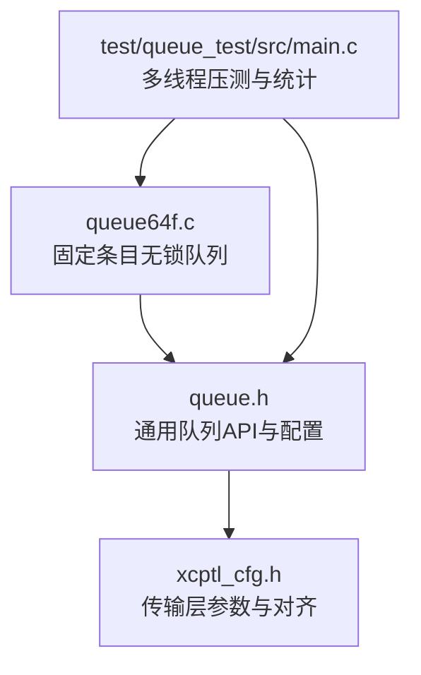
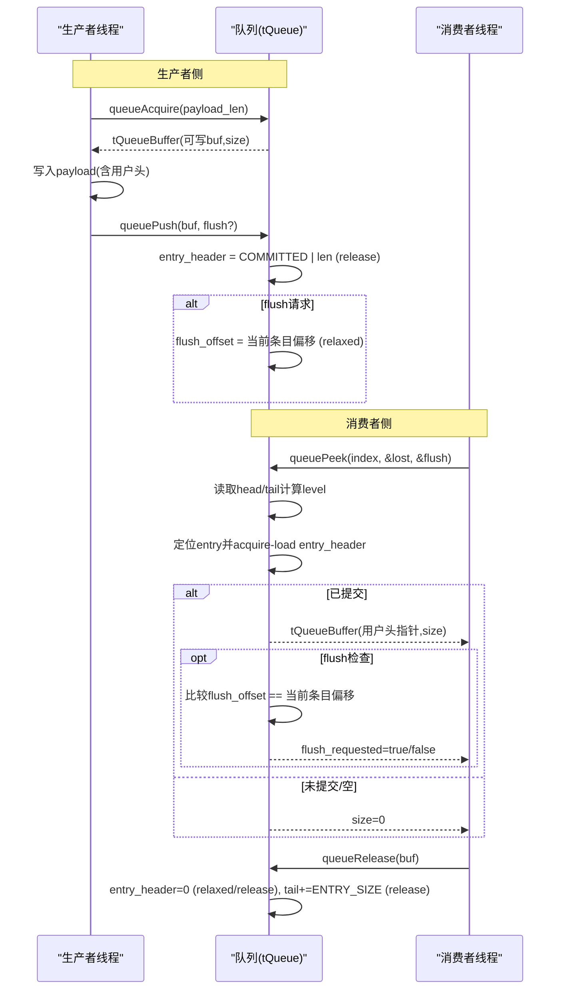
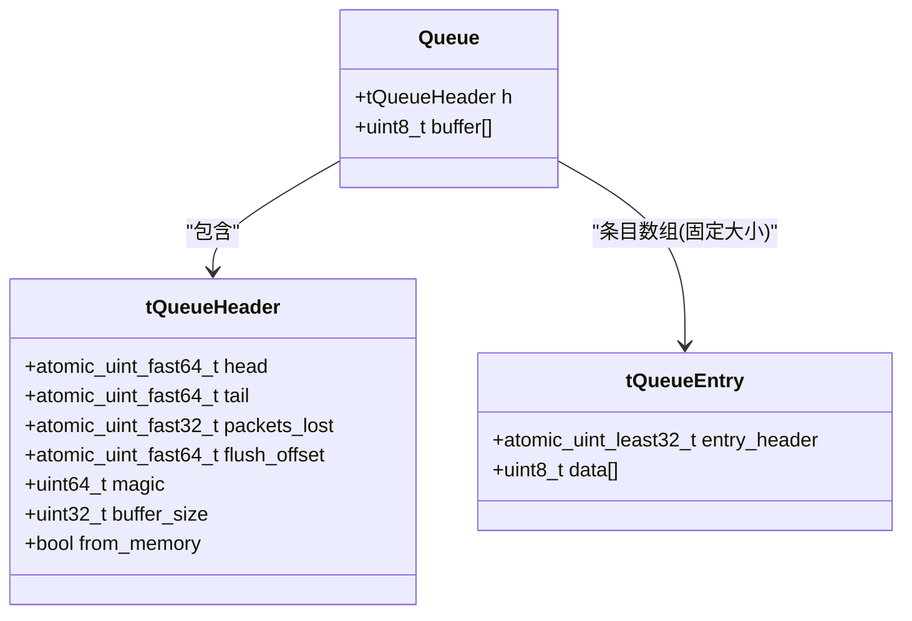
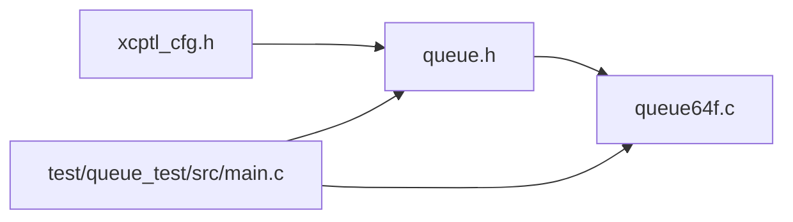

# 64位浮点数队列实现

<cite>
**本文引用的文件**
- [queue64f.c](file://src/queue64f.c)
- [queue.h](file://src/queue.h)
- [xcptl_cfg.h](file://src/xcptl_cfg.h)
- [main.c（队列测试）](file://test/queue_test/src/main.c)
</cite>

## 目录
1. [简介](#简介)
2. [项目结构](#项目结构)
3. [核心组件](#核心组件)
4. [架构总览](#架构总览)
5. [详细组件分析](#详细组件分析)
6. [依赖关系分析](#依赖关系分析)
7. [性能考量](#性能考量)
8. [故障排查指南](#故障排查指南)
9. [结论](#结论)
10. [附录：使用示例与最佳实践](#附录使用示例与最佳实践)

## 简介
本文件深入解析 src/queue64f.c 中“无锁固定大小64位浮点数队列”的实现细节。该队列面向多生产者、单消费者场景，采用固定条目大小的环形缓冲，通过原子操作与内存序保证跨线程可见性；在x86强内存模型和ARM弱内存模型下均能正确工作。文档重点说明：
- IEEE 754浮点数的特殊处理与精度保持策略（对齐、存储布局、避免不必要的转换）
- 无锁并发设计的核心原理（CAS、release/acquire语义、内存屏障的正确应用）
- 固定大小队列的优势（确定性内存、避免动态分配开销、缓存友好）
- 生产者-消费者模式在该实现中的体现（批量peek、flush提示、低抖动路径）
- 性能基准思路与对比建议（基于测试程序的可复现实验方法）
- 实际应用场景的代码示例与最佳实践

## 项目结构
- queue64f.c：固定条目大小、无锁队列的核心实现（多生产者、单消费者）
- queue.h：通用队列API定义与配置宏（包括XCP传输层头空间、对齐等）
- xcptl_cfg.h：传输层相关参数（最大DTO、段大小、对齐方式等），影响队列条目尺寸与对齐
- test/queue_test/src/main.c：多线程压测与统计，可用于验证队列行为与性能

图表来源
- [queue64f.c:250-295](file://src/queue64f.c#L250-L295)
- [queue.h:29-55](file://src/queue.h#L29-L55)
- [xcptl_cfg.h:44-92](file://src/xcptl_cfg.h#L44-L92)

章节来源
- [queue64f.c:1-137](file://src/queue64f.c#L1-L137)
- [queue.h:1-187](file://src/queue.h#L1-L187)
- [xcptl_cfg.h:1-143](file://src/xcptl_cfg.h#L1-L143)
- [main.c（队列测试）:40-120](file://test/queue_test/src/main.c#L40-L120)

## 核心组件
- 条目结构与状态机
  - 每个条目包含一个原子entry_header（32位）+ 用户数据区（含可选用户头）。entry_header高16位表示提交状态（初始为0或特定提交标记），低16位编码条目长度（字节）。
  - 固定条目大小使得所有entry_header位置固定，便于初始化与清理时仅对非原子区域使用memset，提升效率。
- 队列头部（tQueueHeader）
  - head/tail/packets_lost/flush_offset等共享状态，按缓存行对齐以减少伪共享。
  - buffer_size/from_memory/magic用于元数据校验与生命周期管理。
- 生产者接口
  - queueAcquire：以CAS自旋获取下一个可用条目并返回可写缓冲区指针与大小。
  - queuePush：写入完成后设置entry_header的提交状态与完整长度，使用release语义确保数据可见。
- 消费者接口
  - queuePeek：按索引查看条目，若已提交则返回用户头起始指针与长度；支持flush_requested检测。
  - queueRelease：释放条目，清除entry_header并提交tail更新，使生产者可复用该槽位。
- 统计与诊断
  - packets_lost计数器记录溢出次数；flush_offset用于提示消费者优先处理某条消息。

章节来源
- [queue64f.c:252-295](file://src/queue64f.c#L252-L295)
- [queue64f.c:399-519](file://src/queue64f.c#L399-L519)
- [queue64f.c:528-660](file://src/queue64f.c#L528-L660)

## 架构总览
下图展示了多生产者-单消费者的无锁队列交互流程，以及关键原子操作与内存序的使用点。

图表来源
- [queue64f.c:399-519](file://src/queue64f.c#L399-L519)
- [queue64f.c:557-660](file://src/queue64f.c#L557-L660)

## 详细组件分析

### 数据结构与内存布局
- 条目布局
  - 每个条目固定大小为 QUEUE_ENTRY_SIZE = QUEUE_ENTRY_USER_SIZE + 4（其中4字节为atomic_uint_least32_t entry_header）。
  - 用户数据区包含可选的用户头（由QUEUE_ENTRY_USER_HEADER_SIZE决定，通常对应XCP传输层头空间）与payload。
  - 条目按固定步长排列，entry_header天然位于每条目起始处，满足4字节对齐要求。
- 头部布局
  - tQueueHeader包含head/tail/packets_lost/flush_offset等共享字段，并以CACHE_LINE_SIZE填充对齐，减少伪共享。
  - 常量字段buffer_size/from_memory/magic用于运行时校验与资源管理。
- 对齐与缓存友好
  - 条目大小需为缓存行倍数（编译期断言），以提升批量访问时的缓存命中。
  - payload对齐要求来自XCPTL_PACKET_ALIGNMENT（通常为4），保证字访问对齐。

章节来源
- [queue64f.c:77-84](file://src/queue64f.c#L77-L84)
- [queue64f.c:121-131](file://src/queue64f.c#L121-L131)
- [queue64f.c:252-295](file://src/queue64f.c#L252-L295)
- [xcptl_cfg.h:86-92](file://src/xcptl_cfg.h#L86-L92)

### 无锁并发设计与内存序
- 生产者路径
  - queueAcquire：通过CAS递增head，失败则重试；成功后将entry_header设置为“保留态”的长度值（尚未提交）。
  - queuePush：写入完成后，以release语义写入entry_header的高位提交标志与完整长度，确保消费者能看到完整payload。
  - 可选flush：设置flush_offset（relaxed），消费者在peek时检查是否命中当前条目。
- 消费者路径
  - queuePeek：根据index计算tail位置，acquire-load entry_header判断是否已提交；若已提交，返回用户头指针与长度；同时检查flush_offset。
  - queueRelease：清除entry_header（relaxed或release），然后以release语义增加tail，使生产者可复用该槽位。
- 内存序选择
  - 默认模式下，tail作为容量元数据使用，采用relaxed加载/存储，不引入额外的acquire/release顺序；entry_header的提交与释放使用release/acquire以保证数据可见性。
  - 可选模式OPTION_QUEUE_64_FIX_SIZE_SYNC_TAIL：将tail的更新改为release，并在生产者端acquire-load tail，以改变同步边界（注释指出实测无明显差异）。

章节来源
- [queue64f.c:85-93](file://src/queue64f.c#L85-L93)
- [queue64f.c:430-519](file://src/queue64f.c#L430-L519)
- [queue64f.c:557-660](file://src/queue64f.c#L557-L660)

### IEEE 754浮点数处理与精度保持
- 直接透传策略
  - 队列不解析payload内容，仅维护长度与提交状态；因此IEEE 754双精度浮点数的原始比特序列被原样传递，不存在精度损失或格式转换。
- 对齐保障
  - payload对齐由XCPTL_PACKET_ALIGNMENT（通常为4）控制，entry_header为4字节原子类型，整体条目布局保证字访问对齐，避免未对齐访问导致的性能下降或异常。
- 缓存友好
  - 固定条目大小且按缓存行对齐，批量读写时减少缓存失效与伪共享。

章节来源
- [queue64f.c:252-265](file://src/queue64f.c#L252-L265)
- [xcptl_cfg.h:86-92](file://src/xcptl_cfg.h#L86-L92)
- [queue64f.c:121-131](file://src/queue64f.c#L121-L131)

### 固定大小队列的优势
- 确定性内存使用：队列缓冲一次性分配，无运行时动态分配开销，适合实时系统。
- 简化初始化与清理：entry_header位置固定，可使用memset快速清零非原子区域。
- 更好的缓存局部性：固定步长与对齐提高批量操作的缓存命中率。
- 明确的拥有权协议：entry_header作为发布对象，清晰表达“保留-提交-释放”的状态机。

章节来源
- [queue64f.c:16-43](file://src/queue64f.c#L16-L43)
- [queue64f.c:360-373](file://src/queue64f.c#L360-L373)

### 生产者-消费者模式的具体体现
- 批量操作优化
  - 消费者可通过queuePeek(index)进行前瞻读取，减少上下文切换与等待；结合flush_requested可优先处理高优先级消息。
- 低延迟路径
  - 生产者仅在提交时使用release语义；消费者在未提交时快速返回size=0，避免忙等开销。
- 溢出处理
  - 当队列为满时，生产者增加packets_lost计数并返回空缓冲区，消费者可据此调整消费速率或告警。

章节来源
- [queue64f.c:430-494](file://src/queue64f.c#L430-L494)
- [queue64f.c:557-642](file://src/queue64f.c#L557-L642)

### 类图（代码级）

图表来源
- [queue64f.c:252-295](file://src/queue64f.c#L252-L295)

## 依赖关系分析
- 配置依赖
  - queue.h从xcptl_cfg.h导入传输层头大小、最大DTO、对齐等参数，直接影响队列条目尺寸与布局。
- 平台与原子支持
  - queue64f.c要求64位POSIX平台且启用C11 atomics；Windows或模拟原子不支持该实现。
- 测试与基准
  - test/queue_test/src/main.c提供多线程压测、统计直方图与日志输出，可用于评估不同队列实现的吞吐与时延特性。

图表来源
- [queue.h:29-55](file://src/queue.h#L29-L55)
- [xcptl_cfg.h:44-92](file://src/xcptl_cfg.h#L44-L92)
- [queue64f.c:45-57](file://src/queue64f.c#L45-L57)
- [main.c（队列测试）:40-120](file://test/queue_test/src/main.c#L40-L120)

章节来源
- [queue.h:29-55](file://src/queue.h#L29-L55)
- [xcptl_cfg.h:44-92](file://src/xcptl_cfg.h#L44-L92)
- [queue64f.c:45-57](file://src/queue64f.c#L45-L57)
- [main.c（队列测试）:40-120](file://test/queue_test/src/main.c#L40-L120)

## 性能考量
- 缓存行对齐与伪共享规避
  - tQueueHeader按CACHE_LINE_SIZE对齐，减少多核间缓存行竞争。
- 原子操作与内存序
  - 默认模式下tail使用relaxed，降低同步成本；entry_header使用release/acquire保证数据可见性。
  - 可选模式OPTION_QUEUE_64_FIX_SIZE_SYNC_TAIL将tail更新改为release并在生产者端acquire-load tail，但注释表明实测无明显差异。
- 批量操作
  - 消费者通过queuePeek(index)进行前瞻读取，减少阻塞与上下文切换；flush_requested机制可优先处理关键消息。
- 溢出与背压
  - 生产者检测到溢出时增加packets_lost，消费者可据此调整消费速率或触发告警。
- 基准测试建议
  - 使用test/queue_test/src/main.c的多线程压测框架，开启TEST_ACQUIRE_LOCK_TIMING收集获取条目的耗时直方图；对比不同队列实现（如queue64v.c、queue32.c）在不同负载下的吞吐与时延。
  - 关注CLOCK_MONOTONIC_RAW与CLOCK_THREAD_CPUTIME_ID的差异，前者更适合短延迟测量且受调度影响较小。

章节来源
- [queue64f.c:77-93](file://src/queue64f.c#L77-L93)
- [queue64f.c:423-476](file://src/queue64f.c#L423-L476)
- [main.c（队列测试）:105-211](file://test/queue_test/src/main.c#L105-L211)

## 故障排查指南
- 常见错误与断言
  - 非法payload长度：queueAcquire会拒绝超出范围的大小并返回空缓冲区。
  - 不一致的entry_header状态：消费者在queuePeek中检查提交状态，若既非初始也非提交态，将触发错误日志与断言。
  - 对齐错误：编译期断言确保QUEUE_PAYLOAD_SIZE_ALIGNMENT为4的倍数且条目大小符合缓存行对齐。
- 溢出与丢包
  - 当队列为满时，生产者增加packets_lost；消费者通过queuePeek的packets_lost参数获取自上次调用以来的丢失计数。
- Flush请求
  - 生产者设置flush_offset后，消费者在queuePeek中检查是否命中当前条目；若命中则返回flush_requested=true。

章节来源
- [queue64f.c:404-411](file://src/queue64f.c#L404-L411)
- [queue64f.c:590-622](file://src/queue64f.c#L590-L622)
- [queue64f.c:630-638](file://src/queue64f.c#L630-L638)

## 结论
queue64f.c实现了高性能、确定性的固定大小无锁队列，适用于多生产者-单消费者场景。其设计要点包括：
- 固定条目布局与缓存行对齐，提升缓存局部性与批量操作效率
- 基于entry_header的发布-订阅协议，使用release/acquire保证数据可见性
- 灵活的flush机制与packets_lost统计，支持优先级与背压处理
- 对IEEE 754浮点数的透明传递，避免精度损失与额外开销

在实际应用中，建议结合test/queue_test/src/main.c进行压力测试与性能调优，并根据业务需求选择合适的队列实现与配置。

## 附录：使用示例与最佳实践
- 基本用法流程
  - 初始化：queueInit或queueInitFromMemory创建队列
  - 生产：queueAcquire获取缓冲区 -> 写入payload -> queuePush提交
  - 消费：queuePeek(index)读取 -> 必要时检查flush_requested -> queueRelease释放
- 最佳实践
  - 合理设置队列大小与条目大小，确保满足峰值负载并避免频繁溢出
  - 利用flush_requested机制对关键消息进行优先处理
  - 监控packets_lost与队列水位，及时调整生产/消费速率
  - 在实时系统中优先使用固定大小队列以获得确定性内存与延迟特性

章节来源
- [queue.h:101-182](file://src/queue.h#L101-L182)
- [queue64f.c:299-391](file://src/queue64f.c#L299-L391)
- [queue64f.c:399-660](file://src/queue64f.c#L399-L660)