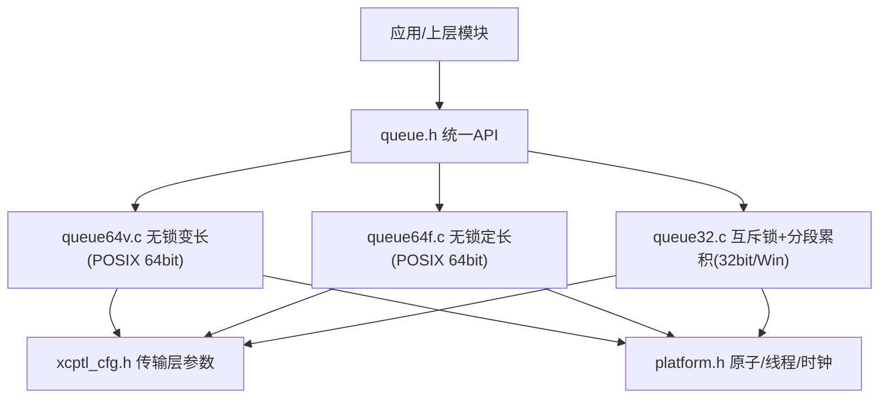
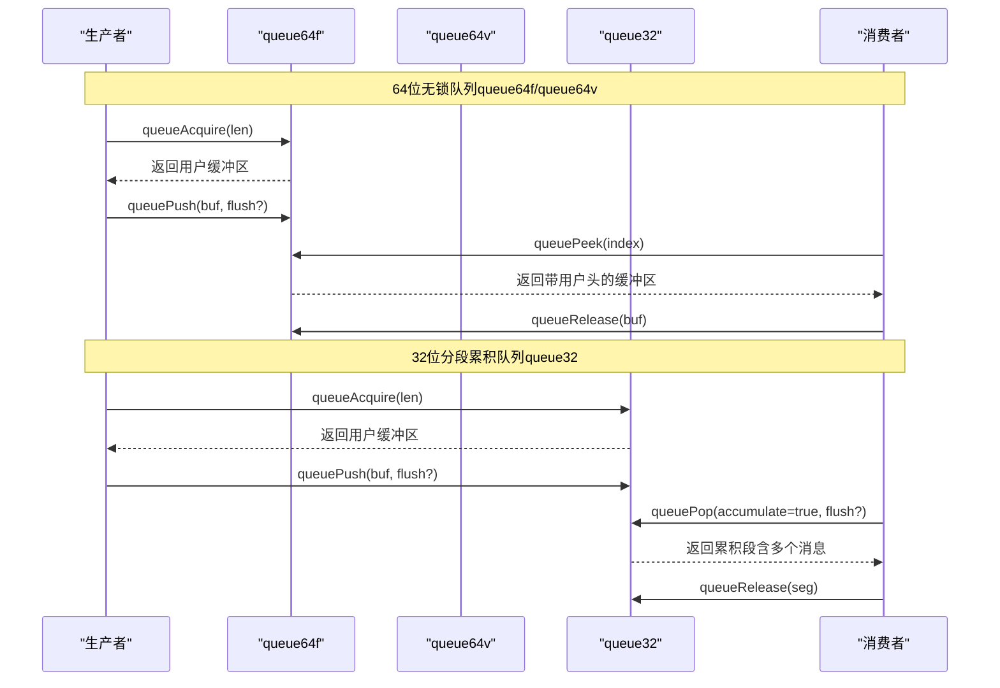
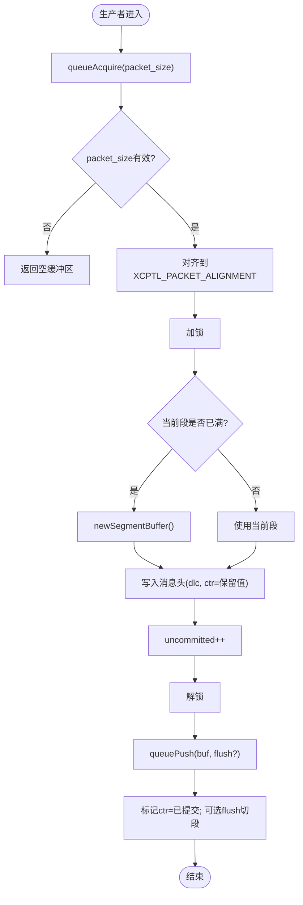
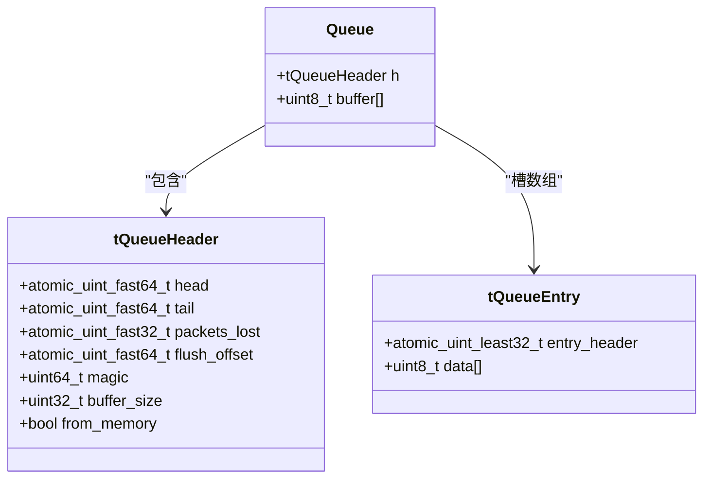
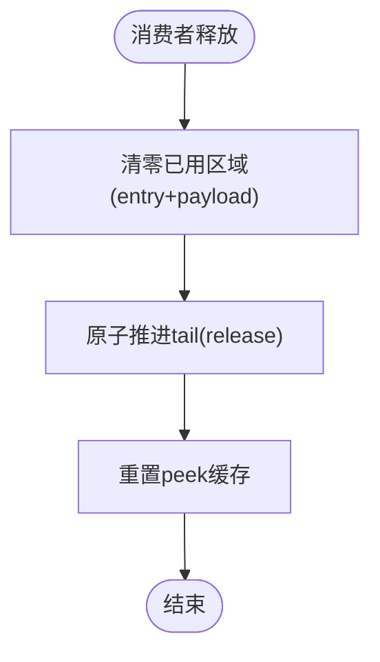
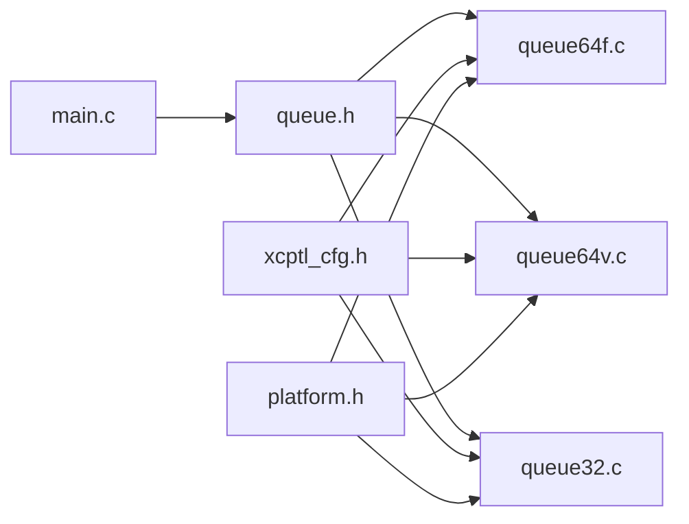

# 并发队列实现

<cite>
**本文引用的文件**
- [queue.h](file://src/queue.h)
- [queue32.c](file://src/queue32.c)
- [queue64f.c](file://src/queue64f.c)
- [queue64v.c](file://src/queue64v.c)
- [xcptl_cfg.h](file://src/xcptl_cfg.h)
- [platform.h](file://src/platform.h)
- [main.c](file://test/queue_test/src/main.c)
</cite>

## 目录
1. [简介](#简介)
2. [项目结构](#项目结构)
3. [核心组件](#核心组件)
4. [架构总览](#架构总览)
5. [详细组件分析](#详细组件分析)
6. [依赖关系分析](#依赖关系分析)
7. [性能考量](#性能考量)
8. [故障排查指南](#故障排查指南)
9. [结论](#结论)
10. [附录](#附录)

## 简介
本文件深入分析 XCPlite 中的多种并发队列实现，重点覆盖：
- queue32.c：32位平台/Windows下的多生产者单消费者（MPSC）队列，基于互斥锁与分段累积（segment accumulation），用于XCP传输层。
- queue64f.c：64位POSIX平台的无锁固定条目大小队列，使用原子头尾指针与每槽原子状态，强调内存序与缓存行对齐优化。
- queue64v.c：64位POSIX平台的无锁可变条目大小队列，通过消费者释放时清零已用区域以支持变长条目复用。
- 线程安全保证：读写操作的原子性、内存可见性与顺序语义。
- 容量管理、溢出处理与背压机制。
- 不同队列类型的吞吐、延迟与内存效率对比及选择建议。
- 在高并发数据采集场景中的选型与调优指导。

## 项目结构
XCPlite将队列抽象为统一API（queue.h），并根据平台与配置编译出不同实现：
- 通用无锁实现：queue64v.c（变长）、queue64f.c（定长）
- XCP特定实现：queue32.c（互斥锁+分段累积）
- 平台抽象：platform.h（原子、线程、时钟等）
- 传输层配置：xcptl_cfg.h（最大DTO、段大小、对齐、头部预留等）
- 测试程序：test/queue_test/src/main.c（多线程压测、peek/pop路径、统计直方图）

图表来源
- [queue.h:1-187](file://src/queue.h#L1-L187)
- [xcptl_cfg.h:1-143](file://src/xcptl_cfg.h#L1-L143)
- [platform.h:1-200](file://src/platform.h#L1-L200)

章节来源
- [queue.h:1-187](file://src/queue.h#L1-L187)
- [xcptl_cfg.h:1-143](file://src/xcptl_cfg.h#L1-L143)
- [platform.h:1-200](file://src/platform.h#L1-L200)

## 核心组件
- 统一队列API（queue.h）
  - 初始化/销毁：queueInit / queueDeinit / queueClear
  - 生产者：queueAcquire / queuePush
  - 消费者：queuePeek（64位无锁实现）/ queuePop（32位实现，支持分段累积）/ queueRelease
  - 查询：queueLevel
- 关键配置（xcptl_cfg.h）
  - 最大数据载荷：XCPTL_MAX_DTO_SIZE
  - 段大小：XCPTL_MAX_SEGMENT_SIZE
  - 包对齐：XCPTL_PACKET_ALIGNMENT
  - 传输层头部大小：XCPTL_TRANSPORT_LAYER_HEADER_SIZE
  - 发送头预留：XCPTL_TX_HEADROOM（仅对分段累积队列有意义）
- 平台能力（platform.h）
  - 原子类型、线程、时钟、互斥量等跨平台封装

章节来源
- [queue.h:29-83](file://src/queue.h#L29-L83)
- [xcptl_cfg.h:37-114](file://src/xcptl_cfg.h#L37-L114)
- [platform.h:23-200](file://src/platform.h#L23-L200)

## 架构总览
三种队列在“生产者-消费者”模型下工作，但同步策略与数据结构不同：
- queue32.c：使用互斥锁保护环形缓冲区；消息按段累积到UDP/以太网帧大小的缓冲区内，消费者批量弹出并设置传输层计数器。
- queue64f.c：无锁，固定条目大小；每个槽包含一个原子entry_header（状态+长度），生产者CAS推进head写入，消费者acquire-load entry_header读取数据后release重置并推进tail。
- queue64v.c：无锁，可变条目大小；消费者释放时将整块已用内存清零，使后续生产者可在任意对齐位置复用；通过tail的release/acquire发布清理结果。

图表来源
- [queue64f.c:399-519](file://src/queue64f.c#L399-L519)
- [queue64v.c:366-485](file://src/queue64v.c#L366-L485)
- [queue32.c:207-304](file://src/queue32.c#L207-L304)
- [queue32.c:333-417](file://src/queue32.c#L333-L417)

## 详细组件分析

### queue32.c：32位互斥锁队列与分段累积
- 设计要点
  - 多生产者、单消费者；使用互斥锁保护环形缓冲区。
  - 消息格式：每条消息携带传输层头部（WORD len + WORD ctr），段内可累积多条消息至最大段大小。
  - 段缓冲：tXcpSegmentBuffer维护未提交计数uncommitted与当前size，新段分配由newSegmentBuffer完成。
  - 对齐：按XCPTL_PACKET_ALIGNMENT对齐，确保消息头可按字访问。
- 关键流程
  - 生产者：queueAcquire获取用户缓冲区（预留头部空间），queuePush提交并可选flush触发新段。
  - 消费者：queuePop返回完整段，内部遍历消息并设置CTR；queueRelease推进读指针。
  - 溢出：当队列满时增加packets_lost计数，供消费者查询。
- 线程安全
  - 所有共享状态（rp、len、msg_ptr、packets_lost）受互斥锁保护。
  - 消费者侧非线程安全，需单线程调用。
- 内存与性能
  - 适合需要批量发送的场景（减少系统调用次数）。
  - 互斥锁带来一定开销，但在高负载下仍稳定可控。

图表来源
- [queue32.c:207-304](file://src/queue32.c#L207-L304)
- [queue32.c:104-126](file://src/queue32.c#L104-L126)

章节来源
- [queue32.c:57-100](file://src/queue32.c#L57-L100)
- [queue32.c:148-183](file://src/queue32.c#L148-L183)
- [queue32.c:207-304](file://src/queue32.c#L207-L304)
- [queue32.c:333-417](file://src/queue32.c#L333-L417)

### queue64f.c：64位无锁固定条目队列
- 设计要点
  - 固定条目大小：每个槽包含atomic_uint_least32_t entry_header（高位为提交状态，低位为长度），便于原子操作与缓存行对齐。
  - 头尾指针：head由生产者CAS推进，tail由消费者推进；默认tail使用relaxed语义以减少竞争线干扰。
  - 内存序：entry_header使用release-store发布数据，消费者acquire-load读取；释放时使用release-order更新tail。
- 关键流程
  - 生产者：queueAcquire尝试CAS head，若成功则写入entry_header（保留态），返回用户缓冲区；queuePush设置entry_header为已提交并写入长度。
  - 消费者：queuePeek按index读取entry_header，确认提交状态后返回用户头起始地址；queueRelease清零entry_header并推进tail。
  - 溢出：head超过可用范围时丢弃并递增packets_lost。
- 线程安全
  - 生产者侧无锁，依靠原子CAS与内存序保证一致性。
  - 消费者侧单线程，不与其他消费者竞争。
- 精度与浮点
  - 该队列是通用字节流队列，不改变数据内容；对于IEEE 754浮点数，保持原始比特表示，避免任何转换或截断。

图表来源
- [queue64f.c:252-294](file://src/queue64f.c#L252-L294)

章节来源
- [queue64f.c:252-294](file://src/queue64f.c#L252-L294)
- [queue64f.c:399-519](file://src/queue64f.c#L399-L519)
- [queue64f.c:557-660](file://src/queue64f.c#L557-L660)

### queue64v.c：64位无锁可变条目队列
- 设计要点
  - 可变条目：消费者释放时将整块已用内存清零，使得后续生产者可在任意对齐位置复用该区域。
  - 头尾指针：与queue64f类似，但tail的release/acquire用于发布清理后的内存可见性。
  - 对齐：要求QUEUE_PAYLOAD_SIZE_ALIGNMENT为4的倍数以满足entry_header原子对齐。
- 关键流程
  - 生产者：同queue64f，CAS head并写入entry_header（保留态），返回用户缓冲区；queuePush提交并设置长度。
  - 消费者：queuePeek循环查找已提交条目，支持缓存优化（cached_peek_index/tail）；queueRelease清零已用区域并推进tail。
  - 溢出：head超出可用范围时丢弃并递增packets_lost。
- 线程安全
  - 生产者侧无锁；消费者侧单线程。
  - 通过内存序保证清理后的内存对生产者可见。
- 注意
  - 由于消费者会写回已释放区域，存在额外缓存一致性流量；在大载荷高吞吐场景可与queue64f对比评估。

图表来源
- [queue64v.c:640-658](file://src/queue64v.c#L640-L658)

章节来源
- [queue64v.c:216-261](file://src/queue64v.c#L216-L261)
- [queue64v.c:366-485](file://src/queue64v.c#L366-L485)
- [queue64v.c:512-638](file://src/queue64v.c#L512-L638)
- [queue64v.c:640-658](file://src/queue64v.c#L640-L658)

### 线程安全与内存可见性
- queue32.c：互斥锁提供串行化访问，保证head/tail/段状态的一致性；消费者侧非线程安全。
- queue64f.c/queue64v.c：
  - 生产者：CAS head + release-store entry_header，确保数据写入对消费者可见。
  - 消费者：acquire-load entry_header读取数据；release-store推进tail并发布清理结果（queue64v）。
  - 内存序选择：默认tail使用relaxed以降低竞争线干扰；可通过OPTION_QUEUE_64_FIX_SIZE_SYNC_TAIL切换为更严格的tail同步（代码中注释说明无显著性能差异）。

章节来源
- [queue32.c:242-304](file://src/queue32.c#L242-L304)
- [queue64f.c:433-519](file://src/queue64f.c#L433-L519)
- [queue64f.c:557-660](file://src/queue64f.c#L557-L660)
- [queue64v.c:400-485](file://src/queue64v.c#L400-L485)
- [queue64v.c:512-658](file://src/queue64v.c#L512-L658)

### 容量管理、溢出与背压
- 容量计算
  - queue32.c：环形缓冲区大小为queue_size，按段计数；queueLevel返回段数。
  - queue64f.c/queue64v.c：buffer_size为数据区字节数，capacity按条目大小或字节差(head-tail)估算。
- 溢出处理
  - 三者均在生产者端检测溢出并递增packets_lost；消费者可通过queuePeek/queuePop参数获取丢失计数。
- 背压机制
  - 生产者检测到溢出后应降低生产速率或暂停（如测试中sleepUs），形成软件背压。
  - 32位队列支持flush选项，优先刷新尾部段，有助于降低端到端延迟。

章节来源
- [queue32.c:104-126](file://src/queue32.c#L104-L126)
- [queue32.c:242-304](file://src/queue32.c#L242-L304)
- [queue64f.c:433-494](file://src/queue64f.c#L433-L494)
- [queue64v.c:400-463](file://src/queue64v.c#L400-L463)
- [main.c:594-756](file://test/queue_test/src/main.c#L594-L756)

### SIMD与向量化
- 当前队列实现未显式使用SIMD指令进行数据搬运或处理；主要优化集中在：
  - 原子操作与内存序
  - 缓存行对齐（CACHE_LINE_SIZE）
  - 固定条目布局减少伪共享
- 若未来引入向量化，建议在数据拷贝/填充阶段结合编译器自动向量化或内联汇编，同时保持对齐约束。

章节来源
- [queue64f.c:77-93](file://src/queue64f.c#L77-L93)
- [queue64v.c:76-98](file://src/queue64v.c#L76-L98)

## 依赖关系分析
- queue.h定义统一接口与常量，被三个实现文件包含。
- xcptl_cfg.h提供传输层相关常量，影响队列条目大小、对齐与段大小。
- platform.h提供原子、线程、时钟等底层能力，被各实现引用。
- 测试程序main.c演示多线程生产者/消费者行为，验证队列功能与性能。

图表来源
- [queue.h:1-187](file://src/queue.h#L1-L187)
- [xcptl_cfg.h:1-143](file://src/xcptl_cfg.h#L1-L143)
- [platform.h:1-200](file://src/platform.h#L1-L200)
- [main.c:37-39](file://test/queue_test/src/main.c#L37-L39)

章节来源
- [queue.h:1-187](file://src/queue.h#L1-L187)
- [xcptl_cfg.h:1-143](file://src/xcptl_cfg.h#L1-L143)
- [platform.h:1-200](file://src/platform.h#L1-L200)
- [main.c:37-39](file://test/queue_test/src/main.c#L37-L39)

## 性能考量
- 吞吐量
  - queue64f/queue64v：无锁设计，生产者侧CAS竞争低，适合高吞吐场景。
  - queue32：互斥锁串行化，但支持段累积可减少系统调用，整体吞吐取决于累积效率。
- 延迟
  - queue64f/queue64v：固定/可变条目均支持peek，可实现零拷贝读取与快速路径。
  - queue32：flush选项可优先刷新尾部段，降低关键路径延迟。
- 内存效率
  - queue64f：固定条目减少碎片，易于对齐与缓存友好。
  - queue64v：可变条目灵活，但释放时需清零内存，可能引入额外写放大。
  - queue32：段内累积提高带宽利用率，但需预留段头空间（XCPTL_TX_HEADROOM）。
- 实测参考
  - 测试程序提供采集时间直方图与丢包统计，可用于定位热点与瓶颈。

[本节为一般性讨论，无需具体文件引用]

## 故障排查指南
- 常见错误
  - 非法packet_len：queueAcquire会拒绝无效长度并返回空缓冲区。
  - 不一致状态：queue64f/queue64v在queuePeek中检查entry_header状态，若发现非法值会触发assert。
  - 溢出：packets_lost计数非零时应检查消费者速率或调整队列容量。
- 调试手段
  - 启用调试打印（OPTION_ENABLE_DBG_PRINTS）观察关键路径。
  - 使用测试程序的锁时间直方图分析生产者竞争情况。
  - 检查对齐与头部预留是否符合配置（XCPTL_PACKET_ALIGNMENT、XCPTL_TX_HEADROOM）。

章节来源
- [queue64f.c:404-411](file://src/queue64f.c#L404-L411)
- [queue64f.c:593-622](file://src/queue64f.c#L593-L622)
- [queue64v.c:371-378](file://src/queue64v.c#L371-L378)
- [queue64v.c:565-607](file://src/queue64v.c#L565-L607)
- [main.c:594-756](file://test/queue_test/src/main.c#L594-L756)

## 结论
- 选择建议
  - 高吞吐、低延迟且数据大小固定：优先queue64f。
  - 数据大小变化大且希望灵活利用内存：考虑queue64v，但需评估清零开销。
  - 需要段累积以减少系统调用（如UDP/以太网帧）：选择queue32。
- 调优建议
  - 合理设置XCPTL_MAX_DTO_SIZE与XCPTL_MAX_SEGMENT_SIZE，匹配链路MTU与应用负载。
  - 调整队列容量与消费者速率，避免长期溢出。
  - 在64位无锁队列中，根据平台特性决定是否启用tail严格同步模式。
- 数据采集场景
  - 多生产者单消费者模型天然契合传感器/DAQ采集。
  - 结合peek路径可实现批处理与优先级调度（flush）。
  - 监控packets_lost与queueLevel，动态调整采样率或队列大小。

[本节为总结性内容，无需具体文件引用]

## 附录
- 关键配置速查
  - XCPTL_MAX_DTO_SIZE：最大数据载荷
  - XCPTL_MAX_SEGMENT_SIZE：最大段大小
  - XCPTL_PACKET_ALIGNMENT：包对齐粒度
  - XCPTL_TRANSPORT_LAYER_HEADER_SIZE：传输层头部大小
  - XCPTL_TX_HEADROOM：发送头预留（仅分段累积队列）
- 测试要点
  - 多线程生产者并发压测
  - peek/pop路径正确性校验
  - 锁时间直方图与丢包统计

章节来源
- [xcptl_cfg.h:37-114](file://src/xcptl_cfg.h#L37-L114)
- [main.c:47-98](file://test/queue_test/src/main.c#L47-L98)