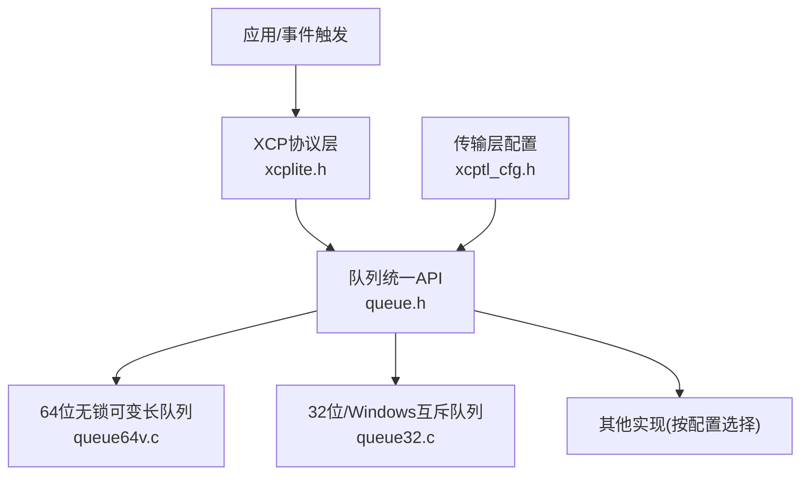
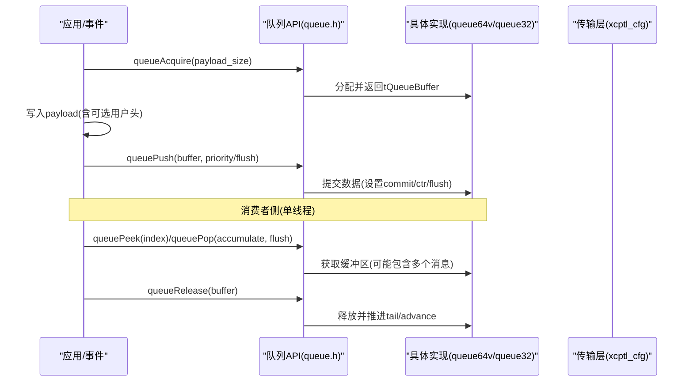
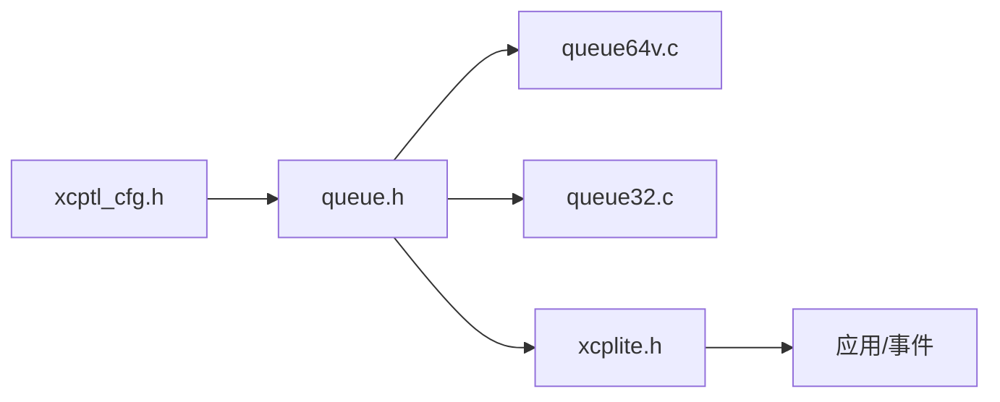

# 队列API设计与接口规范

<cite>
**本文引用的文件**
- [src/queue.h](file://src/queue.h)
- [src/queue64v.c](file://src/queue64v.c)
- [src/queue32.c](file://src/queue32.c)
- [src/xcptl_cfg.h](file://src/xcptl_cfg.h)
- [inc/xcplib.h](file://inc/xcplib.h)
- [src/xcplite.h](file://src/xcplite.h)
- [test/queue_test/src/main.c](file://test/queue_test/src/main.c)
</cite>

## 目录
1. [简介](#简介)
2. [项目结构](#项目结构)
3. [核心组件](#核心组件)
4. [架构总览](#架构总览)
5. [详细组件分析](#详细组件分析)
6. [依赖关系分析](#依赖关系分析)
7. [性能考量](#性能考量)
8. [故障排查指南](#故障排查指南)
9. [结论](#结论)
10. [附录：完整API使用示例与错误处理](#附录完整api使用示例与错误处理)

## 简介
本文件系统性阐述XCPlite队列系统的统一API设计理念与接口规范，重点覆盖：
- tQueueBuffer结构体设计及其handle字段在不同平台上的条件编译策略
- 队列生命周期管理API（从初始化到销毁）
- 生产者-消费者模式的抽象（queueAcquire、queuePush、queuePop/queuePeek、queueRelease）
- peek与pop的区别、适用场景与单消费者线程安全保证
- 容量管理与溢出处理（packets_lost参数）
- 优先级队列支持与priority参数的作用
- API兼容性与跨实现移植性考虑
- 完整的使用示例与异常处理建议

## 项目结构
XCPlite的队列子系统采用“统一头文件 + 多实现”的设计：
- 统一API定义在公共头文件中，屏蔽底层差异
- 针对不同平台与配置提供多种实现：
  - 64位无锁可变长队列（queue64v.c）
  - 32位/Windows/原子模拟下的互斥量队列（queue32.c）
  - 其他变体由构建选项选择
- 传输层配置集中管理（xcptl_cfg.h），为队列提供对齐、段大小、用户头空间等关键参数
- 上层协议层通过句柄抽象与队列交互（xcplite.h）

图表来源
- [src/queue.h:1-187](file://src/queue.h#L1-L187)
- [src/queue64v.c:1-120](file://src/queue64v.c#L1-L120)
- [src/queue32.c:1-120](file://src/queue32.c#L1-L120)
- [src/xcptl_cfg.h:86-114](file://src/xcptl_cfg.h#L86-L114)

章节来源
- [src/queue.h:1-187](file://src/queue.h#L1-L187)
- [src/xcptl_cfg.h:86-114](file://src/xcptl_cfg.h#L86-L114)

## 核心组件
- tQueueHandle：不透明队列句柄，用于支持多队列实例
- tQueueBuffer：生产者/消费者使用的缓冲描述符，包含buffer指针、size以及平台相关的handle
- 生命周期API：queueInit、queueInitFromMemory、queueDeinit、queueClear
- 生产API：queueAcquire、queuePush
- 消费API：queuePop（32位实现）、queuePeek（64位实现）、queueRelease
- 状态查询：queueLevel

章节来源
- [src/queue.h:88-187](file://src/queue.h#L88-L187)

## 架构总览
队列系统遵循“多生产者-单消费者”模型，不同实现以相同API暴露：
- 64位无锁实现：面向高性能场景，支持peek前向访问与缓存优化
- 32位/Windows实现：基于互斥量，支持消息累积成段（segment），便于网络发送
- 统一配置：通过对齐、最大段大小、用户头空间等参数确保跨实现一致性

图表来源
- [src/queue.h:122-176](file://src/queue.h#L122-L176)
- [src/queue64v.c:366-485](file://src/queue64v.c#L366-L485)
- [src/queue32.c:207-403](file://src/queue32.c#L207-L403)

## 详细组件分析

### tQueueBuffer结构与handle字段的条件编译
- buffer：指向消息负载的指针
- size：负载长度（字节）
- handle：平台相关句柄
  - 在32位平台、Windows或启用原子模拟时存在，用于32位实现中保存段缓冲引用
  - 在64位无锁实现中不存在，因为该实现不使用外部句柄来追踪段

设计考虑：
- 保持API一致性的同时，允许不同实现按需扩展内部状态
- 通过条件编译隐藏平台差异，避免在不需要的平台上引入多余字段

章节来源
- [src/queue.h:88-99](file://src/queue.h#L88-L99)
- [src/queue32.c:207-280](file://src/queue32.c#L207-L280)
- [src/queue64v.c:366-463](file://src/queue64v.c#L366-L463)

### 队列生命周期管理API
- queueInit：分配并初始化队列（内部分配内存）
- queueInitFromMemory：在用户提供的内存中初始化队列（支持共享内存场景）
- queueDeinit：销毁队列（若由库分配则释放内存；用户提供的内存不释放）
- queueClear：清空队列内容

流程要点：
- 初始化阶段会校验对齐、最大条目大小等约束
- 清理阶段重置头尾索引、丢包计数、刷新偏移等状态
- 支持从用户内存初始化，便于进程间通信或固定布局需求

章节来源
- [src/queue.h:101-120](file://src/queue.h#L101-L120)
- [src/queue64v.c:265-358](file://src/queue64v.c#L265-L358)
- [src/queue32.c:140-200](file://src/queue32.c#L140-L200)

### 生产者-消费者模式API抽象
- queueAcquire：申请一个可写的负载缓冲区，返回tQueueBuffer。此时数据尚未对消费者可见
- queuePush：提交已写数据，使消费者可见；可选择flush/priority以影响消费顺序或行为
- queuePop（32位实现）：获取下一个或累积的段（segment），返回连续内存中的多个消息
- queuePeek（64位实现）：按索引前向查看未提交的条目之前的已提交条目，支持多次调用同一索引但需按序释放
- queueRelease：释放由queuePeek或queuePop获得的缓冲区，通知队列可重用内存

语义与设计原则：
- 明确区分“申请-写入-提交-消费-释放”的阶段，避免竞态
- 64位实现强调零拷贝与无锁路径，32位实现强调段累积与网络发送友好
- 单消费者假设简化了并发模型，提升吞吐与确定性

章节来源
- [src/queue.h:122-176](file://src/queue.h#L122-L176)
- [src/queue64v.c:366-658](file://src/queue64v.c#L366-L658)
- [src/queue32.c:207-417](file://src/queue32.c#L207-L417)

### peek与pop的区别及单消费者安全保证
- queuePeek（64位实现）：
  - 支持按索引前向查看已提交条目，适合批量读取与流水线处理
  - 需要显式queueRelease释放，且必须按顺序释放
  - 单消费者线程安全；多线程不安全
- queuePop（32位实现）：
  - 返回累积的段（可能包含多条消息），适合直接发送到网络
  - 同样需要queueRelease释放
  - 单消费者线程安全；多线程不安全

安全保证：
- 所有消费API均假定单消费者线程，避免复杂同步开销
- 64位实现通过原子头尾与缓存优化保证高效与正确性
- 32位实现通过互斥量保护段队列，保证一致性

章节来源
- [src/queue.h:141-176](file://src/queue.h#L141-L176)
- [src/queue64v.c:512-658](file://src/queue64v.c#L512-L658)
- [src/queue32.c:333-417](file://src/queue32.c#L333-L417)

### 容量管理与溢出处理（packets_lost）
- 容量管理：
  - 64位实现：环形缓冲+原子head/tail，超出容量时拒绝新条目
  - 32位实现：段队列+当前段累积，超过段大小或队列满时拒绝
- packets_lost：
  - 64位实现：原子计数器，记录自上次查询以来的丢包数
  - 32位实现：每调用queuePop时返回并清零
- 适用场景：
  - 监控拥塞、调整采样率或丢弃策略
  - 统计与告警

章节来源
- [src/queue.h:141-182](file://src/queue.h#L141-L182)
- [src/queue64v.c:235-253](file://src/queue64v.c#L235-L253)
- [src/queue64v.c:446-455](file://src/queue64v.c#L446-L455)
- [src/queue32.c:96-100](file://src/queue32.c#L96-L100)
- [src/queue32.c:340-346](file://src/queue32.c#L340-L346)

### 优先级队列支持与priority参数
- queuePush的priority参数：
  - 64位实现：作为flush请求标志，指示优先刷新或排序
  - 32位实现：当flush为真时，强制开启新段，提高高优先级数据的及时发送
- 设计原则：
  - 不改变基本FIFO语义，但在必要时允许快速通道
  - 与传输层策略配合，实现低延迟路径

章节来源
- [src/queue.h:134-139](file://src/queue.h#L134-L139)
- [src/queue64v.c:465-485](file://src/queue64v.c#L465-L485)
- [src/queue32.c:283-304](file://src/queue32.c#L283-L304)

### 不同队列实现之间的API兼容性与移植性
- 统一API：
  - 所有实现均暴露相同的函数签名与语义
  - 通过配置宏选择具体实现（如OPTION_QUEUE_64_VAR_SIZE、OPTION_QUEUE_32）
- 移植性考虑：
  - 对齐要求（QUEUE_PAYLOAD_SIZE_ALIGNMENT）
  - 最大条目大小限制（QUEUE_MAX_ENTRY_SIZE）
  - 用户头空间（QUEUE_ENTRY_USER_HEADER_SIZE）
  - 段头空间（QUEUE_SEGMENT_HEADER_SIZE，仅32位实现有效）
- 配置一致性：
  - xcptl_cfg.h集中管理传输层参数，确保各实现一致

章节来源
- [src/queue.h:29-82](file://src/queue.h#L29-L82)
- [src/xcptl_cfg.h:86-114](file://src/xcptl_cfg.h#L86-L114)

## 依赖关系分析
- 队列API依赖传输层配置（xcptl_cfg.h）以获取对齐、段大小、用户头空间等
- 64位实现依赖原子操作与平台能力
- 32位实现依赖互斥量与消息累积逻辑
- 上层协议层通过句柄与队列交互，不感知具体实现

图表来源
- [src/xcptl_cfg.h:86-114](file://src/xcptl_cfg.h#L86-L114)
- [src/queue.h:29-82](file://src/queue.h#L29-L82)
- [src/xcplite.h:425-495](file://src/xcplite.h#L425-L495)

章节来源
- [src/xcptl_cfg.h:86-114](file://src/xcptl_cfg.h#L86-L114)
- [src/queue.h:29-82](file://src/queue.h#L29-L82)
- [src/xcplite.h:425-495](file://src/xcplite.h#L425-L495)

## 性能考量
- 64位无锁实现：
  - 无锁路径减少上下文切换与锁竞争
  - 支持peek缓存优化，提升批量读取效率
  - 注意中等/大数据量时的内存清理开销
- 32位互斥实现：
  - 段累积减少网络发送次数
  - 互斥量带来一定开销，但简化了累积逻辑
- 对齐与段大小：
  - 合理配置对齐与MTU，避免分片与填充带来的浪费
- 优先级与flush：
  - 合理使用priority/flush降低关键数据延迟

[本节提供通用指导，无需特定文件分析]

## 故障排查指南
- 常见错误：
  - 非法payload大小：queueAcquire返回size=0，检查是否超过最大限制
  - 队列满：packets_lost增加，需调整消费者速率或增大队列
  - 未释放缓冲区：导致内存泄漏或队列停滞，确保按序释放
- 调试建议：
  - 使用queueLevel监控队列占用
  - 启用日志级别观察关键路径
  - 在测试中使用queue_test进行压力与性能验证

章节来源
- [src/queue64v.c:366-463](file://src/queue64v.c#L366-L463)
- [src/queue32.c:207-280](file://src/queue32.c#L207-L280)
- [test/queue_test/src/main.c:559-757](file://test/queue_test/src/main.c#L559-L757)

## 结论
XCPlite队列系统通过统一API屏蔽平台差异，提供高性能、可扩展的生产者-消费者抽象。其设计兼顾了64位无锁的高吞吐与32位实现的段累积优势，并通过配置化参数确保跨实现一致性。正确使用packets_lost、priority与生命周期API，可在不同场景下获得稳定与高效的队列行为。

[本节总结性内容，无需特定文件分析]

## 附录：完整API使用示例与错误处理
以下示例展示典型使用流程与异常处理策略（以概念步骤为主，具体代码请参考测试用例）：

- 初始化与销毁
  - 使用queueInit创建队列，或使用queueInitFromMemory在共享内存中初始化
  - 结束时调用queueDeinit释放资源
- 生产者流程
  - 调用queueAcquire申请缓冲区，检查返回size是否满足需求
  - 写入payload（如需，先写入用户头空间）
  - 调用queuePush提交数据，必要时设置priority/flush
  - 若size=0，视为溢出，记录packets_lost并退避重试
- 消费者流程（64位）
  - 循环调用queuePeek(index)，直到返回size=0
  - 处理数据后，按序调用queueRelease释放
  - 使用packets_lost监控丢包
- 消费者流程（32位）
  - 调用queuePop获取段，遍历其中的消息
  - 处理完成后调用queueRelease释放段
  - 使用packets_lost监控丢包
- 错误处理
  - 检查queueAcquire返回值，处理溢出
  - 确保每次queuePeek/queuePop都有对应的queueRelease
  - 使用queueLevel监控队列状态，动态调整生产/消费速率

参考示例位置：
- 生产者-消费者主循环与统计输出
- 共享内存模式下的队列创建与附加
- 性能计时与直方图统计

章节来源
- [test/queue_test/src/main.c:559-800](file://test/queue_test/src/main.c#L559-L800)