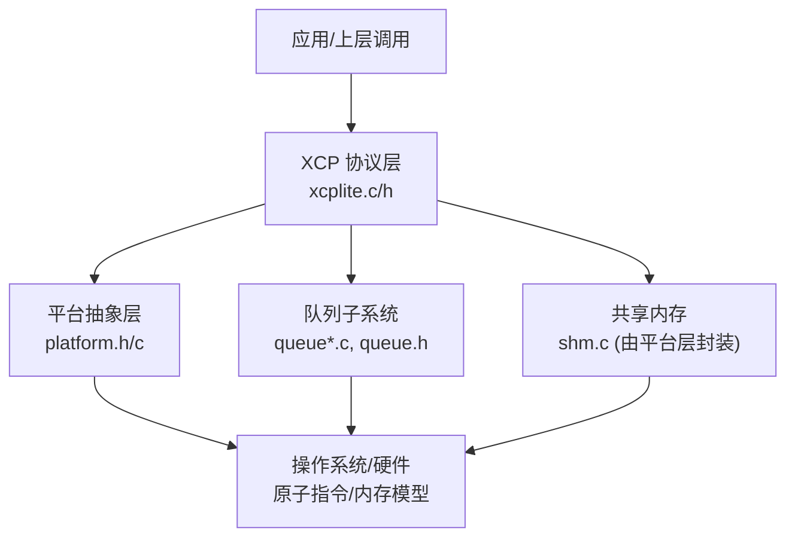
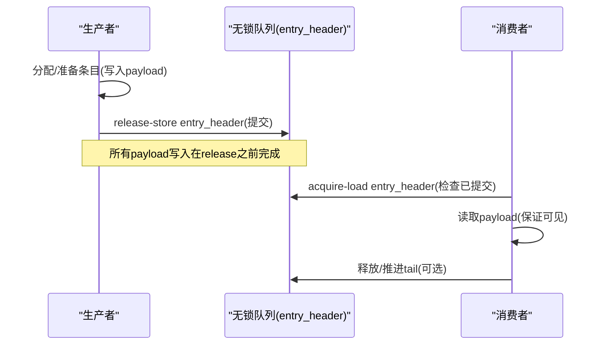
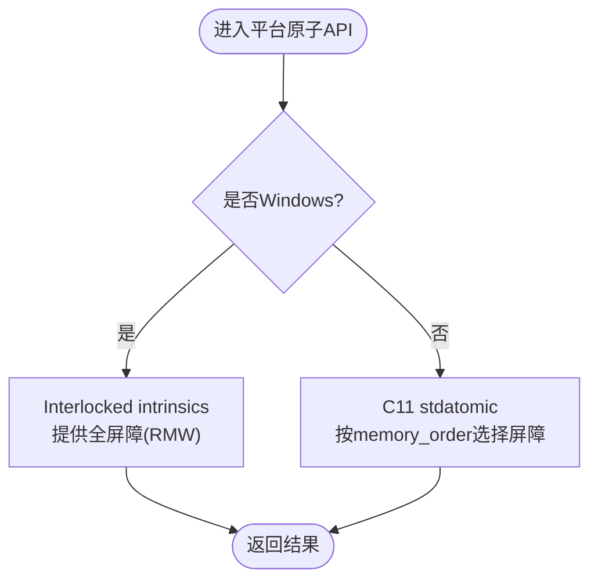
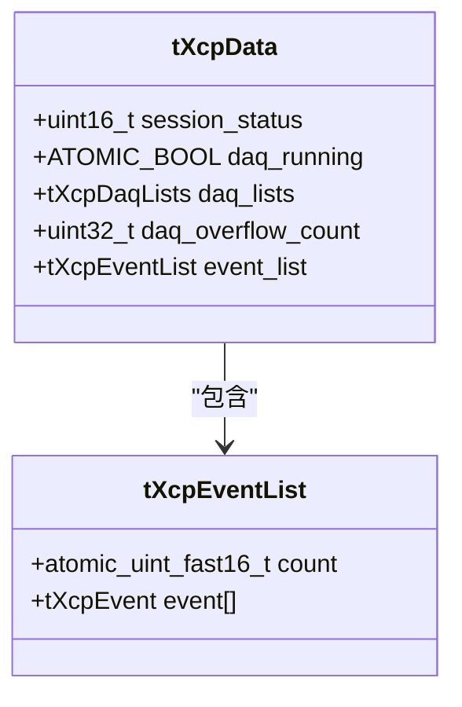
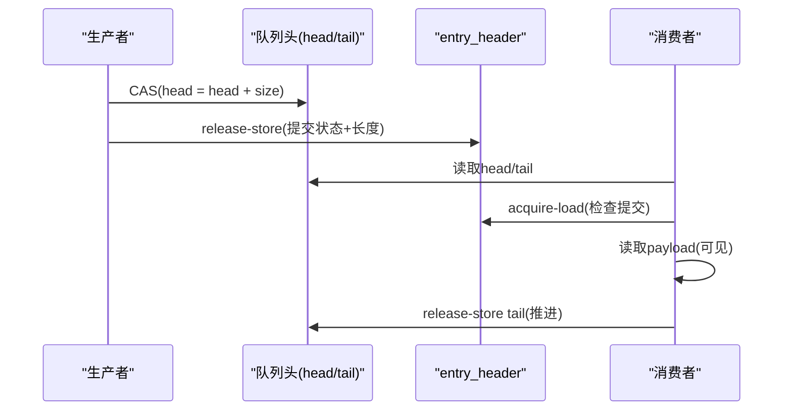
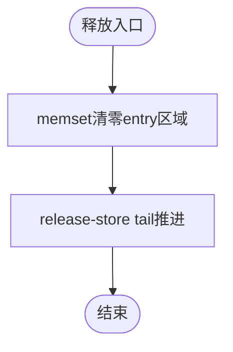
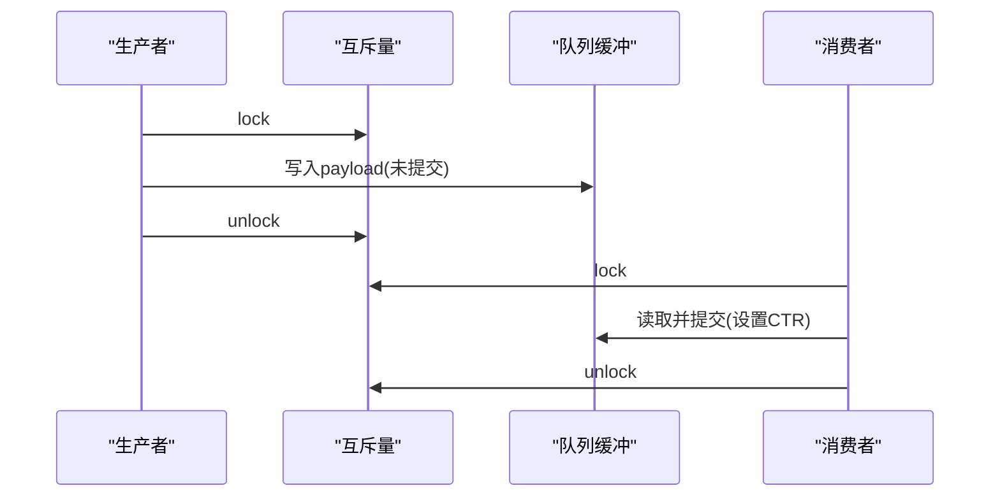
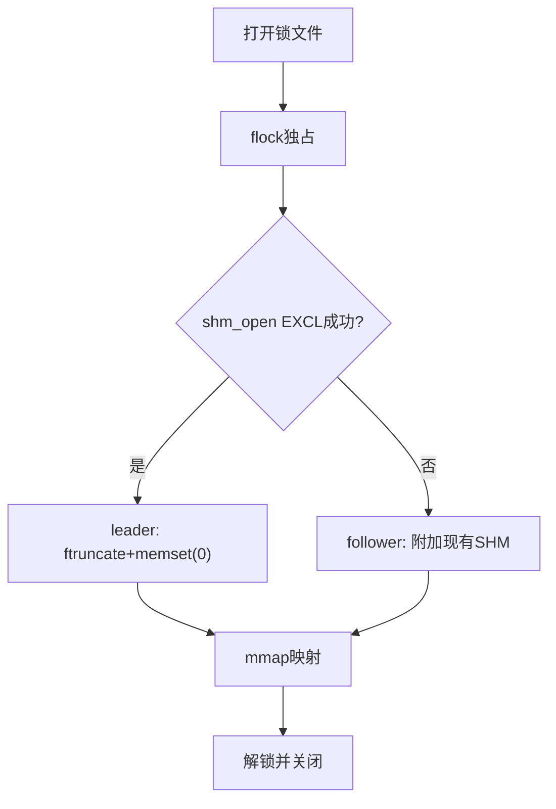
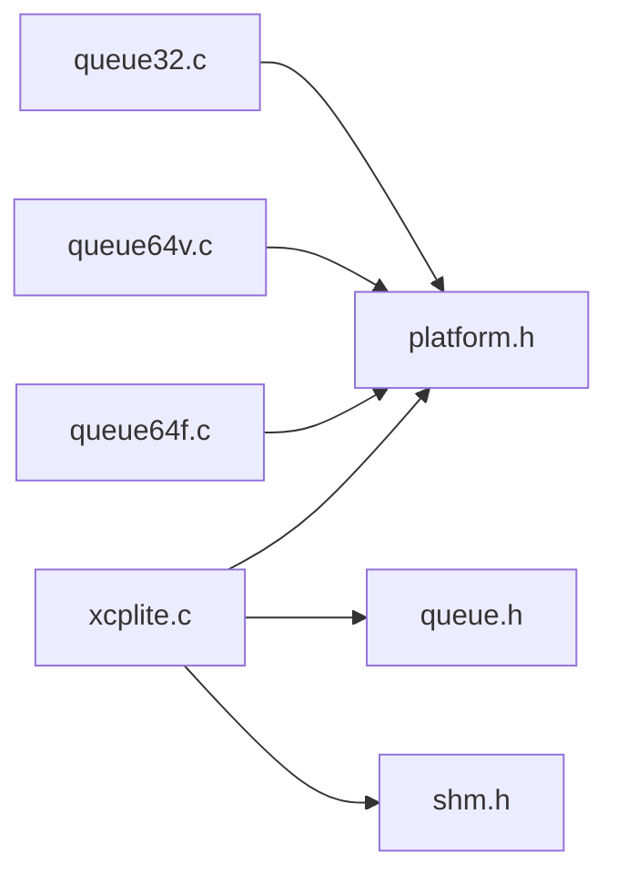

# 内存屏障与缓存一致性

<cite>
**本文引用的文件**
- [platform.h](file://src/platform.h)
- [platform.c](file://src/platform.c)
- [xcplite.h](file://src/xcplite.h)
- [xcplite.c](file://src/xcplite.c)
- [queue.h](file://src/queue.h)
- [queue32.c](file://src/queue32.c)
- [queue64f.c](file://src/queue64f.c)
- [queue64v.c](file://src/queue64v.c)
</cite>

## 目录
1. [简介](#简介)
2. [项目结构](#项目结构)
3. [核心组件](#核心组件)
4. [架构总览](#架构总览)
5. [详细组件分析](#详细组件分析)
6. [依赖关系分析](#依赖关系分析)
7. [性能考量](#性能考量)
8. [故障排查指南](#故障排查指南)
9. [结论](#结论)
10. [附录](#附录)

## 简介
本文件围绕 XCPlite 中的内存屏障与缓存一致性机制进行深入解析，重点覆盖：
- 不同处理器架构（x86、ARM、RISC-V）的内存模型差异及其对多线程程序的影响。
- volatile 关键字与原子操作的区别，以及何时需要显式内存屏障确保数据可见性。
- store-load、load-store、store-store 等内存序的实现原理与应用场景。
- 在时钟同步、队列操作和共享内存访问中的具体应用案例。
- 调试内存一致性问题方法与工具使用建议。

XCPlite 通过平台抽象层提供原子操作与同步原语，并在关键路径（事件列表、队列、共享状态）中使用 C11/C++ 原子与显式内存序，以在 x86（强内存模型）与 ARM/RISC-V（弱内存模型）上保持一致的正确性与可移植性。

## 项目结构
与内存屏障和缓存一致性直接相关的代码主要分布在以下模块：
- 平台抽象层：提供原子操作、线程、互斥量、时钟、共享内存等能力。
- XCP 协议层：维护跨进程/线程共享的状态（如 DAQ 运行标志、事件计数），并使用原子与内存序保证可见性。
- 队列子系统：提供多生产者单消费者（MPSC）无锁或基于锁的队列实现，使用 acquire/release 语义发布/消费条目。
- 共享内存：POSIX 共享内存的创建、映射与生命周期管理，配合 leader/follower 初始化顺序。

图表来源
- [xcplite.c:188-256](file://src/xcplite.c#L188-L256)
- [platform.h:177-197](file://src/platform.h#L177-L197)
- [queue64f.c:250-286](file://src/queue64f.c#L250-L286)
- [platform.c:201-319](file://src/platform.c#L201-L319)

章节来源
- [xcplite.c:188-256](file://src/xcplite.c#L188-L256)
- [platform.h:177-197](file://src/platform.h#L177-L197)
- [queue64f.c:250-286](file://src/queue64f.c#L250-L286)
- [platform.c:201-319](file://src/platform.c#L201-L319)

## 核心组件
- 平台抽象层（platform.h/.c）
  - 原子操作：在非 Windows 平台使用 C11 <stdatomic.h>；Windows 下通过 Interlocked intrinsics 模拟；FreeRTOS 目标避免 64 位 RMW 原子。
  - 线程与互斥：跨平台封装 pthread/Win32/FreeRTOS 互斥量。
  - 时钟：高精度单调/实时时钟，支持不同 epoch 配置。
  - 共享内存：POSIX shm_open/mmap 的 leader/follower 初始化流程。
- XCP 协议层（xcplite.h/.c）
  - 共享状态 tXcpData：包含 session_status、DAQ 列表、事件列表等，部分字段使用 ATOMIC_BOOL 与原子操作。
  - 事件列表计数：使用 memory_order_acquire/release 保证新事件可见性与发布顺序。
- 队列子系统（queue*.c）
  - 固定大小无锁队列（queue64f.c）：entry_header 作为发布对象，producer 用 release-store 提交，consumer 用 acquire-load 读取。
  - 可变大小无锁队列（queue64v.c）：释放时清零 entry 区域并通过 release-store tail 使清理可见。
  - 基于互斥量的队列（queue32.c）：用于 32 位/Windows/原子模拟场景，使用临界区保护。

章节来源
- [platform.h:177-197](file://src/platform.h#L177-L197)
- [platform.c:201-319](file://src/platform.c#L201-L319)
- [xcplite.h:385-423](file://src/xcplite.h#L385-L423)
- [xcplite.c:779-790](file://src/xcplite.c#L779-L790)
- [queue64f.c:250-286](file://src/queue64f.c#L250-L286)
- [queue64v.c:216-253](file://src/queue64v.c#L216-L253)
- [queue32.c:85-100](file://src/queue32.c#L85-L100)

## 架构总览
XCPlite 将“原子+内存序”作为跨平台并发基础，结合队列与共享内存，形成高吞吐、低延迟的数据通路。关键设计点：
- 使用 acquire/release 语义建立 happens-before 关系，确保写入数据在消费前完全可见。
- 在无锁队列中，entry_header 作为发布对象，避免对共享 tail/head 的过度同步开销。
- 在共享内存模式下，leader 负责零初始化并持有独占锁，follower 仅附加映射，避免竞态。

图表来源
- [queue64f.c:430-454](file://src/queue64f.c#L430-L454)
- [queue64f.c:590-617](file://src/queue64f.c#L590-L617)
- [queue64v.c:400-421](file://src/queue64v.c#L400-L421)
- [queue64v.c:561-565](file://src/queue64v.c#L561-L565)

## 详细组件分析

### 平台抽象层：原子与内存序
- 非 Windows 平台：使用 C11 stdatomic.h，暴露 atomic_load/store/exchange/fetch_add 等，支持 memory_order_relaxed/acquire/release/acq_rel。
- Windows 模拟：通过 Interlocked* 系列 intrinsic，注释指出这些操作提供完整内存屏障（RMW 操作）。
- FreeRTOS：避免 64 位 RMW 原子，使用 32 位类型与 CAS 循环，减少重入成本。

图表来源
- [platform.h:520-672](file://src/platform.h#L520-L672)
- [platform.h:177-197](file://src/platform.h#L177-L197)

章节来源
- [platform.h:177-197](file://src/platform.h#L177-L197)
- [platform.h:520-672](file://src/platform.h#L520-L672)

### XCP 协议层：共享状态与事件列表
- 共享状态 tXcpData：包含 session_status、daq_running、event_list.count 等，其中 daq_running 使用 ATOMIC_BOOL，事件计数使用原子与 acquire/release。
- 事件列表：getEventCount() 使用 relaxed 快速读；acquireEventCount()/releaseEventCount() 使用 acquire/release 保证新事件可见性与发布顺序。

图表来源
- [xcplite.h:385-423](file://src/xcplite.h#L385-L423)
- [xcplite.h:239-242](file://src/xcplite.h#L239-L242)

章节来源
- [xcplite.h:385-423](file://src/xcplite.h#L385-L423)
- [xcplite.c:779-790](file://src/xcplite.c#L779-L790)

### 无锁队列（固定大小）：queue64f.c
- 每个槽位包含一个原子 entry_header，编码“提交状态+长度”。
- 生产者：CAS 推进 head，写入 payload，最后 release-store entry_header 提交。
- 消费者：acquire-load entry_header，若已提交则读取 payload，随后 release 清理并推进 tail。

图表来源
- [queue64f.c:430-454](file://src/queue64f.c#L430-L454)
- [queue64f.c:590-617](file://src/queue64f.c#L590-L617)
- [queue64f.c:644-660](file://src/queue64f.c#L644-L660)

章节来源
- [queue64f.c:250-286](file://src/queue64f.c#L250-L286)
- [queue64f.c:430-454](file://src/queue64f.c#L430-L454)
- [queue64f.c:590-617](file://src/queue64f.c#L590-L617)
- [queue64f.c:644-660](file://src/queue64f.c#L644-L660)

### 无锁队列（可变大小）：queue64v.c
- 释放时 memset 清零整个 entry 区域，再通过 release-store tail 使清理可见，防止后续生产者读到残留数据。
- 消费者 acquire-load entry_header 判断提交状态，读取 payload。

图表来源
- [queue64v.c:640-654](file://src/queue64v.c#L640-L654)

章节来源
- [queue64v.c:216-253](file://src/queue64v.c#L216-L253)
- [queue64v.c:400-421](file://src/queue64v.c#L400-L421)
- [queue64v.c:561-565](file://src/queue64v.c#L561-L565)
- [queue64v.c:640-654](file://src/queue64v.c#L640-L654)

### 基于互斥量的队列：queue32.c
- 使用互斥量保护队列状态，适用于 32 位/Windows/原子模拟环境。
- 生产者获取缓冲区，标记未提交；消费者弹出后填充传输层计数器并发布。

图表来源
- [queue32.c:207-280](file://src/queue32.c#L207-L280)
- [queue32.c:333-403](file://src/queue32.c#L333-L403)

章节来源
- [queue32.c:85-100](file://src/queue32.c#L85-L100)
- [queue32.c:207-280](file://src/queue32.c#L207-L280)
- [queue32.c:333-403](file://src/queue32.c#L333-L403)

### 共享内存：platformShmOpen
- 使用 flock 序列化 leader 选举窗口，leader 创建并零初始化共享内存，follower 仅附加映射。
- 通过 fstat 校验尺寸，处理旧版本/崩溃恢复场景。

图表来源
- [platform.c:201-319](file://src/platform.c#L201-L319)

章节来源
- [platform.c:201-319](file://src/platform.c#L201-L319)

## 依赖关系分析
- xcplite.c 依赖 platform.h 提供的原子与线程原语，依赖 queue.h 定义的队列接口，依赖 shm.h（在 SHM 模式）进行共享内存管理。
- 队列实现依赖 platform.h 的原子与互斥量；无锁队列依赖 C11 原子与内存序。
- 平台层在不同 OS 上提供不同的时钟与共享内存实现，影响时间戳与跨进程可见性。

图表来源
- [xcplite.c:49-85](file://src/xcplite.c#L49-L85)
- [queue64f.c:45-59](file://src/queue64f.c#L45-L59)
- [queue64v.c:36-51](file://src/queue64v.c#L36-L51)
- [queue32.c:16-35](file://src/queue32.c#L16-L35)

章节来源
- [xcplite.c:49-85](file://src/xcplite.c#L49-L85)
- [queue64f.c:45-59](file://src/queue64f.c#L45-L59)
- [queue64v.c:36-51](file://src/queue64v.c#L36-L51)
- [queue32.c:16-35](file://src/queue32.c#L16-L35)

## 性能考量
- 无锁队列在高并发下显著降低锁开销；固定大小队列避免释放时的 memset 开销，适合大数据块高频场景。
- 可变大小队列在释放时清零内存，带来额外缓存一致性流量，但在中等吞吐场景可能更优。
- 使用 relaxed 原子读（如 getEventCount）减少不必要的同步，仅在必要时使用 acquire/release。
- 队列头尾指针与 entry_header 分离，减少竞争热点，提升可扩展性。

[本节为通用性能讨论，不直接分析具体文件]

## 故障排查指南
- 观察队列溢出：queue64f/v.c 在 acquire 失败时递增 packets_lost，可通过 queuePeek 参数获取丢失计数。
- 检查事件可见性：确保使用 acquireEventCount/releaseEventCount 而非 relaxed 读，避免新事件不可见。
- 共享内存初始化：确认 leader 已完成 memset(0)，follower 通过 fstat 校验尺寸，避免读取脏数据。
- 时钟同步：使用 monotonic 时钟避免 NTP/PTP 调整带来的跳变；在 RTOS 上使用更高精度回调注册。

章节来源
- [queue64f.c:478-487](file://src/queue64f.c#L478-L487)
- [queue64v.c:446-455](file://src/queue64v.c#L446-L455)
- [xcplite.c:779-790](file://src/xcplite.c#L779-L790)
- [platform.c:201-319](file://src/platform.c#L201-L319)
- [platform.c:455-654](file://src/platform.c#L455-L654)

## 结论
XCPlite 通过平台抽象层统一原子与同步原语，结合 acquire/release 语义与无锁队列设计，在 x86、ARM、RISC-V 等多架构上实现了可靠的缓存一致性与数据可见性保障。对于多线程与跨进程场景，应优先使用原子与内存序而非 volatile；在高性能路径中采用无锁队列与最小化同步点，同时保留必要的 acquire/release 边界以确保正确性。

[本节为总结性内容，不直接分析具体文件]

## 附录

### 内存模型差异与编译器优化
- x86：强内存模型，多数操作天然具备较强可见性，但仍需遵循 C11 内存序以避免编译器重排。
- ARM/RISC-V：弱内存模型，必须显式使用 acquire/release 或 acq_rel 来建立 happens-before 关系。
- 编译器优化：即使在不加锁的情况下，编译器也可能重排序读写；使用原子与内存序可抑制不当重排。

[本节为概念性说明，不直接分析具体文件]

### volatile 与原子操作
- volatile：仅阻止编译器对该变量的优化（如缓存到寄存器），不提供跨线程可见性或原子性。
- 原子操作：提供原子性与可选的内存序，确保跨线程/跨核的数据可见性与执行顺序。
- 何时使用内存屏障：当存在跨线程/跨核的数据共享且涉及写后读或读后写的顺序约束时，应使用 acquire/release 或 acq_rel。

[本节为概念性说明，不直接分析具体文件]

### 内存序应用场景
- store-store：确保写操作按序提交，常用于发布数据结构（如 entry_header 的 release-store）。
- load-load：确保读操作按序加载，常用于读取已发布的数据（如 consumer 的 acquire-load）。
- store-load：用于发布-订阅模式中的发布端，确保写后读的顺序（如某些 CAS 操作）。
- load-store：用于消费端，确保先读后写的顺序（如消费后推进 tail）。

[本节为概念性说明，不直接分析具体文件]

### 应用案例
- 时钟同步：使用 monotonic 时钟避免系统时间调整；在 RTOS 上注册高精度回调。
- 队列操作：无锁队列使用 entry_header 作为发布对象，避免锁开销；基于互斥量的队列用于兼容场景。
- 共享内存访问：leader 负责初始化并零填充，follower 仅附加映射，避免竞态。

章节来源
- [platform.c:455-654](file://src/platform.c#L455-L654)
- [queue64f.c:430-454](file://src/queue64f.c#L430-L454)
- [queue64v.c:400-421](file://src/queue64v.c#L400-L421)
- [platform.c:201-319](file://src/platform.c#L201-L319)

### 调试方法与工具
- 启用队列统计：通过 queuePeek 的 packets_lost 参数检测溢出。
- 日志级别：使用 DBG_LEVEL 控制输出，定位关键路径问题。
- 时钟统计：在 platform.c 中提供 clockGetPrintStatistic（条件编译），评估时钟调用分布。
- 工具链：结合 perf/valgrind/tsan 等工具分析内存访问与竞争。

章节来源
- [queue64f.c:557-568](file://src/queue64f.c#L557-L568)
- [queue64v.c:518-525](file://src/queue64v.c#L518-L525)
- [platform.c:445-453](file://src/platform.c#L445-L453)