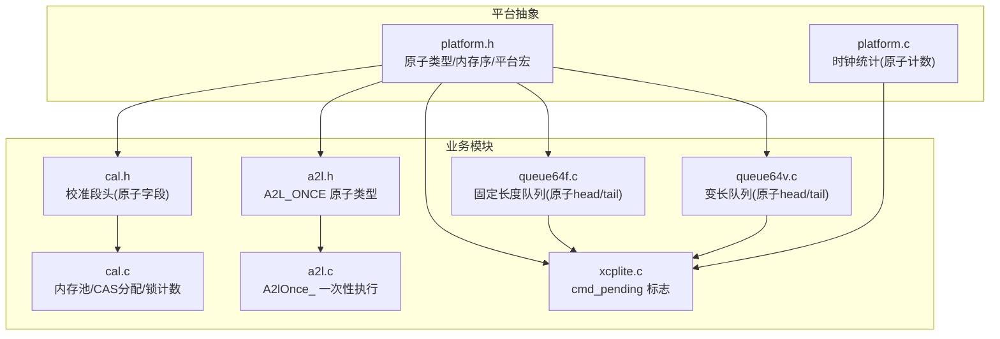
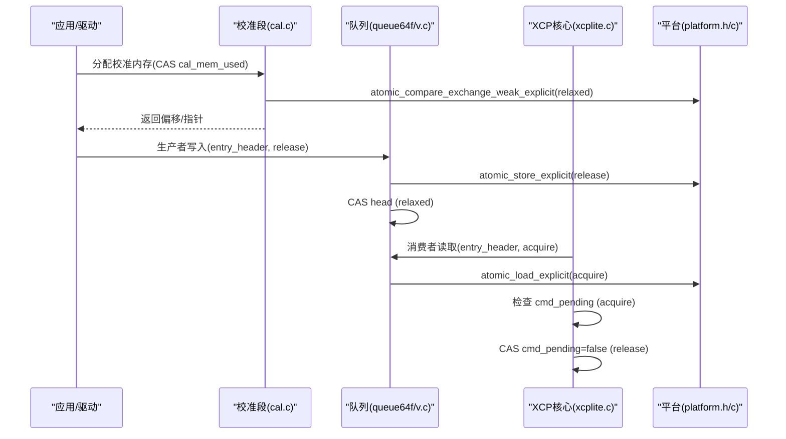
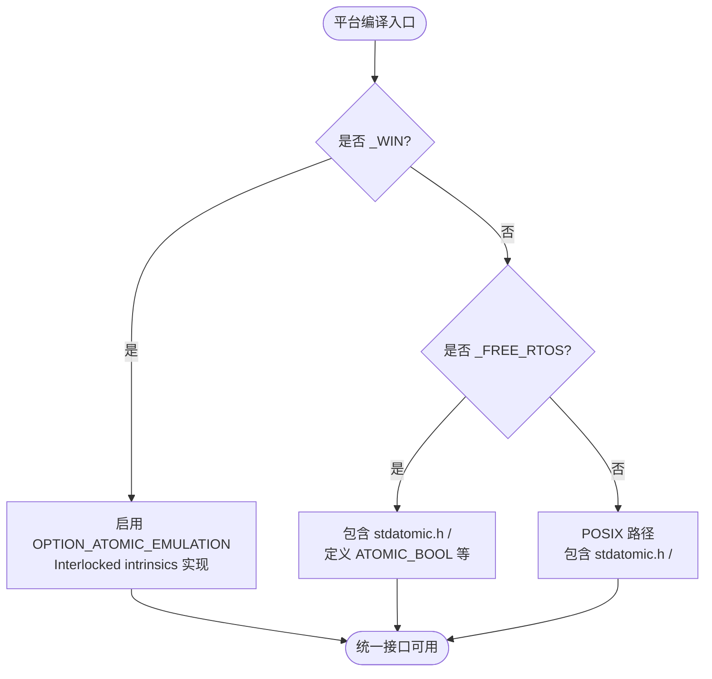
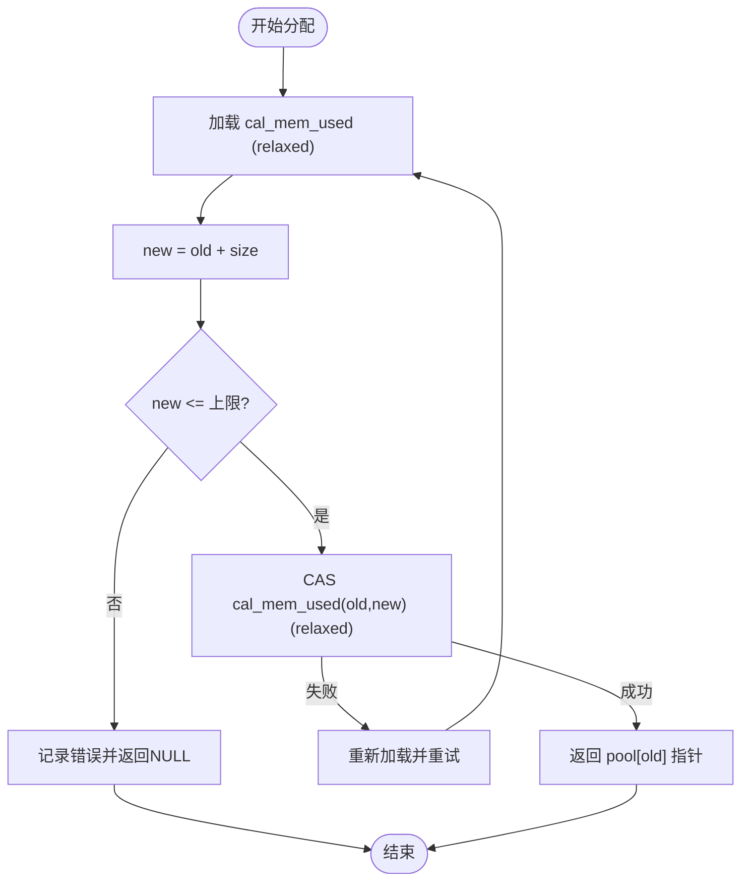
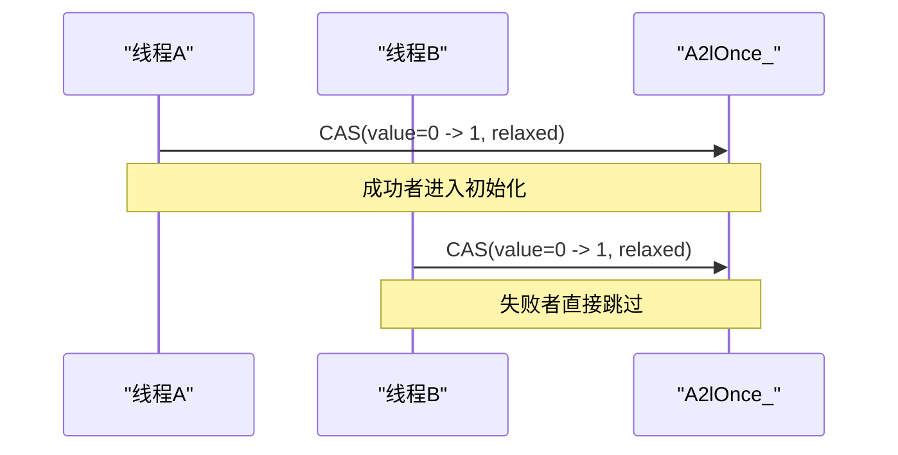
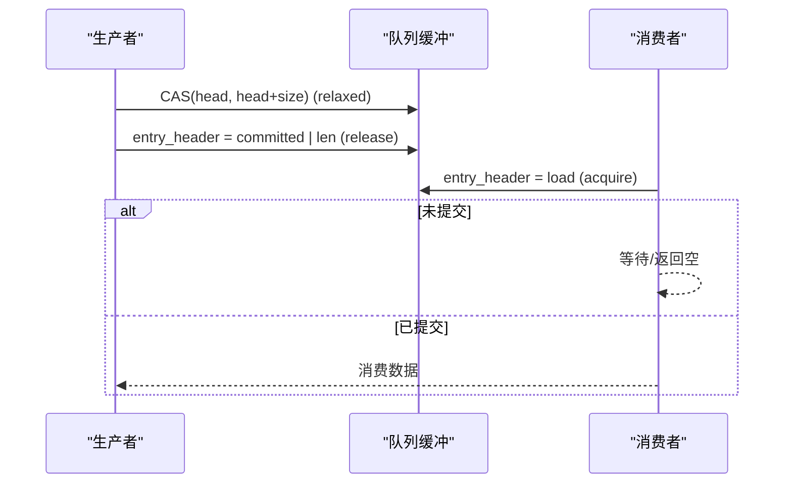
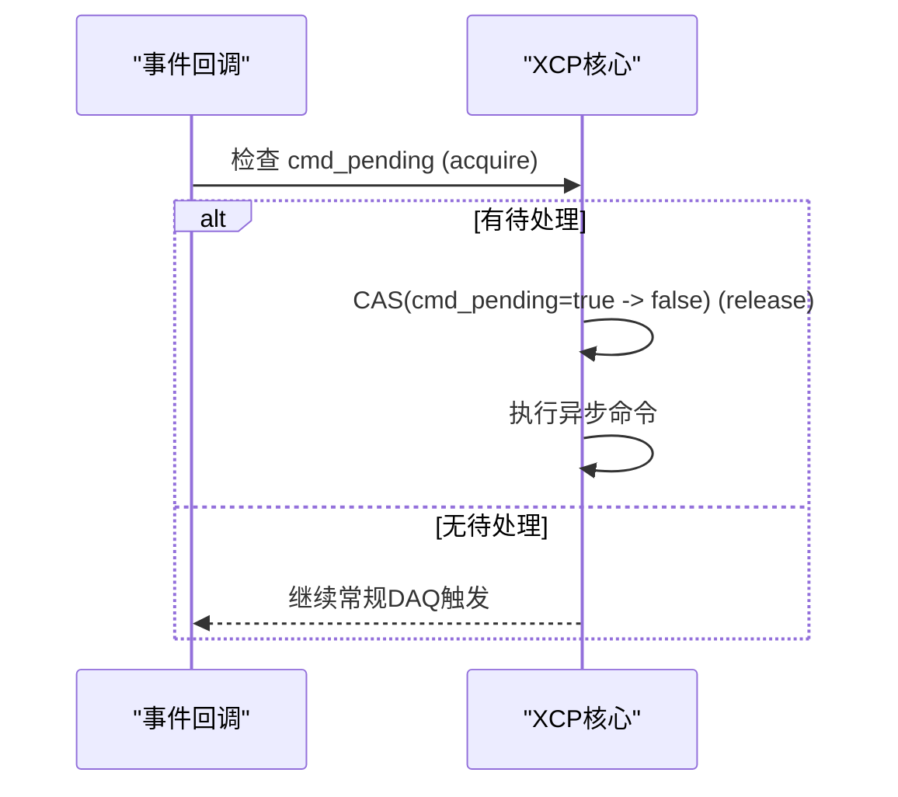
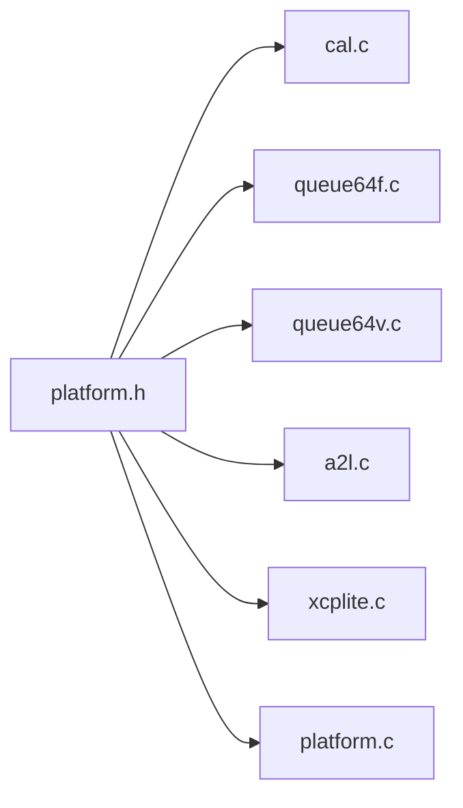

# 原子操作实现

<cite>
**本文引用的文件**
- [platform.h](file://src/platform.h)
- [cal.h](file://src/cal.h)
- [cal.c](file://src/cal.c)
- [a2l.h](file://inc/a2l.h)
- [a2l.c](file://src/a2l.c)
- [queue64f.c](file://src/queue64f.c)
- [queue64v.c](file://src/queue64v.c)
- [xcplite.c](file://src/xcplite.c)
- [platform.c](file://src/platform.c)
</cite>

## 目录
1. [简介](#简介)
2. [项目结构](#项目结构)
3. [核心组件](#核心组件)
4. [架构总览](#架构总览)
5. [详细组件分析](#详细组件分析)
6. [依赖关系分析](#依赖关系分析)
7. [性能考量](#性能考量)
8. [故障排查指南](#故障排查指南)
9. [结论](#结论)
10. [附录](#附录)

## 简介
本文件系统性梳理 XCPlite 中各类原子操作的底层实现机制，重点说明 C11 标准原子类型（如 atomic_uint_fast32_t、atomic_uint64_t 等）的使用方式与内存序选择策略。围绕计数器更新、状态标志位设置与跨线程数据同步三大场景，深入解析 memory_order_relaxed、memory_order_acquire、memory_order_release 的应用原则。同时对比 FreeRTOS、POSIX 与 Windows 平台下的原子适配差异，并给出在高并发环境下的最佳实践与性能建议，帮助开发者避免数据竞争与内存可见性问题。

## 项目结构
XCPlite 将原子能力抽象在平台层，并在多个子系统（校准段管理、A2L 生成、队列、XCP 事件处理、时钟统计）中复用。关键路径如下：
- 平台抽象层：统一暴露 C11 原子类型与内存序语义，提供 Windows 模拟实现与 POSIX/FreeRTOS 原生支持。
- 校准段模块：使用原子字段维护页指针、锁计数、内存池分配计数等。
- A2L 模块：使用“执行一次”模式确保初始化代码仅运行一次。
- 队列模块：无锁生产者-消费者队列，使用 CAS 推进 head/tail，配合 release/acquire 保证数据可见性。
- XCP 核心：使用原子标志协调异步命令与事件触发。
- 平台时钟：使用原子计数器进行调用统计。

**图示来源**
- [platform.h:114-197](file://src/platform.h#L114-L197)
- [cal.h:86-119](file://src/cal.h#L86-L119)
- [a2l.h:584-608](file://inc/a2l.h#L584-L608)
- [queue64f.c:447-459](file://src/queue64f.c#L447-L459)
- [queue64v.c:414-421](file://src/queue64v.c#L414-L421)
- [xcplite.c:1758-1770](file://src/xcplite.c#L1758-L1770)
- [platform.c:474-492](file://src/platform.c#L474-L492)

**章节来源**
- [platform.h:114-197](file://src/platform.h#L114-L197)
- [cal.h:86-119](file://src/cal.h#L86-L119)
- [a2l.h:584-608](file://inc/a2l.h#L584-L608)
- [queue64f.c:447-459](file://src/queue64f.c#L447-L459)
- [queue64v.c:414-421](file://src/queue64v.c#L414-L421)
- [xcplite.c:1758-1770](file://src/xcplite.c#L1758-L1770)
- [platform.c:474-492](file://src/platform.c#L474-L492)

## 核心组件
- 平台原子抽象：通过 platform.h 在不同平台上启用 C11 <stdatomic.h> 或提供 Windows 模拟实现，统一暴露 atomic_load/store/exchange/fetch_add/sub/CAS 及 memory_order_* 常量。
- 校准段原子字段：tXcpCalSegHeader 中的 ecu_page_next、free_page、ecu_access、lock_count 以及 tXcpCalSegList 中的 count、cal_mem_used 均使用原子类型，配合不同内存序完成页切换与内存池分配。
- A2L 一次性执行：A2L_ONCE_ATOMIC_TYPE 基于 atomic_uint_fast64_t，使用 CAS 保证多路并发下仅一个线程进入初始化块。
- 无锁队列：producer 使用 CAS 推进 head，commit 时使用 release store；consumer 使用 acquire load 读取 entry_header，确保数据可见性与顺序一致性。
- XCP 异步命令标志：cmd_pending 使用 acquire/release 语义协调事件上下文中的命令执行。
- 时钟统计：gClockGetCtr/gClockGetLastCtr 使用 relaxed 原子计数，用于性能观测，不要求严格顺序。

**章节来源**
- [platform.h:114-197](file://src/platform.h#L114-L197)
- [cal.h:86-119](file://src/cal.h#L86-L119)
- [a2l.h:584-608](file://inc/a2l.h#L584-L608)
- [queue64f.c:447-459](file://src/queue64f.c#L447-L459)
- [queue64v.c:414-421](file://src/queue64v.c#L414-L421)
- [xcplite.c:1758-1770](file://src/xcplite.c#L1758-L1770)
- [platform.c:474-492](file://src/platform.c#L474-L492)

## 架构总览
下图展示原子操作在各模块的协作关系与数据流：

**图示来源**
- [cal.c:107-116](file://src/cal.c#L107-L116)
- [queue64f.c:447-459](file://src/queue64f.c#L447-L459)
- [queue64v.c:414-421](file://src/queue64v.c#L414-L421)
- [xcplite.c:1758-1770](file://src/xcplite.c#L1758-L1770)
- [platform.h:114-197](file://src/platform.h#L114-L197)

## 详细组件分析

### 平台原子适配层（platform.h）
- 目标：为 C 与 C++ 提供统一的原子类型与内存序常量，屏蔽平台差异。
- 关键点：
  - 在 POSIX/FreeRTOS 路径包含 <stdatomic.h> 或 <atomic>，并将命名类型引入全局命名空间，便于 C 头在 C++ 编译时直接使用 atomic_uint_fast*_t 等。
  - 在 Windows 且开启 OPTION_ATOMIC_EMULATION 时，使用 MSVC Interlocked intrinsics 实现 load/store/exchange/fetch_add/sub/CAS，并提供按 sizeof 分派的内联函数以兼容任意宽度。
  - 注释明确 FreeRTOS 上 64 位原子在 32 位嵌入式目标上的限制与性能特征（RMW 可能退化为 CAS 循环）。

**图示来源**
- [platform.h:114-197](file://src/platform.h#L114-L197)
- [platform.h:520-672](file://src/platform.h#L520-L672)

**章节来源**
- [platform.h:114-197](file://src/platform.h#L114-L197)
- [platform.h:520-672](file://src/platform.h#L520-L672)

### 校准段原子字段与内存池分配（cal.h / cal.c）
- 数据结构：
  - tXcpCalSegHeader 包含原子字段：ecu_page_next、free_page、ecu_access、lock_count。
  - tXcpCalSegList 包含原子字段：offset[]、count、cal_mem_used。
- 内存池分配流程（bump allocator + CAS）：
  - 读当前已用大小（relaxed），计算新值，若溢出则报错。
  - 使用 weak CAS 尝试提交新值（relaxed），失败则重试。
  - 成功则返回对应偏移处的内存块。
- 页管理与锁计数：
  - lock_count 使用 fetch_add/fetch_sub（relaxed）进行增减。
  - 页指针读写根据场景选择 acquire/release 以保证可见性与顺序。

**图示来源**
- [cal.c:107-116](file://src/cal.c#L107-L116)
- [cal.h:86-119](file://src/cal.h#L86-L119)

**章节来源**
- [cal.h:86-119](file://src/cal.h#L86-L119)
- [cal.c:107-116](file://src/cal.c#L107-L116)
- [cal.c:185-193](file://src/cal.c#L185-L193)
- [cal.c:207-213](file://src/cal.c#L207-L213)
- [cal.c:641-685](file://src/cal.c#L641-L685)

### A2L 一次性执行（a2l.h / a2l.c）
- 设计要点：
  - 使用 A2L_ONCE_ATOMIC_TYPE（atomic_uint_fast64_t）作为静态标志。
  - A2lOnce_ 通过 strong CAS 将 0 置为 1，仅第一个进入的线程获得 true，其他线程直接跳过。
  - 该模式适用于 A2L 注册等只需执行一次的初始化逻辑，避免互斥开销。

**图示来源**
- [a2l.h:584-608](file://inc/a2l.h#L584-L608)
- [a2l.c:1439-1447](file://src/a2l.c#L1439-L1447)

**章节来源**
- [a2l.h:584-608](file://inc/a2l.h#L584-L608)
- [a2l.c:1439-1447](file://src/a2l.c#L1439-L1447)

### 无锁队列（queue64f.c / queue64v.c）
- 生产者：
  - 使用 CAS 推进 head（relaxed），成功后写入 entry_header（release store）以提交数据。
  - 溢出时递增 packets_lost（relaxed）。
- 消费者：
  - 读取 entry_header（acquire load）以确保看到完整的 payload。
  - 使用 tail/head 差值判断队列状态，peek 时缓存优化减少释放开销。
- 内存序策略：
  - 生产者 commit 使用 release，消费者读取使用 acquire，形成发布-订阅可见性边界。
  - 控制变量（head/tail/packets_lost）在无数据依赖处使用 relaxed，降低同步成本。

**图示来源**
- [queue64f.c:447-459](file://src/queue64f.c#L447-L459)
- [queue64f.c:557-639](file://src/queue64f.c#L557-L639)
- [queue64v.c:414-421](file://src/queue64v.c#L414-L421)
- [queue64v.c:512-609](file://src/queue64v.c#L512-L609)

**章节来源**
- [queue64f.c:447-459](file://src/queue64f.c#L447-L459)
- [queue64f.c:557-639](file://src/queue64f.c#L557-L639)
- [queue64v.c:414-421](file://src/queue64v.c#L414-L421)
- [queue64v.c:512-609](file://src/queue64v.c#L512-L609)

### XCP 异步命令标志（xcplite.c）
- 场景：事件回调中检查是否有待处理的动态地址命令。
- 策略：
  - 使用 acquire 读取 cmd_pending，若为真则在合适上下文中尝试 CAS 将其置 false（release），然后执行命令。
  - 该模式确保仅在单一线程内执行命令，避免重复执行与数据竞争。

**图示来源**
- [xcplite.c:1758-1770](file://src/xcplite.c#L1758-L1770)

**章节来源**
- [xcplite.c:1758-1770](file://src/xcplite.c#L1758-L1770)

### 平台时钟统计（platform.c）
- 目的：统计 clockGet/clockGetLast 调用次数，用于性能分析。
- 策略：使用 relaxed 原子计数，因为统计信息对顺序不敏感，仅需累加正确性。

**章节来源**
- [platform.c:474-492](file://src/platform.c#L474-L492)
- [platform.c:600-614](file://src/platform.c#L600-L614)

## 依赖关系分析
- 模块耦合：
  - cal.c 依赖 platform.h 提供的原子接口与内存序常量。
  - queue64f/v.c 依赖 platform.h 的原子原语，并通过 release/acquire 与消费者建立可见性边界。
  - a2l.c 依赖 platform.h 的原子类型与内存序，实现无锁的一次性执行。
  - xcplite.c 依赖 platform.h 的原子接口，协调事件与命令执行。
- 外部依赖：
  - POSIX/FreeRTOS：使用 C11 <stdatomic.h> 或 C++ <atomic>。
  - Windows：可选启用 OPTION_ATOMIC_EMULATION，使用 Interlocked intrinsics 实现等价功能。

**图示来源**
- [platform.h:114-197](file://src/platform.h#L114-L197)
- [cal.c:107-116](file://src/cal.c#L107-L116)
- [queue64f.c:447-459](file://src/queue64f.c#L447-L459)
- [queue64v.c:414-421](file://src/queue64v.c#L414-L421)
- [a2l.c:1439-1447](file://src/a2l.c#L1439-L1447)
- [xcplite.c:1758-1770](file://src/xcplite.c#L1758-L1770)
- [platform.c:474-492](file://src/platform.c#L474-L492)

**章节来源**
- [platform.h:114-197](file://src/platform.h#L114-L197)
- [cal.c:107-116](file://src/cal.c#L107-L116)
- [queue64f.c:447-459](file://src/queue64f.c#L447-L459)
- [queue64v.c:414-421](file://src/queue64v.c#L414-L421)
- [a2l.c:1439-1447](file://src/a2l.c#L1439-L1447)
- [xcplite.c:1758-1770](file://src/xcplite.c#L1758-L1770)
- [platform.c:474-492](file://src/platform.c#L474-L492)

## 性能考量
- 内存序选择原则：
  - relaxed：用于无数据依赖的计数器（如 cal_mem_used、packets_lost、clock 统计），最小化同步开销。
  - release/acquire：用于发布-订阅模型（队列 entry_header 的提交与读取），确保数据可见性与顺序。
  - acq_rel：用于需要同时具备获取与释放语义的操作（如 cmd_pending 的 CAS），保证读后写与写后读的可见性。
- 平台差异：
  - FreeRTOS 在 32 位嵌入式目标上，64 位 RMW 可能退化为 CAS 循环，需关注高争用下的重试成本。
  - Windows 模拟实现通过 Interlocked intrinsics 提供全内存屏障的 RMW，注意其开销高于轻量级 relaxed 操作。
- 队列优化：
  - 生产者使用 weak CAS 以减少失败分支开销；消费者缓存 peek 索引以降低释放频率。
  - 溢出计数使用 relaxed 原子，避免阻塞主路径。
- 最佳实践：
  - 优先使用 relaxed 原子进行纯计数；仅在存在数据依赖时使用 acquire/release。
  - 避免在热路径上使用强 CAS 或重内存序；必要时结合自旋与退避策略。
  - 在嵌入式目标上谨慎使用 64 位原子，评估对齐与硬件支持。

[本节为通用指导，不直接分析具体文件]

## 故障排查指南
- 常见问题定位：
  - 队列溢出：检查 packets_lost 计数与 head/tail 一致性，确认生产者是否及时 commit。
  - 数据不一致：确认 entry_header 的 release/acquire 配对是否正确，避免误用 relaxed 导致可见性问题。
  - 重复初始化：A2L 一次性执行失败通常由 CAS 条件不满足引起，检查标志变量初始值与作用域。
  - 命令重复执行：cmd_pending 的 CAS 失败表明已有线程在处理，检查事件上下文与调度时机。
- 调试建议：
  - 启用 TEST_CLOCK_GET_STATISTIC 观察高频调用路径。
  - 在队列路径添加日志输出 head/tail/entry_header 的值，辅助定位竞态。
  - 在 FreeRTOS 目标上评估 64 位原子性能，必要时改用 32 位原子或分段处理。

**章节来源**
- [queue64f.c:478-487](file://src/queue64f.c#L478-L487)
- [queue64v.c:446-456](file://src/queue64v.c#L446-L456)
- [a2l.c:1439-1447](file://src/a2l.c#L1439-L1447)
- [xcplite.c:1758-1770](file://src/xcplite.c#L1758-L1770)
- [platform.c:474-492](file://src/platform.c#L474-L492)

## 结论
XCPlite 通过平台抽象层统一了 C11 原子类型与内存序语义，并在校准段、A2L 生成、无锁队列与 XCP 事件处理等关键路径中合理运用 relaxed/acquire/release/acq_rel 等内存序，实现了高效且安全的并发控制。针对不同平台（FreeRTOS、POSIX、Windows）的差异，提供了原生与模拟两种实现，兼顾性能与可移植性。遵循本文的最佳实践，可在高并发环境下有效避免数据竞争与内存可见性问题，提升系统稳定性与吞吐。

[本节为总结性内容，不直接分析具体文件]

## 附录
- 术语对照：
  - 原子类型：atomic_uint_fast*_t、atomic_uint_least*_t
  - 内存序：relaxed、acquire、release、acq_rel
  - 操作：load、store、exchange、fetch_add、fetch_sub、compare_exchange
- 参考路径：
  - 平台原子抽象：[platform.h:114-197](file://src/platform.h#L114-L197)、[platform.h:520-672](file://src/platform.h#L520-L672)
  - 校准段原子字段：[cal.h:86-119](file://src/cal.h#L86-L119)
  - 内存池分配：[cal.c:107-116](file://src/cal.c#L107-L116)
  - A2L 一次性执行：[a2l.h:584-608](file://inc/a2l.h#L584-L608)、[a2l.c:1439-1447](file://src/a2l.c#L1439-L1447)
  - 无锁队列：[queue64f.c:447-459](file://src/queue64f.c#L447-L459)、[queue64v.c:414-421](file://src/queue64v.c#L414-L421)
  - XCP 命令标志：[xcplite.c:1758-1770](file://src/xcplite.c#L1758-L1770)
  - 时钟统计：[platform.c:474-492](file://src/platform.c#L474-L492)