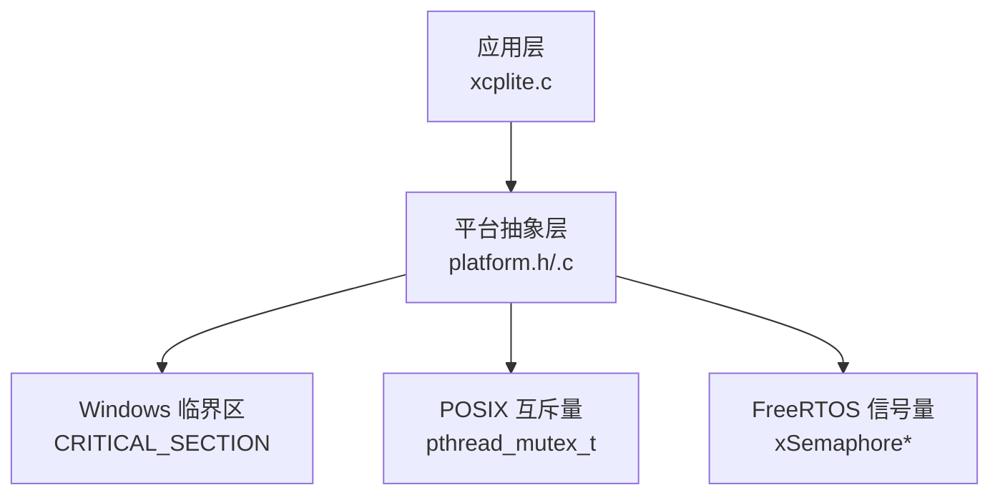
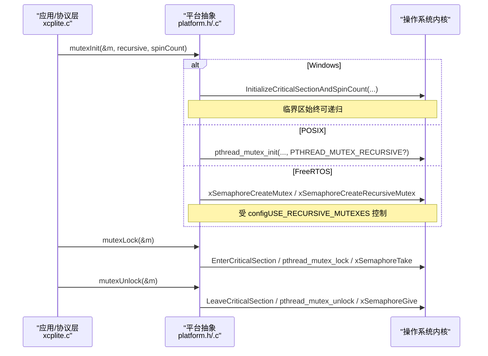
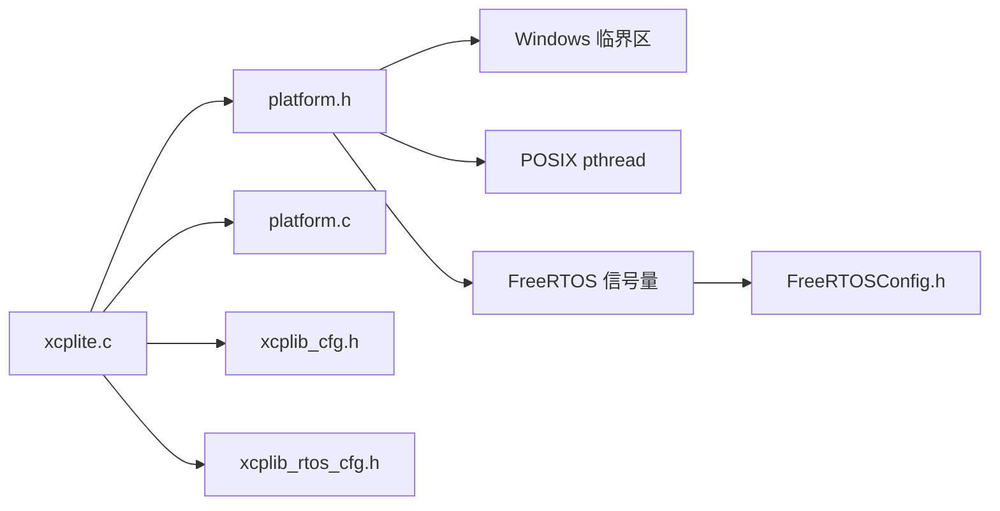

# 互斥锁与同步

<cite>
**本文引用的文件**
- [platform.h](file://src/platform.h)
- [platform.c](file://src/platform.c)
- [xcplite.h](file://src/xcplite.h)
- [xcplite.c](file://src/xcplite.c)
- [xcplib_cfg.h](file://src/xcplib_cfg.h)
- [xcplib_rtos_cfg.h](file://src/xcplib_rtos_cfg.h)
- [FreeRTOSConfig.h](file://examples/freertos_demo/freertos_emu_demo/FreeRTOSConfig.h)
</cite>

## 目录
1. [简介](#简介)
2. [项目结构](#项目结构)
3. [核心组件](#核心组件)
4. [架构总览](#架构总览)
5. [详细组件分析](#详细组件分析)
6. [依赖关系分析](#依赖关系分析)
7. [性能考量](#性能考量)
8. [故障排查指南](#故障排查指南)
9. [结论](#结论)
10. [附录](#附录)

## 简介
本章节聚焦 XCPlite 的互斥锁实现与同步机制，覆盖以下平台：
- Windows：临界区（CRITICAL_SECTION）
- POSIX（Linux/macOS/QNX）：pthread_mutex_t
- FreeRTOS：信号量（xSemaphoreCreateMutex / xSemaphoreCreateRecursiveMutex）

重点说明：
- 递归锁与非递归锁的支持方式
- configUSE_RECURSIVE_MUTEXES 配置的作用
- 自旋计数 spinCount 的作用与性能影响
- 静态初始化模式 MUTEX_INTIALIZER 的使用场景
- FreeRTOS 下静态分配模式的实现细节
- 死锁预防与调试技巧

## 项目结构
XCPlite 将平台相关的同步原语抽象在 platform.h/.c 中，上层通过统一的接口使用：
- 统一类型与宏：MUTEX、MUTEX_INTIALIZER、mutexLock、mutexUnlock
- 统一初始化/销毁：mutexInit、mutexDestroy
- 上层模块（如事件列表、校准段列表、队列等）通过上述接口进行线程安全保护

图表来源
- [platform.h:301-348](file://src/platform.h#L301-L348)
- [platform.c:366-432](file://src/platform.c#L366-L432)

章节来源
- [platform.h:301-348](file://src/platform.h#L301-L348)
- [platform.c:366-432](file://src/platform.c#L366-L432)

## 核心组件
- 平台抽象层（platform.h/.c）
  - 定义跨平台的 MUTEX 类型与操作宏
  - 提供 mutexInit/mutexDestroy 的统一实现
  - 根据编译期宏选择具体平台实现
- 上层同步点（xcplite.c 等）
  - 事件列表与校准段列表使用非递归互斥锁保护
  - 某些工具代码使用递归互斥锁保护实例状态

章节来源
- [xcplite.h:455-459](file://src/xcplite.h#L455-L459)
- [xcplite.c:792-797](file://src/xcplite.c#L792-L797)
- [cal.c:190-203](file://src/cal.c#L190-L203)

## 架构总览
下图展示了不同平台下的互斥锁封装与调用路径。

图表来源
- [platform.c:406-432](file://src/platform.c#L406-L432)
- [platform.c:370-394](file://src/platform.c#L370-L394)
- [platform.h:301-348](file://src/platform.h#L301-L348)

## 详细组件分析

### Windows 临界区（CRITICAL_SECTION）
- 类型与初始化
  - 类型映射为 CRITICAL_SECTION
  - 初始化使用 InitializeCriticalSectionAndSpinCount，支持 spinCount 参数
  - 临界区天然支持递归锁定
- 加解锁
  - 宏映射到 EnterCriticalSection / LeaveCriticalSection
- 特点
  - 适合用户态短临界区，低开销
  - 不支持跨进程共享
  - 自旋等待由内核调度器优化

章节来源
- [platform.h:303-309](file://src/platform.h#L303-L309)
- [platform.c:406-414](file://src/platform.c#L406-L414)

### POSIX pthread_mutex_t
- 类型与初始化
  - 类型映射为 pthread_mutex_t
  - 初始化时可选择 PTHREAD_MUTEX_RECURSIVE 以启用递归锁
  - 默认非递归
- 加解锁
  - 宏映射到 pthread_mutex_lock / pthread_mutex_unlock
- 特点
  - 标准、可移植
  - 递归锁需要显式设置属性
  - 阻塞型，适合一般同步需求

章节来源
- [platform.h:338-345](file://src/platform.h#L338-L345)
- [platform.c:416-432](file://src/platform.c#L416-L432)

### FreeRTOS 信号量
- 类型与初始化
  - 自定义 MUTEX 结构包含句柄、可选静态缓冲、以及递归标志位
  - 当 configUSE_RECURSIVE_MUTEXES == 1 时，根据 recursive 参数创建普通或递归信号量
  - 当 configUSE_RECURSIVE_MUTEXES == 0 时，禁止递归，强制断言失败
- 加解锁
  - 若启用递归，则使用 xSemaphoreTakeRecursive / xSemaphoreGiveRecursive
  - 否则使用 xSemaphoreTake / xSemaphoreGive
- 特点
  - 可在任务间/中断上下文中使用（取决于 API）
  - 支持动态与静态分配

章节来源
- [platform.h:310-336](file://src/platform.h#L310-L336)
- [platform.c:370-394](file://src/platform.c#L370-L394)

### 递归锁与非递归锁支持
- Windows：临界区始终递归，无需额外配置
- POSIX：通过 pthread_mutexattr_settype(PTHREAD_MUTEX_RECURSIVE) 启用递归
- FreeRTOS：
  - 由 configUSE_RECURSIVE_MUTEXES 控制是否允许递归
  - 若禁用，传入 recursive=true 会触发断言并返回

章节来源
- [platform.c:406-432](file://src/platform.c#L406-L432)
- [platform.c:370-394](file://src/platform.c#L370-L394)
- [FreeRTOSConfig.h:27-28](file://examples/freertos_demo/freertos_emu_demo/FreeRTOSConfig.h#L27-L28)

### configUSE_RECURSIVE_MUTEXES 配置选项的作用
- 作用范围：FreeRTOS 平台
- 行为：
  - 为 1：允许创建和使用递归互斥量；平台封装内部根据 recursive 参数选择 API
  - 为 0：禁止递归；若尝试创建递归锁，将断言失败
- 典型用途：
  - 避免复杂嵌套导致的死锁风险
  - 在资源受限环境下减少内存与复杂度

章节来源
- [platform.h:317-336](file://src/platform.h#L317-L336)
- [platform.c:370-394](file://src/platform.c#L370-L394)
- [FreeRTOSConfig.h:27-28](file://examples/freertos_demo/freertos_emu_demo/FreeRTOSConfig.h#L27-L28)

### 自旋锁（spinCount）参数的作用与性能影响
- Windows：
  - InitializeCriticalSectionAndSpinCount 接受 spinCount，表示在进入系统调用前尝试自旋的次数
  - 合理设置可减少上下文切换开销，但过高会增加 CPU 占用
- POSIX：
  - 当前封装未暴露自旋参数（pthread 无原生自旋互斥），spinCount 被忽略
- FreeRTOS：
  - 当前封装未使用自旋（直接阻塞等待），spinCount 被忽略
- 建议：
  - 短临界区且竞争不激烈时可适当提高 spinCount
  - 高竞争或长临界区应降低 spinCount，避免忙等浪费 CPU

章节来源
- [platform.c:406-414](file://src/platform.c#L406-L414)
- [platform.c:416-432](file://src/platform.c#L416-L432)
- [platform.c:370-394](file://src/platform.c#L370-L394)

### 静态初始化模式（MUTEX_INTIALIZER）的使用场景
- Windows：
  - 宏定义为 {0}，可用于静态变量初始化
- POSIX：
  - 宏定义为 PTHREAD_MUTEX_INITIALIZER，用于静态初始化互斥量
- FreeRTOS：
  - 宏定义为 {} 或 {NULL}，配合静态缓冲 StaticSemaphore_t buffer
  - 适用于需要在编译期确定对象布局的场景（例如全局/静态对象）

章节来源
- [platform.h:303-345](file://src/platform.h#L303-L345)

### FreeRTOS 下静态分配模式的实现细节
- 条件：configSUPPORT_STATIC_ALLOCATION == 1
- 行为：
  - MUTEX 结构体中包含 StaticSemaphore_t buffer
  - 初始化时使用 xSemaphoreCreateMutexStatic / xSemaphoreCreateRecursiveMutexStatic
  - 句柄写入 m->handle，后续加解锁通过该句柄操作
- 优点：
  - 避免运行时堆分配，提升确定性
  - 适合嵌入式环境对内存分配的严格限制

章节来源
- [platform.h:310-336](file://src/platform.h#L310-L336)
- [platform.c:370-394](file://src/platform.c#L370-L394)

### 上层同步点与使用示例
- 事件列表：
  - 使用非递归互斥锁 event_list_mutex 保护事件创建与访问
  - 初始化时指定 spinCount=1000（仅 Windows 有效）
- 校准段列表：
  - 使用非递归互斥锁 cal_seg_list_mutex 保护校准段管理
- 其他模块：
  - 队列、套接字、以太网传输层等也使用互斥锁保护关键区域

章节来源
- [xcplite.c:792-797](file://src/xcplite.c#L792-L797)
- [xcplite.c:940-969](file://src/xcplite.c#L940-L969)
- [cal.c:190-203](file://src/cal.c#L190-L203)
- [cal.c:401-419](file://src/cal.c#L401-L419)

## 依赖关系分析
- 平台抽象层依赖：
  - Windows：Windows SDK 临界区
  - POSIX：pthread 库
  - FreeRTOS：FreeRTOS 内核头与实现
- 上层模块依赖：
  - xcplite.c 依赖 platform 提供的互斥接口
  - 配置项（如 configUSE_RECURSIVE_MUTEXES）来自 FreeRTOSConfig.h
  - 构建配置（如 OPTION_*）来自 xcplib_cfg.h 及 RTOS 覆盖配置

图表来源
- [xcplite.c:792-797](file://src/xcplite.c#L792-L797)
- [platform.h:301-348](file://src/platform.h#L301-L348)
- [FreeRTOSConfig.h:27-28](file://examples/freertos_demo/freertos_emu_demo/FreeRTOSConfig.h#L27-L28)
- [xcplib_cfg.h:1-204](file://src/xcplib_cfg.h#L1-L204)
- [xcplib_rtos_cfg.h:1-142](file://src/xcplib_rtos_cfg.h#L1-L142)

章节来源
- [xcplite.c:792-797](file://src/xcplite.c#L792-L797)
- [platform.h:301-348](file://src/platform.h#L301-L348)
- [FreeRTOSConfig.h:27-28](file://examples/freertos_demo/freertos_emu_demo/FreeRTOSConfig.h#L27-L28)
- [xcplib_cfg.h:1-204](file://src/xcplib_cfg.h#L1-L204)
- [xcplib_rtos_cfg.h:1-142](file://src/xcplib_rtos_cfg.h#L1-L142)

## 性能考量
- 自旋 vs 阻塞
  - Windows 临界区的 spinCount 可调节忙等次数，短临界区可降低切换开销
  - POSIX/FreeRTOS 封装采用阻塞等待，避免忙等导致 CPU 浪费
- 递归锁成本
  - 递归锁需要维护持有计数与所有权信息，略有额外开销
  - 仅在确实存在嵌套访问时使用
- 静态分配优势
  - FreeRTOS 静态分配避免运行时堆分配，提升实时性与确定性
- 锁粒度
  - 尽量缩小临界区范围，减少锁持有时间
  - 避免在锁内执行耗时操作（如 I/O、网络收发）

[本节为通用指导，不直接分析具体文件]

## 故障排查指南
- 常见错误
  - FreeRTOS 下启用递归锁但配置未开启：会触发断言失败
  - 未正确初始化互斥量即加锁：可能导致未定义行为
  - 锁顺序不一致：可能引发死锁
- 诊断方法
  - 启用调试日志（OPTION_ENABLE_DBG_PRINTS）
  - 使用断言与测试宏（如 TEST_MUTABLE_ACCESS_OWNERSHIP）辅助定位
  - 检查各模块初始化顺序与销毁顺序
- 修复建议
  - 确保所有互斥量在使用前已正确初始化
  - 统一锁获取顺序，避免循环等待
  - 对于 FreeRTOS，确认 configUSE_RECURSIVE_MUTEXES 与实际使用一致

章节来源
- [platform.c:370-394](file://src/platform.c#L370-L394)
- [xcplib_cfg.h:44-53](file://src/xcplib_cfg.h#L44-L53)

## 结论
XCPlite 通过 platform.h/.c 提供了跨平台的互斥锁抽象，屏蔽了 Windows 临界区、POSIX pthread_mutex_t 与 FreeRTOS 信号量的差异。其设计要点包括：
- 统一接口与宏，简化上层使用
- 支持递归与非递归锁，并通过配置项控制行为
- 提供静态初始化与静态分配能力，适配嵌入式环境
- 通过合理的锁粒度与自旋策略平衡性能与资源占用

在实际工程中，应根据平台特性与应用场景选择合适的锁类型与配置，并遵循良好的同步实践以避免死锁与性能问题。

[本节为总结性内容，不直接分析具体文件]

## 附录
- 配置项参考
  - configUSE_RECURSIVE_MUTEXES：FreeRTOS 递归锁开关
  - configSUPPORT_STATIC_ALLOCATION：FreeRTOS 静态分配开关
  - OPTION_*：构建期功能开关（如队列、时钟分辨率等）

章节来源
- [FreeRTOSConfig.h:27-28](file://examples/freertos_demo/freertos_emu_demo/FreeRTOSConfig.h#L27-L28)
- [xcplib_cfg.h:58-71](file://src/xcplib_cfg.h#L58-L71)
- [xcplib_rtos_cfg.h:65-78](file://src/xcplib_rtos_cfg.h#L65-L78)