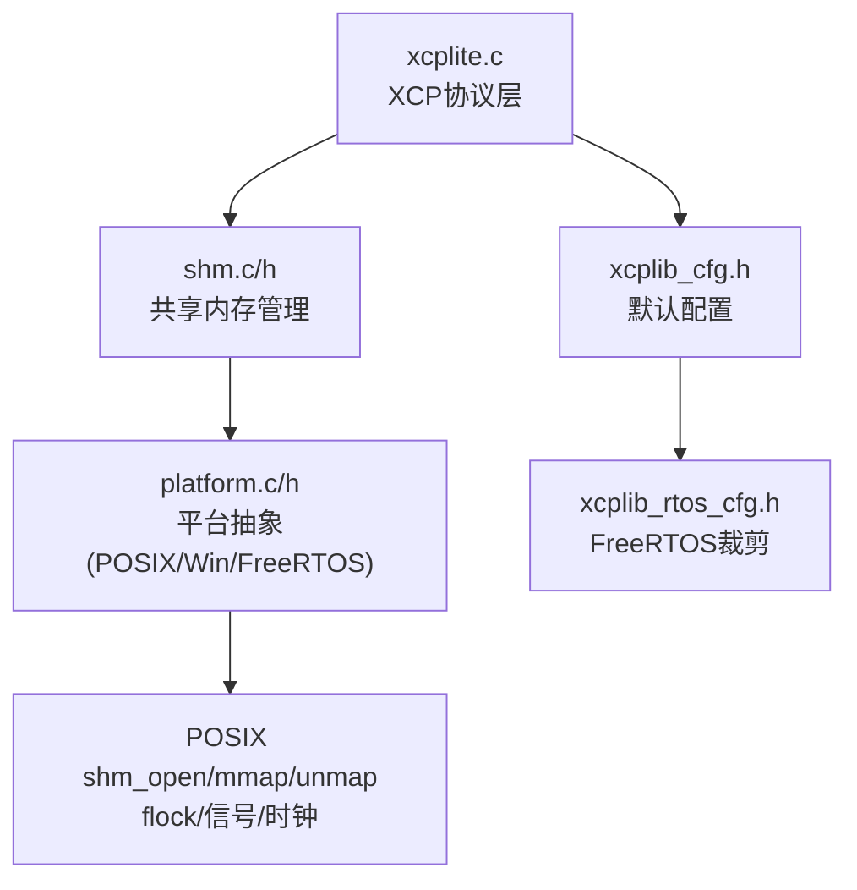
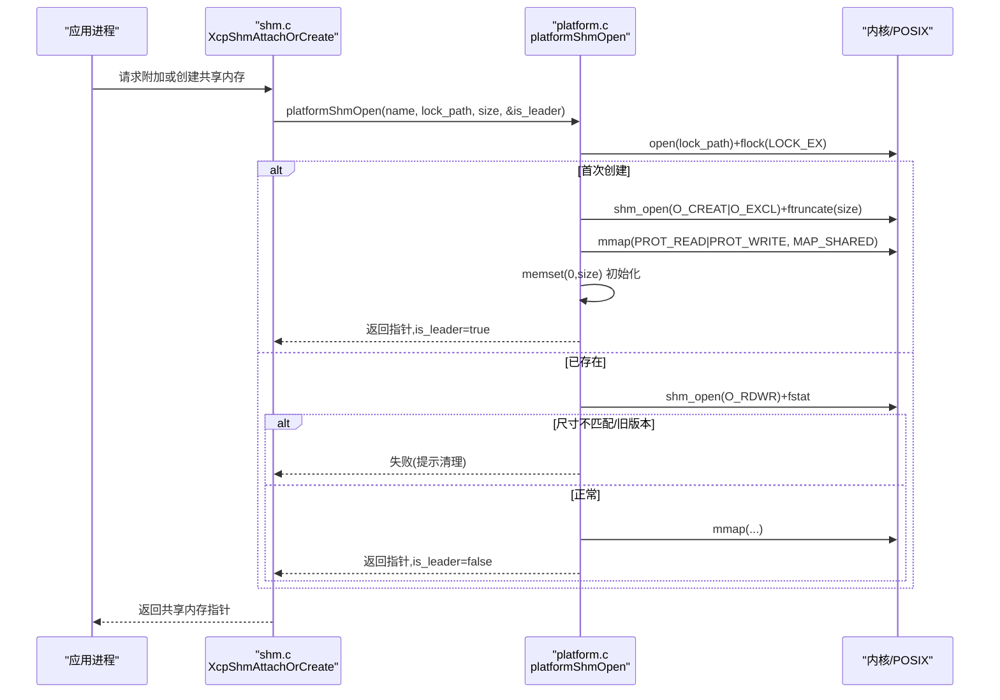
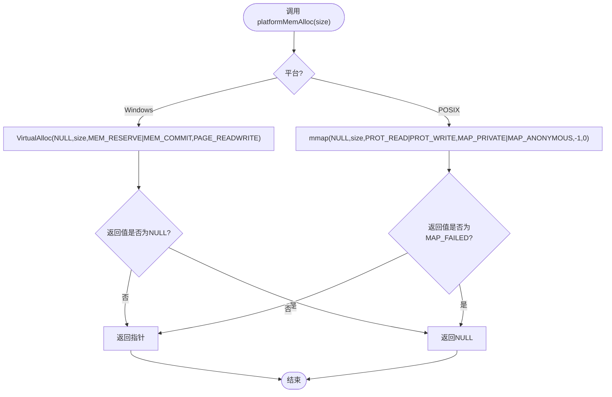
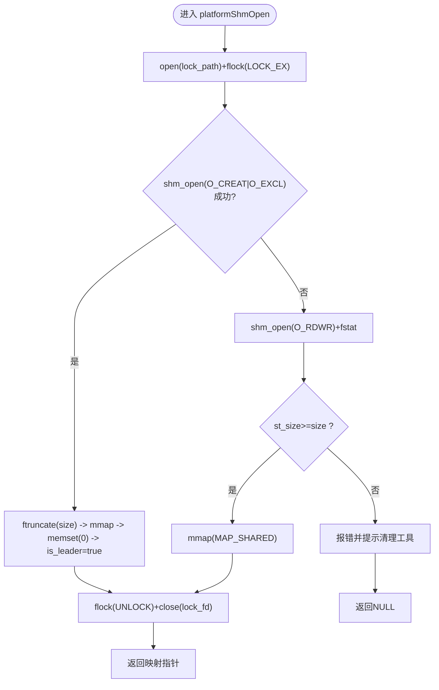
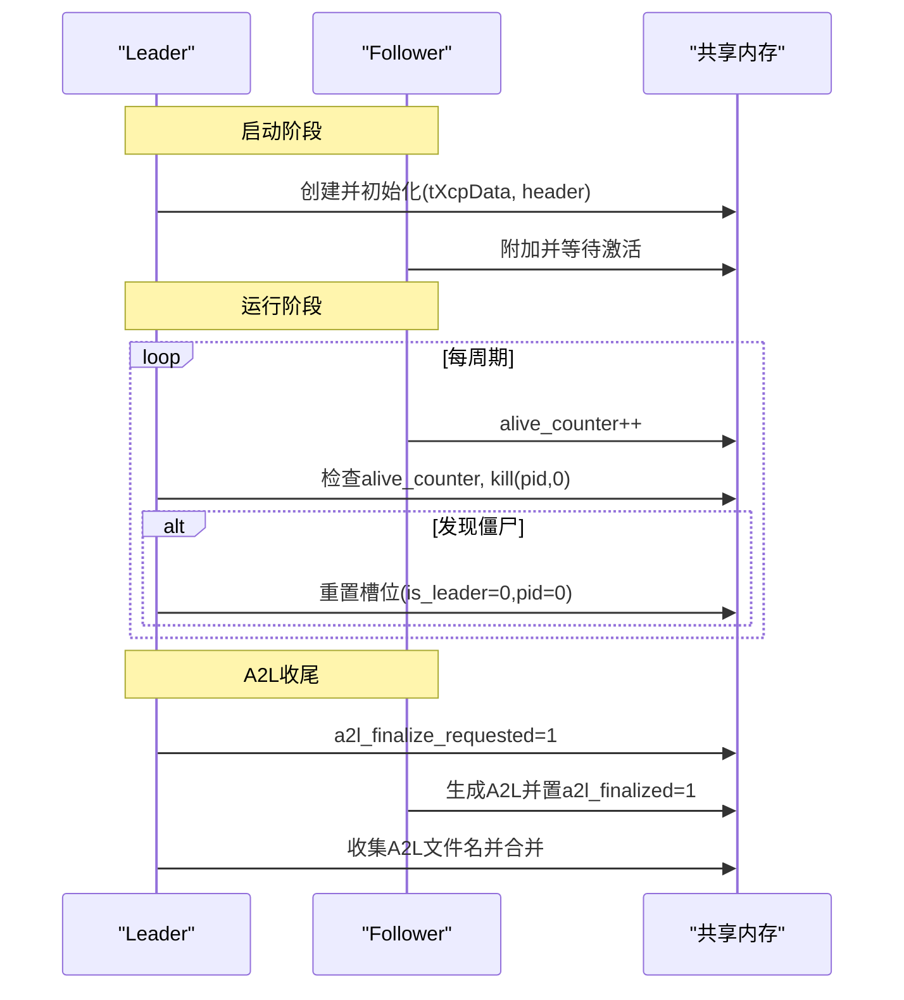
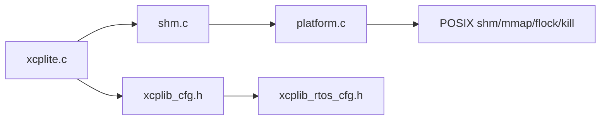

# 内存管理

<cite>
**本文引用的文件**
- [platform.c](file://src/platform.c)
- [platform.h](file://src/platform.h)
- [shm.c](file://src/shm.c)
- [shm.h](file://src/shm.h)
- [xcplite.c](file://src/xcplite.c)
- [xcplib_cfg.h](file://src/xcplib_cfg.h)
- [xcplib_rtos_cfg.h](file://src/xcplib_rtos_cfg.h)
- [SHM.md](file://docs/SHM.md)
</cite>

## 目录
1. [简介](#简介)
2. [项目结构](#项目结构)
3. [核心组件](#核心组件)
4. [架构总览](#架构总览)
5. [详细组件分析](#详细组件分析)
6. [依赖关系分析](#依赖关系分析)
7. [性能考量](#性能考量)
8. [故障排查指南](#故障排查指南)
9. [结论](#结论)
10. [附录](#附录)

## 简介
本文件系统性阐述 XCPlite 的跨平台内存管理与共享内存实现，重点覆盖：
- 平台特定的内存分配器（platformMemAlloc、platformMemFree）的设计与取舍
- POSIX 命名共享对象的创建、映射与清理流程
- 领导者-跟随者（leader-follower）模式在共享内存中的实现机制
- 内存对齐与边界检查的安全措施
- FreeRTOS 环境下的内存限制与优化策略
- 内存泄漏检测与性能调优建议

## 项目结构
XCPlite 将“平台抽象层”和“共享内存管理层”解耦：
- platform.c/h：提供跨平台的原子操作、线程/互斥量、时钟、睡眠、虚拟内存映射等能力；在非 Windows 平台提供 POSIX 共享内存接口。
- shm.c/h：封装 XCP 多应用共享内存的生命周期、注册表、A2L 协同、存活计数、EPK 聚合等。
- xcplite.c：XCP 协议层主实现，使用共享内存指针或本地全局变量两种形态，统一通过宏访问共享状态。
- 配置头：xcplib_cfg.h 定义默认选项；xcplib_rtos_cfg.h 针对 FreeRTOS 进行裁剪与优化。

**图示来源**
- [platform.c:167-187](file://src/platform.c#L167-L187)
- [platform.c:201-360](file://src/platform.c#L201-L360)
- [shm.c:69-215](file://src/shm.c#L69-L215)
- [xcplite.c:188-241](file://src/xcplite.c#L188-L241)

**章节来源**
- [platform.c:167-187](file://src/platform.c#L167-L187)
- [platform.c:201-360](file://src/platform.c#L201-L360)
- [shm.c:69-215](file://src/shm.c#L69-L215)
- [xcplite.c:188-241](file://src/xcplite.c#L188-L241)
- [xcplib_cfg.h:76-162](file://src/xcplib_cfg.h#L76-L162)
- [xcplib_rtos_cfg.h:44-142](file://src/xcplib_rtos_cfg.h#L44-L142)

## 核心组件
- 平台内存分配器
  - platformMemAlloc：在 Windows 使用 VirtualAlloc 保留+提交，在 POSIX 使用匿名 mmap 私有映射。
  - platformMemFree：Windows 调用 VirtualFree 释放，POSIX 调用 munmap。
- POSIX 共享内存接口
  - platformShmOpen：以 flock 序列化 leader 选举窗口，O_CREAT|O_EXCL 创建命名共享对象，ftruncate 设置大小，mmap 映射并清零。
  - platformShmOpenAttach：仅 follower 快速附加到已有共享内存。
  - platformShmClose / platformShmUnlink：解除映射与移除名称。
- 共享内存管理
  - XcpShmAttachOrCreate：尝试附加到现有 SHM，若无效则回收并重新作为 leader 创建。
  - XcpShmRegisterApp：按 project_name + EPK 复用或新增槽位，维护 app_count。
  - 存活计数与失效检测：alive_counter 周期性递增，leader 定期扫描 kill(pid,0) 判断进程是否存活。
  - A2L 协同：a2l_finalize_requested/a2l_finalized 标志协调所有应用完成 A2L 生成。
- 协议层集成
  - 在 OPTION_SHM_MODE 下，gXcpData 为指向共享内存的指针；否则为本地静态实例。
  - 通过 shared/shared_mut 宏统一读写共享状态，保证一致性。

**章节来源**
- [platform.c:167-187](file://src/platform.c#L167-L187)
- [platform.c:201-360](file://src/platform.c#L201-L360)
- [shm.c:69-215](file://src/shm.c#L69-L215)
- [shm.c:526-633](file://src/shm.c#L526-L633)
- [xcplite.c:188-241](file://src/xcplite.c#L188-L241)

## 架构总览
下图展示多进程共享内存模式下，各组件交互与数据流：

**图示来源**
- [platform.c:201-360](file://src/platform.c#L201-L360)
- [shm.c:162-208](file://src/shm.c#L162-L208)

## 详细组件分析

### 平台特定内存分配器（platformMemAlloc/Free）
- 设计考虑
  - 非共享用途的大块内存：优先使用匿名映射（POSIX）或虚拟内存预留（Windows），避免堆分配器的碎片化与系统调用开销。
  - 明确所有权：调用方负责传入 size，确保释放时一致。
  - 错误处理：POSIX 中 mmap 失败返回 MAP_FAILED，需转换为 NULL 并记录错误。
- 复杂度
  - 分配/释放近似 O(1)，受内核页管理影响。
- 安全与边界
  - 未做越界检查，由上层保证 size 与实际使用一致。
  - 在 SHM 模式下，大块内存通常用于共享区域，需配合 ftruncate/mmap 语义。

**图示来源**
- [platform.c:167-187](file://src/platform.c#L167-L187)

**章节来源**
- [platform.c:167-187](file://src/platform.c#L167-L187)

### POSIX 共享内存（命名对象创建、映射与清理）
- 关键流程
  - 使用 flock 对锁文件加独占锁，串行化 leader 选举窗口，避免竞态。
  - 首次成功 shm_open(O_CREAT|O_EXCL) 成为 leader，随后 ftruncate 设定大小并 mmap 映射，memset 清零。
  - 后续进程作为 follower 打开已有对象，fstat 校验大小；若尺寸过小（旧版本）则拒绝并提示清理。
  - 关闭时先 munmap，再按需 shm_unlink 移除名称。
- 安全性
  - 零初始化保证 follower 不会读到脏数据。
  - 尺寸校验防止不同二进制版本混用导致的状态破坏。
- 性能
  - 仅 leader 路径执行 ftruncate/mmap/清零；follower 走 fast path（attach）。

**图示来源**
- [platform.c:201-360](file://src/platform.c#L201-L360)

**章节来源**
- [platform.c:201-360](file://src/platform.c#L201-L360)

### 领导者-跟随者（leader-follower）模式
- 角色定义
  - leader：首个成功创建共享内存的应用，负责初始化 tXcpData 头部、清零、承担 XCP 服务器职责（可选）。
  - follower：后续附加到已有共享内存的应用，等待 leader 激活后开始工作。
- 协作机制
  - XcpShmAttachOrCreate：若检测到无效或未激活的 SHM，则主动 unlink 并重新竞争成为 leader。
  - 存活检测：每个应用后台线程周期性递增 alive_counter；leader 每秒扫描，结合 kill(pid,0) 判定僵尸进程并复位槽位。
  - A2L 协同：server 置 a2l_finalize_requested，各应用完成后置 a2l_finalized；server 收集文件名并合并输出。
- 容错
  - 尺寸不匹配或旧版本残留时拒绝加入，要求手动清理。
  - 无 server 时，下一个以 AUTO/SERVER 模式启动的应用可接管。

**图示来源**
- [shm.c:162-215](file://src/shm.c#L162-L215)
- [shm.c:433-517](file://src/shm.c#L433-L517)
- [shm.c:283-369](file://src/shm.c#L283-L369)

**章节来源**
- [shm.c:162-215](file://src/shm.c#L162-L215)
- [shm.c:433-517](file://src/shm.c#L433-L517)
- [shm.c:283-369](file://src/shm.c#L283-L369)

### 内存对齐与边界检查
- 对齐
  - 共享内存头控制区固定为 64 字节（单缓存行），便于并发访问减少伪共享。
  - 队列与 DAQ 表按平台与配置选择 32/64 位变体，确保原子操作与缓存友好。
- 边界检查
  - 注册应用时严格检查 app_id 范围，越界直接返回错误。
  - 绝对地址模式下，SHM 模式会校验地址扩展中的 app_id 与当前进程一致，防止跨应用误写。
  - 字符串拷贝使用 strncpy + 显式截断，确保 null 终止。
- 一致性
  - 通过 atomic 操作与 acquire/release 语义保证可见性（事件计数、app_count、alive_counter 等）。

**章节来源**
- [shm.h:67-81](file://src/shm.h#L67-L81)
- [xcplite.c:676-707](file://src/xcplite.c#L676-L707)
- [shm.c:526-608](file://src/shm.c#L526-L608)

### FreeRTOS 环境下的内存限制与优化
- 栈与任务
  - 内部任务栈深度与优先级可调；POSIX 模拟器需要更大栈空间。
- 队列与内存池
  - 强制使用 32 位队列（OPTION_QUEUE_32），避免 32 位目标上 64 位原子 RMW 的性能与实现问题。
  - 固定队列缓冲大小，适配嵌入式 SRAM。
- 校准段与 DAQ
  - 限制校准段数量与总内存；DAQ 表内存按信号数估算，避免动态增长。
- 时钟
  - 默认 1us 分辨率，支持自定义 CLOCK_TICKS_PER_S；禁用文件系统相关功能（持久化/A2L 生成/上传）。
- 网络
  - 标准 MTU 1500，禁用 TCP；UDP 通过 lwIP 或原始套接字 HAL。

**章节来源**
- [xcplib_rtos_cfg.h:44-142](file://src/xcplib_rtos_cfg.h#L44-L142)
- [xcplib_cfg.h:143-162](file://src/xcplib_cfg.h#L143-L162)

## 依赖关系分析
- 模块耦合
  - shm.c 依赖 platform.c 的 POSIX 共享内存接口；xcplite.c 通过宏选择 gXcpData 的存储位置（共享/本地）。
  - 配置头决定队列类型、DA M 大小、是否启用 SHM 模式等，直接影响内存布局与行为。
- 外部依赖
  - POSIX：shm_open/mmap/ftruncate/flock/kill。
  - Windows：VirtualAlloc/VirtualFree（仅用于非共享内存分配）。
  - FreeRTOS：任务/信号量/时钟 API。

**图示来源**
- [xcplite.c:188-241](file://src/xcplite.c#L188-L241)
- [shm.c:69-215](file://src/shm.c#L69-L215)
- [platform.c:167-187](file://src/platform.c#L167-L187)

**章节来源**
- [xcplite.c:188-241](file://src/xcplite.c#L188-L241)
- [shm.c:69-215](file://src/shm.c#L69-L215)
- [platform.c:167-187](file://src/platform.c#L167-L187)
- [xcplib_cfg.h:76-162](file://src/xcplib_cfg.h#L76-L162)
- [xcplib_rtos_cfg.h:44-142](file://src/xcplib_rtos_cfg.h#L44-L142)

## 性能考量
- 共享内存路径
  - follower 快速附加：避免重复创建与清零，降低启动延迟。
  - 控制区单缓存行：减少多核伪共享。
  - 原子操作最小化临界区：事件计数采用 relaxed/acquire/release 语义平衡性能与可见性。
- 队列与传输
  - 64 位平台优先使用无锁队列（variable/fixed size），32 位平台退化为有锁队列以降低原子成本。
  - 固定 DTO 大小与队列容量，避免频繁扩容。
- 时钟与延时
  - 短延时 busy-wait + Sleep/nanosleep 组合，长延时直接休眠，降低 CPU 占用。
- FreeRTOS
  - 使用临界区替代互斥量（OPTION_QUEUE32_CRITICAL_SECTION），缩短锁定序列。
  - 限制内存池与事件数量，确保驻留内存稳定。

[本节为通用性能讨论，不直接分析具体代码]

## 故障排查指南
- 共享内存尺寸不匹配
  - 现象：新进程无法附加，提示“SHM 太小/旧版本”。
  - 处理：运行清理脚本删除残留共享对象，重启应用。
- 僵尸应用占用槽位
  - 现象：应用崩溃后 slot 仍显示 alive。
  - 处理：确保后台线程正常运行；必要时手动触发 leader 扫描或重启服务。
- A2L 生成卡住
  - 现象：a2l_finalize_requested 置位但部分应用未完成。
  - 处理：检查应用日志，确认 A2L 生成逻辑；必要时超时重试。
- 内存泄漏检测
  - 建议在测试构建中开启 TEST_ENABLE_DBG_METRICS 与栈测量，观察队列与事件计数变化趋势。
  - 在 POSIX 平台可使用 valgrind 或 AddressSanitizer 验证共享内存映射生命周期。
- 性能瓶颈定位
  - 关注队列获取/释放耗时直方图（TEST_ACQUIRE_LOCK_TIMING），调整队列大小与 DTO 长度。
  - 监控 clockGet/clockGetLast 调用频率，评估时间源开销。

**章节来源**
- [platform.c:273-287](file://src/platform.c#L273-L287)
- [shm.c:466-517](file://src/shm.c#L466-L517)
- [shm.c:283-369](file://src/shm.c#L283-L369)
- [xcplib_cfg.h:178-188](file://src/xcplib_cfg.h#L178-L188)

## 结论
XCPlite 通过清晰的层次划分实现了跨平台内存管理与多应用共享内存协作：
- platform.c 提供稳定的底层能力，屏蔽平台差异。
- shm.c 以 leader-follower 模式组织多进程，保证状态一致性与健壮性。
- 配置驱动使同一代码库适配桌面与嵌入式（FreeRTOS）场景。
- 通过原子操作、缓存行对齐与严格的边界检查，兼顾性能与安全。

[本节为总结，不直接分析具体代码]

## 附录
- 参考文档
  - 共享内存模式技术细节参见 docs/SHM.md，涵盖多应用模式、A2L 合并、工具链等。

**章节来源**
- [SHM.md:1-72](file://docs/SHM.md#L1-L72)